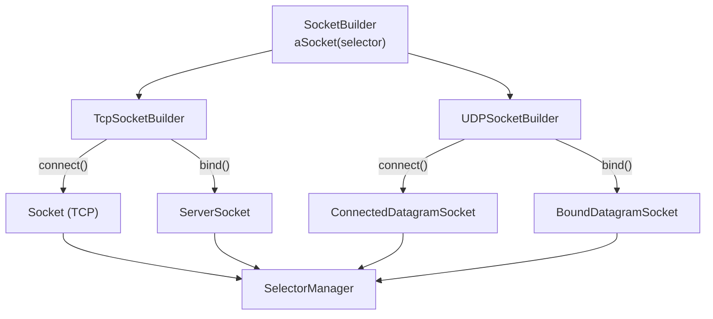
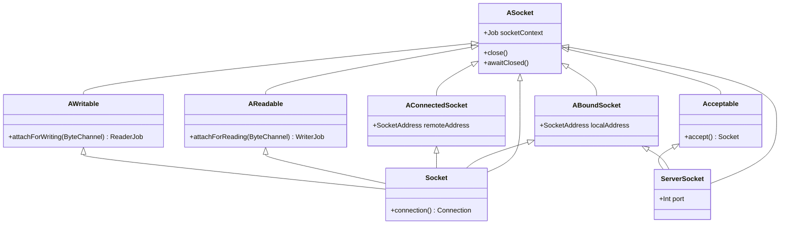
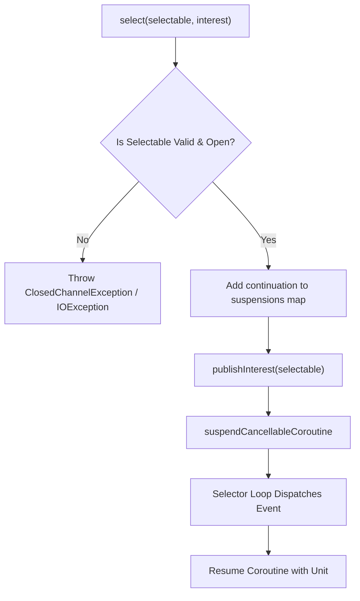

# Sockets and Selectors

<details>
<summary>Relevant source files</summary>

The following files were used as context for generating this wiki page:

- [ktor-network/web/src/io/ktor/network/sockets/SocketEngine.tcp.web.kt](https://github.com/ktorio/ktor/blob/main/ktor-network/web/src/io/ktor/network/sockets/SocketEngine.tcp.web.kt)
- [ktor-network/web/src/io/ktor/network/sockets/SocketEngine.udp.web.kt](https://github.com/ktorio/ktor/blob/main/ktor-network/web/src/io/ktor/network/sockets/SocketEngine.udp.web.kt)
- [ktor-network/jvm/src/io/ktor/network/selector/ActorSelectorManager.kt](https://github.com/ktorio/ktor/blob/main/ktor-network/jvm/src/io/ktor/network/selector/ActorSelectorManager.kt)
- [ktor-network/jvm/src/io/ktor/network/selector/SelectorManagerSupport.kt](https://github.com/ktorio/ktor/blob/main/ktor-network/jvm/src/io/ktor/network/selector/SelectorManagerSupport.kt)
- [ktor-network/posix/src/io/ktor/network/sockets/ConnectUtilsNative.kt](https://github.com/ktorio/ktor/blob/main/ktor-network/posix/src/io/ktor/network/sockets/ConnectUtilsNative.kt)
- [ktor-network/jvm/src/io/ktor/network/selector/SelectorManager.kt](https://github.com/ktorio/ktor/blob/main/ktor-network/jvm/src/io/ktor/network/selector/SelectorManager.kt)
- [ktor-network/nix/src/io/ktor/network/selector/SelectUtilsNix.kt](https://github.com/ktorio/ktor/blob/main/ktor-network/nix/src/io/ktor/network/selector/SelectUtilsNix.kt)
- [ktor-network/jvm/src/io/ktor/network/sockets/ConnectUtilsJvm.kt](https://github.com/ktorio/ktor/blob/main/ktor-network/jvm/src/io/ktor/network/sockets/ConnectUtilsJvm.kt)
- [ktor-network/windows/src/io/ktor/network/selector/SelectUtilsWindows.kt](https://github.com/ktorio/ktor/blob/main/ktor-network/windows/src/io/ktor/network/selector/SelectUtilsWindows.kt)
- [ktor-network/posix/src/io/ktor/network/sockets/DatagramSocketNative.kt](https://github.com/ktorio/ktor/blob/main/ktor-network/posix/src/io/ktor/network/sockets/DatagramSocketNative.kt)
- [ktor-network/common/src/io/ktor/network/sockets/Builders.kt](https://github.com/ktorio/ktor/blob/main/ktor-network/common/src/io/ktor/network/sockets/Builders.kt)
- [ktor-network/jvm/src/io/ktor/network/sockets/UDPSocketBuilderJvm.kt](https://github.com/ktorio/ktor/blob/main/ktor-network/jvm/src/io/ktor/network/sockets/UDPSocketBuilderJvm.kt)
- [ktor-network/posix/src/io/ktor/network/sockets/UDPSocketBuilderNative.kt](https://github.com/ktorio/ktor/blob/main/ktor-network/posix/src/io/ktor/network/sockets/UDPSocketBuilderNative.kt)
- [ktor-network/posix/src/io/ktor/network/sockets/TCPServerSocketNative.kt](https://github.com/ktorio/ktor/blob/main/ktor-network/posix/src/io/ktor/network/sockets/TCPServerSocketNative.kt)
- [ktor-network/jvm/src/io/ktor/network/sockets/NIOSocketImpl.kt](https://github.com/ktorio/ktor/blob/main/ktor-network/jvm/src/io/ktor/network/sockets/NIOSocketImpl.kt)
- [ktor-network/jvm/src/io/ktor/network/sockets/DatagramSocketImpl.kt](https://github.com/ktorio/ktor/blob/main/ktor-network/jvm/src/io/ktor/network/sockets/DatagramSocketImpl.kt)
- [ktor-network/posix/src/io/ktor/network/selector/WorkerSelectorManager.kt](https://github.com/ktorio/ktor/blob/main/ktor-network/selector/WorkerSelectorManager.kt)
- [ktor-network/common/src/io/ktor/network/selector/SelectorManagerCommon.kt](https://github.com/ktorio/ktor/blob/main/ktor-network/common/src/io/ktor/network/selector/SelectorManagerCommon.kt)
- [ktor-network/jvm/src/io/ktor/network/sockets/ServerSocketImpl.kt](https://github.com/ktorio/ktor/blob/main/ktor-network/jvm/src/io/ktor/network/sockets/ServerSocketImpl.kt)
- [ktor-network/common/src/io/ktor/network/sockets/SocketEngine.kt](https://github.com/ktorio/ktor/blob/main/ktor-network/common/src/io/ktor/network/sockets/SocketEngine.kt)
- [ktor-network/posix/src/io/ktor/network/selector/SelectorManager.kt](https://github.com/ktorio/ktor/blob/main/ktor-network/selector/SelectorManager.kt)
- [ktor-network/common/src/io/ktor/network/sockets/TcpSocketBuilder.kt](https://github.com/ktorio/ktor/blob/main/ktor-network/common/src/io/ktor/network/sockets/TcpSocketBuilder.kt)
- [ktor-client/ktor-client-cio/common/src/io/ktor/client/engine/cio/ConnectionFactory.kt](https://github.com/ktorio/ktor/blob/main/ktor-client/ktor-client-cio/common/src/io/ktor/client/engine/cio/ConnectionFactory.kt)
- [ktor-network/web/src/io/ktor/network/selector/SelectorManager.web.kt](https://github.com/ktorio/ktor/blob/main/ktor-network/web/src/io/ktor/network/selector/SelectorManager.web.kt)
- [ktor-network/posix/src/io/ktor/network/sockets/TCPSocketNative.kt](https://github.com/ktorio/ktor/blob/main/ktor-network/posix/src/io/ktor/network/sockets/TCPSocketNative.kt)
- [ktor-network/jvm/src/io/ktor/network/sockets/SocketImpl.kt](https://github.com/ktorio/ktor/blob/main/ktor-network/jvm/src/io/ktor/network/sockets/SocketImpl.kt)
- [ktor-network/common/src/io/ktor/network/sockets/UDPSocketBuilder.kt](https://github.com/ktorio/ktor/blob/main/ktor-network/common/src/io/ktor/network/sockets/UDPSocketBuilder.kt)
- [ktor-network/posix/src/io/ktor/network/sockets/NativeSocketImpl.kt](https://github.com/ktorio/ktor/blob/main/ktor-network/posix/src/io/ktor/network/sockets/NativeSocketImpl.kt)
- [ktor-network/common/src/io/ktor/network/selector/Selectable.kt](https://github.com/ktorio/ktor/blob/main/ktor-network/common/src/io/ktor/network/selector/Selectable.kt)
- [ktor-network/common/src/io/ktor/network/sockets/Sockets.kt](https://github.com/ktorio/ktor/blob/main/ktor-network/sockets/Sockets.kt)
</details>

## Overview

### Overview Details

The `ktor-network` library provides a non-blocking, asynchronous networking and socket abstraction layer built natively on Kotlin Coroutines. It bridges disparate underlying OS and runtime I/O mechanisms—such as Java NIO (`java.nio.channels`), POSIX system calls (`pselect`), Windows WSA events (`WSAWaitForMultipleEvents`), and Node.js network modules (`net` and `dgram`)—into a unified, multiplatform API surface. By decoupling asynchronous notification handling from business logic, the framework allows developers to write sequential, structured asynchronous code for TCP connections, UDP datagrams, and server socket binding without blocking underlying execution threads.

Sources: [ktor-network/common/src/io/ktor/network/sockets/Builders.kt:14-39](https://github.com/ktorio/ktor/blob/main/ktor-network/common/src/io/ktor/network/sockets/Builders.kt#L14-L39)

At its architectural core, the system separates **Sockets** (representing endpoints, streams, datagram channels, and listeners) from **Selectors** (services responsible for multiplexing I/O interest notifications). When an asynchronous operation cannot complete immediately, it registers an interest with a `SelectorManager`, suspending the coroutine until the underlying descriptor or channel becomes ready. This design eliminates thread-per-connection scaling bottlenecks, enabling high-performance client and server implementations like those found in the CIO client engine and HTTP server backends.

Sources: [ktor-network/common/src/io/ktor/network/selector/SelectorManagerCommon.kt:16-45](https://github.com/ktorio/ktor/blob/main/ktor-network/common/src/io/ktor/network/selector/SelectorManagerCommon.kt#L16-L45)



Sources: [ktor-network/common/src/io/ktor/network/sockets/Builders.kt:14-39](https://github.com/ktorio/ktor/blob/main/ktor-network/common/src/io/ktor/network/sockets/Builders.kt#L14-L39)

## Public API and Socket Hierarchy

### Hierarchy Details

The socket abstraction defines a structured interface hierarchy rooted in `ASocket`. All socket types manage their lifecycle via a `socketContext` `Job`, making it possible to integrate sockets cleanly with structured concurrency scopes. A socket is considered closed when its `socketContext` completes, and callers can await closure via `awaitClosed()`.

Sources: [ktor-network/common/src/io/ktor/network/sockets/Sockets.kt:16-34](https://github.com/ktorio/ktor/blob/main/ktor-network/common/src/io/ktor/network/sockets/Sockets.kt#L16-L34)

The primary socket interface types and relationships include `ASocket`, `AConnectedSocket`, `ABoundSocket`, `Acceptable<S>`, `AReadable`, `AWritable`, `Socket`, `ServerSocket`, `BoundDatagramSocket`, and `ConnectedDatagramSocket`.

Sources: [ktor-network/common/src/io/ktor/network/sockets/Sockets.kt:56-177](https://github.com/ktorio/ktor/blob/main/ktor-network/common/src/io/ktor/network/sockets/Sockets.kt#L56-L177)



Sources: [ktor-network/common/src/io/ktor/network/sockets/Sockets.kt:16-177](https://github.com/ktorio/ktor/blob/main/ktor-network/common/src/io/ktor/network/sockets/Sockets.kt#L16-L177)

## Selector Manager Architecture

### Selector Details

The `SelectorManager` interface is responsible for monitoring file descriptors or NIO channels and resuming suspended coroutines when specific I/O events occur. It supports four core select interest kinds (`READ`, `WRITE`, `ACCEPT`, `CONNECT`), plus a platform-specific `CLOSE` interest where applicable.

Sources: [ktor-network/common/src/io/ktor/network/selector/SelectorManagerCommon.kt:25-58](https://github.com/ktorio/ktor/blob/main/ktor-network/common/src/io/ktor/network/selector/SelectorManagerCommon.kt#L25-L58)



Sources: [ktor-network/jvm/src/io/ktor/network/selector/SelectorManagerSupport.kt:37-54](https://github.com/ktorio/ktor/blob/main/ktor-network/jvm/src/io/ktor/network/selector/SelectorManagerSupport.kt#L37-L54)

Platform implementations vary based on the host environment:
- **JVM (`ActorSelectorManager`)**: Operates an actor loop using `java.nio.channels.Selector` powered by a `LockFreeMPSCQueue` for thread-safe interest publication across multiple dispatcher threads.
- **POSIX (`WorkerSelectorManager` / `SelectorHelper`)**: Uses a background coroutine running `selector_pselect` over file descriptor sets (`fd_set`), coordinated via a wakeup signal pipe.
- **Windows (`SelectorHelper`)**: Utilizes `WSAWaitForMultipleEvents` and `WSAEventSelect` to bridge network descriptors with WSA event objects.
- **Web / Node.js (`NoopSelectorManager`)**: Employs event-driven callbacks provided by the Node.js `net` and `dgram` APIs, making explicit selector loops unnecessary.

Sources: [ktor-network/jvm/src/io/ktor/network/selector/ActorSelectorManager.kt:20-63](https://github.com/ktorio/ktor/blob/main/ktor-network/jvm/src/io/ktor/network/selector/ActorSelectorManager.kt#L20-L63), [ktor-network/nix/src/io/ktor/network/selector/SelectUtilsNix.kt:20-54](https://github.com/ktorio/ktor/blob/main/ktor-network/nix/src/io/ktor/network/selector/SelectUtilsNix.kt#L20-L54), [ktor-network/windows/src/io/ktor/network/selector/SelectUtilsWindows.kt:17-36](https://github.com/ktorio/ktor/blob/main/ktor-network/windows/src/io/ktor/network/selector/SelectUtilsWindows.kt#L17-L36), [ktor-network/web/src/io/ktor/network/selector/SelectorManager.web.kt:13-72](https://github.com/ktorio/ktor/blob/main/ktor-network/web/src/io/ktor/network/selector/SelectorManager.web.kt#L13-L72)

## TCP Socket Operations and Mechanics

### TCP Mechanics Details

TCP socket creation, binding, and connecting are initiated via `aSocket(selector).tcp()`. Depending on the target platform, the execution paths handle non-blocking configuration and connection handshakes differently.

Sources: [ktor-network/common/src/io/ktor/network/sockets/TcpSocketBuilder.kt:14-59](https://github.com/ktorio/ktor/blob/main/ktor-network/common/src/io/ktor/network/sockets/TcpSocketBuilder.kt#L14-L59)

On the JVM, `tcpConnect` opens a non-blocking `SocketChannel` using a `SelectorProvider`, configures socket options, and attempts immediate connection. If `channel.connect(target)` returns `false`, it registers a `CONNECT` interest and suspends via `selector.select(this, SelectInterest.CONNECT)` until `finishConnect()` succeeds. It explicitly checks for TCP self-connect anomalies (`inetSelfConnect()`), closing and retrying or failing if a client inadvertently connects to itself without a listener.

Sources: [ktor-network/jvm/src/io/ktor/network/sockets/ConnectUtilsJvm.kt:12-23](https://github.com/ktorio/ktor/blob/main/ktor-network/jvm/src/io/ktor/network/sockets/ConnectUtilsJvm.kt#L12-23), [ktor-network/jvm/src/io/ktor/network/sockets/SocketImpl.kt:43-71](https://github.com/ktorio/ktor/blob/main/ktor-network/jvm/src/io/ktor/network/sockets/SocketImpl.kt#L43-71)

```kotlin
val selectorManager = ActorSelectorManager(Dispatchers.IO)
val socket = aSocket(selectorManager).tcp().connect("127.0.0.1", 8080) {
    noDelay = true
}
val connection = socket.connection()
connection.output.writeFully("PING".toByteArray())
connection.output.flush()
socket.close()
selectorManager.close()
```

Sources: [ktor-network/jvm/src/io/ktor/network/sockets/ConnectUtilsJvm.kt:12-23](https://github.com/ktorio/ktor/blob/main/ktor-network/jvm/src/io/ktor/network/sockets/ConnectUtilsJvm.kt#L12-23), [ktor-network/jvm/src/io/ktor/network/sockets/SocketImpl.kt:43-71](https://github.com/ktorio/ktor/blob/main/ktor-network/jvm/src/io/ktor/network/sockets/SocketImpl.kt#L43-71)

On native targets, `tcpConnect` iterates through resolved socket addresses, allocates a socket via `ktor_socket`, sets non-blocking mode (`nonBlocking(descriptor)`), and invokes `connect`. If `EINPROGRESS` / `EWOULDBLOCK` is returned, it enters a loop waiting for `SelectInterest.CONNECT` and verifies socket error options via `getsockopt(..., SO_ERROR, ...)`.

Sources: [ktor-network/posix/src/io/ktor/network/sockets/ConnectUtilsNative.kt:18-53](https://github.com/ktorio/ktor/blob/main/ktor-network/posix/src/io/ktor/network/sockets/ConnectUtilsNative.kt#L18-53), [ktor-network/posix/src/io/ktor/network/sockets/TCPSocketNative.kt:25-60](https://github.com/ktorio/ktor/blob/main/ktor-network/posix/src/io/ktor/network/sockets/TCPSocketNative.kt#L25-60)

ServerSocket accept operations (`ServerSocket.accept()`) check for pending incoming connections on non-blocking server channels, suspending on `SelectInterest.ACCEPT` when would-block errors occur.

Sources: [ktor-network/jvm/src/io/ktor/network/sockets/ServerSocketImpl.kt:33-44](https://github.com/ktorio/ktor/blob/main/ktor-network/jvm/src/io/ktor/network/sockets/ServerSocketImpl.kt#L33-44), [ktor-network/posix/src/io/ktor/network/sockets/TCPServerSocketNative.kt:38-74](https://github.com/ktorio/ktor/blob/main/ktor-network/posix/src/io/ktor/network/sockets/TCPServerSocketNative.kt#L38-74)

> [!WARNING]
> TCP client sockets can experience local self-connect anomalies (`inetSelfConnect`) if attempting to connect to a local port where no server is listening. On the JVM, Ktor detects this condition post-connection and terminates the channel to prevent silent loopbacks.

Sources: [ktor-network/jvm/src/io/ktor/network/sockets/SocketImpl.kt:52-60](https://github.com/ktorio/ktor/blob/main/ktor-network/jvm/src/io/ktor/network/sockets/SocketImpl.kt#L52-L60)

## UDP Datagram Sockets

### UDP Details

UDP sockets are constructed via `aSocket(selector).udp()`, supporting both bound (`bind()`) and connected (`connect()`) datagram configurations.

Sources: [ktor-network/common/src/io/ktor/network/sockets/UDPSocketBuilder.kt:14-49](https://github.com/ktorio/ktor/blob/main/ktor-network/common/src/io/ktor/network/sockets/UDPSocketBuilder.kt#L14-L49)

Datagram transmission and reception rely on coroutine channels (`ReceiveChannel<Datagram>` and `SendChannel<Datagram>`):
- **Reception**: Incoming datagrams are read into pooled byte buffers (`DefaultDatagramByteBufferPool`). If no datagram is immediately available on non-blocking channels, the implementation sets read interest (`SelectInterest.READ`) and suspends via `selector.select(...)`.
- **Transmission**: `DatagramSendChannel` manages outgoing packets, sending them either to the pre-configured remote address or to the destination address specified within the `Datagram` object.

Sources: [ktor-network/jvm/src/io/ktor/network/sockets/DatagramSocketImpl.kt:16-105](https://github.com/ktorio/ktor/blob/main/ktor-network/jvm/src/io/ktor/network/sockets/DatagramSocketImpl.kt#L16-L105), [ktor-network/posix/src/io/ktor/network/sockets/DatagramSocketNative.kt:19-109](https://github.com/ktorio/ktor/blob/main/ktor-network/posix/src/io/ktor/network/sockets/DatagramSocketNative.kt#L19-L109)

```kotlin
val selectorManager = ActorSelectorManager(Dispatchers.IO)
val boundDatagramSocket = aSocket(selectorManager).udp().bind(localAddress = InetSocketAddress("0.0.0.0", 9000))

val incomingDatagram = boundDatagramSocket.incoming.receive()
val packetBytes = incomingDatagram.packet.readBytes()
boundDatagramSocket.close()
selectorManager.close()
```

Sources: [ktor-network/common/src/io/ktor/network/sockets/UDPSocketBuilder.kt:23-37](https://github.com/ktorio/ktor/blob/main/ktor-network/common/src/io/ktor/network/sockets/UDPSocketBuilder.kt#L23-L37)

## Select Interest and Selection Lifecycle Reference

### Reference Details

The lifecycle of an asynchronous I/O wait operation involves mapping high-level interest flags to platform-specific bitmasks and managing thread wakeups.

Sources: [ktor-network/jvm/src/io/ktor/network/selector/SelectorManager.kt:80-84](https://github.com/ktorio/ktor/blob/main/ktor-network/jvm/src/io/ktor/network/selector/SelectorManager.kt#L80-L84)

| SelectInterest | NIO SelectionKey Flag | POSIX fd_set mapping | Windows WSA Event Mask | Purpose |
| -------------- | --------------------- | -------------------- | ---------------------- | ------- |
| `READ` | `SelectionKey.OP_READ` | `readSet` | `FD_READ \| FD_CLOSE` | Wait until data is available for reading or connection is closed. |
| `WRITE` | `SelectionKey.OP_WRITE` | `writeSet` | `FD_WRITE` | Wait until socket write buffer has space available. |
| `ACCEPT` | `SelectionKey.OP_ACCEPT` | `readSet` | `FD_ACCEPT` | Wait for incoming connection requests on a server socket. |
| `CONNECT` | `SelectionKey.OP_CONNECT` | `writeSet` | `FD_CONNECT` | Wait for non-blocking TCP/UDP connection establishment to complete. |
| `CLOSE` | N/A (Platform specific) | N/A | `FD_CLOSE` | Notify selector and teardown active select loops on descriptor closure. |

Sources: [ktor-network/jvm/src/io/ktor/network/selector/SelectorManager.kt:80-84](https://github.com/ktorio/ktor/blob/main/ktor-network/jvm/src/io/ktor/network/selector/SelectorManager.kt#L80-L84), [ktor-network/nix/src/io/ktor/network/selector/SelectUtilsNix.kt:247-257](https://github.com/ktorio/ktor/blob/main/ktor-network/nix/src/io/ktor/network/selector/SelectUtilsNix.kt#L247-L257), [ktor-network/windows/src/io/ktor/network/selector/SelectUtilsWindows.kt:158-163](https://github.com/ktorio/ktor/blob/main/ktor-network/windows/src/io/ktor/network/selector/SelectUtilsWindows.kt#L158-L163)

> [!NOTE]
> Only one selection continuation is allowed per `SelectInterest` per `Selectable` at any given time. While you can select for `READ` and `WRITE` simultaneously on the same socket, you must never initiate concurrent read operations for the same selectable channel.

Sources: [ktor-network/jvm/src/io/ktor/network/selector/SelectorManager.kt:39-43](https://github.com/ktorio/ktor/blob/main/ktor-network/jvm/src/io/ktor/network/selector/SelectorManager.kt#L39-L43), [ktor-network/common/src/io/ktor/network/selector/SelectorManagerCommon.kt:36-41](https://github.com/ktorio/ktor/blob/main/ktor-network/common/src/io/ktor/network/selector/SelectorManagerCommon.kt#L36-L41)

## Design Trade-offs

### Trade-offs Details

The architectural choices embedded in `ktor-network` balance cross-platform portability against native execution performance.

Sources: [ktor-network/jvm/src/io/ktor/network/selector/ActorSelectorManager.kt:20-63](https://github.com/ktorio/ktor/blob/main/ktor-network/jvm/src/io/ktor/network/selector/ActorSelectorManager.kt#L20-L63)

| Design Choice | Benefit | Cost |
| ------------- | ------- | ---- |
| **Actor-based Selector Management (`ActorSelectorManager`)** | Thread-safe interest registration across coroutines without explicit monitor locking; integrates cleanly with coroutine dispatchers. | Message passing overhead through `LockFreeMPSCQueue` and thread yields during registration loops. |
| **Direct Channel Attachment vs. Pool Buffers** | Optimizes memory allocations by using direct byte buffers (`DefaultDatagramByteBufferPool`) for UDP datagrams to prevent data truncation. | Increased complexity in buffer management and lifecycle tracking across socket implementations. |
| **Platform-specific Selectors (`pselect`, `WSAWaitForMultipleEvents`, `Selector`)** | Maximum fidelity to host OS primitives and optimal polling efficiency on each operating system. | Fragmented internal implementation code across JVM, POSIX, Windows, and Web targets. |
| **Coroutines Channel-based I/O (`incoming` / `outgoing`)** | Seamless integration with Kotlin Flow and structured concurrency for streaming data. | Overhead of channel buffering (`Channel.UNLIMITED`) and coroutine context switching during reads/writes. |

Sources: [ktor-network/jvm/src/io/ktor/network/selector/ActorSelectorManager.kt:20-63](https://github.com/ktorio/ktor/blob/main/ktor-network/jvm/src/io/ktor/network/selector/ActorSelectorManager.kt#L20-L63), [ktor-network/jvm/src/io/ktor/network/sockets/NIOSocketImpl.kt:23-40](https://github.com/ktorio/ktor/blob/main/ktor-network/jvm/src/io/ktor/network/sockets/NIOSocketImpl.kt#L23-40), [ktor-network/nix/src/io/ktor/network/selector/SelectUtilsNix.kt:70-104](https://github.com/ktorio/ktor/blob/main/ktor-network/nix/src/io/ktor/network/selector/SelectUtilsNix.kt#L70-104), [ktor-network/windows/src/io/ktor/network/selector/SelectUtilsWindows.kt:52-81](https://github.com/ktorio/ktor/blob/main/ktor-network/windows/src/io/ktor/network/selector/SelectUtilsWindows.kt#L52-L81)

## Related

- [[TLS and Cryptography]]
- [[CIO Server]]
- [[CIO Client]]

