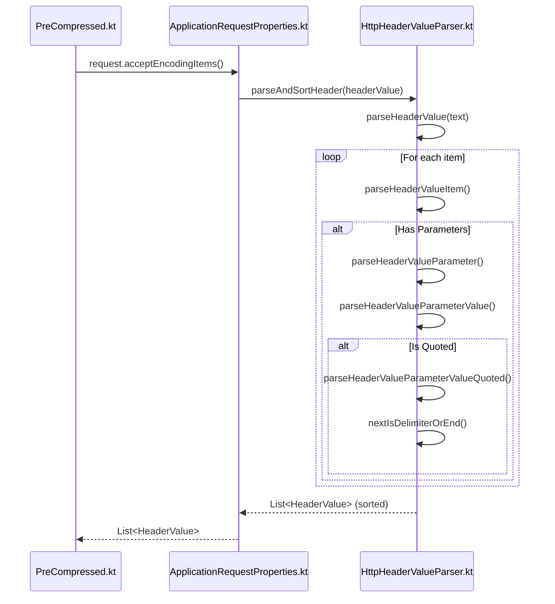
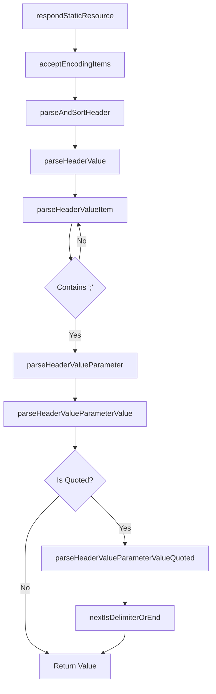

# Static Resource Http Parsing

Relevant source files

The following files were used as context for generating this wiki page:

- [ktor-server/ktor-server-core/jvm/src/io/ktor/server/http/content/PreCompressed.kt](https://github.com/ktorio/ktor/blob/main/ktor-server/ktor-server-core/jvm/src/io/ktor/server/http/content/PreCompressed.kt)
- [ktor-server/ktor-server-core/common/src/io/ktor/server/request/ApplicationRequestProperties.kt](https://github.com/ktorio/ktor/blob/main/ktor-server/ktor-request/ApplicationRequestProperties.kt)
- [ktor-http/common/src/io/ktor/http/HttpHeaderValueParser.kt](https://github.com/ktorio/ktor/blob/main/ktor-http/common/src/io/ktor/http/HttpHeaderValueParser.kt)

## Overview

### Execution Flow Overview

The execution flow from `respondStaticResource` down to `nextIsDelimiterOrEnd` represents how Ktor handles static resources with content negotiation, specifically inspecting client compression preferences. When a client requests a static resource, Ktor checks the `Accept-Encoding` header to see if pre-compressed assets (such as Gzip or Brotli files) can be served. This process involves parsing and sorting header values using robust string-scanning utilities to correctly interpret weights, quoted strings, and delimiters.

Sources: [ktor-server/ktor-server-core/jvm/src/io/ktor/server/http/content/PreCompressed.kt:195-214](https://github.com/ktorio/ktor/blob/main/ktor-server/ktor-server-core/jvm/src/io/ktor/server/http/content/PreCompressed.kt#L195-L214)

---

### Step 1: respondStaticResource

When serving a static resource via `respondStaticResource`, Ktor begins by tagging the call attributes with the requested resource path. It then queries available compression types by inspecting the client's `Accept-Encoding` header.

Sources: [ktor-server/ktor-server-core/jvm/src/io/ktor/server/http/content/PreCompressed.kt:195-214](https://github.com/ktorio/ktor/blob/main/ktor-server/ktor-server-core/jvm/src/io/ktor/server/http/content/PreCompressed.kt#L195-L214)

---

### Step 2: acceptEncodingItems

To read the client's compression capabilities, the request extension `acceptEncodingItems()` is invoked. This retrieves the `Accept-Encoding` header value as a raw string and hands it over to the parsing pipeline to produce a list of structured `HeaderValue` objects.

Sources: [ktor-server/ktor-server-core/common/src/io/ktor/server/request/ApplicationRequestProperties.kt:100-107](https://github.com/ktorio/ktor/blob/main/ktor-server/ktor-server-core/common/src/io/ktor/server/request/ApplicationRequestProperties.kt#L100-L107)

---

### Step 3: parseAndSortHeader

The `parseAndSortHeader` function takes the raw `Accept-Encoding` header string, delegates the tokenization to `parseHeaderValue`, and sorts the resulting encodings in descending order based on their quality factors (`q` parameters).

Sources: [ktor-http/common/src/io/ktor/http/HttpHeaderValueParser.kt:53-60](https://github.com/ktor-http/common/src/io/ktor/http/HttpHeaderValueParser.kt#L53-L60)

---

### Step 4: parseHeaderValue

`parseHeaderValue` checks whether the incoming header text is null. If valid, it iterates through the text string character by character using a position tracker and delegates individual chunks to `parseHeaderValueItem`.

Sources: [ktor-http/common/src/io/ktor/http/HttpHeaderValueParser.kt:80-108](https://github.com/ktor-http/common/src/io/ktor/http/HttpHeaderValueParser.kt#L80-L108)

---

### Step 5: parseHeaderValueItem

As it scans through the header string, `parseHeaderValueItem` identifies comma delimiters (separating multiple header values) and semicolons (indicating parameters like quality values). When a semicolon or comma is encountered, it builds a `HeaderValue` object containing the trimmed value and its associated parameters.

Sources: [ktor-http/common/src/io/ktor/http/HttpHeaderValueParser.kt:122-157](https://github.com/ktor-http/common/src/io/ktor/http/HttpHeaderValueParser.kt#L122-L157)

---

### Step 6: parseHeaderValueParameter

When parameter parsing is triggered by a semicolon, `parseHeaderValueParameter` scans for the equals sign (`=`) separating the parameter name from its value, or encounters secondary delimiters like semicolons or commas which terminate parameter lists.

Sources: [ktor-http/common/src/io/ktor/http/HttpHeaderValueParser.kt:158-189](https://github.com/ktor-http/common/src/io/ktor/http/HttpHeaderValueParser.kt#L158-L189)

---

### Step 7: parseHeaderValueParameterValue

`parseHeaderValueParameterValue` inspects the character immediately following the equals sign. If the value starts with a double quote (`"`), it delegates parsing to the quoted-value handler; otherwise, it scans until a delimiter (`;` or `,`) or the end of the string is reached.

Sources: [ktor-http/common/src/io/ktor/http/HttpHeaderValueParser.kt:190-208](https://github.com/ktor-http/common/src/io/ktor/http/HttpHeaderValueParser.kt#L190-L208)

---

### Step 8: parseHeaderValueParameterValueQuoted

When parsing a quoted parameter value, `parseHeaderValueParameterValueQuoted` accumulates characters into a `StringBuilder`, handling escape sequences (such as `\`) and verifying closing quotation marks via delimiter checks.

Sources: [ktor-http/common/src/io/ktor/http/HttpHeaderValueParser.kt:209-234](https://github.com/ktor-http/common/src/io/ktor/http/HttpHeaderValueParser.kt#L209-L234)

---

### Step 9: nextIsDelimiterOrEnd

The `nextIsDelimiterOrEnd` extension function ensures that a closing quote is genuinely followed by a valid HTTP header delimiter (like a semicolon or comma) or the end of the string, skipping intermediate spaces. This prevents malformed quoting sequences from breaking header parsing.

Sources: [ktor-http/common/src/io/ktor/http/HttpHeaderValueParser.kt:235-243](https://github.com/ktor-http/common/src/io/ktor/http/HttpHeaderValueParser.kt#L235-L243)

---

## Architecture Diagrams

### Sequence Diagram

Sources: [ktor-server/ktor-server-core/jvm/src/io/ktor/server/http/content/PreCompressed.kt:195-214](https://github.com/ktor-http/../ktor-server/ktor-server-core/jvm/src/io/ktor/server/http/content/PreCompressed.kt#L195-L214), [ktor-server/ktor-server-core/common/src/io/ktor/server/request/ApplicationRequestProperties.kt:100-107](https://github.com/ktor-http/../ktor-server/ktor-server-core/common/src/io/ktor/server/request/ApplicationRequestProperties.kt#L100-L107), [ktor-http/common/src/io/ktor/http/HttpHeaderValueParser.kt:53-243](https://github.com/ktor-http/common/src/io/ktor/http/HttpHeaderValueParser.kt#L53-L243)

---

### Flowchart

Sources: [ktor-server/ktor-server-core/jvm/src/io/ktor/server/http/content/PreCompressed.kt:195-214](https://github.com/ktor-http/../ktor-server/ktor-server-core/jvm/src/io/ktor/server/http/content/PreCompressed.kt#L195-L214), [ktor-server/ktor-server-core/common/src/io/ktor/server/request/ApplicationRequestProperties.kt:100-107](https://github.com/ktor-http/../ktor-server/ktor-server-core/common/src/io/ktor/server/request/ApplicationRequestProperties.kt#L100-L107), [ktor-http/common/src/io/ktor/http/HttpHeaderValueParser.kt:53-243](https://github.com/ktor-http/common/src/io/ktor/http/HttpHeaderValueParser.kt#L53-L243)

---

## Key Observations

> [!NOTE]
> **Cross-Module Boundaries**: This execution flow crosses multiple modules within Ktor, transitioning from server-level content negotiation (`ktor-server-core`) to request property helpers and down to low-level HTTP parsing primitives (`ktor-http`).

> [!TIP]
> **Robust Parsing**: The parser handles edge cases gracefully, such as malformed headers, missing quality parameters, and escaped quotes, falling back safely to default weights (`1.0`) or unquoted fallback behaviors.

Sources: [ktor-http/common/src/io/ktor/http/HttpHeaderValueParser.kt:40-51](https://github.com/ktor-http/common/src/io/ktor/http/HttpHeaderValueParser.kt#L40-L51), [ktor-http/common/src/io/ktor/http/HttpHeaderValueParser.kt:209-234](https://github.com/ktor-http/common/src/io/ktor/http/HttpHeaderValueParser.kt#L209-L234)
