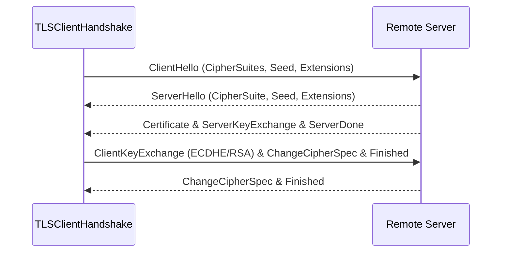
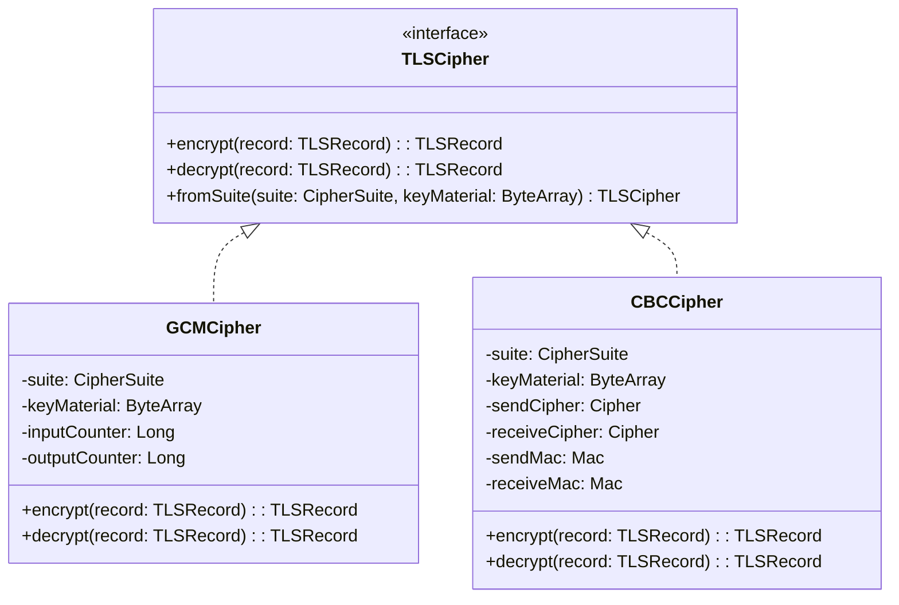
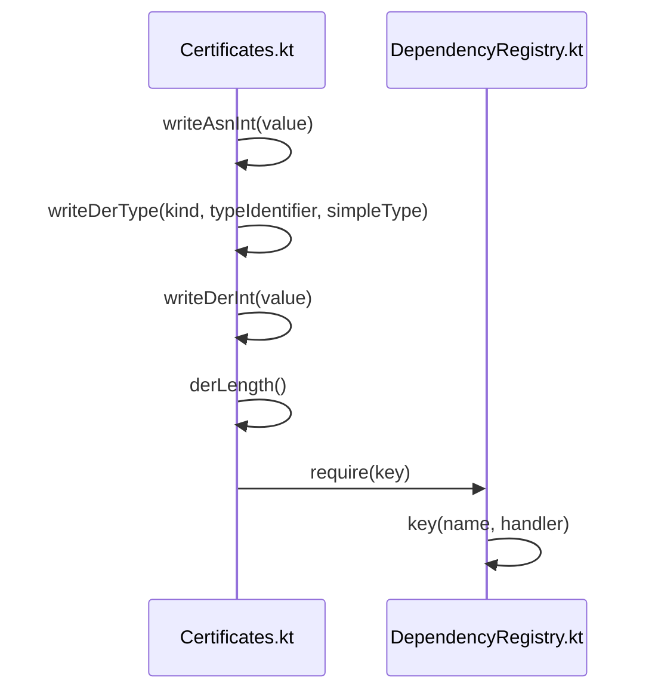

# TLS and Cryptography

<details>
<summary>Relevant source files</summary>

The following files were used as context for generating this wiki page:

- [ktor-network/ktor-network-tls/jvm/src/io/ktor/network/tls/TLSClientHandshake.kt](https://github.com/ktorio/ktor/blob/main/ktor-network/ktor-network-tls/jvm/src/io/ktor/network/tls/TLSClientHandshake.kt)
- [ktor-network/ktor-network-tls/common/src/io/ktor/network/tls/CipherSuites.kt](https://github.com/ktorio/ktor/blob/main/ktor-network/ktor-network-tls/common/src/io/ktor/network/tls/CipherSuites.kt)
- [ktor-network/ktor-network-tls/jvm/src/io/ktor/network/tls/TLSConfigBuilder.kt](https://github.com/ktorio/ktor/blob/main/ktor-network/ktor-network-tls/jvm/src/io/ktor/network/tls/TLSConfigBuilder.kt)
- [ktor-network/ktor-network-tls/jvm/src/io/ktor/network/tls/cipher/CBCCipher.kt](https://github.com/ktorio/ktor/blob/main/ktor-network/ktor-network-tls/jvm/src/io/ktor/network/tls/cipher/CBCCipher.kt)
- [ktor-network/ktor-network-tls/jvm/src/io/ktor/network/tls/cipher/GCMCipher.kt](https://github.com/ktorio/ktor/blob/main/ktor-network/ktor-network-tls/jvm/src/io/ktor/network/tls/cipher/GCMCipher.kt)
- [ktor-network/ktor-network-tls/jvm/src/io/ktor/network/tls/TLS.kt](https://github.com/ktorio/ktor/blob/main/ktor-network/ktor-network-tls/jvm/src/io/ktor/network/tls/TLS.kt)
- [ktor-server/ktor-server-tomcat-jakarta/jvm/src/io/ktor/server/tomcat/jakarta/TomcatApplicationEngine.kt](https://github.com/ktorio/ktor/blob/main/ktor-server/ktor-server-tomcat-jakarta/jvm/src/io/ktor/server/tomcat/jakarta/TomcatApplicationEngine.kt)
- [ktor-network/ktor-network-tls/common/src/io/ktor/network/tls/extensions/SignatureAlgorithm.kt](https://github.com/ktorio/ktor/blob/main/ktor-network/ktor-network-tls/common/src/io/ktor/network/tls/extensions/SignatureAlgorithm.kt)
- [ktor-network/ktor-network-tls/jvm/src/io/ktor/network/tls/TLSClientSessionJvm.kt](https://github.com/ktorio/ktor/blob/main/ktor-network/ktor-network-tls/jvm/src/io/ktor/network/tls/TLSClientSessionJvm.kt)
- [ktor-network/ktor-network-tls/jvm/src/io/ktor/network/tls/Render.kt](https://github.com/ktorio/ktor/blob/main/ktor-network/ktor-network-tls/jvm/src/io/ktor/network/tls/Render.kt)
- [ktor-network/ktor-network-tls/nonJvm/src/io/ktor/network/tls/TLS.nonJvm.kt](https://github.com/ktorio/ktor/blob/main/ktor-network/ktor-network-tls/nonJvm/src/io/ktor/network/tls/TLS.nonJvm.kt)
- [ktor-server/ktor-server-netty/jvm/src/io/ktor/server/netty/NettyChannelInitializer.kt](https://github.com/ktorio/ktor/blob/main/ktor-server/ktor-server-netty/jvm/src/io/ktor/server/netty/NettyChannelInitializer.kt)
- [ktor-network/ktor-network-tls/ktor-network-tls-certificates/jvm/src/io/ktor/network/tls/certificates/builders.kt](https://github.com/ktorio/ktor/blob/main/ktor-network/ktor-network-tls/ktor-network-tls-certificates/jvm/src/io/ktor/network/tls/certificates/builders.kt)
- [ktor-network/ktor-network-tls/jvm/src/io/ktor/network/tls/Parser.kt](https://github.com/ktorio/ktor/blob/main/ktor-network/ktor-network-tls/jvm/src/io/ktor/network/tls/Parser.kt)
- [ktor-network/ktor-network-tls/jvm/src/io/ktor/network/tls/cipher/Cipher.kt](https://github.com/ktorio/ktor/blob/main/ktor-network/ktor-network-tls/jvm/src/io/ktor/network/tls/cipher/Cipher.kt)
- [ktor-network/ktor-network-tls/common/src/io/ktor/network/tls/TLSCommon.kt](https://github.com/ktorio/ktor/blob/main/ktor-network/ktor-network-tls/common/src/io/ktor/network/tls/TLSCommon.kt)
- [ktor-network/ktor-network-tls/jvm/src/io/ktor/network/tls/TLSConfigJvm.kt](https://github.com/ktorio/ktor/blob/main/ktor-network/ktor-network-tls/jvm/src/io/ktor/network/tls/TLSConfigJvm.kt)
- [ktor-network/ktor-network-tls/jvm/src/io/ktor/network/tls/CipherSuitesJvm.kt](https://github.com/ktorio/ktor/blob/main/ktor-network/ktor-network-tls/jvm/src/io/ktor/network/tls/CipherSuitesJvm.kt)
- [ktor-network/ktor-network-tls/nonJvm/src/io/ktor/network/tls/CipherSuites.nonJvm.kt](https://github.com/ktorio/ktor/blob/main/ktor-network/ktor-network-tls/nonJvm/src/io/ktor/network/tls/CipherSuites.nonJvm.kt)
- [ktor-network/ktor-network-tls/jvm/src/io/ktor/network/tls/Keys.kt](https://github.com/ktorio/ktor/blob/main/ktor-network/ktor-network-tls/jvm/src/io/ktor/network/tls/Keys.kt)
- [ktor-network/ktor-network-tls/nonJvm/src/io/ktor/network/tls/TLSClientSession.nonJvm.kt](https://github.com/ktorio/ktor/blob/main/ktor-network/ktor-network-tls/nonJvm/src/io/ktor/network/tls/TLSClientSession.nonJvm.kt)
- [ktor-network/ktor-network-tls/jvm/src/io/ktor/network/tls/TLSHandshakeType.kt](https://github.com/ktorio/ktor/blob/main/ktor-network/ktor-network-tls/jvm/src/io/ktor/network/tls/TLSHandshakeType.kt)
- [ktor-network/ktor-network-tls/common/src/io/ktor/network/tls/TLSClientSession.kt](https://github.com/ktorio/ktor/blob/main/ktor-network/ktor-network-tls/common/src/io/ktor/network/tls/TLSClientSession.kt)
- [ktor-network/ktor-network-tls/ktor-network-tls-certificates/jvm/src/io/ktor/network/tls/certificates/Certificates.kt](https://github.com/ktorio/ktor/blob/main/ktor-network/ktor-network-tls/ktor-network-tls-certificates/jvm/src/io/ktor/network/tls/certificates/Certificates.kt)
- [ktor-server/ktor-server-plugins/ktor-server-di/common/src/io/ktor/server/plugins/di/DependencyRegistry.kt](https://github.com/ktorio/ktor/blob/main/ktor-server/ktor-server-plugins/ktor-server-di/common/src/io/ktor/server/plugins/di/DependencyRegistry.kt)
</details>

## Overview

Transport Layer Security (TLS) and cryptography implementation within Ktor provides secure network communication capabilities across raw sockets and application server engines. The framework provides a pure-Kotlin client-side TLS negotiation engine (`ktor-network-tls`) that wraps raw socket streams into secure channels, manages cryptographic handshakes, implements cipher suites like GCM and CBC, and parses X.509 certificates.

Sources: [ktor-network/ktor-network-tls/jvm/src/io/ktor/network/tls/TLSClientHandshake.kt:33-110](https://github.com/ktorio/ktor/blob/main/ktor-network/ktor-network-tls/jvm/src/io/ktor/network/tls/TLSClientHandshake.kt#L33-L110)

The architecture separates protocol framing, cryptographic transformations, and configuration management. The client-side TLS implementation (`TLSClientHandshake`) drives the TLS 1.2 handshake protocol over coroutine-backed channels (`ReceiveChannel` and `SendChannel`), maintaining cryptographic message digests for verification.

Sources: [ktor-network/ktor-network-tls/jvm/src/io/ktor/network/tls/TLSClientHandshake.kt:33-110](https://github.com/ktorio/ktor/blob/main/ktor-network/ktor-network-tls/jvm/src/io/ktor/network/tls/TLSClientHandshake.kt#L33-L110)

Cipher execution is delegated to specialized implementations (`GCMCipher` and `CBCCipher`) that handle AEAD or block cipher encryption, decryption, padding validation, and message authentication code verification based on derived key material.

Sources: [ktor-network/ktor-network-tls/jvm/src/io/ktor/network/tls/cipher/CBCCipher.kt:15-68](https://github.com/ktorio/ktor/blob/main/ktor-network/ktor-network-tls/jvm/src/io/ktor/network/tls/cipher/CBCCipher.kt#L15-L68)

| Design Choice | Benefit | Cost |
| :--- | :--- | :--- |
| **Pure Coroutine Handshake Engine** | Non-blocking socket I/O integrated directly into Kotlin coroutine scopes. | Handshake control flow must manually handle state parsing and message framing. |
| **Delegated Java Cryptography Architecture** | Leverages standard JVM `Cipher` and `Mac` provider primitives for hardware acceleration. | Non-JVM targets cannot run native client-side TLS sessions (`openTLSSession` throws error). |
| **Separate Parsing and Rendering Buffers** | Direct `Source` and `Sink` binary serializations prevent unnecessary buffer allocations. | Precise offset and byte-length calculations required when writing DER and TLS records. |

Sources: [ktor-network/ktor-network-tls/jvm/src/io/ktor/network/tls/TLSClientHandshake.kt:65-146](https://github.com/ktorio/ktor/blob/main/ktor-network/ktor-network-tls/jvm/src/io/ktor/network/tls/TLSClientHandshake.kt#L65-L146), [ktor-network/ktor-network-tls/nonJvm/src/io/ktor/network/tls/TLSClientSession.nonJvm.kt:18-20](https://github.com/ktorio/ktor/blob/main/ktor-network/ktor-network-tls/nonJvm/src/io/ktor/network/tls/TLSClientSession.nonJvm.kt#L18-L20)

## Client TLS Session Negotiation and Lifecycle

The client-side TLS session establishment begins when a raw `Socket` connection is upgraded via the `tls()` extension function. This initializes a `TLSClientHandshake` coroutine scope containing an input parser loop and an output encoder actor. The `negotiate()` method executes the complete handshake state machine.



Sources: [ktor-network/ktor-network-tls/jvm/src/io/ktor/network/tls/TLSClientHandshake.kt:182-238](https://github.com/ktorio/ktor/blob/main/ktor-network/ktor-network-tls/jvm/src/io/ktor/network/tls/TLSClientHandshake.kt#L182-L238)

During negotiation, `sendClientHello()` transmits the client random seed, supported cipher suites, TLS version (TLS 1.2), and extensions including signature algorithms, elliptic curves, point formats, and SNI hostnames. The client then awaits `receiveServerHello()` and validates the chosen cipher suite and signature algorithms against local configuration in `verifyHello()`.

Sources: [ktor-network/ktor-network-tls/jvm/src/io/ktor/network/tls/Render.kt:32-72](https://github.com/ktorio/ktor/blob/main/ktor-network/ktor-network-tls/jvm/src/io/ktor/network/tls/Render.kt#L32-L72)

The execution trace for client handshake negotiation proceeds through the following internal phases:
1. `negotiate()` invokes `sendClientHello()` to dispatch the initial handshake record.
2. `receiveServerHello()` reads and parses the incoming `ServerHello` record and establishes the agreed cipher suite.
3. `verifyHello()` checks that the server's chosen cipher suite is supported in `config.cipherSuites` and verifies common signature algorithms.
4. `handleCertificatesAndKeys()` processes server certificates, optional certificate requests, elliptic curve parameters, and verifies digital signatures against the server's public key.
5. `handleServerDone()` computes the pre-master secret via `generatePreSecret()`, derives the master secret, sends client keys, change cipher spec, and finalizes the handshake with `sendClientFinished()`.

Sources: [ktor-network/ktor-network-tls/jvm/src/io/ktor/network/tls/TLSClientHandshake.kt:182-352](https://github.com/ktorio/ktor/blob/main/ktor-network/ktor-network-tls/jvm/src/io/ktor/network/tls/TLSClientHandshake.kt#L182-L352)

> [!NOTE]
> If a remote server closes the connection unexpectedly during handshake negotiation, `ClosedSendChannelException` is caught and wrapped into a descriptive `TLSException` indicating negotiation failure due to end-of-stream.

Sources: [ktor-network/ktor-network-tls/jvm/src/io/ktor/network/tls/TLSClientSessionJvm.kt:29-39](https://github.com/ktorio/ktor/blob/main/ktor-network/ktor-network-tls/jvm/src/io/ktor/network/tls/TLSClientSessionJvm.kt#L29-L39)

## Cipher Suites and Cryptographic Algorithms

Ktor defines cryptographic cipher suites through the `CipherSuite` data class and the `CIOCipherSuites` object collection. Supported cipher suites cover both Galois/Counter Mode (GCM) AEAD ciphers and Cipher Block Chaining (CBC) ciphers combined with RSA or ECDHE key exchange.

Sources: [ktor-network/ktor-network-tls/common/src/io/ktor/network/tls/CipherSuites.kt:77-95](https://github.com/ktorio/ktor/blob/main/ktor-network/ktor-network-tls/common/src/io/ktor/network/tls/CipherSuites.kt#L77-L95)

| Cipher Suite Name | Code | Exchange Type | JDK Cipher Name | Key Strength (Bits) | Hash Algorithm |
| :--- | :--- | :--- | :--- | :--- | :--- |
| `TLS_RSA_WITH_AES_128_GCM_SHA256` | `0x009c` | `RSA` | `AES/GCM/NoPadding` | 128 | `SHA256` |
| `TLS_ECDHE_ECDSA_WITH_AES_256_GCM_SHA384` | `0xc02c` | `ECDHE` | `AES/GCM/NoPadding` | 256 | `SHA384` |
| `TLS_ECDHE_ECDSA_WITH_AES_128_GCM_SHA256` | `0xc02b` | `ECDHE` | `AES/GCM/NoPadding` | 128 | `SHA256` |
| `TLS_ECDHE_RSA_WITH_AES_256_GCM_SHA384` | `0xc030` | `ECDHE` | `AES/GCM/NoPadding` | 256 | `SHA384` |
| `TLS_ECDHE_RSA_WITH_AES_128_GCM_SHA256` | `0xc02f` | `ECDHE` | `AES/GCM/NoPadding` | 128 | `SHA256` |
| `TLS_RSA_WITH_AES_256_CBC_SHA` | `0x0035` | `RSA` | `AES/CBC/NoPadding` | 256 | `SHA256` |
| `TLS_RSA_WITH_AES_128_CBC_SHA` | `0x002F` | `RSA` | `AES/CBC/NoPadding` | 128 | `SHA256` |

Sources: [ktor-network/ktor-network-tls/common/src/io/ktor/network/tls/CipherSuites.kt:105-172](https://github.com/ktorio/ktor/blob/main/ktor-network/ktor-network-tls/common/src/io/ktor/network/tls/CipherSuites.kt#L105-L172)

Platform-specific support validation checks runtime Java versions against key strength thresholds. On JVM platforms, `CipherSuite.isSupported()` permits cipher suites up to 256-bit strength on modern JDK runtimes while restricting older update versions. On non-JVM platforms, TLS client sessions are not supported.

Sources: [ktor-network/ktor-network-tls/jvm/src/io/ktor/network/tls/CipherSuitesJvm.kt:9-14](https://github.com/ktorio/ktor/blob/main/ktor-network/ktor-network-tls/jvm/src/io/ktor/network/tls/CipherSuitesJvm.kt#L9-L14), [ktor-network/ktor-network-tls/nonJvm/src/io/ktor/network/tls/CipherSuites.nonJvm.kt:9](https://github.com/ktorio/ktor/blob/main/ktor-network/ktor-network-tls/nonJvm/src/io/ktor/network/tls/CipherSuites.nonJvm.kt#L9), [ktor-network/ktor-network-tls/nonJvm/src/io/ktor/network/tls/TLSClientSession.nonJvm.kt:18](https://github.com/ktorio/ktor/blob/main/ktor-network/ktor-network-tls/nonJvm/src/io/ktor/network/tls/TLSClientSession.nonJvm.kt#L18)

> [!WARNING]
> CBC mode ciphers perform explicit padding and MAC verification during decryption. Any failure in padding validation or HMAC comparison throws a `TLSException` to prevent padding oracle attacks.

Sources: [ktor-network/ktor-network-tls/jvm/src/io/ktor/network/tls/cipher/CBCCipher.kt:97-125](https://github.com/ktorio/ktor/blob/main/ktor-network/ktor-network-tls/jvm/src/io/ktor/network/tls/cipher/CBCCipher.kt#L97-L125)

## Record Encryption and Decryption Ciphers

The `TLSCipher` interface defines encryption and decryption handlers for TLS records, instantiated via `TLSCipher.fromSuite()` based on the negotiated `CipherType` (`GCM` or `CBC`).



Sources: [ktor-network/ktor-network-tls/jvm/src/io/ktor/network/tls/cipher/Cipher.kt:10-23](https://github.com/ktorio/ktor/blob/main/ktor-network/ktor-network-tls/jvm/src/io/ktor/network/tls/cipher/Cipher.kt#L10-L23)

- **`GCMCipher`**: Implements Galois/Counter Mode AEAD encryption. It builds an initialization vector (IV) by combining the client/server fixed IV with the record IV and packet counter. It updates the cipher with Additional Authenticated Data (AAD) containing sequence numbers, record type, TLS version, and content length before processing data.

Sources: [ktor-network/ktor-network-tls/jvm/src/io/ktor/network/tls/cipher/GCMCipher.kt:12-55](https://github.com/ktorio/ktor/blob/main/ktor-network/ktor-network-tls/jvm/src/io/ktor/network/tls/cipher/GCMCipher.kt#L12-L55)

- **`CBCCipher`**: Implements Cipher Block Chaining mode with HMAC authentication. During encryption, it computes the MAC over a 13-byte TLS record header and plaintext content, appends PKCS#7-style padding, and encrypts the combined payload. During decryption, it decrypts the ciphertext, validates the padding bytes, verifies the HMAC using `MessageDigest.isEqual`, and strips padding and MAC bytes.

Sources: [ktor-network/ktor-network-tls/jvm/src/io/ktor/network/tls/cipher/CBCCipher.kt:15-126](https://github.com/ktorio/ktor/blob/main/ktor-network/ktor-network-tls/jvm/src/io/ktor/network/tls/cipher/CBCCipher.kt#L15-L126)

## TLS Configuration and Builder API

The `TLSConfig` class and `TLSConfigBuilder` DSL allow developers to configure client-side security parameters. Configuration properties include trust managers, secure random number generators, client certificates, allowed cipher suites, and SNI server names.

Sources: [ktor-network/ktor-network-tls/jvm/src/io/ktor/network/tls/TLSConfigBuilder.kt:18-83](https://github.com/ktorio/ktor/blob/main/ktor-network/ktor-network-tls/jvm/src/io/ktor/network/tls/TLSConfigBuilder.kt#L18-L83)

```kotlin
val config = TLSConfigBuilder().apply {
    serverName = "example.com"
    trustManager = customTrustManager
    cipherSuites = listOf(CIOCipherSuites.TLS_ECDHE_RSA_WITH_AES_128_GCM_SHA256)
}.build()
```

Sources: [ktor-network/ktor-network-tls/jvm/src/io/ktor/network/tls/TLSConfigBuilder.kt:18-83](https://github.com/ktorio/ktor/blob/main/ktor-network/ktor-network-tls/jvm/src/io/ktor/network/tls/TLSConfigBuilder.kt#L18-L83)

The builder provides convenience methods such as `addCertificateChain(chain, key)` and `addKeyStore(store, password, alias)` to load client authentication credentials from Java `KeyStore` instances. If no custom trust manager is supplied, `findTrustManager()` initializes a default `X509TrustManager` backed by the platform's default trust store.

Sources: [ktor-network/ktor-network-tls/jvm/src/io/ktor/network/tls/TLSConfigBuilder.kt:108-172](https://github.com/ktorio/ktor/blob/main/ktor-network/ktor-network-tls/jvm/src/io/ktor/network/tls/TLSConfigBuilder.kt#L108-L172)

| Property | Type | Default Value | Description |
| :--- | :--- | :--- | :--- |
| `certificates` | `MutableList<CertificateAndKey>` | `mutableListOf()` | Client certificate chains and private keys. |
| `random` | `SecureRandom?` | `null` | Cryptographic random number generator. |
| `trustManager` | `TrustManager?` | System default | Server authority trust manager (`X509TrustManager`). |
| `cipherSuites` | `List<CipherSuite>` | `CIOCipherSuites.SupportedSuites` | List of allowed cipher suites. |
| `serverName` | `String?` | `null` | SNI hostname extension value. |

Sources: [ktor-network/ktor-network-tls/jvm/src/io/ktor/network/tls/TLSConfigBuilder.kt:29-69](https://github.com/ktorio/ktor/blob/main/ktor-network/ktor-network-tls/jvm/src/io/ktor/network/tls/TLSConfigBuilder.kt#L29-L69)

## Certificate and Key Store Generation

The `ktor-network-tls-certificates` artifact provides utilities for generating X.509 certificates and Java KeyStores for testing and development. The `generateCertificate()` and `buildKeyStore {}` builders construct DER-encoded certificates supporting RSA and ECDSA signature algorithms, configurable validity periods, and Subject Alternative Names (SAN) for domains and IP addresses.

Sources: [ktor-network/ktor-network-tls/ktor-network-tls-certificates/jvm/src/io/ktor/network/tls/certificates/builders.kt:46-75](https://github.com/ktorio/ktor/blob/main/ktor-network/ktor-network-tls/ktor-network-tls-certificates/jvm/src/io/ktor/network/tls/certificates/builders.kt#L46-L75)

The following runnable example demonstrates generating a self-signed key store and using it to initiate a TLS client socket connection:

```kotlin
import io.ktor.network.sockets.*
import io.ktor.network.tls.*
import io.ktor.network.tls.certificates.*
import kotlinx.coroutines.runBlocking
import java.io.File
import java.net.InetSocketAddress

fun main() = runBlocking {
    // 1. Generate a self-signed certificate and store it in a KeyStore
    val keyStore = generateCertificate(
        file = File("build/temporary_keystore.jks"),
        algorithm = "SHA256withRSA",
        keyAlias = "sampleAlias",
        keyPassword = "changeit",
        keySizeInBits = 2048,
        keyType = KeyType.Server
    )

    // 2. Connect raw TCP socket and upgrade to TLS
    val selector = ActorSelectorManager(coroutineContext)
    val rawSocket = aSocket(selector).tcp().connect(InetSocketAddress("127.0.0.1", 8443))
    
    val tlsSocket = rawSocket.tls(coroutineContext) {
        serverName = "localhost"
        trustManager = keyStore.trustManagers.first()
    }
    
    tlsSocket.close()
}
```

Sources: [ktor-network/ktor-network-tls/ktor-network-tls-certificates/jvm/src/io/ktor/network/tls/certificates/builders.kt:46-75](https://github.com/ktorio/ktor/blob/main/ktor-network/ktor-network-tls/ktor-network-tls-certificates/jvm/src/io/ktor/network/tls/certificates/builders.kt#L46-L75), [ktor-network/ktor-network-tls/ktor-network-tls-certificates/jvm/src/io/ktor/network/tls/certificates/Certificates.kt:209-211](https://github.com/ktorio/ktor/blob/main/ktor-network/ktor-network-tls/ktor-network-tls-certificates/jvm/src/io/ktor/network/tls/certificates/Certificates.kt#L209-L211), [ktor-network/ktor-network-tls/jvm/src/io/ktor/network/tls/TLS.kt:25-40](https://github.com/ktorio/ktor/blob/main/ktor-network/ktor-network-tls/jvm/src/io/ktor/network/tls/TLS.kt#L25-L40)

## DER Serialization and Call-Chain Execution Walkthrough

The certificate generation subsystem serializes X.509 structure fields into Distinguished Encoding Rules (DER) byte structures. When encoding integer properties or extension type flags, execution follows a strict sequence of lower-level DER writing functions:



Sources: [ktor-network/ktor-network-tls/ktor-network-tls-certificates/jvm/src/io/ktor/network/tls/certificates/Certificates.kt:470-589](https://github.com/ktorio/ktor/blob/main/ktor-network/ktor-network-tls/ktor-network-tls-certificates/jvm/src/io/ktor/network/tls/certificates/Certificates.kt#L470-L589), [ktor-server/ktor-server-plugins/ktor-server-di/common/src/io/ktor/server/plugins/di/DependencyRegistry.kt:70-131](https://github.com/ktorio/ktor/blob/main/ktor-server/ktor-server-plugins/ktor-server-di/common/src/io/ktor/server/plugins/di/DependencyRegistry.kt#L70-L131)

Tracing the call chain step-by-step:
1. `writeAsnInt()` receives an integer value to serialize and invokes `writeDerType(0, 2, true)` to emit tag `0x02` (INTEGER).
2. `writeDerType()` checks whether `typeIdentifier` fits in a single byte (0..30). For extended type identifiers greater than 30, it emits `0x1f` and delegates encoding of `typeIdentifier` to `writeDerInt()`.
3. `writeDerInt()` calculates the necessary byte count by calling `derLength()` and encodes 7-bit chunks with continuation flags (mask `0x80`).
4. `derLength()` determines the variable byte representation length using a bitwise mask `0x7f`.
5. In order to register key-based dependencies during runtime dependency injection or key context construction, `require()` receives a `DependencyKey` and registers it into the requirements map.
6. `key()` instantiates and configures a `KeyContext` tied to the given `DependencyKey`.

Sources: [ktor-network/ktor-network-tls/ktor-network-tls-certificates/jvm/src/io/ktor/network/tls/certificates/Certificates.kt:470-490](https://github.com/ktorio/ktor/blob/main/ktor-network/ktor-network-tls/ktor-network-tls-certificates/jvm/src/io/ktor/network/tls/certificates/Certificates.kt#L470-L490), [ktor-network/ktor-network-tls/ktor-network-tls-certificates/jvm/src/io/ktor/network/tls/certificates/Certificates.kt:525-538](https://github.com/ktorio/ktor/blob/main/ktor-network/ktor-network-tls/ktor-network-tls-certificates/jvm/src/io/ktor/network/tls/certificates/Certificates.kt#L525-L538), [ktor-network/ktor-network-tls/ktor-network-tls-certificates/jvm/src/io/ktor/network/tls/certificates/Certificates.kt:576-589](https://github.com/ktorio/ktor/blob/main/ktor-network/ktor-network-tls/ktor-network-tls-certificates/jvm/src/io/ktor/network/tls/certificates/Certificates.kt#L576-L589), [ktor-network/ktor-network-tls/ktor-network-tls-certificates/jvm/src/io/ktor/network/tls/certificates/Certificates.kt:540-555](https://github.com/ktorio/ktor/blob/main/ktor-network/ktor-network-tls/ktor-network-tls-certificates/jvm/src/io/ktor/network/tls/certificates/Certificates.kt#L540-L555), [ktor-server/ktor-server-plugins/ktor-server-di/common/src/io/ktor/server/plugins/di/DependencyRegistry.kt:70-72](https://github.com/ktorio/ktor/blob/main/ktor-server/ktor-server-plugins/ktor-server-di/common/src/io/ktor/server/plugins/di/DependencyRegistry.kt#L70-L72), [ktor-server/ktor-server-plugins/ktor-server-di/common/src/io/ktor/server/plugins/di/DependencyRegistry.kt:130-131](https://github.com/ktorio/ktor/blob/main/ktor-server/ktor-server-plugins/ktor-server-di/common/src/io/ktor/server/plugins/di/DependencyRegistry.kt#L130-L131)

## Server Engine SSL/TLS Integration

Server engines in Ktor integrate SSL/TLS configuration through connector definitions (`EngineSSLConnectorConfig`). 
- **Netty**: `NettyChannelInitializer` initializes an `SslContext` using the server's private key and certificate chain. When HTTP/2 and ALPN are enabled, it configures application protocol negotiation (`ApplicationProtocolConfig`) supporting both `h2` and `http/1.1`. Client certificate authentication is configured via `needClientAuth = true` when a trust store is present.

Sources: [ktor-server/ktor-server-netty/jvm/src/io/ktor/server/netty/NettyChannelInitializer.kt:109-141](https://github.com/ktorio/ktor/blob/main/ktor-server/ktor-server-netty/jvm/src/io/ktor/server/netty/NettyChannelInitializer.kt#L109-L141)

- **Tomcat**: `TomcatApplicationEngine` configures SSL connectors by adding an `SSLHostConfig` and associating certificate files, key aliases, passwords, and client authentication flags. It dynamically selects between `OpenSSLImplementation` (when native tcnative libraries load successfully) and `JSSEImplementation`.

Sources: [ktor-server/ktor-server-tomcat-jakarta/jvm/src/io/ktor/server/tomcat/jakarta/TomcatApplicationEngine.kt:82-142](https://github.com/ktorio/ktor/blob/main/ktor-server/ktor-server-tomcat-jakarta/jvm/src/io/ktor/server/tomcat/jakarta/TomcatApplicationEngine.kt#L82-L142)

| Server Engine | SSL Implementation Backend | ALPN Support | Client Auth Configuration |
| :--- | :--- | :--- | :--- |
| **Netty** | Netty SslContext (JDK / OpenSSL provider) | Yes (via `ApplicationProtocolNegotiationHandler`) | `needClientAuth = true` |
| **Tomcat** | `OpenSSLImplementation` or `JSSEImplementation` | Yes (via Tomcat native protocol upgrade) | `clientAuth = "true"` in `SSLHostConfig` |

Sources: [ktor-server/ktor-server-netty/jvm/src/io/ktor/server/netty/NettyChannelInitializer.kt:125-136](https://github.com/ktorio/ktor/blob/main/ktor-server/ktor-server-netty/jvm/src/io/ktor/server/netty/NettyChannelInitializer.kt#L125-L136), [ktor-server/ktor-server-netty/jvm/src/io/ktor/server/netty/NettyChannelInitializer.kt:156-160](https://github.com/ktorio/ktor/blob/main/ktor-server/ktor-server-netty/jvm/src/io/ktor/server/netty/NettyChannelInitializer.kt#L156-L160), [ktor-server/ktor-server-tomcat-jakarta/jvm/src/io/ktor/server/tomcat/jakarta/TomcatApplicationEngine.kt:108-142](https://github.com/ktorio/ktor/blob/main/ktor-server/ktor-server-tomcat-jakarta/jvm/src/io/ktor/server/tomcat/jakarta/TomcatApplicationEngine.kt#L108-L142)

## Related

- [[Sockets and Selectors]]

