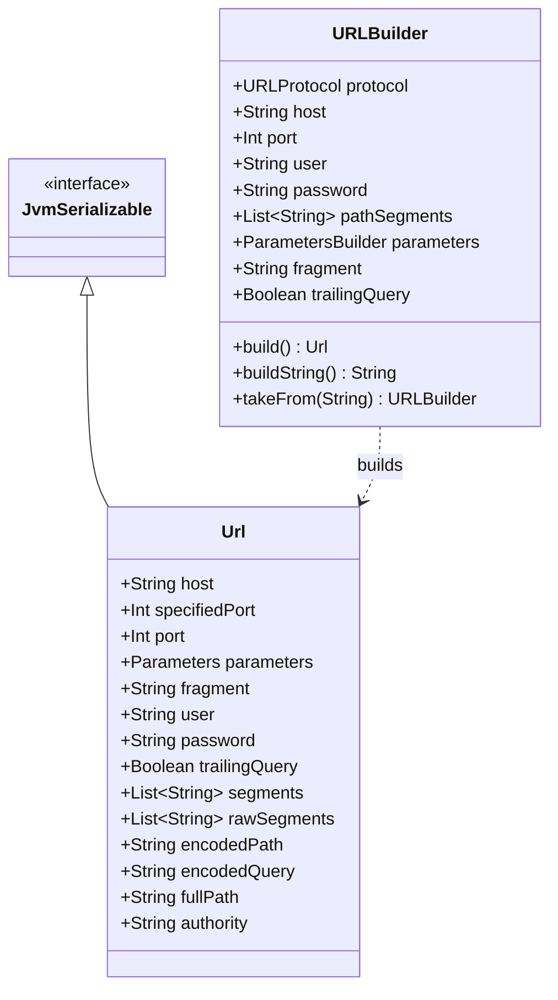
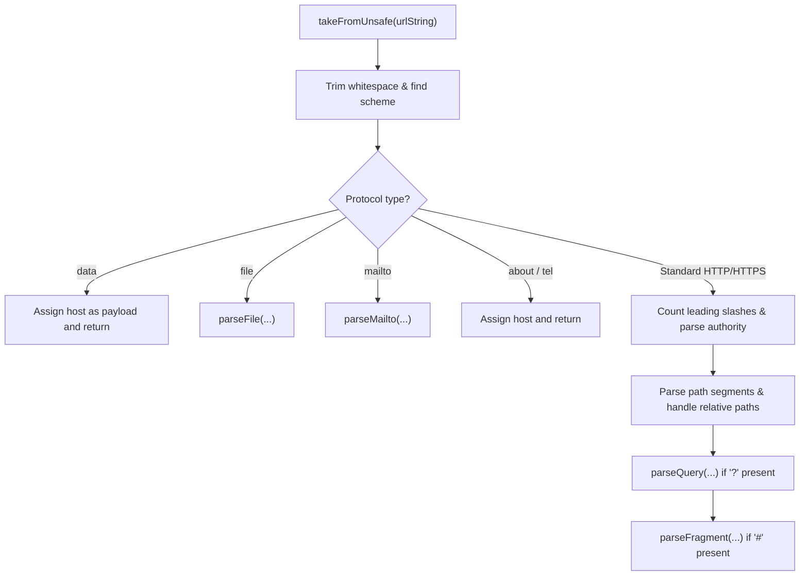
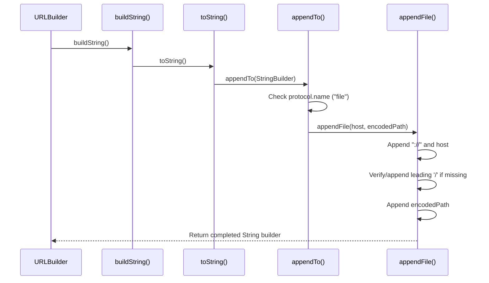
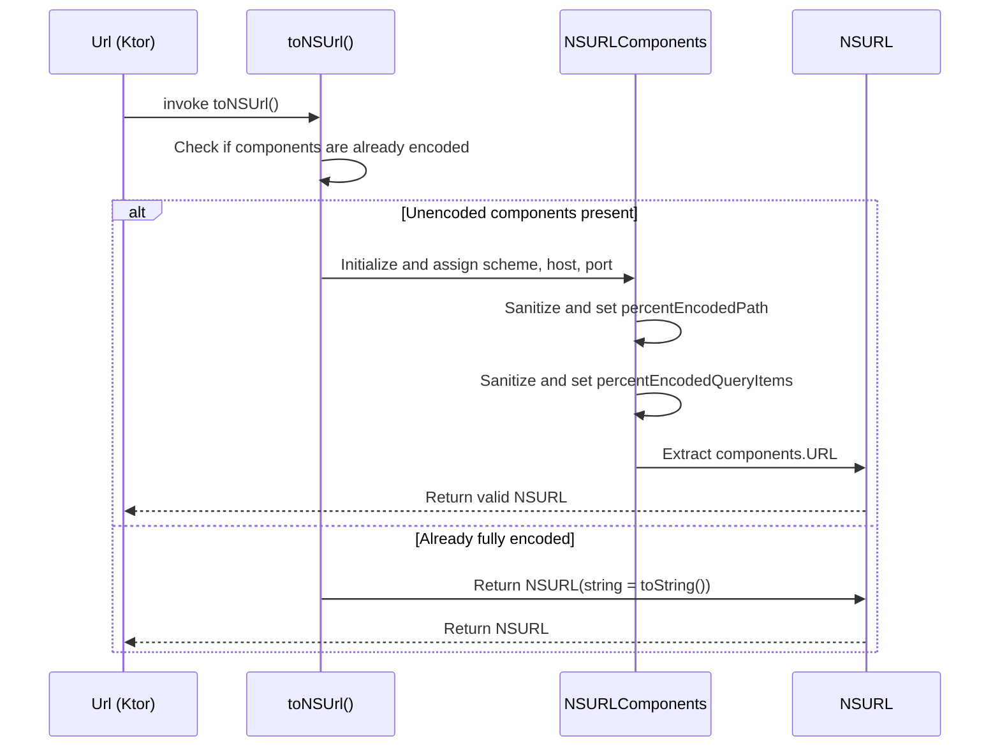

# URL Handling

<details>
<summary>Relevant source files</summary>

The following files were used as context for generating this wiki page:

- [ktor-http/common/src/io/ktor/http/URLBuilder.kt](https://github.com/ktorio/ktor/blob/main/ktor-http/common/src/io/ktor/http/URLBuilder.kt)
- [ktor-http/common/src/io/ktor/http/URLUtils.kt](https://github.com/ktorio/ktor/blob/main/ktor-http/common/src/io/ktor/http/URLUtils.kt)
- [ktor-http/common/src/io/ktor/http/Url.kt](https://github.com/ktorio/ktor/blob/main/ktor-http/common/src/io/ktor/http/Url.kt)
- [ktor-http/common/src/io/ktor/http/Codecs.kt](https://github.com/ktorio/ktor/blob/main/ktor-http/common/src/io/ktor/http/Codecs.kt)
- [ktor-http/common/src/io/ktor/http/URLParser.kt](https://github.com/ktorio/ktor/blob/main/ktor-http/common/src/io/ktor/http/URLParser.kt)
- [ktor-client/ktor-client-darwin/darwin/src/io/ktor/client/engine/darwin/internal/DarwinUrlUtils.kt](https://github.com/ktorio/ktor/blob/main/ktor-client/ktor-client-darwin/darwin/src/io/ktor/client/engine/darwin/internal/DarwinUrlUtils.kt)
- [ktor-client/ktor-client-core/common/src/io/ktor/client/HttpClient.kt](https://github.com/ktorio/ktor/blob/main/ktor-client/ktor-client-core/common/src/io/ktor/client/HttpClient.kt)
- [ktor-client/ktor-client-darwin-legacy/darwin/src/io/ktor/client/engine/darwin/internal/legacy/DarwinLegacyUrlUtils.kt](https://github.com/ktorio/ktor/blob/main/ktor-client/ktor-client-darwin-legacy/darwin/src/io/ktor/client/engine/darwin/internal/legacy/DarwinLegacyUrlUtils.kt)
- [ktor-http/jvm/src/io/ktor/http/URLUtilsJvm.kt](https://github.com/ktorio/ktor/blob/main/ktor-http/jvm/src/io/ktor/http/URLUtilsJvm.kt)
- [ktor-shared/ktor-resources/common/src/io/ktor/resources/UrlBuilder.kt](https://github.com/ktorio/ktor/blob/main/ktor-shared/ktor-resources/common/src/io/ktor/resources/UrlBuilder.kt)
- [ktor-client/ktor-client-core/common/src/io/ktor/client/plugins/DefaultRequest.kt](https://github.com/ktorio/ktor/blob/main/ktor-client/ktor-client-core/common/src/io/ktor/client/plugins/DefaultRequest.kt)
- [ktor-server/ktor-server-core/common/src/io/ktor/server/util/URLBuilder.kt](https://github.com/ktorio/ktor/blob/main/ktor-server/ktor-server-core/common/src/io/ktor/server/util/URLBuilder.kt)
- [ktor-client/ktor-client-core/jvm/src/io/ktor/client/request/HttpRequestJvm.kt](https://github.com/ktorio/ktor/blob/main/ktor-client/ktor-client-core/jvm/src/io/ktor/client/request/HttpRequestJvm.kt)
- [ktor-client/ktor-client-core/jvm/src/io/ktor/client/request/buildersJvm.kt](https://github.com/ktorio/ktor/blob/main/ktor-client/ktor-client-core/jvm/src/io/ktor/client/request/buildersJvm.kt)
- [ktor-http/jvm/src/io/ktor/http/URLBuilderJvm.kt](https://github.com/ktorio/ktor/blob/main/ktor-http/jvm/src/io/ktor/http/URLBuilderJvm.kt)
- [AGENTS.md](https://github.com/ktorio/ktor/blob/main/AGENTS.md)
- [ktor-http/posix/src/io/ktor/http/URLBuilder.posix.kt](https://github.com/ktorio/ktor/blob/main/ktor-http/posix/src/io/ktor/http/URLBuilder.posix.kt)
- [ktor-client/ktor-client-curl/desktop/interop/include/curl/urlapi.h](https://github.com/ktorio/ktor/blob/main/ktor-client/ktor-client-curl/desktop/interop/include/curl/urlapi.h)
- [README.md](https://github.com/ktorio/ktor/blob/main/README.md)
- [ktor-http/web/src/io/ktor/http/URLBuilder.web.kt](https://github.com/ktorio/ktor/blob/main/ktor-http/web/src/io/ktor/http/URLBuilder.web.kt)
</details>

## Overview

URL Handling in Ktor provides a robust, multiplatform mechanism for parsing, constructing, manipulating, and encoding uniform resource locators across all supported Kotlin targets (JVM, Native, JavaScript, and WebAssembly). The subsystem bridges the gap between raw string representations and structured, type-safe representations by offering components such as `Url`, `URLBuilder`, and dedicated codec functions. 

Sources: [ktor-http/common/src/io/ktor/http/URLBuilder.kt#L15-L40](https://github.com/ktorio/ktor/blob/main/ktor-http/common/src/io/ktor/http/URLBuilder.kt#L15-L40)

The primary problem solved by this architecture is the inconsistent and platform-dependent nature of native URL libraries, which often struggle with multiplatform requirements, strict RFC-3986 compliance, or query parameter handling. Ktor decouples URL logic from any single runtime environment by implementing its own safe parsing algorithm, granular path segment structures, and custom percent-encoding routines.

Sources: [ktor-http/common/src/io/ktor/http/URLParser.kt#L37-L150](https://github.com/ktorio/ktor/blob/main/ktor-http/common/src/io/ktor/http/URLParser.kt#L37-L150)

By separating immutable structures (`Url`) from mutable construction builders (`URLBuilder`), Ktor ensures thread-safe data transfer and fluent API composition. It integrates natively with Ktor clients, server applications, and type-safe routing extensions, enabling developers to build, merge, and serialize URLs cleanly within request pipelines.

Sources: [ktor-http/common/src/io/ktor/http/Url.kt#L31-L43](https://github.com/ktorio/ktor/blob/main/ktor-http/common/src/io/ktor/http/Url.kt#L31-L43)

## Core Data Structures: `Url` and `URLBuilder`

The URL subsystem is built around two primary classes: `Url` (an immutable representation) and `URLBuilder` (a mutable workspace). `Url` implements `JvmSerializable` and is fully compatible with Kotlinx Serialization via `UrlSerializer`. It maintains cached properties for performance, utilizing lazy evaluation for components such as `encodedPath`, `encodedQuery`, `segments`, and credentials.

Sources: [ktor-http/common/src/io/ktor/http/Url.kt#L31-L43](https://github.com/ktorio/ktor/blob/main/ktor-http/common/src/io/ktor/http/Url.kt#L31-L43)

`URLBuilder` provides mutable properties for all URL constituents, automatically managing encoding layers. When assigning raw strings or properties, the builder handles percent-encoding transparently. For example, assigning `user` or `password` invokes `encodeURLParameter()`, while path assignments manage segments through `encodeURLPathPart()`.

Sources: [ktor-http/common/src/io/ktor/http/URLBuilder.kt#L30-L94](https://github.com/ktorio/ktor/blob/main/ktor-http/common/src/io/ktor/http/URLBuilder.kt#L30-L94)



Sources: [ktor-http/common/src/io/ktor/http/Url.kt#L162-L245](https://github.com/ktorio/ktor/blob/main/ktor-http/common/src/io/ktor/http/Url.kt#L162-L245)

## Parsing and Unsafe URL Intake (`takeFromUnsafe`)

When a URL string is passed into a `URLBuilder` via `takeFrom(urlString)`, Ktor executes `takeFromUnsafe`, an iterative parser that dissects the input string according to RFC-3986 without throwing generic exceptions prematurely. 

Sources: [ktor-http/common/src/io/ktor/http/URLParser.kt#L17-L25](https://github.com/ktorio/ktor/blob/main/ktor-http/common/src/io/ktor/http/URLParser.kt#L17-L25)

The parsing control flow proceeds through sequential steps: whitespace trimming, scheme extraction, protocol dispatch, authority parsing, path chunking, and query/fragment extraction.

Sources: [ktor-http/common/src/io/ktor/http/URLParser.kt#L37-L150](https://github.com/ktorio/ktor/blob/main/ktor-http/common/src/io/ktor/http/URLParser.kt#L37-L150)



Sources: [ktor-http/common/src/io/ktor/http/URLParser.kt#L37-L150](https://github.com/ktorio/ktor/blob/main/ktor-http/common/src/io/ktor/http/URLParser.kt#L37-L150)

> [!NOTE]
> During path parsing in `takeFromUnsafe`, if `slashCount == 0` (indicating a relative path reference), the parser drops the last item of existing `encodedPathSegments` to correctly resolve relative references against a base path.

Sources: [ktor-http/common/src/io/ktor/http/URLParser.kt#L112-L119](https://github.com/ktorio/ktor/blob/main/ktor-http/common/src/io/ktor/http/URLParser.kt#L112-L119)

## Execution Walkthrough: `BuildString` to `AppendFile`

When `buildString()` is invoked on a `URLBuilder`, it first ensures that origin parameters are applied if the host is empty and the protocol is not a file, utilizing `buildString` which invokes `toString()` and subsequently `appendTo()`.

Sources: [ktor-http/common/src/io/ktor/http/URLBuilder.kt#L99-L106](https://github.com/ktorio/ktor/blob/main/ktor-http/common/src/io/ktor/http/URLBuilder.kt#L99-L106)

Inside `appendTo()`, the protocol name is checked. When the protocol is explicitly set to `"file"`, control flows into `appendFile()`, which appends the `://` separator, the host, ensures a leading slash on the encoded path if missing, and appends the full path and parameters.

Sources: [ktor-http/common/src/io/ktor/http/URLBuilder.kt#L148-L205](https://github.com/ktorio/ktor/blob/main/ktor-http/common/src/io/ktor/http/URLBuilder.kt#L148-L205)



Sources: [ktor-http/common/src/io/ktor/http/URLBuilder.kt#L99-L205](https://github.com/ktorio/ktor/blob/main/ktor-http/common/src/io/ktor/http/URLBuilder.kt#L99-L205)

## Percent Encoding and Codecs

Ktor implements dedicated encoding and decoding utilities in `Codecs.kt` adhering to RFC-3986 and RFC-5987. Unlike generic platform encoders, Ktor distinguishes between query components, parameter keys, parameter values, path parts, and full paths.

Sources: [ktor-http/common/src/io/ktor/http/Codecs.kt#L11-L45](https://github.com/ktorio/ktor/blob/main/ktor-http/common/src/io/ktor/http/Codecs.kt#L11-L45)

The encoding engine utilizes predefined byte sets based on standard specifications, including `URL_ALPHABET`, `URL_PROTOCOL_PART`, and `VALID_PATH_PART`.

Sources: [ktor-http/common/src/io/ktor/http/Codecs.kt#L11-L31](https://github.com/ktorio/ktor/blob/main/ktor-http/common/src/io/ktor/http/Codecs.kt#L11-L31)

| Function | Default Options | Behavior |
| :--- | :--- | :--- |
| `encodeURLQueryComponent` | `encodeFull = false`, `spaceToPlus = false` | Encodes query component parts, preserving unreserved characters and protocol parts unless `encodeFull` is true. |
| `encodeURLPath` | `encodeSlash = false`, `encodeEncoded = true` | Encodes path segments. Preserves slashes if `encodeSlash` is false and avoids double-encoding existing `%hh` hex sequences if `encodeEncoded` is true. |
| `encodeURLParameter` | `spaceToPlus = false` | Encodes query parameter keys/values, optionally converting spaces to `+` when `spaceToPlus = true`. |
| `decodeURLQueryComponent` | `plusIsSpace = false` | Decodes percent-encoded query strings, converting `+` to spaces if `plusIsSpace` is true. |
| `decodeURLPart` | `plusIsSpace = false` | Decodes general URL parts without converting `+` to spaces. |

Sources: [ktor-http/common/src/io/ktor/http/Codecs.kt#L52-L206](https://github.com/ktorio/ktor/blob/main/ktor-http/common/src/io/ktor/http/Codecs.kt#L52-L206)

> [!WARNING]
> When decoding URL components using `decodeImpl`, if an incomplete trailing hex escape or an invalid hex digit following `%` is encountered, Ktor immediately throws a `URLDecodeException`.

Sources: [ktor-http/common/src/io/ktor/http/Codecs.kt#L255-L267](https://github.com/ktorio/ktor/blob/main/ktor-http/common/src/io/ktor/http/Codecs.kt#L255-L267)

## Platform Interoperability (JVM and Darwin)

URL handling provides platform-specific extensions to interop seamlessly with host networking primitives such as `java.net.URI` / `java.net.URL` on the JVM and `NSURL` / `NSURLComponents` on Apple/Darwin targets.

Sources: [ktor-http/jvm/src/io/ktor/http/URLUtilsJvm.kt#L14-L46](https://github.com/ktorio/ktor/blob/main/ktor-http/jvm/src/io/ktor/http/URLUtilsJvm.kt#L14-L46)

On the JVM, `URLBuilder.takeFrom(URI)` and `URLBuilder.takeFrom(URL)` parse standard Java network objects into Ktor's builder structure. Port numbers are resolved against scheme defaults, and raw user info is split into credentials.

Sources: [ktor-http/jvm/src/io/ktor/http/URLUtilsJvm.kt#L14-L56](https://github.com/ktorio/ktor/blob/main/ktor-http/jvm/src/io/ktor/http/URLUtilsJvm.kt#L14-L56)

On Darwin platforms, `Url.toNSUrl()` converts an immutable Ktor `Url` into Foundation's `NSURL`. It validates character encoding against native allowed character sets. If components are unencoded, it utilizes `NSURLComponents` and `NSURLQueryItem` to build a valid native URL object safely.

Sources: [ktor-client/ktor-client-darwin/darwin/src/io/ktor/client/engine/darwin/internal/DarwinUrlUtils.kt#L22-L78](https://github.com/ktorio/ktor/blob/main/ktor-client/ktor-client-darwin/darwin/src/io/ktor/client/engine/darwin/internal/DarwinUrlUtils.kt#L22-L78)



Sources: [ktor-client/ktor-client-darwin/darwin/src/io/ktor/client/engine/darwin/internal/DarwinUrlUtils.kt#L22-L78](https://github.com/ktorio/ktor/blob/main/ktor-client/ktor-client-darwin/darwin/src/io/ktor/client/engine/darwin/internal/DarwinUrlUtils.kt#L22-L78)

## Integration with Client Requests and `DefaultRequest`

URL manipulation is central to HTTP client request execution and base URL resolution. When the `DefaultRequest` plugin is installed on an `HttpClient`, it intercepts outgoing requests in `HttpRequestPipeline.Before` and merges the configured base URL with the request's relative URL.

Sources: [ktor-client/ktor-client-core/common/src/io/ktor/client/plugins/DefaultRequest.kt#L72-L123](https://github.com/ktorio/ktor/blob/main/ktor-client/ktor-client-core/common/src/io/ktor/client/plugins/DefaultRequest.kt#L72-L123)

The merging algorithm (`mergeUrls`) enforces strict path combination rules based on slashes:
1. If the request URL does not specify a protocol, it inherits the base URL's protocol.
2. If the request URL has an absolute host, it overrides the base URL entirely.
3. If the request URL host is empty, paths are concatenated via `concatenatePath`.

Sources: [ktor-client/ktor-client-core/common/src/io/ktor/client/plugins/DefaultRequest.kt#L125-L172](https://github.com/ktorio/ktor/blob/main/ktor-client/ktor-client-core/common/src/io/ktor/client/plugins/DefaultRequest.kt#L125-L172)

```kotlin
val client = HttpClient {
    defaultRequest {
        url("https://api.example.com/v1/")
        headers.append("Authorization", "Bearer token")
    }
}

// Results in request to "https://api.example.com/v1/users"
val response = client.get("users") 
```

Sources: [ktor-client/ktor-client-core/common/src/io/ktor/client/plugins/DefaultRequest.kt#L45-L60](https://github.com/ktorio/ktor/blob/main/ktor-client/ktor-client-core/common/src/io/ktor/client/plugins/DefaultRequest.kt#L45-L60)

## Type-Safe Routing and Resources (`ktor-resources`)

The `ktor-resources` artifact extends URL handling by allowing developers to construct URLs directly from type-safe Kotlin serialization classes annotated with `@Resource`. 

Sources: [ktor-shared/ktor-resources/common/src/io/ktor/resources/UrlBuilder.kt#L12-L42](https://github.com/ktorio/ktor/blob/main/ktor-shared/ktor-resources/common/src/io/ktor/resources/UrlBuilder.kt#L12-L42)

The `href()` function processes a resource instance by passing it through `ResourcesFormat`, which encodes fields into query parameters and path patterns.

Sources: [ktor-shared/ktor-resources/common/src/io/ktor/resources/UrlBuilder.kt#L44-L94](https://github.com/ktorio/ktor/blob/main/ktor-shared/ktor-resources/common/src/io/ktor/resources/UrlBuilder.kt#L44-L94)

```kotlin
@Resource("/articles")
class Articles(val sort: String? = null)

// Generates "/articles?sort=date"
val url = href(ResourcesFormat(), Articles(sort = "date"))
```

Sources: [ktor-shared/ktor-resources/common/src/io/ktor/resources/UrlBuilder.kt#L19-L42](https://github.com/ktorio/ktor/blob/main/ktor-shared/ktor-resources/common/src/io/ktor/resources/UrlBuilder.kt#L19-L42)

During `href` evaluation, path patterns containing placeholders are parsed, matching parameters are extracted from the generated parameter map, and remaining unmatched parameters are appended automatically as query arguments.

Sources: [ktor-shared/ktor-resources/common/src/io/ktor/resources/UrlBuilder.kt#L53-L94](https://github.com/ktorio/ktor/blob/main/ktor-shared/ktor-resources/common/src/io/ktor/resources/UrlBuilder.kt#L53-L94)

## Related

- [[Headers and Methods]]

