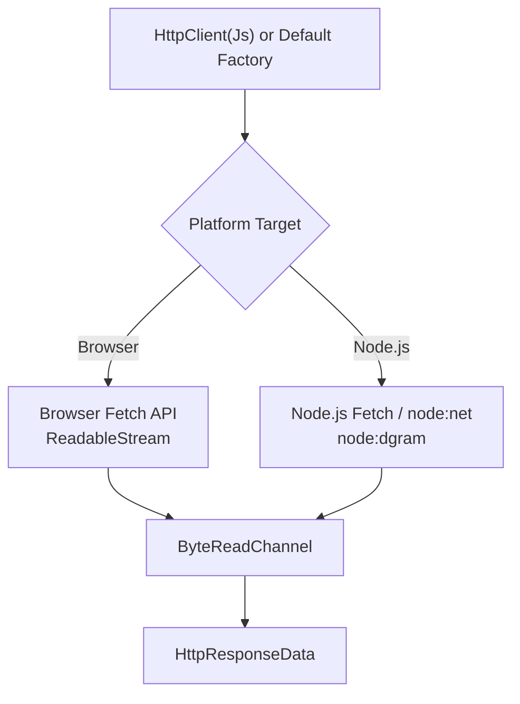
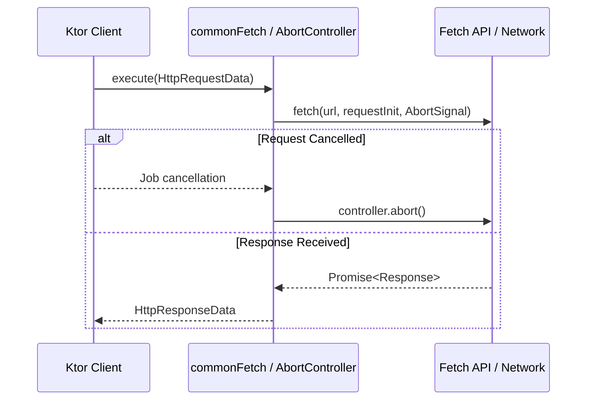
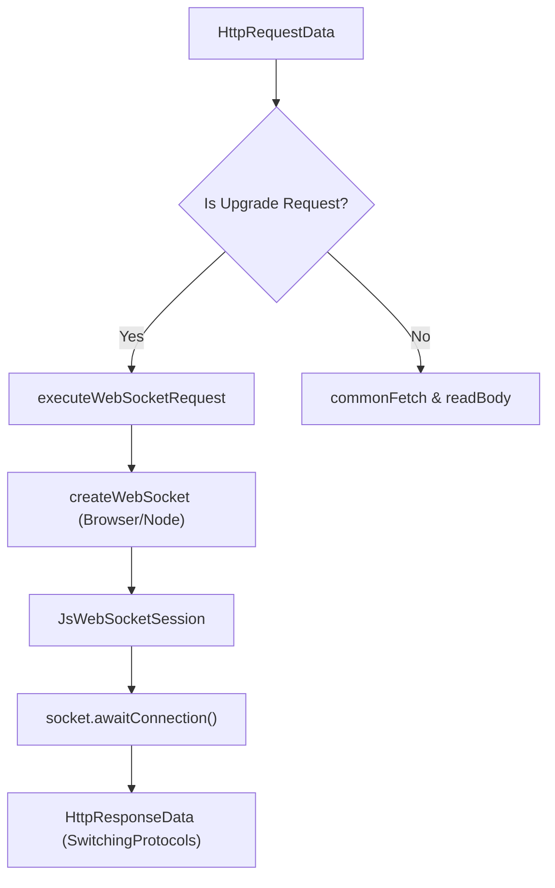

# Web Client Engines

<details>
<summary>Relevant source files</summary>

The following files were used as context for generating this wiki page:

- [ktor-client/ktor-client-core/wasmJs/src/io/ktor/client/engine/js/WasmJsClientEngine.kt](https://github.com/ktorio/ktor/blob/main/ktor-client/ktor-client-core/wasmJs/src/io/ktor/client/engine/js/WasmJsClientEngine.kt)
- [ktor-client/ktor-client-core/js/src/io/ktor/client/engine/js/JsClientEngine.kt](https://github.com/ktorio/ktor/blob/main/ktor-client/ktor-client-core/js/src/io/ktor/client/engine/js/JsClientEngine.kt)
- [ktor-network/web/src/io/ktor/network/sockets/SocketEngine.tcp.web.kt](https://github.com/ktorio/ktor/blob/main/ktor-network/web/src/io/ktor/network/sockets/SocketEngine.tcp.web.kt)
- [ktor-client/ktor-client-core/wasmJs/src/io/ktor/client/fetch/LibDom.kt](https://github.com/ktorio/ktor/blob/main/ktor-client/ktor-client-core/wasmJs/src/io/ktor/client/fetch/LibDom.kt)
- [ktor-client/ktor-client-winhttp/windows/src/io/ktor/client/engine/winhttp/WinHttpClientEngine.kt](https://github.com/ktorio/ktor/blob/main/ktor-client/ktor-client-winhttp/windows/src/io/ktor/client/engine/winhttp/WinHttpClientEngine.kt)
- [ktor-client/ktor-client-okhttp/jvm/src/io/ktor/client/engine/okhttp/OkHttpEngine.kt](https://github.com/ktorio/ktor/blob/main/ktor-client/ktor-client-okhttp/jvm/src/io/ktor/client/engine/okhttp/OkHttpEngine.kt)
- [ktor-client/ktor-client-core/wasmJs/src/io/ktor/client/engine/js/Js.kt](https://github.com/ktorio/ktor/blob/main/ktor-client/ktor-client-core/wasmJs/src/io/ktor/client/engine/js/Js.kt)
- [ktor-client/ktor-client-core/js/src/io/ktor/client/engine/js/Js.kt](https://github.com/ktorio/ktor/blob/main/ktor-client/ktor-client-core/js/src/io/ktor/client/engine/js/Js.kt)
- [ktor-client/ktor-client-core/wasmJs/src/io/ktor/client/engine/js/compatibility/Utils.kt](https://github.com/ktorio/ktor/blob/main/ktor-client/ktor-client-core/wasmJs/src/io/ktor/client/engine/js/compatibility/Utils.kt)
- [ktor-client/ktor-client-core/wasmJs/src/io/ktor/client/fetch/LibEs5.kt](https://github.com/ktorio/ktor/blob/main/ktor-client/ktor-client-core/wasmJs/src/io/ktor/client/fetch/LibEs5.kt)
- [ktor-client/ktor-client-core/js/src/io/ktor/client/fetch/LibDom.kt](https://github.com/ktorio/ktor/blob/main/ktor-client/ktor-client-core/js/src/io/ktor/client/fetch/LibDom.kt)
- [ktor-client/ktor-client-core/js/src/io/ktor/client/engine/js/compatibility/Utils.kt](https://github.com/ktorio/ktor/blob/main/ktor-client/ktor-client-core/js/src/io/ktor/client/engine/js/compatibility/Utils.kt)
- [ktor-client/ktor-client-core/wasmJs/src/io/ktor/client/engine/js/browser/BrowserFetch.kt](https://github.com/ktorio/ktor/blob/main/ktor-client/ktor-client-core/wasmJs/src/io/ktor/client/engine/js/browser/BrowserFetch.kt)
- [ktor-client/ktor-client-core/js/src/io/ktor/client/engine/js/browser/BrowserFetch.kt](https://github.com/ktorio/ktor/blob/main/ktor-client/ktor-client-core/js/src/io/ktor/client/engine/js/browser/BrowserFetch.kt)
- [ktor-client/ktor-client-core/web/src/io/ktor/client/engine/js/Js.kt](https://github.com/ktorio/ktor/blob/main/ktor-client/ktor-client-core/web/src/io/ktor/client/engine/js/Js.kt)
- [ktor-client/ktor-client-cio/wasmJs/src/io/ktor/client/engine/cio/Loader.wasmJs.kt](https://github.com/ktorio/ktor/blob/main/ktor-client/ktor-client-cio/wasmJs/src/io/ktor/client/engine/cio/Loader.wasmJs.kt)
- [ktor-client/ktor-client-core/wasmJs/src/io/ktor/client/engine/js/JsUtils.kt](https://github.com/ktorio/ktor/blob/main/ktor-client/ktor-client-core/wasmJs/src/io/ktor/client/engine/js/JsUtils.kt)
- [ktor-network/wasmJs/src/io/ktor/network/sockets/nodejs/node.wasmJs.kt](https://github.com/ktorio/ktor/blob/main/ktor-network/wasmJs/src/io/ktor/network/sockets/nodejs/node.wasmJs.kt)
- [ktor-client/ktor-client-darwin/darwin/src/io/ktor/client/engine/darwin/DarwinClientEngine.kt](https://github.com/ktorio/ktor/blob/main/ktor-client/ktor-client-darwin/darwin/src/io/ktor/client/engine/darwin/DarwinClientEngine.kt)
- [ktor-client/ktor-client-darwin-legacy/darwin/src/io/ktor/client/engine/darwin/DarwinLegacyClientEngine.kt](https://github.com/ktorio/ktor/blob/main/ktor-client/ktor-client-darwin-legacy/darwin/src/io/ktor/client/engine/darwin/DarwinLegacyClientEngine.kt)
- [ktor-client/ktor-client-core/web/src/io/ktor/client/HttpClient.web.kt](https://github.com/ktorio/ktor/blob/main/ktor-client/ktor-client-core/web/src/io/ktor/client/HttpClient.web.kt)
</details>

## Overview

Web client engines in Ktor bridge platform-specific transport layers and JavaScript runtimes (Browser and Node.js) with Ktor's multiplatform asynchronous pipeline infrastructure. The primary architectural purpose of these engines is to translate Ktor's standard `HttpRequestData` into platform-native requests—such as the Fetch API or Node.js `net`/`dgram` networking modules—while mapping incoming binary and streaming payloads into Ktor's `ByteReadChannel` abstractions. By encapsulating runtime differences across JS and Wasm targets, these components solve the core compatibility problem of executing HTTP, Server-Sent Events (SSE), and WebSocket upgrades in non-JVM web environments.
Sources: [ktor-client/ktor-client-core/web/src/io/ktor/client/HttpClient.web.kt:19-26](https://github.com/ktorio/ktor/blob/main/ktor-client/ktor-client-core/web/src/io/ktor/client/HttpClient.web.kt#L19-L26)

The design relies heavily on coroutine-based request execution, `suspendCancellableCoroutine` blocks for bridging asynchronous JavaScript Promises and event listeners, and seamless fallback selection. When running in web targets, Ktor automatically resolves the default engine using an ordered engine loader mechanism: `engines.firstOrNull { it != Js } ?: Js`. This ensures that specialized engines take precedence when available, falling back to the standard JavaScript `Js` engine otherwise.
Sources: [ktor-client/ktor-client-core/web/src/io/ktor/client/HttpClient.web.kt:25-26](https://github.com/ktorio/ktor/blob/main/ktor-client/ktor-client-core/web/src/io/ktor/client/HttpClient.web.kt#L25-L26)


Sources: [ktor-client/ktor-client-core/js/src/io/ktor/client/engine/js/JsClientEngine.kt:38-67](https://github.com/ktorio/ktor/blob/main/ktor-client/ktor-client-core/js/src/io/ktor/client/engine/js/JsClientEngine.kt#L38-L67)

## JavaScript and WasmJs Client Engines (`JsClientEngine`)

The `JsClientEngine` class extends `HttpClientEngineBase` and serves as the primary HTTP client backend for Kotlin/JS and Kotlin/Wasm targets. It declares support for `HttpTimeoutCapability`, `WebSocketCapability`, and `SSECapability`. During initialization, it verifies that proxy configurations are unassigned, throwing an exception if a proxy is specified since the browser and standard JS fetch runtimes do not support arbitrary engine-level proxies.
Sources: [ktor-client/ktor-client-core/js/src/io/ktor/client/engine/js/JsClientEngine.kt:27-35](https://github.com/ktorio/ktor/blob/main/ktor-client/ktor-client-core/js/src/io/ktor/client/engine/js/JsClientEngine.kt#L27-L35)

When `execute(data: HttpRequestData)` is invoked, the engine checks whether the request is a protocol upgrade via `data.isUpgradeRequest()`. If it is an upgrade request, execution is routed to `executeWebSocketRequest`; otherwise, it constructs a native request object, invokes the fetch pipeline via `commonFetch`, and parses the resulting headers, status codes, and body streams.
Sources: [ktor-client/ktor-client-core/wasmJs/src/io/ktor/client/engine/js/WasmJsClientEngine.kt:39-47](https://github.com/ktorio/ktor/blob/main/ktor-client/ktor-client-core/wasmJs/src/io/ktor/client/engine/js/WasmJsClientEngine.kt#L39-L47)

```kotlin
val client = HttpClient(Js) {
    engine {
        configureRequest {
            credentials = "include"
            mode = "cors"
        }
    }
}
```
Sources: [ktor-client/ktor-client-core/js/src/io/ktor/client/engine/js/JsClientEngine.kt:38-68](https://github.com/ktorio/ktor/blob/main/ktor-client/ktor-client-core/js/src/io/ktor/client/engine/js/JsClientEngine.kt#L38-L68)

## Fetch API Integration and `commonFetch`

Request execution relies heavily on the `commonFetch` utility, which manages request lifecycle cancellation and Promise resolution. An `AbortController` instance is instantiated, and its `signal` is bound to the request initialization structure. Ktor links the coroutine job completion hook directly to `controller.abort()` when cancellation is triggered.
Sources: [ktor-client/ktor-client-core/js/src/io/ktor/client/engine/js/compatibility/Utils.kt:21-36](https://github.com/ktorio/ktor/blob/main/ktor-client/ktor-client-core/js/src/io/ktor/client/engine/js/compatibility/Utils.kt#L21-L36)

> [!NOTE]
> In Node.js environments, `commonFetch` merges custom `nodeOptions` into the fetch request options using `Object.assign()` to support specialized agents or TLS version constraints.
Sources: [ktor-client/ktor-client-core/js/src/io/ktor/client/engine/js/compatibility/Utils.kt:38-42](https://github.com/ktorio/ktor/blob/main/ktor-client/ktor-client-core/js/src/io/ktor/client/engine/js/compatibility/Utils.kt#L38-L42)


Sources: [ktor-client/ktor-client-core/wasmJs/src/io/ktor/client/engine/js/compatibility/Utils.kt:23-61](https://github.com/ktorio/ktor/blob/main/ktor-client/ktor-client-core/wasmJs/src/io/ktor/client/engine/js/compatibility/Utils.kt#L23-L61)

## Stream Parsing and `ByteReadChannel` Bridging

The response body received from the Fetch API is exposed as a `ReadableStream`. The engine bridges JavaScript streams to Ktor's `ByteReadChannel` via `readBodyBrowser` and `channelFromStream`. A coroutine writer opens a default reader on the stream and loops over `reader.readChunk()`. Each read chunk is converted to a byte array, written fully into Ktor's underlying channel, and flushed.
Sources: [ktor-client/ktor-client-core/js/src/io/ktor/client/engine/js/browser/BrowserFetch.kt:18-23](https://github.com/ktorio/ktor/blob/main/ktor-client/ktor-client-core/js/src/io/ktor/client/engine/js/browser/BrowserFetch.kt#L18-L23)

If an exception occurs during streaming, the reader is explicitly cancelled with the error reference, and the exception is propagated to abort the channel reader.
Sources: [ktor-client/ktor-client-core/js/src/io/ktor/client/engine/js/browser/BrowserFetch.kt:34-37](https://github.com/ktorio/ktor/blob/main/ktor-client/ktor-client-core/js/src/io/ktor/client/engine/js/browser/BrowserFetch.kt#L34-L37)

```kotlin
internal fun CoroutineScope.channelFromStream(
    stream: ReadableStream<Uint8Array>
): ByteReadChannel = writer {
    val reader: ReadableStreamDefaultReader<Uint8Array> = stream.getReader()
    try {
        while (true) {
            val chunk = reader.readChunk() ?: break
            channel.writeFully(chunk.asByteArray())
            channel.flush()
        }
    } catch (cause: Throwable) {
        reader.cancel(cause).catch { /* ignore */ }.await()
        throw cause
    }
}.channel
```
Sources: [ktor-client/ktor-client-core/js/src/io/ktor/client/engine/js/browser/BrowserFetch.kt:24-38](https://github.com/ktorio/ktor/blob/main/ktor-client/ktor-client-core/js/src/io/ktor/client/engine/js/browser/BrowserFetch.kt#L24-L38)

## WebSocket and Protocol Upgrade Handling

When `data.isUpgradeRequest()` evaluates to true, the client engine delegates execution to `executeWebSocketRequest`. This function creates a WebSocket instance via `createWebSocket`, wrapping browser-native constructors or dynamic imports of Node.js `ws` modules depending on runtime capabilities.
Sources: [ktor-client/ktor-client-core/js/src/io/ktor/client/engine/js/JsClientEngine.kt:42-44](https://github.com/ktorio/ktor/blob/main/ktor-client/ktor-client-core/js/src/io/ktor/client/engine/js/JsClientEngine.kt#L42-L44)

The engine initializes a `JsWebSocketSession`, awaits connection establishment using `socket.awaitConnection()`, and returns an `HttpResponseData` with status `HttpStatusCode.SwitchingProtocols`.
Sources: [ktor-client/ktor-client-core/js/src/io/ktor/client/engine/js/JsClientEngine.kt:105-128](https://github.com/ktorio/ktor/blob/main/ktor-client/ktor-client-core/js/src/io/ktor/client/engine/js/JsClientEngine.kt#L105-L128)


Sources: [ktor-client/ktor-client-core/wasmJs/src/io/ktor/client/engine/js/WasmJsClientEngine.kt:104-138](https://github.com/ktorio/ktor/blob/main/ktor-client/ktor-client-core/wasmJs/src/io/ktor/client/engine/js/WasmJsClientEngine.kt#L104-L138)

## Node.js Socket Networking in Web Targets (`node:net` and `node:dgram`)

For Node.js environments compiled under web/wasm targets, Ktor implements TCP and UDP socket bindings using dynamic ESM imports of built-in Node modules (`node:net` and `node:dgram`).
Sources: [ktor-network/wasmJs/src/io/ktor/network/sockets/nodejs/node.wasmJs.kt:31-41](https://github.com/ktorio/ktor/blob/main/ktor-network/wasmJs/src/io/ktor/network/sockets/nodejs/node.wasmJs.kt#L31-L41)

The `tcpConnect` function loads the `node:net` module, creates a connection using `nodeNet.createConnection()`, and sets up socket event listeners via `tcpSocketSetup`. Incoming data chunks (`Uint8Array`) are pushed into an unlimited coroutine `Channel`, and `SocketImpl` consumes these frames to write into Ktor's `ByteChannel` for reading.
Sources: [ktor-network/web/src/io/ktor/network/sockets/SocketEngine.tcp.web.kt:17-31](https://github.com/ktorio/ktor/blob/main/ktor-network/web/src/io/ktor/network/sockets/SocketEngine.tcp.web.kt#L17-L31)

```kotlin
internal actual suspend fun tcpConnect(
    selector: SelectorManager,
    remoteAddress: SocketAddress,
    socketOptions: SocketOptions.TCPClientSocketOptions
): Socket {
    val nodeNet = loadNodeNet()
    return suspendCancellableCoroutine { cont ->
        val socket = nodeNet.createConnection(CreateConnectionOptions(remoteAddress, socketOptions))
        tcpSocketSetup(
            socket = socket,
            serverAddress = remoteAddress,
            parentContext = null,
            connectCont = cont
        )
    }
}
```
Sources: [ktor-network/web/src/io/ktor/network/sockets/SocketEngine.tcp.web.kt:17-32](https://github.com/ktorio/ktor/blob/main/ktor-network/web/src/io/ktor/network/sockets/SocketEngine.tcp.web.kt#L17-L32)

## Configuration and Engine Options

The client configuration is managed through `JsClientEngineConfig`. Developers can customize request properties or provide custom fetch implementations.
Sources: [ktor-client/ktor-client-core/js/src/io/ktor/client/engine/js/Js.kt:34-78](https://github.com/ktorio/ktor/blob/main/ktor-client/ktor-client-core/js/src/io/ktor/client/engine/js/Js.kt#L34-L78)

| Configuration Property | Type | Default Value | Description |
| :--- | :--- | :--- | :--- |
| `fetch` | `(String, RequestInit?) -> Promise<Response>` | `::fetch` | Overrides the function used to execute HTTP requests. |
| `configureRequest` | `RequestInit.() -> Unit` | `{}` | Provides access to modify underlying fetch options (credentials, mode, cache, etc.). |
| `nodeOptions` | `JsAny` / `dynamic` | `Object.create(null)` | Deprecated dictionary for passing Node.js specific options (`node-fetch` / agent configurations). |
Sources: [ktor-client/ktor-client-core/js/src/io/ktor/client/engine/js/Js.kt:41-78](https://github.com/ktorio/ktor/blob/main/ktor-client/ktor-client-core/js/src/io/ktor/client/engine/js/Js.kt#L41-L78)

## Design Trade-offs and Constraints

Web client engines balance browser standards with multiplatform requirements, resulting in specific design choices and trade-offs.
Sources: [ktor-client/ktor-client-core/js/src/io/ktor/client/engine/js/JsClientEngine.kt:27-35](https://github.com/ktorio/ktor/blob/main/ktor-client/ktor-client-core/js/src/io/ktor/client/engine/js/JsClientEngine.kt#L27-L35)

| Design Choice | Benefit | Cost / Limitation |
| :--- | :--- | :--- |
| **Fetch API Dependency** | Native browser integration and lightweight bundle size. | Limited fine-grained control over raw socket parameters and proxy settings. |
| **Dynamic `node:net` Imports** | Seamless execution in Node.js without bundling native binaries. | Asynchronous module loading overhead on startup in non-browser environments. |
| **Compression Header Removal** | Prevents content-length mismatch errors in cross-origin browser requests. | Requires stripping compression headers when running in browser contexts. |
Sources: [ktor-client/ktor-client-core/js/src/io/ktor/client/engine/js/JsClientEngine.kt:157-161](https://github.com/ktorio/ktor/blob/main/ktor-client/ktor-client-core/js/src/io/ktor/client/engine/js/JsClientEngine.kt#L157-L161), [ktor-network/wasmJs/src/io/ktor/network/sockets/nodejs/node.wasmJs.kt:31-41](https://github.com/ktorio/ktor/blob/main/ktor-network/wasmJs/src/io/ktor/network/sockets/nodejs/node.wasmJs.kt#L31-L41)

## Related

- [[Client Core]]

