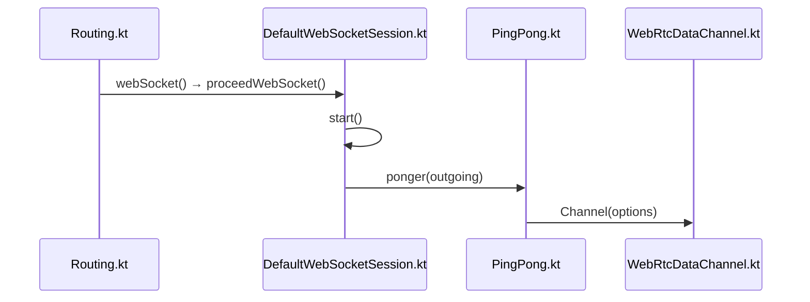

# WebRTC Integration

<details>
<summary>Relevant source files</summary>

The following files were used as context for generating this wiki page:

- [ktor-client/ktor-client-webrtc/ios/src/io/ktor/client/webrtc/PeerConnection.kt](https://github.com/ktorio/ktor/blob/main/ktor-client/ktor-client-webrtc/ios/src/io/ktor/client/webrtc/PeerConnection.kt)
- [ktor-client/ktor-client-webrtc/jvm/src/io/ktor/client/webrtc/JvmWebRtcConnection.kt](https://github.com/ktorio/ktor/blob/main/ktor-client/ktor-client-webrtc/jvm/src/io/ktor/client/webrtc/JvmWebRtcConnection.kt)
- [ktor-client/ktor-client-webrtc/android/src/io/ktor/client/webrtc/PeerConnection.kt](https://github.com/ktorio/ktor/blob/main/ktor-client/ktor-client-webrtc/android/src/io/ktor/client/webrtc/PeerConnection.kt)
- [ktor-client/ktor-client-webrtc/android/src/io/ktor/client/webrtc/Utils.kt](https://github.com/ktorio/ktor/blob/main/ktor-client/ktor-client-webrtc/android/src/io/ktor/client/webrtc/Utils.kt)
- [ktor-client/ktor-client-webrtc/common/src/io/ktor/client/webrtc/WebRtc.kt](https://github.com/ktorio/ktor/blob/main/ktor-client/ktor-client-webrtc/common/src/io/ktor/client/webrtc/WebRtc.kt)
- [ktor-client/ktor-client-webrtc/common/src/io/ktor/client/webrtc/WebRtcPeerConnection.kt](https://github.com/ktorio/ktor/blob/main/ktor-client/ktor-client-webrtc/common/src/io/ktor/client/webrtc/WebRtcPeerConnection.kt)
- [ktor-client/ktor-client-webrtc/android/src/io/ktor/client/webrtc/Engine.kt](https://github.com/ktorio/ktor/blob/main/ktor-client/ktor-client-webrtc/android/src/io/ktor/client/webrtc/Engine.kt)
- [ktor-client/ktor-client-webrtc/web/src/io/ktor/client/webrtc/Browser.kt](https://github.com/ktorio/ktor/blob/main/ktor-client/ktor-client-webrtc/web/src/io/ktor/client/webrtc/Browser.kt)
- [ktor-client/ktor-client-webrtc/ios/src/io/ktor/client/webrtc/Engine.kt](https://github.com/ktorio/ktor/blob/main/ktor-client/ktor-client-webrtc/ios/src/io/ktor/client/webrtc/Engine.kt)
- [ktor-client/ktor-client-webrtc/jvm/src/io/ktor/client/webrtc/JvmWebRtcEngine.kt](https://github.com/ktorio/ktor/blob/main/ktor-client/ktor-client-webrtc/jvm/src/io/ktor/client/webrtc/JvmWebRtcEngine.kt)
- [ktor-client/ktor-client-webrtc/web/src/io/ktor/client/webrtc/PeerConnection.kt](https://github.com/ktorio/ktor/blob/main/ktor-client/ktor-client-webrtc/web/src/io/ktor/client/webrtc/PeerConnection.kt)
- [ktor-client/ktor-client-webrtc/common/src/io/ktor/client/webrtc/WebRtcEngine.kt](https://github.com/ktorio/ktor/blob/main/ktor-client/ktor-client-webrtc/common/src/io/ktor/client/webrtc/WebRtcEngine.kt)
- [ktor-client/ktor-client-webrtc/ktor-client-webrtc-rs/common/src/io/ktor/client/webrtc/rs/Connection.kt](https://github.com/ktorio/ktor/blob/main/ktor-client/ktor-client-webrtc/ktor-client-webrtc-rs/common/src/io/ktor/client/webrtc/rs/Connection.kt)
- [ktor-client/ktor-client-webrtc/common/src/io/ktor/client/webrtc/WebRtcClient.kt](https://github.com/ktorio/ktor/blob/main/ktor-client/ktor-client-webrtc/common/src/io/ktor/client/webrtc/WebRtcClient.kt)
- [ktor-client/ktor-client-webrtc/web/src/io/ktor/client/webrtc/Engine.kt](https://github.com/ktorio/ktor/blob/main/ktor-client/ktor-client-webrtc/web/src/io/ktor/client/webrtc/Engine.kt)
- [ktor-client/ktor-client-webrtc/jvm/src/io/ktor/client/webrtc/JvmUtils.kt](https://github.com/ktorio/ktor/blob/main/ktor-client/ktor-client-webrtc/jvm/src/io/ktor/client/webrtc/JvmUtils.kt)
- [ktor-client/ktor-client-webrtc/common/src/io/ktor/client/webrtc/WebRtcPeerConnectionEvents.kt](https://github.com/ktorio/ktor/blob/main/ktor-client/ktor-client-webrtc/common/src/io/ktor/client/webrtc/WebRtcPeerConnectionEvents.kt)
- [ktor-client/ktor-client-webrtc/common/src/io/ktor/client/webrtc/WebRtcDataChannel.kt](https://github.com/ktorio/ktor/blob/main/ktor-client/ktor-client-webrtc/common/src/io/ktor/client/webrtc/WebRtcDataChannel.kt)
- [ktor-client/ktor-client-webrtc/common/src/io/ktor/client/webrtc/WebRtcMedia.kt](https://github.com/ktorio/ktor/blob/main/ktor-client/ktor-client-webrtc/common/src/io/ktor/client/webrtc/WebRtcMedia.kt)
- [ktor-server/ktor-server-plugins/ktor-server-websockets/common/src/io/ktor/server/websocket/Routing.kt](https://github.com/ktorio/ktor/blob/main/ktor-server/ktor-server-plugins/ktor-server-websockets/common/src/io/ktor/server/websocket/Routing.kt)
- [ktor-shared/ktor-websockets/common/src/io/ktor/websocket/DefaultWebSocketSession.kt](https://github.com/ktorio/ktor/blob/main/ktor-shared/ktor-websockets/common/src/io/ktor/websocket/DefaultWebSocketSession.kt)
- [ktor-shared/ktor-websockets/common/src/io/ktor/websocket/PingPong.kt](https://github.com/ktorio/ktor/blob/main/ktor-shared/ktor-websockets/common/src/io/ktor/websocket/PingPong.kt)
</details>

## Overview

The Ktor WebRTC Integration provides a multiplatform asynchronous client engine and API for establishing peer-to-peer connections and managing media streams across diverse target platforms. It solves the complexity of platform fragmentation by wrapping native WebRTC implementations into a unified Kotlin coroutines-based interface, enabling consistent peer-to-peer communication, data channel handling, and media track management in multiplatform applications. Sources: [ktor-client/ktor-client-webrtc/common/src/io/ktor/client/webrtc/WebRtcClient.kt#L9-L17](https://github.com/ktorio/ktor/blob/main/ktor-client/ktor-client-webrtc/common/src/io/ktor/client/webrtc/WebRtcClient.kt#L9-L17)

The module embodies design decisions centered around coroutine-driven reactive flows, structured concurrency scopes for individual connections, and pluggable target-specific engine factories. It interacts closely with adjacent Ktor websocket and utilities components to support signaling workflows while providing clean abstractions over underlying native WebRTC libraries. Sources: [ktor-client/ktor-client-webrtc/common/src/io/ktor/client/webrtc/WebRtcPeerConnection.kt#L19-L39](https://github.com/ktorio/ktor/blob/main/ktor-client/ktor-client-webrtc/common/src/io/ktor/client/webrtc/WebRtcPeerConnection.kt#L19-L39), [ktor-client/ktor-client-webrtc/common/src/io/ktor/client/webrtc/WebRtcEngine.kt#L173-L203](https://github.com/ktorio/ktor/blob/main/ktor-client/ktor-client-webrtc/common/src/io/ktor/client/webrtc/WebRtcEngine.kt#L173-L203)

## Multiplatform WebRTC Client Engine Architecture

### Overview

The multiplatform WebRTC client engine architecture in Ktor relies on a unified core interface structure that abstracts target-specific WebRTC implementations behind asynchronous, coroutine-based abstractions. The client delegates core operations to platform-specific engines via the `WebRtcEngine` interface and `WebRtcClientEngineFactory`, while `WebRtcEngineBase` manages shared background dispatchers, parent supervision jobs, and isolated connection-level coroutine contexts. Sources: [ktor-client/ktor-client-webrtc/common/src/io/ktor/client/webrtc/WebRtcEngine.kt#L135-L163](https://github.com/ktorio/ktor/blob/main/ktor-client/ktor-client-webrtc/common/src/io/ktor/client/webrtc/WebRtcEngine.kt#L135-L163)

`WebRtcEngineBase` initializes an engine-level coroutine context using a `SupervisorJob`, a dispatcher (defaulting to `ioDispatcher()` or user configuration), and a default exception handler (`DefaultExceptionHandler`). Sources: [ktor-client/ktor-client-webrtc/common/src/io/ktor/client/webrtc/WebRtcEngine.kt#L181-L191](https://github.com/ktorio/ktor/blob/main/ktor-client/ktor-client-webrtc/common/src/io/ktor/client/webrtc/WebRtcEngine.kt#L181-L191)

When peer connections are instantiated, `createConnectionContext` constructs an isolated scope combining the engine context, a child `SupervisorJob` under the parent, and the connection's exception handler. Sources: [ktor-client/ktor-client-webrtc/common/src/io/ktor/client/webrtc/WebRtcEngine.kt#L196-L198](https://github.com/ktorio/ktor/blob/main/ktor-client/ktor-client-webrtc/common/src/io/ktor/client/webrtc/WebRtcEngine.kt#L196-L198)

Closing the engine cancels the parent supervision tree with a `WebRtcEngineClosedException`. Sources: [ktor-client/ktor-client-webrtc/common/src/io/ktor/client/webrtc/WebRtcEngine.kt#L200-L202](https://github.com/ktorio/ktor/blob/main/ktor-client/ktor-client-webrtc/common/src/io/ktor/client/webrtc/WebRtcEngine.kt#L200-L202)

The `WebRtcClient` class delegates all calls to its underlying `WebRtcEngine` via Kotlin class delegation. Sources: [ktor-client/ktor-client-webrtc/common/src/io/ktor/client/webrtc/WebRtcClient.kt#L18-L19](https://github.com/ktorio/ktor/blob/main/ktor-client/ktor-client-webrtc/common/src/io/ktor/client/webrtc/WebRtcClient.kt#L18-L19)

### Configuration Properties

| Property | Type | Default Value | Purpose |
| :--- | :--- | :--- | :--- |
| `iceServers` | `List<WebRtc.IceServer>` | `emptyList()` | Configures STUN/TURN servers for ICE candidate gathering. Sources: [ktor-client/ktor-client-webrtc/common/src/io/ktor/client/webrtc/WebRtcEngine.kt#L23-L24](https://github.com/ktorio/ktor/blob/main/ktor-client/ktor-client-webrtc/common/src/io/ktor/client/webrtc/WebRtcEngine.kt#L23-L24) |
| `statsRefreshRate` | `Duration?` | `null` | Sets refresh rate for statistics collection (`null` disables stats). Sources: [ktor-client/ktor-client-webrtc/common/src/io/ktor/client/webrtc/WebRtcEngine.kt#L26-L35](https://github.com/ktorio/ktor/blob/main/ktor-client/ktor-client-webrtc/common/src/io/ktor/client/webrtc/WebRtcEngine.kt#L26-L35) |
| `iceCandidatePoolSize` | `Int` | `0` | Size of the prefetched ICE candidate pool to speed up connection. Sources: [ktor-client/ktor-client-webrtc/common/src/io/ktor/client/webrtc/WebRtcEngine.kt#L36-L44](https://github.com/ktorio/ktor/blob/main/ktor-client/ktor-client-webrtc/common/src/io/ktor/client/webrtc/WebRtcEngine.kt#L36-L44) |
| `bundlePolicy` | `WebRtc.BundlePolicy` | `WebRtc.BundlePolicy.BALANCED` | Specifies media negotiation bundle policy (`MAX_BUNDLE`, `BALANCED`, `MAX_COMPAT`). Sources: [ktor-client/ktor-client-webrtc/common/src/io/ktor/client/webrtc/WebRtcEngine.kt#L45-L52](https://github.com/ktorio/ktor/blob/main/ktor-client/ktor-client-webrtc/common/src/io/ktor/client/webrtc/WebRtcEngine.kt#L45-L52) |
| `rtcpMuxPolicy` | `WebRtc.RtcpMuxPolicy` | `WebRtc.RtcpMuxPolicy.REQUIRE` | RTCP mux policy for gathering ICE candidates (`NEGOTIATE`, `REQUIRE`). Sources: [ktor-client/ktor-client-webrtc/common/src/io/ktor/client/webrtc/WebRtcEngine.kt#L53-L60](https://github.com/ktorio/ktor/blob/main/ktor-client/ktor-client-webrtc/common/src/io/ktor/client/webrtc/WebRtcEngine.kt#L53-L60) |
| `iceTransportPolicy` | `WebRtc.IceTransportPolicy` | `WebRtc.IceTransportPolicy.ALL` | ICE transport policy (`ALL`, `RELAY`). Sources: [ktor-client/ktor-client-webrtc/common/src/io/ktor/client/webrtc/WebRtcEngine.kt#L61-L68](https://github.com/ktorio/ktor/blob/main/ktor-client/ktor-client-webrtc/common/src/io/ktor/client/webrtc/WebRtcEngine.kt#L61-L68) |
| `remoteTracksReplay` | `Int` | `10` | Replay buffer size for remote track shared flows. Sources: [ktor-client/ktor-client-webrtc/common/src/io/ktor/client/webrtc/WebRtcEngine.kt#L69-L75](https://github.com/ktorio/ktor/blob/main/ktor-client/ktor-client-webrtc/common/src/io/ktor/client/webrtc/WebRtcEngine.kt#L69-L75) |
| `dataChannelEventsReplay` | `Int` | `10` | Replay buffer size for data channel events. Sources: [ktor-client/ktor-client-webrtc/common/src/io/ktor/client/webrtc/WebRtcEngine.kt#L76-L82](https://github.com/ktorio/ktor/blob/main/ktor-client/ktor-client-webrtc/common/src/io/ktor/client/webrtc/WebRtcEngine.kt#L76-L82) |
| `iceCandidatesReplay` | `Int` | `20` | Replay buffer size for ICE candidates. Sources: [ktor-client/ktor-client-webrtc/common/src/io/ktor/client/webrtc/WebRtcEngine.kt#L83-L89](https://github.com/ktorio/ktor/blob/main/ktor-client/ktor-client-webrtc/common/src/io/ktor/client/webrtc/WebRtcEngine.kt#L83-L89) |
| `exceptionHandler` | `CoroutineExceptionHandler?` | `null` | Custom exception handler for background coroutine errors. Sources: [ktor-client/ktor-client-webrtc/common/src/io/ktor/client/webrtc/WebRtcEngine.kt#L90-L97](https://github.com/ktorio/ktor/blob/main/ktor-client/ktor-client-webrtc/common/src/io/ktor/client/webrtc/WebRtcEngine.kt#L90-L97) |

Sources: [ktor-client/ktor-client-webrtc/common/src/io/ktor/client/webrtc/WebRtcEngine.kt#L23-L97](https://github.com/ktorio/ktor/blob/main/ktor-client/ktor-client-webrtc/common/src/io/ktor/client/webrtc/WebRtcEngine.kt#L23-L97)

### Engine Lifecycle and Execution Walkthrough

The creation and teardown of peer connections follow an explicit call chain governed by `WebRtcEngine` and implemented across platform engines. When an application requests a peer connection, the invocation path proceeds through overloaded factory methods and configuration appliers:

`WebRtcClient(factory, block)` → `factory.create(block)` → `createPeerConnection(config)` (overload) → `createPeerConnection(WebRtcConnectionConfig().apply(config))` (suspending core engine method). Sources: [ktor-client/ktor-client-webrtc/common/src/io/ktor/client/webrtc/WebRtcEngine.kt#L158-L162](https://github.com/ktorio/ktor/blob/main/ktor-client/ktor-client-webrtc/common/src/io/ktor/client/webrtc/WebRtcEngine.kt#L158-L162), [ktor-client/ktor-client-webrtc/common/src/io/ktor/client/webrtc/WebRtcClient.kt#L56-L59](https://github.com/ktorio/ktor/blob/main/ktor-client/ktor-client-webrtc/common/src/io/ktor/client/webrtc/WebRtcClient.kt#L56-L59)

> [!NOTE]
> `WebRtcEngineBase` coordinates resource cleanup via `parentJob.cancel(WebRtcEngineClosedException())`. Every child connection scope created via `createConnectionContext(exceptionHandler)` operates independently with its own `SupervisorJob` chained under the parent engine job, ensuring that background failures in statistics collection or event emission do not cascade across independent peer connections. Sources: [ktor-client/ktor-client-webrtc/common/src/io/ktor/client/webrtc/WebRtcEngine.kt#L181-L202](https://github.com/ktorio/ktor/blob/main/ktor-client/ktor-client-webrtc/common/src/io/ktor/client/webrtc/WebRtcEngine.kt#L181-L202)

## Platform Engine Implementations

### Overview

Target-specific engine implementations adapt Ktor's multiplatform WebRTC contract to native host runtimes including Android, iOS, JVM, Web (JS and WasmJS), and Rust bindings. Each engine extends `WebRtcEngineBase` with a unique platform identifier (`"android-webrtc"`, `"ios-webrtc"`, `"jvm-webrtc"`, `"rs-webrtc"` via common wrappers, and `"js-webrtc"`), manages media device factories, and provisions native peer connection factories.

Sources: [ktor-client/ktor-client-webrtc/android/src/io/ktor/client/webrtc/Engine.kt#L30-L35](https://github.com/ktorio/ktor/blob/main/ktor-client/ktor-client-webrtc/android/src/io/ktor/client/webrtc/Engine.kt#L30-L35), [ktor-client/ktor-client-webrtc/ios/src/io/ktor/client/webrtc/Engine.kt#L40-L43](https://github.com/ktorio/ktor/blob/main/ktor-client/ktor-client-webrtc/ios/src/io/ktor/client/webrtc/Engine.kt#L40-L43), [ktor-client/ktor-client-webrtc/jvm/src/io/ktor/client/webrtc/JvmWebRtcEngine.kt#L28-L31](https://github.com/ktorio/ktor/blob/main/ktor-client/ktor-client-webrtc/jvm/src/io/ktor/client/webrtc/JvmWebRtcEngine.kt#L28-L31), [ktor-client/ktor-client-webrtc/web/src/io/ktor/client/webrtc/Engine.kt#L23-L27](https://github.com/ktorio/ktor/blob/main/ktor-client/ktor-client-webrtc/web/src/io/ktor/client/webrtc/Engine.kt#L23-L27)

### Platform Engine Configurations and Factories

Each platform defines a specialized configuration class extending `WebRtcConfig` and an object factory implementing `WebRtcClientEngineFactory`.

| Platform Engine | Configuration Class | Factory Object | Default Media Track Factory | Native Peer Connection Factory Type |
| :--- | :--- | :--- | :--- | :--- |
| Android | `AndroidWebRtcEngineConfig` | `AndroidWebRtc` | `AndroidMediaDevices` | `org.webrtc.PeerConnectionFactory` |
| iOS | `IosWebRtcEngineConfig` | `IosWebRtc` | `IosMediaDevices` | `WebRTC.RTCPeerConnectionFactory` |
| JVM | `JvmWebRtcEngineConfig` | `JvmWebRtc` | `JvmMediaDevices` | `dev.onvoid.webrtc.PeerConnectionFactory` |
| Web | `JsWebRtcEngineConfig` | `JsWebRtc` | `NavigatorMediaDevices` | `web.rtc.RTCPeerConnection` |

Sources: [ktor-client/ktor-client-webrtc/android/src/io/ktor/client/webrtc/Engine.kt#L13-L28](https://github.com/ktorio/ktor/blob/main/ktor-client/ktor-client-webrtc/android/src/io/ktor/client/webrtc/Engine.kt#L13-L28), [ktor-client/ktor-client-webrtc/android/src/io/ktor/client/webrtc/Engine.kt#L67-L70](https://github.com/ktorio/ktor/blob/main/ktor-client/ktor-client-webrtc/android/src/io/ktor/client/webrtc/Engine.kt#L67-L70), [ktor-client/ktor-client-webrtc/ios/src/io/ktor/client/webrtc/Engine.kt#L23-L26](https://github.com/ktorio/ktor/blob/main/ktor-client/ktor-client-webrtc/ios/src/io/ktor/client/webrtc/Engine.kt#L23-L26), [ktor-client/ktor-client-webrtc/ios/src/io/ktor/client/webrtc/Engine.kt#L81-L84](https://github.com/ktorio/ktor/blob/main/ktor-client/ktor-client-webrtc/ios/src/io/ktor/client/webrtc/Engine.kt#L81-L84), [ktor-client/ktor-client-webrtc/jvm/src/io/ktor/client/webrtc/JvmWebRtcEngine.kt#L17-L19](https://github.com/ktorio/ktor/blob/main/ktor-client/ktor-client-webrtc/jvm/src/io/ktor/client/webrtc/JvmWebRtcEngine.kt#L17-L19), [ktor-client/ktor-client-webrtc/jvm/src/io/ktor/client/webrtc/JvmWebRtcEngine.kt#L59-L62](https://github.com/ktorio/ktor/blob/main/ktor-client/ktor-client-webrtc/jvm/src/io/ktor/client/webrtc/JvmWebRtcEngine.kt#L59-L62), [ktor-client/ktor-client-webrtc/web/src/io/ktor/client/webrtc/Engine.kt#L11-L21](https://github.com/ktorio/ktor/blob/main/ktor-client/ktor-client-webrtc/web/src/io/ktor/client/webrtc/Engine.kt#L11-L21)

> [!WARNING]
> On the JVM target, prefetching candidates via `iceCandidatePoolSize` is explicitly unsupported. Calling `createPeerConnection` with `iceCandidatePoolSize > 0` throws an `IllegalArgumentException` stating *"Candidates prefetching is not supported on current platform."* Sources: [ktor-client/ktor-client-webrtc/jvm/src/io/ktor/client/webrtc/JvmWebRtcEngine.kt#L38-L41](https://github.com/ktorio/ktor/blob/main/ktor-client/ktor-client-webrtc/jvm/src/io/ktor/client/webrtc/JvmWebRtcEngine.kt#L38-L41)

### Peer Connection Initialization Walkthrough

When `createPeerConnection` is invoked on platform engines, configuration mapping and factory invocation follow target-specific paths:

1. **Android**: `config.iceServers` are mapped via `toNative()` into `PeerConnection.IceServer` builders, setting username and credential strings. An `RTCConfiguration` is initialized with `UNIFIED_PLAN` SDP semantics, bundle policy, RTCP mux policy, candidate pool size, and transport type. Finally, `localFactory.createPeerConnection(rtcConfig, observer)` constructs the native connection inside an `AndroidWebRtcPeerConnection`. Sources: [ktor-client/ktor-client-webrtc/android/src/io/ktor/client/webrtc/Engine.kt#L42-L64](https://github.com/ktorio/ktor/blob/main/ktor-client/ktor-client-webrtc/android/src/io/ktor/client/webrtc/Engine.kt#L42-L64)
2. **iOS**: `config.iceServers` are transformed via `toIos()` into `RTCIceServer` instances. `RTCConfiguration` receives unified plan semantics (`RTCSdpSemantics.RTCSdpSemanticsUnifiedPlan`), and `localFactory.peerConnectionWithConfiguration` creates the connection. Sources: [ktor-client/ktor-client-webrtc/ios/src/io/ktor/client/webrtc/Engine.kt#L50-L71](https://github.com/ktorio/ktor/blob/main/ktor-client/ktor-client-webrtc/ios/src/io/ktor/client/webrtc/Engine.kt#L50-L71)
3. **JVM**: `RTCConfiguration` is populated with `dev.onvoid` mappings for transport policy, ICE servers, RTCP mux policy, and bundle policy, before calling `localFactory.createPeerConnection(rtcConfig, observer)`. Sources: [ktor-client/ktor-client-webrtc/jvm/src/io/ktor/client/webrtc/JvmWebRtcEngine.kt#L42-L51](https://github.com/ktorio/ktor/blob/main/ktor-client/ktor-client-webrtc/jvm/src/io/ktor/client/webrtc/JvmWebRtcEngine.kt#L42-L51)
4. **Web**: `RTCPeerConnection` is constructed directly using `config.toJs()` configurations. Sources: [ktor-client/ktor-client-webrtc/web/src/io/ktor/client/webrtc/Engine.kt#L29-L30](https://github.com/ktorio/ktor/blob/main/ktor-client/ktor-client-webrtc/web/src/io/ktor/client/webrtc/Engine.kt#L29-L30)

> [!NOTE]
> For Android and iOS, if a custom `MediaTrackFactory` is supplied without an explicit `rtcFactory`, the engine attempts to cast the media track factory to its platform media device implementation (`AndroidMediaDevices` or `IosMediaDevices`) to extract its underlying `peerConnectionFactory`. If casting fails, an illegal state error is thrown. Sources: [ktor-client/ktor-client-webrtc/android/src/io/ktor/client/webrtc/Engine.kt#L37-L40](https://github.com/ktorio/ktor/blob/main/ktor-client/ktor-client-webrtc/android/src/io/ktor/client/webrtc/Engine.kt#L37-L40), [ktor-client/ktor-client-webrtc/ios/src/io/ktor/client/webrtc/Engine.kt#L45-L48](https://github.com/ktorio/ktor/blob/main/ktor-client/ktor-client-webrtc/ios/src/io/ktor/client/webrtc/Engine.kt#L45-L48)

## Common PeerConnection Core and Events

### Overview

The multiplatform core of WebRTC peer connections in Ktor is anchored by the abstract `WebRtcPeerConnection` class and its accompanying event emission architecture. `WebRtcPeerConnection` implements `Closeable` and delegates its event observation capabilities via implementation of `WebRtcConnectionEvents` through an internal `events` emitter.

Sources: [ktor-client/ktor-client-webrtc/common/src/io/ktor/client/webrtc/WebRtcPeerConnection.kt#L19-L23](https://github.com/ktorio/ktor/blob/main/ktor-client/ktor-client-webrtc/common/src/io/ktor/client/webrtc/WebRtcPeerConnection.kt#L19-L23), [ktor-client/ktor-client-webrtc/common/src/io/ktor/client/webrtc/WebRtcPeerConnectionEvents.kt#L43-L43](https://github.com/ktorio/ktor/blob/main/ktor-client/ktor-client-webrtc/common/src/io/ktor/client/webrtc/WebRtcPeerConnectionEvents.kt#L43-L43)

### Statistics Monitoring and Lifecycle

Statistics polling is managed at the common layer by `startFetchingStatistics()`. If `config.statsRefreshRate` is configured, a coroutine loops while `isActive`, waiting for the duration specified by `refreshRate` before fetching statistics via `getStatistics()` and pushing them to `events.emitStats()`. 

```kotlin
internal fun startFetchingStatistics(): Job? {
    val refreshRate = config.statsRefreshRate ?: return null
    return coroutineScope.launch {
        while (isActive) {
            delay(duration = refreshRate)
            events.emitStats(stats = getStatistics())
        }
    }
}
```

Sources: [ktor-client/ktor-client-webrtc/common/src/io/ktor/client/webrtc/WebRtcPeerConnection.kt#L41-L49](https://github.com/ktorio/ktor/blob/main/ktor-client/ktor-client-webrtc/common/src/io/ktor/client/webrtc/WebRtcPeerConnection.kt#L41-L49)

When `close()` is called on the peer connection, the connection state change event is emitted as `CLOSED` and the underlying `coroutineScope` is canceled.

```kotlin
override fun close() {
    events.emitConnectionStateChange(WebRtc.ConnectionState.CLOSED)
    coroutineScope.cancel()
}
```

Sources: [ktor-client/ktor-client-webrtc/common/src/io/ktor/client/webrtc/WebRtcPeerConnection.kt#L174-L177](https://github.com/ktorio/ktor/blob/main/ktor-client/ktor-client-webrtc/common/src/io/ktor/client/webrtc/WebRtcPeerConnection.kt#L174-L177)

> [!NOTE]
> The `awaitIceGatheringComplete()` extension function suspends until the `iceGatheringState` flow emits `WebRtc.IceGatheringState.COMPLETE`.
> Sources: [ktor-client/ktor-client-webrtc/common/src/io/ktor/client/webrtc/WebRtcPeerConnection.kt#L162-L164](https://github.com/ktorio/ktor/blob/main/ktor-client/ktor-client-webrtc/common/src/io/ktor/client/webrtc/WebRtcPeerConnection.kt#L162-L164)

### Event Emission Hierarchy

The `WebRtcConnectionEvents` interface exposes state flows and shared flows for reactive monitoring. Its concrete implementation, `WebRtcConnectionEventsEmitter`, holds mutable flows configured by `WebRtcConnectionConfig` and provides explicit `emit*` helper functions so platform implementations can push updates without managing coroutine builders directly.

| Flow Property | Flow Type | Initial/Replay Config | Purpose |
| :--- | :--- | :--- | :--- |
| `state` | `StateFlow<WebRtc.ConnectionState>` | `ConnectionState.NEW` | Connection lifecycle state changes |
| `iceCandidates` | `SharedFlow<WebRtc.IceCandidate>` | `config.iceCandidatesReplay` | Generated local ICE candidates |
| `iceConnectionState` | `StateFlow<WebRtc.IceConnectionState>` | `IceConnectionState.NEW` | ICE connection connectivity changes |
| `iceGatheringState` | `StateFlow<WebRtc.IceGatheringState>` | `IceGatheringState.NEW` | ICE candidate gathering state changes |
| `signalingState` | `StateFlow<WebRtc.SignalingState>` | `SignalingState.STABLE` | SDP signaling state changes |
| `trackEvents` | `SharedFlow<TrackEvent>` | `config.remoteTracksReplay` | Media track additions and removals |
| `dataChannelEvents` | `SharedFlow<DataChannelEvent>` | `config.dataChannelEventsReplay` | Data channels created by remote peer |
| `stats` | `StateFlow<List<WebRtc.Stats>>` | Empty list | Periodic connection statistics reports |
| `negotiationNeeded` | `SharedFlow<Unit>` | Extra buffer capacity = 1 | Notification when SDP renegotiation is required |

Sources: [ktor-client/ktor-client-webrtc/common/src/io/ktor/client/webrtc/WebRtcConnectionEvents.kt#L43-L107](https://github.com/ktorio/ktor/blob/main/ktor-client/ktor-client-webrtc/common/src/io/ktor/client/webrtc/WebRtcConnectionEvents.kt#L43-L107), [ktor-client/ktor-client-webrtc/common/src/io/ktor/client/webrtc/WebRtcConnectionEvents.kt#L121-L148](https://github.com/ktorio/ktor/blob/main/ktor-client/ktor-client-webrtc/common/src/io/ktor/client/webrtc/WebRtcConnectionEvents.kt#L121-L148)

> [!TIP]
> Use `runInConnectionScope` to execute background tasks inside the peer connection's scope with `CoroutineStart.UNDISPATCHED` without losing thrown exceptions.
> Sources: [ktor-client/ktor-client-webrtc/common/src/io/ktor/client/webrtc/WebRtcPeerConnection.kt#L166-L172](https://github.com/ktorio/ktor/blob/main/ktor-client/ktor-client-webrtc/common/src/io/ktor/client/webrtc/WebRtcPeerConnection.kt#L166-L172)

## Platform Peer Connection Abstractions

### Overview

Platform peer connection implementations bridge common Ktor abstractions to native WebRTC APIs across targets: `IosWebRtcConnection` for iOS, `JvmWebRtcConnection` for the JVM (`dev.onvoid.webrtc`), `AndroidWebRtcPeerConnection` for Android, and `JsWebRtcPeerConnection` for the Web platform. Each target wraps its native connection type and maps callbacks into the common event system.

Sources: [ktor-client/ktor-client-webrtc/ios/src/io/ktor/client/webrtc/PeerConnection.kt#L27-L31](https://github.com/ktorio/ktor/blob/main/ktor-client/ktor-client-webrtc/ios/src/io/ktor/client/webrtc/PeerConnection.kt#L27-L31), [ktor-client/ktor-client-webrtc/jvm/src/io/ktor/client/webrtc/JvmWebRtcConnection.kt#L29-L33](https://github.com/ktorio/ktor/blob/main/ktor-client/ktor-client-webrtc/jvm/src/io/ktor/client/webrtc/JvmWebRtcConnection.kt#L29-L33), [ktor-client/ktor-client-webrtc/android/src/io/ktor/client/webrtc/PeerConnection.kt#L15-L19](https://github.com/ktorio/ktor/blob/main/ktor-client/ktor-client-webrtc/android/src/io/ktor/client/webrtc/PeerConnection.kt#L15-L19), [ktor-client/ktor-client-webrtc/web/src/io/ktor/client/webrtc/PeerConnection.kt#L19-L23](https://github.com/ktorio/ktor/blob/main/ktor-client/ktor-client-webrtc/web/src/io/ktor/client/webrtc/PeerConnection.kt#L19-L23)

### Native Inspection and Accessors

Each platform provides an extension function `getNative()` that returns the underlying native peer connection instance. Use this escape hatch with caution when platform-specific configuration requires direct interaction.

| Target Platform | Wrapper Class | Native Type | Accessor Extension |
| :--- | :--- | :--- | :--- |
| iOS | `IosWebRtcConnection` | `RTCPeerConnection` | `WebRtcPeerConnection.getNative()` |
| JVM | `JvmWebRtcConnection` | `dev.onvoid.webrtc.RTCPeerConnection` | `WebRtcPeerConnection.getNative()` |
| Android | `AndroidWebRtcPeerConnection` | `org.webrtc.PeerConnection` | `WebRtcPeerConnection.getNative()` |
| Web | `JsWebRtcPeerConnection` | `web.rtc.RTCPeerConnection` | `WebRtcPeerConnection.getNative()` |

Sources: [ktor-client/ktor-client-webrtc/ios/src/io/ktor/client/webrtc/PeerConnection.kt#L260-L263](https://github.com/ktorio/ktor/blob/main/ktor-client/ktor-client-webrtc/ios/src/io/ktor/client/webrtc/PeerConnection.kt#L260-L263), [ktor-client/ktor-client-webrtc/jvm/src/io/ktor/client/webrtc/JvmWebRtcConnection.kt#L204-L209](https://github.com/ktorio/ktor/blob/main/ktor-client/ktor-client-webrtc/jvm/src/io/ktor/client/webrtc/JvmWebRtcConnection.kt#L204-L209), [ktor-client/ktor-client-webrtc/android/src/io/ktor/client/webrtc/PeerConnection.kt#L222-L225](https://github.com/ktorio/ktor/blob/main/ktor-client/ktor-client-webrtc/android/src/io/ktor/client/webrtc/PeerConnection.kt#L222-L225), [ktor-client/ktor-client-webrtc/web/src/io/ktor/client/webrtc/PeerConnection.kt#L153-L156](https://github.com/ktorio/ktor/blob/main/ktor-client/ktor-client-webrtc/web/src/io/ktor/client/webrtc/PeerConnection.kt#L153-L156)

> [!WARNING]
> On iOS, Apple's `RTCPeerConnection.delegate` is weak; `IosWebRtcConnection` holds a strong reference (`retainedDelegate`) on the Kotlin side to keep the anonymous delegate object alive for the connection's lifetime.
> Sources: [ktor-client/ktor-client-webrtc/ios/src/io/ktor/client/webrtc/PeerConnection.kt#L34-L36](https://github.com/ktorio/ktor/blob/main/ktor-client/ktor-client-webrtc/ios/src/io/ktor/client/webrtc/PeerConnection.kt#L34-L36)

> [!NOTE]
> On Android, `rtpSenders` are explicitly remembered in an internal array list because calling `PeerConnection.getSenders()` disposes all returned senders.
> Sources: [ktor-client/ktor-client-webrtc/android/src/io/ktor/client/webrtc/PeerConnection.kt#L29-L30](https://github.com/ktorio/ktor/blob/main/ktor-client/ktor-client-webrtc/android/src/io/ktor/client/webrtc/PeerConnection.kt#L29-L30)

## Data Channel and Data Framing

### Overview

Ktor provides multiplatform WebRTC data channel abstractions and WebSocket signaling infrastructure to handle bidirectional peer-to-peer data transfers and transport framing. The `WebRtcDataChannel` abstract class manages incoming message queues via coroutine `Channel` primitives, providing suspending and non-blocking receive methods for both binary and text payloads. Configuration options such as channel IDs, sub-protocols, maximum packet lifetimes, retransmit limits, out-of-band negotiation, and ordering constraints are specified through `WebRtcDataChannelOptions` and `DataChannelReceiveOptions`.

Sources: [ktor-client/ktor-client-webrtc/common/src/io/ktor/client/webrtc/WebRtcDataChannel.kt#L20-L125](https://github.com/ktorio/ktor/blob/main/ktor-client/ktor-client-webrtc/common/src/io/ktor/client/webrtc/WebRtcDataChannel.kt#L20-L125), [ktor-client/ktor-client-webrtc/common/src/io/ktor/client/webrtc/WebRtcDataChannel.kt#L200-L244](https://github.com/ktorio/ktor/blob/main/ktor-client/ktor-client-webrtc/common/src/io/ktor/client/webrtc/WebRtcDataChannel.kt#L200-L244)

### Data Channel Configuration Options

The following table details the configuration properties available in `WebRtcDataChannelOptions` and `DataChannelReceiveOptions` for setting up data channels.

| Property | Type | Default Value | Description |
| :--- | :--- | :--- | :--- |
| `id` | `Int?` | `null` | 16-bit numeric ID (0–65534); user agent selects if null. |
| `protocol` | `String` | `""` | Sub-protocol name used on the data channel. |
| `maxPacketLifeTime` | `Duration?` | `null` | Maximum milliseconds for message transfer attempts in unreliable mode. |
| `maxRetransmits` | `Int?` | `null` | Maximum retransmission attempts in unreliable mode. |
| `negotiated` | `Boolean` | `false` | When true, channels are negotiated out-of-band with an agreed ID. |
| `ordered` | `Boolean` | `true` | Requires messages to arrive in the order they were sent. |
| `receiveOptions` | `DataChannelReceiveOptions.() -> Unit` | `{}` | Configurations for the message receiver channel. |
| `capacity` | `Int` | `Channel.UNLIMITED` | Buffer capacity for `DataChannelReceiveOptions`. |
| `onBufferOverflow` | `BufferOverflow` | `BufferOverflow.SUSPEND` | Behavior when the receiver channel buffer is full. |
| `onUndeliveredElement` | `((WebRtc.DataChannel.Message) -> Unit)?` | `null` | Callback invoked when an element cannot be delivered or is dropped. |

Sources: [ktor-client/ktor-client-webrtc/common/src/io/ktor/client/webrtc/WebRtcDataChannel.kt#L20-L43](https://github.com/ktorio/ktor/blob/main/ktor-client/ktor-client-webrtc/common/src/io/ktor/client/webrtc/WebRtcDataChannel.kt#L20-L43), [ktor-client/ktor-client-webrtc/common/src/io/ktor/client/webrtc/WebRtcDataChannel.kt#L53-L125](https://github.com/ktorio/ktor/blob/main/ktor-client/ktor-client-webrtc/common/src/io/ktor/client/webrtc/WebRtcDataChannel.kt#L53-L125)

### Data Channel Events

Data channel lifecycle updates are represented by the `DataChannelEvent` sealed interface, which exposes the associated `WebRtcDataChannel` instance across all concrete event types.

| Event Class | Description |
| :--- | :--- |
| `DataChannelEvent.Open` | Fired when the data channel becomes open and ready to use. |
| `DataChannelEvent.Closing` | Fired when the data channel is in the process of closing. |
| `DataChannelEvent.Closed` | Fired when the data channel has completely closed. |
| `DataChannelEvent.BufferedAmountLow` | Fired when the buffered amount of data falls below the low threshold. |
| `DataChannelEvent.Error` | Fired when an error occurs, providing a `reason` string property. |

Sources: [ktor-client/ktor-client-webrtc/common/src/io/ktor/client/webrtc/WebRtcDataChannel.kt#L134-L182](https://github.com/ktorio/ktor/blob/main/ktor-client/ktor-client-webrtc/common/src/io/ktor/client/webrtc/WebRtcDataChannel.kt#L134-L182)

### WebSocket Signaling Integration and Call-Chain Walkthrough

WebSocket routing builders such as `webSocket` integrate with Ktor WebSockets to manage session lifecycle, frame fragmentation, ping-pong keepalives, and timeouts. The initialization sequence flows through specific internal functions when binding a route:

1. `webSocket` — Binds the WebSocket route with extension negotiation enabled and invokes `proceedWebSocket`. Sources: [ktor-server/ktor-server-plugins/ktor-server-websockets/common/src/io/ktor/server/websocket/Routing.kt#L142-L149](https://github.com/ktorio/ktor/blob/main/ktor-server/ktor-server-plugins/ktor-server-websockets/common/src/io/ktor/server/websocket/Routing.kt#L142-L149)
2. `proceedWebSocket` — Resolves the `WebSockets` plugin configuration, instantiates `DefaultWebSocketSession`, and calls `start()` with negotiated extensions. Sources: [ktor-server/ktor-server-plugins/ktor-server-websockets/common/src/io/ktor/server/websocket/Routing.kt#L194-L210](https://github.com/ktorio/ktor/blob/main/ktor-server/ktor-server-plugins/ktor-server-websockets/common/src/io/ktor/server/websocket/Routing.kt#L194-L210)
3. `start` — Marks the session as started, initializes extensions, triggers pinger management via `runOrCancelPinger`, and launches incoming and outgoing processors by wrapping `outgoing` with `ponger`. Sources: [ktor-shared/ktor-websockets/common/src/io/ktor/websocket/DefaultWebSocketSession.kt#L194-L218](https://github.com/ktorio/ktor/blob/main/ktor-shared/ktor-websockets/common/src/io/ktor/websocket/DefaultWebSocketSession.kt#L194-L218)
4. `ponger` — Launches an actor coroutine that consumes incoming ping frames and replies by sending corresponding `Frame.Pong` messages to the `outgoing` channel. Sources: [ktor-shared/ktor-websockets/common/src/io/ktor/websocket/PingPong.kt#L22-L39](https://github.com/ktorio/ktor/blob/main/ktor-shared/ktor-websockets/common/src/io/ktor/websocket/PingPong.kt#L22-L39)
5. `Channel` — Creates the underlying coroutine `Channel` used for passing control and data frames between processors. Sources: [ktor-client/ktor-client-webrtc/common/src/io/ktor/client/webrtc/WebRtcDataChannel.kt#L183-L190](https://github.com/ktorio/ktor/blob/main/ktor-client/ktor-client-webrtc/common/src/io/ktor/client/webrtc/WebRtcDataChannel.kt#L183-L190)



Sources: [ktor-server/ktor-server-plugins/ktor-server-websockets/common/src/io/ktor/server/websocket/Routing.kt#L142-L149](https://github.com/ktorio/ktor/blob/main/ktor-server/ktor-server-plugins/ktor-server-websockets/common/src/io/ktor/server/websocket/Routing.kt#L142-L149), [ktor-server/ktor-server-plugins/ktor-server-websockets/common/src/io/ktor/server/websocket/Routing.kt#L194-L210](https://github.com/ktorio/ktor/blob/main/ktor-server/ktor-server-plugins/ktor-server-websockets/common/src/io/ktor/server/websocket/Routing.kt#L194-L210), [ktor-shared/ktor-websockets/common/src/io/ktor/websocket/DefaultWebSocketSession.kt#L194-L218](https://github.com/ktorio/ktor/blob/main/ktor-shared/ktor-websockets/common/src/io/ktor/websocket/DefaultWebSocketSession.kt#L194-L218), [ktor-shared/ktor-websockets/common/src/io/ktor/websocket/PingPong.kt#L22-L39](https://github.com/ktorio/ktor/blob/main/ktor-shared/ktor-websockets/common/src/io/ktor/websocket/PingPong.kt#L22-L39), [ktor-client/ktor-client-webrtc/common/src/io/ktor/client/webrtc/WebRtcDataChannel.kt#L183-L190](https://github.com/ktorio/ktor/blob/main/ktor-client/ktor-client-webrtc/common/src/io/ktor/client/webrtc/WebRtcDataChannel.kt#L183-L190)

> [!WARNING]
> Once the `handler` lambda provided to `webSocket` returns, the WebSocket termination sequence is scheduled immediately; callers should not continue using the `DefaultWebSocketSession` instance after the handler completes. Sources: [ktor-server/ktor-server-plugins/ktor-server-websockets/common/src/io/ktor/server/websocket/Routing.kt#L135-L138](https://github.com/ktorio/ktor/blob/main/ktor-server/ktor-server-plugins/ktor-server-websockets/common/src/io/ktor/server/websocket/Routing.kt#L135-L138)

### Design Trade-Offs

| Design Choice | Benefit | Cost |
| :--- | :--- | :--- |
| Coroutine `Channel` backing `WebRtcDataChannel` | Integrates natively with Kotlin coroutines, supporting suspending `receive()` and non-blocking `tryReceive()`. Sources: [ktor-client/ktor-client-webrtc/common/src/io/ktor/client/webrtc/WebRtcDataChannel.kt#L200-L244](https://github.com/ktorio/ktor/blob/main/ktor-client/ktor-client-webrtc/common/src/io/ktor/client/webrtc/WebRtcDataChannel.kt#L200-L244) | Requires careful buffer capacity configuration (`Channel.UNLIMITED` vs constrained) to avoid memory growth or overflow. Sources: [ktor-client/ktor-client-webrtc/common/src/io/ktor/client/webrtc/WebRtcDataChannel.kt#L20-L28](https://github.com/ktorio/ktor/blob/main/ktor-client/ktor-client-webrtc/common/src/io/ktor/client/webrtc/WebRtcDataChannel.kt#L20-L28) |
| In-band vs out-of-band negotiation options | Supports automatic user agent ID assignment by default (`negotiated = false`) while allowing pre-arranged IDs for static signaling setups. Sources: [ktor-client/ktor-client-webrtc/common/src/io/ktor/client/webrtc/WebRtcDataChannel.kt#L96-L107](https://github.com/ktorio/ktor/blob/main/ktor-client/ktor-client-webrtc/common/src/io/ktor/client/webrtc/WebRtcDataChannel.kt#L96-L107) | Out-of-band setup (`negotiated = true`) requires external synchronization of channel IDs across peers. Sources: [ktor-client/ktor-client-webrtc/common/src/io/ktor/client/webrtc/WebRtcDataChannel.kt#L96-L107](https://github.com/ktorio/ktor/blob/main/ktor-client/ktor-client-webrtc/common/src/io/ktor/client/webrtc/WebRtcDataChannel.kt#L96-L107) |
| Wrapping raw sessions in `DefaultWebSocketSession` | Automatically handles ping/pongs, timeouts, close reasons, and frame reassembly without manual frame parsing. Sources: [ktor-shared/ktor-websockets/common/src/io/ktor/websocket/DefaultWebSocketSession.kt#L135-L137](https://github.com/ktorio/ktor/blob/main/ktor-shared/ktor-websockets/common/src/io/ktor/websocket/DefaultWebSocketSession.kt#L135-L137) | Adds background processor coroutines (`ws-incoming-processor`, `ws-outgoing-processor`, `ws-pinger`) that consume resources per session. Sources: [ktor-shared/ktor-websockets/common/src/io/ktor/websocket/DefaultWebSocketSession.kt#L125-L127](https://github.com/ktorio/ktor/blob/main/ktor-shared/ktor-websockets/common/src/io/ktor/websocket/DefaultWebSocketSession.kt#L125-L127) |

Sources: [ktor-client/ktor-client-webrtc/common/src/io/ktor/client/webrtc/WebRtcDataChannel.kt#L20-L28](https://github.com/ktorio/ktor/blob/main/ktor-client/ktor-client-webrtc/common/src/io/ktor/client/webrtc/WebRtcDataChannel.kt#L20-L28), [ktor-client/ktor-client-webrtc/common/src/io/ktor/client/webrtc/WebRtcDataChannel.kt#L96-L107](https://github.com/ktorio/ktor/blob/main/ktor-client/ktor-client-webrtc/common/src/io/ktor/client/webrtc/WebRtcDataChannel.kt#L96-L107), [ktor-client/ktor-client-webrtc/common/src/io/ktor/client/webrtc/WebRtcDataChannel.kt#L200-L244](https://github.com/ktorio/ktor/blob/main/ktor-client/ktor-client-webrtc/common/src/io/ktor/client/webrtc/WebRtcDataChannel.kt#L200-L244), [ktor-shared/ktor-websockets/common/src/io/ktor/websocket/DefaultWebSocketSession.kt#L125-L127](https://github.com/ktorio/ktor/blob/main/ktor-shared/ktor-websockets/common/src/io/ktor/websocket/DefaultWebSocketSession.kt#L125-L127), [ktor-shared/ktor-websockets/common/src/io/ktor/websocket/DefaultWebSocketSession.kt#L135-L137](https://github.com/ktorio/ktor/blob/main/ktor-shared/ktor-websockets/common/src/io/ktor/websocket/DefaultWebSocketSession.kt#L135-L137)

## Media Stream and Track Management

### Overview

Media stream and track management in `ktor-client-webrtc` is encapsulated within the `WebRtcMedia` object and the `MediaTrackFactory` interface. These definitions provide platform-agnostic abstractions for audio and video capture constraints, track metadata, lifecycle control, and factory methods that delegate to native WebRTC implementations.

Sources: [ktor-client/ktor-client-webrtc/common/src/io/ktor/client/webrtc/WebRtcMedia.kt#L7-L14](https://github.com/ktorio/ktor/blob/main/ktor-client/ktor-client-webrtc/common/src/io/ktor/client/webrtc/WebRtcMedia.kt#L7-L14), [ktor-client/ktor-client-webrtc/common/src/io/ktor/client/webrtc/WebRtcMedia.kt#L198-L203](https://github.com/ktorio/ktor/blob/main/ktor-client/ktor-client-webrtc/common/src/io/ktor/client/webrtc/WebRtcMedia.kt#L198-L203)

### Track Creation and Factory Execution Walkthrough

The `MediaTrackFactory` interface exposes suspending functions for track instantiation, offering both explicit constraints objects and lambda DSL overloads that construct and apply configuration builders inline.

The execution path for track creation proceeds through the following call chain:
1. `createAudioTrack(constraints: AudioTrackConstraints.() -> Unit)` or `createVideoTrack(constraints: VideoTrackConstraints.() -> Unit)` — Receives the configuration lambda. Sources: [ktor-client/ktor-client-webrtc/common/src/io/ktor/client/webrtc/WebRtcMedia.kt#L204-L212](https://github.com/ktorio/ktor/blob/main/ktor-client/ktor-client-webrtc/common/src/io/ktor/client/webrtc/WebRtcMedia.kt#L204-L212)
2. `AudioTrackConstraints().apply(constraints)` or `VideoTrackConstraints().apply(constraints)` — Instantiates the constraint data class and executes the lambda against it. Sources: [ktor-client/ktor-client-webrtc/common/src/io/ktor/client/webrtc/WebRtcMedia.kt#L204-L212](https://github.com/ktorio/ktor/blob/main/ktor-client/ktor-client-webrtc/common/src/io/ktor/client/webrtc/WebRtcMedia.kt#L204-L212)
3. `createAudioTrack(constraints: AudioTrackConstraints)` or `createVideoTrack(constraints: VideoTrackConstraints)` — Suspends execution to initialize the platform-specific audio or video track. Sources: [ktor-client/ktor-client-webrtc/common/src/io/ktor/client/webrtc/WebRtcMedia.kt#L200-L203](https://github.com/ktorio/ktor/blob/main/ktor-client/ktor-client-webrtc/common/src/io/ktor/client/webrtc/WebRtcMedia.kt#L200-L203)

> [!NOTE]
> Certain constraint properties such as `resizeMode` for video tracks, along with `sampleSize`, `latency`, and `channelCount` for audio tracks, are explicitly noted as unsupported on Android targets and will be ignored or throw platform-level exceptions. Sources: [ktor-client/ktor-client-webrtc/common/src/io/ktor/client/webrtc/WebRtcMedia.kt#L27-L27](https://github.com/ktorio/ktor/blob/main/ktor-client/ktor-client-webrtc/common/src/io/ktor/client/webrtc/WebRtcMedia.kt#L27-L27), [ktor-client/ktor-client-webrtc/common/src/io/ktor/client/webrtc/WebRtcMedia.kt#L47-L52](https://github.com/ktorio/ktor/blob/main/ktor-client/ktor-client-webrtc/common/src/io/ktor/client/webrtc/WebRtcMedia.kt#L47-L52)

### Media Structures and Enums

| Type / Name | Kind / Members | Description / Default |
| :--- | :--- | :--- |
| `WebRtcMedia.VideoTrackConstraints` | Data Class | Properties: `width` (`Int?`), `height` (`Int?`), `frameRate` (`Int?`), `aspectRatio` (`Double?`), `facingMode` (`FacingMode?`), `resizeMode` (`ResizeMode?`). All default to `null`. Sources: [ktor-client/ktor-client-webrtc/common/src/io/ktor/client/webrtc/WebRtcMedia.kt#L31-L38](https://github.com/ktorio/ktor/blob/main/ktor-client/ktor-client-webrtc/common/src/io/ktor/client/webrtc/WebRtcMedia.kt#L31-L38) |
| `WebRtcMedia.AudioTrackConstraints` | Data Class | Properties: `volume` (`Double?`), `sampleRate` (`Int?`), `sampleSize` (`Int?`), `echoCancellation` (`Boolean?`), `autoGainControl` (`Boolean?`), `noiseSuppression` (`Boolean?`), `latency` (`Double?`), `channelCount` (`Int?`). All default to `null`. Sources: [ktor-client/ktor-client-webrtc/common/src/io/ktor/client/webrtc/WebRtcMedia.kt#L56-L65](https://github.com/ktorio/ktor/blob/main/ktor-client/ktor-client-webrtc/common/src/io/ktor/client/webrtc/WebRtcMedia.kt#L56-L65) |
| `WebRtcMedia.Track` | Interface | Properties: `id` (`String`), `kind` (`TrackType`), `enabled` (`Boolean`). Extends `AutoCloseable`. Method: `enable(enabled: Boolean)`. Sources: [ktor-client/ktor-client-webrtc/common/src/io/ktor/client/webrtc/WebRtcMedia.kt#L78-L89](https://github.com/ktorio/ktor/blob/main/ktor-client/ktor-client-webrtc/common/src/io/ktor/client/webrtc/WebRtcMedia.kt#L78-L89) |
| `WebRtcMedia.TrackType` | Enum | Constants: `AUDIO`, `VIDEO`. Sources: [ktor-client/ktor-client-webrtc/common/src/io/ktor/client/webrtc/WebRtcMedia.kt#L98-L101](https://github.com/ktorio/ktor/blob/main/ktor-client/ktor-client-webrtc/common/src/io/ktor/client/webrtc/WebRtcMedia.kt#L98-L101) |
| `WebRtcMedia.FacingMode` | Enum | Constants: `USER`, `ENVIRONMENT`, `LEFT`, `RIGHT`. Sources: [ktor-client/ktor-client-webrtc/common/src/io/ktor/client/webrtc/WebRtcMedia.kt#L128-L155](https://github.com/ktorio/ktor/blob/main/ktor-client/ktor-client-webrtc/common/src/io/ktor/client/webrtc/WebRtcMedia.kt#L128-L155) |
| `WebRtcMedia.ResizeMode` | Enum | Constants: `NONE`, `CROP_AND_SCALE`. Sources: [ktor-client/ktor-client-webrtc/common/src/io/ktor/client/webrtc/WebRtcMedia.kt#L165-L168](https://github.com/ktorio/ktor/blob/main/ktor-client/ktor-client-webrtc/common/src/io/ktor/client/webrtc/WebRtcMedia.kt#L165-L168) |
| `WebRtc

## Related

- [[Client Core]]

