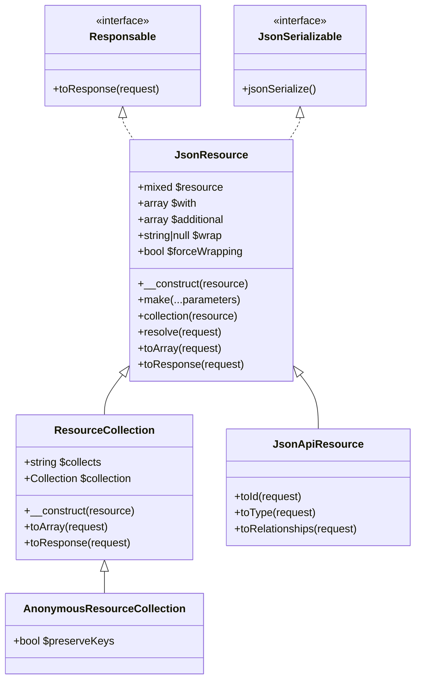
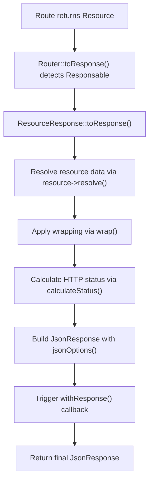
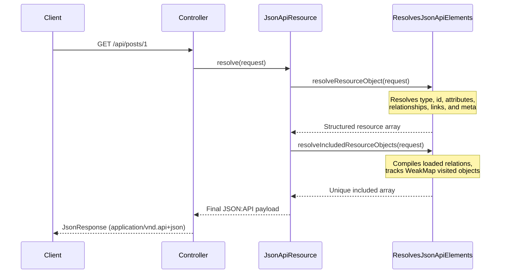
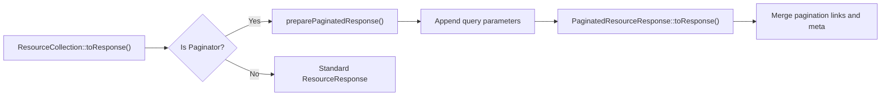

# API Resources

<details>
<summary>Relevant source files</summary>

The following files were used as context for generating this wiki page:

- [src/Illuminate/Http/Resources/Json/JsonResource.php](https://github.com/laravel/framework/blob/main/src/Illuminate/Http/Resources/Json/JsonResource.php)
- [src/Illuminate/Http/Resources/JsonApi/Concerns/ResolvesJsonApiElements.php](https://github.com/laravel/framework/blob/main/src/Illuminate/Http/Resources/JsonApi/Concerns/ResolvesJsonApiElements.php)
- [src/Illuminate/Http/Resources/JsonApi/JsonApiResource.php](https://github.com/laravel/framework/blob/main/src/Illuminate/Http/Resources/JsonApi/JsonApiResource.php)
- [src/Illuminate/Database/Console/ShowCommand.php](https://github.com/laravel/framework/blob/main/src/Illuminate/Database/Console/ShowCommand.php)
- [src/Illuminate/Http/Resources/JsonApi/AnonymousResourceCollection.php](https://github.com/laravel/framework/blob/main/src/Illuminate/Http/Resources/JsonApi/AnonymousResourceCollection.php)
- [src/Illuminate/Http/Resources/CollectsResources.php](https://github.com/laravel/framework/blob/main/src/Illuminate/Http/Resources/CollectsResources.php)
- [src/Illuminate/Routing/Router.php](https://github.com/laravel/framework/blob/main/src/Illuminate/Routing/Router.php)
- [src/Illuminate/Http/Resources/Json/ResourceCollection.php](https://github.com/laravel/framework/blob/main/src/Illuminate/Http/Resources/Json/ResourceCollection.php)
- [src/Illuminate/Http/Resources/Json/ResourceResponse.php](https://github.com/laravel/framework/blob/main/src/Illuminate/Http/Resources/Json/ResourceResponse.php)
- [src/Illuminate/Http/Resources/Json/PaginatedResourceResponse.php](https://github.com/laravel/framework/blob/main/src/Illuminate/Http/Resources/Json/PaginatedResourceResponse.php)
- [src/Illuminate/Database/Eloquent/Concerns/TransformsToResource.php](https://github.com/laravel/framework/blob/main/src/Illuminate/Database/Eloquent/Concerns/TransformsToResource.php)
- [src/Illuminate/Database/Eloquent/ModelInspector.php](https://github.com/laravel/framework/blob/main/src/Illuminate/Database/Eloquent/ModelInspector.php)
- [src/Illuminate/Foundation/Console/RouteListCommand.php](https://github.com/laravel/framework/blob/main/src/Illuminate/Foundation/Console/RouteListCommand.php)
- [src/Illuminate/Collections/Traits/TransformsToResourceCollection.php](https://github.com/laravel/framework/blob/main/src/Illuminate/Collections/Traits/TransformsToResourceCollection.php)
- [src/Illuminate/Foundation/Console/ResourceMakeCommand.php](https://github.com/laravel/framework/blob/main/src/Illuminate/Foundation/Console/ResourceMakeCommand.php)
- [src/Illuminate/Http/Resources/Json/AnonymousResourceCollection.php](https://github.com/laravel/framework/blob/main/src/Illuminate/Http/Resources/Json/AnonymousResourceCollection.php)
- [src/Illuminate/JsonSchema/Deserializer.php](https://github.com/laravel/framework/blob/main/src/Illuminate/JsonSchema/Deserializer.php)
</details>

## Overview

### Overview Introduction
The API Resources subsystem provides a dedicated transformation layer between Eloquent models, raw arrays, collections, paginators and the JSON responses delivered to API clients. By decoupling database structures from API wire representations, applications can evolve backend schemas independently of client contracts. The architecture is built around `JsonResource` for individual data items and `ResourceCollection` (along with anonymous resource collections) for groups or paginated sets. Furthermore, specialized specifications such as JSON:API compliance are supported via `JsonApiResource` and trait compositions like `ResolvesJsonApiElements`.

Sources: [src/Illuminate/Http/Resources/Json/JsonResource.php:20-21](https://github.com/laravel/framework/blob/main/src/Illuminate/Http/Resources/Json/JsonResource.php#L20-L21)

Resources integrate deeply with Laravel's container, routing, and HTTP subsystems by implementing `Responsable`, `JsonSerializable`, `ArrayAccess`, and `UrlRoutable`. They coordinate automated resource class guessing via naming conventions and attributes (`UseResource`, `UseResourceCollection`), handle conditional attribute loading, support response wrapping and custom HTTP status codes (such as automatic `201` status allocation for newly created models), and manage complex relationship inclusion trees with circular reference prevention.

Sources: [src/Illuminate/Http/Resources/Json/JsonResource.php:20-21](https://github.com/laravel/framework/blob/main/src/Illuminate/Http/Resources/Json/JsonResource.php#L20-L21), [src/Illuminate/Http/Resources/JsonApi/JsonApiResource.php:11-14](https://github.com/laravel/framework/blob/main/src/Illuminate/Http/Resources/JsonApi/JsonApiResource.php#L11-L14)

---

## Core Architecture and Data Structures

### Architecture Components
The resource architecture rests on a clear class hierarchy separating individual items from collections, while leveraging shared traits for attribute handling, delegation, and collection mapping.

Sources: [src/Illuminate/Http/Resources/Json/JsonResource.php:20-22](https://github.com/laravel/framework/blob/main/src/Illuminate/Http/Resources/Json/JsonResource.php#L20-L22), [src/Illuminate/Http/Resources/Json/ResourceCollection.php:12](https://github.com/laravel/framework/blob/main/src/Illuminate/Http/Resources/Json/ResourceCollection.php#L12)



Sources: [src/Illuminate/Http/Resources/Json/JsonResource.php:20-22](https://github.com/laravel/framework/blob/main/src/Illuminate/Http/Resources/Json/JsonResource.php#L20-L22), [src/Illuminate/Http/Resources/Json/ResourceCollection.php:12](https://github.com/laravel/framework/blob/main/src/Illuminate/Http/Resources/Json/ResourceCollection.php#L12), [src/Illuminate/Http/Resources/Json/AnonymousResourceCollection.php:5](https://github.com/laravel/framework/blob/main/src/Illuminate/Http/Resources/Json/AnonymousResourceCollection.php#L5), [src/Illuminate/Http/Resources/JsonApi/JsonApiResource.php:11](https://github.com/laravel/framework/blob/main/src/Illuminate/Http/Resources/JsonApi/JsonApiResource.php#L11)

---

## Lifecycle and Response Generation Flow

### Response Pipeline Mechanism
When an API route returns a `JsonResource` or `ResourceCollection` instance, Laravel intercepts the return value because the classes implement `Responsable`. The response pipeline executes a precise sequence of data resolution, wrapping, status calculation, and serialization.

Sources: [src/Illuminate/Routing/Router.php:918-922](https://github.com/laravel/framework/blob/main/src/Illuminate/Routing/Router.php#L918-L922), [src/Illuminate/Http/Resources/Json/ResourceResponse.php:34-50](https://github.com/laravel/framework/blob/main/src/Illuminate/Http/Resources/Json/ResourceResponse.php#L34-L50)



Sources: [src/Illuminate/Routing/Router.php:918-922](https://github.com/laravel/framework/blob/main/src/Illuminate/Routing/Router.php#L918-L922), [src/Illuminate/Http/Resources/Json/ResourceResponse.php:34-50](https://github.com/laravel/framework/blob/main/src/Illuminate/Http/Resources/Json/ResourceResponse.php#L34-L50)

> [!NOTE]
> When a model within a resource was recently created (`wasRecentlyCreated` is true), `calculateStatus()` automatically assigns HTTP status code `201` instead of `200`.

Sources: [src/Illuminate/Http/Resources/Json/ResourceResponse.php:120-124](https://github.com/laravel/framework/blob/main/src/Illuminate/Http/Resources/Json/ResourceResponse.php#L120-L124)

---

## Resource Collection and Resource Guessing

### Collection Resolution Rules
Applications frequently need to transform collections of models without manually instantiating dedicated collection classes for every model. This is handled by `CollectsResources` and model transformation traits. When `toResourceCollection()` or `collection()` is invoked on models or collections, Laravel attempts to discover the target resource or collection class using a strict precedence order.

Sources: [src/Illuminate/Collections/Traits/TransformsToResourceCollection.php:22-82](https://github.com/Illuminate/Collections/Traits/TransformsToResourceCollection.php#L22-L82), [src/Illuminate/Http/Resources/Json/JsonResource.php:88-101](https://github.com/laravel/framework/blob/main/src/Illuminate/Http/Resources/Json/JsonResource.php#L88-L101)

| Mechanism | Source File | Description |
| :--- | :--- | :--- |
| `CollectsResources::collectResource()` | `CollectsResources.php:30-49` | Maps raw arrays or collections into instantiated resource items based on `collects()`. |
| `TransformsToResource::toResource()` | `TransformsToResource.php:19-26` | Instantiates a resource for a single model instance using class guessing or explicit class name. |
| `TransformsToResourceCollection::toResourceCollection()` | `TransformsToResourceCollection.php:22-29` | Instantiates a resource collection for a collection or paginator instance. |

Sources: [src/Illuminate/Http/Resources/CollectsResources.php:30-49](https://github.com/laravel/framework/blob/main/src/Illuminate/Http/Resources/CollectsResources.php#L30-L49), [src/Illuminate/Database/Eloquent/Concerns/TransformsToResource.php:19-26](https://github.com/laravel/framework/blob/main/src/Illuminate/Database/Eloquent/Concerns/TransformsToResource.php#L19-L26), [src/Illuminate/Collections/Traits/TransformsToResourceCollection.php:22-29](https://github.com/Illuminate/Collections/Traits/TransformsToResourceCollection.php#L22-L29)

---

## JSON:API Resource Integration

### JSON:API Specification Mapping
The `JsonApiResource` class and the `ResolvesJsonApiElements` trait implement the JSON:API specification, structuring resource objects with explicit `id`, `type`, `attributes`, `relationships`, `links`, and `meta` blocks.

Sources: [src/Illuminate/Http/Resources/JsonApi/JsonApiResource.php:11-192](https://github.com/laravel/framework/blob/main/src/Illuminate/Http/Resources/JsonApi/JsonApiResource.php#L11-L192), [src/Illuminate/Http/Resources/JsonApi/Concerns/ResolvesJsonApiElements.php:26-366](https://github.com/laravel/framework/blob/main/src/Illuminate/Http/Resources/JsonApi/Concerns/ResolvesJsonApiElements.php#L26-366)



Sources: [src/Illuminate/Http/Resources/JsonApi/JsonApiResource.php:11-192](https://github.com/laravel/framework/blob/main/src/Illuminate/Http/Resources/JsonApi/JsonApiResource.php#L11-L192), [src/Illuminate/Http/Resources/JsonApi/Concerns/ResolvesJsonApiElements.php:26-366](https://github.com/laravel/framework/blob/main/src/Illuminate/Http/Resources/JsonApi/Concerns/ResolvesJsonApiElements.php#L26-366)

### Circular Reference Protection
When resolving included relationships in JSON:API payloads, circular references (such as a post belonging to a user who authored another post) can cause infinite loops. Laravel prevents this by tracking visited instances via a PHP `WeakMap`:

Sources: [src/Illuminate/Http/Resources/JsonApi/Concerns/ResolvesJsonApiElements.php:315-339](https://github.com/laravel/framework/blob/main/src/Illuminate/Http/Resources/JsonApi/Concerns/ResolvesJsonApiElements.php#L315-L339)

```php
$visitedObjects = new WeakMap;

$visitedObjects[$this->resource] = [
    $this->resolveResourceType($request) => true,
];
```

If an underlying resource instance has already been visited for the same resource type, the resolver skips processing it further.

Sources: [src/Illuminate/Http/Resources/JsonApi/Concerns/ResolvesJsonApiElements.php:315-339](https://github.com/laravel/framework/blob/main/src/Illuminate/Http/Resources/JsonApi/Concerns/ResolvesJsonApiElements.php#L315-L339)

> [!WARNING]
> Attempting to call `wrap()` or `withoutWrapping()` on a `JsonApiResource` will throw a `BadMethodCallException`, as wrapping is strictly controlled by the JSON:API specification.

Sources: [src/Illuminate/Http/Resources/JsonApi/JsonApiResource.php:226-240](https://github.com/laravel/framework/blob/main/src/Illuminate/Http/Resources/JsonApi/JsonApiResource.php#L226-L240)

---

## Pagination and Paginator Responses

### Paginated Response Handling
When a resource collection receives an `AbstractPaginator` or `AbstractCursorPaginator`, `ResourceCollection` delegates response generation to `PaginatedResourceResponse`.

Sources: [src/Illuminate/Http/Resources/Json/ResourceCollection.php:115-122](https://github.com/laravel/framework/blob/main/src/Illuminate/Http/Resources/Json/ResourceCollection.php#L115-L122), [src/Illuminate/Http/Resources/Json/PaginatedResourceResponse.php:15-42](https://github.com/laravel/framework/blob/main/src/Illuminate/Http/Resources/Json/PaginatedResourceResponse.php#L15-42)



Sources: [src/Illuminate/Http/Resources/Json/ResourceCollection.php:115-122](https://github.com/laravel/framework/blob/main/src/Illuminate/Http/Resources/Json/ResourceCollection.php#L115-L122), [src/Illuminate/Http/Resources/Json/PaginatedResourceResponse.php:15-42](https://github.com/laravel/framework/blob/main/src/Illuminate/Http/Resources/Json/PaginatedResourceResponse.php#L15-42)

The pagination response automatically extracts navigation links (`first`, `last`, `prev`, `next`) and metadata (`current_page`, `total`, `per_page`, etc.) while retaining original pagination data integrity.

Sources: [src/Illuminate/Http/Resources/Json/PaginatedResourceResponse.php:50-98](https://github.com/laravel/framework/blob/main/src/Illuminate/Http/Resources/Json/PaginatedResourceResponse.php#L50-L98)

---

## Runnable Usage Example

### Implementation Sample
The following example demonstrates how to define an Eloquent model with resource transformation attributes, implement a standard `JsonResource`, and return it from a controller action.

Sources: [src/Illuminate/Database/Eloquent/Concerns/TransformsToResource.php:19-26](https://github.com/laravel/framework/blob/main/src/Illuminate/Database/Eloquent/Concerns/TransformsToResource.php#L19-L26), [src/Illuminate/Http/Resources/Json/JsonResource.php:162-176](https://github.com/laravel/framework/blob/main/src/Illuminate/Http/Resources/Json/JsonResource.php#L162-L176)

```php
namespace App\Models;

use Illuminate\Database\Eloquent\Model;
use Illuminate\Database\Eloquent\Concerns\TransformsToResource;
use Illuminate\Database\Eloquent\Attributes\UseResource;
use App\Http\Resources\UserResource;

#[UseResource(UserResource::class)]
class User extends Model
{
    use TransformsToResource;

    protected $fillable = ['name', 'email'];
}

// ---

namespace App\Http\Resources;

use Illuminate\Http\Resources\Json\JsonResource;

class UserResource extends JsonResource
{
    public function toArray($request)
    {
        return [
            'id' => $this->id,
            'name' => $this->name,
            'email' => $this->email,
            'created_at' => $this->created_at->toIso8601String(),
        ];
    }
}

// ---

namespace App\Http\Controllers;

use App\Models\User;

class UserController extends Controller
{
    public function show(User $user)
    {
        // Automatically resolved via TransformsToResource trait and UseResource attribute
        return $user->toResource();
    }
}
```

Sources: [src/Illuminate/Database/Eloquent/Concerns/TransformsToResource.php:19-26](https://github.com/laravel/framework/blob/main/src/Illuminate/Database/Eloquent/Concerns/TransformsToResource.php#L19-L26), [src/Illuminate/Http/Resources/Json/JsonResource.php:162-176](https://github.com/laravel/framework/blob/main/src/Illuminate/Http/Resources/Json/JsonResource.php#L162-L176)

## Related

- [[Eloquent Models]]

