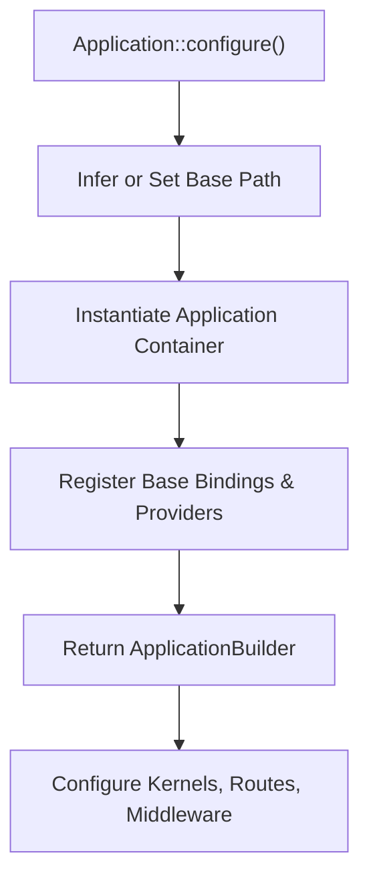
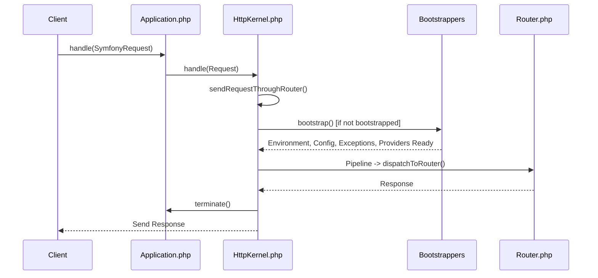

# Application Lifecycle

<details>
<summary>Relevant source files</summary>

The following files were used as context for generating this wiki page:

- [src/Illuminate/Foundation/Application.php](https://github.com/laravel/framework/blob/main/src/Illuminate/Foundation/Application.php)
- [src/Illuminate/Foundation/Providers/FoundationServiceProvider.php](https://github.com/laravel/framework/blob/main/src/Illuminate/Foundation/Providers/FoundationServiceProvider.php)
- [src/Illuminate/Foundation/Http/Kernel.php](https://github.com/laravel/framework/blob/main/src/Illuminate/Foundation/Http/Kernel.php)
- [src/Illuminate/Foundation/Bootstrap/HandleExceptions.php](https://github.com/laravel/framework/blob/main/src/Illuminate/Foundation/Bootstrap/HandleExceptions.php)
- [src/Illuminate/Foundation/Console/Kernel.php](https://github.com/laravel/framework/blob/main/src/Illuminate/Foundation/Console/Kernel.php)
- [src/Illuminate/Foundation/Configuration/ApplicationBuilder.php](https://github.com/laravel/framework/blob/main/src/Illuminate/Foundation/Configuration/ApplicationBuilder.php)
- [src/Illuminate/Support/Facades/App.php](https://github.com/laravel/framework/blob/main/src/Illuminate/Support/Facades/App.php)
- [src/Illuminate/Foundation/Bootstrap/LoadConfiguration.php](https://github.com/laravel/framework/blob/main/src/Illuminate/Foundation/Bootstrap/LoadConfiguration.php)
- [src/Illuminate/Foundation/Bootstrap/LoadEnvironmentVariables.php](https://github.com/laravel/framework/blob/main/src/Illuminate/Foundation/Bootstrap/LoadEnvironmentVariables.php)
- [src/Illuminate/Foundation/Bootstrap/RegisterFacades.php](https://github.com/laravel/framework/blob/main/src/Illuminate/Foundation/Bootstrap/RegisterFacades.php)
- [src/Illuminate/Foundation/Bootstrap/SetRequestForConsole.php](https://github.com/laravel/framework/blob/main/src/Illuminate/Foundation/Bootstrap/SetRequestForConsole.php)
- [src/Illuminate/Foundation/Bootstrap/BootProviders.php](https://github.com/laravel/framework/blob/main/src/Illuminate/Foundation/Bootstrap/BootProviders.php)
- [src/Illuminate/Contracts/Http/Kernel.php](https://github.com/laravel/framework/blob/main/src/Illuminate/Contracts/Http/Kernel.php)
- [src/Illuminate/Contracts/Foundation/Application.php](https://github.com/laravel/framework/blob/main/src/Illuminate/Contracts/Foundation/Application.php)
- [src/Illuminate/Foundation/Testing/TestCase.php](https://github.com/laravel/framework/blob/main/src/Illuminate/Testing/TestCase.php)
- [src/Illuminate/Foundation/Bootstrap/RegisterProviders.php](https://github.com/laravel/framework/blob/main/src/Illuminate/Foundation/Bootstrap/RegisterProviders.php)
</details>

## Overview

### Introduction

The Application Lifecycle subsystem manages the initialization, execution, bootstrapping, and teardown of the Laravel framework. It serves as the primary coordination layer between low-level container bindings, configuration parsing, service providers, routing, exception handling, and request-handling kernels. By separating container construction from environment loading and service registration, the framework ensures a predictable and deterministic sequence of operations across distinct runtimes such as HTTP requests, CLI commands, and test suites.

Sources: [src/Illuminate/Foundation/Application.php:39-40](https://github.com/laravel/framework/blob/main/src/Illuminate/Foundation/Application.php#L39-L40)

The core design centers on the `Illuminate\Foundation\Application` container class working in tandem with request-specific kernels (`Illuminate\Foundation\Http\Kernel` and `Illuminate\Foundation\Console\Kernel`) and an ordered array of bootstrapper classes. These components solve the problem of contextual bootstrapping—configuring environment variables, compiling or loading configuration files, registering facade aliases, and resolving deferred or explicit service providers in a precise sequence before executing user-land logic or routing.

Sources: [src/Illuminate/Foundation/Http/Kernel.php:43-50](https://github.com/laravel/framework/blob/main/src/Illuminate/Foundation/Http/Kernel.php#L43-L50)

Adopting a modular bootstrapper architecture allows the framework to execute specialized life-cycles without code duplication. For instance, testing environments can selectively bypass framework booting or utilize cached states, while console commands can invoke `bootstrapWithoutBootingProviders()` for internal operations like environment encryption. This design guarantees thread-safe, isolated execution states and provides clean extension points via `booting`, `booted`, and `terminating` callbacks.

Sources: [src/Illuminate/Foundation/Console/Kernel.php:120-128](https://github.com/laravel/framework/blob/main/src/Illuminate/Foundation/Console/Kernel.php#L120-L128)

---

## Application Initialization and Builder Pattern

The lifecycle begins when an entry point instantiates the application or invokes `Application::configure($basePath)`. This static method resolves the application's base directory—falling back to `APP_BASE_PATH` environment variables or scanning composer autloader paths—and instantiates an `ApplicationBuilder` configured with default kernels, event handling, commands, and providers.

Sources: [src/Illuminate/Foundation/Application.php:241-253](https://github.com/laravel/framework/blob/main/src/Illuminate/Foundation/Application.php#L241-L253)



Sources: [src/Illuminate/Foundation/Configuration/ApplicationBuilder.php:51-53](https://github.com/laravel/framework/blob/main/src/Illuminate/Foundation/Configuration/ApplicationBuilder.php#L51-L53)

When the `Application` constructor executes, it registers essential base bindings, base service providers, core container aliases, and cloud services into the IoC container.

Sources: [src/Illuminate/Foundation/Application.php:223-233](https://github.com/laravel/framework/blob/main/src/Illuminate/Foundation/Application.php#L223-L233)

```php
public function __construct($basePath = null)
{
    if ($basePath) {
        $this->setBasePath($basePath);
    }

    $this->registerBaseBindings();
    $this->registerBaseServiceProviders();
    $this->registerCoreContainerAliases();
    $this->registerLaravelCloudServices();
}
```

Sources: [src/Illuminate/Foundation/Application.php:223-233](https://github.com/laravel/framework/blob/main/src/Illuminate/Foundation/Application.php#L223-L233)

---

## The Bootstrapping Sequence and Path Normalization

Before handling any incoming request or console command, the application passes through a deterministic sequence of bootstrapper classes managed by the HTTP or Console kernel. The HTTP kernel defines six sequential bootstrapper classes, while the Console kernel adds request initialization for CLI environments.

Sources: [src/Illuminate/Foundation/Http/Kernel.php:43-50](https://github.com/laravel/framework/blob/main/src/Illuminate/Foundation/Http/Kernel.php#L43-L50)

| Bootstrapper Order | Class Name | Responsibility |
| :--- | :--- | :--- |
| 1 | `LoadEnvironmentVariables` | Loads `.env` file variables or environment overrides |
| 2 | `LoadConfiguration` | Compiles or loads configuration files from the config directory |
| 3 | `HandleExceptions` | Registers PHP error handlers, exception handlers, and shutdown hooks |
| 4 | `RegisterFacades` | Sets facade container instance and registers alias loaders |
| 5 | `SetRequestForConsole` *(Console Only)* | Binds a default console HTTP request instance into the container |
| 5 / 6 | `RegisterProviders` | Merges package providers and registers configured service providers |
| 6 / 7 | `BootProviders` | Invokes the `boot()` method on all registered service providers |

Sources: [src/Illuminate/Foundation/Console/Kernel.php:120-128](https://github.com/laravel/framework/blob/main/src/Illuminate/Foundation/Console/Kernel.php#L120-L128)

During this initialization sequence, path normalization and cache resolution follow an explicit, multi-step execution path: `bootstrap()` calls `getCachedConfigPath()`, which invokes `normalizeCachePath()`, which subsequently resolves absolute prefixes or invokes `bootstrapPath()`, ultimately combining path segments via `joinPaths()`.

Sources: [src/Illuminate/Foundation/Bootstrap/LoadConfiguration.php:27-46](https://github.com/laravel/framework/blob/main/src/Illuminate/Foundation/Bootstrap/LoadConfiguration.php#L27-L46)

```php
// Execution path: bootstrap() -> getCachedConfigPath() -> normalizeCachePath() -> bootstrapPath() -> joinPaths()
public function bootstrap(Application $app)
{
    if (file_exists($cached = $app->getCachedConfigPath())) {
        $items = require $cached;
    }
}
```

Sources: [src/Illuminate/Foundation/Bootstrap/LoadConfiguration.php:27-46](https://github.com/laravel/framework/blob/main/src/Illuminate/Foundation/Bootstrap/LoadConfiguration.php#L27-L46)

The kernel executes these classes sequentially via `bootstrapWith()`:

Sources: [src/Illuminate/Foundation/Application.php:342-353](https://github.com/laravel/framework/blob/main/src/Illuminate/Foundation/Application.php#L342-L353)

```php
public function bootstrapWith(array $bootstrappers)
{
    $this->hasBeenBootstrapped = true;

    foreach ($bootstrappers as $bootstrapper) {
        $this['events']->dispatch('bootstrapping: '.$bootstrapper, [$this]);

        $this->make($bootstrapper)->bootstrap($this);

        $this['events']->dispatch('bootstrapped: '.$bootstrapper, [$this]);
    }
}
```

Sources: [src/Illuminate/Foundation/Application.php:342-353](https://github.com/laravel/framework/blob/main/src/Illuminate/Foundation/Application.php#L342-L353)

> [!WARNING]
> The `hasBeenBootstrapped` flag is set to `true` on the first execution of `bootstrapWith()`. Subsequent calls to `bootstrap()` in kernels check this flag and return immediately to prevent duplicate bootstrapping overhead.

Sources: [src/Illuminate/Foundation/Http/Kernel.php:183-188](https://github.com/laravel/framework/blob/main/src/Illuminate/Foundation/Http/Kernel.php#L183-L188)

---

## Call-Chain Execution Walkthrough: HTTP Request Handling

When an HTTP request enters the application, control flows from the public entry point through the HTTP kernel, bootstrap phase, middleware pipeline, and router dispatch.

Sources: [src/Illuminate/Foundation/Application.php:1212-1215](https://github.com/laravel/framework/blob/main/src/Illuminate/Foundation/Application.php#L1212-L1215)

1. **`Application::handle()`**: Receives a Symfony request and delegates to the bound HTTP kernel contract, wrapping the request into an `Illuminate\Http\Request`.

Sources: [src/Illuminate/Foundation/Application.php:1212-1215](https://github.com/laravel/framework/blob/main/src/Illuminate/Foundation/Application.php#L1212-L1215)

2. **`Kernel::handle()`**: Records request start time (`Carbon::now()`), enables HTTP method overrides, and invokes `sendRequestThroughRouter()`.

Sources: [src/Illuminate/Foundation/Http/Kernel.php:137-156](https://github.com/laravel/framework/blob/main/src/Illuminate/Foundation/Http/Kernel.php#L137-L156)

3. **`Kernel::sendRequestThroughRouter()`**: Binds the request to the container, clears resolved request instances, and calls `bootstrap()`.

Sources: [src/Illuminate/Foundation/Http/Kernel.php:164-176](https://github.com/laravel/framework/blob/main/src/Illuminate/Foundation/Http/Kernel.php#L164-L176)

4. **`Kernel::bootstrap()`**: Checks `$this->app->hasBeenBootstrapped()`. If false, calls `$this->app->bootstrapWith($this->bootstrappers())` executing the 6 HTTP bootstrappers in order.

Sources: [src/Illuminate/Foundation/Http/Kernel.php:183-188](https://github.com/laravel/framework/blob/main/src/Illuminate/Foundation/Http/Kernel.php#L183-L188)

5. **`Pipeline::send()`**: Passes the request through global and route middleware stacks before reaching `dispatchToRouter()`.

Sources: [src/Illuminate/Foundation/Http/Kernel.php:172-175](https://github.com/laravel/framework/blob/main/src/Illuminate/Foundation/Http/Kernel.php#L172-L175)

6. **`Router::dispatch()`**: Matches routes and executes controller actions, returning a Symfony/Illuminate Response.

Sources: [src/Illuminate/Foundation/Http/Kernel.php:195-202](https://github.com/laravel/framework/blob/main/src/Illuminate/Foundation/Http/Kernel.php#L195-L202)

7. **`Kernel::terminate()`**: Dispatches the `Terminating` event, invokes `terminate()` on terminable middleware, calls `$app->terminate()`, and records execution duration metrics.

Sources: [src/Illuminate/Foundation/Http/Kernel.php:211-234](https://github.com/laravel/framework/blob/main/src/Illuminate/Foundation/Http/Kernel.php#L211-L234)



Sources: [src/Illuminate/Foundation/Http/Kernel.php:137-176](https://github.com/laravel/framework/blob/main/src/Illuminate/Foundation/Http/Kernel.php#L137-L176)

---

## Service Provider Registration and Booting

Service providers are the central place of application bootstrapping. They pass through two distinct lifecycle phases: **Registration** and **Booting**.

Sources: [src/Illuminate/Foundation/Application.php:890-932](https://github.com/laravel/framework/blob/main/src/Illuminate/Foundation/Application.php#L890-L932)

During the `RegisterProviders` bootstrapper, configured providers and package manifest providers are loaded via `ProviderRepository::load()`.

Sources: [src/Illuminate/Foundation/Bootstrap/RegisterProviders.php:30-38](https://github.com/laravel/framework/blob/main/src/Illuminate/Foundation/Bootstrap/RegisterProviders.php#L30-L38)

```php
public function register($provider, $force = false)
{
    if (($registered = $this->getProvider($provider)) && ! $force) {
        return $registered;
    }

    if (is_string($provider)) {
        $provider = $this->resolveProvider($provider);
    }

    $provider->register();

    if (property_exists($provider, 'bindings')) {
        foreach ($provider->bindings as $key => $value) {
            $this->bind($key, $value);
        }
    }

    if (property_exists($provider, 'singletons')) {
        foreach ($provider->singletons as $key => $value) {
            $key = is_int($key) ? $value : $key;
            $this->singleton($key, $value);
        }
    }

    $this->markAsRegistered($provider);

    if ($this->isBooted()) {
        $this->bootProvider($provider);
    }

    return $provider;
}
```

Sources: [src/Illuminate/Foundation/Application.php:890-932](https://github.com/laravel/framework/blob/main/src/Illuminate/Foundation/Application.php#L890-L932)

Once all providers are registered, the `BootProviders` bootstrapper calls `$app->boot()`. This invokes `booting` callbacks, iterates over all registered providers calling `bootProvider()`, sets `$this->booted = true`, and fires `booted` callbacks.

Sources: [src/Illuminate/Foundation/Bootstrap/BootProviders.php:15-18](https://github.com/laravel/framework/blob/main/src/Illuminate/Foundation/Bootstrap/BootProviders.php#L15-L18)

> [!NOTE]
> If a service provider is registered *after* the application has already booted, `register()` immediately invokes `bootProvider($provider)` on that individual provider so it does not miss its boot cycle.

Sources: [src/Illuminate/Foundation/Application.php:927-930](https://github.com/laravel/framework/blob/main/src/Illuminate/Foundation/Application.php#L927-L930)

---

## Error Handling and Exception Lifecycles

Exception management is established during bootstrapping by `Illuminate\Foundation\Bootstrap\HandleExceptions`. This class configures PHP error reporting, sets custom error and exception handlers, and registers a shutdown function.

Sources: [src/Illuminate/Foundation/Bootstrap/HandleExceptions.php:41-58](https://github.com/laravel/framework/blob/main/src/Illuminate/Foundation/Bootstrap/HandleExceptions.php#L41-L58)

```php
public function bootstrap(Application $app)
{
    static::$reservedMemory = str_repeat('x', 32768);
    static::$app = $app;

    error_reporting(-1);

    set_error_handler($this->forwardsTo('handleError'));
    set_exception_handler($this->forwardsTo('handleException'));
    register_shutdown_function($this->forwardsTo('handleShutdown'));

    if (! $app->environment('testing')) {
        ini_set('display_errors', 'Off');
    }
}
```

Sources: [src/Illuminate/Foundation/Bootstrap/HandleExceptions.php:41-58](https://github.com/laravel/framework/blob/main/src/Illuminate/Foundation/Bootstrap/HandleExceptions.php#L41-L58)

Uncaught exceptions and fatal errors (detected via `error_get_last()` in `handleShutdown()`) are routed to `handleException()`, which reports the exception to the container's `ExceptionHandler` contract and renders either a console output or HTTP response.

Sources: [src/Illuminate/Foundation/Bootstrap/HandleExceptions.php:186-205](https://github.com/laravel/framework/blob/main/src/Illuminate/Foundation/Bootstrap/HandleExceptions.php#L186-L205)

```php
public function handleException(Throwable $e)
{
    static::$reservedMemory = null;

    try {
        $this->getExceptionHandler()->report($e);
    } catch (Exception) {
        $exceptionHandlerFailed = true;
    }

    if (static::$app->runningInConsole()) {
        $this->renderForConsole($e);

        if ($exceptionHandlerFailed ?? false) {
            exit(1);
        }
    } else {
        $this->renderHttpResponse($e);
    }
}
```

Sources: [src/Illuminate/Foundation/Bootstrap/HandleExceptions.php:186-205](https://github.com/laravel/framework/blob/main/src/Illuminate/Foundation/Bootstrap/HandleExceptions.php#L186-L205)

---

## Application Teardown and Termination

When an HTTP request or console command finishes execution, the kernel triggers the termination lifecycle. This phase ensures background jobs, middleware termination hooks, and registered `terminating` callbacks execute cleanly.

Sources: [src/Illuminate/Foundation/Application.php:1468-1477](https://github.com/laravel/framework/blob/main/src/Illuminate/Foundation/Application.php#L1468-L1477)

```php
public function terminate()
{
    $index = 0;

    while ($index < count($this->terminatingCallbacks)) {
        $this->call($this->terminatingCallbacks[$index]);

        $index++;
    }
}
```

Sources: [src/Illuminate/Foundation/Application.php:1468-1477](https://github.com/laravel/framework/blob/main/src/Illuminate/Foundation/Application.php#L1468-L1477)

In the HTTP kernel, termination triggers dispatching the `Terminating` event, invoking `terminate($request, $response)` on all active middleware, calling `$app->terminate()`, and checking request duration thresholds.

Sources: [src/Illuminate/Foundation/Http/Kernel.php:211-234](https://github.com/laravel/framework/blob/main/src/Illuminate/Foundation/Http/Kernel.php#L211-L234)

---

## Testing Environment Lifecycles

Laravel test cases extend `Illuminate\Foundation\Testing\TestCase`, which manages application instance creation and environment teardown per test method.

Sources: [src/Illuminate/Foundation/Testing/TestCase.php:45-62](https://github.com/laravel/framework/blob/main/src/Illuminate/Foundation/Testing/TestCase.php#L45-L62)

```php
public function createApplication()
{
    $app = require Application::inferBasePath().'/bootstrap/app.php';

    $this->traitsUsedByTest = class_uses_recursive(static::class);

    if (isset(CachedState::$cachedConfig, $this->traitsUsedByTest[WithCachedConfig::class])) {
        $this->markConfigCached($app);
    }

    if (isset(CachedState::$cachedRoutes, $this->traitsUsedByTest[WithCachedRoutes::class])) {
        $app->booting(fn () => $this->markRoutesCached($app));
    }

    $app->make(Kernel::class)->bootstrap();

    return $app;
}
```

Sources: [src/Illuminate/Foundation/Testing/TestCase.php:45-62](https://github.com/laravel/framework/blob/main/src/Illuminate/Foundation/Testing/TestCase.php#L45-L62)

> [!TIP]
> Test methods decorated with the `#[UnitTest]` attribute skip framework booting entirely via `withoutBootingFramework()`, significantly accelerating unit test execution by avoiding database, container, and provider bootstrapping overhead.

Sources: [src/Illuminate/Foundation/Testing/TestCase.php:111-122](https://github.com/laravel/framework/blob/main/src/Illuminate/Foundation/Testing/TestCase.php#L111-L122)

---

## Design Trade-Offs

| Design Choice | Benefit | Cost |
| :--- | :--- | :--- |
| **Sequential Bootstrapper Array** | Deterministic ordering of environment, configuration, and providers; highly extensible via custom bootstrapper classes. | Strict dependency ordering requirements between bootstrapper classes (e.g. Config must load before Exception handling). |
| **Deferred Service Providers** | Reduces memory footprint and boot time by delaying provider registration until a bound service is resolved. | Slight overhead during container resolution checks (`loadDeferredProviderIfNeeded`). |
| **Global State in Static Handlers** | Allows `HandleExceptions` and `RegisterProviders` to intercept PHP engine-level errors and shutdowns reliably. | Requires explicit state flushing (`flushState()`) during parallel testing or multi-request test suites. |

Sources: [src/Illuminate/Foundation/Http/Kernel.php:43-50](https://github.com/laravel/framework/blob/main/src/Illuminate/Foundation/Http/Kernel.php#L43-L50)

---

## Complete Worked Example

The following example demonstrates how to configure an application builder instance, register custom bindings, hook into booting and booted lifecycle events, and handle an HTTP request:

Sources: [src/Illuminate/Foundation/Configuration/ApplicationBuilder.php:51-73](https://github.com/laravel/framework/blob/main/src/Illuminate/Foundation/Configuration/ApplicationBuilder.php#L51-L73)

```php
use Illuminate\Foundation\Application;
use Illuminate\Contracts\Http\Kernel;
use Illuminate\Http\Request;

// 1. Configure the application instance using the ApplicationBuilder
$appBuilder = Application::configure(basePath: __DIR__.'/../')
    ->withRouting(
        web: __DIR__.'/../routes/web.php',
        commands: __DIR__.'/../routes/console.php',
        health: '/up',
    )
    ->withMiddleware(function ($middleware) {
        $middleware->web(append: [
            \App\Http\Middleware\TrimStrings::class,
        ]);
    })
    ->withExceptions(function ($exceptions) {
        // Configure custom exception reporting
    });

// 2. Retrieve the container application instance
$app = $appBuilder->create();

// 3. Register a booting lifecycle callback
$app->booting(function () {
    // Executed before service providers are booted
});

// 4. Handle an incoming HTTP request via the kernel
$kernel = $app->make(Kernel::class);
$request = Request::capture();
$response = $kernel->handle($request);

$response->send();
$kernel->terminate($request, $response);
```

Sources: [src/Illuminate/Foundation/Configuration/ApplicationBuilder.php:527-530](https://github.com/laravel/framework/blob/main/src/Illuminate/Foundation/Configuration/ApplicationBuilder.php#L527-L530)

## Related

- [[Dependency Injection Container]]
- [[Service Providers]]
- [[HTTP Request & Response]]

