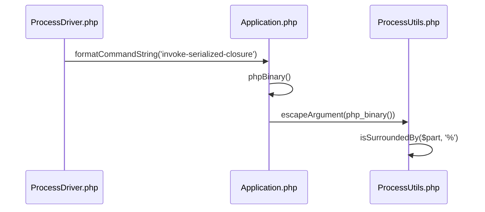
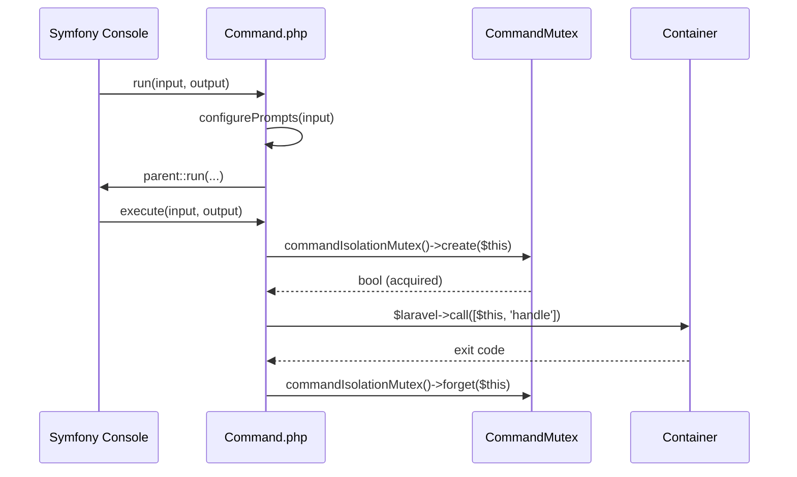
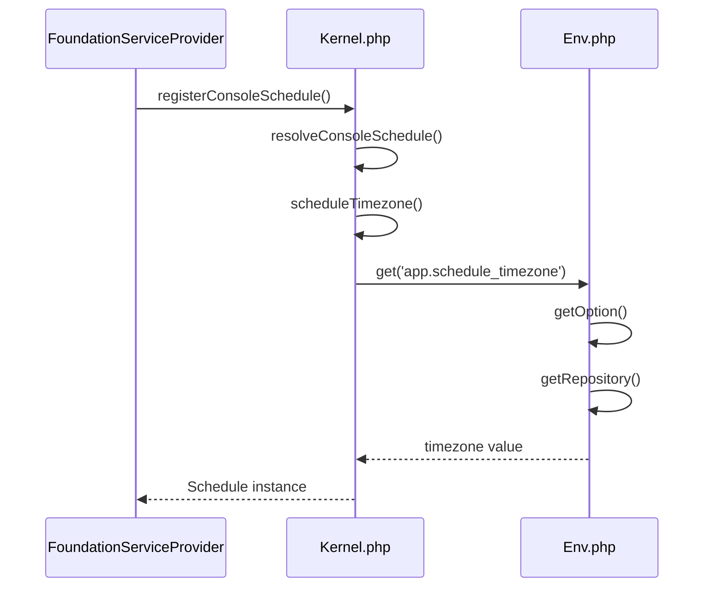

# Artisan Console Kernel

<details>
<summary>Relevant source files</summary>

The following files were used as context for generating this wiki page:

- [src/Illuminate/Foundation/Console/Kernel.php](https://github.com/laravel/framework/blob/main/src/Illuminate/Foundation/Console/Kernel.php)
- [src/Illuminate/Foundation/Providers/ArtisanServiceProvider.php](https://github.com/laravel/framework/blob/main/src/Illuminate/Foundation/Providers/ArtisanServiceProvider.php)
- [src/Illuminate/Console/Application.php](https://github.com/laravel/framework/blob/main/src/Illuminate/Console/Application.php)
- [src/Illuminate/Foundation/Configuration/ApplicationBuilder.php](https://github.com/laravel/framework/blob/main/src/Illuminate/Foundation/Configuration/ApplicationBuilder.php)
- [src/Illuminate/Console/Command.php](https://github.com/laravel/framework/blob/main/src/Illuminate/Console/Command.php)
- [src/Illuminate/Support/Facades/Artisan.php](https://github.com/laravel/framework/blob/main/src/Illuminate/Support/Facades/Artisan.php)
- [src/Illuminate/Contracts/Console/Kernel.php](https://github.com/laravel/framework/blob/main/src/Illuminate/Contracts/Console/Kernel.php)
- [src/Illuminate/Contracts/Console/Application.php](https://github.com/laravel/framework/blob/main/src/Illuminate/Contracts/Console/Application.php)
- [src/Illuminate/Concurrency/ProcessDriver.php](https://github.com/laravel/framework/blob/main/src/Illuminate/Concurrency/ProcessDriver.php)
- [src/Illuminate/Console/Scheduling/Schedule.php](https://github.com/laravel/framework/blob/main/src/Illuminate/Console/Scheduling/Schedule.php)
- [src/Illuminate/Foundation/Providers/FoundationServiceProvider.php](https://github.com/laravel/framework/blob/main/src/Illuminate/Foundation/Providers/FoundationServiceProvider.php)
- [src/Illuminate/Support/Env.php](https://github.com/laravel/framework/blob/main/src/Illuminate/Support/Env.php)
- [src/Illuminate/Support/ProcessUtils.php](https://github.com/laravel/framework/blob/main/src/Illuminate/Support/ProcessUtils.php)
</details>

## Overview

The Artisan Console Kernel serves as the central orchestrator for Laravel’s command-line application, bridging the core container architecture with Symfony's console component. It manages service provider bootstrapping, dynamic command discovery, lifecycle event dispatching, and robust execution pipelines for terminal-based operations. By binding the `Illuminate\Contracts\Console\Kernel` interface, the framework integrates CLI invocation seamlessly alongside HTTP request lifecycles. Sources: [src/Illuminate/Foundation/Console/Kernel.php#L13-L35](https://github.com/laravel/framework/blob/main/src/Illuminate/Foundation/Console/Kernel.php#L13-L35), [src/Illuminate/Foundation/Configuration/ApplicationBuilder.php#L60-L73](https://github.com/laravel/framework/blob/main/src/Illuminate/Foundation/Configuration/ApplicationBuilder.php#L60-L73), [src/Illuminate/Contracts/Console/Kernel.php#L5-L64](https://github.com/laravel/framework/blob/main/src/Illuminate/Contracts/Console/Kernel.php#L5-L64)

The kernel solves the complexity of runtime configuration, command routing, and error handling across diverse deployment environments through automated path scanning, container resolution, and unified event rerouting. It establishes foundational bootstrappers like environment loading and configuration parsing while offering customizable extension hooks for scheduling, closures, and long-running process monitoring. Sources: [src/Illuminate/Foundation/Console/Kernel.php#L120-L128](https://github.com/laravel/framework/blob/main/src/Illuminate/Foundation/Console/Kernel.php#L120-L128), [src/Illuminate/Foundation/Console/Kernel.php#L187-L236](https://github.com/laravel/framework/blob/main/src/Illuminate/Foundation/Console/Kernel.php#L187-L236), [src/Illuminate/Foundation/Console/Kernel.php#L335-L389](https://github.com/laravel/framework/blob/main/src/Illuminate/Foundation/Console/Kernel.php#L335-L389)

## Console Kernel Contracts and Bootstrap

### Console Kernel Contracts and Bootstrap

### Architectural Role and Contract Bindings

The console kernel architecture centers on the `Illuminate\Contracts\Console\Kernel` contract, which defines core lifecycle methods including `bootstrap()`, `handle()`, `call()`, `queue()`, `all()`, `output()`, and `terminate()`. The framework application builder registers this contract as a singleton binding mapped to the concrete implementation `Illuminate\Foundation\Console\Kernel`. 

```php
$this->app->singleton(
    \Illuminate\Contracts\Http\Kernel::class,
    \Illuminate\Foundation\Http\Kernel::class,
);

$this->app->singleton(
    \Illuminate\Contracts\Console\Kernel::class,
    \Illuminate\Foundation\Console\Kernel::class,
);
```

Sources: [src/Illuminate/Foundation/Configuration/ApplicationBuilder.php#L60-L73](https://github.com/laravel/framework/blob/main/src/Illuminate/Foundation/Configuration/ApplicationBuilder.php#L60-L73), [src/Illuminate/Contracts/Console/Kernel.php#L5-L64](https://github.com/laravel/framework/blob/main/src/Illuminate/Contracts/Console/Kernel.php#L5-L64)

The `Illuminate\Support\Facades\Artisan` facade resolves its underlying component accessor directly from the `ConsoleKernelContract::class` interface binding in the container, proxying static method calls onto the resolved kernel instance.

```php
protected static function getFacadeAccessor()
{
    return ConsoleKernelContract::class;
}
```

Sources: [src/Illuminate/Support/Facades/Artisan.php#L30-L38](https://github.com/laravel/framework/blob/main/src/Illuminate/Support/Facades/Artisan.php#L30-L38)

### Framework Application Bootstrap Integration

When handling a console command execution via `handle()`, the kernel initializes command duration tracking, checks for special encryption/decryption arguments, and triggers the framework bootstrap sequence before running the Artisan console application instance.

```php
public function handle($input, $output = null)
{
    $this->commandStartedAt = Carbon::now();

    try {
        if (in_array($input->getFirstArgument(), ['env:encrypt', 'env:decrypt'], true)) {
            $this->bootstrapWithoutBootingProviders();
        }

        $this->bootstrap();

        return $this->getArtisan()->run($input, $output);
    } catch (Throwable $e) {
        $this->reportException($e);

        $this->renderException($output, $e);

        return 1;
    }
}
```

Sources: [src/Illuminate/Foundation/Console/Kernel.php#L187-L206](https://github.com/laravel/framework/blob/main/src/Illuminate/Foundation/Console/Kernel.php#L187-L206)

The standard bootstrap sequence executes an ordered array of bootstrapper classes managed by the application container. The default bootstrapper classes configured on the kernel comprise environment loading, configuration parsing, exception handling, facade registration, console request context setup, provider registration, and provider booting.

| Bootstrapper Class | Purpose | Sources |
| :--- | :--- | :--- |
| `Illuminate\Foundation\Bootstrap\LoadEnvironmentVariables` | Loads application environment files | [src/Illuminate/Foundation/Console/Kernel.php#L121-L121](https://github.com/laravel/framework/blob/main/src/Illuminate/Foundation/Console/Kernel.php#L121-L121) |
| `Illuminate\Foundation\Bootstrap\LoadConfiguration` | Parses and registers configuration files | [src/Illuminate/Foundation/Console/Kernel.php#L122-L122](https://github.com/laravel/framework/blob/main/src/Illuminate/Foundation/Console/Kernel.php#L122-L122) |
| `Illuminate\Foundation\Bootstrap\HandleExceptions` | Sets up error and exception handlers | [src/Illuminate/Foundation/Console/Kernel.php#L123-L123](https://github.com/laravel/framework/blob/main/src/Illuminate/Foundation/Console/Kernel.php#L123-L123) |
| `Illuminate\Foundation\Bootstrap\RegisterFacades` | Registers core application facades | [src/Illuminate/Foundation/Console/Kernel.php#L124-L124](https://github.com/laravel/framework/blob/main/src/Illuminate/Foundation/Console/Kernel.php#L124-L124) |
| `Illuminate\Foundation\Bootstrap\SetRequestForConsole` | Configures request instance for CLI context | [src/Illuminate/Foundation/Console/Kernel.php#L125-L125](https://github.com/laravel/framework/blob/main/src/Illuminate/Foundation/Console/Kernel.php#L125-L125) |
| `Illuminate\Foundation\Bootstrap\RegisterProviders` | Registers all application service providers | [src/Illuminate/Foundation/Console/Kernel.php#L126-L126](https://github.com/laravel/framework/blob/main/src/Illuminate/Foundation/Console/Kernel.php#L126-L126) |
| `Illuminate\Foundation\Bootstrap\BootProviders` | Boots all registered service providers | [src/Illuminate/Foundation/Console/Kernel.php#L127-L127](https://github.com/laravel/framework/blob/main/src/Illuminate/Foundation/Console/Kernel.php#L127-L127) |

> [!NOTE]
> When executing `env:encrypt` or `env:decrypt` commands, the kernel intercepts execution via `bootstrapWithoutBootingProviders()`, filtering out the `BootProviders` class from the bootstrapper array to prevent database or external service calls during key operations. Sources: [src/Illuminate/Foundation/Console/Kernel.php#L192-L194](https://github.com/laravel/framework/blob/main/src/Illuminate/Foundation/Console/Kernel.php#L192-L194), [src/Illuminate/Foundation/Console/Kernel.php#L529-L540](https://github.com/laravel/framework/blob/main/src/Illuminate/Foundation/Console/Kernel.php#L529-L540)

## Command Registration and Discovery Lifecycle

### Overview

The command registration and auto-discovery lifecycle bridges default service providers, explicit routing definitions, and filesystem scanning to populate the Artisan console application.

Sources: [src/Illuminate/Foundation/Console/Kernel.php#L319-L389](https://github.com/laravel/framework/blob/main/src/Illuminate/Foundation/Console/Kernel.php#L319-L389), [src/Illuminate/Foundation/Providers/ArtisanServiceProvider.php#L253-L295](https://github.com/laravel/framework/blob/main/src/Illuminate/Foundation/Providers/ArtisanServiceProvider.php#L253-L295)

### Default Service Providers and Core Commands

The framework registers core commands via `ArtisanServiceProvider`, which implements `DeferrableProvider`. During the `register()` phase, the service provider merges default commands and dev commands, evaluating individual `register{CommandName}Command()` singleton builder methods or binding them directly into the container.

```php
public function register()
{
    $this->registerCommands(array_merge(
        $this->commands,
        $this->devCommands
    ));

    Signals::resolveAvailabilityUsing(function () {
        return $this->app->runningInConsole()
            && ! $this->app->runningUnitTests()
            && extension_loaded('pcntl');
    });
}
```

Sources: [src/Illuminate/Foundation/Providers/ArtisanServiceProvider.php#L120-L165](https://github.com/laravel/framework/blob/main/src/Illuminate/Foundation/Providers/ArtisanServiceProvider.php#L120-L165), [src/Illuminate/Foundation/Providers/ArtisanServiceProvider.php#L253-L265](https://github.com/laravel/framework/blob/main/src/Illuminate/Foundation/Providers/ArtisanServiceProvider.php#L253-L265)

### Command Auto-Discovery and File Loading

When the console kernel bootstraps, it checks whether commands have been loaded. If not, it executes `commands()` and `discoverCommands()`. The `load($paths)` method filters directories using Symfony Finder for `*.php` files, resolves fully-qualified class names based on application namespace, and verifies that each target class extends `Illuminate\Console\Command` and is non-abstract.

```php
protected function load($paths)
{
    $paths = array_unique(Arr::wrap($paths));

    $paths = array_filter($paths, function ($path) {
        return is_dir($path);
    });

    if (empty($paths)) {
        return;
    }

    $this->loadedPaths = array_values(
        array_unique(array_merge($this->loadedPaths, $paths))
    );

    $namespace = $this->app->getNamespace();

    $possibleCommands = new WeakMap;

    $filterCommands = function (SplFileInfo $file) use ($namespace, &$possibleCommands) {
        $commandClassName = $this->commandClassFromFile($file, $namespace);

        $possibleCommands[$file] = $commandClassName;

        $command = rescue(fn () => new ReflectionClass($commandClassName), null, false);

        return $command instanceof ReflectionClass
            && $command->isSubClassOf(Command::class)
            && ! $command->isAbstract();
    };

    foreach ($this->findCommands($paths)->filter($filterCommands) as $file) {
        Artisan::starting(function ($artisan) use ($file, $possibleCommands) {
            $artisan->resolve($possibleCommands[$file]);
        });
    }
}
```

Sources: [src/Illuminate/Foundation/Console/Kernel.php#L352-L389](https://github.com/laravel/framework/blob/main/src/Illuminate/Foundation/Console/Kernel.php#L352-L389), [src/Illuminate/Foundation/Console/Kernel.php#L499-L508](https://github.com/laravel/framework/blob/main/src/Illuminate/Foundation/Console/Kernel.php#L499-L508)

> [!NOTE]
> Command auto-discovery is restricted to the base `Illuminate\Foundation\Console\Kernel` class via `shouldDiscoverCommands()`, preventing subclasses or test doubles from unintentionally triggering duplicate directory scanning.
> Sources: [src/Illuminate/Foundation/Console/Kernel.php#L543-L550](https://github.com/laravel/framework/blob/main/src/Illuminate/Foundation/Console/Kernel.php#L543-L550)

### Command Route Loading

In addition to class-based auto-discovery, command route files can be registered using `withCommands()` or `addCommandRoutePaths()`. During `discoverCommands()`, the kernel iterates over registered command route paths and requires the file if it exists on disk, allowing closure-based commands via `Artisan::command()`.

```php
protected function discoverCommands()
{
    foreach ($this->commandPaths as $path) {
        $this->load($path);
    }

    foreach ($this->commandRoutePaths as $path) {
        if (file_exists($path)) {
            require $path;
        }
    }
}
```

Sources: [src/Illuminate/Foundation/Console/Kernel.php#L511-L526](https://github.com/laravel/framework/blob/main/src/Illuminate/Foundation/Console/Kernel.php#L511-L526)

## CLI Execution and Argument Processing

### Overview

Console application orchestration bridges high-level process management with low-level execution strings. The `Illuminate\Console\Application` class extends Symfony's console application, serving as the central coordinator for running commands, parsing string inputs, and handling command resolution. Concurrency drivers such as `Illuminate\Concurrency\ProcessDriver` leverage these routines to construct command strings for background tasks and pool execution.

Sources: [src/Illuminate/Console/Application.php#L25-L26](https://github.com/laravel/framework/blob/main/src/Illuminate/Console/Application.php#L25-L26), [src/Illuminate/Concurrency/ProcessDriver.php#L18-L19](https://github.com/laravel/framework/blob/main/src/Illuminate/Concurrency/ProcessDriver.php#L18-L19)

### Binary Path Resolution and Argument Escaping

Platform-specific executable paths and shell arguments are resolved via `Illuminate\Console\Application` static helpers and sanitized using `Illuminate\Support\ProcessUtils`. The `phpBinary()` and `artisanBinary()` methods wrap resolved binaries using `ProcessUtils::escapeArgument()`.

```php
public static function phpBinary()
{
    return ProcessUtils::escapeArgument(php_binary());
}

public static function artisanBinary()
{
    return ProcessUtils::escapeArgument(artisan_binary());
}

public static function formatCommandString($string)
{
    return sprintf('%s %s %s', static::phpBinary(), static::artisanBinary(), $string);
}
```

Sources: [src/Illuminate/Console/Application.php#L84-L112](https://github.com/laravel/framework/blob/main/src/Illuminate/Console/Application.php#L84-L112)

When escaping arguments on Windows environments where `DIRECTORY_SEPARATOR` is `\`, `ProcessUtils::escapeArgument()` parses arguments against empty strings, quotes, and percentage-surrounded substrings to prevent arbitrary environment variable expansion.

```php
public static function escapeArgument($argument)
{
    if ('\\' === DIRECTORY_SEPARATOR) {
        if ($argument === '') {
            return '""';
        }

        $escapedArgument = '';
        $quote = false;

        foreach (preg_split('/(")/', $argument, -1, PREG_SPLIT_NO_EMPTY | PREG_SPLIT_DELIM_CAPTURE) as $part) {
            if ($part === '"') {
                $escapedArgument .= '\\"';
            } elseif (self::isSurroundedBy($part, '%')) {
                $escapedArgument .= '^%"'.substr($part, 1, -1).'"^%';
            } else {
                if (str_ends_with($part, '\\')) {
                    $part .= '\\';
                }
                $quote = true;
                $escapedArgument .= $part;
            }
        }

        if ($quote) {
            $escapedArgument = '"'.$escapedArgument.'"';
        }

        return $escapedArgument;
    }

    return "'".str_replace("'", "'\\''", $argument)."'";
}

protected static function isSurroundedBy($arg, $char)
{
    return strlen($arg) > 2 && $char === $arg[0] && $char === $arg[strlen($arg) - 1];
}
```

Sources: [src/Illuminate/Support/ProcessUtils.php#L18-L68](https://github.com/laravel/framework/blob/main/src/Illuminate/Support/ProcessUtils.php#L18-L68)

### Execution Trace and Sequence Diagram

The command formatting call chain proceeds through string composition and platform-safe argument escaping.

1. `run` in `ProcessDriver` invokes `Application::formatCommandString('invoke-serialized-closure')`.
2. `formatCommandString` calls `phpBinary()` and `artisanBinary()`.
3. `phpBinary()` invokes `ProcessUtils::escapeArgument(php_binary())`.
4. `escapeArgument()` delegates checks on segment wrappers to `isSurroundedBy()`.



Sources: [src/Illuminate/Console/Application.php#L88-L112](https://github.com/laravel/framework/blob/main/src/Illuminate/Console/Application.php#L88-L112), [src/Illuminate/Concurrency/ProcessDriver.php#L32-L36](https://github.com/laravel/framework/blob/main/src/Illuminate/Concurrency/ProcessDriver.php#L32-L36), [src/Illuminate/Support/ProcessUtils.php#L18-L68](https://github.com/laravel/framework/blob/main/src/Illuminate/Support/ProcessUtils.php#L18-L68)

> [!CAUTION]
> On Windows platforms, unescaped percent signs in process arguments can trigger unintended environment variable expansion inside shell executions. `ProcessUtils::escapeArgument()` intercepts blocks surrounded by `%` characters and wraps them explicitly with caret prefixing (`^%"..."^%`).
> Sources: [src/Illuminate/Support/ProcessUtils.php#L35-L38](https://github.com/laravel/framework/blob/main/src/Illuminate/Support/ProcessUtils.php#L35-L38)

### Process Execution and Concurrency Integration

Concurrency drivers format strings and pass environment configurations to subprocesses using `ProcessFactory`. The `ProcessDriver` defines both synchronous pool execution and deferred background execution modes.

```php
public function run(Closure|array $tasks, CarbonInterval|int|null $timeout = null): array
{
    $command = Application::formatCommandString('invoke-serialized-closure');

    $results = $this->processFactory->pool(function (Pool $pool) use ($tasks, $command, $timeout) {
        foreach (Arr::wrap($tasks) as $key => $task) {
            $process = $pool->as($key)->path(base_path())->env([
                'LARAVEL_INVOKABLE_CLOSURE' => base64_encode(
                    serialize(new SerializableClosure($task))
                ),
            ])->command($command);

            if (! is_null($timeout)) {
                $process->timeout($timeout);
            }
        }
    })->start()->wait();

    return $results->collect()->mapWithKeys(function ($result, $key) {
        if ($result->failed()) {
            throw new Exception('Concurrent process failed with exit code ['.$result->exitCode().']. Message: '.$result->errorOutput());
        }

        $output = $result->output();

        if (($pos = strpos($output, "\x1f\x8b")) !== false) {
            $output = substr($output, 0, $pos);
        }

        $result = json_decode($output, true);

        if (! $result['successful']) {
            throw new $result['exception'](
                ...(! empty(array_filter($result['parameters'], fn ($parameter) => ! is_null($parameter)))
                    ? $result['parameters']
                    : [$result['message']])
            );
        }

        return [$key => unserialize($result['result'])];
    })->all();
}
```

Sources: [src/Illuminate/Concurrency/ProcessDriver.php#L33-L74](https://github.com/laravel/framework/blob/main/src/Illuminate/Concurrency/ProcessDriver.php#L33-L74)

## Command Abstraction and Fluent Signature

### Overview

The `Illuminate\Console\Command` base class extends Symfony's console command implementation while integrating Laravel container services, attribute-based configuration, fluent signature parsing, input prompting, and execution isolation mutexes. When a command instance is created, its constructor delegates attribute inspection to `configureFromAttributes()`, processing reflection data for `Signature`, `Description`, `Help`, `Hidden`, and `Aliases` attributes.
Sources: [src/Illuminate/Console/Command.php#L21-L180](https://github.com/laravel/framework/blob/main/src/Illuminate/Console/Command.php#L21-L180)

### Fluent Signature Parsing and Registration

If a `$signature` property is defined on the command class, `configureUsingFluentDefinition()` invokes `Parser::parse($this->signature)` to extract the command name, arguments, and options, registering them directly into Symfony's input definition. If no signature is present, it falls back to the legacy `$name` property and `specifyParameters()`.
Sources: [src/Illuminate/Console/Command.php#L104-L131](https://github.com/laravel/framework/blob/main/src/Illuminate/Console/Command.php#L104-L131), [src/Illuminate/Console/Command.php#L197-L212](https://github.com/laravel/framework/blob/main/src/Illuminate/Console/Command.php#L197-L212)

| Property / Method | Scope | Return Type | Purpose |
| :--- | :--- | :--- | :--- |
| `$signature` | protected | `string` | Defines command name, arguments, and options fluently. |
| `$name` | protected | `string` | Fallback console command name when no signature is provided. |
| `$description` | protected | `string` | Summary displayed in the Artisan command list. |
| `$help` | protected | `string` | Detailed help text rendered when passing `--help`. |
| `$hidden` | protected | `bool` | Determines if the command is omitted from command listings. |
| `$isolated` | protected | `bool` | Indicates whether concurrent executions should be blocked. |

Sources: [src/Illuminate/Console/Command.php#L40-L92](https://github.com/laravel/framework/blob/main/src/Illuminate/Console/Command.php#L40-L92)

### Command Execution and Isolation Walkthrough

Execution orchestration handles output styling, prompt configuration, isolation mutex acquisition, and dependency injection container resolution. The call-chain proceeds as follows:

1. `run(InputInterface $input, OutputInterface $output)` wraps execution, instantiating `OutputStyle` and `Factory` components, configuring prompts, and establishing an exception-safe `finally` block that invokes `untrap()`.
2. `execute(InputInterface $input, OutputInterface $output)` checks whether the command implements `Isolatable` and the `--isolated` option is active.
3. `commandIsolationMutex()` resolves either a bound `CommandMutex` or falls back to `CacheCommandMutex`.
4. `CommandMutex::create($this)` attempts to acquire an exclusive lock; if it fails, it outputs an error message and returns the isolation exit code.
5. The container invokes the handler method via `$this->laravel->call([$this, $method])`, targeting `handle` if it exists, or `__invoke` otherwise.
6. The `finally` block releases the isolation mutex via `commandIsolationMutex()->forget($this)` if isolation was active.



Sources: [src/Illuminate/Console/Command.php#L231-L290](https://github.com/laravel/framework/blob/main/src/Illuminate/Console/Command.php#L231-L290), [src/Illuminate/Console/Command.php#L297-L302](https://github.com/laravel/framework/blob/main/src/Illuminate/Console/Command.php#L297-L302)

> [!WARNING]
> If a command implements `Isolatable` and exits abruptly, leaving behind an active lock, subsequent executions will be blocked until the mutex expires or is cleared via the cache store backing `CacheCommandMutex`.
> Sources: [src/Illuminate/Console/Command.php#L266-L289](https://github.com/laravel/framework/blob/main/src/Illuminate/Console/Command.php#L266-L289), [src/Illuminate/Console/Command.php#L297-L302](https://github.com/laravel/framework/blob/main/src/Illuminate/Console/Command.php#L297-L302)

## Console Task Scheduling and Configuration

### Schedule Service Resolution and Timezones

The console scheduler is registered into the application service container as a singleton within `FoundationServiceProvider`. When requested, it resolves by calling `resolveConsoleSchedule()` on the bound console kernel implementation. The timezone applied to the schedule is fetched from the application configuration repository via `scheduleTimezone()`, falling back from `app.schedule_timezone` to `app.timezone`.
Sources: [src/Illuminate/Foundation/Providers/FoundationServiceProvider.php#L106-L111](https://github.com/laravel/framework/blob/main/src/Illuminate/Foundation/Providers/FoundationServiceProvider.php#L106-L111), [src/Illuminate/Foundation/Console/Kernel.php#L283-L304](https://github.com/laravel/framework/blob/main/src/Illuminate/Foundation/Console/Kernel.php#L283-L304)

The schedule resolution process proceeds through the following concrete call chain:
1. `register()` invokes `registerConsoleSchedule()`.
Sources: [src/Illuminate/Foundation/Providers/FoundationServiceProvider.php#L85-L91](https://github.com/laravel/framework/blob/main/src/Illuminate/Foundation/Providers/FoundationServiceProvider.php#L85-L91)
2. `registerConsoleSchedule()` defines the singleton binding for `Schedule::class`.
Sources: [src/Illuminate/Foundation/Providers/FoundationServiceProvider.php#L106-L111](https://github.com/laravel/framework/blob/main/src/Illuminate/Foundation/Providers/FoundationServiceProvider.php#L106-L111)
3. `resolveConsoleSchedule()` instantiates `Schedule` and invokes `scheduleTimezone()`.
Sources: [src/Illuminate/Foundation/Console/Kernel.php#L287-L292](https://github.com/laravel/framework/blob/main/src/Illuminate/Foundation/Console/Kernel.php#L287-L292)
4. `scheduleTimezone()` queries the config repository via `get()`.
Sources: [src/Illuminate/Foundation/Console/Kernel.php#L299-L304](https://github.com/laravel/framework/blob/main/src/Illuminate/Foundation/Console/Kernel.php#L299-L304)
5. `Env::get()` or configuration resolution retrieves values via `getOption()`.
Sources: [src/Illuminate/Support/Env.php#L102-L105](https://github.com/laravel/framework/blob/main/src/Illuminate/Support/Env.php#L102-L105)
6. `getOption()` fetches the underlying environment repository via `getRepository()`.
Sources: [src/Illuminate/Support/Env.php#L252-L254](https://github.com/laravel/framework/blob/main/src/Illuminate/Support/Env.php#L252-L254)
7. `getRepository()` instantiates or returns the Dotenv repository instance.
Sources: [src/Illuminate/Support/Env.php#L76-L93](https://github.com/laravel/framework/blob/main/src/Illuminate/Support/Env.php#L76-L93)



Sources: [src/Illuminate/Foundation/Providers/FoundationServiceProvider.php#L106-L111](https://github.com/laravel/framework/blob/main/src/Illuminate/Foundation/Providers/FoundationServiceProvider.php#L106-L111), [src/Illuminate/Foundation/Console/Kernel.php#L283-L304](https://github.com/laravel/framework/blob/main/src/Illuminate/Foundation/Console/Kernel.php#L283-L304), [src/Illuminate/Support/Env.php#L76-L105](https://github.com/laravel/framework/blob/main/src/Illuminate/Support/Env.php#L76-L105)

### Task Event Registration and Mutex Management

The `Schedule` class manages task events, supporting callback events, shell commands, Artisan commands, and queued jobs. During its construction, it inspects the container to bind an event mutex and a scheduling mutex, defaulting to `CacheEventMutex` and `CacheSchedulingMutex` when custom implementations are absent.
Sources: [src/Illuminate/Console/Scheduling/Schedule.php#L119-L144](https://github.com/laravel/framework/blob/main/src/Illuminate/Console/Scheduling/Schedule.php#L119-L144)

Mutexes and scheduling stores can be redirected to explicit cache stores using the `useCache()` method, which propagates store names to any cache-aware event and scheduling mutexes.
Sources: [src/Illuminate/Console/Scheduling/Schedule.php#L468-L481](https://github.com/laravel/framework/blob/main/src/Illuminate/Console/Scheduling/Schedule.php#L468-L481)

| Schedule Method | Parameter Signature | Return Type | Description |
| :--- | :--- | :--- | :--- |
| `call` | `$callback, array $parameters = []` | `CallbackEvent` | Registers a custom closure or callback event. |
| `command` | `$command, array $parameters = []` | `Event` | Registers an Artisan console command by name, class, or instance. |
| `job` | `$job, $queue = null, $connection = null` | `CallbackEvent` | Dispatches an invokable object or queued job class. |
| `exec` | `$command, array $parameters = []` | `Event` | Registers a raw operating system shell command. |
| `group` | `Closure $events` | `void` | Groups multiple scheduled events under shared attributes. |
| `useCache` | `$store` | `$this` | Specifies the cache store managing event and scheduling mutexes. |

Sources: [src/Illuminate/Console/Scheduling/Schedule.php#L153-L343](https://github.com/laravel/framework/blob/main/src/Illuminate/Console/Scheduling/Schedule.php#L153-L343), [src/Illuminate/Console/Scheduling/Schedule.php#L468-L481](https://github.com/laravel/framework/blob/main/src/Illuminate/Console/Scheduling/Schedule.php#L468-L481)

> [!NOTE]
> Environment variables governing scheduling cache behavior check `SCHEDULE_CACHE_DRIVER` and `SCHEDULE_CACHE_STORE` sequentially via `Env::get()` before falling back to `cache.schedule_store` configuration settings.
> Sources: [src/Illuminate/Foundation/Console/Kernel.php#L311-L316](https://github.com/laravel/framework/blob/main/src/Illuminate/Foundation/Console/Kernel.php#L311-L316)

## Related

- [[Command Generators & Stubs]]
- [[Task Scheduling]]

