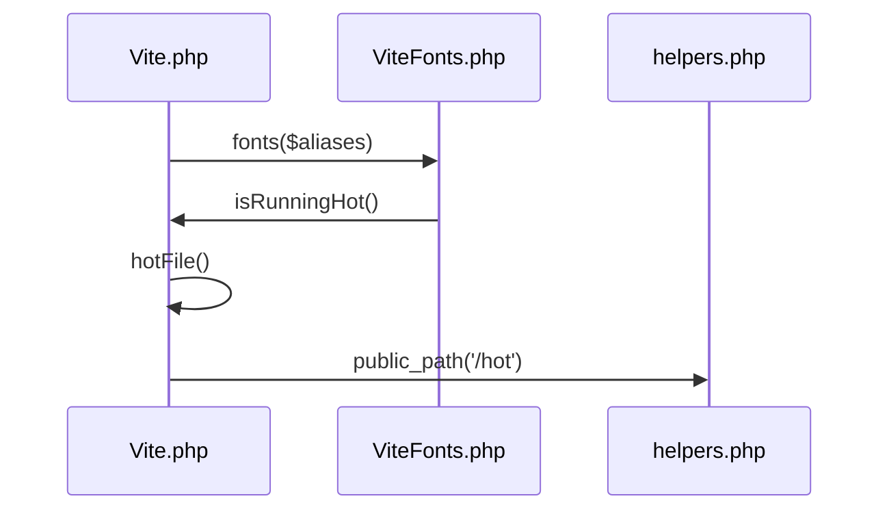
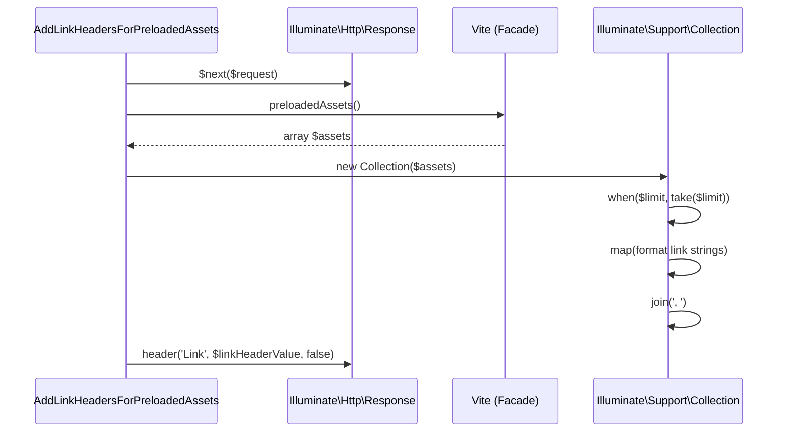
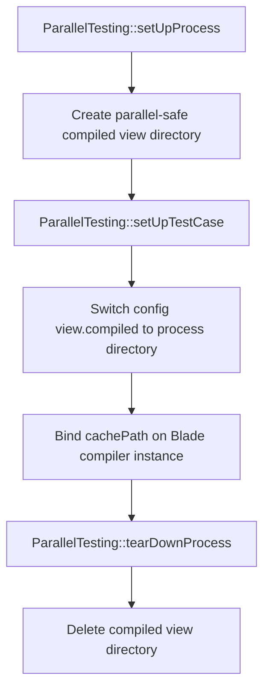

# Asset Bundling & Vite Integration

<details>
<summary>Relevant source files</summary>

The following files were used as context for generating this wiki page:

- [src/Illuminate/Foundation/Vite.php](https://github.com/laravel/framework/blob/main/src/Illuminate/Foundation/Vite.php)
- [src/Illuminate/Foundation/Console/ViewCacheCommand.php](https://github.com/laravel/framework/blob/main/src/Illuminate/Foundation/Console/ViewCacheCommand.php)
- [src/Illuminate/Support/Facades/Vite.php](https://github.com/laravel/framework/blob/main/src/Illuminate/Support/Facades/Vite.php)
- [src/Illuminate/View/Engines/CompilerEngine.php](https://github.com/laravel/framework/blob/main/src/Illuminate/View/Engines/CompilerEngine.php)
- [src/Illuminate/Foundation/ViteFonts.php](https://github.com/laravel/framework/blob/main/src/Illuminate/Foundation/ViteFonts.php)
- [src/Illuminate/Foundation/Mix.php](https://github.com/laravel/framework/blob/main/src/Illuminate/Foundation/Mix.php)
- [src/Illuminate/Foundation/resources/exceptions/renderer/vite.config.js](https://github.com/laravel/framework/blob/main/src/Illuminate/Foundation/resources/exceptions/renderer/vite.config.js)
- [src/Illuminate/View/Compilers/Concerns/CompilesHelpers.php](https://github.com/laravel/framework/blob/main/src/Illuminate/View/Compilers/Concerns/CompilesHelpers.php)
- [src/Illuminate/Http/Middleware/AddLinkHeadersForPreloadedAssets.php](https://github.com/laravel/framework/blob/main/src/Illuminate/Http/Middleware/AddLinkHeadersForPreloadedAssets.php)
- [src/Illuminate/Foundation/resources/exceptions/renderer/scripts.js](https://github.com/laravel/framework/blob/main/src/Illuminate/Foundation/resources/exceptions/renderer/scripts.js)
- [src/Illuminate/Foundation/resources/exceptions/renderer/package.json](https://github.com/laravel/framework/blob/main/src/Illuminate/Foundation/resources/exceptions/renderer/package.json)
- [src/Illuminate/Foundation/ViteException.php](https://github.com/laravel/framework/blob/main/src/Illuminate/Foundation/ViteException.php)
- [src/Illuminate/Support/Facades/Blade.php](https://github.com/laravel/framework/blob/main/src/Illuminate/Support/Facades/Blade.php)
- [src/Illuminate/Foundation/Testing/Concerns/InteractsWithContainer.php](https://github.com/laravel/framework/blob/main/src/Illuminate/Foundation/Testing/Concerns/InteractsWithContainer.php)
- [src/Illuminate/Testing/Concerns/TestViews.php](https://github.com/laravel/framework/blob/main/src/Illuminate/Testing/Concerns/TestViews.php)
- [src/Illuminate/Foundation/helpers.php](https://github.com/laravel/framework/blob/main/src/Illuminate/Foundation/helpers.php)
</details>

## Overview

Laravel's asset bundling and Vite integration bridges modern frontend build tooling with server-rendered views. It provides robust mechanisms for managing entry points, resolving build manifests, supporting hot module replacement (HMR), and rendering optimized script, stylesheet, preload, and font tags.

Sources: [src/Illuminate/Foundation/Vite.php#L376-L473](https://github.com/laravel/framework/blob/main/src/Illuminate/Foundation/Vite.php#L376-L473), [src/Illuminate/Foundation/ViteFonts.php#L73-L84](https://github.com/laravel/framework/blob/main/src/Illuminate/Foundation/ViteFonts.php#L73-L84)

## Blade Directives and Facade Invocation

### Overview

Laravel provides dedicated Blade compiler helpers and a service facade to integrate Vite asset generation into application layouts. The Blade compiler parses custom template statements and compiles them directly into container resolution calls pointing to the `Illuminate\Foundation\Vite` singleton. Developers can interact with asset generation via convenience directives or by calling methods statically on the `Vite` facade.

Sources: [src/Illuminate/View/Compilers/Concerns/CompilesHelpers.php#L53-L92](https://github.com/laravel/framework/blob/main/src/Illuminate/View/Compilers/Concerns/CompilesHelpers.php#L53-L92), [src/Illuminate/Support/Facades/Vite.php#L40-L51](https://github.com/laravel/framework/blob/main/src/Illuminate/Support/Facades/Vite.php#L40-L51)

### Blade Directives and Compilation Callbacks

The `CompilesHelpers` trait defines specific compilation methods that transform Blade tags into executable PHP expressions. When the compiler encounters `@vite`, `@viteReactRefresh`, or `@fonts`, it maps them to underlying service invocations.

| Blade Directive | Compilation Method | Generated PHP Output |
| :--- | :--- | :--- |
| `@vite($entrypoints)` | `compileVite($arguments)` | `<?php echo app('Illuminate\Foundation\Vite')($entrypoints); ?>` |
| `@viteReactRefresh` | `compileViteReactRefresh()` | `<?php echo app('Illuminate\Foundation\Vite')->reactRefresh(); ?>` |
| `@fonts($aliases)` | `compileFonts($arguments)` | `<?php echo app('Illuminate\Foundation\Vite')->fonts($aliases); ?>` |

Sources: [src/Illuminate/View/Compilers/Concerns/CompilesHelpers.php#L53-L92](https://github.com/laravel/framework/blob/main/src/Illuminate/View/Compilers/Concerns/CompilesHelpers.php#L53-L92)

### Facade Invocation and Method Signatures

The `Illuminate\Support\Facades\Vite` facade proxies static calls directly to the underlying `Illuminate\Foundation\Vite` container binding. This allows callers to configure nonces, entry points, prefetching strategies, and tag attribute resolvers statically before rendering.

```php
use Illuminate\Support\Facades\Vite;

Vite::useCspNonce($nonce);
Vite::useBuildDirectory('build');
Vite::withEntryPoints(['resources/js/app.js']);
```

Sources: [src/Illuminate/Support/Facades/Vite.php#L6-L37](https://github.com/laravel/framework/blob/main/src/Illuminate/Support/Facades/Vite.php#L6-L37), [src/Illuminate/Foundation/Vite.php#L150-L204](https://github.com/laravel/framework/blob/main/src/Illuminate/Foundation/Vite.php#L150-L204)

> [!NOTE]
> Invoking `Vite::toHtml()` or stringifying the Vite instance triggers the `__invoke` method using the currently configured entry points, resolving manifests or HMR assets automatically.

Sources: [src/Illuminate/Foundation/Vite.php#L384-L396](https://github.com/laravel/framework/blob/main/src/Illuminate/Foundation/Vite.php#L384-L396), [src/Illuminate/Foundation/Vite.php#L1231-L1234](https://github.com/laravel/framework/blob/main/src/Illuminate/Foundation/Vite.php#L1231-L1234)

## HMR Hot File and Manifest Resolution

### Overview

The `Vite` class determines whether to serve assets via the Vite development server using Hot Module Replacement (HMR) or to parse production build manifests. Control flow branches on the existence of a designated "hot" file on the filesystem. When the HMR server is running, asset URLs are generated dynamically by reading the hot file contents; otherwise, the application parses and caches production build manifests located within the configured build directory.

Sources: [src/Illuminate/Foundation/Vite.php#L233-L240](https://github.com/laravel/framework/blob/main/src/Illuminate/Foundation/Vite.php#L233-L240), [src/Illuminate/Foundation/Vite.php#L389-L398](https://github.com/laravel/framework/blob/main/src/Illuminate/Foundation/Vite.php#L389-L398), [src/Illuminate/Foundation/Vite.php#L954-L967](https://github.com/laravel/framework/blob/main/src/Illuminate/Foundation/Vite.php#L954-L967)

### Hot File State and Asset Resolution

The hot reload check evaluates whether the hot file exists on disk using `isRunningHot()`, which calls `hotFile()` to locate the file path via `public_path('/hot')` or a custom path set by `useHotFile()`.

```php
public function hotFile()
{
    return $this->hotFile ?? public_path('/hot');
}

public function isRunningHot()
{
    return is_file($this->hotFile());
}
```

Sources: [src/Illuminate/Foundation/Vite.php#L233-L240](https://github.com/laravel/framework/blob/main/src/Illuminate/Foundation/Vite.php#L233-L240), [src/Illuminate/Foundation/Vite.php#L1220-L1223](https://github.com/laravel/framework/blob/main/src/Illuminate/Foundation/Vite.php#L1220-L1223)

When `isRunningHot()` returns `true`, `__invoke` prepends `@vite/client` to the entry points collection, maps each entry point through `hotAsset()`, and generates script tags pointing directly to the Vite development server. The `hotAsset()` method reads the URL root stored inside the hot file and appends the asset path.

```php
protected function hotAsset($asset)
{
    return rtrim(file_get_contents($this->hotFile())).'/'.$asset;
}
```

Sources: [src/Illuminate/Foundation/Vite.php#L389-L396](https://github.com/laravel/framework/blob/main/src/Illuminate/Foundation/Vite.php#L389-L396), [src/Illuminate/Foundation/Vite.php#L874-L877](https://github.com/laravel/framework/blob/main/src/Illuminate/Foundation/Vite.php#L874-L877)

> [!WARNING]
> If the Vite development server stops unexpectedly while the hot file remains present in the public directory, the application will attempt to load HMR assets and fail to resolve the dev server endpoints until the hot file is removed.

Sources: [src/Illuminate/Foundation/Vite.php#L389-L396](https://github.com/laravel/framework/blob/main/src/Illuminate/Foundation/Vite.php#L389-L396), [src/Illuminate/Foundation/Vite.php#L1220-L1223](https://github.com/laravel/framework/blob/main/src/Illuminate/Foundation/Vite.php#L1220-L1223)

### Manifest Resolution and Caching

When the application is not running in HMR mode, `manifest()` resolves the build manifest JSON file path via `manifestPath()`, checks the static `::$manifests` cache array, and decodes the JSON contents into memory if not already cached.

```php
protected function manifest($buildDirectory)
{
    $path = $this->manifestPath($buildDirectory);

    if (! isset(static::$manifests[$path])) {
        if (! is_file($path)) {
            throw new ViteManifestNotFoundException("Vite manifest not found at: $path");
        }

        static::$manifests[$path] = json_decode(file_get_contents($path), true);
    }

    return static::$manifests[$path];
}
```

Sources: [src/Illuminate/Foundation/Vite.php#L954-L967](https://github.com/laravel/framework/blob/main/src/Illuminate/Foundation/Vite.php#L954-L967)

If the manifest file does not exist at the resolved path, `manifest()` throws a `ViteManifestNotFoundException`. Once loaded, chunks and imports are recursively resolved from the manifest dictionary to construct production asset tags and preloads.

Sources: [src/Illuminate/Foundation/Vite.php#L954-L967](https://github.com/laravel/framework/blob/main/src/Illuminate/Foundation/Vite.php#L954-L967), [src/Illuminate/Foundation/Vite.php#L403-L464](https://github.com/laravel/framework/blob/main/src/Illuminate/Foundation/Vite.php#L403-L464), [src/Illuminate/Foundation/Vite.php#L1009-L1028](https://github.com/laravel/framework/blob/main/src/Illuminate/Foundation/Vite.php#L1009-L1028)

## Font Management and Inlining

### Overview

The `Vite` class and `ViteFonts` helper manage font asset handling, manifest validation, preload attribute resolution, and inline CSS style block generation. When invoked, font integration processes font manifests to produce link preloads and inline CSS rule declarations or variable definitions.

Sources: [src/Illuminate/Foundation/Vite.php#L1070-L1105](https://github.com/laravel/framework/blob/main/src/Illuminate/Foundation/Vite.php#L1070-L1105), [src/Illuminate/Foundation/ViteFonts.php#L73-L84](https://github.com/laravel/framework/blob/main/src/Illuminate/Foundation/ViteFonts.php#L73-L84)

### Execution Walkthrough and Sequence Diagram

The font resolution execution sequence follows a strict call chain starting from the main `Vite` renderer down to the filesystem helper.

1. `fonts` — Invokes `viteFonts()` and calls `manifest()` on the `ViteFonts` instance.
2. `isRunningHot` — Determines whether the HMR server is active by evaluating disk paths.
3. `hotFile` — Resolves the absolute path to the hot file or defaults to `public_path('/hot')`.
4. `public_path` — Evaluates the framework application path container to retrieve the directory location.



Sources: [src/Illuminate/Foundation/Vite.php#L236-L240](https://github.com/laravel/framework/blob/main/src/Illuminate/Foundation/Vite.php#L236-L240), [src/Illuminate/Foundation/Vite.php#L1069-L1076](https://github.com/laravel/framework/blob/main/src/Illuminate/Foundation/Vite.php#L1069-L1076), [src/Illuminate/Foundation/Vite.php#L1220-L1223](https://github.com/laravel/framework/blob/main/src/Illuminate/Foundation/Vite.php#L1220-L1223), [src/Illuminate/Foundation/helpers.php#L685-L695](https://github.com/laravel/framework/blob/main/src/Illuminate/Foundation/helpers.php#L685-L695)

> [!NOTE]
> During hot module replacement, the font manifest path defaults to `dirname($hotFile).'/fonts-manifest.dev.json'`, whereas production builds locate the manifest at `public_path($buildDirectory.'/'.$manifestFilename)`.

Sources: [src/Illuminate/Foundation/ViteFonts.php#L25-L32](https://github.com/laravel/framework/blob/main/src/Illuminate/Foundation/ViteFonts.php#L25-L32)

### Font Manifest Validation and Error Handling

The `ViteFonts` class implements rigorous validation methods to ensure that font manifests match expected structures and versions before generating HTML tags.

| Validation Method | Target Parameter | Exception Thrown on Failure |
| :--- | :--- | :--- |
| `ensureValidManifest()` | Manifest structure & `version` key | `ViteException` ("The font manifest is missing the [version] key.", "Unsupported font manifest version...", or missing `families`) |
| `ensureValidFamilies()` | Requested aliases vs manifest `families` | `ViteException` ("Font alias [...] is not defined in the font manifest. Available aliases: ...") |
| `ensureValidPreloads()` | Preload items for `alias` and URL key | `ViteException` ("Font manifest preload entry [...] is missing the [alias] key." or missing URL/file key) |

Sources: [src/Illuminate/Foundation/ViteFonts.php#L179-L238](https://github.com/laravel/framework/blob/main/src/Illuminate/Foundation/ViteFonts.php#L179-L238)

> [!WARNING]
> If a font manifest contains malformed JSON, `readManifest()` catches the decode error and immediately throws a `ViteException` stating that the manifest is not valid JSON.

Sources: [src/Illuminate/Foundation/ViteFonts.php#L42-L61](https://github.com/laravel/framework/blob/main/src/Illuminate/Foundation/ViteFonts.php#L42-L61)

### Style Content Resolution and Trade-Offs

The `resolveStyleContent` method handles inline and file-based style generation based on manifest configuration properties.

| Design Choice | Benefit | Cost |
| :--- | :--- | :--- |
| **Manifest inlining (`style.inline`)** | Eliminates secondary network requests for font CSS definitions | Increases initial HTML document size |
| **External file reading (`style.file`)** | Keeps HTML payloads clean and enables browser caching of CSS | Requires an additional disk read and file existence check per request |
| **Alias filtering (`familyStyles` / `variables`)** | Emits only CSS rules and CSS variables for requested font families | Requires manifest parsing and dynamic string concatenation overhead |

Sources: [src/Illuminate/Foundation/ViteFonts.php#L73-L149](https://github.com/laravel/framework/blob/main/src/Illuminate/Foundation/ViteFonts.php#L73-L149)

## Preloaded Assets Link Header Middleware

### Overview

The `AddLinkHeadersForPreloadedAssets` middleware integrates with the Vite asset pipeline by inspecting preloaded assets collected during template rendering and appending HTTP `Link` headers to outgoing HTTP responses. This enables browser preload hints to be delivered over early HTTP headers rather than relying solely on HTML `<link>` tags.

Sources: [src/Illuminate/Http/Middleware/AddLinkHeadersForPreloadedAssets.php#L9-L41](https://github.com/laravel/framework/blob/main/src/Illuminate/Http/Middleware/AddLinkHeadersForPreloadedAssets.php#L9-L41)

### Middleware Execution and Configuration

The middleware intercepts incoming requests and modifies the resulting `Response` instance after execution flows through the application stack. It verifies that the response is an instance of `Illuminate\Http\Response` and that `Vite::preloadedAssets()` contains registered items before setting the `Link` header.

| Method | Parameters | Return Type | Purpose |
| :--- | :--- | :--- | :--- |
| `using` | `$limit` | `string` | Generates a middleware route parameter string containing an asset count limit. |
| `handle` | `$request, $next, $limit = null` | `Illuminate\Http\Response` | Processes the request, passes it to the next middleware, and appends the `Link` header. |

Sources: [src/Illuminate/Http/Middleware/AddLinkHeadersForPreloadedAssets.php#L17-L40](https://github.com/laravel/framework/blob/main/src/Illuminate/Http/Middleware/AddLinkHeadersForPreloadedAssets.php#L17-L40)

> [!NOTE]
> When configuring the middleware via route parameters using `AddLinkHeadersForPreloadedAssets::using(5)`, the third parameter `$limit` restricts the maximum number of preloaded asset URLs injected into the HTTP header.

Sources: [src/Illuminate/Http/Middleware/AddLinkHeadersForPreloadedAssets.php#L17-L37](https://github.com/laravel/framework/blob/main/src/Illuminate/Http/Middleware/AddLinkHeadersForPreloadedAssets.php#L17-L37)

### Call-Chain Execution Walkthrough

The middleware execution flow relies on cooperation between the HTTP middleware class, the `Vite` facade, and the underlying `Collection` pipeline.

1. `handle` — Intercepts the response returned by `$next($request)`.
2. `Vite::preloadedAssets` — Retrieves the array of registered preloaded asset attributes keyed by URL from the active `Vite` instance.
3. `Collection::when` — Conditionally applies an asset limit if the `$limit` parameter is provided.
4. `Collection::map` — Transforms each asset entry into an RFC-compliant link string formatted as `<$url>; attribute=value`.
5. `Collection::join` — Concatenates the mapped asset links using commas and spaces, which is then assigned to the response `Link` header via `$response->header()`.



Sources: [src/Illuminate/Http/Middleware/AddLinkHeadersForPreloadedAssets.php#L30-L38](https://github.com/laravel/framework/blob/main/src/Illuminate/Http/Middleware/AddLinkHeadersForPreloadedAssets.php#L30-L38)

## Testing Integration and Legacy Mix Support

### Overview

Testing asset integration in Laravel applications requires tools to simulate, mock, or strip out asset compilation handlers such as Vite and Laravel Mix during unit and feature tests. The testing container trait `InteractsWithContainer` manages state restoration for Vite and Mix instances, while the `TestViews` trait configures isolated, parallel-safe compiled view directories for Blade templates.

Sources: [src/Illuminate/Foundation/Testing/Concerns/InteractsWithContainer.php#L13-L254](https://github.com/laravel/framework/blob/main/src/Illuminate/Foundation/Testing/Concerns/InteractsWithContainer.php#L13-L254), [src/Illuminate/Testing/Concerns/TestViews.php#L8-L78](https://github.com/laravel/framework/blob/main/src/Illuminate/Testing/Concerns/TestViews.php#L8-L78)

### Container Mocking and Asset Control Methods

The container interaction trait provides methods to swap asset handlers with empty stubs during testing and restore original instances afterward.

| Method | Return Type | Purpose |
| :--- | :--- | :--- |
| `withoutVite` | `$this` | Registers an anonymous subclass of `Vite` in the container that returns empty string responses for entrypoints and asset calls. |
| `withVite` | `$this` | Restores the original `Vite` instance saved prior to calling `withoutVite`. |
| `withoutMix` | `$this` | Binds a closure returning an empty `HtmlString` to the `Mix` container binding. |
| `withMix` | `$this` | Restores the original `Mix` instance saved prior to calling `withoutMix`. |
| `withoutDefer` | `$this` | Binds a `DeferredCallbackCollection` subclass that executes deferred callbacks immediately upon registration. |
| `withDefer` | `$this` | Restores the original deferred callback collection instance. |

Sources: [src/Illuminate/Foundation/Testing/Concerns/InteractsWithContainer.php#L126-L290](https://github.com/laravel/framework/blob/main/src/Illuminate/Foundation/Testing/Concerns/InteractsWithContainer.php#L126-L290)

> [!WARNING]
> Calling `withoutVite()` clears the resolved Vite facade instance (`ViteFacade::clearResolvedInstance()`) before swapping the container binding. Failing to call `withVite()` in subsequent tests can leave the application running against the stubbed Vite handler.

Sources: [src/Illuminate/Foundation/Testing/Concerns/InteractsWithContainer.php#L126-L208](https://github.com/laravel/framework/blob/main/src/Illuminate/Foundation/Testing/Concerns/InteractsWithContainer.php#L126-L208)

### Parallel View Compilation

The `TestViews` trait integrates with Laravel's `ParallelTesting` manager to isolate compiled Blade views per test process, avoiding file collision issues across parallel test execution runners.



Sources: [src/Illuminate/Testing/Concerns/TestViews.php#L22-L41](https://github.com/laravel/framework/blob/main/src/Illuminate/Testing/Concerns/TestViews.php#L22-L41)

### Legacy Mix Support and Manifest Resolution

The legacy `Mix` class handles versioned asset paths and hot-reload development servers. When invoked via `__invoke($path, $manifestDirectory = '')`, it checks for a hot-reload file (`hot`) in the public path. If no hot file exists, it loads and caches `mix-manifest.json` from the specified manifest directory.

Sources: [src/Illuminate/Foundation/Mix.php#L8-L72](https://github.com/laravel/framework/blob/main/src/Illuminate/Foundation/Mix.php#L8-L72)

```php
use Illuminate\Foundation\Mix;

$mix = new Mix();
$assetUrl = $mix('js/app.js', '');
```

Sources: [src/Illuminate/Foundation/Mix.php#L19-L72](https://github.com/laravel/framework/blob/main/src/Illuminate/Foundation/Mix.php#L19-L72)

> [!NOTE]
> If a requested Mix file cannot be located in the manifest, the `Mix` class throws a `MixFileNotFoundException`. If application debug mode is disabled (`app.debug` is false), it reports the exception and returns the unversioned asset path string instead of interrupting the response with an error page.

Sources: [src/Illuminate/Foundation/Mix.php#L59-L69](https://github.com/laravel/framework/blob/main/src/Illuminate/Foundation/Mix.php#L59-L69)

## Exception Renderer Frontend Configuration

### Overview

Laravel includes a dedicated frontend build configuration for rendering internal framework exception views. This setup resides in the framework source tree and utilizes Vite with Tailwind CSS v4, Alpine.js, Tippy.js, and Shiki for syntax highlighting.

Sources: [src/Illuminate/Foundation/resources/exceptions/renderer/vite.config.js#L1-L14](https://github.com/laravel/framework/blob/main/src/Illuminate/Foundation/resources/exceptions/renderer/vite.config.js#L1-L14), [src/Illuminate/Foundation/resources/exceptions/renderer/package.json#L1-L23](https://github.com/laravel/framework/blob/main/src/Illuminate/Foundation/resources/exceptions/renderer/package.json#L1-L23), [src/Illuminate/Foundation/resources/exceptions/renderer/scripts.js#L1-L101](https://github.com/laravel/framework/blob/main/src/Illuminate/Foundation/resources/exceptions/renderer/scripts.js#L1-L101)

### Vite Build Configuration

The Vite configuration uses the `@tailwindcss/vite` plugin and targets `styles.css` and `scripts.js` as its primary entry points. Rollup output naming options enforce flat file structures without nested directory hashes for compiled assets.

```javascript
import { defineConfig } from 'vite';
import tailwindcss from '@tailwindcss/vite';
export default defineConfig({
    plugins: [tailwindcss()],
    build: {
        rollupOptions: {
            input: ['styles.css', 'scripts.js'],
            output: {
                assetFileNames: '[name][extname]',
                entryFileNames: '[name].js',
            },
        },
    },
});
```

Sources: [src/Illuminate/Foundation/resources/exceptions/renderer/vite.config.js#L1-L14](https://github.com/laravel/framework/blob/main/src/Illuminate/Foundation/resources/exceptions/renderer/vite.config.js#L1-L14)

### Frontend Dependencies and Scripts

The `package.json` file defines runtime dependencies and developer tooling required for compiling exception views, specifying a Node.js engine requirement of version `22.19.0` or higher.

| Dependency | Version | Purpose |
| :--- | :--- | :--- |
| `alpinejs` | `^3.14.9` | Reactive UI component behavior |
| `shiki` | `^3.13.0` | Code syntax highlighting engine |
| `tailwindcss` | `^4.1.12` | Utility-first CSS framework |
| `tippy.js` | `^6.3.7` | Tooltip positioning and rendering |
| `tw-animate-css` | `^1.3.7` | Tailwind CSS animation utilities |
| `@tailwindcss/vite` | `^4.3.1` | Vite plugin for Tailwind CSS v4 (dev) |
| `vite` | `^8.0.16` | Frontend build tool (dev) |

Sources: [src/Illuminate/Foundation/resources/exceptions/renderer/package.json#L1-L23](https://github.com/laravel/framework/blob/main/src/Illuminate/Foundation/resources/exceptions/renderer/package.json#L1-L23)

The `scripts.js` entry point initializes Tippy tooltips, registers a global `copyToClipboard` helper supporting modern clipboard APIs and legacy `document.execCommand` fallbacks, and configures a synchronous Shiki highlighter core with `light-plus` and `dark-plus` themes for PHP, SQL, and JSON languages.

Sources: [src/Illuminate/Foundation/resources/exceptions/renderer/scripts.js#L1-L46](https://github.com/laravel/framework/blob/main/src/Illuminate/Foundation/resources/exceptions/renderer/scripts.js#L1-L46)

> [!NOTE]
> The exception renderer script exposes `window.highlight` and `window.copyToClipboard` globally, allowing the server-rendered exception views to invoke client-side code highlighting and text copying routines directly.

Sources: [src/Illuminate/Foundation/resources/exceptions/renderer/scripts.js#L20-L96](https://github.com/laravel/framework/blob/main/src/Illuminate/Foundation/resources/exceptions/renderer/scripts.js#L20-L96)

## Related

- [[Blade Compiler & Rendering]]

