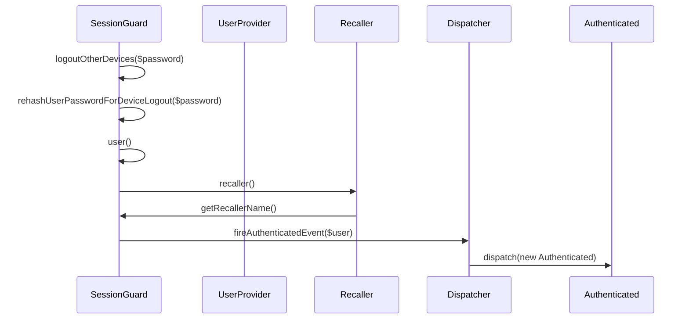
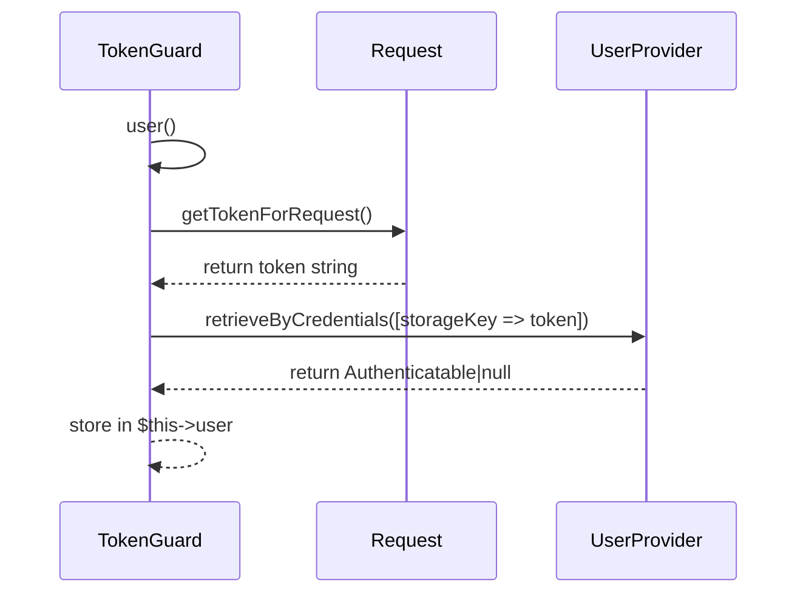
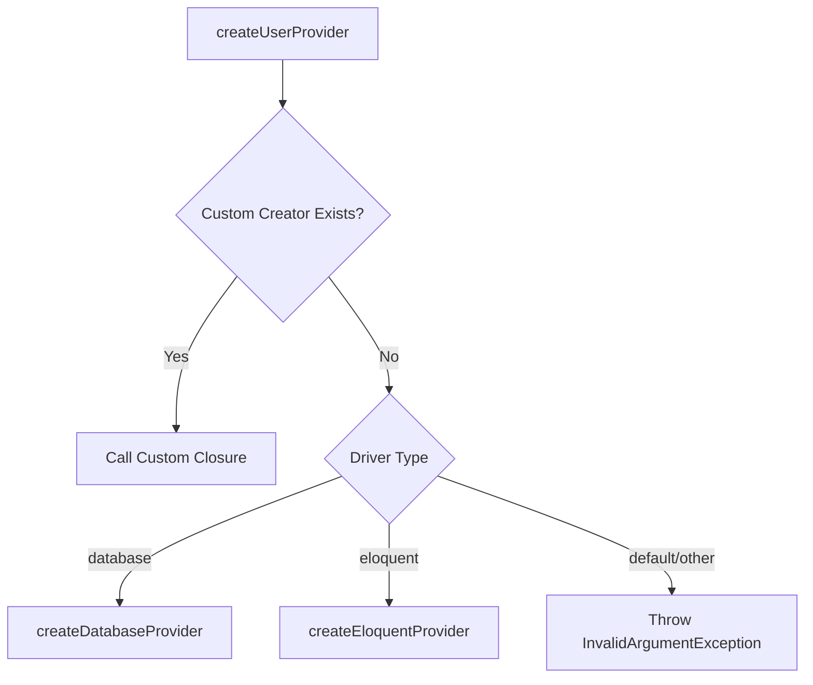
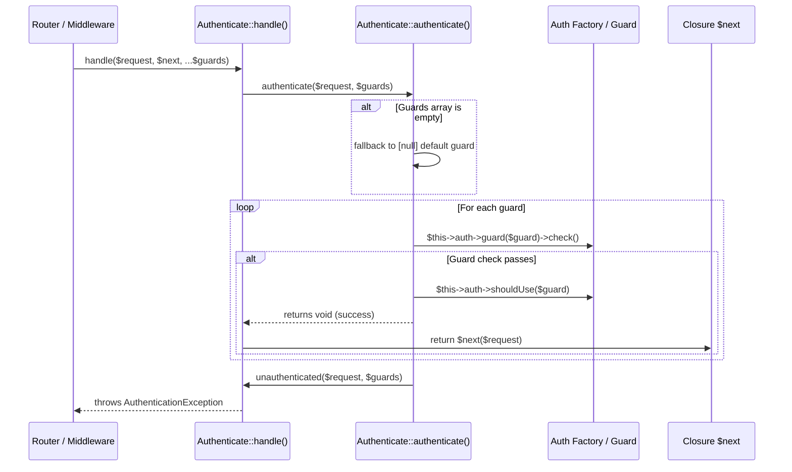

# Authentication & Guards

<details>
<summary>Relevant source files</summary>

The following files were used as context for generating this wiki page:

- [src/Illuminate/Auth/SessionGuard.php](https://github.com/laravel/framework/blob/main/src/Illuminate/Auth/SessionGuard.php)
- [src/Illuminate/Auth/AuthManager.php](https://github.com/laravel/framework/blob/main/src/Illuminate/Auth/AuthManager.php)
- [src/Illuminate/Auth/AuthServiceProvider.php](https://github.com/laravel/framework/blob/main/src/Illuminate/Auth/AuthServiceProvider.php)
- [src/Illuminate/Support/Facades/Auth.php](https://github.com/laravel/framework/blob/main/src/Illuminate/Support/Facades/Auth.php)
- [src/Illuminate/Auth/TokenGuard.php](https://github.com/laravel/framework/blob/main/src/Illuminate/Auth/TokenGuard.php)
- [config/auth.php](https://github.com/laravel/framework/blob/main/config/auth.php)
- [src/Illuminate/Auth/RequestGuard.php](https://github.com/laravel/framework/blob/main/src/Illuminate/Auth/RequestGuard.php)
- [src/Illuminate/Auth/GuardHelpers.php](https://github.com/laravel/framework/blob/main/src/Illuminate/Auth/GuardHelpers.php)
- [src/Illuminate/Auth/Middleware/Authenticate.php](https://github.com/laravel/framework/blob/main/src/Illuminate/Auth/Middleware/Authenticate.php)
- [src/Illuminate/Auth/CreatesUserProviders.php](https://github.com/laravel/framework/blob/main/src/Illuminate/Auth/CreatesUserProviders.php)
- [src/Illuminate/Contracts/Auth/Guard.php](https://github.com/laravel/framework/blob/main/src/Illuminate/Contracts/Auth/Guard.php)
- [src/Illuminate/Auth/EloquentUserProvider.php](https://github.com/laravel/framework/blob/main/src/Illuminate/Auth/EloquentUserProvider.php)
- [src/Illuminate/Auth/Events/Authenticated.php](https://github.com/laravel/framework/blob/main/src/Illuminate/Auth/Events/Authenticated.php)
</details>

## Overview

The authentication and guards subsystem in Laravel provides a robust, extensible mechanism for verifying user credentials, maintaining state across requests, and resolving users from underlying storage. Powered by the central `AuthManager` class and registered through the `AuthServiceProvider`, the system coordinates configurable authentication drivers such as session guards, token guards, and custom request guards. It decouples the authentication interface from underlying data persistence through user providers like database and Eloquent drivers, enabling flexible retrieval strategies. HTTP middleware intercepts requests to enforce authentication rules, handle unauthorized responses, and manage active guard states.

Sources: [src/Illuminate/Auth/AuthManager.php:18-51](https://github.com/laravel/framework/blob/main/src/Illuminate/Auth/AuthManager.php#L18-L51), [src/Illuminate/Auth/AuthServiceProvider.php:15-28](https://github.com/laravel/framework/blob/main/src/Illuminate/Auth/AuthServiceProvider.php#L15-L28), [src/Illuminate/Auth/CreatesUserProviders.php:7-43](https://github.com/laravel/framework/blob/main/src/Illuminate/Auth/CreatesUserProviders.php#L7-L43), [src/Illuminate/Auth/Middleware/Authenticate.php:11-88](https://github.com/laravel/framework/blob/main/src/Illuminate/Auth/Middleware/Authenticate.php#L11-L88)

## Authentication Service Provider and Manager

### Overview

Bootstrapping and managing authentication services relies on `AuthServiceProvider` and `AuthManager`. The service provider registers core singletons and bindings in the container, including the `auth` manager instance, the default `auth.driver`, the `AuthenticatableContract`, the access `GateContract`, and password confirmation handlers. It also configures re-binding listeners for incoming HTTP requests and event dispatchers.

Sources: [src/Illuminate/Auth/AuthServiceProvider.php:15-111](https://github.com/laravel/framework/blob/main/src/Illuminate/Auth/AuthServiceProvider.php#L15-L111)

### Guard Resolution and Driver Management

When an application requests a guard via `Auth::guard($name)`, `AuthManager` checks its local cache `$this->guards`. If the guard instance does not exist, it delegates to `resolve($name)`, which fetches configuration values from `auth.guards.{$name}`. The manager checks registered custom driver creators, or invokes driver creation methods dynamically using the naming convention `create{Driver}Driver`.

Sources: [src/Illuminate/Auth/AuthManager.php:70-106](https://github.com/laravel/framework/blob/main/src/Illuminate/Auth/AuthManager.php#L70-L106), [src/Illuminate/Support/Facades/Auth.php:9-11](https://github.com/laravel/framework/blob/main/src/Illuminate/Support/Facades/Auth.php#L9-L11)

> [!NOTE]
> Guard names can be passed as string identifiers or `UnitEnum` instances, which are normalized via `enum_value($name)` before cache lookup or default driver fallback.

Sources: [src/Illuminate/Auth/AuthManager.php:67-75](https://github.com/laravel/framework/blob/main/src/Illuminate/Auth/AuthManager.php#L67-L75)

### Call-Chain Execution Walkthrough

Resolving and instantiating an authentication guard follows a precise execution path through `AuthManager`:

`guard()` → `enum_value()` / `getDefaultDriver()` → `resolve()` → `getConfig()` → `callCustomCreator()` or `createSessionDriver()` / `createTokenDriver()`

1. **`guard($name = null)`**: Normalizes the guard name and checks `$this->guards[$name]`. If missing, calls `resolve($name)`.
2. **`resolve($name)`**: Retrieves array configuration via `getConfig($name)`. Throws an `InvalidArgumentException` if null.
3. **Driver Dispatch**: Checks if a custom creator closure is registered in `$this->customCreators[$config['driver']]`. If not, resolves the method name `create{Driver}Driver` (e.g., `createSessionDriver` or `createTokenDriver`) and instantiates the respective guard class with its user provider and configuration dependencies.

Sources: [src/Illuminate/Auth/AuthManager.php:70-152](https://github.com/laravel/framework/blob/main/src/Illuminate/Auth/AuthManager.php#L70-L152)

### Configuration Bindings and Driver Options

The default authentication configuration defined in `config/auth.php` establishes fallback behavior, registered guards, and persistence providers.

| Configuration Path | Key Type | Default Value | Purpose |
| :--- | :--- | :--- | :--- |
| `auth.defaults.guard` | string | `env('AUTH_GUARD', 'web')` | Default authentication guard |
| `auth.defaults.passwords` | string | `env('AUTH_PASSWORD_BROKER', 'users')` | Default password reset broker |
| `auth.guards.web.driver` | string | `'session'` | Driver type for the web guard |
| `auth.guards.web.provider` | string | `'users'` | User provider assigned to the web guard |
| `auth.providers.users.driver` | string | `'eloquent'` | Retrieval driver strategy |
| `auth.providers.users.model` | string | `env('AUTH_MODEL', App\Models\User::class)` | Eloquent user model class |
| `auth.password_timeout` | integer | `env('AUTH_PASSWORD_TIMEOUT', 10800)` | Seconds before password confirmation expires |

Sources: [config/auth.php:16-114](https://github.com/laravel/framework/blob/main/config/auth.php#L16-L114)

## Session Based Authentication Guard

### Overview

The `SessionGuard` class implements the stateful `StatefulGuard` and `SupportsBasicAuth` contracts, managing authentication state across HTTP requests via session storage and "remember me" cookies. It handles credential validation through a user provider, protects against timing attacks with `Timebox`, and supports multi-device session invalidation.

Sources: [src/Illuminate/Auth/SessionGuard.php:30-31](https://github.com/laravel/framework/blob/main/src/Illuminate/Auth/SessionGuard.php#L30-L31)

### Stateful Authentication and Credential Verification

When attempting authentication via `attempt()`, `SessionGuard` executes within a `Timebox` boundary defined by `$this->timeboxDuration` to prevent side-channel timing attacks. It fires an `Attempting` event, retrieves the user via the provider, checks credentials, and dispatches either a `Login` or `Failed` event.

```php
public function attempt(#[\SensitiveParameter] array $credentials = [], $remember = false)
{
    return $this->timebox->call(function ($timebox) use ($credentials, $remember) {
        $this->fireAttemptEvent($credentials, $remember);
        $this->lastAttempted = $user = $this->provider->retrieveByCredentials($credentials);

        if ($this->hasValidCredentials($user, $credentials)) {
            $this->rehashPasswordIfRequired($user, $credentials);
            $this->login($user, $remember);
            $timebox->returnEarly();
            return true;
        }

        $this->fireFailedEvent($user, $credentials);
        return false;
    }, $this->timeboxDuration);
}
```

Sources: [src/Illuminate/Auth/SessionGuard.php:419-446](https://github.com/laravel/framework/blob/main/src/Illuminate/Auth/SessionGuard.php#L419-L446)

> [!WARNING]
> Validating credentials without a `Timebox` wrapper can expose password verification endpoints to timing attacks by leaking duration differences between valid and invalid user identifiers.

Sources: [src/Illuminate/Auth/SessionGuard.php:421-445](https://github.com/laravel/framework/blob/main/src/Illuminate/Auth/SessionGuard.php#L421-L445)

### Multi-Device Logout and Session Re-Hashing

The `logoutOtherDevices()` method invalidates active sessions on other devices by re-hashing the user's password when provided with the correct current password.

Sources: [src/Illuminate/Auth/SessionGuard.php:740-756](https://github.com/laravel/framework/blob/main/src/Illuminate/Auth/SessionGuard.php#L740-L756)

### Call-Chain Execution Walkthrough

Executing `logoutOtherDevices()` follows a strict method call sequence to verify credentials, update password hashing parameters, refresh session records, and dispatch lifecycle events:

1. **`logoutOtherDevices()`**: `logoutOtherDevices()` calls `rehashUserPasswordForDeviceLogout($password)` to verify the current password and optionally rehash it.
2. **`rehashUserPasswordForDeviceLogout()`**: Calls `user()` to retrieve the authenticated instance, verifies `Hash::check()`, and updates the password hash if required via the provider.
3. **`user()`**: Fetches the active user instance, triggering property resolution and recalling cookies if necessary.
4. **`recaller()`**: Inspects request cookies using `getRecallerName()` to extract persistence tokens.
5. **`getRecallerName()`**: Generates the unique cookie identifier string `'remember_'.$this->name.'_'.sha1(static::class)`.
6. **`fireAuthenticatedEvent()`**: Dispatches the `Authenticated` event through the event dispatcher.

Sources: [src/Illuminate/Auth/SessionGuard.php:740-777](https://github.com/laravel/framework/blob/main/src/Illuminate/Auth/SessionGuard.php#L740-L777), [src/Illuminate/Auth/SessionGuard.php:884-887](https://github.com/laravel/framework/blob/main/src/Illuminate/Auth/SessionGuard.php#L884-L887)



Sources: [src/Illuminate/Auth/SessionGuard.php:740-777](https://github.com/laravel/framework/blob/main/src/Illuminate/Auth/SessionGuard.php#L740-L777), [src/Illuminate/Auth/SessionGuard.php:831-834](https://github.com/laravel/framework/blob/main/src/Illuminate/Auth/SessionGuard.php#L831-L834), [src/Illuminate/Auth/SessionGuard.php:884-887](https://github.com/laravel/framework/blob/main/src/Illuminate/Auth/SessionGuard.php#L884-L887)

### Session Guard Properties and Configuration Options

| Property / Method | Return Type | Default Value | Purpose |
| :--- | :--- | :--- | :--- |
| `$rememberDuration` | `int` | `576000` | Expiration time for "remember me" cookies in minutes |
| `$rehashOnLogin` | `bool` | `true` | Indicates if passwords should be rehashed on login if hashing options change |
| `$timeboxDuration` | `int` | `200000` | Microseconds that the timebox should wait during authentication attempts |
| `getName()` | `string` | `'login_'.$this->name.'_'.sha1(static::class)` | Generates the unique identifier for the auth session store key |
| `getRecallerName()` | `string` | `'remember_'.$this->name.'_'.sha1(static::class)` | Generates the cookie name used to store the recaller token |

Sources: [src/Illuminate/Auth/SessionGuard.php:58-164](https://github.com/laravel/framework/blob/main/src/Illuminate/Auth/SessionGuard.php#L58-L164), [src/Illuminate/Auth/SessionGuard.php:874-887](https://github.com/laravel/framework/blob/main/src/Illuminate/Auth/SessionGuard.php#L874-L887)

> [!TIP]
> Customizing `$timeboxDuration` allows tuning authentication latency protection against timing attacks based on the hashing driver cost factor used by your application models.

Sources: [src/Illuminate/Auth/SessionGuard.php:146-164](https://github.com/laravel/framework/blob/main/src/Illuminate/Auth/SessionGuard.php#L146-L164)

### Session Guard Design Trade-Offs

| Design Choice | Benefit | Cost |
| :--- | :--- | :--- |
| Session state caching (`$this->user`) | Avoids repeated database queries per request for user resolution | Requires explicit state clearing on logout and request lifecycle boundaries |
| Timebox execution wrapping | Mitigates user enumeration via timing attacks on credential verification | Introduces fixed execution delay on failed login attempts |
| Automatic session ID regeneration | Prevents session fixation vulnerabilities upon successful authentication | Forces active session identifier rotation across storage backends |

Sources: [src/Illuminate/Auth/SessionGuard.php:177-182](https://github.com/laravel/framework/blob/main/src/Illuminate/Auth/SessionGuard.php#L177-L182), [src/Illuminate/Auth/SessionGuard.php:313-324](https://github.com/laravel/framework/blob/main/src/Illuminate/Auth/SessionGuard.php#L313-L324), [src/Illuminate/Auth/SessionGuard.php:578-589](https://github.com/laravel/framework/blob/main/src/Illuminate/Auth/SessionGuard.php#L578-L589)

## Stateless and Request Token Guards

### Overview

Stateless authentication in Laravel is implemented via `TokenGuard` and `RequestGuard`, both of which implement the `Illuminate\Contracts\Auth\Guard` interface and consume the `GuardHelpers` trait. These guards do not maintain session state between requests, instead resolving user identities on-demand per request based on tokens or custom callbacks.

Sources: [src/Illuminate/Auth/TokenGuard.php:10-12](https://github.com/laravel/framework/blob/main/src/Illuminate/Auth/TokenGuard.php#L10-L12), [src/Illuminate/Auth/RequestGuard.php:10-12](https://github.com/laravel/framework/blob/main/src/Illuminate/Auth/RequestGuard.php#L10-L12)

### TokenGuard Resolution Mechanics

`TokenGuard` extracts API tokens from incoming HTTP requests using a fallback resolution chain and queries the user provider. 



Sources: [src/Illuminate/Auth/TokenGuard.php:70-90](https://github.com/laravel/framework/blob/main/src/Illuminate/Auth/TokenGuard.php#L70-L90)

The token extraction method `getTokenForRequest()` evaluates request sources in a fixed sequence: query string parameters, request input parameters, bearer tokens, and HTTP basic auth passwords.

Sources: [src/Illuminate/Auth/TokenGuard.php:97-103](https://github.com/laravel/framework/blob/main/src/Illuminate/Auth/TokenGuard.php#L97-L103)

> [!NOTE]
> When `$hash` is enabled in `TokenGuard`, incoming tokens are hashed using `sha256` before being passed to `retrieveByCredentials()`, enabling secure storage of hashed API tokens in persistent databases.

Sources: [src/Illuminate/Auth/TokenGuard.php:36-41](https://github.com/laravel/framework/blob/main/src/Illuminate/Auth/TokenGuard.php#L36-L41), [src/Illuminate/Auth/TokenGuard.php:83-86](https://github.com/laravel/framework/blob/main/src/Illuminate/Auth/TokenGuard.php#L83-L86)

### RequestGuard Closure Execution

`RequestGuard` delegates authentication decisions entirely to a custom closure or callable provided during instantiation, optionally accepting a `UserProvider` instance.

```php
$requestGuard = new RequestGuard(
    function ($request, $provider) {
        return $provider->retrieveByCredentials(['username' => $request->header('X-Username')]);
    },
    $request,
    $provider
);
```

Sources: [src/Illuminate/Auth/RequestGuard.php:15-40](https://github.com/laravel/framework/blob/main/src/Illuminate/Auth/RequestGuard.php#L15-L40)

When `user()` is called on a `RequestGuard`, it checks the cached `$this->user` property, and if unset, invokes `call_user_func($this->callback, $this->request, $this->getProvider())`.

Sources: [src/Illuminate/Auth/RequestGuard.php:47-59](https://github.com/laravel/framework/blob/main/src/Illuminate/Auth/RequestGuard.php#L47-L59)

### Stateless Guard Properties and Methods

| Guard Class | Method / Property | Return Type | Purpose |
| :--- | :--- | :--- | :--- |
| `TokenGuard` | `getTokenForRequest()` | `string\|null` | Extracts token from query, input, bearer token, or basic auth password |
| `TokenGuard` | `validate(array $credentials)` | `bool` | Validates credentials array against the user provider |
| `TokenGuard` | `setRequest(Request $request)` | `$this` | Updates the active HTTP request instance |
| `RequestGuard` | `user()` | `Authenticatable\|null` | Executes callback function with request and provider to resolve user |
| `RequestGuard` | `validate(array $credentials)` | `bool` | Instantiates temporary guard with credentials request and evaluates user presence |

Sources: [src/Illuminate/Auth/TokenGuard.php:97-133](https://github.com/laravel/framework/blob/main/src/Illuminate/Auth/TokenGuard.php#L97-L133), [src/Illuminate/Auth/RequestGuard.php:47-85](https://github.com/laravel/framework/blob/main/src/Illuminate/Auth/RequestGuard.php#L47-L85)

### Stateless Guard Design Trade-Offs

| Design Choice | Benefit | Cost |
| :--- | :--- | :--- |
| Token query fallback chain (`getTokenForRequest()`) | Supports multiple client transmission methods (query, body, headers) | Increases evaluation complexity per request |
| Callback injection (`RequestGuard`) | Allows arbitrary, custom authentication logic without creating new guard classes | Encapsulates logic in closures which cannot be easily serialized or overridden via subclassing |
| Per-request user caching (`$this->user`) | Prevents duplicate provider queries within the same request lifecycle | Cannot detect mid-request changes to user state or token validity |

Sources: [src/Illuminate/Auth/TokenGuard.php:72-77](https://github.com/laravel/framework/blob/main/src/Illuminate/Auth/TokenGuard.php#L72-L77), [src/Illuminate/Auth/TokenGuard.php:97-103](https://github.com/laravel/framework/blob/main/src/Illuminate/Auth/TokenGuard.php#L97-L103), [src/Illuminate/Auth/RequestGuard.php:49-58](https://github.com/laravel/framework/blob/main/src/Illuminate/Auth/RequestGuard.php#L49-L58)

## User Providers and Model Resolution

### Overview

User providers bridge authentication guards and persistent data storage, resolving user instances using configurations defined in application settings. The `CreatesUserProviders` trait supplies factory methods for instantiating concrete user providers from configuration arrays, supporting custom creator closures alongside standard database and Eloquent drivers.

Sources: [src/Illuminate/Auth/CreatesUserProviders.php:7-43](https://github.com/laravel/framework/blob/main/src/Illuminate/Auth/CreatesUserProviders.php#L7-L43)



Sources: [src/Illuminate/Auth/CreatesUserProviders.php:24-43](https://github.com/laravel/framework/blob/main/src/Illuminate/Auth/CreatesUserProviders.php#L24-L43)

### User Provider Resolution Call-Chain

When an application requests a provider instance, execution flows through a precise sequence of configuration retrieval and instantiation checks:

`createUserProvider()` → `getProviderConfiguration()` → checks `$customProviderCreators` array → evaluates `match ($driver)` block → invokes `createDatabaseProvider()` or `createEloquentProvider()`.

Sources: [src/Illuminate/Auth/CreatesUserProviders.php:24-82](https://github.com/laravel/framework/blob/main/src/Illuminate/Auth/CreatesUserProviders.php#L24-L82)

> [!NOTE]
> If `getProviderConfiguration()` receives a `null` provider name, it falls back to the default user provider resolved from `auth.defaults.provider`. If that configuration resolves to `null`, `createUserProvider()` immediately returns `null` without throwing an exception.

Sources: [src/Illuminate/Auth/CreatesUserProviders.php:26-28](https://github.com/laravel/framework/blob/main/src/Illuminate/Auth/CreatesUserProviders.php#L26-L28), [src/Illuminate/Auth/CreatesUserProviders.php:53-55](https://github.com/laravel/framework/blob/main/src/Illuminate/Auth/CreatesUserProviders.php#L53-L55), [src/Illuminate/Auth/CreatesUserProviders.php:89-92](https://github.com/laravel/framework/blob/main/src/Illuminate/Auth/CreatesUserProviders.php#L89-L92)

### Eloquent User Provider Strategies

The `EloquentUserProvider` implements `UserProvider` to fetch user models through Eloquent query builders. When retrieving credentials via `retrieveByCredentials()`, it automatically filters out any credential keys containing the string `password` before building query constraints.

Sources: [src/Illuminate/Auth/EloquentUserProvider.php:11-117](https://github.com/laravel/framework/blob/main/src/Illuminate/Auth/EloquentUserProvider.php#L11-L117)

```php
$provider = new EloquentUserProvider($hasher, App\Models\User::class);

$user = $provider->retrieveByCredentials([
    'email' => 'user@example.com',
    'password' => 'secret', // Filtered out by retrieveByCredentials
]);

if ($provider->validateCredentials($user, ['password' => 'secret'])) {
    $provider->rehashPasswordIfRequired($user, ['password' => 'secret']);
}
```

Sources: [src/Illuminate/Auth/EloquentUserProvider.php:40-44](https://github.com/laravel/framework/blob/main/src/Illuminate/Auth/EloquentUserProvider.php#L40-L44), [src/Illuminate/Auth/EloquentUserProvider.php:111-117](https://github.com/laravel/framework/blob/main/src/Illuminate/Auth/EloquentUserProvider.php#L111-L117), [src/Illuminate/Auth/EloquentUserProvider.php:148-158](https://github.com/laravel/framework/blob/main/src/Illuminate/Auth/EloquentUserProvider.php#L148-L158), [src/Illuminate/Auth/EloquentUserProvider.php:169-178](https://github.com/laravel/framework/blob/main/src/Illuminate/Auth/EloquentUserProvider.php#L169-L178)

> [!WARNING]
> When updating a remember token via `updateRememberToken()`, `EloquentUserProvider` explicitly temporarily disables model timestamps (`$user->timestamps = false`) before calling `$user->save()` and restores them afterward to prevent modifying `updated_at` columns on token refreshes.

Sources: [src/Illuminate/Auth/EloquentUserProvider.php:92-103](https://github.com/laravel/framework/blob/main/src/Illuminate/Auth/EloquentUserProvider.php#L92-L103)

### Driver Configuration and Methods

| Class / Trait | Method / Property | Return Type | Purpose |
| :--- | :--- | :--- | :--- |
| `CreatesUserProviders` | `createUserProvider(?string $provider)` | `UserProvider\|null` | Factory method resolving custom, database, or eloquent providers |
| `CreatesUserProviders` | `getProviderConfiguration(?string $provider)` | `array\|null` | Retrieves provider configuration array from application config store |
| `CreatesUserProviders` | `createDatabaseProvider(array $config)` | `DatabaseUserProvider` | Instantiates database provider with connection, hasher, and table name |
| `CreatesUserProviders` | `createEloquentProvider(array $config)` | `EloquentUserProvider` | Instantiates Eloquent provider with hasher and model class string |
| `EloquentUserProvider` | `retrieveById(mixed $identifier)` | `Authenticatable\|null` | Fetches user model matching primary authentication identifier |
| `EloquentUserProvider` | `retrieveByToken(mixed $identifier, string $token)` | `Authenticatable\|null` | Fetches user model by identifier and validates remember token via `hash_equals` |
| `EloquentUserProvider` | `updateRememberToken(UserContract $user, string $token)` | `void` | Saves new remember token with timestamps temporarily suppressed |
| `EloquentUserProvider` | `retrieveByCredentials(array $credentials)` | `Authenticatable\|null` | Queries model using non-password credentials supporting arrays, callbacks, and scalar values |
| `EloquentUserProvider` | `validateCredentials(UserContract $user, array $credentials)` | `bool` | Verifies plain password against user's hashed password using hasher |

Sources: [src/Illuminate/Auth/CreatesUserProviders.php:24-82](https://github.com/laravel/framework/blob/main/src/Illuminate/Auth/CreatesUserProviders.php#L24-L82), [src/Illuminate/Auth/EloquentUserProvider.php:52-159](https://github.com/laravel/framework/blob/main/src/Illuminate/Auth/EloquentUserProvider.php#L52-L159)

### User Provider Design Trade-Offs

| Design Choice | Benefit | Cost |
| :--- | :--- | :--- |
| Automatic password key filtering in `retrieveByCredentials()` | Prevents accidental raw password queries against database columns | Requires separate explicit validation step via `validateCredentials()` |
| Disabling timestamps in `updateRememberToken()` | Prevents `updated_at` column modification during background session token refreshes | Bypasses model timestamp auditing for token update operations |
| Custom provider creator registry (`$customProviderCreators`) | Allows seamless integration of third-party or custom user provider drivers | Relies on runtime registration rather than static configuration discovery |

Sources: [src/Illuminate/Auth/CreatesUserProviders.php:14-34](https://github.com/laravel/framework/blob/main/src/Illuminate/Auth/CreatesUserProviders.php#L14-L34), [src/Illuminate/Auth/EloquentUserProvider.php:96-102](https://github.com/laravel/framework/blob/main/src/Illuminate/Auth/EloquentUserProvider.php#L96-L102), [src/Illuminate/Auth/EloquentUserProvider.php:113-117](https://github.com/laravel/framework/blob/main/src/Illuminate/Auth/EloquentUserProvider.php#L113-L117)

## Authentication Middleware and Exceptions

### Overview

The `Illuminate\Auth\Middleware\Authenticate` class implements the `AuthenticatesRequests` contract to intercept incoming HTTP requests, verify active authentication guards, and manage unauthenticated responses.

Sources: [src/Illuminate/Auth/Middleware/Authenticate.php:8-12](https://github.com/laravel/framework/blob/main/src/Illuminate/Auth/Middleware/Authenticate.php#L8-L12)

### Request Interception and Guard Execution

The middleware lifecycle begins when the router invokes the `handle()` method. This delegates immediately to `authenticate()`, which iterates through each specified guard to test whether the current request is authenticated.



Sources: [src/Illuminate/Auth/Middleware/Authenticate.php:59-88](https://github.com/laravel/framework/blob/main/src/Illuminate/Auth/Middleware/Authenticate.php#L59-L88)

### Call-Chain Execution Walkthrough

The evaluation of incoming requests flows through a specific sequence of internal methods:

1. `handle($request, $next, ...$guards)` — Intercepts the request and forwards `$guards` to `authenticate()`.
2. `authenticate($request, array $guards)` — Checks if `$guards` is empty; if so, defaults to `[null]`. Loops through each guard, calling `guard($guard)->check()`.
3. If a guard returns `true`, `shouldUse($guard)` sets the default factory guard, and execution proceeds to `$next($request)`.
4. If all guards fail, `unauthenticated($request, $guards)` is invoked, throwing an `AuthenticationException`.
5. `unauthenticated()` builds the exception using `$request->expectsJson()` to determine whether a redirect path via `redirectTo($request)` should be included.
6. `redirectTo(Request $request)` checks if a custom callback was registered via `redirectUsing()`; if set, it evaluates `call_user_func(static::$redirectToCallback, $request)`.

Sources: [src/Illuminate/Auth/Middleware/Authenticate.php:59-119](https://github.com/laravel/framework/blob/main/src/Illuminate/Auth/Middleware/Authenticate.php#L59-L119)

### Middleware Methods and Configuration

| Class / Trait | Method / Property | Return Type | Purpose |
| :--- | :--- | :--- | :--- |
| `Authenticate` | `__construct(Auth $auth)` | `void` | Injects the authentication factory instance |
| `Authenticate` | `using(string $guard, string ...$others)` | `string` | Formats middleware string with guard parameters for route assignment |
| `Authenticate` | `handle($request, Closure $next, ...$guards)` | `mixed` | Intercepts request, invokes authentication check, and passes to next middleware |
| `Authenticate` | `authenticate($request, array $guards)` | `void` | Iterates over guards; triggers unauthenticated exception if all checks fail |
| `Authenticate` | `unauthenticated($request, array $guards)` | `never` | Throws `AuthenticationException` with request-aware JSON or redirect parameters |
| `Authenticate` | `redirectTo(Request $request)` | `string\|null` | Resolves redirect path using custom static callback if registered |
| `Authenticate` | `redirectUsing(callable $redirectToCallback)` | `void` | Registers a global callback to generate authentication redirect paths |

Sources: [src/Illuminate/Auth/Middleware/Authenticate.php:32-130](https://github.com/laravel/framework/blob/main/src/Illuminate/Auth/Middleware/Authenticate.php#L32-L130)

> [!NOTE]
> When defining routes requiring specific guards, the `Authenticate::using('api', 'web')` static helper method formats the middleware string as `Illuminate\Auth\Middleware\Authenticate:api,web`, correctly passing multiple guards to the variadic `...$guards` parameter in `handle()`.

Sources: [src/Illuminate/Auth/Middleware/Authenticate.php:44-47](https://github.com/laravel/framework/blob/main/src/Illuminate/Auth/Middleware/Authenticate.php#L44-L47), [src/Illuminate/Auth/Middleware/Authenticate.php:59-60](https://github.com/laravel/framework/blob/main/src/Illuminate/Auth/Middleware/Authenticate.php#L59-L60)

## Related

- [[User Authorization & Gates]]
- [[Password Resets]]

