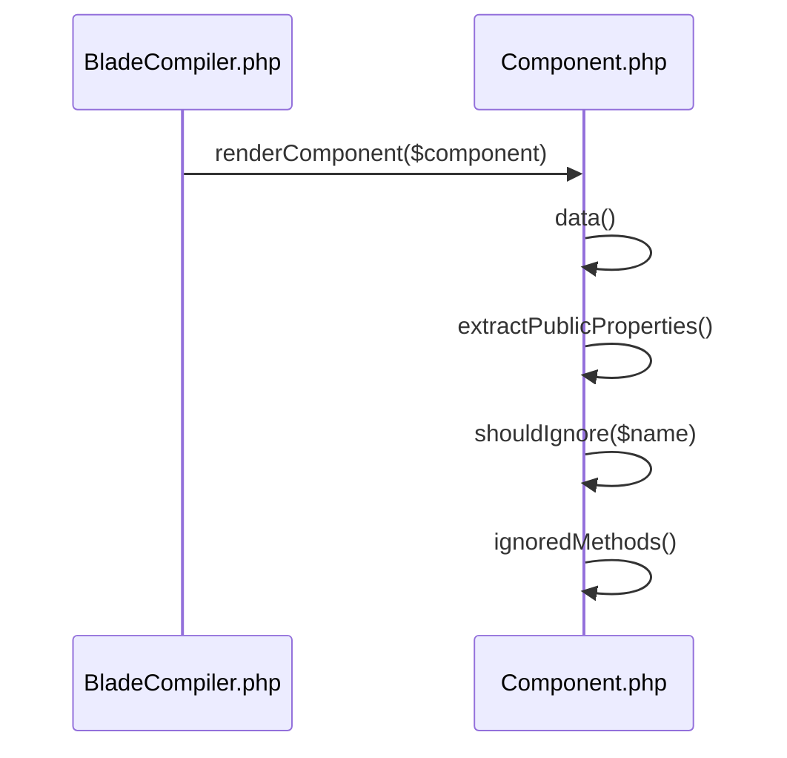

# Blade Compiler & Rendering

<details>
<summary>Relevant source files</summary>

The following files were used as context for generating this wiki page:

- [src/Illuminate/View/Compilers/BladeCompiler.php](https://github.com/laravel/framework/blob/main/src/Illuminate/View/Compilers/BladeCompiler.php)
- [src/Illuminate/View/Engines/CompilerEngine.php](https://github.com/laravel/framework/blob/main/src/Illuminate/View/Engines/CompilerEngine.php)
- [src/Illuminate/View/DynamicComponent.php](https://github.com/laravel/framework/blob/main/src/Illuminate/View/DynamicComponent.php)
- [src/Illuminate/Foundation/Console/ViewCacheCommand.php](https://github.com/laravel/framework/blob/main/src/Illuminate/Foundation/Console/ViewCacheCommand.php)
- [src/Illuminate/View/Compilers/Concerns/CompilesStacks.php](https://github.com/laravel/framework/blob/main/src/Illuminate/View/Compilers/Concerns/CompilesStacks.php)
- [src/Illuminate/View/Compilers/Concerns/CompilesConditionals.php](https://github.com/laravel/framework/blob/main/src/Illuminate/View/Compilers/Concerns/CompilesConditionals.php)
- [src/Illuminate/View/Compilers/Concerns/CompilesLayouts.php](https://github.com/laravel/framework/blob/main/src/Illuminate/View/Compilers/Concerns/CompilesLayouts.php)
- [src/Illuminate/View/Compilers/Concerns/CompilesIncludes.php](https://github.com/laravel/framework/blob/main/src/Illuminate/View/Compilers/Concerns/CompilesIncludes.php)
- [src/Illuminate/Support/Facades/Blade.php](https://github.com/laravel/framework/blob/main/src/Illuminate/Support/Facades/Blade.php)
- [src/Illuminate/View/Compilers/ComponentTagCompiler.php](https://github.com/laravel/framework/blob/main/src/Illuminate/View/Compilers/ComponentTagCompiler.php)
- [src/Illuminate/View/Compilers/Concerns/CompilesComponents.php](https://github.com/laravel/framework/blob/main/src/Illuminate/View/Compilers/Concerns/CompilesComponents.php)
- [src/Illuminate/View/Compilers/Concerns/CompilesEchos.php](https://github.com/laravel/framework/blob/main/src/Illuminate/View/Compilers/Concerns/CompilesEchos.php)
- [src/Illuminate/View/Compilers/Concerns/CompilesTranslations.php](https://github.com/laravel/framework/blob/main/src/Illuminate/View/Compilers/Concerns/CompilesTranslations.php)
- [src/Illuminate/View/Compilers/Concerns/CompilesRawPhp.php](https://github.com/laravel/framework/blob/main/src/Illuminate/View/Compilers/Concerns/CompilesRawPhp.php)
- [src/Illuminate/View/Compilers/Concerns/CompilesAuthorizations.php](https://github.com/laravel/framework/blob/main/src/Illuminate/View/Compilers/Concerns/CompilesAuthorizations.php)
- [src/Illuminate/View/Factory.php](https://github.com/laravel/framework/blob/main/src/Illuminate/View/Factory.php)
- [src/Illuminate/View/View.php](https://github.com/laravel/framework/blob/main/src/Illuminate/View/View.php)
- [src/Illuminate/Filesystem/Filesystem.php](https://github.com/laravel/framework/blob/main/src/Illuminate/Filesystem/Filesystem.php)
- [src/Illuminate/View/Component.php](https://github.com/laravel/framework/blob/main/src/Illuminate/View/Component.php)
</details>

## Overview

The Blade Compiler and Rendering subsystem translates expressive Blade templates into executable PHP code and manages their lifecycle within Laravel's view architecture. Serving as the primary engine for template parsing and component evaluation, it addresses the need for efficient template execution by caching compiled views on disk, analyzing expiration timestamps, and transforming custom syntax structures such as directives, echoes, and component tags into native PHP constructs. It embodies design decisions centered around extensibility, robust error handling, and separation of concerns between compilation and evaluation. By integrating tightly with the View Factory, Engine Resolver, and IoC container, the compiler system provides developers with a fluent facade surface and command-line caching tools to optimize production rendering performance.

Sources: [src/Illuminate/View/Compilers/BladeCompiler.php:181-218](https://github.com/laravel/framework/blob/main/src/Illuminate/View/Compilers/BladeCompiler.php#L181-L218), [src/Illuminate/View/Engines/CompilerEngine.php:60-96](https://github.com/laravel/framework/blob/main/src/Illuminate/View/Engines/CompilerEngine.php#L60-L96), [src/Illuminate/Foundation/Console/ViewCacheCommand.php:34-49](https://github.com/laravel/framework/blob/main/src/Illuminate/Foundation/Console/ViewCacheCommand.php#L34-L49), [src/Illuminate/Support/Facades/Blade.php:52-63](https://github.com/laravel/framework/blob/main/src/Illuminate/Support/Facades/Blade.php#L52-L63)

## Blade Compiler Engine and Compilation Lifecycle

### Overview

The compilation and execution lifecycle begins when `CompilerEngine::get()` is invoked with a template path and data array. The engine tracks active rendering by pushing the path onto the `lastCompiled` stack and evaluates whether the cached view has expired via `BladeCompiler::isExpired()`. If compilation is required, `BladeCompiler::compile()` reads the raw template string, applies precompilers, processes structural tokens, and writes the output file using atomic replacement strategies provided by `Filesystem::replace()`.

Sources: [src/Illuminate/View/Compilers/BladeCompiler.php:181-218](https://github.com/laravel/framework/blob/main/src/Illuminate/View/Compilers/BladeCompiler.php#L181-L218), [src/Illuminate/View/Engines/CompilerEngine.php:60-96](https://github.com/laravel/framework/blob/main/src/Illuminate/View/Engines/CompilerEngine.php#L60-L96)

### Compilation Execution Walkthrough

The compilation pipeline follows a strict execution path through specific methods on `BladeCompiler`:

`compile($path)` → `Filesystem::get()` → `compileString($value)` → `storeUncompiledBlocks()` → `compileComponentTags()` → `compileComments()` → `token_get_all()` → `parseToken()` → `restoreRawContent()` → `addFooters()` → `Filesystem::replace()`

1. **`compile($path)`**: Sets the active template path and determines if disk caching is enabled via `cachePath`.
Sources: [src/Illuminate/View/Compilers/BladeCompiler.php:181-185](https://github.com/laravel/framework/blob/main/src/Illuminate/View/Compilers/BladeCompiler.php#L181-L185)
2. **`compileString($value)`**: Receives raw file contents, iterates over `prepareStringsForCompilationUsing` callbacks, and stores uncompiled blocks like `@verbatim` and `@php`.
Sources: [src/Illuminate/View/Compilers/BladeCompiler.php:283-292](https://github.com/laravel/framework/blob/main/src/Illuminate/View/Compilers/BladeCompiler.php#L283-L292)
3. **`compileComponentTags()` & `compileComments()`**: Strips comment blocks and translates custom component HTML tags into `@component` directives before core tokenization.
Sources: [src/Illuminate/View/Compilers/BladeCompiler.php:296-298](https://github.com/laravel/framework/blob/main/src/Illuminate/View/Compilers/BladeCompiler.php#L296-L298)
4. **`token_get_all($value)`**: Parses the preprocessed template stream using the Zend lexer to distinguish inline HTML from PHP constructs.
Sources: [src/Illuminate/View/Compilers/BladeCompiler.php:307-310](https://github.com/laravel/framework/blob/main/src/Illuminate/View/Compilers/BladeCompiler.php#L307-L310)
5. **`parseToken($token)`**: Evaluates each token, executing registered compiler functions (`compileExtensions`, `compileStatements`, `compileEchos`) when encountering `T_INLINE_HTML`.
Sources: [src/Illuminate/View/Compilers/BladeCompiler.php:513-524](https://github.com/laravel/framework/blob/main/src/Illuminate/View/Compilers/BladeCompiler.php#L513-L524)
6. **`restoreRawContent()` & `addFooters()`**: Re-injects stored raw blocks and appends template inheritance footer directives (such as `@endsection` or `@stop`).
Sources: [src/Illuminate/View/Compilers/BladeCompiler.php:311-321](https://github.com/laravel/framework/blob/main/src/Illuminate/View/Compilers/BladeCompiler.php#L311-L321)
7. **`Filesystem::replace()`**: Writes the final compiled string to disk using an atomic temporary file creation and renaming sequence.
Sources: [src/Illuminate/Filesystem/Filesystem.php:215-234](https://github.com/laravel/framework/blob/main/src/Illuminate/Filesystem/Filesystem.php#L215-L234)

### File Caching and Expiration Verification

When verifying cached templates, `BladeCompiler` compares compilation hashes using the `xxh128` algorithm via `Filesystem::hash()`. If disk contents differ from generated compilation strings, or if the raw template modification timestamp (`lastModified`) exceeds the compiled view's timestamp, `touch()` is called to adjust expiration timing.

Sources: [src/Illuminate/View/Compilers/BladeCompiler.php:204-216](https://github.com/laravel/framework/blob/main/src/Illuminate/View/Compilers/BladeCompiler.php#L204-L216), [src/Illuminate/Filesystem/Filesystem.php:189-192](https://github.com/laravel/framework/blob/main/src/Illuminate/Filesystem/Filesystem.php#L189-L192)

> [!WARNING]
> If a file write throws a missing file exception during evaluation, `CompilerEngine::get()` catches the `ViewException`, re-compiles the expired or missing template path on-demand, and re-evaluates the path.

Sources: [src/Illuminate/View/Engines/CompilerEngine.php:75-89](https://github.com/laravel/framework/blob/main/src/Illuminate/View/Engines/CompilerEngine.php#L75-L89)

### Compiler Engine Execution Reference

| Method | Parameters | Return Type | Purpose |
| :--- | :--- | :--- | :--- |
| `CompilerEngine::get` | `string $path, array $data = []` | `string` | Evaluates compiled view paths with data and manages view exception stacks. |
| `BladeCompiler::compile` | `string\|null $path = null` | `void` | Compiles view contents from disk and writes or updates compiled cache files. |
| `BladeCompiler::compileString` | `string $value` | `string` | Transforms raw template strings into compiled PHP code. |
| `Filesystem::replace` | `string $path, string $content, int\|null $mode = null` | `void` | Writes file contents to a temporary directory before renaming atomically. |

Sources: [src/Illuminate/View/Compilers/BladeCompiler.php:181-218](https://github.com/laravel/framework/blob/main/src/Illuminate/View/Compilers/BladeCompiler.php#L181-L218), [src/Illuminate/View/Compilers/BladeCompiler.php:283-330](https://github.com/laravel/framework/blob/main/src/Illuminate/View/Compilers/BladeCompiler.php#L283-L330), [src/Illuminate/View/Engines/CompilerEngine.php:60-96](https://github.com/laravel/framework/blob/main/src/Illuminate/View/Engines/CompilerEngine.php#L60-L96), [src/Illuminate/Filesystem/Filesystem.php:215-234](https://github.com/laravel/framework/blob/main/src/Illuminate/Filesystem/Filesystem.php#L215-L234)

## Directive Parsing and Expression Transformation

### Overview

During the tokenized compilation stage, `BladeCompiler` processes inline HTML tokens by routing them through registered compilers, principally transforming statement directives, echoes, conditionals, layout inheritance, and raw PHP blocks into valid PHP structures. The statement compilation routine (`compileStatements`) parses tokens using regex patterns, handling multi-line parentheses via `hasEvenNumberOfParentheses()` before dispatching to specific method handlers.

Sources: [src/Illuminate/View/Compilers/BladeCompiler.php:508-524](https://github.com/laravel/framework/blob/main/src/Illuminate/View/Compilers/BladeCompiler.php#L508-L524), [src/Illuminate/View/Compilers/BladeCompiler.php:547-593](https://github.com/laravel/framework/blob/main/src/Illuminate/View/Compilers/BladeCompiler.php#L547-L593), [src/Illuminate/View/Compilers/BladeCompiler.php:630-654](https://github.com/laravel/framework/blob/main/src/Illuminate/View/Compilers/BladeCompiler.php#L630-L654)

### Directive Parsing & Call-Chain Execution

When parsing statements, `BladeCompiler` executes a specific evaluation path to identify and resolve directives:

`compileStatements()` → `hasEvenNumberOfParentheses()` → `compileStatement()` → `callCustomDirective()` or `compile{Name}()`

1. **`compileStatements()`**: Uses regular expressions to match directives beginning with `@` along with their optional expressions.
Sources: [src/Illuminate/View/Compilers/BladeCompiler.php:547-550](https://github.com/laravel/framework/blob/main/src/Illuminate/View/Compilers/BladeCompiler.php#L547-L550)
2. **`hasEvenNumberOfParentheses()`**: Verifies that statement expressions have balanced opening and closing parentheses using Zend lexer tokens (`token_get_all`).
Sources: [src/Illuminate/View/Compilers/BladeCompiler.php:630-654](https://github.com/laravel/framework/blob/main/src/Illuminate/View/Compilers/BladeCompiler.php#L630-L654)
3. **`compileStatement()`**: Determines if the directive name is a custom registered directive or maps to an internal compiler method.
Sources: [src/Illuminate/View/Compilers/BladeCompiler.php:662-675](https://github.com/laravel/framework/blob/main/src/Illuminate/View/Compilers/BladeCompiler.php#L662-L675)
4. **`callCustomDirective()`** or `compile{Name}()`: Strips surrounding whitespace and parentheses, executing the bound callback or trait method to return the compiled PHP string.
Sources: [src/Illuminate/View/Compilers/BladeCompiler.php:668-669](https://github.com/laravel/framework/blob/main/src/Illuminate/View/Compilers/BladeCompiler.php#L668-L669), [src/Illuminate/View/Compilers/BladeCompiler.php:684-693](https://github.com/laravel/framework/blob/main/src/Illuminate/View/Compilers/BladeCompiler.php#L684-L693)

> [!NOTE]
> If a custom directive is registered with `bindDirective()`, `BladeCompiler` binds the handler closure directly to the compiler instance using `$handler->bindTo($this, BladeCompiler::class)`.

Sources: [src/Illuminate/View/Compilers/BladeCompiler.php:976-998](https://github.com/laravel/framework/blob/main/src/Illuminate/View/Compilers/BladeCompiler.php#L976-L998)

### Expression Transformation Reference

Blade organizes its compilation logic across specialized traits. The table below outlines how common statement and echo categories translate into compiled PHP outputs.

| Category / Directive | Source Trait / File | Compiled Output / Transformation |
| :--- | :--- | :--- |
| **Regular Echo** `{{ $var }}` | `CompilesEchos.php` | `<?php echo e($var); ?>` (or via custom echo format) |
| **Raw Echo** `{!! $var !!}` | `CompilesEchos.php` | `<?php echo $var; ?>` |
| **Escaped Echo** `{{{ $var }}}` | `CompilesEchos.php` | `<?php echo e($var); ?>` |
| **Authentication** `@auth` / `@guest` | `CompilesConditionals.php` | `<?php if(auth()->guard()->check()): ?>` / `<?php if(auth()->guard()->guest()): ?>` |
| **Authorization** `@can` / `@cannot` | `CompilesAuthorizations.php` | `<?php if (app(\Illuminate\Contracts\Auth\Access\Gate::class)->check(...)): ?>` |
| **Layout Extends** `@extends` | `CompilesLayouts.php` | Appends `<?php echo $__env->make(..., array_diff_key(get_defined_vars(), ['__data' => 1, '__path' => 1]))->render(); ?>` to `$this->footer` |
| **Stacks & Pushes** `@push` / `@stack` | `CompilesStacks.php` | `<?php $__env->startPush(...); ?>` / `<?php echo $__env->yieldPushContent(...); ?>` |
| **Translations** `@lang` / `@choice` | `CompilesTranslations.php` | `<?php echo app('translator')->get(...); ?>` / `<?php echo app('translator')->choice(...); ?>` |
| **Raw PHP** `@php` / `@endphp` | `BladeCompiler.php` / `CompilesRawPhp.php` | Stored via `storeRawBlock()` as `<?php ... ?>` placeholders |

Sources: [src/Illuminate/View/Compilers/BladeCompiler.php:430-435](https://github.com/laravel/framework/blob/main/src/Illuminate/View/Compilers/BladeCompiler.php#L430-L435), [src/Illuminate/View/Compilers/Concerns/CompilesEchos.php:68-123](https://github.com/laravel/framework/blob/main/src/Illuminate/View/Compilers/Concerns/CompilesEchos.php#L68-L123), [src/Illuminate/View/Compilers/Concerns/CompilesConditionals.php:22-27](https://github.com/laravel/framework/blob/main/src/Illuminate/View/Compilers/Concerns/CompilesConditionals.php#L22-L27), [src/Illuminate/View/Compilers/Concerns/CompilesConditionals.php:99-104](https://github.com/laravel/framework/blob/main/src/Illuminate/View/Compilers/Concerns/CompilesConditionals.php#L99-L104), [src/Illuminate/View/Compilers/Concerns/CompilesAuthorizations.php:13-27](https://github.com/laravel/framework/blob/main/src/Illuminate/View/Compilers/Concerns/CompilesAuthorizations.php#L13-L27), [src/Illuminate/View/Compilers/Concerns/CompilesLayouts.php:20-29](https://github.com/laravel/framework/blob/main/src/Illuminate/View/Compilers/Concerns/CompilesLayouts.php#L20-L29), [src/Illuminate/View/Compilers/Concerns/CompilesStacks.php:15-29](https://github.com/laravel/framework/blob/main/src/Illuminate/View/Compilers/Concerns/CompilesStacks.php#L15-L29), [src/Illuminate/View/Compilers/Concerns/CompilesTranslations.php:13-22](https://github.com/laravel/framework/blob/main/src/Illuminate/View/Compilers/Concerns/CompilesTranslations.php#L13-L22), [src/Illuminate/View/Compilers/Concerns/CompilesTranslations.php:40-43](https://github.com/laravel/framework/blob/main/src/Illuminate/View/Compilers/Concerns/CompilesTranslations.php#L40-L43)

### Architectural Design Trade-Offs

| Design Choice | Benefit | Cost |
| :--- | :--- | :--- |
| **Tokenizing with `token_get_all`** | Distinguishes inline HTML from valid PHP structures accurately without regex recursion on scripts. | Higher CPU and memory overhead during template compilation phases. |
| **Footer Accumulation for Layouts** | Allows `@extends` declarations written anywhere in a template to execute last. | Requires deferred string concatenation (`addFooters()`) at the end of compilation. |
| **Raw Block Placeholder Substitution** | Prevents internal compiler directives inside `@php` or `@verbatim` blocks from being prematurely parsed. | Requires two-pass management (`storeUncompiledBlocks()` and `restoreRawContent()`). |

Sources: [src/Illuminate/View/Compilers/BladeCompiler.php:291-321](https://github.com/laravel/framework/blob/main/src/Illuminate/View/Compilers/BladeCompiler.php#L291-L321), [src/Illuminate/View/Compilers/BladeCompiler.php:398-493](https://github.com/laravel/framework/blob/main/src/Illuminate/View/Compilers/BladeCompiler.php#L398-L493)

## Component Tag Compilation and Dynamic Components

### Overview

Blade component tag compilation parses XML-style component tags (`<x-...>`) and transforms them into standard view rendering directives (`@component`). Handled primarily by `ComponentTagCompiler` and `DynamicComponent`, this process manages tag attributes, short-hand syntax, slot parsing, and component string construction.

Sources: [src/Illuminate/View/Compilers/ComponentTagCompiler.php:67-77](https://github.com/laravel/framework/blob/main/src/Illuminate/View/Compilers/ComponentTagCompiler.php#L67-L77), [src/Illuminate/View/DynamicComponent.php:51-85](https://github.com/laravel/framework/blob/main/src/Illuminate/View/DynamicComponent.php#L51-L85)

### Component Tag Parsing and Compilation Call Chain

Component tag compilation follows a rigid transformation flow starting from raw string input and ending with fully compiled component strings.

1. `BladeCompiler::compileString()` invokes `compileComponentTags()` on the template string.
Sources: [src/Illuminate/View/Compilers/BladeCompiler.php:296-298](https://github.com/laravel/framework/blob/main/src/Illuminate/View/Compilers/BladeCompiler.php#L296-L298), [src/Illuminate/View/Compilers/BladeCompiler.php:456-465](https://github.com/laravel/framework/blob/main/src/Illuminate/View/Compilers/BladeCompiler.php#L456-L465)
2. `ComponentTagCompiler::compile()` sequentially runs `compileSlots()` then `compileTags()`.
Sources: [src/Illuminate/View/Compilers/ComponentTagCompiler.php:72-77](https://github.com/laravel/framework/blob/main/src/Illuminate/View/Compilers/ComponentTagCompiler.php#L72-L77)
3. `compileTags()` invokes `compileSelfClosingTags()`, `compileOpeningTags()`, and `compileClosingTags()`.
Sources: [src/Illuminate/View/Compilers/ComponentTagCompiler.php:87-94](https://github.com/laravel/framework/blob/main/src/Illuminate/View/Compilers/ComponentTagCompiler.php#L87-L94)
4. Each regex callback delegates to `getAttributesFromAttributeString()`, which parses attribute bags, short-hand syntax (`:@$foo`), `@class`, `@style`, and bindings via `parseShortAttributeSyntax()`, `parseAttributeBag()`, `parseComponentTagClassStatements()`, `parseComponentTagStyleStatements()`, and `parseBindAttributes()`.
Sources: [src/Illuminate/View/Compilers/ComponentTagCompiler.php:151-157](https://github.com/laravel/framework/blob/main/src/Illuminate/View/Compilers/ComponentTagCompiler.php#L151-L157), [src/Illuminate/View/Compilers/ComponentTagCompiler.php:597-651](https://github.com/laravel/framework/blob/main/src/Illuminate/View/Compilers/ComponentTagCompiler.php#L597-L651)
5. Finally, `componentString()` builds the `@component` invocation, filtering ignored parameters and appending attribute bags.
Sources: [src/Illuminate/View/Compilers/ComponentTagCompiler.php:233-266](https://github.com/laravel/framework/blob/main/src/Illuminate/View/Compilers/ComponentTagCompiler.php#L233-L266)

> [!NOTE]
> During attribute string parsing, if an attribute is encountered without a value (e.g., `<x-alert foo />`), it is automatically treated as a bound attribute with a default value of `'true'`.
> Sources: [src/Illuminate/View/Compilers/ComponentTagCompiler.php:629-633](https://github.com/laravel/framework/blob/main/src/Illuminate/View/Compilers/ComponentTagCompiler.php#L629-L633)

### Dynamic Component Attribute Management

Dynamic components (`<x-dynamic-component :component="$name" />`) defer target resolution to runtime via the `DynamicComponent` class. `DynamicComponent::render()` constructs a template that extracts camel-cased attributes, compiles props, binds dynamic variables, and sets up slots before rendering the inner component tag.

```php
        $template = <<<'EOF'
<?php extract((new \Illuminate\Support\Collection($attributes->getAttributes()))->mapWithKeys(function ($value, $key) { return [Illuminate\Support\Str::camel(str_replace([':', '.'], ' ', $key)) => $value]; })->all(), EXTR_SKIP); ?>
{{ props }}
<x-{{ component }} {{ bindings }} {{ attributes }}>
{{ slots }}
{{ defaultSlot }}
</x-{{ component }}>
EOF;
```

Sources: [src/Illuminate/View/DynamicComponent.php:53-60](https://github.com/laravel/framework/blob/main/src/Illuminate/View/DynamicComponent.php#L53-L60)

The dynamic component partitions data and attributes by reflecting on the resolved component class constructor, compiling property names into `@props` statements and prefixing bound parameters with colons.

Sources: [src/Illuminate/View/DynamicComponent.php:76-79](https://github.com/laravel/framework/blob/main/src/Illuminate/View/DynamicComponent.php#L76-L79), [src/Illuminate/View/DynamicComponent.php:93-115](https://github.com/laravel/framework/blob/main/src/Illuminate/View/DynamicComponent.php#L93-L115), [src/Illuminate/View/DynamicComponent.php:148-153](https://github.com/laravel/framework/blob/main/src/Illuminate/View/DynamicComponent.php#L148-L153)

> [!WARNING]
> When using `DynamicComponent`, attribute keys containing colons or periods are normalized into camelCase variable names via `Str::camel(str_replace([':', '.'], ' ', $key))` inside the extracted scope.
> Sources: [src/Illuminate/View/DynamicComponent.php:54-54](https://github.com/laravel/framework/blob/main/src/Illuminate/View/DynamicComponent.php#L54)

### Component Tag Parsing Transformations

| Syntax Element | Source Method | Target Transformation / Output Behavior |
| :--- | :--- | :--- |
| **Short Attribute** `:@$foo` | `parseShortAttributeSyntax()` | Expanded to `:foo="$foo"` |
| **Attribute Bag** `{{ $attributes }}` | `parseAttributeBag()` | Converted to `:attributes="$attributes"` |
| **Class Directive** `@class([...])` | `parseComponentTagClassStatements()` | Transformed into `:class="\Illuminate\Support\Arr::toCssClasses([...])"` |
| **Style Directive** `@style([...])` | `parseComponentTagStyleStatements()` | Transformed into `:style="\Illuminate\Support\Arr::toCssStyles([...])"` |
| **Bind Attribute** `:foo="$bar"` | `parseBindAttributes()` | Prefixed with `bind:` for type-safe attribute bag serialization |

Sources: [src/Illuminate/View/Compilers/ComponentTagCompiler.php:597-651](https://github.com/laravel/framework/blob/main/src/Illuminate/View/Compilers/ComponentTagCompiler.php#L597-L651), [src/Illuminate/View/Compilers/ComponentTagCompiler.php:659-742](https://github.com/laravel/framework/blob/main/src/Illuminate/View/Compilers/ComponentTagCompiler.php#L659-L742)

## Component Class Resolution and State Processing

### Overview

Component rendering in Laravel bridges class-based components and compiled view templates by resolving instances, extracting public state, filtering methods, and preparing attribute bags. When a component is rendered, `BladeCompiler::renderComponent()` initiates the process by retrieving data from the component instance and resolving its view.
Sources: [src/Illuminate/View/Compilers/BladeCompiler.php:374-390](https://github.com/laravel/framework/blob/main/src/Illuminate/View/Compilers/BladeCompiler.php#L374-L390)


Sources: [src/Illuminate/View/Compilers/BladeCompiler.php:374-390](https://github.com/laravel/framework/blob/main/src/Illuminate/View/Compilers/BladeCompiler.php#L374-L390), [src/Illuminate/View/Component.php:224-344](https://github.com/laravel/framework/blob/main/src/Illuminate/View/Component.php#L224-L344)

The component data extraction pipeline executes in a strict call chain order:
1. `renderComponent` (invoked by the compiled template engine)
2. `data` (prepares attributes and merges public properties with methods)
3. `extractPublicProperties` (gathers non-static public properties using reflection and property caching)
4. `shouldIgnore` (evaluates whether a property or method name starts with double underscores or is explicitly ignored)
5. `ignoredMethods` (supplies the baseline array of restricted framework methods and custom user exceptions)
Sources: [src/Illuminate/View/Compilers/BladeCompiler.php:374-390](https://github.com/laravel/framework/blob/main/src/Illuminate/View/Compilers/BladeCompiler.php#L374-L390), [src/Illuminate/View/Component.php:224-344](https://github.com/laravel/framework/blob/main/src/Illuminate/View/Component.php#L224-L344)

> [!WARNING]
> Public properties or methods starting with a double underscore (`__`) or matching built-in lifecycle names are automatically ignored and never exposed to the view data array.
> Sources: [src/Illuminate/View/Component.php:317-321](https://github.com/laravel/framework/blob/main/src/Illuminate/View/Component.php#L317-L321)

### Component Resolution and Constructor Mapping

Component instantiation via `Component::resolve()` inspects the component's constructor parameters using reflection. If all constructor parameters match provided data keys, it instantiates the class directly; otherwise, it delegates resolution to the container.
Sources: [src/Illuminate/View/Component.php:100-115](https://github.com/laravel/framework/blob/main/src/Illuminate/View/Component.php#L100-L115)

| Resolution Method / Cache | Source Property / Method | Purpose & Mechanism |
| :--- | :--- | :--- |
| **Constructor Reflection** | `extractConstructorParameters()` | Inspects constructor parameters using `ReflectionClass` and caches them by class name. |
| **Property Cache** | `static::$propertyCache` | Stores reflection-derived public property lists keyed by class string to avoid redundant reflection overhead. |
| **Method Cache** | `static::$methodCache` | Caches public method names keyed by class string for runtime method variable generation. |
| **Blade View Cache** | `static::$bladeViewCache` | Caches resolved view names keyed by template contents and class string. |

Sources: [src/Illuminate/View/Component.php:54-78](https://github.com/laravel/framework/blob/main/src/Illuminate/View/Component.php#L54-L78), [src/Illuminate/View/Component.php:122-135](https://github.com/laravel/framework/blob/main/src/Illuminate/View/Component.php#L122-L135), [src/Illuminate/View/Component.php:240-248](https://github.com/laravel/framework/blob/main/src/Illuminate/View/Component.php#L240-L248), [src/Illuminate/View/Component.php:268-274](https://github.com/laravel/framework/blob/main/src/Illuminate/View/Component.php#L268-L274)

### Ignored Component Methods

Component instances restrict specific internal methods from leaking into template scopes. The core framework ignores a defined set of baseline utility and lifecycle methods.

| Ignored Method | Description / Context |
| :---

## Related

- [[View Components & Layouts]]

