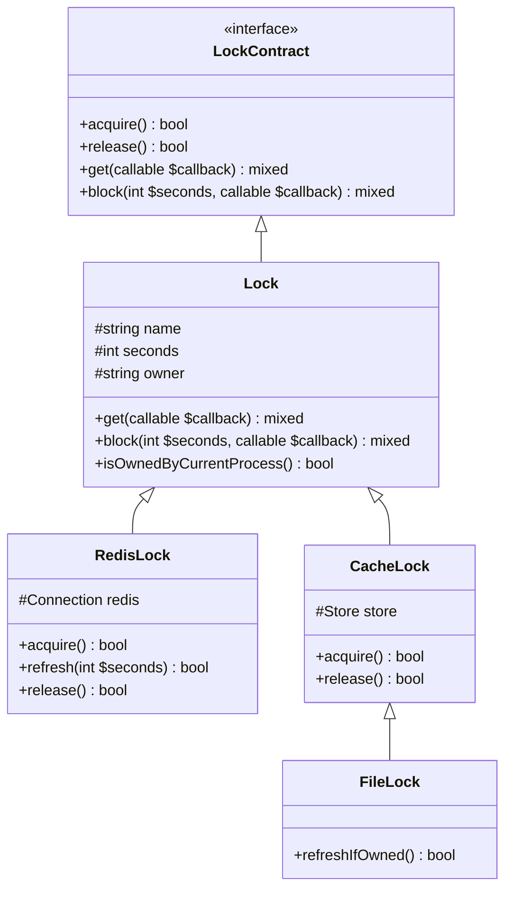
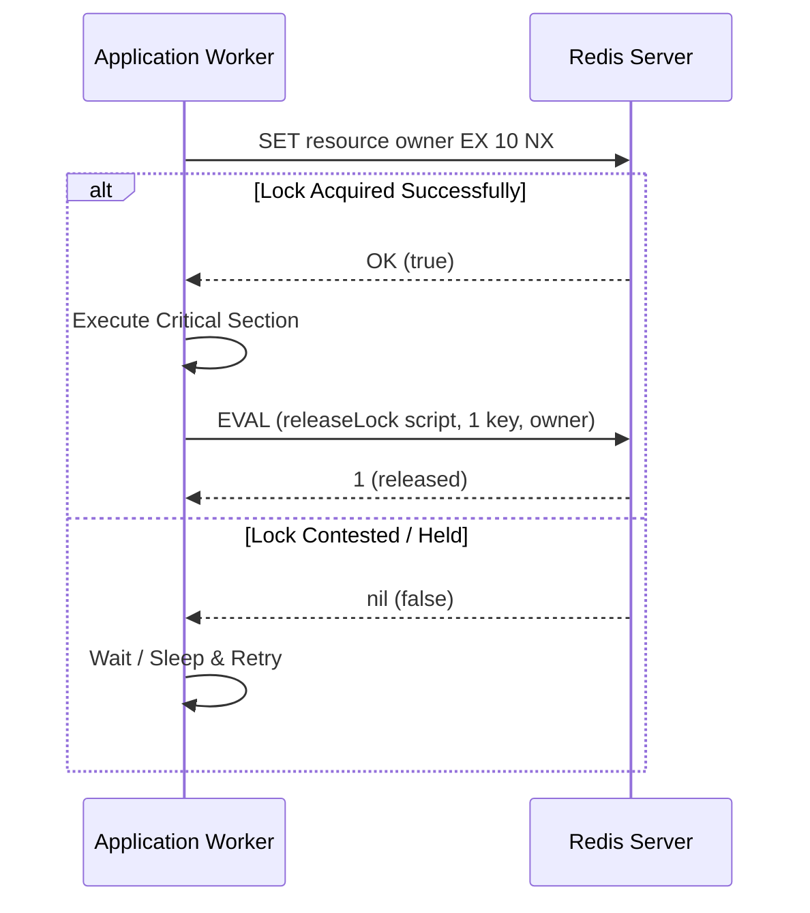
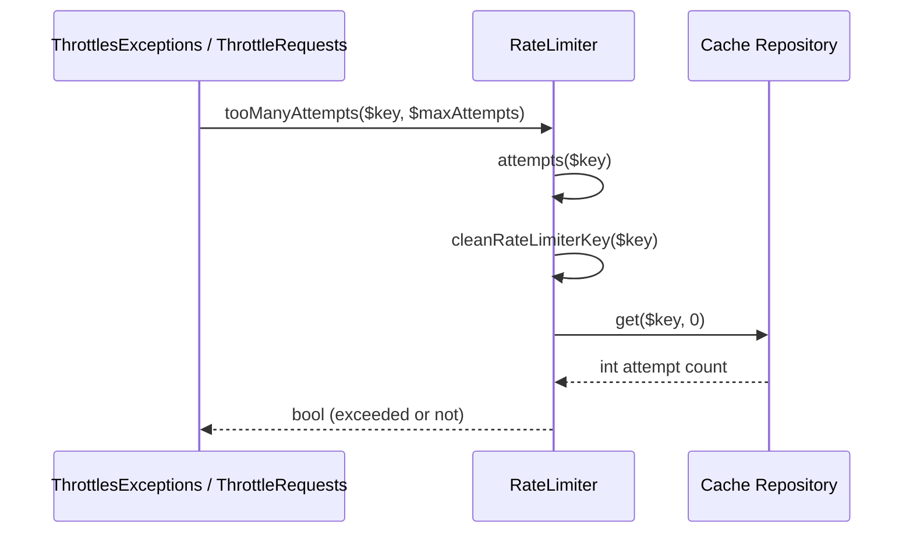
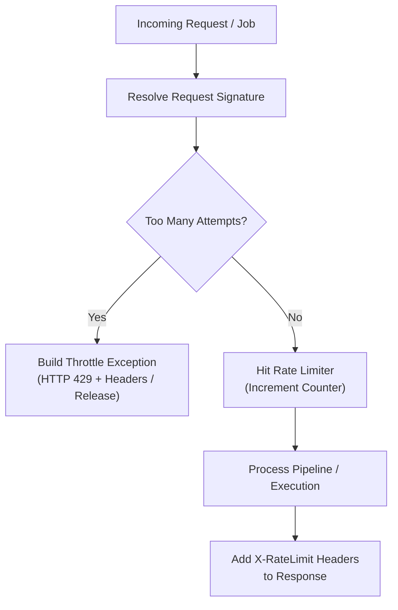
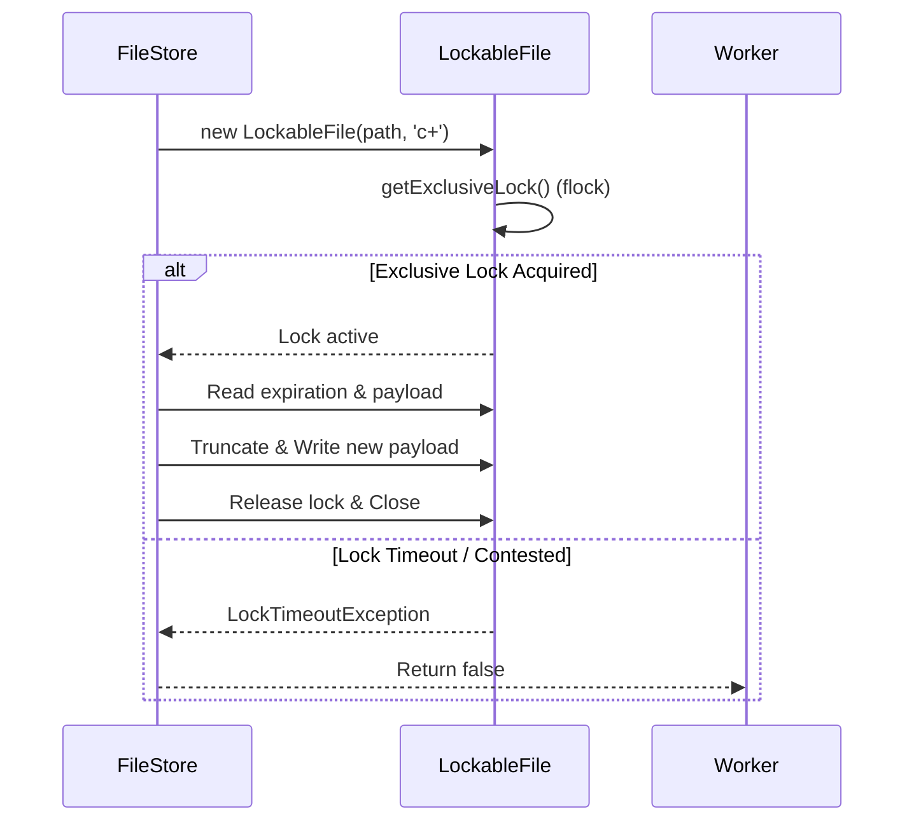

# Cache Lock & Rate Limiting

<details>
<summary>Relevant source files</summary>

The following files were used as context for generating this wiki page:

- [src/Illuminate/Cache/Repository.php](https://github.com/laravel/framework/blob/main/src/Illuminate/Cache/Repository.php)
- [src/Illuminate/Cache/RateLimiter.php](https://github.com/laravel/framework/blob/main/src/Illuminate/Cache/RateLimiter.php)
- [src/Illuminate/Cache/FileStore.php](https://github.com/laravel/framework/blob/main/src/Illuminate/Cache/FileStore.php)
- [src/Illuminate/Console/CacheCommandMutex.php](https://github.com/laravel/framework/blob/main/src/Illuminate/Console/CacheCommandMutex.php)
- [src/Illuminate/Redis/Limiters/ConcurrencyLimiter.php](https://github.com/laravel/framework/blob/main/src/Illuminate/Redis/Limiters/ConcurrencyLimiter.php)
- [src/Illuminate/Bus/DebounceLock.php](https://github.com/laravel/framework/blob/main/src/Illuminate/Bus/DebounceLock.php)
- [src/Illuminate/Routing/Middleware/ThrottleRequestsWithRedis.php](https://github.com/laravel/framework/blob/main/src/Illuminate/Routing/Middleware/ThrottleRequestsWithRedis.php)
- [src/Illuminate/Redis/Limiters/DurationLimiter.php](https://github.com/laravel/framework/blob/main/src/Illuminate/Redis/Limiters/DurationLimiter.php)
- [src/Illuminate/Cache/Limiters/ConcurrencyLimiter.php](https://github.com/laravel/framework/blob/main/src/Illuminate/Cache/Limiters/ConcurrencyLimiter.php)
- [src/Illuminate/Routing/Middleware/ThrottleRequests.php](https://github.com/laravel/framework/blob/main/src/Illuminate/Routing/Middleware/ThrottleRequests.php)
- [src/Illuminate/Support/Facades/Cache.php](https://github.com/laravel/framework/blob/main/src/Illuminate/Support/Facades/Cache.php)
- [src/Illuminate/Cache/Limiters/ConcurrencyLimiterBuilder.php](https://github.com/laravel/framework/blob/main/src/Illuminate/Cache/Limiters/ConcurrencyLimiterBuilder.php)
- [src/Illuminate/Console/Scheduling/CacheSchedulingMutex.php](https://github.com/laravel/framework/blob/main/src/Illuminate/Console/Scheduling/CacheSchedulingMutex.php)
- [src/Illuminate/Cache/MemoizedStore.php](https://github.com/laravel/framework/blob/main/src/Illuminate/Cache/MemoizedStore.php)
- [src/Illuminate/Cache/RedisStore.php](https://github.com/laravel/framework/blob/main/src/Illuminate/Cache/RedisStore.php)
- [src/Illuminate/Cache/DynamoDbStore.php](https://github.com/laravel/framework/blob/main/src/Illuminate/Cache/DynamoDbStore.php)
- [src/Illuminate/Cache/MemcachedStore.php](https://github.com/laravel/framework/blob/main/src/Illuminate/Cache/MemcachedStore.php)
- [src/Illuminate/Cache/FailoverStore.php](https://github.com/laravel/framework/blob/main/src/Illuminate/Cache/FailoverStore.php)
- [src/Illuminate/Cache/CacheLock.php](https://github.com/laravel/framework/blob/main/src/Illuminate/Cache/CacheLock.php)
- [src/Illuminate/Redis/Limiters/ConcurrencyLimiterBuilder.php](https://github.com/laravel/framework/blob/main/src/Illuminate/Redis/Limiters/ConcurrencyLimiterBuilder.php)
- [src/Illuminate/Cache/HasCacheLock.php](https://github.com/laravel/framework/blob/main/src/Illuminate/Cache/HasCacheLock.php)
- [src/Illuminate/Support/Facades/RateLimiter.php](https://github.com/laravel/framework/blob/main/src/Illuminate/Support/Facades/RateLimiter.php)
- [src/Illuminate/Cache/LuaScripts.php](https://github.com/laravel/framework/blob/main/src/Illuminate/Cache/LuaScripts.php)
- [src/Illuminate/Cache/Lock.php](https://github.com/laravel/framework/blob/main/src/Illuminate/Cache/Lock.php)
- [src/Illuminate/Cache/RedisLock.php](https://github.com/laravel/framework/blob/main/src/Illuminate/Cache/RedisLock.php)
- [src/Illuminate/Contracts/Cache/Repository.php](https://github.com/laravel/framework/blob/main/src/Illuminate/Contracts/Cache/Repository.php)
- [src/Illuminate/Queue/Middleware/ThrottlesExceptions.php](https://github.com/laravel/framework/blob/main/src/Illuminate/Queue/Middleware/ThrottlesExceptions.php)
- [src/Illuminate/Redis/Connections/PhpRedisConnection.php](https://github.com/laravel/framework/blob/main/src/Illuminate/Redis/Connections/PhpRedisConnection.php)
</details>

## Overview

### Overview Introduction
The Cache Lock & Rate Limiting subsystem in Laravel provides the foundational primitives required for distributed coordination, mutex protection, request throttling, and concurrency control across multiple processes or application instances. Operating primarily via underlying cache stores (such as Redis, File, Memcached, and DynamoDB), this component prevents race conditions, data corruption, duplicate job executions, and abuse of API endpoints. It bridges high-level interfaces like HTTP middleware and queue decorators with low-level atomic primitives, leveraging driver-specific capabilities—such as Redis Lua scripts and exclusive file locking—to ensure thread-safe and cluster-safe operations.

By establishing abstractions like `Lock`, `RateLimiter`, and concurrency limiters (`funnel`), the system decouples business logic from specific concurrency management backends. It solves critical challenges in distributed systems including split-brain scenarios, thundering herd problems during cache regeneration, and precise time-window tracking. These mechanisms interact directly with storage drivers and event dispatchers to offer robust locking guarantees, owner-verified lock release, and fallback or blocking behavior when resources are contested.

Sources: [src/Illuminate/Cache/Repository.php:718-736](https://github.com/laravel/framework/blob/main/src/Illuminate/Cache/Repository.php#L718-L736)
Sources: [src/Illuminate/Cache/RateLimiter.php:14-16](https://github.com/laravel/framework/blob/main/src/Illuminate/Cache/RateLimiter.php#L14-L16)
Sources: [src/Illuminate/Cache/Lock.php:13-62](https://github.com/laravel/framework/blob/main/src/Illuminate/Cache/Lock.php#L13-L62)

---

## Architectural Abstractions and Lock Providers

### Overview and Abstractions
The cache locking subsystem centers around the abstract `Lock` class and the `LockProvider` contract. Cache stores that support locking implement `LockProvider`, returning driver-specific lock instances like `RedisLock`, `PhpRedisLock`, `FileLock`, `MemcachedLock`, `DynamoDbLock`, or `CacheLock`. Each lock instance manages a unique resource name, an expiration time (TTL), and a process-unique owner identifier generated via `Str::random()`.

Sources: [src/Illuminate/Cache/Lock.php:13-62](https://github.com/laravel/framework/blob/main/src/Illuminate/Cache/Lock.php#L13-L62)

### Owner Verification and Safety
When a lock is acquired via `get()` or `block()`, the owner token is written into the cache store. This guarantees that only the process that acquired the lock can release it, checked via `isOwnedByCurrentProcess()`. If a process attempts to release a lock it no longer owns (e.g., because the lock expired and was acquired by another worker), the operation safely fails rather than releasing another process's lock.

Sources: [src/Illuminate/Cache/Lock.php:167-181](https://github.com/laravel/framework/blob/main/src/Illuminate/Cache/Lock.php#L167-L181)
Sources: [src/Illuminate/Cache/CacheLock.php:56-63](https://github.com/laravel/framework/blob/main/src/Illuminate/Cache/CacheLock.php#L56-L63)

### Class Hierarchy Diagram

Sources: [src/Illuminate/Cache/Lock.php:13-14](https://github.com/laravel/framework/blob/main/src/Illuminate/Cache/Lock.php#L13-L14)
Sources: [src/Illuminate/Cache/RedisLock.php:5-6](https://github.com/laravel/framework/blob/main/src/Illuminate/Cache/RedisLock.php#L5-L6)

---

## Atomic Lock Acquisition & Lua Scripting

### Mechanism and Atomicity
To achieve atomicity across distributed nodes without race conditions, Redis-backed locks execute atomic commands and Lua scripts. For instance, `RedisLock::acquire()` issues a `SET key owner EX seconds NX` command, which sets the key only if it does not already exist (`NX`) and assigns an expiration time (`EX`) in a single atomic operation.

Sources: [src/Illuminate/Cache/RedisLock.php:34-41](https://github.com/laravel/framework/blob/main/src/Illuminate/Cache/RedisLock.php#L34-L41)

### Lua Script Evaluation
When refreshing or releasing locks, `RedisLock` invokes Lua scripts via `Redis::eval()` to verify ownership before modifying or deleting the key. This prevents check-then-act race conditions where a lock expires mid-execution and is overwritten by another worker before the original worker issues a `DEL`.

Sources: [src/Illuminate/Cache/RedisLock.php:49-66](https://github.com/laravel/framework/blob/main/src/Illuminate/Cache/RedisLock.php#L49-L66)
Sources: [src/Illuminate/Cache/LuaScripts.php:24-66](https://github.com/laravel/framework/blob/main/src/Illuminate/Cache/LuaScripts.php#L24-L66)

### Lock Sequence Diagram

Sources: [src/Illuminate/Cache/RedisLock.php:34-41](https://github.com/laravel/framework/blob/main/src/Illuminate/Cache/RedisLock.php#L34-L41)
Sources: [src/Illuminate/Cache/LuaScripts.php:57-66](https://github.com/laravel/framework/blob/main/src/Illuminate/Cache/LuaScripts.php#L57-L66)

> [!IMPORTANT]
> The Lua scripts executed by `RedisLock` and `DurationLimiter` guarantee that read-check-write operations (such as verifying lock ownership or sliding window counters) occur atomically within the Redis event loop, preventing split-brain concurrency violations.
> Sources: [src/Illuminate/Cache/LuaScripts.php:24-66](https://github.com/laravel/framework/blob/main/src/Illuminate/Cache/LuaScripts.php#L24-L66)
> Sources: [src/Illuminate/Redis/Limiters/DurationLimiter.php:140-202](https://github.com/laravel/framework/blob/main/src/Illuminate/Redis/Limiters/DurationLimiter.php#L140-L202)

---

## Concurrency Limiting & Funnel Pattern

### Funnel Builder Architecture
The `funnel()` method on cache repositories provides rate-limited concurrency control, allowing developers to restrict a callback to a maximum number of simultaneous executions across workers. Implemented via `ConcurrencyLimiterBuilder` and `ConcurrencyLimiter`, it attempts to acquire one of several slot locks (`name1`, `name2`, ..., `nameN`) up to `maxLocks`.

Sources: [src/Illuminate/Cache/Repository.php:729-736](https://github.com/laravel/framework/blob/main/src/Illuminate/Cache/Repository.php#L729-L736)
Sources: [src/Illuminate/Cache/Limiters/ConcurrencyLimiterBuilder.php:59-137](https://github.com/laravel/framework/blob/main/src/Illuminate/Cache/Limiters/ConcurrencyLimiterBuilder.php#L59-137)

### Slot Acquisition Mechanism
The underlying `ConcurrencyLimiter` loops through available slots. In Redis, `ConcurrencyLimiter` evaluates a Lua script that inspects multiple slot keys via `mget`, claiming the first unallocated slot with a unique client ID and expiration timer.

Sources: [src/Illuminate/Redis/Limiters/ConcurrencyLimiter.php:110-143](https://github.com/laravel/framework/blob/main/src/Illuminate/Redis/Limiters/ConcurrencyLimiter.php#L110-L143)

### Usage Example
```php
use Illuminate\Support\Facades\Cache;
use Illuminate\Contracts\Cache\LockTimeoutException;

Cache::funnel('upload-service')
    ->limit(5)
    ->block(10, function () {
        // Handle heavy concurrent task
    });
```
Sources: [src/Illuminate/Cache/Limiters/ConcurrencyLimiterBuilder.php:71-137](https://github.com/laravel/framework/blob/main/src/Illuminate/Cache/Limiters/ConcurrencyLimiterBuilder.php#L71-L137)

---

## Rate Limiter Architecture & HTTP Throttling

### Rate Limiter Core
The `RateLimiter` class manages hit counters and lockout timers using a cache store. It supports named limiters registered via `RateLimiter::for()`, which are evaluated by HTTP request middleware (`ThrottleRequests` and `ThrottleRequestsWithRedis`) and queue exception handlers (`ThrottlesExceptions`).

Sources: [src/Illuminate/Cache/RateLimiter.php:49-56](https://github.com/laravel/framework/blob/main/src/Illuminate/Cache/RateLimiter.php#L49-L56)
Sources: [src/Illuminate/Cache/RateLimiter.php:127-139](https://github.com/laravel/framework/blob/main/src/Illuminate/Cache/RateLimiter.php#L127-L139)

### Call Chain Walkthrough: `Handle -> CleanRateLimiterKey`
When an incoming HTTP request or queue exception middleware (`ThrottlesExceptions::handle()`) evaluates rate limits, the execution follows an explicit path: `handle()` invokes `tooManyAttempts()` on the `RateLimiter` instance, which in turn calls `attempts()`, which sanitizes and retrieves the raw attempt counter by calling `cleanRateLimiterKey()`.


Sources: [src/Illuminate/Queue/Middleware/ThrottlesExceptions.php:109-114](https://github.com/laravel/framework/blob/main/src/Illuminate/Queue/Middleware/ThrottlesExceptions.php#L109-L114)
Sources: [src/Illuminate/Cache/RateLimiter.php:127-138](https://github.com/laravel/framework/blob/main/src/Illuminate/Cache/RateLimiter.php#L127-L138)
Sources: [src/Illuminate/Cache/RateLimiter.php:202-207](https://github.com/laravel/framework/blob/main/src/Illuminate/Cache/RateLimiter.php#L202-L207)
Sources: [src/Illuminate/Cache/RateLimiter.php:284-287](https://github.com/laravel/framework/blob/main/src/Illuminate/Cache/RateLimiter.php#L284-L287)

### Throttling Flowchart

Sources: [src/Illuminate/Routing/Middleware/ThrottleRequests.php:85-183](https://github.com/laravel/framework/blob/main/src/Illuminate/Routing/Middleware/ThrottleRequests.php#L85-L183)
Sources: [src/Illuminate/Queue/Middleware/ThrottlesExceptions.php:110-142](https://github.com/laravel/framework/blob/main/src/Illuminate/Queue/Middleware/ThrottlesExceptions.php#L110-L142)

### Request Throttling Configuration & Headers

| Header Name | Description | Source Reference |
| :--- | :--- | :--- |
| `X-RateLimit-Limit` | Maximum number of allowed attempts for the decay window. | [ThrottleRequests.php:309](https://github.com/laravel/framework/blob/main/src/Illuminate/Routing/Middleware/ThrottleRequests.php#L309) |
| `X-RateLimit-Remaining` | Number of remaining attempts available in the current window. | [ThrottleRequests.php:310](https://github.com/laravel/framework/blob/main/src/Illuminate/Routing/Middleware/ThrottleRequests.php#L310) |
| `Retry-After` | Number of seconds until the rate limit resets (sent when throttled). | [ThrottleRequests.php:314](https://github.com/laravel/framework/blob/main/src/Illuminate/Routing/Middleware/ThrottleRequests.php#L314) |
| `X-RateLimit-Reset` | Unix timestamp when the rate limit window resets. | [ThrottleRequests.php:315](https://github.com/laravel/framework/blob/main/src/Illuminate/Routing/Middleware/ThrottleRequests.php#L315) |

> [!NOTE]
> When using `ThrottleRequestsWithRedis`, the system delegates rate-limiting logic directly to `DurationLimiter`, which uses a sliding-window duration Lua script over Redis hashes to track request counts without race conditions.
> Sources: [src/Illuminate/Routing/Middleware/ThrottleRequestsWithRedis.php:56-83](https://github.com/laravel/framework/blob/main/src/Illuminate/Routing/Middleware/ThrottleRequestsWithRedis.php#L56-L83)
> Sources: [src/Illuminate/Redis/Limiters/DurationLimiter.php:102-127](https://github.com/laravel/framework/blob/main/src/Illuminate/Redis/Limiters/DurationLimiter.php#L102-L127)

---

## File-Based Locking and Store Internals

### Filesystem Locking
For environments utilizing file-based caching, `FileStore` and `FileLock` provide filesystem-level coordination. `FileStore::add()` and `FileStore::refreshIfOwned()` leverage PHP's `LockableFile` class to obtain exclusive advisory locks (`flock`) on cache payload files.

Sources: [src/Illuminate/Cache/FileStore.php:114-143](https://github.com/laravel/framework/blob/main/src/Illuminate/Cache/FileStore.php#L114-L143)
Sources: [src/Illuminate/Cache/FileStore.php:260-299](https://github.com/laravel/framework/blob/main/src/Illuminate/Cache/FileStore.php#L260-L299)

### Payload Expiration and Cleanup
When storing items, `FileStore` writes a 10-byte zero-padded UNIX expiration timestamp followed by serialized data to disk. The `getPayload()` method validates whether `currentTime() >= expire`; if expired, the file is unlinked immediately, ensuring stale cache entries do not linger on disk.

Sources: [src/Illuminate/Cache/FileStore.php:89-104](https://github.com/laravel/framework/blob/main/src/Illuminate/Cache/FileStore.php#L89-104)
Sources: [src/Illuminate/Cache/FileStore.php:394-434](https://github.com/laravel/framework/blob/main/src/Illuminate/Cache/FileStore.php#L394-L434)

### File Lock Sequence Diagram

Sources: [src/Illuminate/Cache/FileStore.php:114-143](https://github.com/laravel/framework/blob/main/src/Illuminate/Cache/FileStore.php#L114-L143)

---

## Command and Scheduling Mutexes

### Console Mutex Protection
Laravel console commands and scheduled tasks prevent overlapping executions using `CacheCommandMutex` and `CacheSchedulingMutex`. These classes generate mutex names (e.g., `framework/command-reports:generate` or event mutex hashes combined with minute/hour formatting) and attempt to acquire an atomic cache lock or `add()` entry with a 1-hour TTL.

Sources: [src/Illuminate/Console/CacheCommandMutex.php:45-61](https://github.com/laravel/framework/blob/main/src/Illuminate/Console/CacheCommandMutex.php#L45-L61)
Sources: [src/Illuminate/Console/Scheduling/CacheSchedulingMutex.php:43-56](https://github.com/laravel/framework/blob/main/src/Illuminate/Console/Scheduling/CacheSchedulingMutex.php#L43-L56)

### Scheduling Mutex Lifecycle
If a scheduled task or artisan command is already running, `CacheSchedulingMutex::create()` checks if the lock is held. If so, overlapping executions are skipped, preventing server resource exhaustion from long-running or stuck background processes.

Sources: [src/Illuminate/Console/CacheCommandMutex.php:69-84](https://github.com/laravel/framework/blob/main/src/Illuminate/Console/CacheCommandMutex.php#L69-84)
Sources: [src/Illuminate/Console/Scheduling/CacheSchedulingMutex.php:59-76](https://github.com/laravel/framework/blob/main/src/Illuminate/Console/Scheduling/CacheSchedulingMutex.php#L59-L76)

---

## Design Trade-offs

| Design Choice | Benefit | Cost |
| :--- | :--- | :--- |
| **Redis Lua Scripting** (`RedisLock`, `DurationLimiter`) | Atomic evaluation of multi-step conditions (e.g., check-and-expire) on the server side without race conditions. | Couples the implementation tightly to Redis; not natively supported across all simple-cache backends. |
| **Random Owner Tokens** (`Lock::__construct`) | Prevents processes from accidentally releasing locks held by other workers after a timeout. | Requires storage drivers to persist and return owner string values accurately. |
| **Filesystem Advisory Locks** (`FileStore`, `FileLock`) | Enables local file-based mutexes without requiring external daemons like Redis or Memcached. | Limited scalability across multi-server horizontal deployments; subject to I/O latency and file descriptor limits. |
| **Sliding Window Duration Limiters** (`DurationLimiter`) | Provides accurate rate limiting across rolling time windows without resetting counters abruptly at fixed intervals. | More complex state management inside Redis hashes (`start`, `end`, `count`). |

Sources: [src/Illuminate/Cache/Lock.php:52-60](https://github.com/laravel/framework/blob/main/src/Illuminate/Cache/Lock.php#L52-L60)
Sources: [src/Illuminate/Cache/RedisLock.php:34-41](https://github.com/laravel/framework/blob/main/src/Illuminate/Cache/RedisLock.php#L34-L41)
Sources: [src/Illuminate/Cache/FileStore.php:114-143](https://github.com/laravel/framework/blob/main/src/Illuminate/Cache/FileStore.php#L114-L143)
Sources: [src/Redis/Limiters/DurationLimiter.php:102-127](https://github.com/laravel/framework/blob/main/src/Illuminate/Redis/Limiters/DurationLimiter.php#L102-L127)

## Related

- [[Cache Storage Backends]]

