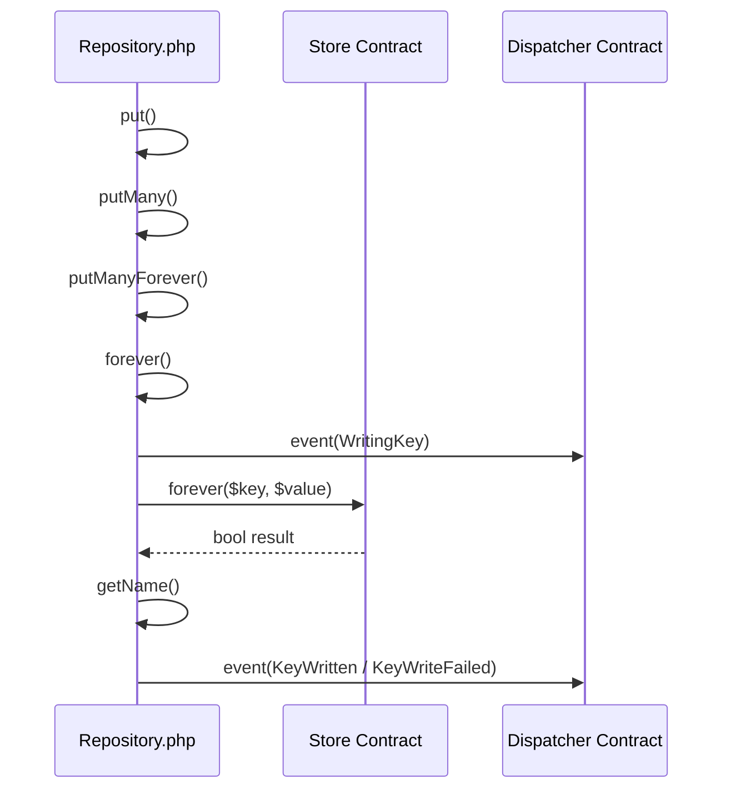
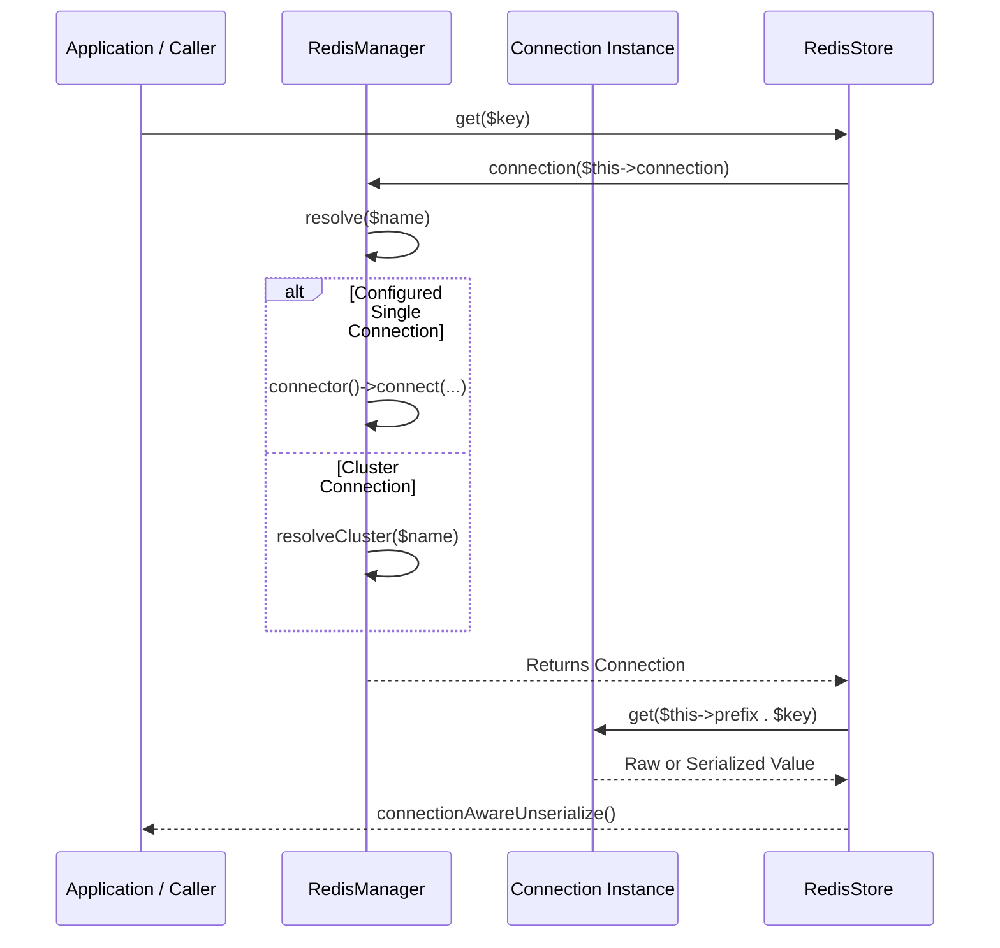

# Cache Storage Backends

<details>
<summary>Relevant source files</summary>

The following files were used as context for generating this wiki page:

- [src/Illuminate/Cache/CacheManager.php](https://github.com/laravel/framework/blob/main/src/Illuminate/Cache/CacheManager.php)
- [src/Illuminate/Cache/Repository.php](https://github.com/laravel/framework/blob/main/src/Illuminate/Cache/Repository.php)
- [src/Illuminate/Support/Facades/Cache.php](https://github.com/laravel/framework/blob/main/src/Illuminate/Support/Facades/Cache.php)
- [src/Illuminate/Queue/QueueServiceProvider.php](https://github.com/laravel/framework/blob/main/src/Illuminate/Queue/QueueServiceProvider.php)
- [src/Illuminate/Foundation/Application.php](https://github.com/laravel/framework/blob/main/src/Illuminate/Foundation/Application.php)
- [src/Illuminate/Session/SessionManager.php](https://github.com/laravel/framework/blob/main/src/Illuminate/Session/SessionManager.php)
- [src/Illuminate/Redis/RedisManager.php](https://github.com/laravel/framework/blob/main/src/Illuminate/Redis/RedisManager.php)
- [src/Illuminate/Cache/StorageStore.php](https://github.com/laravel/framework/blob/main/src/Illuminate/Cache/StorageStore.php)
- [config/cache.php](https://github.com/laravel/framework/blob/main/config/cache.php)
- [src/Illuminate/Support/Manager.php](https://github.com/laravel/framework/blob/main/src/Illuminate/Support/Manager.php)
- [src/Illuminate/Cache/FailoverStore.php](https://github.com/laravel/framework/blob/main/src/Illuminate/Cache/FailoverStore.php)
- [src/Illuminate/Cache/CacheServiceProvider.php](https://github.com/laravel/framework/blob/main/src/Illuminate/Cache/CacheServiceProvider.php)
- [src/Illuminate/Log/LogManager.php](https://github.com/laravel/framework/blob/main/src/Illuminate/Log/LogManager.php)
- [src/Illuminate/Cache/RedisStore.php](https://github.com/laravel/framework/blob/main/src/Illuminate/Cache/RedisStore.php)
- [src/Illuminate/Cache/MemcachedStore.php](https://github.com/laravel/framework/blob/main/src/Illuminate/Cache/MemcachedStore.php)
</details>

## Overview

The cache storage subsystem in Laravel provides a unified, highly extensible caching architecture designed to manage distributed key-value data, atomic locks, and event-driven persistence across diverse storage engines. At its core, the [`CacheServiceProvider`](https://github.com/laravel/framework/blob/main/src/Illuminate/Cache/CacheServiceProvider.php#L16-L39) registers the central [`CacheManager`](https://github.com/laravel/framework/blob/main/src/Illuminate/Cache/CacheManager.php#L24-L602) singleton within the application container, leveraging configuration definitions from [`config/cache.php`](https://github.com/laravel/framework/blob/main/config/cache.php#L1-L128) to resolve and instantiate drivers dynamically via [`Manager`](https://github.com/laravel/framework/blob/main/src/Illuminate/Support/Manager.php#L11-L200) inheritance. Underlying storage drivers—ranging from high-performance memory engines like [`RedisStore`](https://github.com/laravel/framework/blob/main/src/Illuminate/Cache/RedisStore.php#L16-L581) and [`MemcachedStore`](https://github.com/laravel/framework/blob/main/src/Illuminate/Cache/MemcachedStore.php#L10-L48) to file-based and multi-store [`FailoverStore`](https://github.com/laravel/framework/blob/main/src/Illuminate/Cache/FailoverStore.php#L12-L286) mechanisms—are wrapped by the [`Repository`](https://github.com/laravel/framework/blob/main/src/Illuminate/Cache/Repository.php#L44-L1088) decorator. This design decouples low-level byte serialization, connection routing, and fault tolerance from high-level application operations while standardizing TTL calculations, atomic locking, and comprehensive cache lifecycle event dispatching.

Sources: [config/cache.php:1-128](https://github.com/laravel/framework/blob/main/config/cache.php#L1-L128), [src/Illuminate/Cache/CacheManager.php:24-602](https://github.com/laravel/framework/blob/main/src/Illuminate/Cache/CacheManager.php#L24-L602), [src/Illuminate/Cache/CacheServiceProvider.php:16-39](https://github.com/laravel/framework/blob/main/src/Illuminate/Cache/CacheServiceProvider.php#L16-L39), [src/Illuminate/Cache/FailoverStore.php:12-286](https://github.com/laravel/framework/blob/main/src/Illuminate/Cache/FailoverStore.php#L12-L286), [src/Illuminate/Cache/MemcachedStore.php:10-48](https://github.com/laravel/framework/blob/main/src/Illuminate/Cache/MemcachedStore.php#L10-L48), [src/Illuminate/Cache/RedisStore.php:16-581](https://github.com/laravel/framework/blob/main/src/Illuminate/Cache/RedisStore.php#L16-L581), [src/Illuminate/Cache/Repository.php:44-1088](https://github.com/laravel/framework/blob/main/src/Illuminate/Cache/Repository.php#L44-L1088), [src/Illuminate/Support/Manager.php:11-200](https://github.com/laravel/framework/blob/main/src/Illuminate/Support/Manager.php#L11-L200)

## Service Provider Initialization

### Overview

The cache subsystem initializes through [`CacheServiceProvider`](https://github.com/laravel/framework/blob/main/src/Illuminate/Cache/CacheServiceProvider.php#L9-L52), which implements [`DeferrableProvider`](https://github.com/laravel/framework/blob/main/src/Illuminate/Contracts/Support/DeferrableProvider.php) to defer container bindings until explicitly resolved. During the registration phase, the service provider defines singleton bindings that construct core cache managers, default stores, adapters, connectors, and rate limiters within the container.

Sources: [src/Illuminate/Cache/CacheServiceProvider.php:9-52](https://github.com/laravel/framework/blob/main/src/Illuminate/Cache/CacheServiceProvider.php#L9-L52)

### Container Bindings and Provided Services

The [`CacheServiceProvider`](https://github.com/laravel/framework/blob/main/src/Illuminate/Cache/CacheServiceProvider.php#L9-L52) registers five distinct singleton bindings in the application container and exposes them through its [`provides()`](https://github.com/laravel/framework/blob/main/src/Illuminate/Cache/CacheServiceProvider.php#L46-L51) method. 

| Abstract Key / Class | Implementation Factory | Purpose |
| :--- | :--- | :--- |
| `cache` | `fn ($app) => new CacheManager($app)` | Resolves the primary [`CacheManager`](https://github.com/laravel/framework/blob/main/src/Illuminate/Cache/CacheManager.php#L24-L602) instance. |
| `cache.store` | `fn ($app) => $app['cache']->driver()` | Resolves the default configured cache repository driver instance. |
| `cache.psr6` | `fn ($app) => new Psr16Adapter($app['cache.store'])` | Wraps the default cache store in a PSR-16 adapter for PSR-6/PSR-16 compatibility. |
| `memcached.connector` | `fn () => new MemcachedConnector` | Instantiates the connector responsible for building Memcached server connections. |
| [`RateLimiter::class`](https://github.com/laravel/framework/blob/main/src/Illuminate/Cache/RateLimiter.php) | `fn ($app) => new RateLimiter(...)` | Builds a rate limiter instance utilizing the configured cache limiter driver. |

Sources: [src/Illuminate/Cache/CacheServiceProvider.php:16-51](https://github.com/laravel/framework/blob/main/src/Illuminate/Cache/CacheServiceProvider.php#L16-L51)

> [!NOTE]
> Because [`CacheServiceProvider`](https://github.com/laravel/framework/blob/main/src/Illuminate/Cache/CacheServiceProvider.php#L9-L52) implements [`DeferrableProvider`](https://github.com/laravel/framework/blob/main/src/Illuminate/Contracts/Support/DeferrableProvider.php), none of these container closures execute until an application request explicitly requests one of the services returned by [`provides()`](https://github.com/laravel/framework/blob/main/src/Illuminate/Cache/CacheServiceProvider.php#L46-L51).

Sources: [src/Illuminate/Cache/CacheServiceProvider.php:5-51](https://github.com/laravel/framework/blob/main/src/Illuminate/Cache/CacheServiceProvider.php#L5-L51)

### Core Container Aliases

To facilitate type-hinting and facade resolution, the application container maps core cache abstract keys to their respective implementation classes and PSR contracts during base initialization in [`Application::registerCoreContainerAliases()`](https://github.com/laravel/framework/blob/main/src/Illuminate/Foundation/Application.php#L1643-L1691).

```php
'cache' => [\Illuminate\Cache\CacheManager::class, \Illuminate\Contracts\Cache\Factory::class],
'cache.store' => [\Illuminate\Cache\Repository::class, \Illuminate\Contracts\Cache\Repository::class, \Psr\SimpleCache\CacheInterface::class],
'cache.psr6' => [\Symfony\Component\Cache\Adapter\Psr16Adapter::class, \Symfony\Component\Cache\Adapter\AdapterInterface::class, \Psr\Cache\CacheItemPoolInterface::class],
```

Sources: [src/Illuminate/Foundation/Application.php:1652-1654](https://github.com/laravel/framework/blob/main/src/Illuminate/Foundation/Application.php#L1652-L1654)

> [!TIP]
> Developers can type-hint [`Illuminate\Contracts\Cache\Factory`](https://github.com/laravel/framework/blob/main/src/Illuminate/Contracts/Cache/Factory.php) to receive the `cache` manager singleton or [`Illuminate\Contracts\Cache\Repository`](https://github.com/laravel/framework/blob/main/src/Illuminate/Contracts/Cache/Repository.php) to receive the default `cache.store` repository wrapper directly via automatic container dependency injection.

Sources: [src/Illuminate/Foundation/Application.php:1652-1653](https://github.com/laravel/framework/blob/main/src/Illuminate/Foundation/Application.php#L1652-L1653)

## Cache Manager Driver Architecture

### Overview

The [`CacheManager`](https://github.com/laravel/framework/blob/main/src/Illuminate/Cache/CacheManager.php#L24-L602) class acts as the central factory and registry for all cache stores defined within an application. Implementing [`FactoryContract`](https://github.com/laravel/framework/blob/main/src/Illuminate/Contracts/Cache/Factory.php), it processes configuration arrays, manages driver instances, and dynamically routes cache calls. Although it shares conceptual design patterns with Illuminate's abstract [`Manager`](https://github.com/laravel/framework/blob/main/src/Illuminate/Support/Manager.php#L11-L200), [`CacheManager`](https://github.com/laravel/framework/blob/main/src/Illuminate/Cache/CacheManager.php#L24-L602) implements its own resolution lifecycle to wrap raw stores inside decorated [`Repository`](https://github.com/laravel/framework/blob/main/src/Illuminate/Cache/Repository.php#L44-L1088) instances.

Sources: [src/Illuminate/Cache/CacheManager.php:20-70](https://github.com/laravel/framework/blob/main/src/Illuminate/Cache/CacheManager.php#L20-L70), [src/Illuminate/Support/Manager.php:11-15](https://github.com/laravel/framework/blob/main/src/Illuminate/Support/Manager.php#L11-L15)

### Store Resolution and Driver Call-Chain

When application code requests a store via `Cache::store($name)`, [`CacheManager`](https://github.com/laravel/framework/blob/main/src/Illuminate/Cache/CacheManager.php#L65-L70) executes a precise multi-step initialization path. The resolution sequence proceeds as follows:

1. [`store()`](https://github.com/laravel/framework/blob/main/src/Illuminate/Cache/CacheManager.php#L65-L70) unwraps any provided enum via `enum_value($name)` or falls back to [`getDefaultDriver()`](https://github.com/laravel/framework/blob/main/src/Illuminate/Cache/CacheManager.php#L494-L497).
2. It checks the local `$stores` array memoization cache (`$this->stores[$name] ??= $this->resolve($name)`).
3. If missing, [`resolve($name)`](https://github.com/laravel/framework/blob/main/src/Illuminate/Cache/CacheManager.php#L116-L127) calls [`getConfig($name)`](https://github.com/laravel/framework/blob/main/src/Illuminate/Cache/CacheManager.php#L482-L487) to fetch configuration settings from the container's config repository under `cache.stores.{$name}`.
4. If the configuration is null, an [`InvalidArgumentException`](https://github.com/laravel/framework/blob/main/src/Illuminate/Cache/CacheManager.php#L121) is thrown; otherwise, `Arr::add($config, 'store', $name)` injects the store name.
5. [`build($config)`](https://github.com/laravel/framework/blob/main/src/Illuminate/Cache/CacheManager.php#L137-L152) inspects whether a custom creator closure is registered in `$this->customCreators[$config['driver']]`, invoking [`callCustomCreator($config)`](https://github.com/laravel/framework/blob/main/src/Illuminate/Cache/CacheManager.php#L160-L163) if present.
6. If no custom creator exists, it builds the dynamic method name `'create'.ucfirst($config['driver']).'Driver'` (e.g., [`createRedisDriver($config)`](https://github.com/laravel/framework/blob/main/src/Illuminate/Cache/CacheManager.php#L357-L374)), validates its existence via `method_exists`, and invokes it to instantiate the underlying store.
7. Finally, the instantiated driver store is passed to [`repository($store, $config)`](https://github.com/laravel/framework/blob/main/src/Illuminate/Cache/CacheManager.php#L418-L425), which wraps it in a [`Repository`](https://github.com/laravel/framework/blob/main/src/Illuminate/Cache/Repository.php#L44-L1088) instance, optionally registers event dispatchers, and returns it to the caller.

Sources: [src/Illuminate/Cache/CacheManager.php:65-152](https://github.com/laravel/framework/blob/main/src/Illuminate/Cache/CacheManager.php#L65-L152), [src/Illuminate/Cache/CacheManager.php:357-374](https://github.com/laravel/framework/blob/main/src/Illuminate/Cache/CacheManager.php#L357-L374), [src/Illuminate/Cache/CacheManager.php:418-425](https://github.com/laravel/framework/blob/main/src/Illuminate/Cache/CacheManager.php#L418-L425)

> [!NOTE]
> The special store name `'null'` bypasses configuration lookup entirely in [`getConfig($name)`](https://github.com/laravel/framework/blob/main/src/Illuminate/Cache/CacheManager.php#L482-L487), returning a hardcoded `['driver' => 'null']` array to instantiate a [`NullStore`](https://github.com/laravel/framework/blob/main/src/Illuminate/Cache/NullStore.php) without requiring an explicit definition in `config/cache.php`.

Sources: [src/Illuminate/Cache/CacheManager.php:482-487](https://github.com/laravel/framework/blob/main/src/Illuminate/Cache/CacheManager.php#L482-L487)

### Configuration and Supported Drivers

The framework defines comprehensive default configurations in [`config/cache.php`](https://github.com/laravel/framework/blob/main/config/cache.php#L5-L113), establishing parameters for all built-in persistence drivers.

| Driver Identifier | Configuration Key | Instantiation Method | Key Properties / Default Options |
| :--- | :--- | :--- | :--- |
| `array` | `array` | [`createArrayDriver()`](https://github.com/laravel/framework/blob/main/src/Illuminate/Cache/CacheManager.php#L184-L190) | `'serialize' => false` |
| `session` | `session` | [`createSessionDriver()`](https://github.com/laravel/framework/blob/main/src/Illuminate/Cache/CacheManager.php#L382-L391) | `'key' => env('SESSION_CACHE_KEY', '_cache')` |
| `database` | `database` | [`createDatabaseDriver()`](https://github.com/laravel/framework/blob/main/src/Illuminate/Cache/CacheManager.php#L198-L218) | `'table' => 'cache'`, `'lock_table' => 'cache_locks'`, `'lock_timeout' => 86400` |
| `file` | `file` | [`createFileDriver()`](https://github.com/laravel/framework/blob/main/src/Illuminate/Cache/CacheManager.php#L291-L303) | `'path' => storage_path('framework/cache/data')` |
| `storage` | `storage` | [`createStorageDriver()`](https://github.com/laravel/framework/blob/main/src/Illuminate/Cache/CacheManager.php#L311-L319) | `'disk' => env('CACHE_STORAGE_DISK')`, `'path' => 'framework/cache/data'` |
| `memcached` | `memcached` | [`createMemcachedDriver()`](https://github.com/laravel/framework/blob/main/src/Illuminate/Cache/CacheManager.php#L327-L339) | Server host, port, weight, SASL credentials, persistent ID |
| `redis` | `redis` | [`createRedisDriver()`](https://github.com/laravel/framework/blob/main/src/Illuminate/Cache/CacheManager.php#L357-L374) | `'connection' => 'cache'`, `'lock_connection' => 'default'` |
| `dynamodb` | `dynamodb` | [`createDynamodbDriver()`](https://github.com/laravel/framework/blob/main/src/Illuminate/Cache/CacheManager.php#L226-L242) | `'region' => 'us-east-1'`, `'table' => 'cache'`, attribute mappings |
| `failover` | `failover` | [`createFailoverDriver()`](https://github.com/laravel/framework/blob/main/src/Illuminate/Cache/CacheManager.php#L276-L283) | Array of fallback store identifiers |
| `null` | N/A | [`createNullDriver()`](https://github.com/laravel/framework/blob/main/src/Illuminate/Cache/CacheManager.php#L346-L349) | Instantiates [`NullStore`](https://github.com/laravel/framework/blob/main/src/Illuminate/Cache/NullStore.php) directly without config |

Sources: [src/Illuminate/Cache/CacheManager.php:171-391](https://github.com/laravel/framework/blob/main/src/Illuminate/Cache/CacheManager.php#L171-L391), [config/cache.php:35-113](https://github.com/laravel/framework/blob/main/config/cache.php#L35-L113)

> [!WARNING]
> When defining custom drivers via [`extend($driver, Closure $callback)`](https://github.com/laravel/framework/blob/main/src/Illuminate/Cache/CacheManager.php#L554-L565), [`CacheManager`](https://github.com/laravel/framework/blob/main/src/Illuminate/Cache/CacheManager.php#L24-L602) passes the application container instance and store configuration array to the closure (`$callback($this->app, $config)`), differing from standard container callback signatures.

Sources: [src/Illuminate/Cache/CacheManager.php:160-163](https://github.com/laravel/framework/blob/main/src/Illuminate/Cache/CacheManager.php#L160-L163), [src/Illuminate/Cache/CacheManager.php:554-565](https://github.com/laravel/framework/blob/main/src/Illuminate/Cache/CacheManager.php#L554-L565)

## Repository Wrapper and Event Operations

### Repository Wrapper Overview

The [`Repository`](https://github.com/laravel/framework/blob/main/src/Illuminate/Cache/Repository.php#L44-L1088) class acts as a decorator implementing [`CacheContract`](https://github.com/laravel/framework/blob/main/src/Illuminate/Cache/Repository.php#L29) and [`ArrayAccess`](https://github.com/laravel/framework/blob/main/src/Illuminate/Cache/Repository.php#L44), wrapping an underlying [`Store`](https://github.com/laravel/framework/blob/main/src/Illuminate/Cache/Repository.php#L30) implementation. It handles high-level concerns such as data type validation, TTL calculations, array-based batch operations, macro handling via [`Macroable`](https://github.com/laravel/framework/blob/main/src/Illuminate/Cache/Repository.php#L46), and event emission through the [`Dispatcher`](https://github.com/laravel/framework/blob/main/src/Illuminate/Cache/Repository.php#L31) contract.

Sources: [src/Illuminate/Cache/Repository.php:5-48](https://github.com/laravel/framework/blob/main/src/Illuminate/Cache/Repository.php#L5-L48)

### Operation Call-Chain Walkthrough (`Put -> Event`)

When storing cache values, execution flows through the verified call chain: `put` → `putMany` → `putManyForever` → `forever` → `event`. 

1. [`put()`](https://github.com/laravel/framework/blob/main/src/Illuminate/Cache/Repository.php#L356-L385): Entry point accepting a key, value, and TTL. If `$key` is an array, it delegates to [`putMany()`](https://github.com/laravel/framework/blob/main/src/Illuminate/Cache/Repository.php#L405-L430). If `$ttl` is null, it invokes [`forever()`](https://github.com/laravel/framework/blob/main/src/Illuminate/Cache/Repository.php#L530-L545). Otherwise, it parses seconds via [`getSeconds()`](https://github.com/laravel/framework/blob/main/src/Illuminate/Cache/Repository.php#L893-L904), fires the [`WritingKey`](https://github.com/laravel/framework/blob/main/src/Illuminate/Cache/Repository.php#L24) event via [`event()`](https://github.com/laravel/framework/blob/main/src/Illuminate/Cache/Repository.php#L985-L988), and persists the item.
Sources: [src/Illuminate/Cache/Repository.php:356-385](https://github.com/laravel/framework/blob/main/src/Illuminate/Cache/Repository.php#L356-L385)

2. [`putMany()`](https://github.com/laravel/framework/blob/main/src/Illuminate/Cache/Repository.php#L405-L430): Handles batch writes. If `$ttl` is null, it delegates to [`putManyForever()`](https://github.com/laravel/framework/blob/main/src/Illuminate/Cache/Repository.php#L437-L448); otherwise, it parses seconds, dispatches writing events, and invokes store batch persistence.
Sources: [src/Illuminate/Cache/Repository.php:405-430](https://github.com/laravel/framework/blob/main/src/Illuminate/Cache/Repository.php#L405-L430)

3. [`putManyForever()`](https://github.com/laravel/framework/blob/main/src/Illuminate/Cache/Repository.php#L437-L448): Iterates over batch values and delegates each item to [`forever()`](https://github.com/laravel/framework/blob/main/src/Illuminate/Cache/Repository.php#L530-L545).
Sources: [src/Illuminate/Cache/Repository.php:437-448](https://github.com/laravel/framework/blob/main/src/Illuminate/Cache/Repository.php#L437-L448)

4. [`forever()`](https://github.com/laravel/framework/blob/main/src/Illuminate/Cache/Repository.php#L530-L545): Unwraps enum keys, dispatches a [`WritingKey`](https://github.com/laravel/framework/blob/main/src/Illuminate/Cache/Repository.php#L24) event via [`event()`](https://github.com/laravel/framework/blob/main/src/Illuminate/Cache/Repository.php#L985-L988), calls [`store->forever()`](https://github.com/laravel/framework/blob/main/src/Illuminate/Contracts/Cache/Store.php), queries [`getName()`](https://github.com/laravel/framework/blob/main/src/Illuminate/Cache/Repository.php#L910-L913), and dispatches [`KeyWritten`](https://github.com/laravel/framework/blob/main/src/Illuminate/Cache/Repository.php#L21) or [`KeyWriteFailed`](https://github.com/laravel/framework/blob/main/src/Illuminate/Cache/Repository.php#L20).
Sources: [src/Illuminate/Cache/Repository.php:530-545](https://github.com/laravel/framework/blob/main/src/Illuminate/Cache/Repository.php#L530-L545), [src/Illuminate/Cache/Repository.php:910-913](https://github.com/laravel/framework/blob/main/src/Illuminate/Cache/Repository.php#L910-L913), [src/Illuminate/Cache/Repository.php:985-988](https://github.com/laravel/framework/blob/main/src/Illuminate/Cache/Repository.php#L985-L988)

5. [`event()`](https://github.com/laravel/framework/blob/main/src/Illuminate/Cache/Repository.php#L985-L988): Dispatches the constructed event object to the optional event dispatcher instance (`$this->events?->dispatch($event)`).
Sources: [src/Illuminate/Cache/Repository.php:985-988](https://github.com/laravel/framework/blob/main/src/Illuminate/Cache/Repository.php#L985-L988)


Sources: [src/Illuminate/Cache/Repository.php:356-545](https://github.com/laravel/framework/blob/main/src/Illuminate/Cache/Repository.php#L356-L545), [src/Illuminate/Cache/Repository.php:910-988](https://github.com/laravel/framework/blob/main/src/Illuminate/Cache/Repository.php#L910-L988)

### Event Dispatching Architecture

The repository emits fine-grained lifecycle events for cache reads, writes, deletions, and flush operations.

| Event Class | Trigger Method | Description |
| :--- | :--- | :--- |
| [`RetrievingKey`](https://github.com/laravel/framework/blob/main/src/Illuminate/Cache/Events/RetrievingKey.php) | [`get()`](https://github.com/laravel/framework/blob/main/src/Illuminate/Cache/Repository.php#L128-L154) | Dispatched immediately before fetching a single key from the store. |
| [`CacheMissed`](https://github.com/laravel/framework/blob/main/src/Illuminate/Cache/Events/CacheMissed.php) | [`get()`](https://github.com/laravel/framework/blob/main/src/Illuminate/Cache/Repository.php#L128-L154), [`handleManyResult()`](https://github.com/laravel/framework/blob/main/src/Illuminate/Cache/Repository.php#L200-L219) | Dispatched when a requested key yields a null value. |
| [`CacheHit`](https://github.com/laravel/framework/blob/main/src/Illuminate/Cache/Events/CacheHit.php) | [`get()`](https://github.com/laravel/framework/blob/main/src/Illuminate/Cache/Repository.php#L128-L154), [`handleManyResult()`](https://github.com/laravel/framework/blob/main/src/Illuminate/Cache/Repository.php#L200-L219) | Dispatched when a requested key successfully returns a stored value. |
| [`WritingKey`](https://github.com/laravel/framework/blob/main/src/Illuminate/Cache/Events/WritingKey.php) | [`put()`](https://github.com/laravel/framework/blob/main/src/Illuminate/Cache/Repository.php#L356-L385), [`forever()`](https://github.com/laravel/framework/blob/main/src/Illuminate/Cache/Repository.php#L530-L545) | Dispatched before writing or updating an item in the store. |
| [`KeyWritten`](https://github.com/laravel/framework/blob/main/src/Illuminate/Cache/Events/KeyWritten.php) | [`put()`](https://github.com/laravel/framework/blob/main/src/Illuminate/Cache/Repository.php#L356-L385), [`forever()`](https://github.com/laravel/framework/blob/main/src/Illuminate/Cache/Repository.php#L530-L545) | Dispatched after a cache write operation succeeds. |
| [`KeyWriteFailed`](https://github.com/laravel/framework/blob/main/src/Illuminate/Cache/Events/KeyWriteFailed.php) | [`put()`](https://github.com/laravel/framework/blob/main/src/Illuminate/Cache/Repository.php#L356-L385), [`forever()`](https://github.com/laravel/framework/blob/main/src/Illuminate/Cache/Repository.php#L530-L545) | Dispatched when a cache write operation fails. |
| [`ForgettingKey`](https://github.com/laravel/framework/blob/main/src/Illuminate/Cache/Events/ForgettingKey.php) | [`forget()`](https://github.com/laravel/framework/blob/main/src/Illuminate/Cache/Repository.php#L744-L757) | Dispatched before removing an item from the store. |
| [`CacheFlushing`](https://github.com/laravel/framework/blob/main/src/Illuminate/Cache/Events/CacheFlushing.php) | [`clear()`](https://github.com/laravel/framework/blob/main/src/Illuminate/Cache/Repository.php#L788-L801) | Dispatched before clearing all items from the cache store. |
| [`CacheFlushed`](https://github.com/laravel/framework/blob/main/src/Illuminate/Cache/Events/CacheFlushed.php) | [`clear()`](https://github.com/laravel/framework/blob/main/src/Illuminate/Cache/Repository.php#L788-L801) | Dispatched after successfully flushing the cache store. |

Sources: [src/Illuminate/Cache/Repository.php:128-154](https://github.com/laravel/framework/blob/main/src/Illuminate/Cache/Repository.php#L128-L154), [src/Illuminate/Cache/Repository.php:200-219](https://github.com/laravel/framework/blob/main/src/Illuminate/Cache/Repository.php#L200-L219), [src/Illuminate/Cache/Repository.php:356-385](https://github.com/laravel/framework/blob/main/src/Illuminate/Cache/Repository.php#L356-L385), [src/Illuminate/Cache/Repository.php:530-545](https://github.com/laravel/framework/blob/main/src/Illuminate/Cache/Repository.php#L530-L545), [src/Illuminate/Cache/Repository.php:744-757](https://github.com/laravel/framework/blob/main/src/Illuminate/Cache/Repository.php#L744-L757), [src/Illuminate/Cache/Repository.php:788-801](https://github.com/laravel/framework/blob/main/src/Illuminate/Cache/Repository.php#L788-L801)

> [!NOTE]
> When passing zero or negative TTL values to [`put()`](https://github.com/laravel/framework/blob/main/src/Illuminate/Cache/Repository.php#L356-L385), execution short-circuits to [`forget()`](https://github.com/laravel/framework/blob/main/src/Illuminate/Cache/Repository.php#L744-L757) rather than invoking the store's write methods.

Sources: [src/Illuminate/Cache/Repository.php:371-373](https://github.com/laravel/framework/blob/main/src/Illuminate/Cache/Repository.php#L371-L373)

### Repository Design Trade-Offs

| Design Choice | Benefit | Cost |
| :--- | :--- | :--- |
| **Decorator Pattern over Inheritance** | Allows wrapping any [`Store`](https://github.com/laravel/framework/blob/main/src/Illuminate/Contracts/Cache/Store.php) implementation uniformly without altering driver internals. | Adds an extra method invocation layer for every cache operation. |
| **Dynamic Method Forwarding via `__call`** | Exposes store-specific driver methods transparently through [`Repository`](https://github.com/laravel/framework/blob/main/src/Illuminate/Cache/Repository.php#L1070-L1077). | Bypasses static analysis type hinting unless interfaces are explicitly implemented or mixed in via `@mixin`. |
| **Automatic Enum Value Resolution** | Converts [`UnitEnum`](https://github.com/laravel/framework/blob/main/src/Illuminate/Cache/Repository.php#L104) instances to scalar values automatically via [`enum_value()`](https://github.com/laravel/framework/blob/main/src/Illuminate/Cache/Repository.php#L134). | Slight runtime overhead checking and converting enum instances on key inputs. |

Sources: [src/Illuminate/Cache/Repository.php:42-48](https://github.com/laravel/framework/blob/main/src/Illuminate/Cache/Repository.php#L42-L48), [src/Illuminate/Cache/Repository.php:134-135](https://github.com/laravel/framework/blob/main/src/Illuminate/Cache/Repository.php#L134-L135), [src/Illuminate/Cache/Repository.php:1070-1077](https://github.com/laravel/framework/blob/main/src/Illuminate/Cache/Repository.php#L1070-L1077)

### Worked Example: Type-Safe Retrieval and Flexible Caching

The following example demonstrates instantiating and interacting with a cache repository, utilizing type-safe getters and the background-refreshing [`flexible()`](https://github.com/laravel/framework/blob/main/src/Illuminate/Cache/Repository.php#L642-L682) method:

```php
use Illuminate\Cache\Repository;
use Illuminate\Cache\ArrayStore;

// Wrap an underlying store in the Repository decorator
$store = new ArrayStore();
$cache = new Repository($store, ['store' => 'array']);

// Store items using put()
$cache->put('user_id', 42, 60);
$cache->put('config_rate', 3.14, 60);

// Type-safe retrieval validating expected return types
$userId = $cache->integer('user_id'); // Returns integer 42
$rate = $cache->float('config_rate');   // Returns float 3.14

// Flexible caching: serves stale value immediately while deferring refresh in background
$data = $cache->flexible('expensive_report', [10, 60], function () {
    return computeExpensiveReport();
});
```

Sources: [src/Illuminate/Cache/Repository.php:93-99](https://github.com/laravel/framework/blob/main/src/Illuminate/Cache/Repository.php#L93-L99), [src/Illuminate/Cache/Repository.php:264-304](https://github.com/laravel/framework/blob/main/src/Illuminate/Cache/Repository.php#L264-L304), [src/Illuminate/Cache/Repository.php:642-682](https://github.com/laravel/framework/blob/main/src/Illuminate/Cache/Repository.php#L642-L682)

## Redis and Memcached Driver Integration

### Overview

The high-performance memory stores are backed by Redis and Memcached connections, managed via [`RedisManager`](https://github.com/laravel/framework/blob/main/src/Illuminate/Redis/RedisManager.php#L22-L289), [`RedisStore`](https://github.com/laravel/framework/blob/main/src/Illuminate/Cache/RedisStore.php#L16-L581), and [`MemcachedStore`](https://github.com/laravel/framework/blob/main/src/Illuminate/Cache/MemcachedStore.php#L10-L48). [`RedisManager`](https://github.com/laravel/framework/blob/main/src/Illuminate/Redis/RedisManager.php#L22-L289) implements [`Illuminate\Contracts\Redis\Factory`](https://github.com/laravel/framework/blob/main/src/Illuminate/Contracts/Redis/Factory.php) and coordinates client connectors such as [`PredisConnector`](https://github.com/laravel/framework/blob/main/src/Illuminate/Redis/RedisManager.php#L174) and [`PhpRedisConnector`](https://github.com/laravel/framework/blob/main/src/Illuminate/Redis/RedisManager.php#L175).

Sources: [src/Illuminate/Redis/RedisManager.php:6-23](https://github.com/laravel/framework/blob/main/src/Illuminate/Redis/RedisManager.php#L6-L23), [src/Illuminate/Redis/RedisManager.php:173-177](https://github.com/laravel/framework/blob/main/src/Illuminate/Redis/RedisManager.php#L173-L177), [src/Illuminate/Cache/RedisStore.php:16-17](https://github.com/laravel/framework/blob/main/src/Illuminate/Cache/RedisStore.php#L16-L17), [src/Illuminate/Cache/MemcachedStore.php:10-11](https://github.com/laravel/framework/blob/main/src/Illuminate/Cache/MemcachedStore.php#L10-L11)

### Redis Connection Resolution & Command Flow

When interacting with Redis stores, connection retrieval follows a specific resolution path through [`RedisManager::connection()`](https://github.com/laravel/framework/blob/main/src/Illuminate/Redis/RedisManager.php#L88-L95) before commands execute on [`RedisStore`](https://github.com/laravel/framework/blob/main/src/Illuminate/Cache/RedisStore.php#L16-L581).



Sources: [src/Illuminate/Redis/RedisManager.php:88-140](https://github.com/laravel/framework/blob/main/src/Illuminate/Redis/RedisManager.php#L88-L140), [src/Illuminate/Cache/RedisStore.php:80-87](https://github.com/laravel/framework/blob/main/src/Illuminate/Cache/RedisStore.php#L80-L87)

### Redis Driver and Connection Matrix

[`RedisManager`](https://github.com/laravel/framework/blob/main/src/Illuminate/Redis/RedisManager.php#L22-L289) supports distinct underlying driver configurations and connection implementations.

| Driver Name | Connector Class | Connection Types Supported | Purpose & Capabilities |
| :--- | :--- | :--- | :--- |
| **`predis`** | [`PredisConnector`](https://github.com/laravel/framework/blob/main/src/Illuminate/Redis/RedisManager.php#L174) | [`PredisConnection`](https://github.com/laravel/framework/blob/main/src/Illuminate/Redis/Connections/PredisConnection.php), [`PredisClusterConnection`](https://github.com/laravel/framework/blob/main/src/Illuminate/Redis/Connections/PredisClusterConnection.php) | Pure PHP Redis client supporting TCP/TLS schemes and cluster hashing. |
| **`phpredis`** | [`PhpRedisConnector`](https://github.com/laravel/framework/blob/main/src/Illuminate/Redis/RedisManager.php#L175) | [`PhpRedisConnection`](https://github.com/laravel/framework/blob/main/src/Illuminate/Redis/Connections/PhpRedisConnection.php), [`PhpRedisClusterConnection`](https://github.com/laravel/framework/blob/main/src/Illuminate/Redis/Connections/PhpRedisClusterConnection.php) | C-extension backed Redis client supporting native serialization and compression. |

Sources: [src/Illuminate/Redis/RedisManager.php:173-178](https://github.com/laravel/framework/blob/main/src/Illuminate/Redis/RedisManager.php#L173-L178), [src/Illuminate/Cache/RedisStore.php:8-11](https://github.com/laravel/framework/blob/main/src/Illuminate/Cache/RedisStore.php#L8-L11)

> [!WARNING]
> [`PredisClusterConnection`](https://github.com/laravel/framework/blob/main/src/Illuminate/Redis/Connections/PredisClusterConnection.php) and [`PhpRedisClusterConnection`](https://github.com/laravel/framework/blob/main/src/Illuminate/Redis/Connections/PhpRedisClusterConnection.php) do not support multi-key read/write commands (like `mget` or multi-key `putMany`) if keys hash to different cluster slots; [`RedisStore`](https://github.com/laravel/framework/blob/main/src/Illuminate/Cache/RedisStore.php#L16-L581) automatically falls back to alias iteration methods in these cases.

Sources: [src/Illuminate/Cache/RedisStore.php:107-110](https://github.com/laravel/framework/blob/main/src/Illuminate/Cache/RedisStore.php#L107-L110), [src/Illuminate/Cache/RedisStore.php:151-155](https://github.com/laravel/framework/blob/main/src/Illuminate/Cache/RedisStore.php#L151-L155)

### Memcached Version Detection & Tag Scanning

[`MemcachedStore`](https://github.com/laravel/framework/blob/main/src/Illuminate/Cache/MemcachedStore.php#L10-L48) inspects the number of parameters on `Memcached::getMulti()` during construction via [`ReflectionMethod`](https://github.com/laravel/framework/blob/main/src/Illuminate/Cache/MemcachedStore.php#L8) to establish whether Memcached version 3.0.0 or greater is active.

```php
$this->onVersionThree = (new ReflectionMethod('Memcached', 'getMulti'))
    ->getNumberOfParameters() == 2;
```

Sources: [src/Illuminate/Cache/MemcachedStore.php:46-48](https://github.com/laravel/framework/blob/main/src/Illuminate/Cache/MemcachedStore.php#L46-L48)

Similarly, [`RedisStore::currentTags()`](https://github.com/laravel/framework/blob/main/src/Illuminate/Cache/RedisStore.php#L352-L400) determines the default cursor value based on the underlying driver and PHP Redis extension version:

```php
$defaultCursorValue = match (true) {
    $connection instanceof PhpRedisConnection && version_compare(phpversion('redis'), '6.1.0', '>=') => null,
    default => '0',
};
```

Sources: [src/Illuminate/Cache/RedisStore.php:363-366](https://github.com/laravel/framework/blob/main/src/Illuminate/Cache/RedisStore.php#L363-L366)

## Filesystem and Failover Cache Backends

### Overview

The framework provides specialized persistence backends that extend cache capabilities beyond pure in-memory systems. [`StorageStore`](https://github.com/laravel/framework/blob/main/src/Illuminate/Cache/StorageStore.php#L10-L322) implements a file-based storage engine utilizing local filesystem disks, while [`FailoverStore`](https://github.com/laravel/framework/blob/main/src/Illuminate/Cache/FailoverStore.php#L12-L286) orchestrates multi-store redundancy by executing actions across a sequence of backing caches with automatic failure recovery.

Sources: [src/Illuminate/Cache/StorageStore.php:10-322](https://github.com/laravel/framework/blob/main/src/Illuminate/Cache/StorageStore.php#L10-L322), [src/Illuminate/Cache/FailoverStore.php:12-286](https://github.com/laravel/framework/blob/main/src/Illuminate/Cache/FailoverStore.php#L12-L286)

### Filesystem Storage Backend

[`StorageStore`](https://github.com/laravel/framework/blob/main/src/Illuminate/Cache/StorageStore.php#L10-L322) relies on an injected [`Filesystem`](https://github.com/laravel/framework/blob/main/src/Illuminate/Contracts/Filesystem/Filesystem.php) disk and constructs file paths by computing the SHA-1 hash of the prefixed key and segmenting it into nested subdirectories:

```php
public function path($key)
{
    $parts = array_slice(str_split($hash = sha1($this->prefix.$key), 2), 0, 2);

    return trim($this->directory.'/'.implode('/', $parts).'/'.$hash, '/');
}
```

Sources: [src/Illuminate/Cache/StorageStore.php:45-56](https://github.com/laravel/framework/blob/main/src/Illuminate/Cache/StorageStore.php#L45-L56), [src/Illuminate/Cache/StorageStore.php:262-267](https://github.com/laravel/framework/blob/main/src/Illuminate/Cache/StorageStore.php#L262-L267)

When writing or updating cache entries via [`StorageStore::put()`](https://github.com/laravel/framework/blob/main/src/Illuminate/Cache/StorageStore.php#L77-L82), the engine prepends a 10-byte expiration timestamp to the serialized data payload. 

```php
public function put($key, $value, $seconds)
{
    return $this->disk->put(
        $this->path($key), $this->expiration($seconds).serialize($value)
    );
}
```

Sources: [src/Illuminate/Cache/StorageStore.php:77-82](https://github.com/laravel/framework/blob/main/src/Illuminate/Cache/StorageStore.php#L77-L82)

Retrieving values involves the internal `getPayload($key)` workflow, which enforces expiration checks and unserialization safety:

`getPayload()` call chain:
1. `StorageStore::get($key)` invokes `getPayload($key)` to read file contents from the disk.
2. Extracts the leading 10-character expiration timestamp via `substr($contents, 0, 10)`.
3. Compares the current timestamp against the expiration value (`$this->currentTime() >= $expire`). If expired, it triggers `$this->forget($key)` and returns an empty payload.
4. Unserializes the remaining payload data using `unserialize()` with optional `serializableClasses` constraints applied.

Sources: [src/Illuminate/Cache/StorageStore.php:64-67](https://github.com/laravel/framework/blob/main/src/Illuminate/Cache/StorageStore.php#L64-L67), [src/Illuminate/Cache/StorageStore.php:199-229](https://github.com/laravel/framework/blob/main/src/Illuminate/Cache/StorageStore.php#L199-L229)

> [!WARNING]
> If unserialization of cached file data throws an exception due to corruption or class mismatch, `getPayload()` automatically catches the exception, calls `$this->forget($key)` to purge the invalid file, and returns an empty payload.

Sources: [src/Illuminate/Cache/StorageStore.php:218-224](https://github.com/laravel/framework/blob/main/src/Illuminate/Cache/StorageStore.php#L218-L224)

### Multi-Store Failover Orchestration

[`FailoverStore`](https://github.com/laravel/framework/blob/main/src/Illuminate/Cache/FailoverStore.php#L12-L286) coordinates multiple backing cache repositories to ensure high availability. Every cache action delegates execution through `attemptOnAllStores()`, iterating sequentially through configured stores until a store succeeds without throwing an exception.

```php
protected function attemptOnAllStores(string $method, array $arguments)
{
    [$lastException, $failedCaches] = [null, []];

    try {
        foreach ($this->stores as $store) {
            try {
                return $this->store($store)->{$method}(...$arguments);
            } catch (Throwable $e) {
                $lastException = $e;

                $failedCaches[] = $store;

                if (! in_array($store, $this->failingCaches)) {
                    $this->events->dispatch(new CacheFailedOver($store, $e));
                }
            }
        }
    } finally {
        $this->failingCaches = $failedCaches;
    }

    throw $lastException ?? new RuntimeException('All failover cache stores failed.');
}
```

Sources: [src/Illuminate/Cache/FailoverStore.php:252-275](https://github.com/laravel/framework/blob/main/src/Illuminate/Cache/FailoverStore.php#L252-L275)

> [!NOTE]
> When a primary store encounters an error and triggers a failover, [`FailoverStore`](https://github.com/laravel/framework/blob/main/src/Illuminate/Cache/FailoverStore.php#L12-L286) dispatches a [`CacheFailedOver`](https://github.com/laravel/framework/blob/main/src/Illuminate/Cache/Events/CacheFailedOver.php) event containing the failing store name and the caught exception, suppressing duplicate events for stores already tracked in `$failingCaches`.

Sources: [src/Illuminate/Cache/FailoverStore.php:18-19](https://github.com/laravel/framework/blob/main/src/Illuminate/Cache/FailoverStore.php#L18-L19), [src/Illuminate/Cache/FailoverStore.php:265-267](https://github.com/laravel/framework/blob/main/src/Illuminate/Cache/FailoverStore.php#L265-L267)

## Related

- [[Cache Lock & Rate Limiting]]
- [[Redis Integration]]

