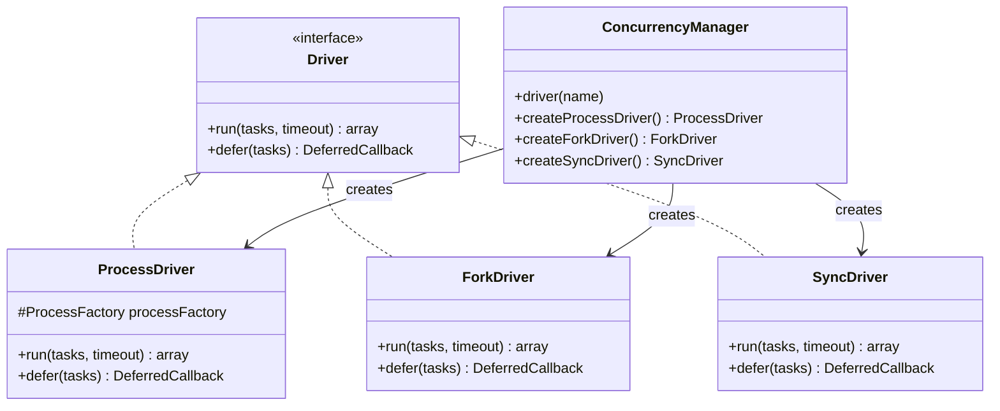
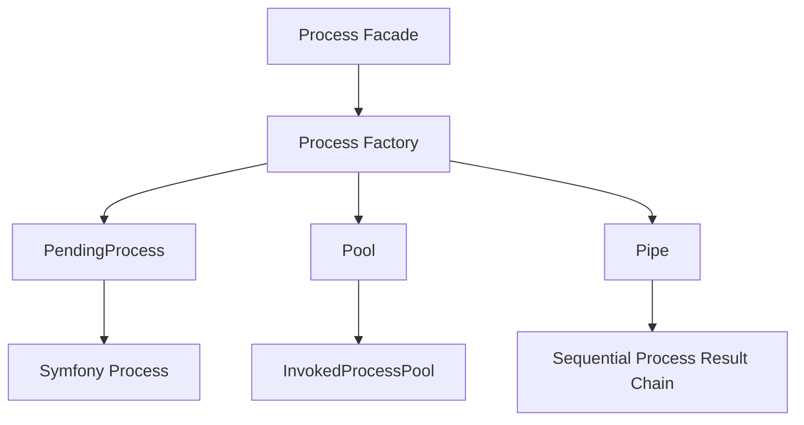
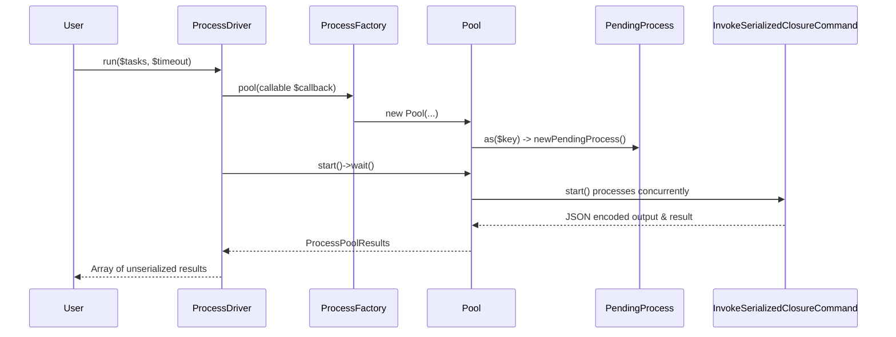

# Concurrency & Process Execution

<details>
<summary>Relevant source files</summary>

The following files were used as context for generating this wiki page:

- [src/Illuminate/Queue/Worker.php](https://github.com/laravel/framework/blob/main/src/Illuminate/Queue/Worker.php)
- [src/Illuminate/Foundation/Console/BroadcastingInstallCommand.php](https://github.com/laravel/framework/blob/main/src/Illuminate/Foundation/Console/BroadcastingInstallCommand.php)
- [src/Illuminate/Concurrency/ProcessDriver.php](https://github.com/laravel/framework/blob/main/src/Illuminate/Concurrency/ProcessDriver.php)
- [src/Illuminate/Console/Scheduling/ScheduleRunCommand.php](https://github.com/laravel/framework/blob/main/src/Illuminate/Console/Scheduling/ScheduleRunCommand.php)
- [src/Illuminate/Queue/Console/WorkCommand.php](https://github.com/laravel/framework/blob/main/src/Illuminate/Queue/Console/WorkCommand.php)
- [src/Illuminate/Process/PendingProcess.php](https://github.com/laravel/framework/blob/main/src/Illuminate/Process/PendingProcess.php)
- [src/Illuminate/Console/Scheduling/ScheduleWorkCommand.php](https://github.com/laravel/framework/blob/main/src/Illuminate/Console/Scheduling/ScheduleWorkCommand.php)
- [src/Illuminate/Console/Scheduling/Event.php](https://github.com/laravel/framework/blob/main/src/Illuminate/Console/Scheduling/Event.php)
- [src/Illuminate/Foundation/Console/ServeCommand.php](https://github.com/laravel/framework/blob/main/src/Illuminate/Foundation/Console/ServeCommand.php)
- [src/Illuminate/Concurrency/ForkDriver.php](https://github.com/laravel/framework/blob/main/src/Illuminate/Concurrency/ForkDriver.php)
- [src/Illuminate/Process/Pool.php](https://github.com/laravel/framework/blob/main/src/Illuminate/Process/Pool.php)
- [src/Illuminate/Queue/Listener.php](https://github.com/laravel/framework/blob/main/src/Illuminate/Queue/Listener.php)
- [src/Illuminate/Concurrency/ConcurrencyManager.php](https://github.com/laravel/framework/blob/main/src/Illuminate/Concurrency/ConcurrencyManager.php)
- [src/Illuminate/Foundation/Console/DevCommand.php](https://github.com/laravel/framework/blob/main/src/Illuminate/Foundation/Console/DevCommand.php)
- [config/concurrency.php](https://github.com/laravel/framework/blob/main/config/concurrency.php)
- [src/Illuminate/Concurrency/SyncDriver.php](https://github.com/laravel/framework/blob/main/src/Illuminate/Concurrency/SyncDriver.php)
- [src/Illuminate/Contracts/Concurrency/Driver.php](https://github.com/laravel/framework/blob/main/src/Illuminate/Contracts/Concurrency/Driver.php)
- [src/Illuminate/Http/Client/Batch.php](https://github.com/laravel/framework/blob/main/src/Illuminate/Http/Client/Batch.php)
- [src/Illuminate/Concurrency/ConcurrencyServiceProvider.php](https://github.com/laravel/framework/blob/main/src/Illuminate/Concurrency/ConcurrencyServiceProvider.php)
- [src/Illuminate/Support/Facades/Concurrency.php](https://github.com/laravel/framework/blob/main/src/Illuminate/Support/Facades/Concurrency.php)
- [src/Illuminate/Queue/BackgroundQueue.php](https://github.com/laravel/framework/blob/main/src/Illuminate/Queue/BackgroundQueue.php)
- [src/Illuminate/Process/Factory.php](https://github.com/laravel/framework/blob/main/src/Illuminate/Process/Factory.php)
- [src/Illuminate/Process/Pipe.php](https://github.com/laravel/framework/blob/main/src/Illuminate/Process/Pipe.php)
- [src/Illuminate/Foundation/Bus/DispatchesJobs.php](https://github.com/laravel/framework/blob/main/src/Illuminate/Foundation/Bus/DispatchesJobs.php)
- [src/Illuminate/Concurrency/composer.json](https://github.com/laravel/framework/blob/main/src/Illuminate/Concurrency/composer.json)
- [src/Illuminate/Process/InvokedProcessPool.php](https://github.com/laravel/framework/blob/main/src/Illuminate/Process/InvokedProcessPool.php)
- [src/Illuminate/Queue/Connectors/BackgroundConnector.php](https://github.com/laravel/framework/blob/main/src/Illuminate/Queue/Connectors/BackgroundConnector.php)
- [src/Illuminate/Support/Facades/Process.php](https://github.com/laravel/framework/blob/main/src/Illuminate/Support/Facades/Process.php)
- [src/Illuminate/Concurrency/Console/InvokeSerializedClosureCommand.php](https://github.com/laravel/framework/blob/main/src/Illuminate/Concurrency/Console/InvokeSerializedClosureCommand.php)
- [src/Illuminate/Testing/Concerns/RunsInParallel.php](https://github.com/laravel/framework/blob/main/src/Illuminate/Testing/Concerns/RunsInParallel.php)
</details>

## Overview

### Introduction and System Role

The Concurrency & Process Execution subsystem provides unified abstractions for running background tasks, parallelizing closures, orchestrating operating system processes, managing queue workers, and executing scheduled commands. Because PHP executes requests in a shared-nothing request-response lifecycle by default, this component bridges the gap by offering robust drivers and helper classes that enable concurrent operations, asynchronous deferrals, and subprocess supervision without tightly coupling application logic to platform-specific execution details.

At its core, the subsystem centers around the `ConcurrencyManager` and `Driver` contracts, allowing developers to execute closures concurrently via isolated background processes or native forks. Complementing this is the `Process` component, which wraps Symfony's Process component with fluent API syntax, faking capabilities for testing, and process pooling. Furthermore, queue workers, command schedulers, and dev process runners integrate tightly with these process management layers to maintain long-running daemons, monitor resource consumption, and handle operating system signals gracefully.

Sources: [src/Illuminate/Concurrency/ConcurrencyManager.php:1-105](https://github.com/laravel/framework/blob/main/src/Illuminate/Concurrency/ConcurrencyManager.php#L1-L105), [src/Illuminate/Process/Factory.php:1-330](https://github.com/laravel/framework/blob/main/src/Illuminate/Process/Factory.php#L1-L330)

Sources: [src/Illuminate/Contracts/Concurrency/Driver.php:9-20](https://github.com/laravel/framework/blob/main/src/Illuminate/Contracts/Concurrency/Driver.php#L9-L20)

Sources: [src/Illuminate/Queue/Worker.php:29-30](https://github.com/laravel/framework/blob/main/src/Illuminate/Queue/Worker.php#L29-L30)

## Concurrency Drivers & Manager Architecture

### Driver Resolutions and Instances

The concurrency architecture is managed by `ConcurrencyManager`, which extends `MultipleInstanceManager` and resolves concrete drivers conforming to the `Driver` contract. The system supports three primary drivers configured via `config/concurrency.php`: `process`, `fork`, and `sync`.

- **Process Driver (`ProcessDriver`)**: Serializes input tasks using `SerializableClosure`, encodes them in base64, passes them via environment variable `LARAVEL_INVOKABLE_CLOSURE` to a spawned Artisan command (`invoke-serialized-closure`), and collects their output through process pools.
- **Fork Driver (`ForkDriver`)**: Utilizes the `spatie/fork` package to fork the current PHP process. Due to native PHP limitations, this driver is restricted to console environments and throws a `RuntimeException` if invoked during an HTTP web request.
- **Sync Driver (`SyncDriver`)**: Executes tasks sequentially in the current thread without actual concurrency, primarily used for testing or fallback environments.



Sources: [src/Illuminate/Contracts/Concurrency/Driver.php:9-20](https://github.com/laravel/framework/blob/main/src/Illuminate/Contracts/Concurrency/Driver.php#L9-L20), [src/Illuminate/Concurrency/ConcurrencyManager.php:15-67](https://github.com/laravel/framework/blob/main/src/Illuminate/Concurrency/ConcurrencyManager.php#L15-L67), [src/Illuminate/Concurrency/ProcessDriver.php:18-93](https://github.com/laravel/framework/blob/main/src/Illuminate/Concurrency/ProcessDriver.php#L18-L93), [src/Illuminate/Concurrency/ForkDriver.php:14-41](https://github.com/laravel/framework/blob/main/src/Illuminate/Concurrency/ForkDriver.php#L14-L41), [src/Illuminate/Concurrency/SyncDriver.php:13-32](https://github.com/laravel/framework/blob/main/src/Illuminate/Concurrency/SyncDriver.php#L13-L32)

| Driver Name | Class | Environment Constraint | Mechanism |
| :--- | :--- | :--- | :--- |
| `process` | `Illuminate\Concurrency\ProcessDriver` | None (Web & Console) | Spawns background Artisan CLI processes via `ProcessFactory` pool |
| `fork` | `Illuminate\Concurrency\ForkDriver` | Console only (`runningInConsole`) | Uses `spatie/fork` to fork native operating system processes |
| `sync` | `Illuminate\Concurrency\SyncDriver` | None | Executes closures synchronously in the current execution thread |

Sources: [src/Illuminate/Concurrency/ConcurrencyManager.php:29-66](https://github.com/laravel/framework/blob/main/src/Illuminate/Concurrency/ConcurrencyManager.php#L29-L66), [config/concurrency.php:1-20](https://github.com/laravel/framework/blob/main/config/concurrency.php#L1-L20)

Sources: [src/Illuminate/Concurrency/ConcurrencyManager.php:1-105](https://github.com/laravel/framework/blob/main/src/Illuminate/Concurrency/ConcurrencyManager.php#L1-L105)

## Process Factory, Pools, and Piping

### Process Orchestration and Structures

The `Process` facade proxies to `Illuminate\Process\Factory`, which serves as the entry point for spawning, pooling, piping, and testing operating system processes.

When executing commands, `Factory` instantiates `PendingProcess`. A `PendingProcess` configures working directories (`path`), timeouts (`timeout`), idle timeouts (`idleTimeout`), environment variables (`env`), standard input (`input`), TTY modes (`tty`), and custom `proc_open` options (`options`).



Sources: [src/Illuminate/Process/Factory.php:11-329](https://github.com/laravel/framework/blob/main/src/Illuminate/Process/Factory.php#L11-L329), [src/Illuminate/Process/PendingProcess.php:16-330](https://github.com/laravel/framework/blob/main/src/Illuminate/Process/PendingProcess.php#L16-L330)

Processes can be organized into two advanced structures:
- **`Pool`**: Executes multiple pending processes concurrently. Calling `start()` or `wait()` on a pool evaluates the callback, wraps each process in an `InvokedProcessPool`, starts them concurrently, and aggregates results into a `ProcessPoolResults` collection.
- **`Pipe`**: Chains multiple processes sequentially where the standard output of each process is automatically fed as standard input into the next process in the pipe sequence. If any process in the pipe fails, execution halts and returns the failed `ProcessResult`.

> [!NOTE]
> When executing a `Pipe`, the `run()` method checks `$previousProcessResult->failed()` at each iteration step; if a process returns a non-zero exit code, subsequent processes are skipped entirely and the failing result is returned.

Sources: [src/Illuminate/Process/Pool.php:12-121](https://github.com/laravel/framework/blob/main/src/Illuminate/Process/Pool.php#L12-L121), [src/Illuminate/Process/Pipe.php:12-104](https://github.com/laravel/framework/blob/main/src/Illuminate/Process/Pipe.php#L12-L104)

Sources: [src/Illuminate/Process/Factory.php:1-330](https://github.com/laravel/framework/blob/main/src/Illuminate/Process/Factory.php#L1-L330), [src/Illuminate/Process/Pipe.php:1-104](https://github.com/laravel/framework/blob/main/src/Illuminate/Process/Pipe.php#L1-L104)

## Call-Chain Execution Walkthrough: Concurrent Task Execution

### Trace of Run to Pending Process and Invocation

To understand how concurrency and process execution interact, we can trace the execution flow when a developer calls `Concurrency::run(...)` using the default `ProcessDriver`, incorporating the exact underlying call chain `run() → as() → newPendingProcess() → PendingProcess`.

1. **Driver Invocation**: The user invokes `Concurrency::run($tasks, $timeout)`, which calls `ProcessDriver::run()` ([src/Illuminate/Concurrency/ProcessDriver.php:32-33](https://github.com/laravel/framework/blob/main/src/Illuminate/Concurrency/ProcessDriver.php#L32-L33)).
2. **Command Formatting**: `ProcessDriver` formats the serialized closure command string using `Application::formatCommandString('invoke-serialized-closure')` ([src/Illuminate/Concurrency/ProcessDriver.php:35](https://github.com/laravel/framework/blob/main/src/Illuminate/Concurrency/ProcessDriver.php#L35)).
3. **Pool Construction & `as` Mapping**: `ProcessFactory::pool()` is called. Inside the pool callback, `$pool->as($key)` is invoked ([src/Illuminate/Concurrency/ProcessDriver.php:39](https://github.com/laravel/framework/blob/main/src/Illuminate/Concurrency/ProcessDriver.php#L39), [src/Illuminate/Process/Pool.php:52-57](https://github.com/laravel/framework/blob/main/src/Illuminate/Process/Pool.php#L52-L57)).
4. **Pending Process Instantiation**: The `as()` method calls `$this->factory->newPendingProcess()` ([src/Illuminate/Process/Pool.php:55](https://github.com/laravel/framework/blob/main/src/Illuminate/Process/Pool.php#L55), [src/Illuminate/Process/Factory.php:308-311](https://github.com/laravel/framework/blob/main/src/Illuminate/Process/Factory.php#L308-L311)), returning a new `PendingProcess` instance ([src/Illuminate/Process/PendingProcess.php:15-442](https://github.com/laravel/framework/blob/main/src/Illuminate/Process/PendingProcess.php#L15-L442)).
5. **Execution & Wait**: The pool starts all processes asynchronously (`start()`) and waits for completion (`wait()`), yielding an `InvokedProcessPool` and subsequently `ProcessPoolResults` ([src/Illuminate/Concurrency/ProcessDriver.php:49](https://github.com/laravel/framework/blob/main/src/Illuminate/Concurrency/ProcessDriver.php#L49)).
6. **Result Decoding & Deserialization**: Each result is validated, decoded from JSON, and unserialized via `unserialize($result['result'])` ([src/Illuminate/Concurrency/ProcessDriver.php:51-73](https://github.com/laravel/framework/blob/main/src/Illuminate/Concurrency/ProcessDriver.php#L51-L73)).



Sources: [src/Illuminate/Concurrency/ProcessDriver.php:32-74](https://github.com/laravel/framework/blob/main/src/Illuminate/Concurrency/ProcessDriver.php#L32-L74), [src/Illuminate/Process/Pool.php:52-57](https://github.com/laravel/framework/blob/main/src/Illuminate/Process/Pool.php#L52-L57), [src/Illuminate/Process/Factory.php:308-311](https://github.com/laravel/framework/blob/main/src/Illuminate/Process/Factory.php#L308-L311), [src/Illuminate/Process/PendingProcess.php:15-442](https://github.com/laravel/framework/blob/main/src/Illuminate/Process/PendingProcess.php#L15-L442)

Sources: [src/Illuminate/Concurrency/ProcessDriver.php:32-74](https://github.com/laravel/framework/blob/main/src/Illuminate/Concurrency/ProcessDriver.php#L32-L74), [src/Illuminate/Concurrency/Console/InvokeSerializedClosureCommand.php:41-80](https://github.com/laravel/framework/blob/main/src/Illuminate/Concurrency/Console/InvokeSerializedClosureCommand.php#L41-L80)

## Queue Workers & Daemon Lifecycle Management

### Worker Daemons and Signal Handlers

Queue job processing is governed by the `Worker` class and invoked via the `queue:work` console command (`WorkCommand`). The worker operates in an infinite daemon loop (`daemon()`) or processes a single job (`runNextJob()`).

- **Signal & Restart Verification**: Checks if async signals (`pcntl`) are supported and listens for interruption signals (`SIGINT`, `SIGTERM`, `SIGQUIT`), pause signals (`SIGUSR2`), and resume signals (`SIGCONT`).
- **Maintenance Mode & Pausing Check**: Evaluates `daemonShouldRun()`. If the application is down for maintenance (and `--force` is absent) or paused, the worker sleeps and re-evaluates.
- **Job Polling**: Retrieves the next job via `getNextJob()`, respecting queue prioritization, paused queue filters, and custom `popUsing` callbacks.

> [!WARNING]
> If a worker exceeds its memory limit (`memoryExceeded()`), `stopIfNecessary()` returns exit code `12` (`EXIT_MEMORY_LIMIT`), prompting external process managers (like Supervisor) to restart the worker process with a clean memory state.

Sources: [src/Illuminate/Queue/Worker.php:33-398](https://github.com/laravel/framework/blob/main/src/Illuminate/Queue/Worker.php#L33-L398), [src/Illuminate/Queue/Console/WorkCommand.php:23-152](https://github.com/laravel/framework/blob/main/src/Illuminate/Queue/Console/WorkCommand.php#L23-L152)

Sources: [src/Illuminate/Queue/Worker.php:208-283](https://github.com/laravel/framework/blob/main/src/Illuminate/Queue/Worker.php#L208-L283)

Sources: [src/Illuminate/Queue/Worker.php:354-359](https://github.com/laravel/framework/blob/main/src/Illuminate/Queue/Worker.php#L354-L359)

| Exit Constant | Value | Meaning / Trigger Condition |
| :--- | :--- | :--- |
| `EXIT_SUCCESS` | `0` | Worker exited normally (e.g. max jobs, max time, queue empty) |
| `EXIT_ERROR` | `1` | Worker encountered an unhandled error or timeout |
| `EXIT_MEMORY_LIMIT` | `12` | Worker exceeded the configured memory limit (in MB) |

Sources: [src/Illuminate/Queue/Worker.php:33-36](https://github.com/laravel/framework/blob/main/src/Illuminate/Queue/Worker.php#L33-L36)

Sources: [src/Illuminate/Queue/Worker.php:29-398](https://github.com/laravel/framework/blob/main/src/Illuminate/Queue/Worker.php#L29-L398)

## Task Scheduling & Sub-Minute Execution Workers

### Schedulers and Repeatable Events

Laravel's scheduling subsystem orchestrates recurring commands via `ScheduleRunCommand` and `ScheduleWorkCommand`, interacting with `Event` instances and cron expressions.

- **`ScheduleRunCommand` (`schedule:run`)**: Evaluates due events based on cron expressions, environment checks, and maintenance mode status. For single-server events (`onOneServer`), it consults `Schedule::serverShouldRun()` using cache mutexes to guarantee execution on exactly one server instance.
- **`ScheduleWorkCommand` (`schedule:work`)**: Runs a persistent loop that triggers `schedule:run` at the start of every minute (`Carbon::now()->second === 0`). It spawns `schedule:run` as a background Symfony `Process`, captures incremental output (`getIncrementalOutput()`), and tracks active process executions.
- **Sub-Minute Repeatable Events**: If any due event implements `isRepeatable()`, `ScheduleRunCommand` enters a high-frequency sub-minute loop (`repeatEvents()`), sleeping for 100 milliseconds (`Sleep::usleep(100_000)`) between ticks to evaluate sub-minute intervals.

Sources: [src/Illuminate/Console/Scheduling/ScheduleRunCommand.php:21-329](https://github.com/laravel/framework/blob/main/src/Illuminate/Console/Scheduling/ScheduleRunCommand.php#L21-L329), [src/Illuminate/Console/Scheduling/ScheduleWorkCommand.php:13-137](https://github.com/laravel/framework/blob/main/src/Illuminate/Console/Scheduling/ScheduleWorkCommand.php#L13-L137), [src/Illuminate/Console/Scheduling/Event.php:25-173](https://github.com/laravel/framework/blob/main/src/Illuminate/Console/Scheduling/Event.php#L25-L173)

Sources: [src/Illuminate/Console/Scheduling/ScheduleRunCommand.php:106-159](https://github.com/laravel/framework/blob/main/src/Illuminate/Console/Scheduling/ScheduleRunCommand.php#L106-L159)

Sources: [src/Illuminate/Console/Scheduling/ScheduleWorkCommand.php:79-114](https://github.com/laravel/framework/blob/main/src/Illuminate/Console/Scheduling/ScheduleWorkCommand.php#L79-L114)

Sources: [src/Illuminate/Console/Scheduling/ScheduleRunCommand.php:239-290](https://github.com/laravel/framework/blob/main/src/Illuminate/Console/Scheduling/ScheduleRunCommand.php#L239-L290)

## Testing Concurrency & Faking Processes

### Fakes, Handlers, and Assertions

The process execution layer provides robust testing capabilities via `Process::fake()`, allowing developers to intercept system processes and assert their invocations without executing real operating system binaries.

When faking is active (`Process::fake()`), `PendingProcess::run()` and `start()` intercept process execution. Instead of invoking Symfony's `Process::run()`, they resolve fake handlers registered via `Factory::fake()` or `PendingProcess::withFakeHandlers()`.

- **Synchronous Faking (`resolveSynchronousFake`)**: Matches command patterns against registered handlers. Handlers can return exit codes (integers), output strings/arrays, `ProcessResult`, `FakeProcessResult`, `FakeProcessDescription`, or `FakeProcessSequence`.
- **Asynchronous Faking (`resolveAsynchronousFake`)**: Returns a `FakeInvokedProcess` configured with description parameters that simulate asynchronous output generation and exit codes.
- **Stray Process Prevention**: If `preventStrayProcesses()` is enabled, any process invoked without a matching fake handler immediately throws a `RuntimeException`.

```php
use Illuminate\Support\Facades\Process;
use Illuminate\Process\FakeProcessResult;

// Fake all processes with a successful default result
Process::fake();

// Fake specific commands with custom outputs or sequences
Process::fake([
    'git status' => Process::result(output: 'On branch main', exitCode: 0),
    'deploy:*' => Process::sequence([
        Process::result('Building assets...'),
        Process::result('Deployment complete.'),
    ]),
]);

// Run a process
$result = Process::run('git status');

// Assertions
Process::assertRan('git status');
Process::assertRanTimes('git status', 1);
Process::assertNotRan('rm -rf /');
```

Sources: [src/Illuminate/Process/Factory.php:84-265](https://github.com/laravel/framework/blob/main/src/Illuminate/Process/Factory.php#L84-L265), [src/Illuminate/Process/PendingProcess.php:251-442](https://github.com/laravel/framework/blob/main/src/Illuminate/Process/PendingProcess.php#L251-L442)

Sources: [src/Illuminate/Process/Factory.php:84-112](https://github.com/laravel/framework/blob/main/src/Illuminate/Process/Factory.php#L84-L112)

Sources: [src/Illuminate/Process/PendingProcess.php:377-397](https://github.com/laravel/framework/blob/main/src/Illuminate/Process/PendingProcess.php#L377-L397)

Sources: [src/Illuminate/Process/PendingProcess.php:409-442](https://github.com/laravel/framework/blob/main/src/Illuminate/Process/PendingProcess.php#L409-L442)

Sources: [src/Illuminate/Process/Factory.php:160-175](https://github.com/laravel/framework/blob/main/src/Illuminate/Process/Factory.php#L160-L175)

## Design Trade-offs & Implementation Decisions

### Architectural Trade-offs

The concurrency and process execution subsystem balances platform portability, safety, and performance through deliberate architectural trade-offs:

| Design Choice | Benefit | Cost / Trade-off |
| :--- | :--- | :--- |
| **Serialization via `SerializableClosure`** | Enables complex closures and tasks to be passed seamlessly across isolated OS processes (`ProcessDriver`). | Serialization overhead; closures must not reference unserializable native resources (e.g. database connections, file handles). |
| **Filesystem & Cache-Based Mutexes** | Allows distributed scheduling (`onOneServer`) and overlap prevention (`withoutOverlapping`) across independent server nodes. | Relies on shared infrastructure (Redis, Memcached, or filesystem cache), introducing potential locking latency. |
| **Process Pooling (`ProcessPool`)** | Maximizes CPU utilization by executing independent tasks concurrently without blocking the main PHP request thread. | Higher memory footprint and OS process overhead compared to asynchronous coroutines or threads. |
| **Environment Variable Passthrough (`ServeCommand`)** | Preserves necessary developer environment variables (Xdebug, Herd, Path) in local development servers. | Potential risk of leaking unintended host environment variables into child server processes if not filtered. |

Sources: [src/Illuminate/Concurrency/ProcessDriver.php:32-74](https://github.com/laravel/framework/blob/main/src/Illuminate/Concurrency/ProcessDriver.php#L32-L74), [src/Illuminate/Console/Scheduling/Event.php:159-162](https://github.com/laravel/framework/blob/main/src/Illuminate/Console/Scheduling/Event.php#L159-L162), [src/Illuminate/Process/Pool.php:68-86](https://github.com/laravel/framework/blob/main/src/Illuminate/Process/Pool.php#L68-L86), [src/Illuminate/Foundation/Console/ServeCommand.php:79-94](https://github.com/laravel/framework/blob/main/src/Illuminate/Foundation/Console/ServeCommand.php#L79-L94)

Sources: [src/Illuminate/Concurrency/ProcessDriver.php:32-44](https://github.com/laravel/framework/blob/main/src/Illuminate/Concurrency/ProcessDriver.php#L32-L44)

Sources: [src/Illuminate/Console/Scheduling/Event.php:159-162](https://github.com/laravel/framework/blob/main/src/Illuminate/Console/Scheduling/Event.php#L159-L162)

Sources: [src/Illuminate/Process/Pool.php:68-86](https://github.com/laravel/framework/blob/main/src/Illuminate/Process/Pool.php#L68-L86)

Sources: [src/Illuminate/Foundation/Console/ServeCommand.php:79-94](https://github.com/laravel/framework/blob/main/src/Illuminate/Foundation/Console/ServeCommand.php#L79-L94)

## Related

- [[Queue Workers & Processing]]

