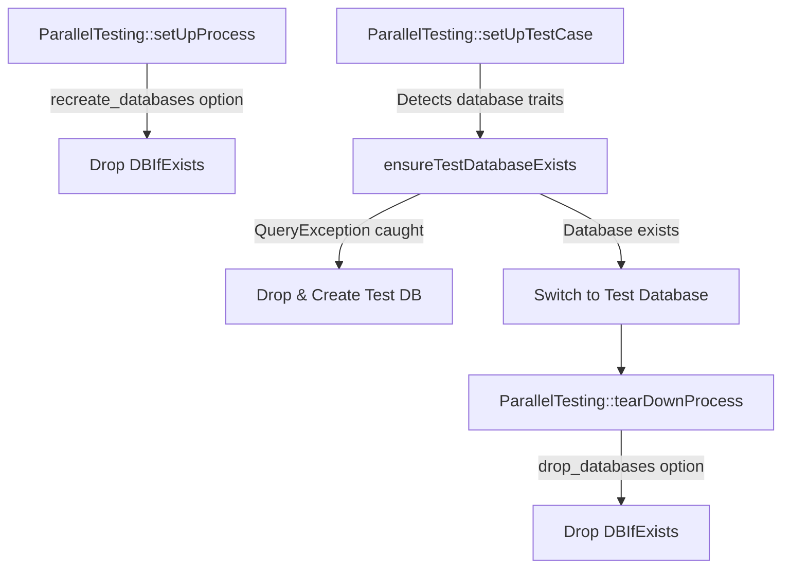

# Database Testing & Fakes

<details>
<summary>Relevant source files</summary>

The following files were used as context for generating this wiki page:

- [src/Illuminate/Foundation/Testing/Concerns/InteractsWithTestCaseLifecycle.php](https://github.com/laravel/framework/blob/main/src/Illuminate/Foundation/Testing/Concerns/InteractsWithTestCaseLifecycle.php)
- [src/Illuminate/Support/Testing/Fakes/BusFake.php](https://github.com/laravel/framework/blob/main/src/Illuminate/Support/Testing/Fakes/BusFake.php)
- [src/Illuminate/Foundation/Testing/RefreshDatabase.php](https://github.com/laravel/framework/blob/main/src/Illuminate/Foundation/Testing/RefreshDatabase.php)
- [src/Illuminate/Support/Facades/Bus.php](https://github.com/laravel/framework/blob/main/src/Illuminate/Support/Facades/Bus.php)
- [src/Illuminate/Foundation/Testing/DatabaseTruncation.php](https://github.com/laravel/framework/blob/main/src/Illuminate/Foundation/Testing/DatabaseTruncation.php)
- [src/Illuminate/Database/DatabaseServiceProvider.php](https://github.com/laravel/framework/blob/main/src/Illuminate/Database/DatabaseServiceProvider.php)
- [src/Illuminate/Testing/Concerns/TestDatabases.php](https://github.com/laravel/framework/blob/main/src/Illuminate/Testing/Concerns/TestDatabases.php)
- [src/Illuminate/Support/Testing/Fakes/QueueFake.php](https://github.com/laravel/framework/blob/main/src/Illuminate/Support/Testing/Fakes/QueueFake.php)
- [src/Illuminate/Foundation/Testing/DatabaseMigrations.php](https://github.com/laravel/framework/blob/main/src/Illuminate/Foundation/Testing/DatabaseMigrations.php)
- [src/Illuminate/Foundation/Testing/LazilyRefreshDatabase.php](https://github.com/laravel/framework/blob/main/src/Illuminate/Foundation/Testing/LazilyRefreshDatabase.php)
- [src/Illuminate/Foundation/Testing/RefreshDatabaseState.php](https://github.com/laravel/framework/blob/main/src/Illuminate/Foundation/Testing/RefreshDatabaseState.php)
- [src/Illuminate/Foundation/Testing/DatabaseTransactions.php](https://github.com/laravel/framework/blob/main/src/Illuminate/Foundation/Testing/DatabaseTransactions.php)
- [src/Illuminate/Support/Testing/Fakes/BatchRepositoryFake.php](https://github.com/laravel/framework/blob/main/src/Illuminate/Support/Testing/Fakes/BatchRepositoryFake.php)
- [src/Illuminate/Foundation/Testing/Traits/CanConfigureMigrationCommands.php](https://github.com/laravel/framework/blob/main/src/Illuminate/Foundation/Testing/Traits/CanConfigureMigrationCommands.php)
- [src/Illuminate/Foundation/Testing/Concerns/InteractsWithDatabase.php](https://github.com/laravel/framework/blob/main/src/Illuminate/Foundation/Testing/Concerns/InteractsWithDatabase.php)
- [src/Illuminate/Support/Testing/Fakes/EventFake.php](https://github.com/laravel/framework/blob/main/src/Illuminate/Support/Testing/Fakes/EventFake.php)
- [src/Illuminate/Support/Testing/Fakes/BatchFake.php](https://github.com/laravel/framework/blob/main/src/Illuminate/Support/Testing/Fakes/BatchFake.php)
- [src/Illuminate/Support/Facades/DB.php](https://github.com/laravel/framework/blob/main/src/Illuminate/Support/Facades/DB.php)
- [src/Illuminate/Foundation/Testing/Concerns/InteractsWithRedis.php](https://github.com/laravel/framework/blob/main/src/Illuminate/Foundation/Testing/Concerns/InteractsWithRedis.php)
</details>

## Overview

The database testing and fakes framework in Laravel provides a comprehensive suite of utilities for isolating, migrating, truncating, and transacting test databases, alongside robust faking mechanisms for queues, events, command buses, and batch workflows. It solves the core challenges of test pollution and slow execution speeds by coordinating test case lifecycles, managing parallel test databases, and offering expressive assertion capabilities for persistent data and asynchronous operations.

Sources: [src/Illuminate/Foundation/Testing/Concerns/InteractsWithTestCaseLifecycle.php:52-115](https://github.com/laravel/framework/blob/main/src/Illuminate/Foundation/Testing/Concerns/InteractsWithTestCaseLifecycle.php#L52-L115), [src/Illuminate/Foundation/Testing/RefreshDatabase.php:8-28](https://github.com/laravel/framework/blob/main/src/Illuminate/Foundation/Testing/RefreshDatabase.php#L8-L28), [src/Illuminate/Foundation/Testing/DatabaseTruncation.php:11-54](https://github.com/laravel/framework/blob/main/src/Illuminate/Foundation/Testing/DatabaseTruncation.php#L11-L54), [src/Illuminate/Testing/Concerns/TestDatabases.php:13-86](https://github.com/laravel/framework/blob/main/src/Illuminate/Testing/Concerns/TestDatabases.php#L13-L86)

## Test Lifecycle and Trait Setup

### Overview

Managing test case execution hooks and bootstrapping database traits relies on coordination between test environment setup routines, parallel testing hooks, and dynamic trait inspection. Laravel's test lifecycle cleans up global state and initializes application containers and database connections across test cases.

Sources: [src/Illuminate/Foundation/Testing/Concerns/InteractsWithTestCaseLifecycle.php:52-115](https://github.com/laravel/framework/blob/main/src/Illuminate/Foundation/Testing/Concerns/InteractsWithTestCaseLifecycle.php#L52-L115), [src/Illuminate/Testing/Concerns/TestDatabases.php:13-86](https://github.com/laravel/framework/blob/main/src/Illuminate/Testing/Concerns/TestDatabases.php#L13-L86)

### Lifecycle Execution Walkthrough

The test case setup and teardown sequence proceeds through specific phases. During test initialization, `setUpTheTestEnvironment()` executes:

`setUpTheTestEnvironment()` → clears resolved facade instances via `Facade::clearResolvedInstances()` → refreshes the application container if uninitialized (`$this->refreshApplication()`) → fires `ParallelTesting::callSetUpTestCaseCallbacks($this)` → calls `setUpTraits()` to scan and initialize testing traits → iterates over `$this->afterApplicationCreatedCallbacks` → sets the Eloquent model event dispatcher via `Model::setEventDispatcher($this->app['events'])` → sets `$this->setUpHasRun = true`.

Sources: [src/Illuminate/Foundation/Testing/Concerns/InteractsWithTestCaseLifecycle.php:96-115](https://github.com/laravel/framework/blob/main/src/Illuminate/Foundation/Testing/Concerns/InteractsWithTestCaseLifecycle.php#L96-L115)

During test destruction, `tearDownTheTestEnvironment()` executes:

`tearDownTheTestEnvironment()` → calls `callBeforeApplicationDestroyedCallbacks()` → fires `ParallelTesting::callTearDownTestCaseCallbacks($this)` → flushes the container via `$this->app->flush()` → sets `$this->app = null` → resets server variables and default headers → closes Mockery containers and logs assertion counts → resets `Carbon::setTestNow()` and `CarbonImmutable::setTestNow()` → flushes state across dozens of core framework components and facades (including `AboutCommand::flushState()`, `Factory::flushState()`, `Migrator::withoutMigrations([])`, and `Sleep::fake(false)`).

Sources: [src/Illuminate/Foundation/Testing/Concerns/InteractsWithTestCaseLifecycle.php:126-215](https://github.com/laravel/framework/blob/main/src/Illuminate/Foundation/Testing/Concerns/InteractsWithTestCaseLifecycle.php#L126-L215)

> [!NOTE]
> When `setUpTraits()` runs, it checks for explicitly defined test traits via `$this->traitsUsedByTest` or falls back to `class_uses_recursive(static::class)`, inspecting both convention-based `setUp*()` / `tearDown*()` methods and PHPUnit attributes `#[SetUp]` and `#[TearDown]`.
> Sources: [src/Illuminate/Foundation/Testing/Concerns/InteractsWithTestCaseLifecycle.php:222-268](https://github.com/laravel/framework/blob/main/src/Illuminate/Foundation/Testing/Concerns/InteractsWithTestCaseLifecycle.php#L222-L268)

### Trait Inspection and Migration Configuration

The framework inspects test classes for migration configuration options and traits to determine how schemas are refreshed, seeded, or dropped.

| Method / Property | Return Type | Purpose | Sources |
| :--- | :--- | :--- | :--- |
| `migrateFreshUsing()` | `array` | Compiles parameters (`--drop-views`, `--drop-types`, `--seeder`, `--seed`) for `migrate:fresh`. | [src/Illuminate/Foundation/Testing/Traits/CanConfigureMigrationCommands.php:16-27](https://github.com/laravel/framework/blob/main/src/Illuminate/Foundation/Testing/Traits/CanConfigureMigrationCommands.php#L16-L27) |
| `shouldDropViews()` | `bool` | Determines if database views should be dropped during refresh based on the `$dropViews` property. | [src/Illuminate/Foundation/Testing/Traits/CanConfigureMigrationCommands.php:34-37](https://github.com/laravel/framework/blob/main/src/Illuminate/Foundation/Testing/Traits/CanConfigureMigrationCommands.php#L34-L37) |
| `shouldDropTypes()` | `bool` | Determines if custom database types should be dropped during refresh based on the `$dropTypes` property. | [src/Illuminate/Foundation/Testing/Traits/CanConfigureMigrationCommands.php:44-47](https://github.com/laravel/framework/blob/main/src/Illuminate/Foundation/Testing/Traits/CanConfigureMigrationCommands.php#L44-L47) |
| `shouldSeed()` | `bool` | Checks for `#[Seed]` attributes up the class inheritance chain or falls back to the `$seed` property. | [src/Illuminate/Foundation/Testing/Traits/CanConfigureMigrationCommands.php:54-65](https://github.com/laravel/framework/blob/main/src/Illuminate/Foundation/Testing/Traits/CanConfigureMigrationCommands.php#L54-L65) |
| `seeder()` | `mixed` | Inspects class attributes for `#[Seeder]` or falls back to the `$seeder` property. | [src/Illuminate/Foundation/Testing/Traits/CanConfigureMigrationCommands.php:72-85](https://github.com/laravel/framework/blob/main/src/Illuminate/Foundation/Testing/Traits/CanConfigureMigrationCommands.php#L72-L85) |

Sources: [src/Illuminate/Foundation/Testing/Traits/CanConfigureMigrationCommands.php:9-86](https://github.com/laravel/framework/blob/main/src/Illuminate/Foundation/Testing/Traits/CanConfigureMigrationCommands.php#L9-L86)

## Database State Refresh Strategies

### Overview

Laravel provides multiple traits to manage and reset database state between test runs. These strategies range from running full schema migrations and rollbacks to wrapping tests in database transactions or lazily executing migrations upon the first database query. State management is coordinated globally via `RefreshDatabaseState`, which tracks migration execution flags, lazy refresh states, and cached in-memory SQLite PDO connections.

Sources: [src/Illuminate/Foundation/Testing/RefreshDatabase.php:8-167](https://github.com/laravel/framework/blob/main/src/Illuminate/Foundation/Testing/RefreshDatabase.php#L8-L167), [src/Illuminate/Foundation/Testing/DatabaseMigrations.php:8-28](https://github.com/laravel/framework/blob/main/src/Illuminate/Foundation/Testing/DatabaseMigrations.php#L8-L28), [src/Illuminate/Foundation/Testing/LazilyRefreshDatabase.php:5-48](https://github.com/laravel/framework/blob/main/src/Illuminate/Foundation/Testing/LazilyRefreshDatabase.php#L5-L48), [src/Illuminate/Foundation/Testing/RefreshDatabaseState.php:5-27](https://github.com/laravel/framework/blob/main/src/Illuminate/Foundation/Testing/RefreshDatabaseState.php#L5-L27), [src/Illuminate/Foundation/Testing/DatabaseTransactions.php:5-54](https://github.com/laravel/framework/blob/main/src/Illuminate/Foundation/Testing/DatabaseTransactions.php#L5-L54)

### State Refresh Strategies and Mechanics

Each trait implements a distinct lifecycle strategy for database setup and cleanup. 

| Trait | Setup Mechanism | Teardown Mechanism | In-Memory Support | Sources |
| :--- | :--- | :--- | :--- | :--- |
| `RefreshDatabase` | Migrates once if not migrated (`migrate:fresh`), then begins a database transaction. | Rolls back the transaction on application destruction. | Restores cached in-memory PDO instances. | [src/Illuminate/Foundation/Testing/RefreshDatabase.php:17-167](https://github.com/laravel/framework/blob/main/src/Illuminate/Foundation/Testing/RefreshDatabase.php#L17-L167) |
| `DatabaseMigrations` | Runs `migrate:fresh` before each test. | Rolls back migrations via `migrate:rollback` when application is destroyed. | None (runs full file/DB migration cycle). | [src/Illuminate/Foundation/Testing/DatabaseMigrations.php:17-28](https://github.com/laravel/framework/blob/main/src/Illuminate/Foundation/Testing/DatabaseMigrations.php#L17-L28) |
| `LazilyRefreshDatabase` | Hooks into transaction start / query execution to trigger migration lazily on first use. | Clears `$lazilyRefreshed` state on application destruction. | Delegates to `RefreshDatabase`. | [src/Illuminate/Foundation/Testing/LazilyRefreshDatabase.php:16-48](https://github.com/laravel/framework/blob/main/src/Illuminate/Foundation/Testing/LazilyRefreshDatabase.php#L16-L48) |
| `DatabaseTransactions` | Begins a database transaction immediately without running migrations. | Rolls back the transaction and disconnects connections. | None. | [src/Illuminate/Foundation/Testing/DatabaseTransactions.php:12-40](https://github.com/laravel/framework/blob/main/src/Illuminate/Foundation/Testing/DatabaseTransactions.php#L12-L40) |

Sources: [src/Illuminate/Foundation/Testing/RefreshDatabase.php:8-167](https://github.com/laravel/framework/blob/main/src/Illuminate/Foundation/Testing/RefreshDatabase.php#L8-L167), [src/Illuminate/Foundation/Testing/DatabaseMigrations.php:8-28](https://github.com/laravel/framework/blob/main/src/Illuminate/Foundation/Testing/DatabaseMigrations.php#L8-L28), [src/Illuminate/Foundation/Testing/LazilyRefreshDatabase.php:5-48](https://github.com/laravel/framework/blob/main/src/Illuminate/Foundation/Testing/LazilyRefreshDatabase.php#L5-L48), [src/Illuminate/Foundation/Testing/DatabaseTransactions.php:5-54](https://github.com/laravel/framework/blob/main/src/Illuminate/Foundation/Testing/DatabaseTransactions.php#L5-L54)

### Execution Call-Chain

When a test case utilizes `RefreshDatabase`, the `refreshDatabase()` method dictates the initialization flow:

`refreshDatabase()` → `$this->beforeRefreshingDatabase()` → checks `$this->usingInMemoryDatabases()` → executes `$this->restoreInMemoryDatabase()` if true, otherwise calls `$this->refreshTestDatabase()` → `$this->afterRefreshingDatabase()`.

Inside `refreshTestDatabase()`:
Checks `RefreshDatabaseState::$migrated` → if false, calls `$this->migrateDatabases()` (executing `artisan('migrate:fresh', $this->migrateFreshUsing())`) → resets artisan instance via `setArtisan(null)` → updates local cache of in-memory databases → sets `RefreshDatabaseState::$migrated = true` → calls `$this->beginDatabaseTransaction()`.

Inside `beginDatabaseTransaction()`:
Makes `'db'` container → resolves connections via `connectionsToTransact()` → instantiates and binds `DatabaseTransactionsManager` to `'db.transactions'` → sets transaction manager on connections → begins transaction on each connection via `$connection->beginTransaction()` → registers a `beforeApplicationDestroyed` callback to roll back transactions and disconnect on test completion.

Sources: [src/Illuminate/Foundation/Testing/RefreshDatabase.php:17-167](https://github.com/laravel/framework/blob/main/src/Illuminate/Foundation/Testing/RefreshDatabase.php#L17-L167)

> [!NOTE]
> When using `LazilyRefreshDatabase`, the migration is deferred entirely until a database transaction is about to start or a query is executed, registered via `$database->connection($connection)->beforeStartingTransaction($callback)` and `beforeExecuting($callback)`.
> Sources: [src/Illuminate/Foundation/Testing/LazilyRefreshDatabase.php:16-44](https://github.com/laravel/framework/blob/main/src/Illuminate/Foundation/Testing/LazilyRefreshDatabase.php#L16-L44)

> [!WARNING]
> If a connection's PDO instance is active and not inside an active transaction during teardown in `RefreshDatabase`, `RefreshDatabaseState::$migrated` is automatically reset to `false` to force re-migration on subsequent test runs.
> Sources: [src/Illuminate/Foundation/Testing/RefreshDatabase.php:151-166](https://github.com/laravel/framework/blob/main/src/Illuminate/Foundation/Testing/RefreshDatabase.php#L151-L166)

### Global State Container

The state of database refreshes is tracked statically via `RefreshDatabaseState`:

```php
class RefreshDatabaseState
{
    public static $inMemoryConnections = [];
    public static $migrated = false;
    public static $lazilyRefreshed = false;
}
```

Sources: [src/Illuminate/Foundation/Testing/RefreshDatabaseState.php:5-27](https://github.com/laravel/framework/blob/main/src/Illuminate/Foundation/Testing/RefreshDatabaseState.php#L5-L27)

## Table Truncation and Parallel Databases

### Overview

The `DatabaseTruncation` trait provides an alternative database reset strategy by wiping table data between tests instead of rolling back database transactions or re-running full migrations. Parallel testing uses the `TestDatabases` trait to bootstrap isolated databases per test runner process.

Sources: [src/Illuminate/Foundation/Testing/DatabaseTruncation.php:11-196](https://github.com/laravel/framework/blob/main/src/Illuminate/Foundation/Testing/DatabaseTruncation.php#L11-L196), [src/Illuminate/Testing/Concerns/TestDatabases.php:13-210](https://github.com/laravel/framework/blob/main/src/Illuminate/Testing/Concerns/TestDatabases.php#L13-L210)

### Truncation Execution Flow

When a test class uses `DatabaseTruncation`, table wiping follows a deterministic call sequence across configured database connections.

`truncateDatabaseTables()` → `$this->beforeTruncatingDatabase()` → checks `RefreshDatabaseState::$migrated` → if false, executes `migrate:fresh` via Artisan and sets `RefreshDatabaseState::$migrated = true`; if true, invokes `truncateTablesForAllConnections()` → `connectionsToTruncate()` iterates connections → `withoutForeignKeyConstraints()` disables FK checks → `truncateTablesForConnection()` runs.

Inside `truncateTablesForConnection()`:
Unsets connection event dispatcher → retrieves all tables via `getAllTablesForConnection()` → applies `tablesToTruncate()` filters or rejects `exceptTables()` (which automatically prepends the configured migrations table) → iterates remaining tables via `withoutTablePrefix()` → checks `$table->exists()` → calls `$table->truncate()` → restores connection event dispatcher.

Sources: [src/Illuminate/Foundation/Testing/DatabaseTruncation.php:27-111](https://github.com/laravel/framework/blob/main/src/Illuminate/Foundation/Testing/DatabaseTruncation.php#L27-L111)

> [!NOTE]
> `exceptTables()` dynamically loads the table name from `database.migrations` configuration, prepends the connection table prefix, and merges it with any custom excluded tables defined on the test class.
> Sources: [src/Illuminate/Foundation/Testing/DatabaseTruncation.php:162-175](https://github.com/laravel/framework/blob/main/src/Illuminate/Foundation/Testing/DatabaseTruncation.php#L162-L175)

### Parallel Testing Database Isolation

The `TestDatabases` trait hooks into Laravel's parallel testing lifecycle events to provision and switch process-specific databases dynamically.



Sources: [src/Illuminate/Testing/Concerns/TestDatabases.php:34-86](https://github.com/laravel/framework/blob/main/src/Illuminate/Testing/Concerns/TestDatabases.php#L34-L86)

### Parallel Testing Lifecycle Hooks and Methods

| Method | Event Hook | Purpose | Sources |
| :--- | :--- | :--- | :--- |
| `bootTestDatabase()` | `ParallelTesting::setUpProcess`, `setUpTestCase`, `tearDownProcess` | Registers process-level and test-case level hooks for test database creation, switching, and cleanup. | [src/Illuminate/Testing/Concerns/TestDatabases.php:34-86](https://github.com/laravel/framework/blob/main/src/Illuminate/Testing/Concerns/TestDatabases.php#L34-L86) |
| `ensureTestDatabaseExists()` | Called during `setUpTestCase` | Checks whether the parallel test database exists by querying a dummy table; creates it if a `QueryException` is thrown. | [src/Illuminate/Testing/Concerns/TestDatabases.php:94-112](https://github.com/laravel/framework/blob/main/src/Illuminate/Testing/Concerns/TestDatabases.php#L94-L112) |
| `switchToDatabase()` | Called during `ensureTestDatabaseExists` and `usingDatabase` | Purges DB connections and updates either the database connection URL regex or database config name with the test token. | [src/Illuminate/Testing/Concerns/TestDatabases.php:172-191](https://github.com/laravel/framework/blob/main/src/Illuminate/Testing/Concerns/TestDatabases.php#L172-L191) |
| `testDatabase()` | Helper method | Appends `_test_{token}` to the original database name using `ParallelTesting::token()`. | [src/Illuminate/Testing/Concerns/TestDatabases.php:198-209](https://github.com/laravel/framework/blob/main/src/Illuminate/Testing/Concerns/TestDatabases.php#L198-L209) |

Sources: [src/Illuminate/Testing/Concerns/TestDatabases.php:34-210](https://github.com/laravel/framework/blob/main/src/Illuminate/Testing/Concerns/TestDatabases.php#L34-L210)

## Database Assertions and Service Binding

### Overview

The `InteractsWithDatabase` trait supplies fluent testing assertions that query database state directly using PHPUnit constraints like `HasInDatabase`, `CountInDatabase`, `SoftDeletedInDatabase`, and `NotSoftDeletedInDatabase`. These assertions accept table names, model class strings, model instances, or iterables of models, dynamically resolving connection names, primary keys, and soft-delete columns. Concurrently, `DatabaseServiceProvider` registers foundational container bindings including `db.factory`, `db`, `db.connection`, `db.schema`, `db.transactions`, `ConcurrencyErrorDetectorContract`, `LostConnectionDetectorContract`, `FakerGenerator`, and `EntityResolver`.

Sources: [src/Illuminate/Database/DatabaseServiceProvider.php:55-126](https://github.com/laravel/framework/blob/main/src/Illuminate/Database/DatabaseServiceProvider.php#L55-L126), [src/Illuminate/Foundation/Testing/Concerns/InteractsWithDatabase.php:16-187](https://github.com/laravel/framework/blob/main/src/Illuminate/Foundation/Testing/Concerns/InteractsWithDatabase.php#L16-L187)

### Database Assertion and Resolution Call-Chain

When testing database state via assertions like `assertDatabaseHas()`, input arguments pass through a deterministic resolution pipeline before evaluating the PHPUnit constraint:

`assertDatabaseHas()` → checks `is_iterable($table)` or list of arrays (recursing if matched) → checks if `$table instanceof Model` (merging primary key name and value into `$data`) → `getTable($table)` (retrieving table name from model or model factory) → `getConnection($connection, $table)` (resolving connection instance via `db` container binding and table connection name) → `assertThat()` executing `HasInDatabase`.

Sources: [src/Illuminate/Foundation/Testing/Concerns/InteractsWithDatabase.php:26-56](https://github.com/laravel/framework/blob/main/src/Illuminate/Foundation/Testing/Concerns/InteractsWithDatabase.php#L26-L56)

> [!WARNING]
> When passing an Eloquent model instance to `assertDatabaseHas()` or `assertDatabaseMissing()`, the model's primary key and current attribute values are automatically merged into the `$data` array.
> Sources: [src/Illuminate/Foundation/Testing/Concerns/InteractsWithDatabase.php:44-49](https://github.com/laravel/framework/blob/main/src/Illuminate/Foundation/Testing/Concerns/InteractsWithDatabase.php#L44-L49)

### Service Provider Container Bindings

`DatabaseServiceProvider` registers key database infrastructure components and utility generators into the service container during the `register()` lifecycle phase.

| Binding Key / Abstract | Implementation | Type | Purpose | Sources |
| :--- | :--- | :--- | :--- | :--- |
| `db.factory` | `Illuminate\Database\Connectors\ConnectionFactory` | Singleton | Creates concrete database connection instances. | [src/Illuminate/Database/DatabaseServiceProvider.php:60-62](https://github.com/laravel/framework/blob/main/src/Illuminate/Database/DatabaseServiceProvider.php#L60-L62) |
| `db` | `Illuminate\Database\DatabaseManager` | Singleton | Manages multiple database connections and implements connection resolver interface. | [src/Illuminate/Database/DatabaseServiceProvider.php:67-69](https://github.com/laravel/framework/blob/main/src/Illuminate/Database/DatabaseServiceProvider.php#L67-L69) |
| `db.connection` | Resolves via `$app['db']->connection()` | Bound (Factory) | Resolves the default active database connection. | [src/Illuminate/Database/DatabaseServiceProvider.php:71-73](https://github.com/laravel/framework/blob/main/src/Illuminate/Database/DatabaseServiceProvider.php#L71-L73) |
| `db.schema` | Resolves via connection schema builder | Bound (Factory) | Resolves the schema builder for the active connection. | [src/Illuminate/Database/DatabaseServiceProvider.php:75-77](https://github.com/laravel/framework/blob/main/src/Illuminate/Database/DatabaseServiceProvider.php#L75-L77) |
| `db.transactions` | `Illuminate\Database\DatabaseTransactionsManager` | Singleton | Manages database transaction state and callbacks. | [src/Illuminate/Database/DatabaseServiceProvider.php:79-81](https://github.com/laravel/framework/blob/main/src/Illuminate/Database/DatabaseServiceProvider.php#L79-L81) |
| `ConcurrencyErrorDetectorContract` | `Illuminate\Database\ConcurrencyErrorDetector` | Singleton | Detects concurrency anomalies. | [src/Illuminate/Database/DatabaseServiceProvider.php:83-85](https://github.com/laravel/framework/blob/main/src/Illuminate/Database/DatabaseServiceProvider.php#L83-L85) |
| `LostConnectionDetectorContract` | `Illuminate\Database\LostConnectionDetector` | Singleton | Detects dropped database connections. | [src/Illuminate/Database/DatabaseServiceProvider.php:87-89](https://github.com/laravel/framework/blob/main/src/Illuminate/Database/DatabaseServiceProvider.php#L87-L89) |
| `FakerGenerator::class` | `Faker\Generator` | Singleton | Generates localized fake test data instances using cached locale singletons. | [src/Illuminate/Database/DatabaseServiceProvider.php:103-113](https://github.com/laravel/framework/blob/main/src/Illuminate/Database/DatabaseServiceProvider.php#L103-L113) |
| `EntityResolver::class` | `Illuminate\Database\Eloquent\QueueEntityResolver` | Singleton | Resolves queueable Eloquent model entities. | [src/Illuminate/Database/DatabaseServiceProvider.php:123-125](https://github.com/laravel/framework/blob/main/src/Illuminate/Database/DatabaseServiceProvider.php#L123-L125) |

Sources: [src/Illuminate/Database/DatabaseServiceProvider.php:55-126](https://github.com/laravel/framework/blob/main/src/Illuminate/Database/DatabaseServiceProvider.php#L55-L126)

## Command Bus and Batch Fakes

### Overview

The `BusFake` implementation and its associated `Bus` facade intercept command dispatching, chained jobs, and batch workflows during testing without executing them on real queues. By evaluating whether specific jobs should be faked or dispatched via `shouldFakeJob()`, `BusFake` routes intercepted commands into internal tracking arrays based on how they were dispatched (`dispatch`, `dispatchSync`, `dispatchNow`, `dispatchToQueue`, or `dispatchAfterResponse`). 

Sources: [src/Illuminate/Support/Testing/Fakes/BusFake.php:50-69](https://github.com/laravel/framework/blob/main/src/Illuminate/Support/Testing/Fakes/BusFake.php#L50-L69), [src/Illuminate/Support/Testing/Fakes/BusFake.php:664-737](https://github.com/laravel/framework/blob/main/src/Illuminate/Support/Testing/Fakes/BusFake.php#L664-L737), [src/Illuminate/Support/Testing/Fakes/BusFake.php:818-834](https://github.com/laravel/framework/blob/main/src/Illuminate/Support/Testing/Fakes/BusFake.php#L818-L834)

### Call-Chain Execution Walkthrough

When an assertion such as `assertDispatched()` or `assertChained()` is invoked, execution flows through verification helpers to inspect captured command collections:

`assertDispatched()` → evaluates closure parameter types via `firstClosureParameterType()` or delegates numeric call counts to `assertDispatchedTimes()` → queries collection filters via `dispatched()`, `dispatchedAfterResponse()`, or `dispatchedSync()` → checks whether any stored command matches via `hasDispatched()` and asserts success using `PHPUnit::assertTrue()`.

Sources: [src/Illuminate/Support/Testing/Fakes/BusFake.php:118-134](https://github.com/laravel/framework/blob/main/src/Illuminate/Support/Testing/Fakes/BusFake.php#L118-L134), [src/Illuminate/Support/Testing/Fakes/BusFake.php:564-573](https://github.com/laravel/framework/blob/main/src/Illuminate/Support/Testing/Fakes/BusFake.php#L564-L573)

> [!WARNING]
> When passing closure arguments to assertion methods like `assertDispatched()`, `BusFake` automatically inspects the closure's first parameter type via `firstClosureParameterType()` to resolve the underlying command class name.
> Sources: [src/Illuminate/Support/Testing/Fakes/BusFake.php:120-122](https://github.com/laravel/framework/blob/main/src/Illuminate/Support/Testing/Fakes/BusFake.php#L120-L122)

### Batch and Repository Fakes

Batch workflows are intercepted by `BusFake` using `BatchRepositoryFake` and `BatchFake`. When a pending batch is recorded via `recordPendingBatch()`, it instantiates a `BatchFake` via `BatchRepositoryFake::store()` and stores it in the internal batches array.

| Method / Class | Target Property / Return Type | Purpose | Sources |
| :--- | :--- | :--- | :--- |
| `BusFake::batch()` | `PendingBatchFake` | Creates a new fake pending batch instance for fluent workflow configuration. | [src/Illuminate/Support/Testing/Fakes/BusFake.php:783-786](https://github.com/laravel/framework/blob/main/src/Illuminate/Support/Testing/Fakes/BusFake.php#L783-L786) |
| `BusFake::recordPendingBatch()` | `Batch` | Stores the pending batch in the fake repository and records it as dispatched. | [src/Illuminate/Support/Testing/Fakes/BusFake.php:805-810](https://github.com/laravel/framework/blob/main/src/Illuminate/Support/Testing/Fakes/BusFake.php#L805-L810) |
| `BatchRepositoryFake::store()` | `BatchFake` | Generates an ordered UUID and initializes a tracked `BatchFake` record. | [src/Illuminate/Support/Testing/Fakes/BatchRepositoryFake.php:51-69](https://github.com/laravel/framework/blob/main/src/Illuminate/Support/Testing/Fakes/BatchRepositoryFake.php#L51-L69) |
| `BatchFake::add()` | `self` | Appends jobs to the fake batch and increments the total job count. | [src/Illuminate/Support/Testing/Fakes/BatchFake.php:84-95](https://github.com/laravel/framework/blob/main/src/Illuminate/Support/Testing/Fakes/BatchFake.php#L84-L95) |

Sources: [src/Illuminate/Support/Testing/Fakes/BusFake.php:783-810](https://github.com/laravel/framework/blob/main/src/Illuminate/Support/Testing/Fakes/BusFake.php#L783-L810), [src/Illuminate/Support/Testing/Fakes/BatchRepositoryFake.php:51-69](https://github.com/laravel/framework/blob/main/src/Illuminate/Support/Testing/Fakes/BatchRepositoryFake.php#L51-L69), [src/Illuminate/Support/Testing/Fakes/BatchFake.php:84-95](https://github.com/laravel/framework/blob/main/src/Illuminate/Support/Testing/Fakes/BatchFake.php#L84-L95)

> [!TIP]
> Use `Bus::fake()` to trap all dispatched commands and batches across your application, then selectively bypass faking for specific jobs by chaining the `except()` method.
> Sources: [src/Illuminate/Support/Testing/Fakes/BusFake.php:104-109](https://github.com/laravel/framework/blob/main/src/Illuminate/Support/Testing/Fakes/BusFake.php#L104-L109), [src/Illuminate/Support/Facades/Bus.php:72-81](https://github.com/laravel/framework/blob/main/src/Illuminate/Support/Facades/Bus.php#L72-L81)

## Queue and Event Subsystem Faking

### Overview

During testing, asynchronous queue operations and event dispatching can be intercepted using `QueueFake` and `EventFake`. These fake implementations intercept pushes and dispatches, storing them in memory for assertion checks while avoiding real network or database overhead.

Sources: [src/Illuminate/Support/Testing/Fakes/QueueFake.php:52-64](https://github.com/laravel/framework/blob/main/src/Illuminate/Support/Testing/Fakes/QueueFake.php#L52-L64), [src/Illuminate/Support/Testing/Fakes/EventFake.php:43-48](https://github.com/laravel/framework/blob/main/src/Illuminate/Support/Testing/Fakes/EventFake.php#L43-L48)

### Queue Interception and Delayed Pushing

`QueueFake` extends `QueueManager` and implements `Fake` and `Queue`. When jobs are pushed via `push()` or delayed via `later()`, `QueueFake` evaluates whether the job should be faked based on filters configured via `except()` or `jobsToFake`.

Sources: [src/Illuminate/Support/Testing/Fakes/QueueFake.php:26-27](https://github.com/laravel/framework/blob/main/src/Illuminate/Support/Testing/Fakes/QueueFake.php#L26-L27), [src/Illuminate/Support/Testing/Fakes/QueueFake.php:613-645](https://github.com/laravel/framework/blob/main/src/Illuminate/Support/Testing/Fakes/QueueFake.php#L613-L645), [src/Illuminate/Support/Testing/Fakes/QueueFake.php:713-724](https://github.com/laravel/framework/blob/main/src/Illuminate/Support/Testing/Fakes/QueueFake.php#L713-L724)

### Call-Chain Execution Walkthrough

When a job is pushed to the queue via `push()`, execution flows through specific evaluation and storage steps:

`push()` → invokes `beforePushingCallbacks` → evaluates `shouldFakeJob()` → checks `shouldDispatchJob()` (returning `false` if not excluded) and verifies `jobsToFake` collection → if faked, wraps closures into `CallQueuedClosure`, stores the job array in `$this->jobs`, and records unique jobs in `$uniqueJobs` if implementing `ShouldBeUnique` → otherwise dispatches to original connection → invokes `afterPushingCallbacks`.

Sources: [src/Illuminate/Support/Testing/Fakes/QueueFake.php:613-645](https://github.com/laravel/framework/blob/main/src/Illuminate/Support/Testing/Fakes/QueueFake.php#L613-L645), [src/Illuminate/Support/Testing/Fakes/QueueFake.php:653-683](https://github.com/laravel/framework/blob/main/src/Illuminate/Support/Testing/Fakes/QueueFake.php#L653-L683)

> [!WARNING]
> If a job implements `ShouldBeUnique`, pushing it to `QueueFake` records it in the internal `$uniqueJobs` array, requiring explicit lock release via `releaseUniqueJobLocks()` when testing unique job constraints.
> Sources: [src/Illuminate/Support/Testing/Fakes/QueueFake.php:633-636](https://github.com/laravel/framework/blob/main/src/Illuminate/Support/Testing/Fakes/QueueFake.php#L633-L636), [src/Illuminate/Support/Testing/Fakes/QueueFake.php:850-859](https://github.com/laravel/framework/blob/main/src/Illuminate/Support/Testing/Fakes/QueueFake.php#L850-L859)

### Event Faking and Transactional Dispatching

`EventFake` implements `Dispatcher` and `Fake`. When `dispatch()` is called, `shouldFakeEvent()` determines if the event should be intercepted or passed to the underlying dispatcher.

Sources: [src/Illuminate/Support/Testing/Fakes/EventFake.php:17-17](https://github.com/laravel/framework/blob/main/src/Illuminate/Support/Testing/Fakes/EventFake.php#L17-L17), [src/Illuminate/Support/Testing/Fakes/EventFake.php:321-330](https://github.com/laravel/framework/blob/main/src/Illuminate/Support/Testing/Fakes/EventFake.php#L321-L330)

> [!TIP]
> Events implementing `ShouldDispatchAfterCommit` are automatically deferred by `EventFake` until the database transaction commits, provided the `db.transactions` container binding is available.
> Sources: [src/Illuminate/Support/Testing/Fakes/EventFake.php:368-371](https://github.com/laravel/framework/blob/main/src/Illuminate/Support/Testing/Fakes/EventFake.php#L368-L371)

### Queue and Event Assertion Methods

| Class and Method | Parameters | Return Type | Purpose | Sources |
| :--- | :--- | :--- | :--- | :--- |
| `QueueFake::assertPushed` | `$job, $callback = null` | `void` | Asserts that a specific job was pushed to the queue. | [src/Illuminate/Support/Testing/Fakes/QueueFake.php:143-157](https://github.com/laravel/framework/blob/main/src/Illuminate/Support/Testing/Fakes/QueueFake.php#L143-L157) |
| `QueueFake::assertPushedOn` | `$queue, $job, $callback = null` | `void` | Asserts that a job was pushed to a specific queue name. | [src/Illuminate/Support/Testing/Fakes/QueueFake.php:199-214](https://github.com/laravel/framework/blob/main/src/Illuminate/Support/Testing/Fakes/QueueFake.php#L199-L214) |
| `EventFake::assertDispatched` | `$event, $callback = null` | `void` | Asserts that an event was dispatched based on a truth-test callback. | [src/Illuminate/Support/Testing/Fakes/EventFake.php:134-148](https://github.com/laravel/framework/blob/main/src/Illuminate/Support/Testing/Fakes/EventFake.php#L134-L148) |
| `EventFake::assertListening` | `$expectedEvent, $expectedListener` | `void` | Inspects dispatcher closure reflection to verify attached event listeners. | [src/Illuminate/Support/Testing/Fakes/EventFake.php:85-125](https://github.com/laravel/framework/blob/main/src/Illuminate/Support/Testing/Fakes/EventFake.php#L85-L125) |

Sources: [src/Illuminate/Support/Testing/Fakes/QueueFake.php:143-214](https://github.com/laravel/framework/blob/main/src/Illuminate/Support/Testing/Fakes/QueueFake.php#L143-L214), [src/Illuminate/Support/Testing/Fakes/EventFake.php:85-148](https://github.com/laravel/framework/blob/main/src/Illuminate/Support/Testing/Fakes/EventFake.php#L85-L148)

## Related

- [[Testing Framework & HTTP Assertions]]
- [[Model Factories & Seeders]]

