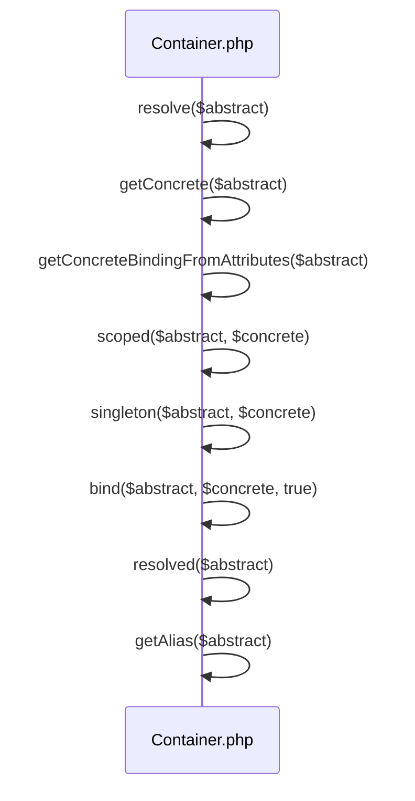

# Dependency Injection Container

<details>
<summary>Relevant source files</summary>

The following files were used as context for generating this wiki page:

- [src/Illuminate/Container/Container.php](https://github.com/laravel/framework/blob/main/src/Illuminate/Container/Container.php)
- [src/Illuminate/Contracts/Container/Container.php](https://github.com/laravel/framework/blob/main/src/Illuminate/Contracts/Container/Container.php)
- [src/Illuminate/Foundation/Application.php](https://github.com/laravel/framework/blob/main/src/Illuminate/Foundation/Application.php)
- [src/Illuminate/Container/ContextualBindingBuilder.php](https://github.com/laravel/framework/blob/main/src/Illuminate/Container/ContextualBindingBuilder.php)
- [src/Illuminate/Container/Attributes/Context.php](https://github.com/laravel/framework/blob/main/src/Illuminate/Container/Attributes/Context.php)
- [src/Illuminate/Container/Attributes/Tag.php](https://github.com/laravel/framework/blob/main/src/Illuminate/Container/Attributes/Tag.php)
- [src/Illuminate/Container/Attributes/Give.php](https://github.com/laravel/framework/blob/main/src/Illuminate/Container/Attributes/Give.php)
- [types/Contracts/Container/Container.php](https://github.com/laravel/framework/blob/main/types/Contracts/Container/Container.php)
- [src/Illuminate/Contracts/Container/ContextualBindingBuilder.php](https://github.com/laravel/framework/blob/main/src/Illuminate/Contracts/Container/ContextualBindingBuilder.php)
- [types/Container/Container.php](https://github.com/laravel/framework/blob/main/types/Container/Container.php)
- [types/Foundation/Application.php](https://github.com/laravel/framework/blob/main/types/Foundation/Application.php)
- [types/Contracts/Foundation/Application.php](https://github.com/laravel/framework/blob/main/types/Contracts/Foundation/Application.php)
- [src/Illuminate/Foundation/Testing/Concerns/InteractsWithContainer.php](https://github.com/laravel/framework/blob/main/src/Illuminate/Foundation/Testing/Concerns/InteractsWithContainer.php)
- [src/Illuminate/Contracts/Container/ContextualAttribute.php](https://github.com/laravel/framework/blob/main/src/Illuminate/Contracts/Container/ContextualAttribute.php)
- [src/Illuminate/Container/Attributes/Database.php](https://github.com/laravel/framework/blob/main/src/Illuminate/Container/Attributes/Database.php)
- [src/Illuminate/Container/Attributes/Config.php](https://github.com/laravel/framework/blob/main/src/Illuminate/Container/Attributes/Config.php)
- [src/Illuminate/Container/BoundMethod.php](https://github.com/laravel/framework/blob/main/src/Illuminate/Container/BoundMethod.php)
</details>

## Overview

The dependency injection container powers Laravel's architecture by managing class instantiation, resolving dependencies, and facilitating service location throughout the framework. Operating through core binding contracts and concrete application extensions, the container handles singleton and scoped registration, alias resolution, and deferred provider loading. By leveraging reflection and attribute-based targeters alongside contextual binding builders, it automates parameter injection for both constructors and arbitrary callables.

Sources: [src/Illuminate/Container/Container.php:26-360](https://github.com/laravel/framework/blob/main/src/Illuminate/Container/Container.php#L26-L360), [src/Illuminate/Contracts/Container/Container.php:8-235](https://github.com/laravel/framework/blob/main/src/Illuminate/Contracts/Container/Container.php#L8-L235), [src/Illuminate/Foundation/Application.php:39-443](https://github.com/laravel/framework/blob/main/src/Illuminate/Foundation/Application.php#L39-L443), [src/Illuminate/Container/ContextualBindingBuilder.php:8-97](https://github.com/laravel/framework/blob/main/src/Illuminate/Container/ContextualBindingBuilder.php#L8-L97), [src/Illuminate/Container/BoundMethod.php:11-220](https://github.com/laravel/framework/blob/main/src/Illuminate/Container/BoundMethod.php#L11-L220)

## Container Contracts and Binding API

### Overview

The container binding API centers around the `Illuminate\Contracts\Container\Container` interface, which extends PSR-11's `ContainerInterface` (`Psr\Container\ContainerInterface`) to establish core contract declarations for container operations. Concrete service registration is implemented in `Illuminate\Container\Container`, handling standard transient bindings, singletons, scoped instances, type safety enforcement via `TypeError`, and automatic closure return type inspection.

Sources: [src/Illuminate/Container/Container.php:26-385](https://github.com/laravel/framework/blob/main/src/Illuminate/Container/Container.php#L26-L385), [src/Illuminate/Contracts/Container/Container.php:6-10](https://github.com/laravel/framework/blob/main/src/Illuminate/Contracts/Container/Container.php#L6-L10)

### Binding and Registration API

The primary registration methods allow binding abstract targets to concrete implementations or closures. When calling `bind()`, if no concrete is specified, the abstract type is registered to itself. Non-closure concrete inputs are validated to ensure they are strings or null, throwing a `TypeError` otherwise, before being wrapped inside a closure using `getClosure()`.

```php
public function bind($abstract, $concrete = null, $shared = false)
{
    if ($abstract instanceof Closure) {
        return $this->bindBasedOnClosureReturnTypes(
            $abstract, $concrete, $shared
        );
    }

    $this->dropStaleInstances($abstract);

    if (is_null($concrete)) {
        $concrete = $abstract;
    }

    if (! $concrete instanceof Closure) {
        if (! is_string($concrete)) {
            throw new TypeError(self::class.'::bind(): Argument #2 ($concrete) must be of type Closure|string|null');
        }

        $concrete = $this->getClosure($abstract, $concrete);
    }

    $this->bindings[$abstract] = ['concrete' => $concrete, 'shared' => $shared];

    if ($this->resolved($abstract)) {
        $this->rebound($abstract);
    }
}
```

Sources: [src/Illuminate/Container/Container.php:349-395](https://github.com/laravel/framework/blob/main/src/Illuminate/Container/Container.php#L349-L395)

> [!NOTE]
> When an abstract type is bound via `bind()`, `singleton()`, or `instance()` after it has already been resolved, the container automatically invokes any registered rebound callbacks via `rebound()` to update consumers.

Sources: [src/Illuminate/Container/Container.php:389-395](https://github.com/laravel/framework/blob/main/src/Illuminate/Container/Container.php#L389-L395), [src/Illuminate/Container/Container.php:615-617](https://github.com/laravel/framework/blob/main/src/Illuminate/Container/Container.php#L615-L617)

### Contract Methods Reference

The core contract declarations dictate all service registration, type checking, and resolution verbs exposed across container implementations.

| Method Signature | Return Type | Purpose |
| :--- | :--- | :--- |
| `bind($abstract, $concrete = null, $shared = false)` | `void` | Register a binding with the container. |
| `singleton($abstract, $concrete = null)` | `void` | Register a shared singleton binding in the container. |
| `scoped($abstract, $concrete = null)` | `void` | Register a scoped binding in the container. |
| `bindIf($abstract, $concrete = null, $shared = false)` | `void` | Register a binding if it hasn't already been registered. |
| `singletonIf($abstract, $concrete = null)` | `void` | Register a shared binding if it hasn't already been registered. |
| `scopedIf($abstract, $concrete = null)` | `void` | Register a scoped binding if it hasn't already been registered. |
| `instance($abstract, $instance)` | `TInstance` | Register an existing instance as shared in the container. |
| `extend($abstract, Closure $closure)` | `void` | Extend an abstract type in the container. |
| `alias($abstract, $alias)` | `void` | Alias a type to a different name. |
| `tag($abstracts, $tags)` | `void` | Assign a set of tags to a given binding. |
| `tagged($tag)` | `iterable` | Resolve all of the bindings for a given tag. |
| `bound($abstract)` | `bool` | Determine if the given abstract type has been bound. |
| `resolved($abstract)` | `bool` | Determine if the given abstract type has been resolved. |
| `flush()` | `void` | Flush the container of all bindings and resolved instances. |

Sources: [src/Illuminate/Contracts/Container/Container.php:21-176](https://github.com/laravel/framework/blob/main/src/Illuminate/Contracts/Container/Container.php#L21-L176), [src/Illuminate/Container/Container.php:488-547](https://github.com/laravel/framework/blob/main/src/Illuminate/Container/Container.php#L488-L547)

## Application Container Integration and Lifecycle

### Overview

The `Illuminate\Foundation\Application` class extends the base container (`Illuminate\Container\Container`) to implement the Laravel framework kernel and application lifecycle management. During instantiation, the application sets up base bindings, base service providers, core container aliases, and Laravel Cloud services.

```php
public function __construct($basePath = null)
{
    if ($basePath) {
        $this->setBasePath($basePath);
    }

    $this->registerBaseBindings();
    $this->registerBaseServiceProviders();
    $this->registerCoreContainerAliases();
    $this->registerLaravelCloudServices();
}
```

Sources: [src/Illuminate/Foundation/Application.php:39-40](https://github.com/laravel/framework/blob/main/src/Illuminate/Foundation/Application.php#L39-L40), [src/Illuminate/Foundation/Application.php:223-233](https://github.com/laravel/framework/blob/main/src/Illuminate/Foundation/Application.php#L223-L233)

### Service Provider Registration and Lifecycle

Service providers are registered via the `register()` method, which checks if a provider is already loaded, instantiates string-based provider class names, invokes their `register()` method, binds properties like `$bindings` and `$singletons`, and marks them as registered. If the application has already booted, `bootProvider()` is immediately called on the provider.

```php
public function register($provider, $force = false)
{
    if (($registered = $this->getProvider($provider)) && ! $force) {
        return $registered;
    }

    if (is_string($provider)) {
        $provider = $this->resolveProvider($provider);
    }

    $provider->register();

    if (property_exists($provider, 'bindings')) {
        foreach ($provider->bindings as $key => $value) {
            $this->bind($key, $value);
        }
    }

    if (property_exists($provider, 'singletons')) {
        foreach ($provider->singletons as $key => $value) {
            $key = is_int($key) ? $value : $key;

            $this->singleton($key, $value);
        }
    }

    $this->markAsRegistered($provider);

    if ($this->isBooted()) {
        $this->bootProvider($provider);
    }

    return $provider;
}
```

Sources: [src/Illuminate/Foundation/Application.php:884-932](https://github.com/laravel/framework/blob/main/src/Illuminate/Foundation/Application.php#L884-L932)

> [!NOTE]
> Base service providers registered during application construction include `EventServiceProvider`, `LogServiceProvider`, `ContextServiceProvider`, and `RoutingServiceProvider`.

Sources: [src/Illuminate/Foundation/Application.php:306-312](https://github.com/laravel/framework/blob/main/src/Illuminate/Foundation/Application.php#L306-L312)

### Path Bindings and Container Directory Configuration

When the base path is updated via `setBasePath()`, the application automatically binds core filesystem directories into the container as singleton instances and resolves conditional paths for bootstrap and language directories.

| Container Key | Default Resolution Path | Description |
| :--- | :--- | :--- |
| `path` | `$basePath/app` (or custom app path) | Application source code directory |
| `path.base` | `$basePath` | Base installation directory |
| `path.config` | `$basePath/config` | Configuration files directory |
| `path.database` | `$basePath/database` | Database migrations and seeds directory |
| `path.public` | `$basePath/public` | Public web root directory |
| `path.resources` | `$basePath/resources` | Views, assets, and raw language files |
| `path.storage` | `$basePath/storage` (or `LARAVEL_STORAGE_PATH`) | Logs, compiled views, and file caches |
| `path.bootstrap` | `$basePath/.laravel` or `$basePath/bootstrap` | Framework bootstrap files |
| `path.lang` | `$basePath/resources/lang` or `$basePath/lang` | Language translation files |

Sources: [src/Illuminate/Foundation/Application.php:403-443](https://github.com/laravel/framework/blob/main/src/Illuminate/Foundation/Application.php#L403-L443), [src/Illuminate/Foundation/Application.php:628-639](https://github.com/laravel/framework/blob/main/src/Illuminate/Foundation/Application.php#L628-L639)

### Bootstrapper Integration and Execution

The application lifecycle executes an array of bootstrapper classes through `bootstrapWith()`. Each bootstrapper dispatches events before and after execution, ensuring lifecycle listeners can hook into application startup phases.

```php
public function bootstrapWith(array $bootstrappers)
{
    $this->hasBeenBootstrapped = true;

    foreach ($bootstrappers as $bootstrapper) {
        $this['events']->dispatch('bootstrapping: '.$bootstrapper, [$this]);

        $this->make($bootstrapper)->bootstrap($this);

        $this['events']->dispatch('bootstrapped: '.$bootstrapper, [$this]);
    }
}
```

Sources: [src/Illuminate/Foundation/Application.php:342-353](https://github.com/laravel/framework/blob/main/src/Illuminate/Foundation/Application.php#L342-L353)

## Dependency Resolution and Alias Handling

### Overview

Dependency resolution and alias handling govern how the container maps abstractions to concrete implementations, resolves targets, evaluates attribute bindings, and manages stale instance state. When resolving an unconfigured abstract target that carries class attributes, the container executes an explicit call chain to inspect reflection attributes, dynamically register scoped bindings, set up singletons, clear stale instances, verify resolution status, and evaluate underlying aliases.

Sources: [src/Illuminate/Container/Container.php:258-266](https://github.com/laravel/framework/blob/main/src/Illuminate/Container/Container.php#L258-L266), [src/Illuminate/Container/Container.php:358-394](https://github.com/laravel/framework/blob/main/src/Illuminate/Container/Container.php#L358-L394), [src/Illuminate/Container/Container.php:501-504](https://github.com/laravel/framework/blob/main/src/Illuminate/Container/Container.php#L501-L504), [src/Illuminate/Container/Container.php:527-532](https://github.com/laravel/framework/blob/main/src/Illuminate/Container/Container.php#L527-L532), [src/Illuminate/Container/Container.php:904-967](https://github.com/laravel/framework/blob/main/src/Illuminate/Container/Container.php#L904-L967), [src/Illuminate/Container/Container.php:975-989](https://github.com/laravel/framework/blob/main/src/Illuminate/Container/Container.php#L975-L989), [src/Illuminate/Container/Container.php:997-1024](https://github.com/laravel/framework/blob/main/src/Illuminate/Container/Container.php#L997-L1024), [src/Illuminate/Container/Container.php:1671-1676](https://github.com/laravel/framework/blob/main/src/Illuminate/Container/Container.php#L1671-L1676)

### Resolution and Alias Handling Execution Walkthrough

Tracing the resolution of an attribute-bound target follows the explicit call chain: `resolve()` → `getConcrete()` → `getConcreteBindingFromAttributes()` → `scoped()` → `singleton()` → `bind()` → `resolved()` → `getAlias()`.

1. `resolve` (`src/Illuminate/Container/Container.php:904-967`): Called with an abstract target identifier `$abstract` (e.g. an interface or unconfigured class). It normalizes the identifier using `getAlias()` and attempts to retrieve a concrete target. At line 930, when `$concrete` is null, it delegates to `getConcrete($abstract)`.
Sources: [src/Illuminate/Container/Container.php:904-930](https://github.com/laravel/framework/blob/main/src/Illuminate/Container/Container.php#L904-L930)

2. `getConcrete` (`src/Illuminate/Container/Container.php:975-989`): Checks if `$abstract` is explicitly defined in `$this->bindings`. If no binding exists and attribute checking is not yet completed for `$abstract`, it transfers control at line 989 to `getConcreteBindingFromAttributes($abstract)`.
Sources: [src/Illuminate/Container/Container.php:975-989](https://github.com/laravel/framework/blob/main/src/Illuminate/Container/Container.php#L975-L989)

3. `getConcreteBindingFromAttributes` (`src/Illuminate/Container/Container.php:997-1024`): Marks `$this->checkedForAttributeBindings[$abstract] = true` at line 1000, reflects the class using `ReflectionClass($abstract)`, and resolves a concrete implementation class string. At lines 1018-1022, it evaluates `$this->getScopedTyped($reflected)` via a `match` statement. When `'scoped'` is returned, it executes `$this->scoped($abstract, $concrete)`.
Sources: [src/Illuminate/Container/Container.php:997-1022](https://github.com/laravel/framework/blob/main/src/Illuminate/Container/Container.php#L997-L1022)

4. `scoped` (`src/Illuminate/Container/Container.php:527-532`): Pushes `$abstract` into the `$this->scopedInstances` array at line 530 to track it across scope lifecycles, then delegates to `$this->singleton($abstract, $concrete)` at line 532.
Sources: [src/Illuminate/Container/Container.php:527-532](https://github.com/laravel/framework/blob/main/src/Illuminate/Container/Container.php#L527-L532)

5. `singleton` (`src/Illuminate/Container/Container.php:501-504`): Forwards the abstract and concrete targets to `$this->bind($abstract, $concrete, true)` at line 503, passing `$shared = true`.
Sources: [src/Illuminate/Container/Container.php:501-504](https://github.com/laravel/framework/blob/main/src/Illuminate/Container/Container.php#L501-L504)

6. `bind` (`src/Illuminate/Container/Container.php:358-394`): Calls `dropStaleInstances($abstract)` at line 367 to clear any previously cached instances or alias entries. After wrapping string concretes in closures and setting `$this->bindings[$abstract]`, it checks at line 392 if the target was previously resolved by invoking `$this->resolved($abstract)`.
Sources: [src/Illuminate/Container/Container.php:358-392](https://github.com/laravel/framework/blob/main/src/Illuminate/Container/Container.php#L358-L392)

7. `resolved` (`src/Illuminate/Container/Container.php:258-266`): Checks if `$abstract` is an alias using `if ($this->isAlias($abstract))` at line 261, and if so, normalizes the target string by calling `$this->getAlias($abstract)` at line 262.
Sources: [src/Illuminate/Container/Container.php:258-262](https://github.com/laravel/framework/blob/main/src/Illuminate/Container/Container.php#L258-L262)

8. `getAlias` (`src/Illuminate/Container/Container.php:1671-1676`): Recursively looks up the target key in `$this->aliases`, resolving and returning the final non-aliased abstract type string.
Sources: [src/Illuminate/Container/Container.php:1671-1676](https://github.com/laravel/framework/blob/main/src/Illuminate/Container/Container.php#L1671-L1676)



Sources: [src/Illuminate/Container/Container.php:258-266](https://github.com/laravel/framework/blob/main/src/Illuminate/Container/Container.php#L258-L266), [src/Illuminate/Container/Container.php:358-394](https://github.com/laravel/framework/blob/main/src/Illuminate/Container/Container.php#L358-L394), [src/Illuminate/Container/Container.php:501-504](https://github.com/laravel/framework/blob/main/src/Illuminate/Container/Container.php#L501-L504), [src/Illuminate/Container/Container.php:527-532](https://github.com/laravel/framework/blob/main/src/Illuminate/Container/Container.php#L527-L532), [src/Illuminate/Container/Container.php:904-989](https://github.com/laravel/framework/blob/main/src/Illuminate/Container/Container.php#L904-L989), [src/Illuminate/Container/Container.php:997-1024](https://github.com/laravel/framework/blob/main/src/Illuminate/Container/Container.php#L997-L1024), [src/Illuminate/Container/Container.php:1671-1676](https://github.com/laravel/framework/blob/main/src/Illuminate/Container/Container.php#L1671-L1676)

> [!WARNING]
> When binding an abstract type via `bind()`, the container immediately executes `dropStaleInstances($abstract)` which removes any cached singleton instance and alias entry associated with that abstract key to prevent stale object pollution.

Sources: [src/Illuminate/Container/Container.php:367-367](https://github.com/laravel/framework/blob/main/src/Illuminate/Container/Container.php#L367-L367), [src/Illuminate/Container/Container.php:1706-1709](https://github.com/laravel/framework/blob/main/src/Illuminate/Container/Container.php#L1706-L1709)

### Resolution Mechanics and Design Trade-Offs

The container balances performance against flexibility during dependency resolution through several explicit structural choices.

| Design Choice | Benefit | Cost |
| :--- | :--- | :--- |
| Recursive alias resolution (`getAlias`) | Supports multi-level aliasing without flattening tables | Potential recursion overhead on deep alias chains |
| Attribute binding cache (`checkedForAttributeBindings`) | Avoids expensive repeated reflection lookups on classes | Memory consumption scales with unique resolved class counts |
| Stale instance dropping on `bind()` | Ensures re-bindings never serve obsolete cached singletons | Destroys previously initialized state when re-registering bindings |

Sources: [src/Illuminate/Container/Container.php:367-367](https://github.com/laravel/framework/blob/main/src/Illuminate/Container/Container.php#L367-L367), [src/Illuminate/Container/Container.php:985-989](https://github.com/laravel/framework/blob/main/src/Illuminate/Container/Container.php#L985-L989), [src/Illuminate/Container/Container.php:1671-1676](https://github.com/laravel/framework/blob/main/src/Illuminate/Container/Container.php#L1671-L1676), [src/Illuminate/Container/Container.php:1706-1709](https://github.com/laravel/framework/blob/main/src/Illuminate/Container/Container.php#L1706-L1709)

> [!NOTE]
> Alias registration via `alias($abstract, $alias)` validates that an abstract is never aliased to itself, throwing a `LogicException` if an identity collision occurs.

Sources: [src/Illuminate/Container/Container.php:693-697](https://github.com/laravel/framework/blob/main/src/Illuminate/Container/Container.php#L693-L697)

## Contextual Bindings and Attribute Targeters

### Overview

The container supports contextual bindings via `ContextualBindingBuilder` and attribute targeters implementing `ContextualAttribute`. These mechanisms allow dependent classes to receive specific implementations, primitive configurations, tagged service arrays, or database connections based on parameter-level declarations or fluent builder rules.

Sources: [src/Illuminate/Container/ContextualBindingBuilder.php:8-97](https://github.com/laravel/framework/blob/main/src/Illuminate/Container/ContextualBindingBuilder.php#L8-L97), [src/Illuminate/Contracts/Container/ContextualAttribute.php:5-8](https://github.com/laravel/framework/blob/main/src/Illuminate/Contracts/Container/ContextualAttribute.php#L5-L8)

### Contextual Binding Builder API

`ContextualBindingBuilder` is instantiated with a container and a concrete target or array of targets. The fluent methods `needs()`, `give()`, `giveTagged()`, and `giveConfig()` construct and register contextual rules into the container instance.

```php
use Illuminate\Container\ContextualBindingBuilder;

$builder = new ContextualBindingBuilder($container, App\Http\Controllers\UserController::class);
$builder->needs(App\Contracts\LoggerInterface::class)
        ->give(App\Services\FileLogger::class);
```

Sources: [src/Illuminate/Container/ContextualBindingBuilder.php:8-97](https://github.com/laravel/framework/blob/main/src/Illuminate/Container/ContextualBindingBuilder.php#L8-L97)

### Contextual Attributes Reference

PHP attributes targeting parameters (`Attribute::TARGET_PARAMETER`) and implementing `ContextualAttribute` allow declarative dependency resolution directly on constructor arguments.

| Attribute Class | Constructor Parameters | Resolution Behavior |
| :--- | :--- | :--- |
| `Illuminate\Container\Attributes\Config` | `string $key`, `mixed $default = null` | Resolves config value via `$container->make('config')->get($key, $default)` |
| `Illuminate\Container\Attributes\Database` | `UnitEnum|string|null $connection = null` | Resolves database connection via `$container->make('db')->connection($connection)` |
| `Illuminate\Container\Attributes\Give` | `string $class`, `array $params = []` | Resolves concrete implementation via `$container->make($class, $params)` |
| `Illuminate\Container\Attributes\Tag` | `string $tag` | Resolves tagged services array via `$container->tagged($tag)` |
| `Illuminate\Container\Attributes\Context` | `string $key`, `mixed $default = null`, `bool $hidden = false` | Resolves logging context repository value or hidden repository value |

Sources: [src/Illuminate/Container/Attributes/Config.php:10-30](https://github.com/laravel/framework/blob/main/src/Illuminate/Container/Attributes/Config.php#L10-L30), [src/Illuminate/Container/Attributes/Database.php:11-30](https://github.com/laravel/framework/blob/main/src/Illuminate/Container/Attributes/Database.php#L11-L30), [src/Illuminate/Container/Attributes/Give.php:10-34](https://github.com/laravel/framework/blob/main/src/Illuminate/Container/Attributes/Give.php#L10-L34), [src/Illuminate/Container/Attributes/Tag.php:11-29](https://github.com/laravel/framework/blob/main/src/Illuminate/Container/Attributes/Tag.php#L11-L29), [src/Illuminate/Container/Attributes/Context.php:11-35](https://github.com/laravel/framework/blob/main/src/Illuminate/Container/Attributes/Context.php#L11-L35)

> [!TIP]
> `ContextualBindingBuilder::giveTagged()` wraps tagged services inside a closure that converts Traversable iterators into arrays via `iterator_to_array()` if required.

Sources: [src/Illuminate/Container/ContextualBindingBuilder.php:77-84](https://github.com/laravel/framework/blob/main/src/Illuminate/Container/ContextualBindingBuilder.php#L77-L84)

## Method Invocation and Parameter Injection

### Overview

The container executes callbacks, closures, and class methods dynamically through `Container::call()` and `BoundMethod::call()`, inspecting parameters using reflection to inject dependencies automatically.

Sources: [src/Illuminate/Container/Container.php:786-807](https://github.com/laravel/framework/blob/main/src/Illuminate/Container/Container.php#L786-L807), [src/Illuminate/Container/BoundMethod.php:25-38](https://github.com/laravel/framework/blob/main/src/Illuminate/Container/BoundMethod.php#L25-L38)

### Method Invocation Call Walkthrough

When invoking a callback, execution proceeds through a precise sequence of steps across the container and `BoundMethod`:

1. `Container::call()` checks if the callback resolves to a class name and pushes it to the build stack if not already present.
Sources: [src/Illuminate/Container/Container.php:786-798](https://github.com/laravel/framework/blob/main/src/Illuminate/Container/Container.php#L786-L798)
2. `BoundMethod::call()` evaluates whether the callback is a string with `@` syntax or has a default method (`__invoke`), forwarding it to `BoundMethod::callClass()` if matched.
Sources: [src/Illuminate/Container/BoundMethod.php:25-33](https://github.com/laravel/framework/blob/main/src/Illuminate/Container/BoundMethod.php#L25-L33)
3. `BoundMethod::callBoundMethod()` checks for registered method bindings using `Container::hasMethodBinding()` and executes them via `Container::callMethodBinding()`.
Sources: [src/Illuminate/Container/BoundMethod.php:81-94](https://github.com/laravel/framework/blob/main/src/Illuminate/Container/BoundMethod.php#L81-L94)
4. `BoundMethod::getMethodDependencies()` inspects the parameters via `BoundMethod::getCallReflector()`, resolving each parameter through `BoundMethod::addDependencyForCallParameter()`.
Sources: [src/Illuminate/Container/BoundMethod.php:122-128](https://github.com/laravel/framework/blob/main/src/Illuminate/Container/BoundMethod.php#L122-L128)

> [!WARNING]
> If a method parameter cannot be resolved via parameter overrides, contextual attributes, type hints, or default values, `BoundMethod::addDependencyForCallParameter()` throws a `BindingResolutionException`.

Sources: [src/Illuminate/Container/BoundMethod.php:165-201](https://github.com/laravel/framework/blob/main/src/Illuminate/Container/BoundMethod.php#L165-L201)

### Bound Method and Invocation API

The `BoundMethod` and `Container` classes expose helper methods for registering method bindings and evaluating call signatures.

| Method | Parameters | Return Type | Purpose |
| :--- | :--- | :--- | :--- |
| `Container::bindMethod` | `array|string $method`, `Closure $callback` | `void` | Binds a callback to resolve with `Container::call()` |
| `Container::hasMethodBinding` | `string $method` | `bool` | Determines if a method binding exists |
| `Container::callMethodBinding` | `string $method`, `mixed $instance` | `mixed` | Executes a registered method binding callback |
| `BoundMethod::call` | `Container $container`, `callable|string $callback`, `array $parameters`, `?string $defaultMethod` | `mixed` | Invokes a callback or class@method with dependency injection |
| `Container::wrap` | `Closure $callback`, `array $parameters` | `Closure` | Wraps a closure to inject dependencies when executed |

Sources: [src/Illuminate/Container/Container.php:423-465](https://github.com/laravel/framework/blob/main/src/Illuminate/Container/Container.php#L423-L465), [src/Illuminate/Container/Container.php:771-774](https://github.com/laravel/framework/blob/main/src/Illuminate/Container/Container.php#L771-L774), [src/Illuminate/Container/BoundMethod.php:25-38](https://github.com/laravel/framework/blob/main/src/Illuminate/Container/BoundMethod.php#L25-L38)

## Test Helpers and Instance Swapping

### Overview

The `InteractsWithContainer` trait supplies testing utilities for overriding container bindings, mocking service abstractions with Mockery, and isolating application concerns such as Vite, Laravel Mix, and deferred callbacks during unit tests.

Sources: [src/Illuminate/Foundation/Testing/Concerns/InteractsWithContainer.php:13-48](https://github.com/laravel/framework/blob/main/src/Illuminate/Foundation/Testing/Concerns/InteractsWithContainer.php#L13-L48)

### Container Testing and Mocking Methods

The trait exposes protected helper methods to register test doubles and manage asset compilation and execution flows within test suites.

| Method | Parameters | Return Type | Purpose |
| :--- | :--- | :--- | :--- |
| `swap` | `string $abstract`, `TSwap $instance` | `TSwap` | Registers an instance of an object in the container |
| `instance` | `string $abstract`, `TInstance $instance` | `TInstance` | Delegates directly to `$this->app->instance()` |
| `mock` | `string|class-string $abstract`, `?Closure $mock` | `MockInterface` | Creates a Mockery mock and binds it into the container |
| `partialMock` | `string|class-string $abstract`, `?Closure $mock` | `MockInterface` | Creates a partial Mockery mock and binds it into the container |
| `spy` | `string|class-string $abstract`, `?Closure $mock` | `MockInterface` | Creates a Mockery spy and binds it into the container |
| `forgetMock` | `string $abstract` | `$this` | Instructs the container to forget a mock or spied instance |
| `withoutVite` | None | `$this` | Replaces the Vite handler with an empty anonymous mock implementation |
| `withVite` | None | `$this` | Restores the original Vite handler instance into the container |
| `withoutMix` | None | `$this` | Replaces the Laravel Mix handler with an empty HTML string generator |
| `withMix` | None | `$this` | Restores the original Laravel Mix handler instance into the container |
| `withoutDefer` | None | `$this` | Overrides the deferred callback collection to execute callbacks immediately |
| `withDefer` | None | `$this` | Restores the original deferred callback collection into the container |

Sources: [src/Illuminate/Foundation/Testing/Concerns/InteractsWithContainer.php:45-290](https://github.com/laravel/framework/blob/main/src/Illuminate/Foundation/Testing/Concerns/InteractsWithContainer.php#L45-L290)

> [!NOTE]
> When `withoutVite()` is invoked, it checks if `$this->originalVite` is null, resolves the active `Vite` instance from the container via `app(Vite::class)`, clears resolved facade instances using `ViteFacade::clearResolvedInstance()`, and swaps the container binding with an anonymous class returning empty strings or markup.

Sources: [src/Illuminate/Foundation/Testing/Concerns/InteractsWithContainer.php:127-134](https://github.com/laravel/framework/blob/main/src/Illuminate/Foundation/Testing/Concerns/InteractsWithContainer.php#L127-L134)

> [!WARNING]
> Calling `withoutDefer()` intercepts `DeferredCallbackCollection::offsetSet()` by binding an anonymous override that immediately executes the callback function `$value()` during registration rather than deferring execution.

Sources: [src/Illuminate/Foundation/Testing/Concerns/InteractsWithContainer.php:267-273](https://github.com/laravel/framework/blob/main/src/Illuminate/Foundation/Testing/Concerns/InteractsWithContainer.php#L267-L273)

## Related

- [[Service Providers]]
- [[Application Lifecycle]]
- [[Facades & Architecture]]

