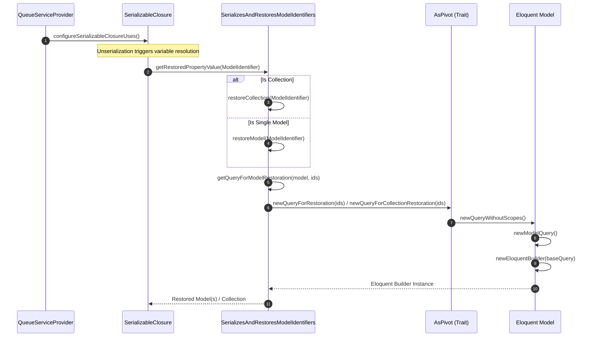
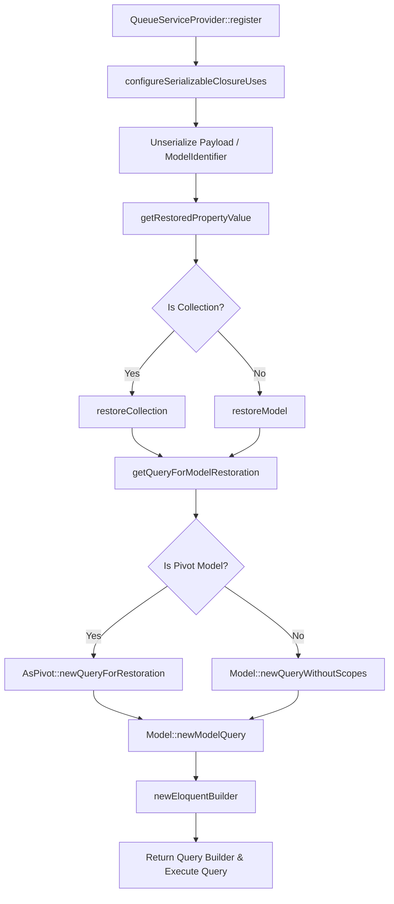

# Eloquent Model Registration Pipeline

Relevant source files

The following files were used as context for generating this wiki page:

- [src/Illuminate/Queue/QueueServiceProvider.php](https://github.com/laravel/framework/blob/main/src/Illuminate/Queue/QueueServiceProvider.php)
- [src/Illuminate/Queue/SerializesAndRestoresModelIdentifiers.php](https://github.com/laravel/framework/blob/main/src/Illuminate/Queue/SerializesAndRestoresModelIdentifiers.php)
- [src/Illuminate/Database/Eloquent/Relations/Concerns/AsPivot.php](https://github.com/laravel/framework/blob/main/src/Illuminate/Database/Eloquent/Relations/Concerns/AsPivot.php)
- [src/Illuminate/Database/Eloquent/Model.php](https://github.com/laravel/framework/blob/main/src/Illuminate/Database/Eloquent/Model.php)

## Overview

### Introduction
The execution flow from **Register -> NewEloquentBuilder** traces how Laravel initializes queue serialization capabilities and later uses them to restore Eloquent models or collections from serialized identifiers (such as when processing queued jobs containing Eloquent models). The process begins inside the queue service provider during application bootstrapping, configuring how closures resolve use-variables, and culminates in the instantiation of an Eloquent query builder during model restoration.

Sources: [src/Illuminate/Queue/QueueServiceProvider.php:37-71](https://github.com/laravel/framework/blob/main/src/Illuminate/Queue/QueueServiceProvider.php#L37-L71), [src/Illuminate/Queue/SerializesAndRestoresModelIdentifiers.php:50-127](https://github.com/laravel/framework/blob/main/src/Illuminate/Queue/SerializesAndRestoresModelIdentifiers.php#L50-L127)

---

## Step-by-Step Execution Flow

### Step 1: Register Queue Service Provider
When the Laravel application boots, `QueueServiceProvider::register()` is invoked. This method serves as the entry point for binding core queue services into the service container and setting up serialization handlers.

Sources: [src/Illuminate/Queue/QueueServiceProvider.php:37-47](https://github.com/laravel/framework/blob/main/src/Illuminate/Queue/QueueServiceProvider.php#L37-L47)

### Step 2: Configure Serializable Closure Uses
Inside `register()`, `configureSerializableClosureUses()` is called. It configures `SerializableClosure` hooks to transform and resolve captured variables in closures. Specifically, the resolution hook registers a callback that delegates deserialized property values to `getRestoredPropertyValue()`.

Sources: [src/Illuminate/Queue/QueueServiceProvider.php:54-71](https://github.com/laravel/framework/blob/main/src/Illuminate/Queue/QueueServiceProvider.php#L54-L71)

### Step 3: Get Restored Property Value
When a serialized payload containing a `ModelIdentifier` is unserialized, `getRestoredPropertyValue()` checks the type of identifier. If the identifier points to a collection or a single model, it delegates further processing to collection restoration or model restoration methods, ultimately calling `getQueryForModelRestoration()`.

Sources: [src/Illuminate/Queue/SerializesAndRestoresModelIdentifiers.php:50-64](https://github.com/laravel/framework/blob/main/src/Illuminate/Queue/SerializesAndRestoresModelIdentifiers.php#L50-L64)

### Step 4: Restore Collection
If the model identifier represents multiple IDs, `restoreCollection()` initiates the restoration process by inspecting the model class and preparing a query to retrieve all matching records from the database.

Sources: [src/Illuminate/Queue/SerializesAndRestoresModelIdentifiers.php:72-85](https://github.com/laravel/framework/blob/main/src/Illuminate/Queue/SerializesAndRestoresModelIdentifiers.php#L72-L85)

### Step 5: Get Query For Model Restoration
The `getQueryForModelRestoration()` method acts as a bridge wrapper, taking a fresh instance of the target model (with its connection configured) and invoking its restoration query builder method.

Sources: [src/Illuminate/Queue/SerializesAndRestoresModelIdentifiers.php:124-127](https://github.com/laravel/framework/blob/main/src/Illuminate/Queue/SerializesAndRestoresModelIdentifiers.php#L124-L127)

### Step 6: Pivot Model Restoration Query
If the target model uses the `AsPivot` trait, `newQueryForRestoration()` intercepts the call to handle pivot-specific composite keys or primary keys appropriately, delegating to collection restoration or standard query building.

Sources: [src/Illuminate/Database/Eloquent/Relations/Concerns/AsPivot.php:298-313](https://github.com/laravel/framework/blob/main/src/Illuminate/Database/Eloquent/Relations/Concerns/AsPivot.php#L298-L313)

### Step 7: Pivot Collection Restoration Query
For pivot collections, `newQueryForCollectionRestoration()` parses composite key segments (such as foreign and related keys) and constructs an inclusive `orWhere` query clause without global scopes.

Sources: [src/Illuminate/Database/Eloquent/Relations/Concerns/AsPivot.php:321-341](https://github.com/laravel/framework/blob/main/src/Illuminate/Database/Eloquent/Relations/Concerns/AsPivot.php#L321-L341)

### Step 8: New Query Without Scopes
Standard models rely on `newQueryWithoutScopes()` defined on `Model`, which initializes a base model query and applies eager loading or relationship configurations without standard global constraints.

Sources: [src/Illuminate/Database/Eloquent/Model.php:1894-1899](https://github.com/laravel/framework/blob/main/src/Illuminate/Database/Eloquent/Model.php#L1894-L1899)

### Step 9: New Model Query
The `newModelQuery()` method constructs an Eloquent builder instance by combining a base database query builder with the target Eloquent model instance.

Sources: [src/Illuminate/Database/Eloquent/Model.php:1857-1862](https://github.com/laravel/framework/blob/main/src/Illuminate/Database/Eloquent/Model.php#L1857-L1862)

### Step 10: New Eloquent Builder
Finally, `newEloquentBuilder()` resolves any custom builder classes defined via attributes or defaults to standard Eloquent `Builder`, instantiating and returning the fully configured query builder ready to fetch the restored models from the database.

Sources: [src/Illuminate/Database/Eloquent/Model.php:1929-1938](https://github.com/laravel/framework/blob/main/src/Illuminate/Database/Eloquent/Model.php#L1929-L1938)

---

## Architecture Diagrams

### Sequence Diagram

Sources: [src/Illuminate/Queue/QueueServiceProvider.php:37-71](https://github.com/laravel/framework/blob/main/src/Illuminate/Queue/QueueServiceProvider.php#L37-L71), [src/Illuminate/Queue/SerializesAndRestoresModelIdentifiers.php:50-127](https://github.com/laravel/framework/blob/main/src/Illuminate/Queue/SerializesAndRestoresModelIdentifiers.php#L50-L127), [src/Illuminate/Database/Eloquent/Relations/Concerns/AsPivot.php:298-341](https://github.com/laravel/framework/blob/main/src/Illuminate/Database/Eloquent/Relations/Concerns/AsPivot.php#L298-L341), [src/Illuminate/Database/Eloquent/Model.php:1857-1938](https://github.com/laravel/framework/blob/main/src/Illuminate/Database/Eloquent/Model.php#L1857-L1938)

### Flowchart

Sources: [src/Illuminate/Queue/QueueServiceProvider.php:37-71](https://github.com/laravel/framework/blob/main/src/Illuminate/Queue/QueueServiceProvider.php#L37-L71), [src/Illuminate/Queue/SerializesAndRestoresModelIdentifiers.php:50-127](https://github.com/laravel/framework/blob/main/src/Illuminate/Queue/SerializesAndRestoresModelIdentifiers.php#L50-L127), [src/Illuminate/Database/Eloquent/Relations/Concerns/AsPivot.php:298-341](https://github.com/laravel/framework/blob/main/src/Illuminate/Database/Eloquent/Relations/Concerns/AsPivot.php#L298-L341), [src/Illuminate/Database/Eloquent/Model.php:1857-1938](https://github.com/laravel/framework/blob/main/src/Illuminate/Database/Eloquent/Model.php#L1857-L1938)

---

## Key Observations

- **Cross-Module Boundaries:** This execution path seamlessly bridges the `Illuminate\Queue` component (handling job payload serialization and restoration hooks) with the `Illuminate\Database\Eloquent` component (handling model instantiation, scoping, and query building).
- **Specialized Pivot Handling:** Intermediate table models (`Pivot`) utilizing the `AsPivot` trait require custom query restoration logic due to composite primary keys or serialized key segments, which is automatically invoked instead of standard single-key lookups.
- **Builder Customization:** The final step (`newEloquentBuilder`) respects custom query builder attributes defined on models via `UseEloquentBuilder`, ensuring domain-specific query scopes remain intact when jobs are processed.

Sources: [src/Illuminate/Queue/SerializesAndRestoresModelIdentifiers.php:72-113](https://github.com/laravel/framework/blob/main/src/Illuminate/Queue/SerializesAndRestoresModelIdentifiers.php#L72-L113), [src/Illuminate/Database/Eloquent/Relations/Concerns/AsPivot.php:298-341](https://github.com/laravel/framework/blob/main/src/Illuminate/Database/Eloquent/Relations/Concerns/AsPivot.php#L298-L341), [src/Illuminate/Database/Eloquent/Model.php:1929-1938](https://github.com/laravel/framework/blob/main/src/Illuminate/Database/Eloquent/Model.php#L1929-L1938)
