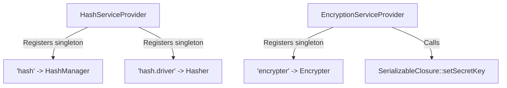

# Encryption & Hashing

<details>
<summary>Relevant source files</summary>

The following files were used as context for generating this wiki page:

- [src/Illuminate/Encryption/Encrypter.php](https://github.com/laravel/framework/blob/main/src/Illuminate/Encryption/Encrypter.php)
- [src/Illuminate/Cookie/Middleware/EncryptCookies.php](https://github.com/laravel/framework/blob/main/src/Illuminate/Cookie/Middleware/EncryptCookies.php)
- [src/Illuminate/Auth/Passwords/DatabaseTokenRepository.php](https://github.com/laravel/framework/blob/main/src/Illuminate/Auth/Passwords/DatabaseTokenRepository.php)
- [src/Illuminate/Foundation/Application.php](https://github.com/laravel/framework/blob/main/src/Illuminate/Foundation/Application.php)
- [src/Illuminate/Database/Eloquent/Concerns/HasAttributes.php](https://github.com/laravel/framework/blob/main/src/Illuminate/Database/Eloquent/Concerns/HasAttributes.php)
- [src/Illuminate/Hashing/ArgonHasher.php](https://github.com/laravel/framework/blob/main/src/Illuminate/Hashing/ArgonHasher.php)
- [src/Illuminate/Auth/Passwords/CacheTokenRepository.php](https://github.com/laravel/framework/blob/main/src/Illuminate/Auth/Passwords/CacheTokenRepository.php)
- [src/Illuminate/Validation/NotPwnedVerifier.php](https://github.com/laravel/framework/blob/main/src/Illuminate/Validation/NotPwnedVerifier.php)
- [src/Illuminate/Hashing/BcryptHasher.php](https://github.com/laravel/framework/blob/main/src/Illuminate/Hashing/BcryptHasher.php)
- [src/Illuminate/Hashing/HashManager.php](https://github.com/laravel/framework/blob/main/src/Illuminate/Hashing/HashManager.php)
- [src/Illuminate/Auth/Passwords/PasswordBroker.php](https://github.com/laravel/framework/blob/main/src/Illuminate/Auth/Passwords/PasswordBroker.php)
- [src/Illuminate/Hashing/HashServiceProvider.php](https://github.com/laravel/framework/blob/main/src/Illuminate/Hashing/HashServiceProvider.php)
- [src/Illuminate/Encryption/EncryptionServiceProvider.php](https://github.com/laravel/framework/blob/main/src/Illuminate/Encryption/EncryptionServiceProvider.php)
- [src/Illuminate/Contracts/Hashing/Hasher.php](https://github.com/laravel/framework/blob/main/src/Illuminate/Contracts/Hashing/Hasher.php)
- [src/Illuminate/Hashing/AbstractHasher.php](https://github.com/laravel/framework/blob/main/src/Illuminate/Hashing/AbstractHasher.php)
- [src/Illuminate/Support/Facades/Hash.php](https://github.com/laravel/framework/blob/main/src/Illuminate/Support/Facades/Hash.php)
- [src/Illuminate/Hashing/composer.json](https://github.com/laravel/framework/blob/main/src/Illuminate/Hashing/composer.json)
- [config/hashing.php](https://github.com/laravel/framework/blob/main/config/hashing.php)
- [src/Illuminate/Session/EncryptedStore.php](https://github.com/laravel/framework/blob/main/src/Illuminate/Session/EncryptedStore.php)
- [src/Illuminate/Contracts/Encryption/Encrypter.php](https://github.com/laravel/framework/blob/main/src/Illuminate/Contracts/Encryption/Encrypter.php)
- [src/Illuminate/Contracts/Encryption/StringEncrypter.php](https://github.com/laravel/framework/blob/main/src/Illuminate/Contracts/Encryption/StringEncrypter.php)
</details>

## Overview

The encryption and hashing subsystems in Laravel provide robust cryptographic primitives designed to protect sensitive application data, secure user authentication credentials, and maintain data integrity across requests and storage layers. By offering unified contract abstractions, flexible driver architectures, and seamless integration with core components like middleware, sessions, and Eloquent models, these components shield applications from common vulnerabilities such as plaintext exposure, tampering, and brute-force attacks. Sources: [src/Illuminate/Encryption/Encrypter.php:11-414](https://github.com/laravel/framework/blob/main/src/Illuminate/Encryption/Encrypter.php#L11-L414), [src/Illuminate/Hashing/HashManager.php:11-128](https://github.com/laravel/framework/blob/main/src/Illuminate/Hashing/HashManager.php#L11-L128)

## Contracts and Core Security Interfaces

### Contracts and Core Security Interfaces

The hashing and encryption contracts define the strict architectural boundaries for security services within the framework. The `Illuminate\Contracts\Hashing\Hasher` contract governs password hashing operations, requiring methods to retrieve hash metadata via `info($hashedValue)`, generate secure hashes via `make($value, array $options = [])`, verify plain strings against hashes via `check($value, $hashedValue, array $options = [])`, and evaluate whether cost factors or algorithm parameters require updating via `needsRehash($hashedValue, array $options = [])`. Parameters intended to carry plaintext secrets are explicitly annotated with PHP's `#[\SensitiveParameter]` attribute across both the hashing and encryption contracts. Sources: [src/Illuminate/Contracts/Hashing/Hasher.php:5-42](https://github.com/laravel/framework/blob/main/src/Illuminate/Contracts/Hashing/Hasher.php#L5-L42)

```php
interface Hasher
{
    public function info($hashedValue);
    public function make(#[\SensitiveParameter] $value, array $options = []);
    public function check(#[\SensitiveParameter] $value, $hashedValue, array $options = []);
    public function needsRehash($hashedValue, array $options = []);
}
```
Sources: [src/Illuminate/Contracts/Hashing/Hasher.php:5-42](https://github.com/laravel/framework/blob/main/src/Illuminate/Contracts/Hashing/Hasher.php#L5-L42)

Payload encryption is structured across two dedicated interfaces: `Encrypter` and `StringEncrypter`. The `Encrypter` contract handles arbitrary mixed types with optional PHP serialization via `encrypt($value, $serialize = true)` and `decrypt($payload, $unserialize = true)`, while providing key introspection methods including `getKey()`, `getAllKeys()`, and `getPreviousKeys()`. The `StringEncrypter` contract restricts operations strictly to string payloads without serialization or unserialization overhead through `encryptString($value)` and `decryptString($payload)`. Both encryption contracts declare `EncryptException` and `DecryptException` error branches for cryptographic failures. Sources: [src/Illuminate/Contracts/Encryption/Encrypter.php:5-49](https://github.com/laravel/framework/blob/main/src/Illuminate/Contracts/Encryption/Encrypter.php#L5-L49), [src/Illuminate/Contracts/Encryption/StringEncrypter.php:5-25](https://github.com/laravel/framework/blob/main/src/Illuminate/Contracts/Encryption/StringEncrypter.php#L5-L25)

```php
interface Encrypter
{
    public function encrypt(#[\SensitiveParameter] $value, $serialize = true);
    public function decrypt($payload, $unserialize = true);
    public function getKey();
    public function getAllKeys();
    public function getPreviousKeys();
}
```
Sources: [src/Illuminate/Contracts/Encryption/Encrypter.php:5-49](https://github.com/laravel/framework/blob/main/src/Illuminate/Contracts/Encryption/Encrypter.php#L5-L49)

Static facade access to the hashing container binding is provided by the `Hash` facade, resolving to the `'hash'` accessor and documenting driver creation methods for Bcrypt and Argon variants alongside standard hashing execution signatures. Sources: [src/Illuminate/Support/Facades/Hash.php:5-36](https://github.com/laravel/framework/blob/main/src/Illuminate/Support/Facades/Hash.php#L5-L36)

## Symmetric Encryption and Key Management

### Overview

The `Illuminate\Encryption\Encrypter` class implements symmetric payload encryption, initialization vector generation, message authentication code (MAC) verification, and multi-key rotation routines. It supports both standard CBC block cipher modes and Authenticated Encryption with Associated Data (AEAD) GCM cipher modes. Sources: [src/Illuminate/Encryption/Encrypter.php:11-44](https://github.com/laravel/framework/blob/main/src/Illuminate/Encryption/Encrypter.php#L11-L44)

Supported cipher algorithms and their configuration properties are registered internally:

| Cipher | Key Size (Bytes) | AEAD Support | Sources |
| :--- | :--- | :--- | :--- |
| `aes-128-cbc` | 16 | `false` | [src/Illuminate/Encryption/Encrypter.php:40-40](https://github.com/laravel/framework/blob/main/src/Illuminate/Encryption/Encrypter.php#L40-L40) |
| `aes-256-cbc` | 32 | `false` | [src/Illuminate/Encryption/Encrypter.php:41-41](https://github.com/laravel/framework/blob/main/src/Illuminate/Encryption/Encrypter.php#L41-L41) |
| `aes-128-gcm` | 16 | `true` | [src/Illuminate/Encryption/Encrypter.php:42-42](https://github.com/laravel/framework/blob/main/src/Illuminate/Encryption/Encrypter.php#L42-L42) |
| `aes-256-gcm` | 32 | `true` | [src/Illuminate/Encryption/Encrypter.php:43-43](https://github.com/laravel/framework/blob/main/src/Illuminate/Encryption/Encrypter.php#L43-L43) |

Sources: [src/Illuminate/Encryption/Encrypter.php:39-44](https://github.com/laravel/framework/blob/main/src/Illuminate/Encryption/Encrypter.php#L39-L44)

### Encryption Call-Chain Execution

When encrypting a value via `encrypt()`, data flows through a strict sequence of cryptographic operations:

1. `random_bytes()` generates an initialization vector (`$iv`) matching the cipher's required IV length via `openssl_cipher_iv_length()`. Sources: [src/Illuminate/Encryption/Encrypter.php:106-106](https://github.com/laravel/framework/blob/main/src/Illuminate/Encryption/Encrypter.php#L106-L106)
2. `serialize()` optionally serializes the input value if serialization is enabled, which is then encrypted using `openssl_encrypt()` alongside the cipher, secret key, IV, and passing an authentication tag by reference. Sources: [src/Illuminate/Encryption/Encrypter.php:108-111](https://github.com/laravel/framework/blob/main/src/Illuminate/Encryption/Encrypter.php#L108-L111)
3. An `EncryptException` is thrown if `openssl_encrypt()` returns `false`. Sources: [src/Illuminate/Encryption/Encrypter.php:113-115](https://github.com/laravel/framework/blob/main/src/Illuminate/Encryption/Encrypter.php#L113-L115)
4. The IV and authentication tag are encoded using `base64_encode()`. Sources: [src/Illuminate/Encryption/Encrypter.php:117-118](https://github.com/laravel/framework/blob/main/src/Illuminate/Encryption/Encrypter.php#L117-L118)
5. Non-AEAD ciphers compute a message authentication code via `$this->hash()`, running `hash_hmac('sha256', $iv.$value, $key)`, whereas AEAD ciphers set the MAC to an empty string because the authentication tag is handled directly by `openssl_encrypt()`. Sources: [src/Illuminate/Encryption/Encrypter.php:120-122](https://github.com/laravel/framework/blob/main/src/Illuminate/Encryption/Encrypter.php#L120-L122), [src/Illuminate/Encryption/Encrypter.php:228-231](https://github.com/laravel/framework/blob/main/src/Illuminate/Encryption/Encrypter.php#L228-L231)
6. A JSON payload array containing `'iv'`, `'value'`, `'mac'`, and `'tag'` is encoded via `json_encode()` with `JSON_UNESCAPED_SLASHES`, and finally base64-encoded as the return value. Sources: [src/Illuminate/Encryption/Encrypter.php:124-130](https://github.com/laravel/framework/blob/main/src/Illuminate/Encryption/Encrypter.php#L124-L130)

> [!WARNING]
> For non-AEAD ciphers like `aes-128-cbc`, integrity relies entirely on HMAC-SHA256 verification of `$iv.$value`. Omitting the MAC or altering payload components triggers an immediate `DecryptException`. Sources: [src/Illuminate/Encryption/Encrypter.php:120-122](https://github.com/laravel/framework/blob/main/src/Illuminate/Encryption/Encrypter.php#L120-L122), [src/Illuminate/Encryption/Encrypter.php:190-192](https://github.com/laravel/framework/blob/main/src/Illuminate/Encryption/Encrypter.php#L190-L192)

Sources: [src/Illuminate/Encryption/Encrypter.php:104-131](https://github.com/laravel/framework/blob/main/src/Illuminate/Encryption/Encrypter.php#L104-L131)

### Decryption Handling and Key Rotation

Decryption routines executed via `decrypt()` process incoming payloads through structure validation, tag verification, and multi-key iteration:

1. `getJsonPayload()` decodes the base64 payload, parses the JSON structure, and validates that required keys (`'iv'`, `'value'`, `'mac'`) exist as strings with a valid IV length matching the selected cipher. Sources: [src/Illuminate/Encryption/Encrypter.php:157-157](https://github.com/laravel/framework/blob/main/src/Illuminate/Encryption/Encrypter.php#L157-L157), [src/Illuminate/Encryption/Encrypter.php:241-282](https://github.com/laravel/framework/blob/main/src/Illuminate/Encryption/Encrypter.php#L241-L282)
2. `ensureTagIsValid()` verifies that GCM tags are exactly 16 bytes long when AEAD is enabled, or throws a `DecryptException` if a tag is provided to a non-AEAD cipher. Sources: [src/Illuminate/Encryption/Encrypter.php:161-163](https://github.com/laravel/framework/blob/main/src/Illuminate/Encryption/Encrypter.php#L161-L163), [src/Illuminate/Encryption/Encrypter.php:317-326](https://github.com/laravel/framework/blob/main/src/Illuminate/Encryption/Encrypter.php#L317-L326)
3. `getAllKeys()` merges the primary active key (`$this->key`) with configured legacy keys (`$this->previousKeys`) to iterate over during decryption attempts. Sources: [src/Illuminate/Encryption/Encrypter.php:165-165](https://github.com/laravel/framework/blob/main/src/Illuminate/Encryption/Encrypter.php#L165-L165), [src/Illuminate/Encryption/Encrypter.php:377-380](https://github.com/laravel/framework/blob/main/src/Illuminate/Encryption/Encrypter.php#L377-L380)
4. For non-AEAD ciphers, `shouldValidateMac()` evaluates to true, causing the loop to test `validMacForKey()` against each key until a matching MAC is located. For AEAD ciphers, it iterates through keys attempting `openssl_decrypt()` until a decryption succeeds without failure. Sources: [src/Illuminate/Encryption/Encrypter.php:170-188](https://github.com/laravel/framework/blob/main/src/Illuminate/Encryption/Encrypter.php#L170-L188), [src/Illuminate/Encryption/Encrypter.php:333-336](https://github.com/laravel/framework/blob/main/src/Illuminate/Encryption/Encrypter.php#L333-L336)
5. Unserialization is conditionally executed if `$unserialize` is true before returning the decrypted data. Sources: [src/Illuminate/Encryption/Encrypter.php:204-204](https://github.com/laravel/framework/blob/main/src/Illuminate/Encryption/Encrypter.php#L204-L204)

> [!TIP]
> Configuring previous keys via `previousKeys(array $keys)` allows applications to seamlessly rotate primary encryption keys without invalidating existing user sessions or stored database payloads encrypted under legacy keys. Sources: [src/Illuminate/Encryption/Encrypter.php:393-413](https://github.com/laravel/framework/blob/main/src/Illuminate/Encryption/Encrypter.php#L393-L413)

Sources: [src/Illuminate/Encryption/Encrypter.php:147-205](https://github.com/laravel/framework/blob/main/src/Illuminate/Encryption/Encrypter.php#L147-L205)

### Design Trade-Offs

| Design Choice | Benefit | Cost | Sources |
| :--- | :--- | :--- | :--- |
| JSON payload wrapping of IV, value, MAC, and tag | Encapsulates all ciphertext metadata into a single transportable string structure | Requires JSON encoding, decoding, and base64 overhead per operation | [src/Illuminate/Encryption/Encrypter.php:124-130](https://github.com/laravel/framework/blob/main/src/Illuminate/Encryption/Encrypter.php#L124-L130), [src/Illuminate/Encryption/Encrypter.php:247-247](https://github.com/laravel/framework/blob/main/src/Illuminate/Encryption/Encrypter.php#L247-L247) |
| Multi-key iteration fallback array | Enables smooth zero-downtime key rotation across primary and previous keys | Increases decryption latency proportional to the number of registered legacy keys | [src/Illuminate/Encryption/Encrypter.php:165-188](https://github.com/laravel/framework/blob/main/src/Illuminate/Encryption/Encrypter.php#L165-L188), [src/Illuminate/Encryption/Encrypter.php:377-380](https://github.com/laravel/framework/blob/main/src/Illuminate/Encryption/Encrypter.php#L377-L380) |
| Conditional MAC validation branch | Supports both authenticated MAC-appended CBC modes and native AEAD GCM modes | Adds runtime conditional checks on cipher properties during execution paths | [src/Illuminate/Encryption/Encrypter.php:120-122](https://github.com/laravel/framework/blob/main/src/Illuminate/Encryption/Encrypter.php#L120-L122), [src/Illuminate/Encryption/Encrypter.php:333-336](https://github.com/laravel/framework/blob/main/src/Illuminate/Encryption/Encrypter.php#L333-L336) |

Sources: [src/Illuminate/Encryption/Encrypter.php:120-130](https://github.com/laravel/framework/blob/main/src/Illuminate/Encryption/Encrypter.php#L120-L130), [src/Illuminate/Encryption/Encrypter.php:165-188](https://github.com/laravel/framework/blob/main/src/Illuminate/Encryption/Encrypter.php#L165-L188), [src/Illuminate/Encryption/Encrypter.php:333-336](https://github.com/laravel/framework/blob/main/src/Illuminate/Encryption/Encrypter.php#L333-L336), [src/Illuminate/Encryption/Encrypter.php:377-380](https://github.com/laravel/framework/blob/main/src/Illuminate/Encryption/Encrypter.php#L377-L380)

## Password Hashing and Driver Architecture

### Overview

The hashing subsystem revolves around `HashManager`, which extends Illuminate's `Manager` class to resolve driver instances dynamically based on application configuration. Supported drivers include `bcrypt`, `argon` (Argon2i), and `argon2id`. Each concrete hasher extends `AbstractHasher` and implements the `HasherContract` interface, encapsulating PHP's native password hashing functions with customizable work factors, thread counts, memory limits, and verification safeguards. Sources: [src/Illuminate/Hashing/HashManager.php:6-42](https://github.com/laravel/framework/blob/main/src/Illuminate/Hashing/HashManager.php#L6-L42), [src/Illuminate/Hashing/AbstractHasher.php:5-10](https://github.com/laravel/framework/blob/main/src/Illuminate/Hashing/AbstractHasher.php#L5-L10), [src/Illuminate/Hashing/BcryptHasher.php:10-11](https://github.com/laravel/framework/blob/main/src/Illuminate/Hashing/BcryptHasher.php#L10-L11), [src/Illuminate/Hashing/ArgonHasher.php:9-10](https://github.com/laravel/framework/blob/main/src/Illuminate/Hashing/ArgonHasher.php#L9-L10)

### HashManager Driver Resolution and Configuration

`HashManager` reads the default driver name from `hashing.driver`, falling back to `bcrypt`. Driver factories instantiate `BcryptHasher`, `ArgonHasher`, or `Argon2IdHasher` by pulling array configurations from `hashing.bcrypt` or `hashing.argon`. Methods such as `make`, `check`, `needsRehash`, `info`, and `verifyConfiguration` delegate directly to the underlying driver resolved by `$this->driver()`. Sources: [src/Illuminate/Hashing/HashManager.php:18-41](https://github.com/laravel/framework/blob/main/src/Illuminate/Hashing/HashManager.php#L18-L41), [src/Illuminate/Hashing/HashManager.php:49-127](https://github.com/laravel/framework/blob/main/src/Illuminate/Hashing/HashManager.php#L49-L127), [config/hashing.php:18-53](https://github.com/laravel/framework/blob/main/config/hashing.php#L18-L53)

| Driver Name | Factory Method | Concrete Class | Default Config Array | Sources |
| :--- | :--- | :--- | :--- | :--- |
| `bcrypt` | `createBcryptDriver()` | `BcryptHasher` | `hashing.bcrypt` | [src/Illuminate/Hashing/HashManager.php:18-21](https://github.com/laravel/framework/blob/main/src/Illuminate/Hashing/HashManager.php#L18-L21), [config/hashing.php:31-35](https://github.com/laravel/framework/blob/main/config/hashing.php#L31-L35) |
| `argon` | `createArgonDriver()` | `ArgonHasher` | `hashing.argon` | [src/Illuminate/Hashing/HashManager.php:28-31](https://github.com/laravel/framework/blob/main/src/Illuminate/Hashing/HashManager.php#L28-L31), [config/hashing.php:48-53](https://github.com/laravel/framework/blob/main/config/hashing.php#L48-L53) |
| `argon2id` | `createArgon2idDriver()` | `Argon2IdHasher` | `hashing.argon` | [src/Illuminate/Hashing/HashManager.php:38-41](https://github.com/laravel/framework/blob/main/src/Illuminate/Hashing/HashManager.php#L38-L41), [config/hashing.php:48-53](https://github.com/laravel/framework/blob/main/config/hashing.php#L48-L53) |

Sources: [src/Illuminate/Hashing/HashManager.php:18-41](https://github.com/laravel/framework/blob/main/src/Illuminate/Hashing/HashManager.php#L18-L41), [config/hashing.php:31-53](https://github.com/laravel/framework/blob/main/config/hashing.php#L31-L53)

### Bcrypt and Argon2 Driver Implementations

`BcryptHasher` accepts configuration options for `rounds`, `verify`, and byte string `limit`. Its `make()` method validates string length against `$this->limit` before calling PHP's `password_hash()` with `PASSWORD_BCRYPT` and the resolved cost factor. If an `Error` is thrown due to unsupported algorithms, it wraps it in a `RuntimeException`. Sources: [src/Illuminate/Hashing/BcryptHasher.php:38-70](https://github.com/laravel/framework/blob/main/src/Illuminate/Hashing/BcryptHasher.php#L38-L70), [config/hashing.php:31-35](https://github.com/laravel/framework/blob/main/config/hashing.php#L31-L35)

`ArgonHasher` and `Argon2IdHasher` manage `memory`, `time`, `threads`, and `verify` options. The `threads()` method forces thread count to `1` if `PASSWORD_ARGON2_PROVIDER` equals `'sodium'`. During hashing via `make()`, they pass `memory_cost`, `time_cost`, and `threads` options alongside `PASSWORD_ARGON2I` or `PASSWORD_ARGON2ID` algorithms into `password_hash()`. Sources: [src/Illuminate/Hashing/ArgonHasher.php:44-74](https://github.com/laravel/framework/blob/main/src/Illuminate/Hashing/ArgonHasher.php#L44-L74), [src/Illuminate/Hashing/ArgonHasher.php:242-249](https://github.com/laravel/framework/blob/main/src/Illuminate/Hashing/ArgonHasher.php#L242-L249), [src/Illuminate/Hashing/HashManager.php:38-41](https://github.com/laravel/framework/blob/main/src/Illuminate/Hashing/HashManager.php#L38-L41), [config/hashing.php:48-53](https://github.com/laravel/framework/blob/main/config/hashing.php#L48-L53)

> [!WARNING]
> When `verify` is enabled in driver configurations, calling `check()` on a hash generated with an unexpected algorithm throws a `RuntimeException` rather than returning false. Sources: [src/Illuminate/Hashing/ArgonHasher.php:102-104](https://github.com/laravel/framework/blob/main/src/Illuminate/Hashing/ArgonHasher.php#L102-L104), [src/Illuminate/Hashing/BcryptHasher.php:88-90](https://github.com/laravel/framework/blob/main/src/Illuminate/Hashing/BcryptHasher.php#L88-L90)

Sources: [src/Illuminate/Hashing/BcryptHasher.php:10-70](https://github.com/laravel/framework/blob/main/src/Illuminate/Hashing/BcryptHasher.php#L10-L70), [src/Illuminate/Hashing/ArgonHasher.php:9-74](https://github.com/laravel/framework/blob/main/src/Illuminate/Hashing/ArgonHasher.php#L9-L74)

## Service Provider Bootstrapping and Configuration

### Overview

The service provider architecture bridges configuration files and service resolution within the container. `HashServiceProvider` implements `DeferrableProvider` and registers two container singletons: `'hash'` mapping to a `HashManager` instance, and `'hash.driver'` resolving the active driver via `$app['hash']->driver()`. Its provided services are explicitly returned as `['hash', 'hash.driver']`. Sources: [src/Illuminate/Hashing/HashServiceProvider.php:8-34](https://github.com/laravel/framework/blob/main/src/Illuminate/Hashing/HashServiceProvider.php#L8-L34)



Sources: [src/Illuminate/Hashing/HashServiceProvider.php:16-24](https://github.com/laravel/framework/blob/main/src/Illuminate/Hashing/HashServiceProvider.php#L16-L24), [src/Illuminate/Encryption/EncryptionServiceProvider.php:16-20](https://github.com/laravel/framework/blob/main/src/Illuminate/Encryption/EncryptionServiceProvider.php#L16-L20)

### Encryption Configuration and Key Parsing

`EncryptionServiceProvider` registers both the primary payload encrypter and the global serializable closure security key. During the registration phase, `registerEncrypter()` binds `'encrypter'` as a singleton. It retrieves application configuration parameters, parses the primary key, instantiates `Encrypter`, and maps any `previous_keys` for decryption rotation. Simultaneously, `registerSerializableClosureSecurityKey()` checks if `SerializableClosure` exists and if an application key is present, assigning the parsed key via `SerializableClosure::setSecretKey()`. Sources: [src/Illuminate/Encryption/EncryptionServiceProvider.php:16-54](https://github.com/laravel/framework/blob/main/src/Illuminate/Encryption/EncryptionServiceProvider.php#L16-L54)

Key parsing handles both plain strings and base64-encoded secrets. The call-chain executes as follows: `parseKey()` calls `key()`, which retrieves `$config['key']` and validates that it is non-empty via `tap()`, throwing a `MissingAppKeyException` if empty; control returns to `parseKey()`, which checks if the key string begins with the `'base64:'` prefix using `Str::startsWith()`, and if matched, decodes the remainder via `base64_decode(Str::after($key, 'base64:'))`. Sources: [src/Illuminate/Encryption/EncryptionServiceProvider.php:57-86](https://github.com/laravel/framework/blob/main/src/Illuminate/Encryption/EncryptionServiceProvider.php#L57-L86)

> [!WARNING]
> If the application key configuration value is empty or missing, `EncryptionServiceProvider` throws a `MissingAppKeyException` immediately upon attempting to register the encrypter or closure security key. Sources: [src/Illuminate/Encryption/EncryptionServiceProvider.php:49-53](https://github.com/laravel/framework/blob/main/src/Illuminate/Encryption/EncryptionServiceProvider.php#L49-L53), [src/Illuminate/Encryption/EncryptionServiceProvider.php:79-86](https://github.com/laravel/framework/blob/main/src/Illuminate/Encryption/EncryptionServiceProvider.php#L79-L86)

Sources: [src/Illuminate/Encryption/EncryptionServiceProvider.php:9-87](https://github.com/laravel/framework/blob/main/src/Illuminate/Encryption/EncryptionServiceProvider.php#L9-L87), [src/Illuminate/Hashing/HashServiceProvider.php:8-35](https://github.com/laravel/framework/blob/main/src/Illuminate/Hashing/HashServiceProvider.php#L8-L35)

## Cookie and Session Data Encryption

### Overview

Laravel secures HTTP request cookies and session payloads by passing them through dedicated middleware and storage adapters that wrap the core encrypter contract. `EncryptCookies` intercepts incoming requests to decrypt cookies and outgoing responses to encrypt them, while respecting global and instance-level exclusion rules. Concurrently, `EncryptedStore` extends the base session store to automatically encrypt serialized state data prior to persistence in session storage handlers. Sources: [src/Illuminate/Cookie/Middleware/EncryptCookies.php:14-75](https://github.com/laravel/framework/blob/main/src/Illuminate/Cookie/Middleware/EncryptCookies.php#L14-L75), [src/Illuminate/Session/EncryptedStore.php:9-58](https://github.com/laravel/framework/blob/main/src/Illuminate/Session/EncryptedStore.php#L9-L58)

### Cookie Middleware Pipeline and Payload Validation

The cookie encryption middleware executes during the request-response lifecycle via the `handle()` method. The execution call-chain proceeds as follows: `handle()` calls `decrypt($request)`, which iterates through `$request->cookies` and checks `isDisabled($key)` — if disabled, it skips processing; otherwise it calls `decryptCookie($key, $cookie)`, validates the prefix with `validateValue($key, $value)`, and stores the result on the request. If decryption fails by throwing a `DecryptException`, the cookie value is set to `null`. On the return trip, `encrypt($response)` iterates through `$response->headers->getCookies()`, checks disable rules, prefixes the cookie value using `CookieValuePrefix::create()`, encrypts it via the encrypter, and duplicates the response cookie. Sources: [src/Illuminate/Cookie/Middleware/EncryptCookies.php:72-196](https://github.com/laravel/framework/blob/main/src/Illuminate/Cookie/Middleware/EncryptCookies.php#L72-L196)

> [!WARNING]
> When a cookie decryption attempt throws a `DecryptException`, `EncryptCookies` catches the exception and silently sets the cookie value on the request to `null` rather than terminating execution or propagating the failure. Sources: [src/Illuminate/Cookie/Middleware/EncryptCookies.php:90-96](https://github.com/laravel/framework/blob/main/src/Illuminate/Cookie/Middleware/EncryptCookies.php#L90-L96)

Sources: [src/Illuminate/Cookie/Middleware/EncryptCookies.php:14-196](https://github.com/laravel/framework/blob/main/src/Illuminate/Cookie/Middleware/EncryptCookies.php#L14-L196)

### Encrypted Session Store Persistence

`EncryptedStore` inherits from the standard session `Store` class and overrides storage preparation and unserialization methods to encrypt session payloads in-flight. When preparing session data for storage, `prepareForStorage($data)` passes the serialized string directly to `$this->encrypter->encrypt($data)`. Conversely, when retrieving stored data, `prepareForUnserialize($data)` executes a call-chain: it calls `$this->encrypter->decrypt($data)`, and if a `DecryptException` occurs, it falls back to returning a JSON-encoded or serialized empty array depending on the configured serialization format. Sources: [src/Illuminate/Session/EncryptedStore.php:9-58](https://github.com/laravel/framework/blob/main/src/Illuminate/Session/EncryptedStore.php#L9-L58)

| Method | Target Parameter | Return Type | Purpose | Sources |
| :--- | :--- | :--- | :--- | :--- |
| `prepareForStorage` | `string $data` | `string` | Encrypts raw session data strings before writing to the session handler. | [src/Illuminate/Session/EncryptedStore.php:50-58](https://github.com/laravel/framework/blob/main/src/Illuminate/Session/EncryptedStore.php#L50-L58) |
| `prepareForUnserialize` | `string $data` | `string` | Decrypts session data retrieved from the handler, falling back to an empty array payload on decryption failure. | [src/Illuminate/Session/EncryptedStore.php:34-47](https://github.com/laravel/framework/blob/main/src/Illuminate/Session/EncryptedStore.php#L34-L47) |
| `getEncrypter` | none | `\Illuminate\Contracts\Encryption\Encrypter` | Returns the underlying encrypter instance bound to the session store. | [src/Illuminate/Session/EncryptedStore.php:61-68](https://github.com/laravel/framework/blob/main/src/Illuminate/Session/EncryptedStore.php#L61-L68) |

Sources: [src/Illuminate/Session/EncryptedStore.php:9-69](https://github.com/laravel/framework/blob/main/src/Illuminate/Session/EncryptedStore.php#L9-L69)

## Model Attributes and Password Workflows

### Eloquent Attribute Encryption and Hashing Casting

Eloquent models provide built-in primitive and class-based casting mechanisms to automatically encrypt or hash attribute values during database persistence and retrieval. When an attribute is configured with `encrypted`, `encrypted:array`, `encrypted:collection`, `encrypted:json`, or `encrypted:object` cast types, Eloquent intercepts database write and read operations via `castAttributeAsEncryptedString()` and `fromEncryptedString()`. Write operations fetch the active encrypter through `currentEncrypter()`, which defaults to `Crypt::getFacadeRoot()` or a custom instance set via `encryptUsing()`. Sources: [src/Illuminate/Database/Eloquent/Concerns/HasAttributes.php:119-123](https://github.com/laravel/framework/blob/main/src/Illuminate/Database/Eloquent/Concerns/HasAttributes.php#L119-L123), [src/Illuminate/Database/Eloquent/Concerns/HasAttributes.php:1446-1482](https://github.com/laravel/framework/blob/main/src/Illuminate/Database/Eloquent/Concerns/HasAttributes.php#L1446-L1482)

Concurrently, attributes cast to `hashed` pass through `castAttributeAsHashedString()`, which evaluates whether the incoming value is already hashed using `Hash::isHashed()`. If unhashed, it invokes `Hash::make()` to generate a secured hash; if already hashed, it verifies configuration validity via `Hash::verifyConfiguration()`, throwing a `RuntimeException` if configuration verification fails. Sources: [src/Illuminate/Database/Eloquent/Concerns/HasAttributes.php:125](https://github.com/laravel/framework/blob/main/src/Illuminate/Database/Eloquent/Concerns/HasAttributes.php#L125), [src/Illuminate/Database/Eloquent/Concerns/HasAttributes.php:1485-1509](https://github.com/laravel/framework/blob/main/src/Illuminate/Database/Eloquent/Concerns/HasAttributes.php#L1485-L1509)

> [!WARNING]
> When comparing original and modified attribute values via `originalIsEquivalent()`, if an encrypted castable attribute is modified while previous keys exist on the encrypter (`getPreviousKeys()`), Eloquent immediately treats the values as non-equivalent (`false`) to force re-encryption under the current key. Sources: [src/Illuminate/Database/Eloquent/Concerns/HasAttributes.php:2375-2376](https://github.com/laravel/framework/blob/main/src/Illuminate/Database/Eloquent/Concerns/HasAttributes.php#L2375-L2376)

Sources: [src/Illuminate/Database/Eloquent/Concerns/HasAttributes.php:119-125](https://github.com/laravel/framework/blob/main/src/Illuminate/Database/Eloquent/Concerns/HasAttributes.php#L119-L125), [src/Illuminate/Database/Eloquent/Concerns/HasAttributes.php:1446-1509](https://github.com/laravel/framework/blob/main/src/Illuminate/Database/Eloquent/Concerns/HasAttributes.php#L1446-L1509), [src/Illuminate/Database/Eloquent/Concerns/HasAttributes.php:2375-2376](https://github.com/laravel/framework/blob/main/src/Illuminate/Database/Eloquent/Concerns/HasAttributes.php#L2375-L2376)

### Password Reset Token Hashing and Persistence

Password reset workflows rely on token repositories (`DatabaseTokenRepository` and `CacheTokenRepository`) that generate cryptographically secure tokens and persist them in a hashed format. When creating a token via `create()`, the repository executes a call-chain: `createNewToken()` invokes `hash_hmac('sha256', Str::random(40), $this->hashKey)` to generate the raw token string, after which `getPayload()` (or cache storage formatting) passes the token through `$this->hasher->make($token)` before database insertion. Sources: [src/Illuminate/Auth/Passwords/DatabaseTokenRepository.php:36-50](https://github.com/laravel/framework/blob/main/src/Illuminate/Auth/Passwords/DatabaseTokenRepository.php#L36-L50), [src/Illuminate/Auth/Passwords/DatabaseTokenRepository.php:70-73](https://github.com/laravel/framework/blob/main/src/Illuminate/Auth/Passwords/DatabaseTokenRepository.php#L70-L73), [src/Illuminate/Auth/Passwords/DatabaseTokenRepository.php:164-167](https://github.com/laravel/framework/blob/main/src/Illuminate/Auth/Passwords/DatabaseTokenRepository.php#L164-L167), [src/Illuminate/Auth/Passwords/CacheTokenRepository.php:37-50](https://github.com/laravel/framework/blob/main/src/Illuminate/Auth/Passwords/CacheTokenRepository.php#L37-L50)

Token validation occurs in `exists()`, executing the call-chain: it retrieves the persistent record, verifies that `! $this->tokenExpired($createdAt)` is true using Carbon parsing with configured expiration seconds (`$this->expires`), and finally executes `$this->hasher->check($token, $record['token'])` (or `$record` in cache storage) to validate the raw user-supplied token against the stored hash. Sources: [src/Illuminate/Auth/Passwords/DatabaseTokenRepository.php:82-91](https://github.com/laravel/framework/blob/main/src/Illuminate/Auth/Passwords/DatabaseTokenRepository.php#L82-L91), [src/Illuminate/Auth/Passwords/DatabaseTokenRepository.php:99-102](https://github.com/laravel/framework/blob/main/src/Illuminate/Auth/Passwords/DatabaseTokenRepository.php#L99-L102), [src/Illuminate/Auth/Passwords/CacheTokenRepository.php:59-66](https://github.com/laravel/framework/blob/main/src/Illuminate/Auth/Passwords/CacheTokenRepository.php#L59-L66), [src/Illuminate/Auth/Passwords/CacheTokenRepository.php:74-77](https://github.com/laravel/framework/blob/main/src/Illuminate/Auth/Passwords/CacheTokenRepository.php#L74-L77)

Sources: [src/Illuminate/Auth/Passwords/DatabaseTokenRepository.php:36-167](https://github.com/laravel/framework/blob/main/src/Illuminate/Auth/Passwords/DatabaseTokenRepository.php#L36-L167), [src/Illuminate/Auth/Passwords/CacheTokenRepository.php:37-77](https://github.com/laravel/framework/blob/main/src/Illuminate/Auth/Passwords/CacheTokenRepository.php#L37-L77)

### Breach Verification and API Range Queries

Laravel validates uncompromised passwords through `NotPwnedVerifier`, which implements the `UncompromisedVerifier` contract by querying the Have I Been Pwned API using k-anonymity range search. The verification workflow executes through `verify()`, which inspects input data for a `value` and a breach `threshold`. Sources: [src/Illuminate/Validation/NotPwnedVerifier.php:9-60](https://github.com/laravel/framework/blob/main/src/Illuminate/Validation/NotPwnedVerifier.php#L9-L60)

| Step | Method | Operation | Sources |
| :--- | :--- | :--- | :--- |
| 1 | `getHash` | Computes uppercase SHA-1 hash of the input string and extracts the first 5 characters as a prefix. | [src/Illuminate/Validation/NotPwnedVerifier.php:68-75](https://github.com/laravel/framework/blob/main/src/Illuminate/Validation/NotPwnedVerifier.php#L68-L75) |
| 2 | `search` | Sends an HTTP GET request to `https://api.pwnedpasswords.com/range/{hashPrefix}` with an `Add-Padding` header. | [src/Illuminate/Validation/NotPwnedVerifier.php:83-102](https://github.com/laravel/framework/blob/main/src/Illuminate/Validation/NotPwnedVerifier.php#L83-L102) |
| 3 | `verify` | Splits response lines into hash suffixes and exposure counts, verifying if any matching suffix exceeds the allowed threshold. | [src/Illuminate/Validation/NotPwnedVerifier.php:43-60](https://github.com/laravel/framework/blob/main/src/Illuminate/Validation/NotPwnedVerifier.php#L43-L60) |

Sources: [src/Illuminate/Validation/NotPwnedVerifier.php:9-103](https://github.com/laravel/framework/blob/main/src/Illuminate/Validation/NotPwnedVerifier.php#L9-L103)

## Related

- [[Authentication & Guards]]

