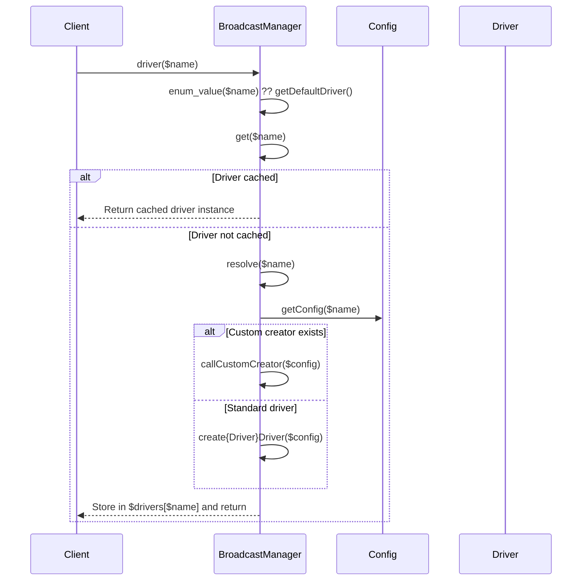

# Event Broadcasting

Relevant source files

The following files were used as context for generating this wiki page:

- [src/Illuminate/Foundation/Console/BroadcastingInstallCommand.php](https://github.com/laravel/framework/blob/main/src/Illuminate/Foundation/Console/BroadcastingInstallCommand.php)
- [src/Illuminate/Broadcasting/BroadcastManager.php](https://github.com/laravel/framework/blob/main/src/Illuminate/Broadcasting/BroadcastManager.php)
- [src/Illuminate/Broadcasting/Broadcasters/AblyBroadcaster.php](https://github.com/laravel/framework/blob/main/src/Illuminate/Broadcasting/Broadcasters/AblyBroadcaster.php)
- [src/Illuminate/Broadcasting/Broadcasters/RedisBroadcaster.php](https://github.com/laravel/framework/blob/main/src/Illuminate/Broadcasting/Broadcasters/RedisBroadcaster.php)
- [src/Illuminate/Broadcasting/BroadcastEvent.php](https://github.com/laravel/framework/blob/main/src/Illuminate/Broadcasting/BroadcastEvent.php)
- [src/Illuminate/Redis/Connections/Connection.php](https://github.com/laravel/framework/blob/main/src/Illuminate/Redis/Connections/Connection.php)
- [src/Illuminate/Events/Dispatcher.php](https://github.com/laravel/framework/blob/main/src/Illuminate/Events/Dispatcher.php)
- [src/Illuminate/Broadcasting/Broadcasters/PusherBroadcaster.php](https://github.com/laravel/framework/blob/main/src/Illuminate/Broadcasting/Broadcasters/PusherBroadcaster.php)
- [src/Illuminate/Foundation/Cloud/Events.php](https://github.com/laravel/framework/blob/main/src/Illuminate/Foundation/Cloud/Events.php)
- [config/broadcasting.php](https://github.com/laravel/framework/blob/main/config/broadcasting.php)
- [src/Illuminate/Support/Facades/Broadcast.php](https://github.com/laravel/framework/blob/main/src/Illuminate/Support/Facades/Broadcast.php)
- [src/Illuminate/Notifications/Channels/BroadcastChannel.php](https://github.com/laravel/framework/blob/main/src/Illuminate/Notifications/Channels/BroadcastChannel.php)
- [src/Illuminate/Broadcasting/Broadcasters/Broadcaster.php](https://github.com/laravel/framework/blob/main/src/Illuminate/Broadcasting/Broadcasters/Broadcaster.php)
- [src/Illuminate/Database/Eloquent/BroadcastableModelEventOccurred.php](https://github.com/laravel/framework/blob/main/src/Illuminate/Database/Eloquent/BroadcastableModelEventOccurred.php)
- [src/Illuminate/Contracts/Broadcasting/Broadcaster.php](https://github.com/laravel/framework/blob/main/src/Illuminate/Contracts/Broadcasting/Broadcaster.php)
- [src/Illuminate/Support/Facades/Redis.php](https://github.com/laravel/framework/blob/main/src/Illuminate/Support/Facades/Redis.php)
- [src/Illuminate/Container/Container.php](https://github.com/laravel/framework/blob/main/src/Illuminate/Container/Container.php)

## Overview

Event broadcasting in Laravel enables real-time application features by bridging server-side application events with client-side WebSocket technologies. When events marked for broadcasting are triggered, the event dispatcher automatically detects them and queues them as background jobs for efficient delivery. The framework abstracts underlying transport protocols through flexible driver implementations, supporting services and message brokers such as Pusher, Ably, and Redis. Furthermore, event broadcasting provides robust security and routing capabilities, ensuring that clients can securely authenticate against private and presence channels via HTTP authorization endpoints and route model binding. Developers can easily initialize and configure these infrastructure components using dedicated console installation commands and configuration files.

Sources: [BroadcastManager.php:79-93](https://github.com/laravel/framework/blob/main/src/Illuminate/Broadcasting/BroadcastManager.php#L79-L93), [BroadcastEvent.php:22-115](https://github.com/laravel/framework/blob/main/src/Illuminate/Broadcasting/BroadcastEvent.php#L22-L115), [Dispatcher.php:314-318](https://github.com/laravel/framework/blob/main/src/Illuminate/Events/Dispatcher.php#L314-L318), [BroadcastingInstallCommand.php:63-137](https://github.com/laravel/framework/blob/main/src/Illuminate/Foundation/Console/BroadcastingInstallCommand.php#L63-L137), [broadcasting.php:31-80](https://github.com/laravel/framework/blob/main/config/broadcasting.php#L31-L80)

## Broadcast Manager and Driver Resolution

### Overview

The `BroadcastManager` class acts as the central factory within the broadcasting subsystem, responsible for managing broadcaster connection instances, maintaining resolved driver caches, and resolving connections according to configuration files or runtime overrides. Implements the `FactoryContract` interface, the manager handles custom driver extensions, purging cached instances, and routing requests dynamically via its magic `__call` method.

Sources: [BroadcastManager.php:38-54](https://github.com/laravel/framework/blob/main/src/Illuminate/Broadcasting/BroadcastManager.php#L38-L54), [BroadcastManager.php:271-287](https://github.com/laravel/framework/blob/main/src/Illuminate/Broadcasting/BroadcastManager.php#L271-L287), [BroadcastManager.php:509-582](https://github.com/laravel/framework/blob/main/src/Illuminate/Broadcasting/BroadcastManager.php#L509-L582)

### Driver Resolution Flow

When a broadcaster connection is requested via `connection($name)` or `driver($name)`, the manager executes a specific resolution sequence to instantiate or retrieve the cached driver instance.

The call-chain execution flows as follows: `driver()` → `enum_value()` (falls back to `getDefaultDriver()`) → `get()` → `resolve()` → `getConfig()` → `create{Driver}Driver()`. 

During resolution, if a custom driver creator has been registered using the `extend()` method, `resolve()` intercepts the standard flow via `callCustomCreator()` before attempting convention-based method naming.

Sources: [BroadcastManager.php:260-321](https://github.com/laravel/framework/blob/main/src/Illuminate/Broadcasting/BroadcastManager.php#L260-L321), [BroadcastManager.php:509-520](https://github.com/laravel/framework/blob/main/src/Illuminate/Broadcasting/BroadcastManager.php#L509-L520)

Sources: [BroadcastManager.php:271-321](https://github.com/laravel/framework/blob/main/src/Illuminate/Broadcasting/BroadcastManager.php#L271-L321), [BroadcastManager.php:509-520](https://github.com/laravel/framework/blob/main/src/Illuminate/Broadcasting/BroadcastManager.php#L509-L520)

> [!NOTE]
> The `reverb` driver configuration maps directly to the `pusher` driver creation method, instantiating a `PusherBroadcaster` instance underneath.

Sources: [BroadcastManager.php:340-343](https://github.com/laravel/framework/blob/main/src/Illuminate/Broadcasting/BroadcastManager.php#L340-L343)

### Driver Architecture and Configuration

The manager supports multiple native drivers defined in configuration files and instantiated through dedicated creation methods.

| Driver Name | Creation Method | Underlying Broadcaster Class | Configuration Parameters |
| :--- | :--- | :--- | :--- |
| `reverb` | `createReverbDriver()` | `PusherBroadcaster` | `driver`, `key`, `secret`, `app_id`, `options`, `client_options` |
| `pusher` | `createPusherDriver()` | `PusherBroadcaster` | `driver`, `key`, `secret`, `app_id`, `options`, `client_options` |
| `ably` | `createAblyDriver()` | `AblyBroadcaster` | `driver`, `key` |
| `redis` | `createRedisDriver()` | `RedisBroadcaster` | `driver`, `connection` |
| `log` | `createLogDriver()` | `LogBroadcaster` | `driver` |
| `null` | `createNullDriver()` | `NullBroadcaster` | `driver` |

Sources: [BroadcastManager.php:340-448](https://github.com/laravel/framework/blob/main/src/Illuminate/Broadcasting/BroadcastManager.php#L340-L448), [broadcasting.php:31-80](https://github.com/laravel/framework/blob/main/config/broadcasting.php#L31-L80)

### Design Trade-offs

| Design Choice | Benefit | Cost |
| :--- | :--- | :--- |
| **Runtime Driver Caching** (`$drivers` array) | Eliminates repeated instantiation and connection overhead across multiple broadcast calls in a single request. | Consumes memory per unique connection resolved; requires manual `purge()` or `forgetDrivers()` if runtime configuration changes mid-request. |
| **Convention-Based Driver Methods** (`create{Driver}Driver`) | Simplifies adding support for new drivers without modifying the core resolver switch structure. | Throws `InvalidArgumentException` dynamically at runtime if a driver method is missing rather than enforcing strict interface compliance statically. |
| **Facade & Manager Proxying** (`__call`) | Allows calling broadcaster methods directly on the `Broadcast` facade or `BroadcastManager` instance without explicitly fetching a driver. | Obscures static analysis visibility, relying on `@mixin` and PHPDoc `@method` annotations for IDE autocompletion. |

Sources: [BroadcastManager.php:35-39](https://github.com/laravel/framework/blob/main/src/Illuminate/Broadcasting/BroadcastManager.php#L35-L39), [BroadcastManager.php:54-55](https://github.com/laravel/framework/blob/main/src/Illuminate/Broadcasting/BroadcastManager.php#L54-L55), [BroadcastManager.php:310-315](https://github.com/laravel/framework/blob/main/src/Illuminate/Broadcasting/BroadcastManager.php#L310-L315), [BroadcastManager.php:579-582](https://github.com/laravel/framework/blob/main/src/Illuminate/Broadcasting/BroadcastManager.php#L579-L582)

## Event Dispatching and Queue Processing

### Overview

When an event is fired through the event dispatcher, `Illuminate\Events\Dispatcher` inspects the event payload to determine whether it implements `Illuminate\Contracts\Broadcasting\ShouldBroadcast`. If the event qualifies and satisfies any optional conditional checks, the dispatcher automatically dispatches a background queue job via `BroadcastEvent` rather than executing the broadcast synchronously during the request lifecycle.

Sources: [Dispatcher.php:316-318](https://github.com/laravel/framework/blob/main/src/Illuminate/Events/Dispatcher.php#L316-L318), [Dispatcher.php:366-371](https://github.com/laravel/framework/blob/main/src/Illuminate/Events/Dispatcher.php#L366-L371)

### Dispatch Execution Walkthrough

The event dispatching and queue routing workflow proceeds through a structured sequence of methods across the event dispatcher, broadcast factory, and queued job handler:

`Dispatcher::dispatch()` → `Dispatcher::invokeListeners()` → `Dispatcher::shouldBroadcast()` → `Dispatcher::broadcastWhen()` → `Dispatcher::broadcastEvent()` → `BroadcastFactory::queue()` → `BroadcastEvent::__construct()`

1. **`Dispatcher::dispatch()`**: Receives an event instance or name, parsing it into a standardized payload array where `$payload[0]` holds the event object.
2. **`Dispatcher::invokeListeners()`**: Evaluates `shouldBroadcast($payload)` before iterating through registered listeners.
3. **`Dispatcher::shouldBroadcast()`**: Checks whether `$payload[0]` exists, implements `ShouldBroadcast`, and passes `broadcastWhen()`.
4. **`Dispatcher::broadcastWhen()`**: Invokes `broadcastWhen()` on the event instance if the method exists, defaulting to `true` if absent.
5. **`Dispatcher::broadcastEvent()`**: Resolves `BroadcastFactory::class` from the container and calls `queue($event)`.
6. **`BroadcastEvent::__construct()`**: Wraps the event instance inside `Illuminate\Broadcasting\BroadcastEvent`, extracting queue attributes (`tries`, `timeout`, `backoff`, `maxExceptions`, `deleteWhenMissingModels`) via reflection and attribute readers.

Sources: [BroadcastEvent.php:69-82](https://github.com/laravel/framework/blob/main/src/Illuminate/Broadcasting/BroadcastEvent.php#L69-L82), [Dispatcher.php:274-304](https://github.com/laravel/framework/blob/main/src/Illuminate/Events/Dispatcher.php#L274-L304), [Dispatcher.php:314-318](https://github.com/laravel/framework/blob/main/src/Illuminate/Events/Dispatcher.php#L314-L318), [Dispatcher.php:366-395](https://github.com/laravel/framework/blob/main/src/Illuminate/Events/Dispatcher.php#L366-L395)

> [!NOTE]
> During queue execution, `BroadcastEvent::handle()` resolves the broadcast name via `broadcastAs()` or falls back to `get_class($this->event)`, wraps channels from `broadcastOn()`, iterates over all connections returned by `broadcastConnections()`, and forwards the formatted payload to the broadcasting factory manager.

Sources: [BroadcastEvent.php:90-115](https://github.com/laravel/framework/blob/main/src/Illuminate/Broadcasting/BroadcastEvent.php#L90-L115)

### Payload and Property Handling

When `BroadcastEvent::getPayloadFromEvent()` processes an event for transmission, it first checks for a custom `broadcastWith()` method. If absent, it inspects all public properties of the event instance using reflection, formats any properties implementing `Arrayable` via `toArray()`, and strips out internal keys such as `broadcastQueue`.

Sources: [BroadcastEvent.php:123-139](https://github.com/laravel/framework/blob/main/src/Illuminate/Broadcasting/BroadcastEvent.php#L123-L139), [BroadcastEvent.php:147-154](https://github.com/laravel/framework/blob/main/src/Illuminate/Broadcasting/BroadcastEvent.php#L147-L154)

> [!WARNING]
> Unsetting `broadcastQueue` from the payload prevents queue configuration properties from leaking into the data broadcast to websocket clients.

Sources: [BroadcastEvent.php:136-136](https://github.com/laravel/framework/blob/main/src/Illuminate/Broadcasting/BroadcastEvent.php#L136-L136)

## WebSocket Broadcaster Driver Implementations

### Overview

WebSocket drivers handle message serialization, channel formatting, and payload transmission across supported third-party and self-hosted backends. The framework provides three primary driver implementations: `PusherBroadcaster`, `AblyBroadcaster`, and `RedisBroadcaster`. Each driver translates uniform broadcast requests into service-specific payloads and transmission protocols, encapsulating vendor SDK interactions and connection failures into standard `BroadcastException` instances.

Sources: [AblyBroadcaster.php:116-138](https://github.com/laravel/framework/blob/main/src/Illuminate/Broadcasting/Broadcasters/AblyBroadcaster.php#L116-L138), [RedisBroadcaster.php:107-161](https://github.com/laravel/framework/blob/main/src/Illuminate/Broadcasting/Broadcasters/RedisBroadcaster.php#L107-L161), [PusherBroadcaster.php:149-175](https://github.com/laravel/framework/blob/main/src/Illuminate/Broadcasting/Broadcasters/PusherBroadcaster.php#L149-L175)

### Pusher and Redis Channel Conventions

The `PusherBroadcaster` and `RedisBroadcaster` drivers utilize the `UsePusherChannelConventions` trait to standardize how channel names and socket identifiers are managed during transmission. When broadcasting via `PusherBroadcaster`, any `socket` key is popped from the payload using `Arr::pull($payload, 'socket')` and passed as `socket_id` within the trigger parameters. Channels are mapped via `formatChannels()`, grouped into chunks of up to 100 channels using a `Collection`, and sent to the Pusher API using `Pusher::trigger()`. If a Pusher `ApiErrorException` occurs, it is caught and rethrown as a `BroadcastException`.

Sources: [PusherBroadcaster.php:12-14](https://github.com/laravel/framework/blob/main/src/Illuminate/Broadcasting/Broadcasters/PusherBroadcaster.php#L12-L14), [PusherBroadcaster.php:158-175](https://github.com/laravel/framework/blob/main/src/Illuminate/Broadcasting/Broadcasters/PusherBroadcaster.php#L158-L175)

### Ably Driver Implementation

`AblyBroadcaster` interacts with the `AblyRest` SDK to publish messages. During transmission, `broadcast()` iterates over formatted channels, retrieving each channel through `$this->ably->channels->get($channel)` and publishing an `AblyMessage` built via `buildAblyMessage($event, payload)`. This message maps the event name to `$message->name`, the array data to `$message->data`, and extracts the socket identifier into `$message->connectionKey` using `data_get($payload, 'socket')`. Any `AblyException` is caught and converted into a `BroadcastException`.

Sources: [AblyBroadcaster.php:16-24](https://github.com/laravel/framework/blob/main/src/Illuminate/Broadcasting/Broadcasters/AblyBroadcaster.php#L16-L24), [AblyBroadcaster.php:116-154](https://github.com/laravel/framework/blob/main/src/Illuminate/Broadcasting/Broadcasters/AblyBroadcaster.php#L116-L154)

> [!NOTE]
> `AblyBroadcaster` formats channel names by replacing `private-` and `presence-` prefixes with colon-delimited equivalents (`private:` and `presence:`), while prefixing standard channels with `public:`.

Sources: [AblyBroadcaster.php:185-203](https://github.com/laravel/framework/blob/main/src/Illuminate/Broadcasting/Broadcasters/AblyBroadcaster.php#L185-L203)

### Redis Driver and Cluster Execution

`RedisBroadcaster` serializes the broadcast payload into a JSON string containing `event`, `data`, and a popped `socket` parameter. Depending on the underlying connection instance type, it routes execution differently:

| Connection Type | Execution Mechanism | Target Channels Handling |
|----------------|---------------------|--------------------------|
| `PhpRedisClusterConnection` | Direct iteration | Iterates over `$channels` and calls `$connection->publish($channel, $payload)` directly. |
| `PredisClusterConnection` | Lua script via random node | Evaluates `broadcastMultipleChannelsScript()` on a random cluster node connection selected via slot range `0` to `16383`. |
| Standard / Other Connection | Lua script via `eval()` | Evaluates `broadcastMultipleChannelsScript()` with serialized payload and formatted channels as arguments. |

Sources: [RedisBroadcaster.php:117-155](https://github.com/laravel/framework/blob/main/src/Illuminate/Broadcasting/Broadcasters/RedisBroadcaster.php#L117-L155), [RedisBroadcaster.php:171-178](https://github.com/laravel/framework/blob/main/src/Illuminate/Broadcasting/Broadcasters/RedisBroadcaster.php#L171-L178)

> [!WARNING]
> When executing `RedisBroadcaster` across a Predis cluster, slot targeting uses `mt_rand(0, 16383)` to select a node client via `getClientBy('slot', ...)`, propagating event dispatchers from the parent connection if configured.

Sources: [RedisBroadcaster.php:136-145](https://github.com/laravel/framework/blob/main/src/Illuminate/Broadcasting/Broadcasters/RedisBroadcaster.php#L136-L145)

## Channel Authorization and Route Binding

### Channel Authorization and Pattern Matching

The base `Broadcaster` abstract class provides the core engine for channel authorization, pattern matching, parameter extraction, and route model binding. When an incoming request attempts to access a channel, `verifyUserCanAccessChannel()` iterates through all registered channels, matching the incoming channel name against registered wildcard patterns using `channelNameMatchesPattern()`. This method converts dots into escaped literals (`\.`) and transforms route parameters like `{id}` into regex capture groups (`([^\.]+)`).

Sources: [Broadcaster.php:19-20](https://github.com/laravel/framework/blob/main/src/Illuminate/Broadcasting/Broadcasters/Broadcaster.php#L19-L20), [Broadcaster.php:109-130](https://github.com/laravel/framework/blob/main/src/Illuminate/Broadcasting/Broadcasters/Broadcaster.php#L109-L130), [Broadcaster.php:367-379](https://github.com/laravel/framework/blob/main/src/Illuminate/Broadcasting/Broadcasters/Broadcaster.php#L367-L379)

### Authorization Call-Chain Execution

When a matching channel pattern is found, the authorization pipeline executes in a strict call sequence to resolve parameters, bind models, and invoke the handler:

`verifyUserCanAccessChannel()` → `extractAuthParameters()` → `extractParameters()` → `extractChannelKeys()` → `resolveBinding()` → `resolveExplicitBindingIfPossible()` → `resolveImplicitBindingIfPossible()` → Normalized Handler Callable

1. `verifyUserCanAccessChannel()` locates the matching pattern and initiates parameter extraction via `extractAuthParameters()`.
2. `extractAuthParameters()` calls `extractParameters()` using reflection (`ReflectionFunction` or `ReflectionClass` for class-based channel join methods) to inspect parameter types and names.
3. `extractChannelKeys()` parses named wildcards from the channel string using regular expressions.
4. `resolveBinding()` checks for explicit bindings registered in the container's `BindingRegistrar`. If none exist, it delegates to `resolveImplicitBindingIfPossible()`.
5. `resolveImplicitBindingIfPossible()` checks if the parameter name matches the wildcard key and implements `UrlRoutable`, invoking `resolveRouteBinding($value)` to resolve Eloquent models. If binding resolution returns `null`, an `AccessDeniedHttpException` is thrown.
6. The resolved parameters and authenticated user (retrieved via `retrieveUser()`, respecting custom guard configurations) are passed to the normalized handler callable.

Sources: [Broadcaster.php:109-168](https://github.com/laravel/framework/blob/main/src/Illuminate/Broadcasting/Broadcasters/Broadcaster.php#L109-L168), [Broadcaster.php:196-278](https://github.com/laravel/framework/blob/main/src/Illuminate/Broadcasting/Broadcasters/Broadcaster.php#L196-L278)

> [!WARNING]
> If a channel handler callback returns `false`, or if no registered channel pattern matches the incoming request, `verifyUserCanAccessChannel()` immediately throws a `Symfony\Component\HttpKernel\Exception\AccessDeniedHttpException`.

Sources: [Broadcaster.php:122-130](https://github.com/laravel/framework/blob/main/src/Illuminate/Broadcasting/Broadcasters/Broadcaster.php#L122-L130)

### Request Signatures and Driver Responses

Driver implementations extend the base authorization flow by handling driver-specific signature generation and payload formatting in their `auth()` and `validAuthenticationResponse()` methods:

| Broadcaster Driver | Auth Enforcement Method | Signature & Response Format |
|--------------------|-------------------------|------------------------------|
| `PusherBroadcaster` | Normalizes channel, checks guard authentication, and verifies via parent channel matching. | Uses Pusher SDK `authorizeChannel()` or `socket_auth()`, decoding JSON responses with optional JSONP callback support. |
| `AblyBroadcaster` | Normalizes channel, validates guards, and delegates to parent verification. | Generates an HMAC-SHA256 signature using `getPrivateToken()` combined with socket ID, channel name, and optional user data. |
| `RedisBroadcaster` | Normalizes prefixed channel names, verifies guard access, and delegates to parent verification. | Returns boolean flags or JSON-encoded `channel_data` containing `user_id` and `user_info`. |

Sources: [AblyBroadcaster.php:43-96](https://github.com/laravel/framework/blob/main/src/Illuminate/Broadcasting/Broadcasters/AblyBroadcaster.php#L43-L96), [RedisBroadcaster.php:63-105](https://github.com/laravel/framework/blob/main/src/Illuminate/Broadcasting/Broadcasters/RedisBroadcaster.php#L63-L105), [PusherBroadcaster.php:82-129](https://github.com/laravel/framework/blob/main/src/Illuminate/Broadcasting/Broadcasters/PusherBroadcaster.php#L82-L129)

## Console Setup and Configuration

### Overview

Broadcasting initialization and package setup are orchestrated through the `install:broadcasting` console command. This command automates configuration publishing, route file creation, service provider registration, driver credential collection, package installation, and frontend Echo integration.

Sources: [BroadcastingInstallCommand.php:19-137](https://github.com/laravel/framework/blob/main/src/Illuminate/Foundation/Console/BroadcastingInstallCommand.php#L19-L137)

### Command Execution Call-Chain

When executed, `BroadcastingInstallCommand` orchestrates setup through a precise sequence of internal helper methods:

`handle()` → `uncommentChannelsRoutesFile()` → `enableBroadcastServiceProvider()` → `resolveDriver()` → `collectDriverConfig()` → `installDriverPackages()` → `injectFrameworkSpecificConfiguration()` → `installReverb()` → `installNodeDependencies()`

1. `handle()` publishes the configuration file (`config:publish`) and ensures the `routes/channels.php` file exists.
2. `uncommentChannelsRoutesFile()` inspects and modifies `bootstrap/app.php` to register the broadcasting routes file.
3. `enableBroadcastServiceProvider()` enables `App\Providers\BroadcastServiceProvider` inside `config/app.php`.
4. `resolveDriver()` determines the active broadcaster driver from CLI flags (`--reverb`, `--pusher`, `--ably`) or prompts the user interactively.
5. `collectDriverConfig()` invokes driver-specific prompts for Pusher or Ably to write required environment variables.
6. `installDriverPackages()` checks composer version status and requires driver SDK packages.
7. `injectFrameworkSpecificConfiguration()` (or standard JS scaffolding) registers Laravel Echo configuration.
8. `installReverb()` optionally installs `laravel/reverb` and executes `reverb:install`.
9. `installNodeDependencies()` detects package managers (`pnpm`, `yarn`, `bun`, or `npm`), installs frontend dependencies (`laravel-echo`, `pusher-js`, and framework helpers), and builds assets.

Sources: [BroadcastingInstallCommand.php:67-137](https://github.com/laravel/framework/blob/main/src/Illuminate/Foundation/Console/BroadcastingInstallCommand.php#L67-L137)

### Console Command Signature and Options

The `install:broadcasting` command accepts several CLI options to customize installation behavior without interactive prompts:

| Option | Type | Default | Purpose |
|--------|------|---------|---------|
| `--composer` | string | `'global'` | Absolute path to the Composer binary used for package installation. |
| `--force` | flag | `false` | Overwrites any existing broadcasting routes file. |
| `--without-reverb` | flag | `false` | Prevents prompting to install Laravel Reverb. |
| `--reverb` | flag | `false` | Installs Laravel Reverb as the default broadcaster. |
| `--pusher` | flag | `false` | Installs Pusher as the default broadcaster. |
| `--ably` | flag | `false` | Installs Ably as the default broadcaster. |
| `--without-node` | flag | `false` | Prevents prompting to install Node dependencies. |

Sources: [BroadcastingInstallCommand.php:29-36](https://github.com/laravel/framework/blob/main/src/Illuminate/Foundation/Console/BroadcastingInstallCommand.php#L29-L36)

> [!WARNING]
> When configuring Pusher via `collectPusherConfig()`, the command automatically writes default configuration variables including `PUSHER_PORT` (`443`), `PUSHER_SCHEME` (`https`), and associated `VITE_` variables into the local `.env` file.

Sources: [BroadcastingInstallCommand.php:265-277](https://github.com/laravel/framework/blob/main/src/Illuminate/Foundation/Console/BroadcastingInstallCommand.php#L265-L277)

### Broadcaster Configuration Structure

The default broadcasting configuration defines available connections, drivers, and underlying client options.

| Connection Name | Driver | Key Configuration Keys |
|-----------------|--------|------------------------|
| `reverb` | `reverb` | `key`, `secret`, `app_id`, `options` (host, port, scheme, useTLS), `client_options` |
| `pusher` | `pusher` | `key`, `secret`, `app_id`, `options` (cluster, host, port, scheme, encrypted, useTLS), `client_options` |
| `ably` | `ably` | `key` |
| `log` | `log` | `driver` |
| `null` | `null` | `driver` |

Sources: [broadcasting.php:31-80](https://github.com/laravel/framework/blob/main/config/broadcasting.php#L31-L80)

## Related

- [[Event Dispatcher]]

