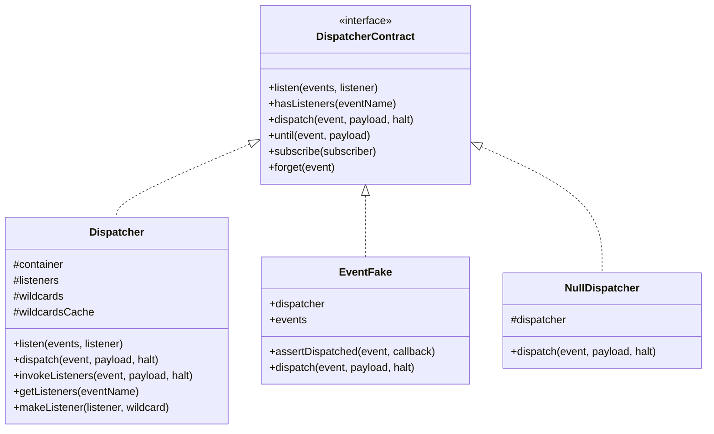
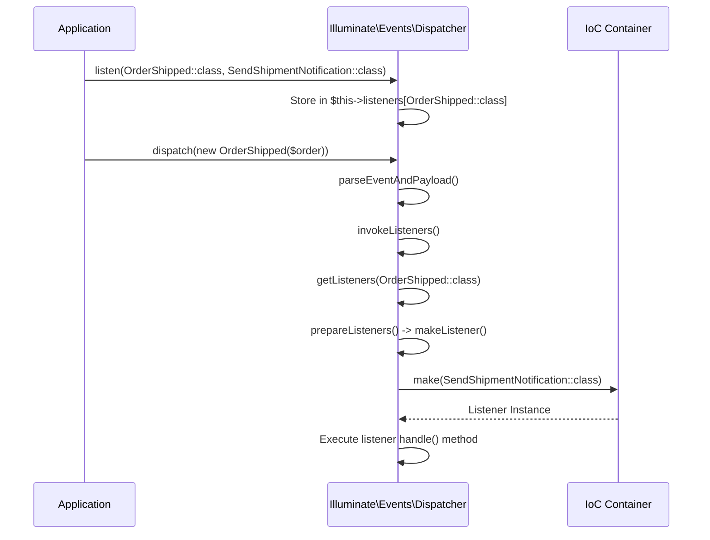
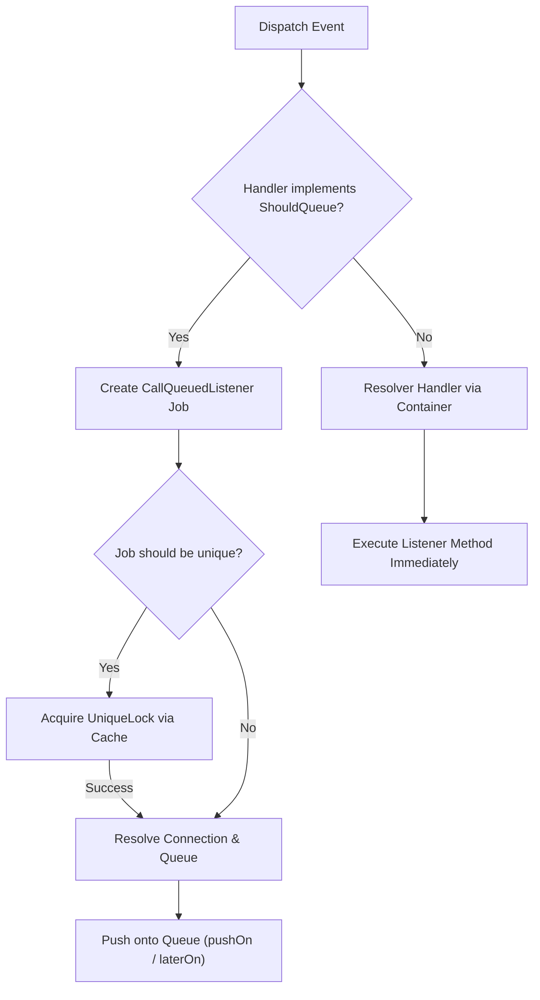
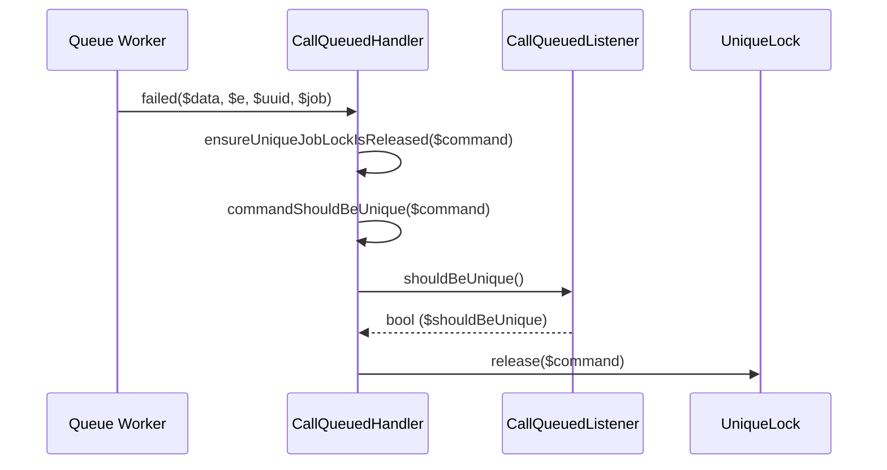

# Event Dispatcher

<details>
<summary>Relevant source files</summary>

The following files were used as context for generating this wiki page:

- [src/Illuminate/Events/Dispatcher.php](https://github.com/laravel/framework/blob/main/src/Illuminate/Events/Dispatcher.php)
- [src/Illuminate/Console/Scheduling/ScheduleRunCommand.php](https://github.com/laravel/framework/blob/main/src/Illuminate/Console/Scheduling/ScheduleRunCommand.php)
- [src/Illuminate/Foundation/Support/Providers/EventServiceProvider.php](https://github.com/laravel/framework/blob/main/src/Illuminate/Foundation/Support/Providers/EventServiceProvider.php)
- [src/Illuminate/Bus/Dispatcher.php](https://github.com/laravel/framework/blob/main/src/Illuminate/Bus/Dispatcher.php)
- [src/Illuminate/Support/Testing/Fakes/EventFake.php](https://github.com/laravel/framework/blob/main/src/Illuminate/Support/Testing/Fakes/EventFake.php)
- [src/Illuminate/Broadcasting/BroadcastEvent.php](https://github.com/laravel/framework/blob/main/src/Illuminate/Broadcasting/BroadcastEvent.php)
- [src/Illuminate/Support/Facades/Event.php](https://github.com/laravel/framework/blob/main/src/Illuminate/Support/Facades/Event.php)
- [src/Illuminate/Events/QueuedClosure.php](https://github.com/laravel/framework/blob/main/src/Illuminate/Events/QueuedClosure.php)
- [src/Illuminate/Notifications/NotificationSender.php](https://github.com/laravel/framework/blob/main/src/Illuminate/Notifications/NotificationSender.php)
- [src/Illuminate/Queue/SyncQueue.php](https://github.com/laravel/framework/blob/main/src/Illuminate/Queue/SyncQueue.php)
- [src/Illuminate/Foundation/Console/EventListCommand.php](https://github.com/laravel/framework/blob/main/src/Illuminate/Foundation/Console/EventListCommand.php)
- [src/Illuminate/Database/Eloquent/Concerns/HasEvents.php](https://github.com/laravel/framework/blob/main/src/Illuminate/Database/Eloquent/Concerns/HasEvents.php)
- [src/Illuminate/Events/EventServiceProvider.php](https://github.com/laravel/framework/blob/main/src/Illuminate/Events/EventServiceProvider.php)
- [src/Illuminate/Events/CallQueuedListener.php](https://github.com/laravel/framework/blob/main/src/Illuminate/Events/CallQueuedListener.php)
- [src/Illuminate/Contracts/Events/Dispatcher.php](https://github.com/laravel/framework/blob/main/src/Illuminate/Contracts/Events/Dispatcher.php)
- [src/Illuminate/Events/NullDispatcher.php](https://github.com/laravel/framework/blob/main/src/Illuminate/Events/NullDispatcher.php)
- [src/Illuminate/Queue/CallQueuedHandler.php](https://github.com/laravel/framework/blob/main/src/Illuminate/Queue/CallQueuedHandler.php)
</details>

## Overview

The Event Dispatcher component serves as the central hub for decoupling application logic through an observer pattern implementation. It manages event listener registration, parses object-based or string-based events, controls synchronous versus queued execution semantics, and integrates natively with database transactions, broadcasting drivers, and testing fakes. By providing a clean contract (`Illuminate\Contracts\Events\Dispatcher`) and a robust concrete implementation (`Illuminate\Events\Dispatcher`), the component allows different layers of an application to communicate without tightly binding modules together.

At its core, the dispatcher resolves class listeners via the IoC container, evaluates wildcard patterns, handles interface-based event propagation, and defers execution contexts. It bridges synchronous application flow with asynchronous queue infrastructure via classes like `Illuminate\Events\CallQueuedListener` and supports isolated unit testing through `Illuminate\Support\Testing\Fakes\EventFake`. Understanding its internal architecture reveals how transactions, broadcasting payloads, and lifecycle hooks coordinate during event dispatch.

Sources: [src/Illuminate/Events/Dispatcher.php:42-147](https://github.com/laravel/framework/blob/main/src/Illuminate/Events/Dispatcher.php#L42-L147)
Sources: [src/Illuminate/Contracts/Events/Dispatcher.php:5-82](https://github.com/laravel/framework/blob/main/src/Illuminate/Contracts/Events/Dispatcher.php#L5-L82)

## Architecture and Core Dispatcher Implementation

The `Illuminate\Events\Dispatcher` class implements `Illuminate\Contracts\Events\Dispatcher` along with traits such as `Macroable`, `ReadsClassAttributes`, `ReflectsClosures`, and `ResolvesQueueRoutes`. The dispatcher maintains internal storage arrays for direct listeners (`$this->listeners`) and wildcard patterns (`$this->wildcards`), alongside caching mechanisms (`$this->wildcardsCache`) to optimize repeated wildcard lookups.

When an event is fired via `dispatch($event, $payload, $halt)`, the dispatcher parses the event identifier and payload, checks whether event deferral is active, and evaluates database transaction commit hooks. If the event payload implements `ShouldDispatchAfterCommit` and a database transaction manager is bound, the invocation is registered as a callback to run on the next successful transaction commit. Otherwise, listeners are invoked immediately.

Sources: [src/Illuminate/Events/Dispatcher.php:42-115](https://github.com/laravel/framework/blob/main/src/Illuminate/Events/Dispatcher.php#L42-L115)



Sources: [src/Illuminate/Events/Dispatcher.php:267-304](https://github.com/laravel/framework/blob/main/src/Illuminate/Events/Dispatcher.php#L267-L304)
Sources: [src/Illuminate/Contracts/Events/Dispatcher.php:5-82](https://github.com/laravel/framework/blob/main/src/Illuminate/Contracts/Events/Dispatcher.php#L5-L82)

## Listener Registration and Resolution Mechanics

Listeners can be registered using closures, queued closures (`Illuminate\Events\QueuedClosure`), array callables, class-string handles, or event subscribers. When `listen($events, $listener)` is called with a closure, the dispatcher inspects the closure parameter types via `firstClosureParameterTypes` and recursively registers the listener for each discovered event type.

Sources: [src/Illuminate/Events/Dispatcher.php:124-147](https://github.com/laravel/framework/blob/main/src/Illuminate/Events/Dispatcher.php#L124-L147)



Sources: [src/Illuminate/Events/Dispatcher.php:274-304](https://github.com/laravel/framework/blob/main/src/Illuminate/Events/Dispatcher.php#L274-L304)

During listener retrieval (`getListeners($eventName)`), the dispatcher merges direct listeners, matching wildcard listeners from `$this->wildcards`, and interface listeners implemented by the event class via `class_implements`.

Sources: [src/Illuminate/Events/Dispatcher.php:403-453](https://github.com/laravel/framework/blob/main/src/Illuminate/Events/Dispatcher.php#L403-L453)

> [!NOTE]
> Wildcard listeners are cached in `$this->wildcardsCache` upon first lookup for an event name. Calling `forget($event)` flushes matching entries from both active listeners and the wildcard cache.

Sources: [src/Illuminate/Events/Dispatcher.php:767-780](https://github.com/laravel/framework/blob/main/src/Illuminate/Events/Dispatcher.php#L767-L780)

## Execution Control, Halting, and Propagation Control

The core execution loop resides inside `invokeListeners($event, $payload, $halt)`. As the dispatcher iterates over prepared listener closures, it inspects individual return values to alter control flow:

Sources: [src/Illuminate/Events/Dispatcher.php:314-343](https://github.com/laravel/framework/blob/main/src/Illuminate/Events/Dispatcher.php#L314-L343)

1. **Halting (`$halt = true` / `until`)**: If a listener returns a non-null response and halting is enabled, the dispatcher immediately returns that response and halts execution without calling remaining listeners.
2. **Propagation Termination (`$response === false`)**: If any listener returns explicit boolean `false`, the dispatcher breaks out of the loop, stopping event propagation to subsequent listeners.
3. **Array Collection**: If halting is disabled, all non-halt responses are accumulated into an array and returned.

Sources: [src/Illuminate/Events/Dispatcher.php:255-264](https://github.com/laravel/framework/blob/main/src/Illuminate/Events/Dispatcher.php#L255-L264)

```markdown
| Response Value | Halting (`$halt = true`) Behavior | Standard (`$halt = false`) Behavior |
| -------------- | --------------------------------- | ----------------------------------- |
| `null`         | Continues loop                    | Appended to `$responses` array      |
| Non-null       | Returns response immediately      | Appended to `$responses` array      |
| `false`        | Breaks loop immediately           | Breaks loop immediately             |
```

Sources: [src/Illuminate/Events/Dispatcher.php:314-343](https://github.com/laravel/framework/blob/main/src/Illuminate/Events/Dispatcher.php#L314-L343)

## Queue Integration and Queued Listeners

When an event handler class implements `Illuminate\Contracts\Queue\ShouldQueue`, the dispatcher wraps its invocation inside a queued job handler rather than executing it immediately in the current process.

Sources: [src/Illuminate/Events/Dispatcher.php:564-573](https://github.com/laravel/framework/blob/main/src/Illuminate/Events/Dispatcher.php#L564-L573)

The method `createClassCallable($class, $method)` checks `handlerShouldBeQueued($class)`. If true, it returns a closure that validates `handlerWantsToBeQueued()` and invokes `queueHandler($class, $method, $arguments)`. 

Sources: [src/Illuminate/Events/Dispatcher.php:533-593](https://github.com/laravel/framework/blob/main/src/Illuminate/Events/Dispatcher.php#L533-L593)



Sources: [src/Illuminate/Events/Dispatcher.php:635-686](https://github.com/laravel/framework/blob/main/src/Illuminate/Events/Dispatcher.php#L635-L686)

During `queueHandler`, options such as connection, queue name, delay, tries, backoff, timeout, unique locks, and middleware are propagated from listener attributes or interface methods onto the `CallQueuedListener` job instance via `propagateListenerOptions()`.

Sources: [src/Illuminate/Events/Dispatcher.php:716-759](https://github.com/laravel/framework/blob/main/src/Illuminate/Events/Dispatcher.php#L716-L759)

## Call-Chain Walkthrough: Queued Listener Failure and Unique Lock Release (`Failed -> ShouldBeUnique`)

When a queued listener job fails during execution, `CallQueuedHandler::failed()` is invoked by the queue worker. This triggers a precise execution chain to clean up unique job locks: `failed()` calls `ensureUniqueJobLockIsReleased($command)`, which invokes `commandShouldBeUnique($command)`, which in turn evaluates `CallQueuedListener::shouldBeUnique()`.

Tracing this exact sequence through the source files:
1. `failed(array $data, $e, string $uuid, ?Job $job = null)` in `src/Illuminate/Queue/CallQueuedHandler.php` (lines 389-411) intercepts the job failure and initiates cleanup.
2. `ensureUniqueJobLockIsReleased($command)` in `src/Illuminate/Queue/CallQueuedHandler.php` (lines 230-236) checks if the command requires a unique lock release.
3. `commandShouldBeUnique(mixed $command)` in `src/Illuminate/Queue/CallQueuedHandler.php` (lines 284-289) inspects whether the command is an instance of `ShouldBeUnique` or a `CallQueuedListener`.
4. `shouldBeUnique(): bool` in `src/Illuminate/Events/CallQueuedListener.php` (lines 146-149) returns the boolean flag determining if the unique cache lock should be released.

Sources: [src/Illuminate/Queue/CallQueuedHandler.php:389-411](https://github.com/laravel/framework/blob/main/src/Illuminate/Queue/CallQueuedHandler.php#L389-L411)
Sources: [src/Illuminate/Queue/CallQueuedHandler.php:230-236](https://github.com/laravel/framework/blob/main/src/Illuminate/Queue/CallQueuedHandler.php#L230-L236)
Sources: [src/Illuminate/Queue/CallQueuedHandler.php:284-289](https://github.com/laravel/framework/blob/main/src/Illuminate/Queue/CallQueuedHandler.php#L284-L289)
Sources: [src/Illuminate/Events/CallQueuedListener.php:146-149](https://github.com/laravel/framework/blob/main/src/Illuminate/Events/CallQueuedListener.php#L146-L149)



Sources: [src/Illuminate/Queue/CallQueuedHandler.php:389-411](https://github.com/laravel/framework/blob/main/src/Illuminate/Queue/CallQueuedHandler.php#L389-L411)
Sources: [src/Illuminate/Queue/CallQueuedHandler.php:230-236](https://github.com/laravel/framework/blob/main/src/Illuminate/Queue/CallQueuedHandler.php#L230-L236)
Sources: [src/Illuminate/Queue/CallQueuedHandler.php:284-289](https://github.com/laravel/framework/blob/main/src/Illuminate/Queue/CallQueuedHandler.php#L284-L289)
Sources: [src/Illuminate/Events/CallQueuedListener.php:146-149](https://github.com/laravel/framework/blob/main/src/Illuminate/Events/CallQueuedListener.php#L146-L149)

## Event Broadcasting Integration

When an event payload contains an object implementing `Illuminate\Contracts\Broadcasting\ShouldBroadcast`, the dispatcher automatically triggers broadcasting behavior during listener invocation.

Sources: [src/Illuminate/Events/Dispatcher.php:316-318](https://github.com/laravel/framework/blob/main/src/Illuminate/Events/Dispatcher.php#L316-L318)

The `shouldBroadcast(array $payload)` method verifies that the event object implements `ShouldBroadcast` and that `broadcastWhen()` evaluates to true. If valid, `broadcastEvent($event)` resolves the broadcasting factory from the container and pushes the event to the broadcasting queue pipeline.

Sources: [src/Illuminate/Events/Dispatcher.php:366-395](https://github.com/laravel/framework/blob/main/src/Illuminate/Events/Dispatcher.php#L366-L395)

```php
// Example: Defining a broadcastable event
namespace App\Events;

use Illuminate\Contracts\Broadcasting\ShouldBroadcast;
use Illuminate\Broadcasting\PrivateChannel;

class OrderShipped implements ShouldBroadcast
{
    public $order;

    public function __construct($order)
    {
        $this->order = $order;
    }

    public function broadcastOn()
    {
        return new PrivateChannel('orders.'.$this->order->id);
    }
}
```

Sources: [src/Illuminate/Broadcasting/BroadcastEvent.php:22-115](https://github.com/laravel/framework/blob/main/src/Illuminate/Broadcasting/BroadcastEvent.php#L22-L115)

## Testing Fakes and Assertion API

The `Illuminate\Support\Testing\Fakes\EventFake` class decorates the dispatcher during testing, intercepting dispatched events instead of executing their underlying listeners unless specifically excluded via `except()`.

Sources: [src/Illuminate/Support/Testing/Fakes/EventFake.php:17-60](https://github.com/laravel/framework/blob/main/src/Illuminate/Support/Testing/Fakes/EventFake.php#L17-60)

```php
use Illuminate\Support\Facades\Event;
use App\Events\OrderShipped;

public function test_order_shipment_dispatches_event()
{
    Event::fake();

    // Perform action that dispatches OrderShipped...
    event(new OrderShipped($order));

    Event::assertDispatched(OrderShipped::class, function ($event) use ($order) {
        return $event->order->id === $order->id;
    });

    Event::assertDispatchedTimes(OrderShipped::class, 1);
}
```

Sources: [src/Illuminate/Support/Testing/Fakes/EventFake.php:134-180](https://github.com/laravel/framework/blob/main/src/Illuminate/Support/Testing/Fakes/EventFake.php#L134-L180)

When `Event::fake()` is called, it swaps the container binding for `'events'` with an `EventFake` instance and updates Eloquent model event dispatchers and cache components. If an intercepted event implements `ShouldDispatchAfterCommit`, the fake defers recording the event until transaction commit callbacks execute.

Sources: [src/Illuminate/Support/Testing/Fakes/EventFake.php:54-66](https://github.com/laravel/framework/blob/main/src/Illuminate/Support/Testing/Fakes/EventFake.php#L54-L66)
Sources: [src/Illuminate/Support/Testing/Fakes/EventFake.php:366-374](https://github.com/laravel/framework/blob/main/src/Illuminate/Support/Testing/Fakes/EventFake.php#L366-L374)

## Design Trade-offs and Architectural Decisions

| Design Choice | Benefit | Cost |
| ------------- | ------- | ---- |
| **Wildcard Caching (`$wildcardsCache`)** | Speeds up repeated event lookups matching wildcard patterns. | Requires manual cache flushing when wildcard listeners are forgotten or updated. |
| **Transaction-Deferred Dispatches** | Prevents race conditions by ensuring listeners or broadcasts only fire after successful database commits. | Requires an active database transaction manager resolver bound in the container. |
| **Dynamic Listener Wrapping (`makeListener`)** | Supports strings, arrays, closures, and class-handlers interchangeably. | Adds slight runtime reflection and resolution overhead during listener invocation preparation. |
| **Event Faking Proxy (`EventFake`)** | Allows granular assertions on dispatched events and payloads without executing side-effecting listeners during tests. | Intercepts event state globally across container resolution boundaries during test runs. |

Sources: [src/Illuminate/Events/Dispatcher.php:67-73](https://github.com/laravel/framework/blob/main/src/Illuminate/Events/Dispatcher.php#L67-L73)
Sources: [src/Illuminate/Events/Dispatcher.php:293-301](https://github.com/laravel/framework/blob/main/src/Illuminate/Events/Dispatcher.php#L293-L301)
Sources: [src/Illuminate/Events/Dispatcher.php:478-495](https://github.com/laravel/framework/blob/main/src/Illuminate/Events/Dispatcher.php#L478-L495)
Sources: [src/Illuminate/Support/Testing/Fakes/EventFake.php:321-374](https://github.com/laravel/framework/blob/main/src/Illuminate/Support/Testing/Fakes/EventFake.php#L321-L374)

## Related

- [[Queue Workers & Processing]]
- [[Event Broadcasting]]

