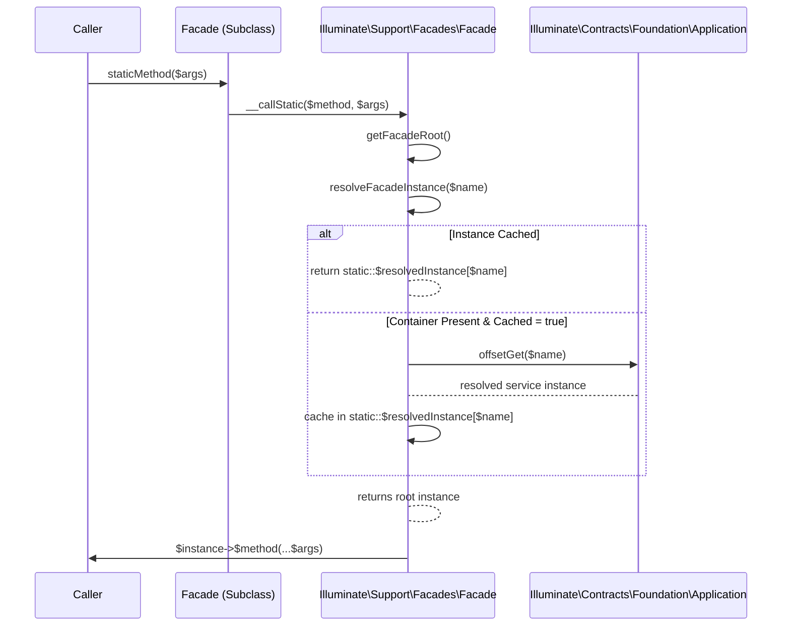

# Facades & Architecture

<details>
<summary>Relevant source files</summary>

The following files were used as context for generating this wiki page:

- [src/Illuminate/Container/Container.php](https://github.com/laravel/framework/blob/main/src/Illuminate/Container/Container.php)
- [src/Illuminate/Support/Facades/Facade.php](https://github.com/laravel/framework/blob/main/src/Illuminate/Support/Facades/Facade.php)
- [src/Illuminate/Support/Facades/Route.php](https://github.com/laravel/framework/blob/main/src/Illuminate/Support/Facades/Route.php)
- [src/Illuminate/Foundation/Application.php](https://github.com/laravel/framework/blob/main/src/Illuminate/Foundation/Application.php)
- [src/Illuminate/Support/Facades/App.php](https://github.com/laravel/framework/blob/main/src/Illuminate/Support/Facades/App.php)
- [src/Illuminate/Foundation/Bootstrap/RegisterFacades.php](https://github.com/laravel/framework/blob/main/src/Illuminate/Foundation/Bootstrap/RegisterFacades.php)
- [src/Illuminate/Support/Facades/Bus.php](https://github.com/laravel/framework/blob/main/src/Illuminate/Support/Facades/Bus.php)
- [src/Illuminate/Container/BoundMethod.php](https://github.com/laravel/framework/blob/main/src/Illuminate/Container/BoundMethod.php)
- [src/Illuminate/Support/Facades/Event.php](https://github.com/laravel/framework/blob/main/src/Illuminate/Support/Facades/Event.php)
- [src/Illuminate/Foundation/AliasLoader.php](https://github.com/laravel/framework/blob/main/src/Illuminate/Foundation/AliasLoader.php)
- [src/Illuminate/Support/Facades/Http.php](https://github.com/laravel/framework/blob/main/src/Illuminate/Support/Facades/Http.php)
- [src/Illuminate/Support/Facades/Concurrency.php](https://github.com/laravel/framework/blob/main/src/Illuminate/Support/Facades/Concurrency.php)
- [src/Illuminate/Support/Facades/View.php](https://github.com/laravel/framework/blob/main/src/Illuminate/Support/Facades/View.php)
- [src/Illuminate/Support/Facades/Artisan.php](https://github.com/laravel/framework/blob/main/src/Illuminate/Support/Facades/Artisan.php)
- [src/Illuminate/Support/Facades/Context.php](https://github.com/laravel/framework/blob/main/src/Illuminate/Support/Facades/Context.php)
- [src/Illuminate/Support/Facades/Gate.php](https://github.com/laravel/framework/blob/main/src/Illuminate/Support/Facades/Gate.php)
- [src/Illuminate/Support/Facades/Date.php](https://github.com/laravel/framework/blob/main/src/Illuminate/Support/Facades/Date.php)
- [src/Illuminate/Support/Facades/Response.php](https://github.com/laravel/framework/blob/main/src/Illuminate/Support/Facades/Response.php)
- [src/Illuminate/Support/Facades/Blade.php](https://github.com/laravel/framework/blob/main/src/Illuminate/Support/Facades/Blade.php)
- [src/Illuminate/Support/Facades/Vite.php](https://github.com/laravel/framework/blob/main/src/Illuminate/Support/Facades/Vite.php)
- [src/Illuminate/Support/Facades/Schedule.php](https://github.com/laravel/framework/blob/main/src/Illuminate/Support/Facades/Schedule.php)
</details>

## Overview

Laravel facades serve as static proxies to underlying classes residing within the service container, providing an expressive, convenient syntax without sacrificing testability or dependency injection benefits. The architecture connects static method calls dynamically to resolved service instances through magic methods and container bindings. Sources: [src/Illuminate/Support/Facades/Facade.php:19-41](https://github.com/laravel/framework/blob/main/src/Illuminate/Support/Facades/Facade.php#L19-L41)

By decoupling static syntax from rigid global state, the framework enables seamless instance swapping, mocking, and real-time facade alias loading during application bootstrapping. Sources: [src/Illuminate/Foundation/AliasLoader.php:70-81](https://github.com/laravel/framework/blob/main/src/Illuminate/Foundation/AliasLoader.php#L70-L81), [src/Illuminate/Support/Facades/Facade.php:66-75](https://github.com/laravel/framework/blob/main/src/Illuminate/Support/Facades/Facade.php#L66-L75), [src/Illuminate/Support/Facades/Facade.php:177-189](https://github.com/laravel/framework/blob/main/src/Illuminate/Support/Facades/Facade.php#L177-L189), [src/Illuminate/Foundation/Bootstrap/RegisterFacades.php:18-28](https://github.com/laravel/framework/blob/main/src/Illuminate/Foundation/Bootstrap/RegisterFacades.php#L18-L28)

## Facade Base Architecture and Resolution

### Overview

The core of Laravel's facade architecture relies on the abstract `Illuminate\Support\Facades\Facade` class, which manages container references, resolved instance caches, and dynamic call forwarding. Sources: [src/Illuminate/Support/Facades/Facade.php:19-41](https://github.com/laravel/framework/blob/main/src/Illuminate/Support/Facades/Facade.php#L19-L41)

Every concrete facade extends this base class and implements the abstract `getFacadeAccessor()` method to declare the container binding key it represents. Sources: [src/Illuminate/Support/Facades/Facade.php:19-20](https://github.com/laravel/framework/blob/main/src/Illuminate/Support/Facades/Facade.php#L19-L20), [src/Illuminate/Support/Facades/Facade.php:221-224](https://github.com/laravel/framework/blob/main/src/Illuminate/Support/Facades/Facade.php#L221-L224)

If a concrete subclass omits this implementation, a `RuntimeException` is thrown with the message `Facade does not implement getFacadeAccessor method.` when root resolution is attempted. Sources: [src/Illuminate/Support/Facades/Facade.php:221-224](https://github.com/laravel/framework/blob/main/src/Illuminate/Support/Facades/Facade.php#L221-L224)

### Root Resolution and Magic Call Dispatching

When a static method is invoked on a facade class, PHP triggers the `__callStatic()` magic method. Sources: [src/Illuminate/Support/Facades/Facade.php:356-365](https://github.com/laravel/framework/blob/main/src/Illuminate/Support/Facades/Facade.php#L356-L365)

The execution flow follows a precise path from the static invocation down to the underlying service instance: `__callStatic()` → `getFacadeRoot()` → `resolveFacadeInstance()` → container lookup. Sources: [src/Illuminate/Support/Facades/Facade.php:209-212](https://github.com/laravel/framework/blob/main/src/Illuminate/Support/Facades/Facade.php#L209-L212), [src/Illuminate/Support/Facades/Facade.php:227-245](https://github.com/laravel/framework/blob/main/src/Illuminate/Support/Facades/Facade.php#L227-L245), [src/Illuminate/Support/Facades/Facade.php:356-365](https://github.com/laravel/framework/blob/main/src/Illuminate/Support/Facades/Facade.php#L356-L365)



Sources: [src/Illuminate/Support/Facades/Facade.php:209-245](https://github.com/laravel/framework/blob/main/src/Illuminate/Support/Facades/Facade.php#L209-L245), [src/Illuminate/Support/Facades/Facade.php:356-365](https://github.com/laravel/framework/blob/main/src/Illuminate/Support/Facades/Facade.php#L356-L365)

During this sequence, `__callStatic($method, $args)` first calls `static::getFacadeRoot()`, which retrieves the accessor string via `static::getFacadeAccessor()` and passes it to `resolveFacadeInstance($name)`. Sources: [src/Illuminate/Support/Facades/Facade.php:209-212](https://github.com/laravel/framework/blob/main/src/Illuminate/Support/Facades/Facade.php#L209-L212), [src/Illuminate/Support/Facades/Facade.php:356-359](https://github.com/laravel/framework/blob/main/src/Illuminate/Support/Facades/Facade.php#L356-L359)

Inside `resolveFacadeInstance()`, if the instance already exists in the `static::$resolvedInstance` array, it is returned immediately. Sources: [src/Illuminate/Support/Facades/Facade.php:232-236](https://github.com/laravel/framework/blob/main/src/Illuminate/Support/Facades/Facade.php#L232-L236)

Otherwise, if the application container instance `static::$app` is set and `static::$cached` is true, the resolved object from the container is stored in `static::$resolvedInstance[$name]` and returned. Sources: [src/Illuminate/Support/Facades/Facade.php:238-241](https://github.com/laravel/framework/blob/main/src/Illuminate/Support/Facades/Facade.php#L238-L241)

If `static::$app` is missing or null, resolution returns null, causing `__callStatic()` to throw a `RuntimeException` with the message `A facade root has not been set.`. Sources: [src/Illuminate/Support/Facades/Facade.php:238-245](https://github.com/laravel/framework/blob/main/src/Illuminate/Support/Facades/Facade.php#L238-L245), [src/Illuminate/Support/Facades/Facade.php:360-362](https://github.com/laravel/framework/blob/main/src/Illuminate/Support/Facades/Facade.php#L360-L362)

> [!WARNING]
> If the application instance has not been bound or set via `setFacadeApplication()`, calling any static method on a facade triggers a `RuntimeException` stating `A facade root has not been set.` because `resolveFacadeInstance()` evaluates to `null`. Sources: [src/Illuminate/Support/Facades/Facade.php:238-245](https://github.com/laravel/framework/blob/main/src/Illuminate/Support/Facades/Facade.php#L238-L245), [src/Illuminate/Support/Facades/Facade.php:356-365](https://github.com/laravel/framework/blob/main/src/Illuminate/Support/Facades/Facade.php#L356-L365)

### Base Class Properties and Methods

The `Facade` class defines core protected properties that govern container state and caching behavior, alongside static lifecycle methods for clearing or inspecting resolved instances. Sources: [src/Illuminate/Support/Facades/Facade.php:19-41](https://github.com/laravel/framework/blob/main/src/Illuminate/Support/Facades/Facade.php#L19-L41), [src/Illuminate/Support/Facades/Facade.php:253-266](https://github.com/laravel/framework/blob/main/src/Illuminate/Support/Facades/Facade.php#L253-L266)

| Property / Method | Type / Signature | Purpose |
| :--- | :--- | :--- |
| `\$app` | `Application\|null` (protected static) | Stores the application instance being facaded. Sources: [src/Illuminate/Support/Facades/Facade.php:21-26](https://github.com/laravel/framework/blob/main/src/Illuminate/Support/Facades/Facade.php#L21-L26) |
| `\$resolvedInstance` | `array` (protected static) | Repository of cached underlying object instances keyed by accessor name. Sources: [src/Illuminate/Support/Facades/Facade.php:28-34](https://github.com/laravel/framework/blob/main/src/Illuminate/Support/Facades/Facade.php#L28-L34) |
| `\$cached` | `bool` (protected static) | Indicates whether the resolved instance should be cached (defaults to `true`). Sources: [src/Illuminate/Support/Facades/Facade.php:36-40](https://github.com/laravel/framework/blob/main/src/Illuminate/Support/Facades/Facade.php#L36-L40) |
| `getFacadeAccessor()` | `protected static function getFacadeAccessor()` | Abstract method returning the registered name of the component in the container. Sources: [src/Illuminate/Support/Facades/Facade.php:221-224](https://github.com/laravel/framework/blob/main/src/Illuminate/Support/Facades/Facade.php#L221-L224) |
| `clearResolvedInstance()` | `public static function clearResolvedInstance(?string $\$name = null)` | Unsets a specific cached facade instance by name or accessor. Sources: [src/Illuminate/Support/Facades/Facade.php:253-256](https://github.com/laravel/framework/blob/main/src/Illuminate/Support/Facades/Facade.php#L253-L256) |
| `clearResolvedInstances()` | `public static function clearResolvedInstances()` | Resets the entire `\$resolvedInstance` cache array to empty. Sources: [src/Illuminate/Support/Facades/Facade.php:263-266](https://github.com/laravel/framework/blob/main/src/Illuminate/Support/Facades/Facade.php#L263-L266) |

Sources: [src/Illuminate/Support/Facades/Facade.php:21-40](https://github.com/laravel/framework/blob/main/src/Illuminate/Support/Facades/Facade.php#L21-L40), [src/Illuminate/Support/Facades/Facade.php:221-224](https://github.com/laravel/framework/blob/main/src/Illuminate/Support/Facades/Facade.php#L221-L224), [src/Illuminate/Support/Facades/Facade.php:253-266](https://github.com/laravel/framework/blob/main/src/Illuminate/Support/Facades/Facade.php#L253-L266)

## Container Binding and Instance Management

### Overview

The container manages dependency injection, binding resolution, and instance caching through `Illuminate\Container\Container` and `Illuminate\Foundation\Application`. Sources: [src/Illuminate/Container/Container.php:26-64](https://github.com/laravel/framework/blob/main/src/Illuminate/Container/Container.php#L26-L64), [src/Illuminate/Foundation/Application.php:39-40](https://github.com/laravel/framework/blob/main/src/Illuminate/Foundation/Application.php#L39-L40)

When an abstract type or class is requested, the container inspects its registered bindings, contextual rules, and shared instance caches to construct or return the requested service. Sources: [src/Illuminate/Container/Container.php:905-952](https://github.com/laravel/framework/blob/main/src/Illuminate/Container/Container.php#L905-L952)

### Resolution Call-Chain Walkthrough

Resolving services through the container follows a precise, sequential execution path when calling `make($abstract, $parameters)`: Sources: [src/Illuminate/Container/Container.php:863-866](https://github.com/laravel/framework/blob/main/src/Illuminate/Container/Container.php#L863-L866), [src/Illuminate/Container/Container.php:905-968](https://github.com/laravel/framework/blob/main/src/Illuminate/Container/Container.php#L905-L968)

1. `make()` calls `resolve($abstract, $parameters)` to fetch aliases and trigger event hooks. Sources: [src/Illuminate/Container/Container.php:863-866](https://github.com/laravel/framework/blob/main/src/Illuminate/Container/Container.php#L863-L866), [src/Illuminate/Container/Container.php:905-914](https://github.com/laravel/framework/blob/main/src/Illuminate/Container/Container.php#L905-L914)
2. `resolve()` fires pre-resolution callbacks via `fireBeforeResolvingCallbacks()` and checks for singleton instances in `\$instances[$abstract]`. Sources: [src/Illuminate/Container/Container.php:912-925](https://github.com/laravel/framework/blob/main/src/Illuminate/Container/Container.php#L912-L925)
3. If no cached instance exists, `getConcrete($abstract)` looks up the binding or inspects reflection attributes. Sources: [src/Illuminate/Container/Container.php:930-931](https://github.com/laravel/framework/blob/main/src/Illuminate/Container/Container.php#L930-L931), [src/Illuminate/Container/Container.php:976-990](https://github.com/laravel/framework/blob/main/src/Illuminate/Container/Container.php#L976-L990)
4. `isBuildable()` checks whether the concrete matches the abstract or is a `Closure`. Sources: [src/Illuminate/Container/Container.php:936-936](https://github.com/laravel/framework/blob/main/src/Illuminate/Container/Container.php#L936-L936), [src/Illuminate/Container/Container.php:1112-1115](https://github.com/laravel/framework/blob/main/src/Illuminate/Container/Container.php#L1112-L1115)
5. `build($concrete)` inspects class constructors using `ReflectionClass`, retrieves parameters via `resolveDependencies()`, and instantiates the object. Sources: [src/Illuminate/Container/Container.php:1143-1193](https://github.com/laravel/framework/blob/main/src/Illuminate/Container/Container.php#L1143-L1193), [src/Illuminate/Container/Container.php:1234-1271](https://github.com/laravel/framework/blob/main/src/Illuminate/Container/Container.php#L1234-L1271)
6. Finally, `resolve()` executes registered extenders, caches singletons if `isShared($abstract)` evaluates to `true`, and dispatches resolving callbacks via `fireResolvingCallbacks()`. Sources: [src/Illuminate/Container/Container.php:943-963](https://github.com/laravel/framework/blob/main/src/Illuminate/Container/Container.php#L943-L963)

> [!NOTE]
> When resolving types with contextual overrides or runtime parameters, the container bypasses the singleton cache (`\$instances`) to ensure the custom build stack receives the correct parameters. Sources: [src/Illuminate/Container/Container.php:918-924](https://github.com/laravel/framework/blob/main/src/Illuminate/Container/Container.php#L918-L924)

### Binding and Scoping Methods

The container supports multiple registration strategies for binding abstracts to concretes, singletons, or shared instances. Sources: [src/Illuminate/Container/Container.php:359-387](https://github.com/laravel/framework/blob/main/src/Illuminate/Container/Container.php#L359-L387), [src/Illuminate/Container/Container.php:502-618](https://github.com/laravel/framework/blob/main/src/Illuminate/Container/Container.php#L502-L618)

| Method Signature | Purpose |
| :--- | :--- |
| `bind(string|Closure \$abstract, $\$concrete = null, bool \$shared = false)` | Registers a binding with the container, dropping stale instances if necessary. Sources: [src/Illuminate/Container/Container.php:359-365](https://github.com/laravel/framework/blob/main/src/Illuminate/Container/Container.php#L359-L365), [src/Illuminate/Container/Container.php:387-387](https://github.com/laravel/framework/blob/main/src/Illuminate/Container/Container.php#L387-L387) |
| `singleton(string|Closure \$abstract, $\$concrete = null)` | Registers a shared binding where instances are cached across resolutions. Sources: [src/Illuminate/Container/Container.php:502-505](https://github.com/laravel/framework/blob/main/src/Illuminate/Container/Container.php#L502-L505) |
| `scoped(string|Closure \$abstract, $\$concrete = null)` | Registers a scoped binding and records the type in `\$scopedInstances`. Sources: [src/Illuminate/Container/Container.php:528-533](https://github.com/laravel/framework/blob/main/src/Illuminate/Container/Container.php#L528-L533) |
| `instance(string \$abstract, mixed \$instance)` | Registers an existing object instance as shared and triggers rebound callbacks. Sources: [src/Illuminate/Container/Container.php:602-618](https://github.com/laravel/framework/blob/main/src/Illuminate/Container/Container.php#L602-L618) |
| `extend(string \$abstract, Closure \$closure)` | Decorates or modifies an existing bound service or resolved instance via extender closures. Sources: [src/Illuminate/Container/Container.php:576-591](https://github.com/laravel/framework/blob/main/src/Illuminate/Container/Container.php#L576-L591) |

Sources: [src/Illuminate/Container/Container.php:359-387](https://github.com/laravel/framework/blob/main/src/Illuminate/Container/Container.php#L359-L387), [src/Illuminate/Container/Container.php:502-533](https://github.com/laravel/framework/blob/main/src/Illuminate/Container/Container.php#L502-L533), [src/Illuminate/Container/Container.php:576-618](https://github.com/laravel/framework/blob/main/src/Illuminate/Container/Container.php#L576-L618)

### Container Design Trade-Offs

| Design Choice | Benefit | Cost |
| :--- | :--- | :--- |
| **Reflection-based dependency inspection** | Eliminates manual wiring boilerplate for concrete classes. Sources: [src/Illuminate/Container/Container.php:1143-1178](https://github.com/laravel/framework/blob/main/src/Illuminate/Container/Container.php#L1143-L1178) | Incurs runtime performance overhead during class instantiation. Sources: [src/Illuminate/Container/Container.php:1143-1178](https://github.com/laravel/framework/blob/main/src/Illuminate/Container/Container.php#L1143-L1178) |
| **Build stack tracking** | Detects circular dependencies and tracks active resolution context. Sources: [src/Illuminate/Container/Container.php:101-105](https://github.com/laravel/framework/blob/main/src/Illuminate/Container/Container.php#L101-L105), [src/Illuminate/Container/Container.php:1100-1103](https://github.com/laravel/framework/blob/main/src/Illuminate/Container/Container.php#L1100-L1103) | Requires careful push/pop array management to prevent state corruption on exceptions. Sources: [src/Illuminate/Container/Container.php:1133-1140](https://github.com/laravel/framework/blob/main/src/Illuminate/Container/Container.php#L1133-L1140) |
| **Contextual binding arrays** | Enables flexible class-specific dependency implementations. Sources: [src/Illuminate/Container/Container.php:475-478](https://github.com/laravel/framework/blob/main/src/Illuminate/Container/Container.php#L475-L478), [src/Illuminate/Container/Container.php:1100-1103](https://github.com/laravel/framework/blob/main/src/Illuminate/Container/Container.php#L1100-L1103) | Increases lookup complexity during dependency resolution. Sources: [src/Illuminate/Container/Container.php:1074-1092](https://github.com/laravel/framework/blob/main/src/Illuminate/Container/Container.php#L1074-L1092) |

Sources: [src/Illuminate/Container/Container.php:101-105](https://github.com/laravel/framework/blob/main/src/Illuminate/Container/Container.php#L101-L105), [src/Illuminate/Container/Container.php:475-478](https://github.com/laravel/framework/blob/main/src/Illuminate/Container/Container.php#L475-L478), [src/Illuminate/Container/Container.php:1074-1178](https://github.com/laravel/framework/blob/main/src/Illuminate/Container/Container.php#L1074-L1178)

> [!WARNING]
> Circular dependencies trigger errors when the build stack encounters an abstract type already present in `\$buildStack`, causing resolution to fail when uninstantiable targets are reached. Sources: [src/Illuminate/Container/Container.php:1427-1436](https://github.com/laravel/framework/blob/main/src/Illuminate/Container/Container.php#L1427-L1436)

## Bootstrapping and Facade Registration

### Overview

During the application boot sequence, facade infrastructure and class aliases are initialized to bridge static facade calls with the underlying container. Sources: [src/Illuminate/Foundation/Bootstrap/RegisterFacades.php:10-28](https://github.com/laravel/framework/blob/main/src/Illuminate/Foundation/Bootstrap/RegisterFacades.php#L10-L28), [src/Illuminate/Foundation/AliasLoader.php:5-253](https://github.com/laravel/framework/blob/main/src/Illuminate/Foundation/AliasLoader.php#L5-L253)

The `RegisterFacades` bootstrapper configures the facade root and registers runtime class aliases via `AliasLoader`. Sources: [src/Illuminate/Foundation/Bootstrap/RegisterFacades.php:18-28](https://github.com/laravel/framework/blob/main/src/Illuminate/Foundation/Bootstrap/RegisterFacades.php#L18-L28)

### Bootstrapper Execution Walkthrough

The facade registration process flows through specific initialization steps executed by the framework's bootstrapper and alias loader: Sources: [src/Illuminate/Foundation/Bootstrap/RegisterFacades.php:18-28](https://github.com/laravel/framework/blob/main/src/Illuminate/Foundation/Bootstrap/RegisterFacades.php#L18-L28), [src/Illuminate/Foundation/AliasLoader.php:51-177](https://github.com/laravel/framework/blob/main/src/Illuminate/Foundation/AliasLoader.php#L51-L177)

1. `RegisterFacades::bootstrap()` calls `Facade::clearResolvedInstances()` to purge cached facade targets. Sources: [src/Illuminate/Foundation/Bootstrap/RegisterFacades.php:18-20](https://github.com/laravel/framework/blob/main/src/Illuminate/Foundation/Bootstrap/RegisterFacades.php#L18-L20)
2. `Facade::setFacadeApplication($app)` injects the active application container into the base `Facade` class. Sources: [src/Illuminate/Foundation/Bootstrap/RegisterFacades.php:22](https://github.com/laravel/framework/blob/main/src/Illuminate/Foundation/Bootstrap/RegisterFacades.php#L22)
3. `AliasLoader::getInstance(...)` merges configuration aliases (`app.aliases`) with package manifest aliases and returns the singleton loader instance. Sources: [src/Illuminate/Foundation/Bootstrap/RegisterFacades.php:24-27](https://github.com/laravel/framework/blob/main/src/Illuminate/Foundation/Bootstrap/RegisterFacades.php#L24-L27), [src/Illuminate/Foundation/AliasLoader.php:51-62](https://github.com/laravel/framework/blob/main/src/Illuminate/Foundation/AliasLoader.php#L51-L62)
4. `AliasLoader::register()` invokes `prependToLoaderStack()`, registering `AliasLoader::load(...)` on PHP's auto-loader stack via `spl_autoload_register`. Sources: [src/Illuminate/Foundation/AliasLoader.php:160-167](https://github.com/laravel/framework/blob/main/src/Illuminate/Foundation/AliasLoader.php#L160-L167), [src/Illuminate/Foundation/AliasLoader.php:174-177](https://github.com/laravel/framework/blob/main/src/Illuminate/Foundation/AliasLoader.php#L174-L177)

Sources: [src/Illuminate/Foundation/Bootstrap/RegisterFacades.php:18-28](https://github.com/laravel/framework/blob/main/src/Illuminate/Foundation/Bootstrap/RegisterFacades.php#L18-L28), [src/Illuminate/Foundation/AliasLoader.php:51-62](https://github.com/laravel/framework/blob/main/src/Illuminate/Foundation/AliasLoader.php#L51-L62), [src/Illuminate/Foundation/AliasLoader.php:160-177](https://github.com/laravel/framework/blob/main/src/Illuminate/Foundation/AliasLoader.php#L160-L177)

### Real-Time Facade Generation

When an undefined class matching the facade namespace prefix (`Facades\`) is referenced, `AliasLoader::load()` intercepts the autoload request and triggers dynamic file creation. Sources: [src/Illuminate/Foundation/AliasLoader.php:70-76](https://github.com/laravel/framework/blob/main/src/Illuminate/Foundation/AliasLoader.php#L70-L76), [src/Illuminate/Foundation/AliasLoader.php:89-121](https://github.com/laravel/framework/blob/main/src/Illuminate/Foundation/AliasLoader.php#L89-L121)

```php
protected function ensureFacadeExists($alias)
{
    if (is_file($path = storage_path('framework/cache/facade-'.sha1($alias).'.php'))) {
        return $path;
    }

    $stub = $this->formatFacadeStub(
        $alias, file_get_contents(__DIR__.'/stubs/facade.stub')
    );

    $tempPath = tempnam(dirname($path), 'facade-');
    @chmod($tempPath, 0777 - umask());
    file_put_contents($tempPath, $stub);
    rename($tempPath, $path);

    return $path;
}
```

Sources: [src/Illuminate/Foundation/AliasLoader.php:89-121](https://github.com/laravel/framework/blob/main/src/Illuminate/Foundation/AliasLoader.php#L89-L121)

> [!WARNING]
> Real-time facade stubs are written atomically using `tempnam()` and `rename()` inside `storage_path('framework/cache/')`. If storage permissions prevent directory writing or file renaming, dynamic facade generation fails during runtime class resolution. Sources: [src/Illuminate/Foundation/AliasLoader.php:100-121](https://github.com/laravel/framework/blob/main/src/Illuminate/Foundation/AliasLoader.php#L100-L121)

### AliasLoader Methods

| Method | Return Type | Purpose |
| :--- | :--- | :--- |
| `getInstance(array $aliases)` | `\Illuminate\Foundation\AliasLoader` | Retrieves or instantiates the singleton alias loader instance, merging new aliases. Sources: [src/Illuminate/Foundation/AliasLoader.php:51-62](https://github.com/laravel/framework/blob/main/src/Illuminate/Foundation/AliasLoader.php#L51-L62) |
| `load(string $alias)` | `bool|null` | Resolves real-time facades or invokes `class_alias` for registered mappings. Sources: [src/Illuminate/Foundation/AliasLoader.php:70-81](https://github.com/laravel/framework/blob/main/src/Illuminate/Foundation/AliasLoader.php#L70-L81) |
| `alias(string $alias, string $class)` | `void` | Manually registers an individual class alias mapping into the loader array. Sources: [src/Illuminate/Foundation/AliasLoader.php:150-153](https://github.com/laravel/framework/blob/main/src/Illuminate/Foundation/AliasLoader.php#L150-L153) |
| `register()` | `void` | Registers the loader method on PHP's autoloader stack if not already registered. Sources: [src/Illuminate/Foundation/AliasLoader.php:160-167](https://github.com/laravel/framework/blob/main/src/Illuminate/Foundation/AliasLoader.php#L160-L167) |
| `setFacadeNamespace(string $namespace)` | `void` | Configures the namespace prefix utilized for identifying real-time facades. Sources: [src/Illuminate/Foundation/AliasLoader.php:227-230](https://github.com/laravel/framework/blob/main/src/Illuminate/Foundation/AliasLoader.php#L227-L230) |

Sources: [src/Illuminate/Foundation/AliasLoader.php:51-62](https://github.com/laravel/framework/blob/main/src/Illuminate/Foundation/AliasLoader.php#L51-L62), [src/Illuminate/Foundation/AliasLoader.php:70-81](https://github.com/laravel/framework/blob/main/src/Illuminate/Foundation/AliasLoader.php#L70-L81), [src/Illuminate/Foundation/AliasLoader.php:150-167](https://github.com/laravel/framework/blob/main/src/Illuminate/Foundation/AliasLoader.php#L150-L167), [src/Illuminate/Foundation/AliasLoader.php:227-230](https://github.com/laravel/framework/blob/main/src/Illuminate/Foundation/AliasLoader.php#L227-L230)

## Testing Facades and Instance Swapping

### Overview

The abstract `Facade` base class provides robust mechanisms for mocking, spying, partial mocking, and instance swapping to facilitate testing. Sources: [src/Illuminate/Support/Facades/Facade.php:66-107](https://github.com/laravel/framework/blob/main/src/Illuminate/Support/Facades/Facade.php#L66-L107), [src/Illuminate/Support/Facades/Facade.php:177-189](https://github.com/laravel/framework/blob/main/src/Illuminate/Support/Facades/Facade.php#L177-L189)

Instead of interacting with hardcoded external dependencies, testing methods allow developers to replace underlying container bindings with mock objects, test fakes, or custom test instances dynamically. Sources: [src/Illuminate/Support/Facades/Facade.php:66-75](https://github.com/laravel/framework/blob/main/src/Illuminate/Support/Facades/Facade.php#L66-L75), [src/Illuminate/Support/Facades/Facade.php:177-189](https://github.com/laravel/framework/blob/main/src/Illuminate/Support/Facades/Facade.php#L177-L189)

### Instance Swapping and Mocking Methods

When testing components that rely on facades, methods like `swap()`, `spy()`, `shouldReceive()`, and `expects()` interact directly with the resolved instance array and the underlying container. Sources: [src/Illuminate/Support/Facades/Facade.php:66-123](https://github.com/laravel/framework/blob/main/src/Illuminate/Support/Facades/Facade.php#L66-L123), [src/Illuminate/Support/Facades/Facade.php:177-189](https://github.com/laravel/framework/blob/main/src/Illuminate/Support/Facades/Facade.php#L177-L189)

```php
public static function swap($instance)
{
    static::$resolvedInstance[static::getFacadeAccessor()] = $instance;

    if (isset(static::$app)) {
        static::$app->instance(static::getFacadeAccessor(), $instance);
    }
}
```

Sources: [src/Illuminate/Support/Facades/Facade.php:182-189](https://github.com/laravel/framework/blob/main/src/Illuminate/Support/Facades/Facade.php#L182-L189)

> [!NOTE]
> The `swap()` method updates both the facade's internal `static::$resolvedInstance` cache and the underlying Laravel container via `static::$app->instance()`, ensuring that subsequent resolutions through either mechanism return the mock or fake instance. Sources: [src/Illuminate/Support/Facades/Facade.php:182-189](https://github.com/laravel/framework/blob/main/src/Illuminate/Support/Facades/Facade.php#L182-L189)

### Facade Testing Methods

| Method | Return Type | Purpose |
| :--- | :--- | :--- |
| `spy()` | `\Mockery\MockInterface` | Converts the facade into a Mockery spy and swaps the underlying instance. Sources: [src/Illuminate/Support/Facades/Facade.php:66-75](https://github.com/laravel/framework/blob/main/src/Illuminate/Support/Facades/Facade.php#L66-L75) |
| `partialMock()` | `\Mockery\MockInterface` | Initiates a partial mock on the resolved instance or creates a fresh mock instance. Sources: [src/Illuminate/Support/Facades/Facade.php:82-91](https://github.com/laravel/framework/blob/main/src/Illuminate/Support/Facades/Facade.php#L82-L91) |
| `shouldReceive()` | `\Mockery\Expectation` | Initiates a Mockery expectation on the facade's resolved or fresh mock instance. Sources: [src/Illuminate/Support/Facades/Facade.php:98-107](https://github.com/laravel/framework/blob/main/src/Illuminate/Support/Facades/Facade.php#L98-L107) |
| `expects()` | `\Mockery\Expectation` | Initiates a required expectation on the facade's mock instance. Sources: [src/Illuminate/Support/Facades/Facade.php:114-123](https://github.com/laravel/framework/blob/main/src/Illuminate/Support/Facades/Facade.php#L114-L123) |
| `isMock()` | `bool` | Determines whether the resolved instance is a Mockery `LegacyMockInterface`. Sources: [src/Illuminate/Support/Facades/Facade.php:156-162](https://github.com/laravel/framework/blob/main/src/Illuminate/Support/Facades/Facade.php#L156-L162) |
| `isFake()` | `bool` | Determines whether the resolved instance implements the `Fake` interface. Sources: [src/Illuminate/Support/Facades/Facade.php:196-202](https://github.com/laravel/framework/blob/main/src/Illuminate/Support/Facades/Facade.php#L196-L202) |

Sources: [src/Illuminate/Support/Facades/Facade.php:66-123](https://github.com/laravel/framework/blob/main/src/Illuminate/Support/Facades/Facade.php#L66-L123), [src/Illuminate/Support/Facades/Facade.php:156-162](https://github.com/laravel/framework/blob/main/src/Illuminate/Support/Facades/Facade.php#L156-L162), [src/Illuminate/Support/Facades/Facade.php:196-202](https://github.com/laravel/framework/blob/main/src/Illuminate/Support/Facades/Facade.php#L196-L202)

### Specialized Domain Fakes

Domain-specific facades extend testing capabilities beyond standard Mockery mocks by providing custom fake implementations. Sources: [src/Illuminate/Support/Facades/Event.php:54-66](https://github.com/laravel/framework/blob/main/src/Illuminate/Support/Facades/Event.php#L54-L66), [src/Illuminate/Support/Facades/Bus.php:72-81](https://github.com/laravel/framework/blob/main/src/Illuminate/Support/Facades/Bus.php#L72-L81)

For example, `Event::fake()` and `Bus::fake()` retrieve the current dispatcher instance, instantiate their respective fake classes (`EventFake`, `BusFake`), and bind them into the container. Sources: [src/Illuminate/Support/Facades/Event.php:54-66](https://github.com/laravel/framework/blob/main/src/Illuminate/Support/Facades/Event.php#L54-L66), [src/Illuminate/Support/Facades/Bus.php:72-81](https://github.com/laravel/framework/blob/main/src/Illuminate/Support/Facades/Bus.php#L72-L81)

```php
public static function fake($eventsToFake = [])
{
    $actualDispatcher = static::isFake()
        ? static::getFacadeRoot()->dispatcher
        : static::getFacadeRoot();

    return tap(new EventFake($actualDispatcher, $eventsToFake), function ($fake) {
        static::swap($fake);

        Model::setEventDispatcher($fake);
        Cache::refreshEventDispatcher();
    });
}
```

Sources: [src/Illuminate/Support/Facades/Event.php:54-66](https://github.com/laravel/framework/blob/main/src/Illuminate/Support/Facades/Event.php#L54-L66)

> [!WARNING]
> When faking the `Event` facade via `Event::fakeFor(callable $callable)`, the original event dispatcher is swapped back inside a `finally` block after the callback executes, ensuring test isolation across different test cases. Sources: [src/Illuminate/Support/Facades/Event.php:90-104](https://github.com/laravel/framework/blob/main/src/Illuminate/Support/Facades/Event.php#L90-L104)

### Facade Design Trade-Offs

| Design Choice | Benefit | Cost |
| :--- | :--- | :--- |
| Static proxy interface (`__callStatic`) | Clean, concise syntax without manual dependency injection in service consumers. Sources: [src/Illuminate/Support/Facades/Facade.php:356-365](https://github.com/laravel/framework/blob/main/src/Illuminate/Support/Facades/Facade.php#L356-L365) | Hides explicit dependencies, making static analysis and IDE autocompletion reliant on docblock annotations. Sources: [src/Illuminate/Support/Facades/Bus.php:11-59](https://github.com/laravel/framework/blob/main/src/Illuminate/Support/Facades/Bus.php#L11-L59), [src/Illuminate/Support/Facades/Event.php:8-42](https://github.com/laravel/framework/blob/main/src/Illuminate/Support/Facades/Event.php#L8-L42) |
| Container instance caching (`static::$resolvedInstance`) | Fast property lookup avoiding container resolution overhead on repeated calls. Sources: [src/Illuminate/Support/Facades/Facade.php:234-245](https://github.com/laravel/framework/blob/main/src/Illuminate/Support/Facades/Facade.php#L234-L245) | Requires explicit clearing (`clearResolvedInstance()`) or swapping during test runs to prevent state leakage between tests. Sources: [src/Illuminate/Support/Facades/Facade.php:253-256](https://github.com/laravel/framework/blob/main/src/Illuminate/Support/Facades/Facade.php#L253-L256) |
| Dual-target swapping (`swap()`) | Keeps facade cache and Laravel container bindings synchronized. Sources: [src/Illuminate/Support/Facades/Facade.php:182-189](https://github.com/laravel/framework/blob/main/src/Illuminate/Support/Facades/Facade.php#L182-L189) | Side effects propagate to any service resolving from the container during the swap window. Sources: [src/Illuminate/Support/Facades/Facade.php:182-189](https://github.com/laravel/framework/blob/main/src/Illuminate/Support/Facades/Facade.php#L182-L189) |

Sources: [src/Illuminate/Support/Facades/Bus.php:11-59](https://github.com/laravel/framework/blob/main/src/Illuminate/Support/Facades/Bus.php#L11-L59), [src/Illuminate/Support/Facades/Event.php:8-42](https://github.com/laravel/framework/blob/main/src/Illuminate/Support/Facades/Event.php#L8-L42), [src/Illuminate/Support/Facades/Facade.php:182-256](https://github.com/laravel/framework/blob/main/src/Illuminate/Support/Facades/Facade.php#L182-L256), [src/Illuminate/Support/Facades/Facade.php:356-365](https://github.com/laravel/framework/blob/main/src/Illuminate/Support/Facades/Facade.php#L356-L365)

## Concrete Facade Implementations and Accessors

### Overview

Concrete facades bridge static invocations to underlying service instances by extending the abstract `Facade` base class and defining a `getFacadeAccessor()` method. Sources: [src/Illuminate/Support/Facades/Route.php:109-119](https://github.com/laravel/framework/blob/main/src/Illuminate/Support/Facades/Route.php#L109-L119), [src/Illuminate/Support/Facades/App.php:151-161](https://github.com/laravel/framework/blob/main/src/Illuminate/Support/Facades/App.php#L151-L161)

Each implementation binds static method signatures via PHPDoc annotations to its underlying service contract or container identifier, resolving components such as routers, view factories, application kernels, log repositories, and date factories. Sources: [src/Illuminate/Support/Facades/Route.php:6-108](https://github.com/laravel/framework/blob/main/src/Illuminate/Support/Facades/Route.php#L6-L108), [src/Illuminate/Support/Facades/App.php:6-150](https://github.com/laravel/framework/blob/main/src/Illuminate/Support/Facades/App.php#L6-L150), [src/Illuminate/Support/Facades/View.php:6-87](https://github.com/laravel/framework/blob/main/src/Illuminate/Support/Facades/View.php#L6-L87)

### Facade Accessor Mapping

| Facade Class | Accessor Identifier | Underlying Target Service |
| :--- | :--- | :--- |
| `Route` | `'router'` | `\Illuminate\Routing\Router` |
| `App` | `'app'` | `\Illuminate\Foundation\Application` |
| `View` | `'view'` | `\Illuminate\View\Factory` |
| `Artisan` | `ConsoleKernelContract::class` | `\Illuminate\Foundation\Console\Kernel` |
| `Context` | `\Illuminate\Log\Context\Repository::class` | `\Illuminate\Log\Context\Repository` |
| `Gate` | `GateContract::class` | `\Illuminate\Auth\Access\Gate` |
| `Date` | `'date'` | `\Illuminate\Support\DateFactory` |
| `Response` | `ResponseFactoryContract::class` | `\Illuminate\Routing\ResponseFactory` |
| `Blade` | `'blade.compiler'` | `\Illuminate\View\Compilers\BladeCompiler` |
| `Vite` | `\Illuminate\Foundation\Vite::class` | `\Illuminate\Foundation\Vite` |
| `Schedule` | `ConsoleSchedule::class` | `\Illuminate\Console\Scheduling\Schedule` |
| `Concurrency` | `ConcurrencyManager::class` | `\Illuminate\Concurrency\ConcurrencyManager` |

Sources: [src/Illuminate/Support/Facades/Route.php:116-119](https://github.com/laravel/framework/blob/main/src/Illuminate/Support/Facades/Route.php#L116-L119), [src/Illuminate/Support/Facades/App.php:158-161](https://github.com/laravel/framework/blob/main/src/Illuminate/Support/Facades/App.php#L158-L161), [src/Illuminate/Support/Facades/Concurrency.php:32-35](https://github.com/laravel/framework/blob/main/src/Illuminate/Support/Facades/Concurrency.php#L32-L35), [src/Illuminate/Support/Facades/View.php:95-98](https://github.com/laravel/framework/blob/main/src/Illuminate/Support/Facades/View.php#L95-L98), [src/Illuminate/Support/Facades/Artisan.php:35-38](https://github.com/laravel/framework/blob/main/src/Illuminate/Support/Facades/Artisan.php#L35-L38), [src/Illuminate/Support/Facades/Context.php:59-62](https://github.com/laravel/framework/blob/main/src/Illuminate/Support/Facades/Context.php#L59-L62), [src/Illuminate/Support/Facades/Gate.php:44-47](https://github.com/laravel/framework/blob/main/src/Illuminate/Support/Facades/Gate.php#L44-L47), [src/Illuminate/Support/Facades/Date.php:120-123](https://github.com/laravel/framework/blob/main/src/Illuminate/Support/Facades/Date.php#L120-L123), [src/Illuminate/Support/Facades/Response.php:38-41](https://github.com/laravel/framework/blob/main/src/Illuminate/Support/Facades/Response.php#L38-L41), [src/Illuminate/Support/Facades/Blade.php:59-62](https://github.com/laravel/framework/blob/main/src/Illuminate/Support/Facades/Blade.php#L59-L62), [src/Illuminate/Support/Facades/Vite.php:47-50](https://github.com/laravel/framework/blob/main/src/Illuminate/Support/Facades/Vite.php#L47-L50), [src/Illuminate/Support/Facades/Schedule.php:5](https://github.com/laravel/framework/blob/main/src/Illuminate/Support/Facades/Schedule.php#L5)

> [!NOTE]
> The `Date` facade overrides `resolveFacadeInstance()` to inspect whether an instance is bound in static cache or container. If absent, it automatically swaps in the default `DateFactory` class (`Illuminate\Support\DateFactory`) before invoking parent resolution. Sources: [src/Illuminate/Support/Facades/Date.php:131-140](https://github.com/laravel/framework/blob/main/src/Illuminate/Support/Facades/Date.php#L131-L140)

Sources: [src/Illuminate/Support/Facades/Route.php:109-119](https://github.com/laravel/framework/blob/main/src/Illuminate/Support/Facades/Route.php#L109-L119), [src/Illuminate/Support/Facades/App.php:151-161](https://github.com/laravel/framework/blob/main/src/Illuminate/Support/Facades/App.php#L151-L161), [src/Illuminate/Support/Facades/Concurrency.php:32-35](https://github.com/laravel/framework/blob/main/src/Illuminate/Support/Facades/Concurrency.php#L32-L35), [src/Illuminate/Support/Facades/View.php:95-98](https://github.com/laravel/framework/blob/main/src/Illuminate/Support/Facades/View.php#L95-L98)

## Related

- [[Dependency Injection Container]]

