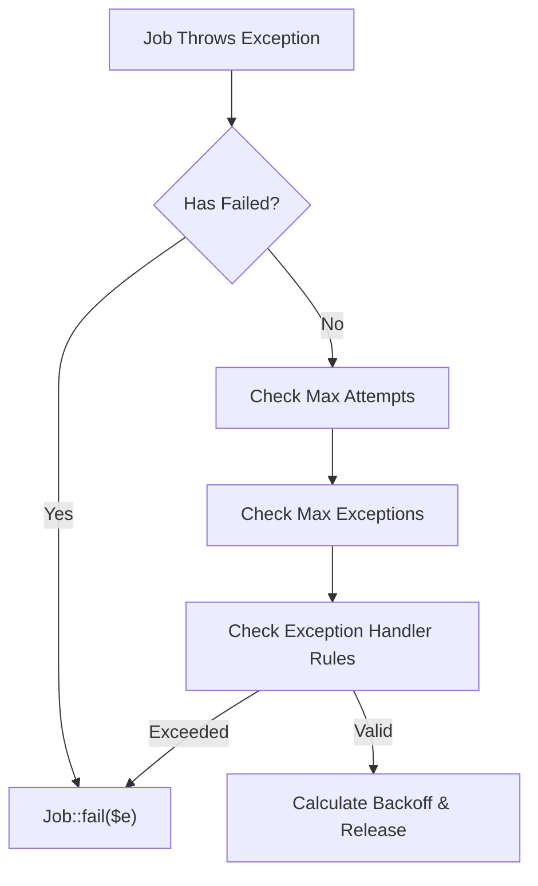
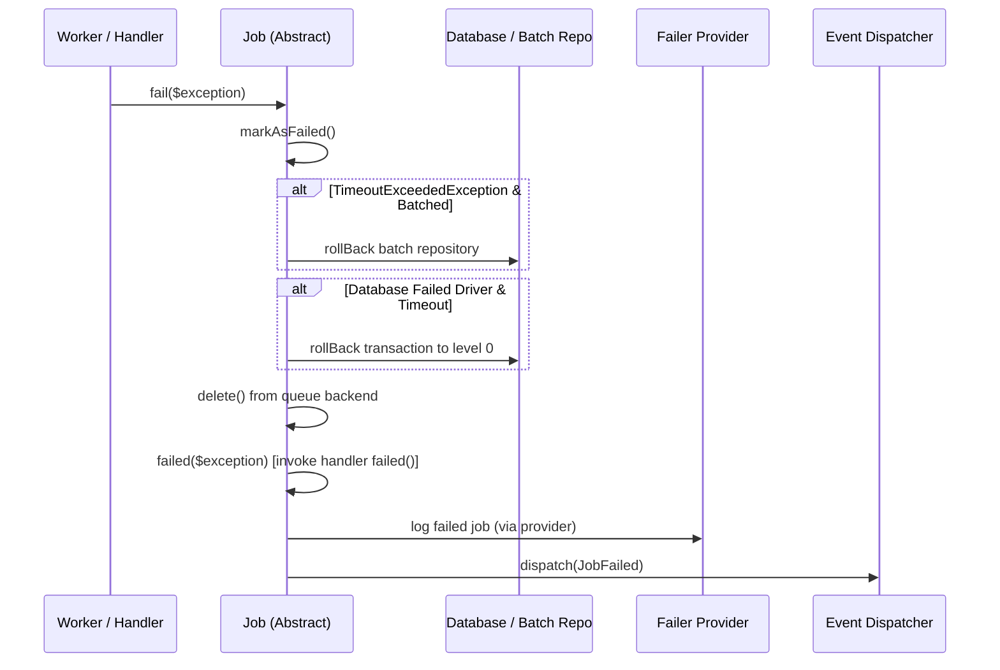
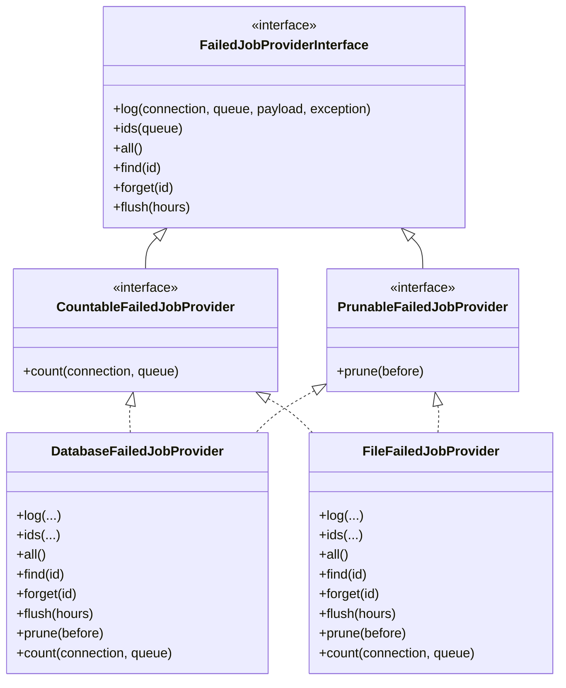

# Failed Jobs Handling

<details>
<summary>Relevant source files</summary>

The following files were used as context for generating this wiki page:

- [src/Illuminate/Queue/Worker.php](https://github.com/laravel/framework/blob/main/src/Illuminate/Queue/Worker.php)
- [src/Illuminate/Queue/CallQueuedHandler.php](https://github.com/laravel/framework/blob/main/src/Illuminate/Queue/CallQueuedHandler.php)
- [src/Illuminate/Queue/Jobs/Job.php](https://github.com/laravel/framework/blob/main/src/Illuminate/Queue/Jobs/Job.php)
- [src/Illuminate/Queue/Failed/FileFailedJobProvider.php](https://github.com/laravel/framework/blob/main/src/Illuminate/Queue/Failed/FileFailedJobProvider.php)
- [src/Illuminate/Foundation/Cloud/FailedJobProvider.php](https://github.com/laravel/framework/blob/main/src/Illuminate/Foundation/Cloud/FailedJobProvider.php)
- [src/Illuminate/Queue/Failed/DynamoDbFailedJobProvider.php](https://github.com/laravel/framework/blob/main/src/Illuminate/Queue/Failed/DynamoDbFailedJobProvider.php)
- [src/Illuminate/Queue/QueueServiceProvider.php](https://github.com/laravel/framework/blob/main/src/Illuminate/Queue/QueueServiceProvider.php)
- [src/Illuminate/Queue/Console/ListFailedCommand.php](https://github.com/laravel/framework/blob/main/src/Illuminate/Queue/Console/ListFailedCommand.php)
- [src/Illuminate/Queue/Failed/DatabaseFailedJobProvider.php](https://github.com/laravel/framework/blob/main/src/Illuminate/Queue/Failed/DatabaseFailedJobProvider.php)
- [src/Illuminate/Queue/Failed/DatabaseUuidFailedJobProvider.php](https://github.com/laravel/framework/blob/main/src/Illuminate/Queue/Failed/DatabaseUuidFailedJobProvider.php)
- [src/Illuminate/Queue/Console/RetryCommand.php](https://github.com/laravel/framework/blob/main/src/Illuminate/Queue/Console/RetryCommand.php)
- [src/Illuminate/Queue/Queue.php](https://github.com/laravel/framework/blob/main/src/Illuminate/Queue/Queue.php)
- [src/Illuminate/Queue/DatabaseQueue.php](https://github.com/laravel/framework/blob/main/src/Illuminate/Queue/DatabaseQueue.php)
- [src/Illuminate/Queue/InteractsWithQueue.php](https://github.com/Illuminate/Queue/InteractsWithQueue.php)
- [src/Illuminate/Queue/Console/PruneFailedJobsCommand.php](https://github.com/laravel/framework/blob/main/src/Illuminate/Queue/Console/PruneFailedJobsCommand.php)
- [src/Illuminate/Queue/Failed/FailedJobProviderInterface.php](https://github.com/laravel/framework/blob/main/src/Illuminate/Queue/Failed/FailedJobProviderInterface.php)
- [config/queue.php](https://github.com/laravel/framework/blob/main/config/queue.php)
- [src/Illuminate/Queue/Jobs/DatabaseJob.php](https://github.com/laravel/framework/blob/main/src/Illuminate/Queue/Jobs/DatabaseJob.php)
- [src/Illuminate/Queue/Failed/NullFailedJobProvider.php](https://github.com/laravel/framework/blob/main/src/Illuminate/Queue/Failed/NullFailedJobProvider.php)
- [src/Illuminate/Contracts/Queue/Job.php](https://github.com/laravel/framework/blob/main/src/Illuminate/Contracts/Queue/Job.php)
- [src/Illuminate/Queue/Events/JobFailed.php](https://github.com/laravel/framework/blob/main/src/Illuminate/Queue/Events/JobFailed.php)
</details>

## Overview

### Overview Introduction
The Failed Jobs subsystem in Laravel provides robust error capture, persistent logging, operational inspection, and recovery mechanisms for asynchronous tasks that exhaust their retry attempts or fail due to unhandled exceptions, timeouts, or missing dependencies. When jobs fail, leaving them trapped or lost inside a queue backend can stall downstream workflows and hide application faults. Laravel solves this by intercepting execution anomalies in the queue worker and job lifecycle layers, serializing failure payloads alongside stack traces, and routing them to pluggable storage providers.

Sources: [src/Illuminate/Queue/Worker.php:540-571](https://github.com/laravel/framework/blob/main/src/Illuminate/Queue/Worker.php#L540-L571)

### Overview Architecture
Architecturally, failed jobs handling decouples transient execution errors from permanent failure recording. The subsystem bridges worker processes (`Illuminate\Queue\Worker`), job execution contracts (`Illuminate\Queue\Jobs\Job`), and backend-agnostic storage handlers implementing `FailedJobProviderInterface`. This architecture ensures that regardless of whether a job runs via Database, Redis, Beanstalkd, or Amazon SQS, failure lifecycle hooks are uniformly triggered. Developers can inspect failed jobs via Artisan console commands (`queue:failed`, `queue:retry`, `queue:prune-failed`), programmatically query or purge records, and execute custom failure logic (`failed($exception)`) directly within job classes.

Sources: [src/Illuminate/Queue/Jobs/Job.php:182-225](https://github.com/laravel/framework/blob/main/src/Illuminate/Queue/Jobs/Job.php#L182-L225)

### Overview Providers
The subsystem relies on storage providers bound to the container via `queue.failer` to persist failure metadata, stack traces, payloads, and timestamps across worker restarts.

Sources: [src/Illuminate/Queue/Failed/FailedJobProviderInterface.php:5-56](https://github.com/laravel/framework/blob/main/src/Illuminate/Queue/Failed/FailedJobProviderInterface.php#L5-L56)

---

## Failure Detection and Lifecycle Triggers

Jobs are marked as failed when they violate execution constraints or throw unhandled exceptions. The detection mechanism operates across three primary triggers: exceeding maximum attempts, exceeding maximum exception thresholds, and experiencing execution timeouts.

Sources: [src/Illuminate/Queue/Worker.php:584-623](https://github.com/laravel/framework/blob/main/src/Illuminate/Queue/Worker.php#L584-L623)

When a job throws an exception during processing, the `Worker::handleJobException` method evaluates whether the job should be released back onto the queue or marked as failed. Prior to releasing a job, the worker executes validation guards: `markJobAsFailedIfWillExceedMaxAttempts`, `markJobAsFailedIfWillExceedMaxExceptions`, and `markJobAsFailedIfItShouldntBeRetried`. If any guard condition is met, `Job::fail($e)` is invoked directly.

Sources: [src/Illuminate/Queue/Worker.php:665-732](https://github.com/laravel/framework/blob/main/src/Illuminate/Queue/Worker.php#L665-L732)



Sources: [src/Illuminate/Queue/Worker.php:584-732](https://github.com/laravel/framework/blob/main/src/Illuminate/Queue/Worker.php#L584-L732)

- **Max Attempts Guard:** Compares `job.attempts()` against `maxTries` (configured globally on the worker or locally on the job via property or method). Alternatively, if `retryUntil()` returns a timestamp, the worker checks whether `Carbon::now()->getTimestamp() <= $retryUntil`. If the deadline has passed, failure is triggered.
- **Max Exceptions Guard:** Leverages cache storage (`job-exceptions:{uuid}`) to track cumulative exceptions across separate worker attempts. If the count reaches `maxExceptions()`, the cache key is cleared and the job fails.
- **Timeout Guard:** When `SIGALRM` fires due to a job running longer than its allowed timeout, the timeout handler calls `markJobAsFailedIfWillExceedMaxAttempts` and `markJobAsFailedIfItShouldFailOnTimeout`.

Sources: [src/Illuminate/Queue/Worker.php:637-732](https://github.com/laravel/framework/blob/main/src/Illuminate/Queue/Worker.php#L637-L732)

> [!NOTE]
> If a job is deleted before `fail()` executes (for example, if a missing Eloquent model triggers automatic deletion when `deleteWhenMissingModels` is enabled), failure logging is bypassed entirely.

Sources: [src/Illuminate/Queue/Jobs/Job.php:186-188](https://github.com/laravel/framework/blob/main/src/Illuminate/Queue/Jobs/Job.php#L186-L188), [src/Illuminate/Queue/CallQueuedHandler.php:307-318](https://github.com/laravel/framework/blob/main/src/Illuminate/Queue/CallQueuedHandler.php#L307-L318)

---

## The `Job::fail()` Execution Path

When a job definitively fails, execution flows through `Job::fail($e)`. This method encapsulates state transitions, database transaction safety measures, failure callback execution, and event dispatching.

Sources: [src/Illuminate/Queue/Jobs/Job.php:182-185](https://github.com/laravel/framework/blob/main/src/Illuminate/Queue/Jobs/Job.php#L182-L185)



Sources: [src/Illuminate/Queue/Jobs/Job.php:182-225](https://github.com/laravel/framework/blob/main/src/Illuminate/Queue/Jobs/Job.php#L182-L225)

1. **Mark as Failed:** `markAsFailed()` sets the internal `failed` boolean flag to `true`.

Sources: [src/Illuminate/Queue/Jobs/Job.php:171-174](https://github.com/laravel/framework/blob/main/src/Illuminate/Queue/Jobs/Job.php#L171-L174)

2. **Deletion Check:** If `isDeleted()` returns `true`, execution terminates immediately to prevent duplicate logging.

Sources: [src/Illuminate/Queue/Jobs/Job.php:186-188](https://github.com/laravel/framework/blob/main/src/Illuminate/Queue/Jobs/Job.php#L186-L188)

3. **Transaction Rollback Safeguards:** If the failure is caused by a `TimeoutExceededException` on a batched job, `BatchRepository::rollBack()` is invoked. Additionally, if the failed job driver is configured to use database storage (`database` or `database-uuids`) and an active database connection is bound, any open database transaction is rolled back to level zero (`rollBack(toLevel: 0)`) to ensure the failure record can be committed.

Sources: [src/Illuminate/Queue/Jobs/Job.php:195-211](https://github.com/laravel/framework/blob/main/src/Illuminate/Queue/Jobs/Job.php#L195-L211)

4. **Backend Deletion:** `delete()` is called to remove the job from its active queue backend.

Sources: [src/Illuminate/Queue/Jobs/Job.php:217-217](https://github.com/laravel/framework/blob/main/src/Illuminate/Queue/Jobs/Job.php#L217-L217)

5. **Handler `failed()` Method:** `failed($e)` uses `JobName::parse()` to resolve the underlying job handler class and invokes its `failed($data, $e, $uuid, $job)` method if defined.

Sources: [src/Illuminate/Queue/Jobs/Job.php:247-256](https://github.com/laravel/framework/blob/main/src/Illuminate/Queue/Jobs/Job.php#L247-L256)

6. **Event Dispatch:** A `JobFailed` event is dispatched containing the connection name, job instance, and exception (or a `ManuallyFailedException` if no exception was provided).

Sources: [src/Illuminate/Queue/Jobs/Job.php:221-224](https://github.com/laravel/framework/blob/main/src/Illuminate/Queue/Jobs/Job.php#L221-L224)

---

## Storage Providers and Configuration

Failed jobs are persisted using storage drivers managed by the `queue.failer` container binding configured in `config/queue.php`. Laravel ships with several built-in providers implementing `FailedJobProviderInterface`.

Sources: [src/Illuminate/Queue/QueueServiceProvider.php:309-335](https://github.com/laravel/framework/blob/main/src/Illuminate/Queue/QueueServiceProvider.php#L309-L335)

| Driver Name | Implementation Class | Description |
| :--- | :--- | :--- |
| `database` | `Illuminate\Queue\Failed\DatabaseFailedJobProvider` | Stores failed jobs in a relational database table using auto-incrementing integer IDs. |
| `database-uuids` | `Illuminate\Queue\Failed\DatabaseUuidFailedJobProvider` | Stores failed jobs in a relational database table using UUIDs as primary identifiers. |
| `file` | `Illuminate\Queue\Failed\FileFailedJobProvider` | Serializes and stores failed jobs in a local JSON file with configurable retention limits. |
| `dynamodb` | `Illuminate\Queue\Failed\DynamoDbFailedJobProvider` | Stores failed jobs in AWS DynamoDB with application namespacing and TTL expiration. |
| `null` | `Illuminate\Queue\Failed\NullFailedJobProvider` | Discards all failed jobs (no-op provider). |
| Cloud | `Illuminate\Foundation\Cloud\FailedJobProvider` | Managed cloud infrastructure provider delegating to remote endpoints or local failers. |

Sources: [src/Illuminate/Queue/QueueServiceProvider.php:316-332](https://github.com/laravel/framework/blob/main/src/Illuminate/Queue/QueueServiceProvider.php#L316-L332), [src/Illuminate/Foundation/Cloud/FailedJobProvider.php:16-176](https://github.com/laravel/framework/blob/main/src/Illuminate/Foundation/Cloud/FailedJobProvider.php#L16-L176)

Configuration for failed jobs is located in `config/queue.php`:

```php
'failed' => [
    'driver' => env('QUEUE_FAILED_DRIVER', 'database-uuids'),
    'database' => env('DB_CONNECTION', 'sqlite'),
    'table' => 'failed_jobs',
],
```

Sources: [config/queue.php:126-131](config/queue.php#L126-L131)

---

## Provider Interface and Contract Specifications

All failed job storage providers must implement `FailedJobProviderInterface`. Certain providers also implement auxiliary interfaces such as `CountableFailedJobProvider` and `PrunableFailedJobProvider` to support counting and automated pruning.

Sources: [src/Illuminate/Queue/Failed/FailedJobProviderInterface.php:5-56](https://github.com/laravel/framework/blob/main/src/Illuminate/Queue/Failed/FailedJobProviderInterface.php#L5-L56)



Sources: [src/Illuminate/Queue/Failed/FailedJobProviderInterface.php:5-56](https://github.com/laravel/framework/blob/main/src/Illuminate/Queue/Failed/FailedJobProviderInterface.php#L5-L56), [src/Illuminate/Queue/Failed/DatabaseFailedJobProvider.php:9-160](https://github.com/laravel/framework/blob/main/src/Illuminate/Queue/Failed/DatabaseFailedJobProvider.php#L9-L160)

- **`log($connection, $queue, $payload, $exception)`:** Inserts the failure record into storage and returns the generated job ID or UUID.

Sources: [src/Illuminate/Queue/Failed/FailedJobProviderInterface.php:8-16](https://github.com/laravel/framework/blob/main/src/Illuminate/Queue/Failed/FailedJobProviderInterface.php#L8-L16)

- **`ids($queue = null)`:** Returns an array of failed job IDs, optionally filtered by queue name.

Sources: [src/Illuminate/Queue/Failed/FailedJobProviderInterface.php:19-24](https://github.com/laravel/framework/blob/main/src/Illuminate/Queue/Failed/FailedJobProviderInterface.php#L19-L24)

- **`all()`:** Returns an array containing all stored failed job records.

Sources: [src/Illuminate/Queue/Failed/FailedJobProviderInterface.php:27-31](https://github.com/laravel/framework/blob/main/src/Illuminate/Queue/Failed/FailedJobProviderInterface.php#L27-L31)

- **`find($id)`:** Retrieves a single failed job record matching the given identifier, or `null` if not found.

Sources: [src/Illuminate/Queue/Failed/FailedJobProviderInterface.php:34-39](https://github.com/laravel/framework/blob/main/src/Illuminate/Queue/Failed/FailedJobProviderInterface.php#L34-L39)

- **`forget($id)`:** Deletes a single failed job record by ID, returning a boolean indicating success.

Sources: [src/Illuminate/Queue/Failed/FailedJobProviderInterface.php:42-47](https://github.com/laravel/framework/blob/main/src/Illuminate/Queue/Failed/FailedJobProviderInterface.php#L42-L47)

- **`flush($hours = null)`:** Deletes all failed jobs, or jobs older than a specified number of hours.

Sources: [src/Illuminate/Queue/Failed/FailedJobProviderInterface.php:50-55](https://github.com/laravel/framework/blob/main/src/Illuminate/Queue/Failed/FailedJobProviderInterface.php#L50-L55)

---

## Console Management Commands

### Console Commands Overview
Laravel provides three core Artisan commands for managing failed jobs: listing, retrying, and pruning.

Sources: [src/Illuminate/Queue/Console/ListFailedCommand.php:10-156](https://github.com/laravel/framework/blob/main/src/Illuminate/Queue/Console/ListFailedCommand.php#L10-L156), [src/Illuminate/Queue/Console/RetryCommand.php:14-242](https://github.com/laravel/framework/blob/main/src/Illuminate/Queue/Console/RetryCommand.php#L14-L242)

### Listing Failed Jobs (`queue:failed`)
Executed via `ListFailedCommand`, this command retrieves all failed jobs from the failer provider, parses their payloads to extract readable class names, and outputs them in a tabular CLI view or as JSON when the `--json` flag is provided.

```bash
php artisan queue:failed
php artisan queue:failed --json
```

Sources: [src/Illuminate/Queue/Console/ListFailedCommand.php:40-55](https://github.com/laravel/framework/blob/main/src/Illuminate/Queue/Console/ListFailedCommand.php#L40-L55)

### Retrying Failed Jobs (`queue:retry`)
Executed via `RetryCommand`, this command allows developers to push failed jobs back onto their original queue connection. 

- **Retry specific ID:** `php artisan queue:retry e587569b-3221-412d-9865-8123456789ab`
- **Retry all jobs:** `php artisan queue:retry all`
- **Retry by queue:** `php artisan queue:retry --queue=emails`
- **Retry by ID range:** `php artisan queue:retry --range=1-5`

When `retryJob($job)` executes, `RetryCommand` performs three critical modifications on the payload before pushing it back onto the queue:
1. **Reset Attempts:** `resetAttempts()` decodes the payload, sets `attempts` to `0`, and re-encodes it.
2. **Refresh Retry-Until:** `refreshRetryUntil()` instantiates the command object from the payload and recalculates its `retryUntil()` timestamp if defined.
3. **Queueable Options:** `getQueueableOptions()` queries the queue connection for connection-specific delivery options.

Once pushed, `queue.failer->forget($id)` removes the job from failed storage.

Sources: [src/Illuminate/Queue/Console/RetryCommand.php:39-62](https://github.com/laravel/framework/blob/main/src/Illuminate/Queue/Console/RetryCommand.php#L39-L62), [src/Illuminate/Queue/Console/RetryCommand.php:141-150](https://github.com/laravel/framework/blob/main/src/Illuminate/Queue/Console/RetryCommand.php#L141-L150)

### Pruning Stale Failed Jobs (`queue:prune-failed`)
Executed via `PruneFailedJobsCommand`, this command deletes stale entries older than a specified number of hours (defaulting to 24 hours) from prunable failed job providers.

```bash
php artisan queue:prune-failed --hours=48
```

Sources: [src/Illuminate/Queue/Console/PruneFailedJobsCommand.php:33-46](https://github.com/laravel/framework/blob/main/src/Illuminate/Queue/Console/PruneFailedJobsCommand.php#L33-L46)

---

## Design Choices and Trade-offs

The failed jobs subsystem balances durability, storage efficiency, and developer ergonomics through several architectural trade-offs:

Sources: [src/Illuminate/Queue/Failed/FileFailedJobProvider.php:175-186](https://github.com/laravel/framework/blob/main/src/Illuminate/Queue/Failed/FileFailedJobProvider.php#L175-L186), [src/Illuminate/Queue/Jobs/Job.php:207-211](https://github.com/laravel/framework/blob/main/src/Illuminate/Queue/Jobs/Job.php#L207-L211)

| Design Choice | Benefit | Cost / Trade-off |
| :--- | :--- | :--- |
| **Decoupled Failure Providers** | Supports diverse storage backends (relational databases, flat files, NoSQL DynamoDB) without altering worker logic. | Requires distinct interface implementations for advanced features like counting and pruning. |
| **Payload Cloning & Serialization** | Preserves exact job state, constructor parameters, and execution context at failure time. | Payload blobs can grow large if jobs carry extensive data or nested objects. |
| **Database Transaction Rollback Guard** | Prevents deadlocks and ensures failure records commit cleanly even when queue jobs time out inside transactions. | Forces connection-level transaction rollbacks (`rollBack(toLevel: 0)`), discarding prior uncommitted queries in that scope. |
| **File-Based Locking (`FileFailedJobProvider`)** | Enables zero-dependency local JSON file storage for lightweight or development environments. | Concurrent worker writes require file locking (`lockProviderResolver`), which can introduce throughput bottlenecks under high failure volumes. |

Sources: [src/Illuminate/Queue/Failed/FailedJobProviderInterface.php:5-56](https://github.com/laravel/framework/blob/main/src/Illuminate/Queue/Failed/FailedJobProviderInterface.php#L5-L56), [src/Illuminate/Queue/Jobs/Job.php:195-211](https://github.com/laravel/framework/blob/main/src/Illuminate/Queue/Jobs/Job.php#L195-L211), [src/Illuminate/Queue/Failed/FileFailedJobProvider.php:175-186](https://github.com/laravel/framework/blob/main/src/Illuminate/Queue/Failed/FileFailedJobProvider.php#L175-L186)

---

## Complete Worked Example

The following example demonstrates a custom queued job implementing custom failure handling, exception thresholds, and backoff behavior, illustrating how the failed jobs subsystem interacts with userland code.

Sources: [src/Illuminate/Queue/CallQueuedHandler.php:379-411](https://github.com/laravel/framework/blob/main/src/Illuminate/Queue/CallQueuedHandler.php#L379-L411)

```php
namespace App\Jobs;

use Illuminate\Bus\Queueable;
use Illuminate\Contracts\Queue\ShouldQueue;
use Illuminate\Foundation\Bus\Dispatchable;
use Illuminate\Queue\InteractsWithQueue;
use Illuminate\Queue\SerializesModels;
use Throwable;

class ProcessPayment implements ShouldQueue
{
    use Dispatchable, InteractsWithQueue, Queueable, SerializesModels;

    public $tries = 3;
    public $maxExceptions = 2;
    public $backoff = [10, 30, 60];

    protected $orderId;

    public function __construct($orderId)
    {
        $this->orderId = $orderId;
    }

    public function handle()
    {
        // Execute payment gateway logic that might throw an exception...
        throw new \Exception('Gateway timeout error.');
    }

    /**
     * Handle a job failure.
     *
     * @param  array  $data
     * @param  \Throwable|null  $e
     * @param  string  $uuid
     * @param  \Illuminate\Contracts\Queue\Job|null  $job
     * @return void
     */
    public function failed(array $data, ?Throwable $e, string $uuid, ?Job $job = null)
    {
        // Perform custom cleanup, notify administrators, or log failure metrics...
        logger()->error("Payment processing failed for order [{$this->orderId}] with error: {$e->getMessage()}");
    }
}
```

Sources: [src/Illuminate/Queue/Jobs/Job.php:182-256](https://github.com/laravel/framework/blob/main/src/Illuminate/Queue/Jobs/Job.php#L182-L256)

When `ProcessPayment` exhausts its 3 attempts or encounters 2 unhandled exceptions, the worker calls `Job::fail($e)`, which automatically invokes `ProcessPayment::failed()`, records the failure in the configured storage provider (e.g., `failed_jobs` table), and dispatches the `JobFailed` event.

Sources: [src/Illuminate/Queue/Jobs/Job.php:213-225](https://github.com/laravel/framework/blob/main/src/Illuminate/Queue/Jobs/Job.php#L213-L225)

## Related

- [[Queue Workers & Processing]]

