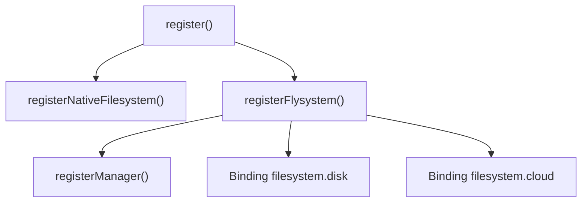
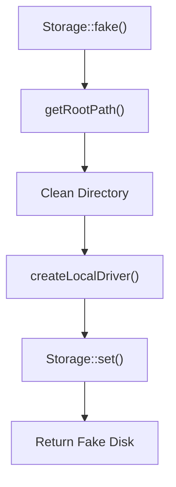

# Filesystem Storage Adapters

<details>
<summary>Relevant source files</summary>

The following files were used as context for generating this wiki page:

- [src/Illuminate/Filesystem/FilesystemManager.php](https://github.com/laravel/framework/blob/main/src/Illuminate/Filesystem/FilesystemManager.php)
- [src/Illuminate/Filesystem/FilesystemAdapter.php](https://github.com/laravel/framework/blob/main/src/Illuminate/Filesystem/FilesystemAdapter.php)
- [src/Illuminate/Support/Facades/Storage.php](https://github.com/laravel/framework/blob/main/src/Illuminate/Support/Facades/Storage.php)
- [src/Illuminate/Filesystem/FilesystemServiceProvider.php](https://github.com/laravel/framework/blob/main/src/Illuminate/Filesystem/FilesystemServiceProvider.php)
- [src/Illuminate/Foundation/Cloud.php](https://github.com/laravel/framework/blob/main/src/Illuminate/Foundation/Cloud.php)
- [src/Illuminate/Contracts/Filesystem/Filesystem.php](https://github.com/laravel/framework/blob/main/src/Illuminate/Contracts/Filesystem/Filesystem.php)
- [src/Illuminate/Filesystem/AwsS3V3Adapter.php](https://github.com/laravel/framework/blob/main/src/Illuminate/Filesystem/AwsS3V3Adapter.php)
- [config/filesystems.php](https://github.com/laravel/framework/blob/main/config/filesystems.php)
- [src/Illuminate/Filesystem/LocalFilesystemAdapter.php](https://github.com/laravel/framework/blob/main/src/Illuminate/Filesystem/LocalFilesystemAdapter.php)
- [src/Illuminate/Contracts/Filesystem/Factory.php](https://github.com/laravel/framework/blob/main/src/Illuminate/Contracts/Filesystem/Factory.php)
- [src/Illuminate/Filesystem/composer.json](https://github.com/laravel/framework/blob/main/src/Illuminate/Filesystem/composer.json)
- [src/Illuminate/Container/Attributes/Storage.php](https://github.com/laravel/framework/blob/main/src/Illuminate/Container/Attributes/Storage.php)
</details>

## Overview

The Laravel filesystem storage system provides a unified, expressive file manipulation interface built on top of underlying Flysystem abstraction layers. It abstracts away the differences between disparate storage backends, allowing developers to interact seamlessly with local disks, remote FTP/SFTP servers, and cloud object storage like Amazon S3 through a consistent API.

Sources: [src/Illuminate/Filesystem/FilesystemManager.php:33-482](https://github.com/laravel/framework/blob/main/src/Illuminate/Filesystem/FilesystemManager.php#L33-L482), [src/Illuminate/Filesystem/FilesystemAdapter.php:45-1159](https://github.com/laravel/framework/blob/main/src/Illuminate/Filesystem/FilesystemAdapter.php#L45-L1159)

The subsystem integrates tightly with the Laravel service container, configuration repositories, and routing infrastructure through manager bootstrapping, static facades, and contextual attribute resolution. This design enables flexible disk configurations, runtime driver extension, and advanced storage features such as temporary signed URLs and streamed file responses.

Sources: [src/Illuminate/Filesystem/FilesystemManager.php:33-482](https://github.com/laravel/framework/blob/main/src/Illuminate/Filesystem/FilesystemManager.php#L33-L482), [src/Illuminate/Support/Facades/Storage.php:94-185](https://github.com/laravel/framework/blob/main/src/Illuminate/Support/Facades/Storage.php#L94-L185), [src/Illuminate/Filesystem/FilesystemServiceProvider.php:11-160](https://github.com/laravel/framework/blob/main/src/Illuminate/Filesystem/FilesystemServiceProvider.php#L11-L160), [src/Illuminate/Container/Attributes/Storage.php:10-31](https://github.com/laravel/framework/blob/main/src/Illuminate/Container/Attributes/Storage.php#L10-L31)

## Manager Bootstrapping and Service Registration

### Overview

The service registration and container bootstrapping sequence for the filesystem subsystem is coordinated through `FilesystemServiceProvider` and executed by `FilesystemManager`. During application startup, the provider binds core native file utilities, the central manager contract, and pre-configured default disks into the service container.

Sources: [src/Illuminate/Filesystem/FilesystemManager.php:33-482](https://github.com/laravel/framework/blob/main/src/Illuminate/Filesystem/FilesystemManager.php#L33-L482), [src/Illuminate/Filesystem/FilesystemServiceProvider.php:11-160](https://github.com/laravel/framework/blob/main/src/Illuminate/Filesystem/FilesystemServiceProvider.php#L11-L160)

### Container Registration Lifecycle

When the framework boots `FilesystemServiceProvider`, its `register()` method invokes individual registration routines in a specific sequence. This sequence registers the raw filesystem handler, instantiates the singleton manager, and exposes default disk instances.



Sources: [src/Illuminate/Filesystem/FilesystemServiceProvider.php:28-32](https://github.com/laravel/framework/blob/main/src/Illuminate/Filesystem/FilesystemServiceProvider.php#L28-L32)

### Container Bindings and Resolved Targets

The service provider establishes several singleton entries in the Laravel service container. Each binding maps an abstract accessor string to its corresponding concrete factory closure or manager resolution method.

| Container Abstract | Resolution Behavior | Return Type | Sources |
| :--- | :--- | :--- | :--- |
| `files` | Instantiates a native PHP filesystem utility singleton. | `\Illuminate\Filesystem\Filesystem` | [src/Illuminate/Filesystem/FilesystemServiceProvider.php:41-43](https://github.com/laravel/framework/blob/main/src/Illuminate/Filesystem/FilesystemServiceProvider.php#L41-L43) |
| `filesystem` | Instantiates the central manager passing the application instance. | `\Illuminate\Filesystem\FilesystemManager` | [src/Illuminate/Filesystem/FilesystemServiceProvider.php:71-73](https://github.com/laravel/framework/blob/main/src/Illuminate/Filesystem/FilesystemServiceProvider.php#L71-L73) |
| `filesystem.disk` | Resolves the default configured disk via `getDefaultDriver()`. | `\Illuminate\Contracts\Filesystem\Filesystem` | [src/Illuminate/Filesystem/FilesystemServiceProvider.php:55-57](https://github.com/laravel/framework/blob/main/src/Illuminate/Filesystem/FilesystemServiceProvider.php#L55-L57) |
| `filesystem.cloud` | Resolves the default cloud disk via `getCloudDriver()`. | `\Illuminate\Contracts\Filesystem\Filesystem` | [src/Illuminate/Filesystem/FilesystemServiceProvider.php:59-61](https://github.com/laravel/framework/blob/main/src/Illuminate/Filesystem/FilesystemServiceProvider.php#L59-L61) |

Sources: [src/Illuminate/Filesystem/FilesystemServiceProvider.php:41-73](https://github.com/laravel/framework/blob/main/src/Illuminate/Filesystem/FilesystemServiceProvider.php#L41-L73)

### Disk Resolution and Factory Routing

When code requests a specific disk via `disk($name)` on `FilesystemManager`, the manager checks the resolved cache or delegates to `resolve($name, $config)`. If a custom creator closure has been registered for the driver via `extend()`, it is invoked; otherwise, the manager dynamically invokes `create{Driver}Driver`.

```
disk() / drive() → enum_value() or default → get() → resolve() → customCreator or create{Driver}Driver()
```

Sources: [src/Illuminate/Filesystem/FilesystemManager.php:74-159](https://github.com/laravel/framework/blob/main/src/Illuminate/Filesystem/FilesystemManager.php#L74-L159)

> [!NOTE]
> `FilesystemManager` implements `Illuminate\Contracts\Filesystem\Factory`, ensuring full compatibility with factory contracts expected throughout container-resolved services and contextual attributes.

Sources: [src/Illuminate/Filesystem/FilesystemManager.php:7-34](https://github.com/laravel/framework/blob/main/src/Illuminate/Filesystem/FilesystemManager.php#L7-L34), [src/Illuminate/Contracts/Filesystem/Factory.php:5-14](https://github.com/laravel/framework/blob/main/src/Illuminate/Contracts/Filesystem/Factory.php#L5-L14)

## Storage Facade and Attribute Resolution

### Overview

The `Storage` facade acts as a static proxy to the underlying `filesystem` container binding, providing shorthand access to disk management and file manipulation methods. Alongside the facade, Laravel provides a contextual attribute class `Illuminate\Container\Attributes\Storage` which allows parameter-level dependency injection of specific filesystem disks by leveraging the container's contextual resolution pipeline.

Sources: [src/Illuminate/Support/Facades/Storage.php:94-184](https://github.com/laravel/framework/blob/main/src/Illuminate/Support/Facades/Storage.php#L94-L184), [src/Illuminate/Container/Attributes/Storage.php:10-31](https://github.com/laravel/framework/blob/main/src/Illuminate/Container/Attributes/Storage.php#L10-L31)

### Facade Accessor and Testing Utilities

The `Storage` facade extends `Illuminate\Support\Facades\Facade` and defines its accessor string via `getFacadeAccessor()`, returning `'filesystem'`. 



Sources: [src/Illuminate/Support/Facades/Storage.php:103-184](https://github.com/laravel/framework/blob/main/src/Illuminate/Support/Facades/Storage.php#L103-L184)

In addition to proxying runtime methods, `Storage` implements testing helpers such as `fake($disk, $config)` and `persistentFake($disk, $config)`. The `fake()` method determines the target disk name, appends parallel testing tokens when applicable, cleans the target directory via `(new Filesystem)->cleanDirectory($root)`, and registers a newly built local driver instance into the manager.

Sources: [src/Illuminate/Support/Facades/Storage.php:103-144](https://github.com/laravel/framework/blob/main/src/Illuminate/Support/Facades/Storage.php#L103-L144)

> [!NOTE]
> `Storage::fake()` automatically binds temporary URL generators to the generated local driver, mapping expiration timestamps to query strings using `URL::to()`.

Sources: [src/Illuminate/Support/Facades/Storage.php:117-125](https://github.com/laravel/framework/blob/main/src/Illuminate/Support/Facades/Storage.php#L117-L125)

### Contextual Attribute Resolution

The `Illuminate\Container\Attributes\Storage` attribute implements `Illuminate\Contracts\Container\ContextualAttribute`. When applied to a constructor parameter using PHP attributes, the container invokes its `resolve()` method.

```php
use Illuminate\Container\Attributes\Storage;
use Illuminate\Contracts\Filesystem\Filesystem;

public function __construct(
    #[Storage('s3')] protected Filesystem $disk
) {}
```

Sources: [src/Illuminate/Container/Attributes/Storage.php:10-30](https://github.com/laravel/framework/blob/main/src/Illuminate/Container/Attributes/Storage.php#L10-L30)

The `resolve()` method accepts the attribute instance and the container instance, executing a container lookup for `'filesystem'` and immediately calling `disk($attribute->disk)` to return the requested disk instance.

Sources: [src/Illuminate/Container/Attributes/Storage.php:27-30](https://github.com/laravel/framework/blob/main/src/Illuminate/Container/Attributes/Storage.php#L27-L30)

## Disk Configuration and Environment Setup

### Overview

Filesystem disk configurations are managed centrally through the `config/filesystems.php` configuration file and dynamically augmented by the `Illuminate\Foundation\Cloud` bootstrapping handler when running on Laravel Cloud. The default filesystem driver is determined by the `FILESYSTEM_DISK` environment variable, defaulting to `'local'`. Supported drivers defined across configuration and cloud bootstrap routines include `'local'`, `'ftp'`, `'sftp'`, `'s3'`, and `'scoped'`.

Sources: [config/filesystems.php:16-28](https://github.com/laravel/framework/blob/main/config/filesystems.php#L16-L28), [src/Illuminate/Foundation/Cloud.php:62-80](https://github.com/laravel/framework/blob/main/src/Illuminate/Foundation/Cloud.php#L62-L80)

### Configuration Structure and Disk Drivers

The `config/filesystems.php` file defines individual named disks under the `disks` key. Each disk specifies its driver and driver-specific parameters such as roots, URLs, and AWS credentials fetched via `env()`.

```php
'default' => env('FILESYSTEM_DISK', 'local'),

'disks' => [
    'local' => [
        'driver' => 'local',
        'root' => storage_path('app/private'),
        'serve' => true,
        'throw' => false,
        'report' => false,
    ],
    'public' => [
        'driver' => 'local',
        'root' => storage_path('app/public'),
        'url' => rtrim((string) env('APP_URL'), '/').'/storage',
        'visibility' => 'public',
        'throw' => false,
        'report' => false,
    ],
    's3' => [
        'driver' => 's3',
        'key' => env('AWS_ACCESS_KEY_ID'),
        'secret' => env('AWS_SECRET_ACCESS_KEY'),
        'region' => env('AWS_DEFAULT_REGION'),
        'bucket' => env('AWS_BUCKET'),
        'url' => env('AWS_URL'),
        'endpoint' => env('AWS_ENDPOINT'),
        'use_path_style_endpoint' => env('AWS_USE_PATH_STYLE_ENDPOINT', false),
        'throw' => false,
        'report' => false,
    ],
],
```

Sources: [config/filesystems.php:16-63](https://github.com/laravel/framework/blob/main/config/filesystems.php#L16-L63)

| Disk Name | Driver | Root Path / Parameters | Default Throw / Report | Sources |
| :--- | :--- | :--- | :--- | :--- |
| `local` | `local` | `storage_path('app/private')`, `serve => true` | `throw => false`, `report => false` | [config/filesystems.php:33-39](https://github.com/laravel/framework/blob/main/config/filesystems.php#L33-L39) |
| `public` | `local` | `storage_path('app/public')`, `visibility => 'public'` | `throw => false`, `report => false` | [config/filesystems.php:41-48](https://github.com/laravel/framework/blob/main/config/filesystems.php#L41-L48) |
| `s3` | `s3` | `bucket`, `key`, `secret`, `region`, `endpoint` | `throw => false`, `report => false` | [config/filesystems.php:50-61](https://github.com/laravel/framework/blob/main/config/filesystems.php#L50-L61) |

Sources: [config/filesystems.php:33-61](https://github.com/laravel/framework/blob/main/config/filesystems.php#L33-L61)

### Cloud Environment Disk Setup

When deployed to Laravel Cloud, `Illuminate\Foundation\Cloud::configureDisks()` inspects the `LARAVEL_CLOUD_DISK_CONFIG` server variable, decodes the JSON payload, and dynamically injects disk definitions into the application container's configuration repository during the `LoadConfiguration` bootstrap phase.

```mermaid
graph TD
    A[LoadConfiguration Bootstrapper] --> B{isset($_SERVER['LARAVEL_CLOUD_DISK_CONFIG'])}
    B -- Yes --> C["json_decode(LARAVEL_CLOUD_DISK_CONFIG)"]
    C --> D{Is scoped_disk?}
    D -- Yes --> E[Set filesystems.disks.disk as scoped driver]
    D -- No --> F[Set filesystems.disks.disk as s3 driver]
    E --> G{Is is_default?}
    F --> G
    G -- Yes --> H[Set filesystems.default = disk]
    G -- No --> I[Next Disk]
```

Sources: [src/Illuminate/Foundation/Cloud.php:37-86](https://github.com/laravel/framework/blob/main/src/Illuminate/Foundation/Cloud.php#L37-L86)

If a configuration entry defines `'scoped_disk'`, the framework registers a `'scoped'` driver pointing to the target disk with an optional prefix. Otherwise, it configures an S3-compatible driver using the provided access keys, bucket, and endpoint parameters with region set to `'auto'` and path-style endpoints disabled.

Sources: [src/Illuminate/Foundation/Cloud.php:61-81](https://github.com/laravel/framework/blob/main/src/Illuminate/Foundation/Cloud.php#L61-L81)

> [!WARNING]
> Environment variables and server constants like `LARAVEL_CLOUD_DISK_CONFIG` take precedence over static configuration files when evaluated inside cloud bootstrapper execution hooks.

Sources: [src/Illuminate/Foundation/Cloud.php:55-86](https://github.com/laravel/framework/blob/main/src/Illuminate/Foundation/Cloud.php#L55-L86)

## Flysystem Adapter Foundation and Operations

### Overview

The `Illuminate\Filesystem\FilesystemAdapter` class wraps underlying Flysystem operator instances (`League\Flysystem\FilesystemOperator`) and adapter implementations (`League\Flysystem\FilesystemAdapter`), implementing both `Illuminate\Contracts\Filesystem\Filesystem` and `Illuminate\Contracts\Filesystem\Cloud`. It manages path prefixing via `League\Flysystem\PathPrefixer`, handles error reporting, and provides conditional execution through `Conditionable` and `Macroable` traits.

Sources: [src/Illuminate/Filesystem/FilesystemAdapter.php:45-51](https://github.com/laravel/framework/blob/main/src/Illuminate/Filesystem/FilesystemAdapter.php#L45-L51), [src/Illuminate/Filesystem/FilesystemAdapter.php:102-120](https://github.com/laravel/framework/blob/main/src/Illuminate/Filesystem/FilesystemAdapter.php#L102-L120)

### Initialization and Path Prefixing

During instantiation, `FilesystemAdapter::__construct()` receives a Flysystem operator driver, a Flysystem adapter, and a configuration array. It establishes the path prefixer using the root path and directory separator specified in the configuration.

```php
public function __construct(FilesystemOperator $driver, FlysystemAdapter $adapter, array $config = [])
{
    $this->driver = $driver;
    $this->adapter = $adapter;
    $this->config = $config;
    $separator = $config['directory_separator'] ?? DIRECTORY_SEPARATOR;

    $this->prefixer = new PathPrefixer($config['root'] ?? '', $separator);

    if (isset($config['prefix'])) {
        $this->prefixer = new PathPrefixer($this->prefixer->prefixPath($config['prefix']), $separator);
    }
}
```

Sources: [src/Illuminate/Filesystem/FilesystemAdapter.php:108-120](https://github.com/laravel/framework/blob/main/src/Illuminate/Filesystem/FilesystemAdapter.php#L108-L120)

### Call-Chain Execution Walkthrough

When writing files via `put()`, execution flows through normalization, stream resolution, and driver interaction:

`put()` → checks if contents is `File` or `UploadedFile` (routes to `putFile()`) → checks if contents is `StreamInterface` or resource (calls `driver->writeStream()`) → falls back to `driver->write()` for string contents. If an exception such as `UnableToWriteFile` or `UnableToSetVisibility` occurs, `throwsExceptions()` is evaluated; if false, the exception is reported and `false` is returned.

```mermaid
graph TD
    A[put $path, $contents, $options] --> B{is_string($options)}
    B -- Yes --> C[Normalize options to array]
    B -- No --> D[Cast options to array]
    C --> E{contents instance of File or UploadedFile?}
    D --> E
    E -- Yes --> F[putFile path, contents, options]
    E -- No --> G{contents instance of StreamInterface?}
    G -- Yes --> H[driver->writeStream detach stream, options]
    G -- No --> I{is_resource contents?}
    I -- Yes --> J[driver->writeStream contents, options]
    I -- No --> K[driver->write path, contents, options]
    H --> L[Return true]
    J --> L
    K --> L
    F --> M[Return result or false]
```

Sources: [src/Illuminate/Filesystem/FilesystemAdapter.php:430-463](https://github.com/laravel/framework/blob/main/src/Illuminate/Filesystem/FilesystemAdapter.php#L430-L463)

> [!NOTE]
> If `throw` is configured as `true` on the disk, caught Flysystem exceptions are rethrown immediately rather than being caught, reported, and converted to boolean failure responses.

Sources: [src/Illuminate/Filesystem/FilesystemAdapter.php:310-315](https://github.com/laravel/framework/blob/main/src/Illuminate/Filesystem/FilesystemAdapter.php#L310-L315), [src/Illuminate/Filesystem/FilesystemAdapter.php:1112-1115](https://github.com/laravel/framework/blob/main/src/Illuminate/Filesystem/FilesystemAdapter.php#L1112-L1115)

### Filesystem Contract Operations Reference

The filesystem contract and adapter define visibility constants and core methods for manipulating files, directories, and streams.

| Constant / Method | Return Type | Purpose / Description | Sources |
| :--- | :--- | :--- | :--- |
| `VISIBILITY_PUBLIC` | `string` (`'public'`) | Represents public file visibility. | [src/Illuminate/Contracts/Filesystem/Filesystem.php:11-13](https://github.com/laravel/framework/blob/main/src/Illuminate/Contracts/Filesystem/Filesystem.php#L11-L13) |
| `VISIBILITY_PRIVATE` | `string` (`'private'`) | Represents private file visibility. | [src/Illuminate/Contracts/Filesystem/Filesystem.php:18-20](https://github.com/laravel/framework/blob/main/src/Illuminate/Contracts/Filesystem/Filesystem.php#L18-L20) |
| `exists(string $path)` | `bool` | Determine if a file or directory exists via `driver->has()`. | [src/Illuminate/Filesystem/FilesystemAdapter.php:229-232](https://github.com/laravel/framework/blob/main/src/Illuminate/Filesystem/FilesystemAdapter.php#L229-L232) |
| `get(string $path)` | `string\|null` | Get the string contents of a file. | [src/Illuminate/Filesystem/FilesystemAdapter.php:306-315](https://github.com/laravel/framework/blob/main/src/Illuminate/Filesystem/FilesystemAdapter.php#L306-L315) |
| `readStream(string $path)` | `resource\|null` | Get a readable stream resource for a file. | [src/Illuminate/Filesystem/FilesystemAdapter.php:723-732](https://github.com/laravel/framework/blob/main/src/Illuminate/Filesystem/FilesystemAdapter.php#L723-L732) |
| `put(string $path, $contents, $options)` | `bool\|string` | Write contents or stream to a path. | [src/Illuminate/Filesystem/FilesystemAdapter.php:430-463](https://github.com/laravel/framework/blob/main/src/Illuminate/Filesystem/FilesystemAdapter.php#L430-L463) |
| `putFile($path, $file, $options)` | `string\|false` | Store an uploaded file with an automatic hash name. | [src/Illuminate/Filesystem/FilesystemAdapter.php:473-482](https://github.com/laravel/framework/blob/main/src/Illuminate/Filesystem/FilesystemAdapter.php#L473-L482) |
| `putFileAs($path, $file, $name, $options)` | `string\|false` | Store an uploaded file with a specific name. | [src/Illuminate/Filesystem/FilesystemAdapter.php:493-513](https://github.com/laravel/framework/blob/main/src/Illuminate/Filesystem/FilesystemAdapter.php#L493-L513) |
| `writeStream($path, $resource, $options)` | `bool` | Write a new file using a stream resource. | [src/Illuminate/Filesystem/FilesystemAdapter.php:737-750](https://github.com/laravel/framework/blob/main/src/Illuminate/Filesystem/FilesystemAdapter.php#L737-L750) |
| `visibility($path)` | `string` | Get public or private visibility status. | [src/Illuminate/Filesystem/FilesystemAdapter.php:521-528](https://github.com/laravel/framework/blob/main/src/Illuminate/Filesystem/FilesystemAdapter.php#L521-L528) |
| `delete($paths)` | `bool` | Delete one or more files. | [src/Illuminate/Filesystem/FilesystemAdapter.php:592-611](https://github.com/laravel/framework/blob/main/src/Illuminate/Filesystem/FilesystemAdapter.php#L592-L611) |
| `copy($from, $to)` | `bool` | Copy a file to a new location. | [src/Illuminate/Filesystem/FilesystemAdapter.php:620-633](https://github.com/laravel/framework/blob/main/src/Illuminate/Filesystem/FilesystemAdapter.php#L620-L633) |
| `move($from, $to)` | `bool` | Move or rename a file. | [src/Illuminate/Filesystem/FilesystemAdapter.php:642-655](https://github.com/laravel/framework/blob/main/src/Illuminate/Filesystem/FilesystemAdapter.php#L642-L655) |

Sources: [src/Illuminate/Contracts/Filesystem/Filesystem.php:11-20](https://github.com/laravel/framework/blob/main/src/Illuminate/Contracts/Filesystem/Filesystem.php#L11-L20), [src/Illuminate/Filesystem/FilesystemAdapter.php:229-655](https://github.com/laravel/framework/blob/main/src/Illuminate/Filesystem/FilesystemAdapter.php#L229-L655)

### Design Trade-Offs

| Design Choice | Benefit | Cost | Sources |
| :--- | :--- | :--- | :--- |
| **League\Flysystem Wrapper Pattern** | Decouples framework logic from specific storage backend APIs, allowing uniform access across local, FTP, SFTP, and S3 drivers. | Adds an abstraction layer and method-forwarding overhead through `__call`. | [src/Illuminate/Filesystem/FilesystemAdapter.php:1151-1158](https://github.com/laravel/framework/blob/main/src/Illuminate/Filesystem/FilesystemAdapter.php#L1151-L1158) |
| **Exception Suppression & Reporting** | Prevents storage failures from crashing requests when `throw` is disabled, reporting to exception handler instead. | Can mask underlying storage configuration errors or permission issues if logs are unmonitored. | [src/Illuminate/Filesystem/FilesystemAdapter.php:454-460](https://github.com/laravel/framework/blob/main/src/Illuminate/Filesystem/FilesystemAdapter.php#L454-L460) |
| **Stream-Based File Storage (`putFile`)** | Reduces memory consumption when handling large uploaded files by streaming chunks directly to the storage driver. | Requires proper stream resource management and closing handles across drivers. | [src/Illuminate/Filesystem/FilesystemAdapter.php:436-442](https://github.com/laravel/framework/blob/main/src/Illuminate/Filesystem/FilesystemAdapter.php#L436-L442) |

Sources: [src/Illuminate/Filesystem/FilesystemAdapter.php:436-1158](https://github.com/laravel/framework/blob/main/src/Illuminate/Filesystem/FilesystemAdapter.php#L436-L1158)

## Local and S3 Driver Adapters

### Overview

Laravel's filesystem manager and adapters provide driver-specific behavior for local disk paths and cloud storage integrations. The `FilesystemManager` initializes local drivers via `createLocalDriver()` using League Flysystem's `LocalFilesystemAdapter`, `PortableVisibilityConverter`, and link-handling constants. Simultaneously, the Amazon S3 driver is configured via `createS3Driver()`, which parses AWS S3 parameters, sets up an `S3Client` instance, wraps it in an `AwsS3V3Adapter`, and supports cloud object storage operations including presigned URLs.

Sources: [src/Illuminate/Filesystem/FilesystemManager.php:173-202](https://github.com/laravel/framework/blob/main/src/Illuminate/Filesystem/FilesystemManager.php#L173-L202), [src/Illuminate/Filesystem/FilesystemManager.php:243-267](https://github.com/laravel/framework/blob/main/src/Illuminate/Filesystem/FilesystemManager.php#L243-L267)

### Local and S3 Driver Creation Walkthrough

The creation of storage drivers follows an explicit bootstrapping sequence within the manager:

1. `FilesystemManager::disk()` or `drive()` resolves the driver name using configuration or default driver settings.
2. `FilesystemManager::resolve()` checks for custom creators or dispatches to `createLocalDriver()` or `createS3Driver()`.
3. For local disks, `createLocalDriver()` parses permissions into a `PortableVisibilityConverter`, configures symbolic link behavior (`LocalAdapter::SKIP_LINKS` or `LocalAdapter::DISALLOW_LINKS`), instantiates the adapter, and wraps it in a `LocalFilesystemAdapter`.
4. For S3 disks, `createS3Driver()` runs `formatS3Config()` to populate default options (such as version `'latest'`), builds credentials from keys and tokens, instantiates an `S3Client`, and wraps the resulting adapter in an `AwsS3V3Adapter`.
5. `FilesystemManager::createFlysystem()` checks for read-only wrappers (`ReadOnlyFilesystemAdapter`), directory prefixes (`PathPrefixedAdapter`), and Cloudflare R2 compatibility (`retain_visibility`), before instantiating the Flysystem core operator.

Sources: [src/Illuminate/Filesystem/FilesystemManager.php:85-90](https://github.com/laravel/framework/blob/main/src/Illuminate/Filesystem/FilesystemManager.php#L85-L90), [src/Illuminate/Filesystem/FilesystemManager.php:138-159](https://github.com/laravel/framework/blob/main/src/Illuminate/Filesystem/FilesystemManager.php#L138-L159), [src/Illuminate/Filesystem/FilesystemManager.php:173-202](https://github.com/laravel/framework/blob/main/src/Illuminate/Filesystem/FilesystemManager.php#L173-L202), [src/Illuminate/Filesystem/FilesystemManager.php:243-288](https://github.com/laravel/framework/blob/main/src/Illuminate/Filesystem/FilesystemManager.php#L243-L288), [src/Illuminate/Filesystem/FilesystemManager.php:338-360](https://github.com/laravel/framework/blob/main/src/Illuminate/Filesystem/FilesystemManager.php#L338-L360)

### Temporary URLs and Signed Routing

Both `LocalFilesystemAdapter` and `AwsS3V3Adapter` implement temporary URL generation capabilities, differing in how signatures and links are resolved.

| Adapter Class | Supports Temporary URLs? | Supports Temporary Upload URLs? | Implementation Mechanism | Sources |
| :--- | :--- | :--- | :--- | :--- |
| `LocalFilesystemAdapter` | Conditional (`providesTemporaryUrls()`) | Conditional (`providesTemporaryUploadUrls()`) | Resolves a signed route via `urlGeneratorResolver` pointing to named routes like `storage.{disk}` or `storage.{disk}.upload`. | [src/Illuminate/Filesystem/LocalFilesystemAdapter.php:39-56](https://github.com/laravel/framework/blob/main/src/Illuminate/Filesystem/LocalFilesystemAdapter.php#L39-L56) |
| `AwsS3V3Adapter` | Yes (`providesTemporaryUrls()`) | Yes (`providesTemporaryUploadUrls()`) | Uses AWS S3 SDK commands (`GetObject`, `PutObject`) via `createPresignedRequest()` on the underlying `S3Client`. | [src/Illuminate/Filesystem/AwsS3V3Adapter.php:65-141](https://github.com/laravel/framework/blob/main/src/Illuminate/Filesystem/AwsS3V3Adapter.php#L65-L141) |

Sources: [src/Illuminate/Filesystem/AwsS3V3Adapter.php:65-141](https://github.com/laravel/framework/blob/main/src/Illuminate/Filesystem/AwsS3V3Adapter.php#L65-L141), [src/Illuminate/Filesystem/LocalFilesystemAdapter.php:39-56](https://github.com/laravel/framework/blob/main/src/Illuminate/Filesystem/LocalFilesystemAdapter.php#L39-L56)

> [!NOTE]
> When Cloudflare R2 endpoints (`r2.cloudflarestorage.com`) are detected during S3 driver creation, `retain_visibility` is automatically set to `false` to align with R2 API constraints regarding visibility metadata.

Sources: [src/Illuminate/Filesystem/FilesystemManager.php:348-350](https://github.com/laravel/framework/blob/main/src/Illuminate/Filesystem/FilesystemManager.php#L348-L350)

> [!WARNING]
> Local temporary URLs require `shouldServeSignedUrls` to be enabled and an active `urlGeneratorResolver` closure to function; otherwise, calling `temporaryUrl()` throws a `RuntimeException`.

Sources: [src/Illuminate/Filesystem/LocalFilesystemAdapter.php:39-44](https://github.com/laravel/framework/blob/main/src/Illuminate/Filesystem/LocalFilesystemAdapter.php#L39-L44), [src/Illuminate/Filesystem/LocalFilesystemAdapter.php:76-78](https://github.com/laravel/framework/blob/main/src/Illuminate/Filesystem/LocalFilesystemAdapter.php#L76-L78)

### Driver Configuration and Adapter Design Trade-Offs

| Design Choice | Benefit | Cost | Sources |
| :--- | :--- | :--- | :--- |
| **AWS SDK Presigned Request Generation** | Delegates signature generation directly to the official AWS SDK (`S3Client::createPresignedRequest`), ensuring compliance with AWS auth protocols. | Tightly couples the S3 driver implementation to the AWS SDK package requirements. | [src/Illuminate/Filesystem/AwsS3V3Adapter.php:95-97](https://github.com/laravel/framework/blob/main/src/Illuminate/Filesystem/AwsS3V3Adapter.php#L95-L97) |
| **Local Signed Route Fallback** | Allows local filesystems to use standard Laravel temporary signed routes without requiring external cloud buckets or object storage. | Requires the application router and URL generator to be correctly configured for absolute route generation. | [src/Illuminate/Filesystem/LocalFilesystemAdapter.php:80-87](https://github.com/laravel/framework/blob/main/src/Illuminate/Filesystem/LocalFilesystemAdapter.php#L80-L87) |
| **Configurable Symbolic Link Handling (`skip` vs `disallow`)** | Prevents unintended traversal or follows links safely depending on configuration options (`LocalAdapter::SKIP_LINKS`). | Requires explicit configuration settings (`links => skip`) in the filesystem configuration array. | [src/Illuminate/Filesystem/FilesystemManager.php:186-192](https://github.com/laravel/framework/blob/main/src/Illuminate/Filesystem/FilesystemManager.php#L186-L192) |

Sources: [src/Illuminate/Filesystem/AwsS3V3Adapter.php:95-97](https://github.com/laravel/framework/blob/main/src/Illuminate/Filesystem/AwsS3V3Adapter.php#L95-L97), [src/Illuminate/Filesystem/LocalFilesystemAdapter.php:80-87](https://github.com/laravel/framework/blob/main/src/Illuminate/Filesystem/LocalFilesystemAdapter.php#L80-L87), [src/Illuminate/Filesystem/FilesystemManager.php:186-192](https://github.com/laravel/framework/blob/main/src/Illuminate/Filesystem/FilesystemManager.php#L186-L192)

## Related

- [[Cache Storage Backends]]

