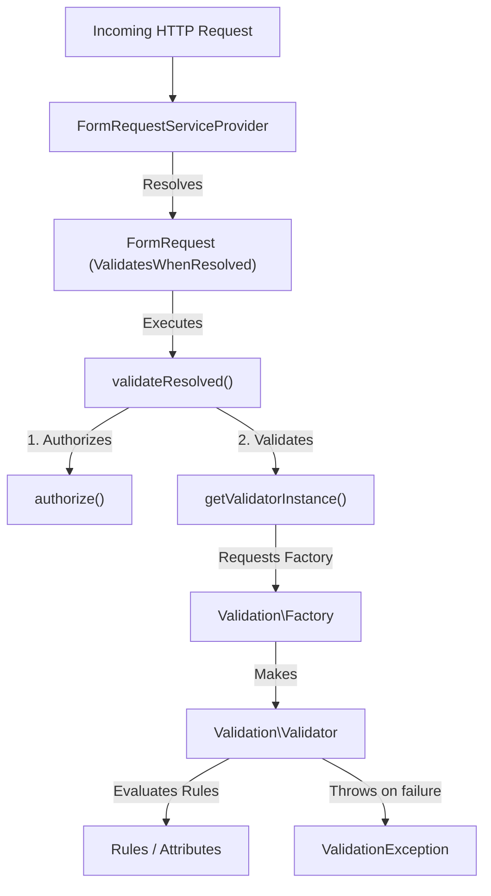
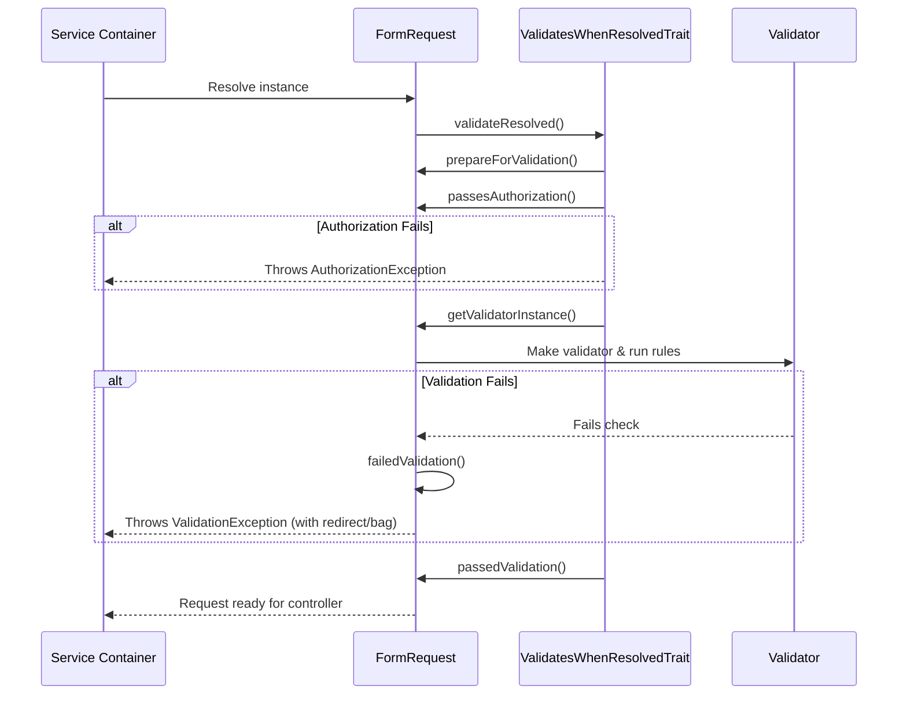
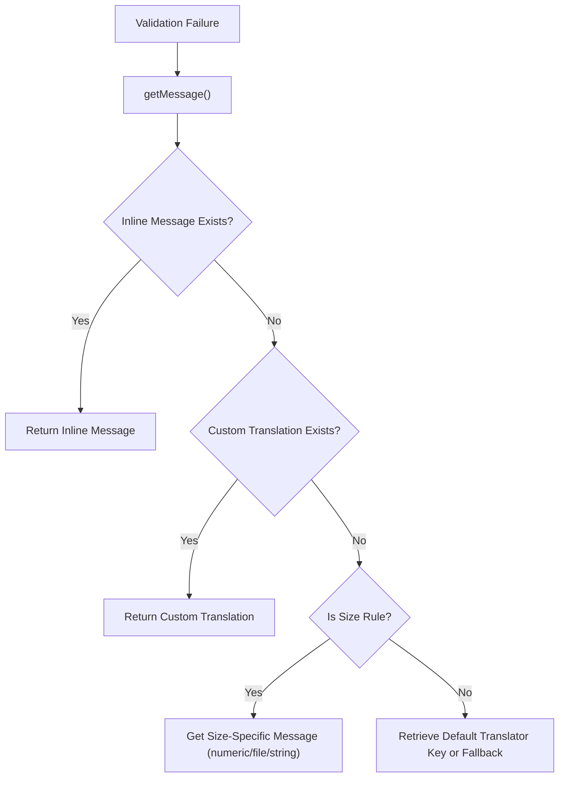

# Form Requests & Validation

<details>
<summary>Relevant source files</summary>

The following files were used as context for generating this wiki page:

- [src/Illuminate/Validation/Validator.php](https://github.com/laravel/framework/blob/main/src/Illuminate/Validation/Validator.php)
- [src/Illuminate/Foundation/Http/FormRequest.php](https://github.com/laravel/framework/blob/main/src/Illuminate/Foundation/Http/FormRequest.php)
- [src/Illuminate/Foundation/Providers/FoundationServiceProvider.php](https://github.com/laravel/framework/blob/main/src/Illuminate/Foundation/Providers/FoundationServiceProvider.php)
- [src/Illuminate/Http/Request.php](https://github.com/laravel/framework/blob/main/src/Illuminate/Http/Request.php)
- [src/Illuminate/Support/Facades/Request.php](https://github.com/laravel/framework/blob/main/src/Illuminate/Support/Facades/Request.php)
- [src/Illuminate/Validation/Factory.php](https://github.com/laravel/framework/blob/main/src/Illuminate/Validation/Factory.php)
- [src/Illuminate/Foundation/Validation/ValidatesRequests.php](https://github.com/laravel/framework/blob/main/src/Illuminate/Foundation/Validation/ValidatesRequests.php)
- [src/Illuminate/Foundation/Providers/FormRequestServiceProvider.php](https://github.com/laravel/framework/blob/main/src/Illuminate/Foundation/Providers/FormRequestServiceProvider.php)
- [src/Illuminate/Validation/Concerns/ReplacesAttributes.php](https://github.com/laravel/framework/blob/main/src/Illuminate/Validation/Concerns/ReplacesAttributes.php)
- [src/Illuminate/Validation/ValidatesWhenResolvedTrait.php](https://github.com/laravel/framework/blob/main/src/Illuminate/Validation/ValidatesWhenResolvedTrait.php)
- [src/Illuminate/Validation/Concerns/FormatsMessages.php](https://github.com/laravel/framework/blob/main/src/Illuminate/Validation/Concerns/FormatsMessages.php)
- [src/Illuminate/Foundation/Http/Middleware/TransformsRequest.php](https://github.com/laravel/framework/blob/main/src/Illuminate/Foundation/Http/Middleware/TransformsRequest.php)
- [src/Illuminate/Support/ValidatedInput.php](https://github.com/laravel/framework/blob/main/src/Illuminate/Support/ValidatedInput.php)
- [src/Illuminate/Foundation/Auth/EmailVerificationRequest.php](https://github.com/laravel/framework/blob/main/src/Illuminate/Foundation/Auth/EmailVerificationRequest.php)
- [src/Illuminate/Validation/Rules/File.php](https://github.com/laravel/framework/blob/main/src/Illuminate/Validation/Rules/File.php)
- [src/Illuminate/Http/Concerns/CanBePrecognitive.php](https://github.com/laravel/framework/blob/main/src/Illuminate/Http/Concerns/CanBePrecognitive.php)
- [src/Illuminate/Foundation/Console/RequestMakeCommand.php](https://github.com/laravel/framework/blob/main/src/Illuminate/Foundation/Console/RequestMakeCommand.php)
- [src/Illuminate/Validation/Concerns/ValidatesAttributes.php](https://github.com/laravel/framework/blob/main/src/Illuminate/Validation/Concerns/ValidatesAttributes.php)
</details>

## Overview

### Introduction and System Purpose

The Form Requests & Validation subsystem provides a robust, extensible pipeline for verifying HTTP input, validating payload data structures, enforcing access control policies, and transforming raw request parameters into structured types. At its core, validation operates independently as a rule-evaluation engine via `Illuminate\Validation\Validator`, while HTTP-level integration is achieved through custom request subclasses (`Illuminate\Foundation\Http\FormRequest`), request macros registered in service providers, and trait-based controller helpers (`Illuminate\Foundation\Validation\ValidatesRequests`).
Sources: [src/Illuminate/Validation/Validator.php:24-28](https://github.com/laravel/framework/blob/main/src/Illuminate/Validation/Validator.php#L24-L28)

Separating validation logic from application controllers decouples HTTP input handling from business logic. Form Requests leverage Laravel's service container to automatically intercept incoming HTTP requests during dependency resolution via the `ValidatesWhenResolved` contract. Before a controller action ever executes, the Form Request performs automatic data sanitization placeholder mapping, authorization checks, and rule evaluation, throwing a catchable `ValidationException` or `AuthorizationException` on failure.
Sources: [src/Illuminate/Foundation/Http/FormRequest.php:22-24](https://github.com/laravel/framework/blob/main/src/Illuminate/Foundation/Http/FormRequest.php#L22-L24)

This subsystem addresses complex data hierarchies through dot-notation expansion, implicit rule detection, wildcard iteration, and precognitive request filtering. By consolidating error message formatting, attribute translations, and safe-input extraction (`ValidatedInput`) into cohesive traits and classes, the validation architecture ensures that data passing downstream is strictly validated, completely typed, and stripped of unvalidated or prohibited fields.
Sources: [src/Illuminate/Foundation/Validation/ValidatesRequests.php:10-12](https://github.com/laravel/framework/blob/main/src/Illuminate/Foundation/Validation/ValidatesRequests.php#L10-L12)

---

## Architectural Components and Dependency Wiring

### Service Providers and Component Factories

The validation and form request subsystem relies on a set of core service providers, container bindings, and component factories that wire up request interception and rule evaluation. When an application boots, `FoundationServiceProvider` registers essential singletons, request macros, and aggregates `FormRequestServiceProvider`.
Sources: [src/Illuminate/Foundation/Providers/FoundationServiceProvider.php:46-49](https://github.com/laravel/framework/blob/main/src/Illuminate/Foundation/Providers/FoundationServiceProvider.php#L46-L49)


Sources: [src/Illuminate/Foundation/Providers/FormRequestServiceProvider.php:5-7](https://github.com/laravel/framework/blob/main/src/Illuminate/Foundation/Providers/FormRequestServiceProvider.php#L5-L7)

### Container Resolution Hooks

The `FormRequestServiceProvider` listens for any class implementing `Illuminate\Contracts\Validation\ValidatesWhenResolved` and hooks into the container's after-resolving lifecycle event to immediately trigger validation. Concurrently, it binds incoming `FormRequest` instances by cloning or initializing them from the current global base request and injecting the application container and route redirector.
Sources: [src/Illuminate/Foundation/Providers/FormRequestServiceProvider.php:27-31](https://github.com/laravel/framework/blob/main/src/Illuminate/Foundation/Providers/FormRequestServiceProvider.php#L27-L31)

```php
// Registration of resolving hooks in FormRequestServiceProvider
$this->app->afterResolving(ValidatesWhenResolved::class, function ($resolved) {
    $resolved->validateResolved();
});

$this->app->resolving(FormRequest::class, function ($request, $app) {
    $request = FormRequest::createFrom($app['request'], $request);
    $request->setContainer($app)->setRedirector($app->make(Redirector::class));
});
```
Sources: [src/Illuminate/Foundation/Providers/FormRequestServiceProvider.php:27-37](https://github.com/laravel/framework/blob/main/src/Illuminate/Foundation/Providers/FormRequestServiceProvider.php#L27-L37)

---

## Form Request Lifecycle & Resolution Pipeline

### Execution Flow and Resolution Phases

When a `FormRequest` is type-hinted on a controller method, Laravel resolves it from the service container. This triggers the execution pipeline defined by `ValidatesWhenResolvedTrait` and `FormRequest`.
Sources: [src/Illuminate/Validation/ValidatesWhenResolvedTrait.php:8-10](https://github.com/laravel/framework/blob/main/src/Illuminate/Validation/ValidatesWhenResolvedTrait.php#L8-L10)


Sources: [src/Illuminate/Validation/ValidatesWhenResolvedTrait.php:17-36](https://github.com/laravel/framework/blob/main/src/Illuminate/Validation/ValidatesWhenResolvedTrait.php#L17-L36)

### Detailed Validation Sequence

The exact execution flow during `validateResolved()` follows a strict sequence:
1. `prepareForValidation()`: Allows subclasses to sanitize or morph input data prior to validation.
Sources: [src/Illuminate/Validation/ValidatesWhenResolvedTrait.php:19-19](https://github.com/laravel/framework/blob/main/src/Illuminate/Validation/ValidatesWhenResolvedTrait.php#L19-L19)
2. `passesAuthorization()`: Evaluates the `authorize()` method. If it returns an `AuthorizationResponse` or boolean `false`, `failedAuthorization()` throws an `AuthorizationException`.
Sources: [src/Illuminate/Validation/ValidatesWhenResolvedTrait.php:21-23](https://github.com/laravel/framework/blob/main/src/Illuminate/Validation/ValidatesWhenResolvedTrait.php#L21-L23)
3. `getValidatorInstance()`: Resolves the `ValidationFactory`, loads rules from `rules()`, custom messages from `messages()`, and attribute display names from `attributes()`. It also applies class-based attributes such as `StopOnFirstFailure`, `ErrorBag`, and `RedirectTo`.
Sources: [src/Illuminate/Foundation/Http/FormRequest.php:94-130](https://github.com/laravel/framework/blob/main/src/Illuminate/Foundation/Http/FormRequest.php#L94-L130)
4. Rule evaluation: If `instance->fails()` evaluates to true, `failedValidation()` builds the `ValidationException` containing the configured error bag and redirect target.
Sources: [src/Illuminate/Validation/ValidatesWhenResolvedTrait.php:31-33](https://github.com/laravel/framework/blob/main/src/Illuminate/Validation/ValidatesWhenResolvedTrait.php#L31-L33)

> [!NOTE]
> If a request is flagged as precognitive (`isPrecognitive()`), the default validator automatically filters its rule set to evaluate only the attributes requested by the client via precognition headers, and appends an after-validation hook.
Sources: [src/Illuminate/Foundation/Http/FormRequest.php:181-185](https://github.com/laravel/framework/blob/main/src/Illuminate/Foundation/Http/FormRequest.php#L181-L185)

---

## Validator Engine & Rule Evaluation Mechanics

### Evaluation Loop and Rule Iteration

The `Illuminate\Validation\Validator` engine coordinates rule parsing, implicit attribute expansion, condition checking, and error collection. When `passes()` is called, the engine iterates over all configured rules for each attribute.
Sources: [src/Illuminate/Validation/Validator.php:467-476](https://github.com/laravel/framework/blob/main/src/Illuminate/Validation/Validator.php#L467-L476)

```php
foreach ($this->rules as $attribute => $rules) {
    if ($this->shouldBeExcluded($attribute)) {
        $this->removeAttribute($attribute);
        continue;
    }
    if ($this->stopOnFirstFailure && $this->messages->isNotEmpty()) {
        break;
    }
    foreach ($rules as $rule) {
        $this->validateAttribute($attribute, $rule);
        if ($this->shouldBeExcluded($attribute)) {
            break;
        }
        if ($this->shouldStopValidating($attribute)) {
            break;
        }
    }
}
```
Sources: [src/Illuminate/Validation/Validator.php:476-497](https://github.com/laravel/framework/blob/main/src/Illuminate/Validation/Validator.php#L476-L497)

### Validatability Invariants

Before executing any rule method (e.g., `validateRequired`, `validateMin`), `isValidatable()` verifies whether the attribute should be validated against the current rule:
Sources: [src/Illuminate/Validation/Validator.php:820-825](https://github.com/laravel/framework/blob/main/src/Illuminate/Validation/Validator.php#L820-L825)

```php
protected function isValidatable($rule, $attribute, $value)
{
    if (in_array($rule, $this->excludeRules)) {
        return true;
    }

    return $this->presentOrRuleIsImplicit($rule, $attribute, $value) &&
           $this->passesOptionalCheck($attribute) &&
           $this->isNotNullIfMarkedAsNullable($rule, $attribute) &&
           $this->hasNotFailedPreviousRuleIfPresenceRule($rule, $attribute);
}
```
Sources: [src/Illuminate/Validation/Validator.php:820-830](https://github.com/laravel/framework/blob/main/src/Illuminate/Validation/Validator.php#L820-L830)

> [!WARNING]
> Database presence rules (`Unique` and `Exists`) include a safety guard (`hasNotFailedPreviousRuleIfPresenceRule`) that prevents database queries if prior rules on the attribute have already failed. This protects underlying database drivers from malformed input or type comparison errors.
Sources: [src/Illuminate/Validation/Validator.php:905-908](https://github.com/laravel/framework/blob/main/src/Illuminate/Validation/Validator.php#L905-L908)

---

## Rule Types and Classification

### Categorization Table

The `Validator` class categorizes rules into distinct internal groups that dictate execution behavior, implicit presence checks, and dependency resolution.
Sources: [src/Illuminate/Validation/Validator.php:184-280](https://github.com/laravel/framework/blob/main/src/Illuminate/Validation/Validator.php#L184-L280)

| Rule Category | Description | Example Rules |
| :--- | :--- | :--- |
| **Implicit Rules** | Evaluated even if the field is missing or empty from the input data. | `Required`, `Accepted`, `Present`, `Missing`, `Filled` |
| **Dependent Rules** | Rules that accept other field names as parameters and require wildcard or dot-notation replacement. | `After`, `Confirmed`, `Same`, `Unique`, `Exists`, `RequiredIf` |
| **File Rules** | Rules applied specifically to uploaded file instances and validation checks. | `File`, `Image`, `Mimes`, `Mimetypes`, `Dimensions`, `Extensions` |
| **Exclude Rules** | Rules capable of excluding an attribute from the final validated data array. | `Exclude`, `ExcludeIf`, `ExcludeUnless`, `ExcludeWith` |
| **Size Rules** | Rules measuring string length, numeric magnitude, array counts, or file sizes. | `Size`, `Between`, `Min`, `Max`, `Gt`, `Lt`, `Gte`, `Lte` |

Sources: [src/Illuminate/Validation/Validator.php:184-295](https://github.com/laravel/framework/blob/main/src/Illuminate/Validation/Validator.php#L184-L295)

---

## Error Formatting and Message Replacement

### Message Resolution Pipeline

When validation fails, `FormatsMessages` handles translation lookup, inline error retrieval, and placeholder replacement. Messages can be customized globally, per attribute, or per rule.
Sources: [src/Illuminate/Validation/Concerns/FormatsMessages.php:12-24](https://github.com/laravel/framework/blob/main/src/Illuminate/Validation/Concerns/FormatsMessages.php#L12-L24)


Sources: [src/Illuminate/Validation/Concerns/FormatsMessages.php:23-74](https://github.com/laravel/framework/blob/main/src/Illuminate/Validation/Concerns/FormatsMessages.php#L23-L74)

### Placeholder Substitution

The placeholder replacement engine parses standard tokens within message strings and translates them into context-aware display values:
- `:attribute`: Replaced by the displayable attribute name (derived from custom attribute mappings, language files, or snake-case string formatting).
Sources: [src/Illuminate/Validation/Concerns/FormatsMessages.php:359-366](https://github.com/laravel/framework/blob/main/src/Illuminate/Validation/Concerns/FormatsMessages.php#L359-L366)
- `:input`: Replaced by the actual scalar value submitted under validation.
Sources: [src/Illuminate/Validation/Concerns/FormatsMessages.php:478-497](https://github.com/laravel/framework/blob/main/src/Illuminate/Validation/Concerns/FormatsMessages.php#L478-L497)
- `:index` / `:position` / `:ordinal-position`: Automatically computed for nested array iterations (e.g., converting array indices into readable words like `first`, `second`, or localized ordinals).
Sources: [src/Illuminate/Validation/Concerns/FormatsMessages.php:375-412](https://github.com/laravel/framework/blob/main/src/Illuminate/Validation/Concerns/FormatsMessages.php#L375-L412)

---

## Safe Input Extraction & Validated Data

### Data Retrieval and Sanitization

Once validation passes, developers extract validated data using the `validated()` method or retrieve a wrapped `ValidatedInput` instance via the `safe()` method.
Sources: [src/Illuminate/Validation/Validator.php:631-649](https://github.com/laravel/framework/blob/main/src/Illuminate/Validation/Validator.php#L631-L649)

```php
// Extracting specific keys as safe input in a controller or form request
$validated = $request->safe()->only(['name', 'email']);

// Accessing validated input dynamically or checking existence
if ($request->safe()->has('email')) {
    $email = $request->safe()->email;
}
```
Sources: [src/Illuminate/Support/ValidatedInput.php:48-62](https://github.com/laravel/framework/blob/main/src/Illuminate/Support/ValidatedInput.php#L48-L62), [src/Illuminate/Support/ValidatedInput.php:166-170](https://github.com/laravel/framework/blob/main/src/Illuminate/Support/ValidatedInput.php#L166-170)

### Validated Input Container

The `ValidatedInput` class implements `ValidatedData`, `Dumpable`, and `InteractsWithData`, providing helper methods like `all()`, `only()`, `except()`, `file()`, and array access methods. Unvalidated array keys are automatically stripped based on the validator configuration (`excludeUnvalidatedArrayKeys`).
Sources: [src/Illuminate/Support/ValidatedInput.php:11-20](https://github.com/laravel/framework/blob/main/src/Illuminate/Support/ValidatedInput.php#L11-L20), [src/Illuminate/Validation/Validator.php:660-665](https://github.com/laravel/framework/blob/main/src/Illuminate/Validation/Validator.php#L660-L665)

---

## Design Trade-offs & Implementation Decisions

### Architectural Trade-off Analysis

| Design Choice | Benefit | Cost / Trade-off |
| :--- | :--- | :--- |
| **Automatic Form Request Resolution via Container After-Resolving** | Zero-boilerplate request validation in controller actions without manual invocation calls. | Implicit resolution hooks can make control flow harder to trace for developers unfamiliar with container events. |
| **Placeholder Hash Encoding for Nested Array Keys** | Robust handling of literal dots and asterisks within multidimensional array validation keys. | Requires encoding/decoding overhead (`__dot__hash`) during rule parsing and data lookup phases. |
| **Precognitive Rule Filtering** | Enables live, partial attribute validation for frontend frameworks without running the entire rule suite. | Requires specialized request header handling (`Precognition-Validate-Only`) and runtime rule subsetting. |
| **Lazy Validation Execution** | Messages and error bags are only compiled when validation is explicitly evaluated or accessed. | Deferred evaluation requires null-checks across data extraction methods (`validated()`, `messages()`). |

Sources: [src/Illuminate/Validation/Validator.php:354-392](https://github.com/laravel/framework/blob/main/src/Illuminate/Validation/Validator.php#L354-L392), [src/Illuminate/Foundation/Providers/FormRequestServiceProvider.php:28-31](https://github.com/laravel/framework/blob/main/src/Illuminate/Foundation/Providers/FormRequestServiceProvider.php#L28-L31), [src/Illuminate/Http/Concerns/CanBePrecognitive.php:15-26](https://github.com/laravel/framework/blob/main/src/Illuminate/Http/Concerns/CanBePrecognitive.php#L15-L26), [src/Illuminate/Validation/Validator.php:645-649](https://github.com/laravel/framework/blob/main/src/Illuminate/Validation/Validator.php#L645-L649)

---

## Complete Usage Example

### Full Form Request Implementation

The following example demonstrates a fully realized custom `FormRequest` implementing authorization, validation rules, custom error messages, attribute renaming, and safe input retrieval.
Sources: [src/Illuminate/Foundation/Http/FormRequest.php:171-208](https://github.com/laravel/framework/blob/main/src/Illuminate/Foundation/Http/FormRequest.php#L171-208)

```php
namespace App\Http\Requests;

use Illuminate\Foundation\Http\FormRequest;
use Illuminate\Validation\Rules\File;

class StoreUserRequest extends FormRequest
{
    /**
     * Determine if the user is authorized to make this request.
     */
    public function authorize(): bool
    {
        return $this->user()->can('create-users');
    }

    /**
     * Get the validation rules that apply to the request.
     */
    public function rules(): array
    {
        return [
            'name' => ['required', 'string', 'max:255'],
            'email' => ['required', 'string', 'email', 'max:255', 'unique:users'],
            'avatar' => ['nullable', File::image()->max('2mb')],
            'roles' => ['required', 'array'],
            'roles.*' => ['exists:roles,id'],
        ];
    }

    /**
     * Get custom error messages for validator errors.
     */
    public function messages(): array
    {
        return [
            'email.unique' => 'The provided email address is already registered in our system.',
        ];
    }

    /**
     * Get custom attributes for validator errors.
     */
    public function attributes(): array
    {
        return [
            'email' => 'email address',
            'roles.*' => 'user role',
        ];
    }
}
```
Sources: [src/Illuminate/Foundation/Http/FormRequest.php:171-208](https://github.com/laravel/framework/blob/main/src/Illuminate/Foundation/Http/FormRequest.php#L171-208), [src/Illuminate/Foundation/Http/FormRequest.php:317-385](https://github.com/laravel/framework/blob/main/src/Illuminate/Foundation/Http/FormRequest.php#L317-385)

## Related

- [[HTTP Request & Response]]

