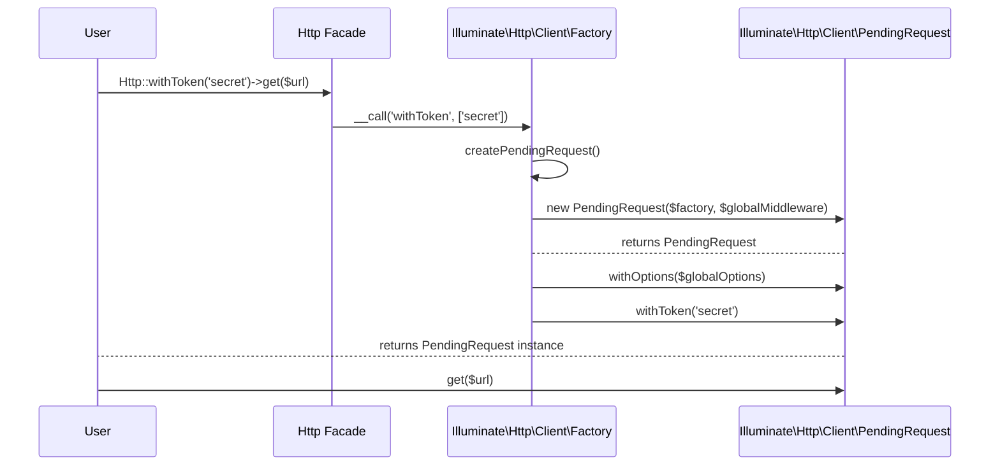

# HTTP Client

<details>
<summary>Relevant source files</summary>

The following files were used as context for generating this wiki page:

- [src/Illuminate/Http/Client/PendingRequest.php](https://github.com/laravel/framework/blob/main/src/Illuminate/Http/Client/PendingRequest.php)
- [src/Illuminate/Http/Client/Factory.php](https://github.com/laravel/framework/blob/main/src/Illuminate/Http/Client/Factory.php)
- [src/Illuminate/Support/Facades/Http.php](https://github.com/laravel/framework/blob/main/src/Illuminate/Support/Facades/Http.php)
- [src/Illuminate/Http/Client/ResponseSequence.php](https://github.com/laravel/framework/blob/main/src/Illuminate/Http/Client/ResponseSequence.php)
- [src/Illuminate/Http/Client/Batch.php](https://github.com/laravel/framework/blob/main/src/Illuminate/Http/Client/Batch.php)
- [src/Illuminate/Foundation/Testing/Concerns/MakesHttpRequests.php](https://github.com/laravel/framework/blob/main/src/Illuminate/Foundation/Testing/Concerns/MakesHttpRequests.php)
- [types/Http/Client/PendingRequest.php](https://github.com/laravel/framework/blob/main/types/Http/Client/PendingRequest.php)
- [src/Illuminate/Http/Client/Response.php](https://github.com/laravel/framework/blob/main/src/Illuminate/Http/Client/Response.php)
</details>

## Overview

The Laravel HTTP client provides an expressive, minimal API around the Guzzle HTTP subsystem, allowing developers to send outgoing HTTP requests and integrate with external web services effortlessly. Built on top of extensible factory and facade patterns, it streamlines complex operations such as fluent request assembly, middleware integration, error handling, response stubbing for tests, and concurrent asynchronous batching.

Sources: [src/Illuminate/Http/Client/PendingRequest.php:40-42](https://github.com/laravel/framework/blob/main/src/Illuminate/Http/Client/PendingRequest.php#L40-L42), [src/Illuminate/Http/Client/Factory.php:25-29](https://github.com/laravel/framework/blob/main/src/Illuminate/Http/Client/Factory.php#L25-L29), [src/Illuminate/Support/Facades/Http.php:109-119](https://github.com/laravel/framework/blob/main/src/Illuminate/Support/Facades/Http.php#L109-L119)

## Factory and Facade Entry Points

### Factory and Facade Entry Points

The `Http` facade proxies static calls directly to the underlying `Illuminate\Http\Client\Factory` instance via its `getFacadeAccessor()` method, which resolves to `Factory::class`. This factory class manages global request configuration, event dispatching, middleware registration, and request stubbing during testing.

```php
use Illuminate\Support\Facades\Http;

Http::macro('github', function () {
    return Http::withToken(config('services.github.token'))
               ->baseUrl('https://api.github.com');
});

$response = Http::github()->get('/user');
```

Sources: [src/Illuminate/Support/Facades/Http.php:111-119](https://github.com/laravel/framework/blob/main/src/Illuminate/Support/Facades/Http.php#L111-L119), [src/Illuminate/Http/Client/Factory.php:25-29](https://github.com/laravel/framework/blob/main/src/Illuminate/Http/Client/Factory.php#L25-L29)

### Instantiation and Pending Requests

When a method such as `get`, `post`, or a configuration builder like `withToken` is called statically on the `Http` facade or dynamically on a `Factory` instance, `__call` intercepts the invocation. If the method is a registered macro, it executes immediately; otherwise, it delegates to `createPendingRequest()` to instantiate a new `PendingRequest` configured with global middleware and options.



Sources: [src/Illuminate/Http/Client/Factory.php:584-638](https://github.com/laravel/framework/blob/main/src/Illuminate/Http/Client/Factory.php#L584-L638), [src/Illuminate/Support/Facades/Http.php:109-119](https://github.com/laravel/framework/blob/main/src/Illuminate/Support/Facades/Http.php#L109-L119)

### Global Configuration and Methods

The `Factory` class maintains state across requests through several protected properties and configuration methods. 

| Property / Method | Type / Signature | Purpose |
| :--- | :--- | :--- |
| `dispatcher` | `?Dispatcher` | Event dispatcher implementation injected during construction. |
| `globalMiddleware` | `array` | Middleware array applied to every outgoing request. |
| `globalOptions` | `Closure\|array` | Default request options applied to every pending request. |
| `globalMiddleware($middleware)` | `callable` | Appends custom middleware to `$globalMiddleware`. |
| `globalRequestMiddleware($middleware)` | `callable` | Maps request middleware using `Middleware::mapRequest`. |
| `globalResponseMiddleware($middleware)` | `callable` | Maps response middleware using `Middleware::mapResponse`. |
| `globalOptions($options)` | `Closure\|array` | Sets default options via `globalOptions($options)`. |

> [!NOTE]
> Global options passed to `globalOptions()` can be provided as either an associative array or a `Closure` that resolves options dynamically when each pending request is initialized.

Sources: [src/Illuminate/Http/Client/Factory.php:31-156](https://github.com/laravel/framework/blob/main/src/Illuminate/Http/Client/Factory.php#L31-L156)

## Pending Request Builder and Options

### Overview

The `PendingRequest` class provides a fluent interface for configuring outgoing HTTP requests before dispatching them via Guzzle. Initialized with default options such as a 10-second connect timeout, 30-second request timeout, TLS v1.2 client crypto, disabled Guzzle HTTP exceptions, and JSON body formatting, `PendingRequest` allows developers to layer headers, authentication schemes, query parameters, body formats, files, and transport options through method chaining.

Sources: [src/Illuminate/Http/Client/PendingRequest.php:40-282](https://github.com/laravel/framework/blob/main/src/Illuminate/Http/Client/PendingRequest.php#L40-L282)

### Headers and Authentication

Headers can be applied individually via `withHeader()` or in bulk via `withHeaders()` and `replaceHeaders()`. Specialized helper methods configure common headers such as `accept()`, `acceptJson()`, `withToken()`, and `withUserAgent()`. Authentication schemes are stored directly in Guzzle's `auth` request option slot.

| Method | Signature | Purpose |
| :--- | :--- | :--- |
| `withHeader` | `($name, $value)` | Adds a single header to the request. |
| `withHeaders` | `(array $headers)` | Merges multiple headers into request options recursively. |
| `replaceHeaders` | `(array $headers)` | Replaces existing request headers with the provided array. |
| `accept` | `($contentType)` | Sets the `Accept` header. |
| `acceptJson` | `()` | Sets the `Accept` header to `application/json`. |
| `withToken` | `(#[\SensitiveParameter] $token, $type = 'Bearer')` | Sets the `Authorization` header with a given token type. |
| `withUserAgent` | `($userAgent)` | Sets the `User-Agent` header. |
| `withBasicAuth` | `(string $username, string $password)` | Sets Guzzle `auth` option for HTTP Basic authentication. |
| `withDigestAuth` | `($username, $password)` | Sets Guzzle `auth` option for HTTP Digest authentication. |
| `withNtlmAuth` | `($username, $password)` | Sets Guzzle `auth` option for NTLM authentication. |

Sources: [src/Illuminate/Http/Client/PendingRequest.php:419-554](https://github.com/laravel/framework/blob/main/src/Illuminate/Http/Client/PendingRequest.php#L419-L554)

### Body Formats and Multipart Uploads

The request body format dictates how payload data is serialized and transmitted. By default, requests are initialized as JSON (`asJson()`). Other available formats include form parameters (`asForm()`), multipart forms (`asMultipart()`), or raw content (`withBody()`). File attachments added via `attach()` automatically switch the request body format to multipart.

```php
use Illuminate\Support\Facades\Http;

$response = Http::asMultipart()
    ->attach('avatar', file_get_contents('photo.jpg'), 'photo.jpg')
    ->post('https://api.example.com/upload', [
        'name' => 'Taylor Otwell',
    ]);
```

Sources: [src/Illuminate/Http/Client/PendingRequest.php:304-383](https://github.com/laravel/framework/blob/main/src/Illuminate/Http/Client/PendingRequest.php#L304-L383), [src/Illuminate/Http/Client/PendingRequest.php:1184-1197](https://github.com/laravel/framework/blob/main/src/Illuminate/Http/Client/PendingRequest.php#L1184-L1197)

### Guzzle Options and Transport Control

Low-level Guzzle options can be configured fluently or overridden directly using `withOptions()`. Options that support deep merging include `cookies`, `form_params`, `headers`, `json`, `multipart`, and `query`.

| Method | Signature | Purpose |
| :--- | :--- | :--- |
| `baseUrl` | `(string $url)` | Prepends a base URL to relative request paths. |
| `withQueryParameters` | `(array $parameters)` | Merges query string parameters into the request URI. |
| `withUrlParameters` | `(array $parameters)` | Registers parameters for URI template expansion. |
| `withCookies` | `(array $cookies, string $domain)` | Attaches a `CookieJar` populated from array data for a domain. |
| `maxRedirects` | `(int $max)` | Limits the maximum number of allowed redirects. |
| `withoutRedirecting` | `()` | Disables following HTTP redirects (`allow_redirects` set to `false`). |
| `withoutVerifying` | `()` | Disables TLS certificate verification (`verify` set to `false`). |
| `sink` | `($to)` | Specifies a file path or resource stream where response bodies are streamed. |
| `timeout` | `(int\|float $seconds)` | Sets the overall request timeout in seconds. |
| `connectTimeout` | `(int\|float $seconds)` | Sets the connection establishment timeout in seconds. |
| `withOptions` | `(array $options)` | Merges custom Guzzle options recursively into the request. |

> [!WARNING]
> Calling `withoutVerifying()` disables SSL/TLS certificate verification entirely. This should only be used in local development or testing environments against self-signed certificates.

Sources: [src/Illuminate/Http/Client/PendingRequest.php:290-295](https://github.com/laravel/framework/blob/main/src/Illuminate/Http/Client/PendingRequest.php#L290-L295), [src/Illuminate/Http/Client/PendingRequest.php:404-411](https://github.com/laravel/framework/blob/main/src/Illuminate/Http/Client/PendingRequest.php#L404-L411), [src/Illuminate/Http/Client/PendingRequest.php:557-694](https://github.com/laravel/framework/blob/main/src/Illuminate/Http/Client/PendingRequest.php#L557-L694), [src/Illuminate/Http/Client/PendingRequest.php:1138-1141](https://github.com/laravel/framework/blob/main/src/Illuminate/Http/Client/PendingRequest.php#L1138-L1141)

## Request Execution and Handler Stack

### Overview

The request execution pipeline orchestrates how a configured `PendingRequest` transforms into an active HTTP transaction via Guzzle. It constructs the underlying handler stack, registers middleware, dispatches lifecycle events, and processes promises or synchronous responses.

Sources: [src/Illuminate/Http/Client/PendingRequest.php:1050-1130](https://github.com/laravel/framework/blob/main/src/Illuminate/Http/Client/PendingRequest.php#L1050-L1130), [src/Illuminate/Http/Client/PendingRequest.php:1685-1711](https://github.com/laravel/framework/blob/main/src/Illuminate/Http/Client/PendingRequest.php#L1685-L1711)

### Handler Stack Construction

When sending a request, `PendingRequest` builds a Guzzle `HandlerStack` through `buildHandlerStack()`, appending custom user middleware alongside built-in handlers for before-sending callbacks, request recording, and stubbing.

```php
    public function buildHandlerStack()
    {
        return $this->pushHandlers(HandlerStack::create($this->handler));
    }
```

Sources: [src/Illuminate/Http/Client/PendingRequest.php:1689-1692](https://github.com/laravel/framework/blob/main/src/Illuminate/Http/Client/PendingRequest.php#L1689-L1692)

The `pushHandlers()` method pushes middleware onto the stack in a precise order: user-defined middleware first, followed by the before-sending handler, recorder handler, and stub handler.

```php
    public function pushHandlers($handlerStack)
    {
        return tap($handlerStack, function ($stack) {
            $this->middleware->each(function ($middleware) use ($stack) {
                $stack->push($middleware);
            });

            $stack->push($this->buildBeforeSendingHandler());
            $stack->push($this->buildRecorderHandler());
            $stack->push($this->buildStubHandler());
        });
    }
```

Sources: [src/Illuminate/Http/Client/PendingRequest.php:1700-1711](https://github.com/laravel/framework/blob/main/src/Illuminate/Http/Client/PendingRequest.php#L1700-L1711)

### Request Execution Walkthrough

The request execution path flows through several distinct methods depending on whether the request is synchronous or asynchronous. 

The primary call-chain sequence for sending a request is:
`send()` → `sendRequest()` → `parseRequestData()` → `mergeOptions()` → `normalizeRequestOptions()` → `buildClient()` → `client->request()`

1. **`send(string $method, string $url, array $options)`**: Normalizes URLs, expands URL parameters via `expandUrlParameters()`, parses HTTP options via `parseHttpOptions()`, and branches based on the `async` property.
2. **`sendRequest(string $method, string $url, array $options)`**: Resolves client execution methods, invokes `parseRequestData()`, sets up statistics tracking (`on_stats`), normalizes request options via `normalizeRequestOptions()`, and calls the Guzzle client request handler.
3. **`makePromise(string $method, string $url, array $options, int $attempt)`** *(Asynchronous only)*: Wraps the `sendRequest()` promise, chains `.then()` handlers to parse responses and dispatch events, handles exceptions in `.otherwise()`, and processes retry logic through `handlePromiseResponse()`.

> [!NOTE]
> Synchronous requests wrap the execution block inside Laravel's `retry()` helper, intercepting `TransferException` instances to marshal them into framework-specific exceptions such as `ConnectionException`.

Sources: [src/Illuminate/Http/Client/PendingRequest.php:1050-1130](https://github.com/laravel/framework/blob/main/src/Illuminate/Http/Client/PendingRequest.php#L1050-L1130), [src/Illuminate/Http/Client/PendingRequest.php:1208-1240](https://github.com/laravel/framework/blob/main/src/Illuminate/Http/Client/PendingRequest.php#L1208-L1240), [src/Illuminate/Http/Client/PendingRequest.php:1333-1359](https://github.com/laravel/framework/blob/main/src/Illuminate/Http/Client/PendingRequest.php#L1333-L1359)

### Lifecycle Events and Handlers

During execution, `PendingRequest` dispatches PSR-compatible lifecycle events and invokes registered callbacks at specific interception points.

| Handler / Event Method | Trigger Point | Purpose |
| :--- | :--- | :--- |
| `dispatchRequestSendingEvent()` | Before request transmission | Fires the `RequestSending` event through the event dispatcher. |
| `buildBeforeSendingHandler()` | Middleware stack execution | Executes `beforeSendingCallbacks` to mutate outgoing PSR requests. |
| `buildRecorderHandler()` | Post-request execution | Records request/response pairs in the factory for testing assertions. |
| `buildStubHandler()` | Interception stage | Checks stub callbacks to mock responses or guard against stray requests. |
| `dispatchResponseReceivedEvent()` | Post-response parsing | Fires the `ResponseReceived` event when a response is successfully returned. |
| `dispatchConnectionFailedEvent()` | Transfer exception caught | Fires the `ConnectionFailed` event when transport errors occur. |

Sources: [src/Illuminate/Http/Client/PendingRequest.php:1718-1792](https://github.com/laravel/framework/blob/main/src/Illuminate/Http/Client/PendingRequest.php#L1718-L1792), [src/Illuminate/Http/Client/PendingRequest.php:1984-2018](https://github.com/laravel/framework/blob/main/src/Illuminate/Http/Client/PendingRequest.php#L1984-L2018)

## Response Handling and Exception Inspection

### Overview

Response handling and exception inspection form the primary interface for evaluating HTTP outcomes. The `Illuminate\Http\Client\Response` class wraps underlying PSR-7 responses to provide status validation, format parsing, and exception casting.

Sources: [src/Illuminate/Http/Client/Response.php:17-29](https://github.com/laravel/framework/blob/main/src/Illuminate/Http/Client/Response.php#L17-L29)

### Response Inspection and Status Checking

The `Response` class exposes methods to check HTTP status ranges and extract payloads. Status evaluation leverages helper methods that inspect HTTP code boundaries.

| Method | Status Code Range | Purpose |
| :--- | :--- | :--- |
| `successful()` | `200` – `299` | Determines if the request was successful. |
| `redirect()` | `300` – `399` | Determines if the response was a redirect. |
| `failed()` | `>= 400` | Determines if a client or server error occurred. |
| `clientError()` | `400` – `499` | Determines if a client error occurred. |
| `serverError()` | `>= 500` | Determines if a server error occurred. |

Sources: [src/Illuminate/Http/Client/Response.php:230-273](https://github.com/laravel/framework/blob/main/src/Illuminate/Http/Client/Response.php#L230-L273)

Data extraction methods include `body()` for raw strings, `json($key, $default, $flags)` for decoded arrays, `object()` for PHP objects, `collect()` for collections, and `fluent()` for fluent data access.

Sources: [src/Illuminate/Http/Client/Response.php:94-160](https://github.com/laravel/framework/blob/main/src/Illuminate/Http/Client/Response.php#L94-L160)

> [!NOTE]
> JSON decoding flags default to `Response::$defaultJsonDecodingFlags`, which can be globally configured or overridden per call.
> Sources: [src/Illuminate/Http/Client/Response.php:77-118](https://github.com/laravel/framework/blob/main/src/Illuminate/Http/Client/Response.php#L77-L118)

### Conditional Exceptions and Marshaling

When error conditions occur, responses can convert into `RequestException` instances via `toException()` or throw them directly using conditional throwing methods.

```php
$response = Http::get('https://api.example.com/user');

$response->throwIfClientError()
         ->throwIfServerError()
         ->throwIfStatus(401);
```

Sources: [src/Illuminate/Http/Client/Response.php:337-449](https://github.com/laravel/framework/blob/main/src/Illuminate/Http/Client/Response.php#L337-L449)

Transport-level errors encountered by `PendingRequest` are intercepted via `TransferException` catches and marshaled into framework exceptions. The call chain during transport failures proceeds through exception marshaling handlers:

`TransferException` catch block → `marshalConnectionException()` / `marshalRequestExceptionWithoutResponse()` / `marshalRequestExceptionWithResponse()` → `ConnectionException` or `RequestException`

1. **`marshalConnectionException(ConnectException $e)`**: Catches low-level connection failures, records the request pair with a null response, dispatches `ConnectionFailed`, and throws a `ConnectionException`.
2. **`marshalRequestExceptionWithoutResponse(RequestException $e)`**: Handles request exceptions lacking a response payload, wraps them into a `ConnectionException`, and dispatches connection failure events.
3. **`marshalRequestExceptionWithResponse(RequestException $e)`**: Populates a Laravel response from the exception response, records the request-response pair, and throws the response's associated exception (`$response->toException()`).

Sources: [src/Illuminate/Http/Client/PendingRequest.php:1108-1122](https://github.com/laravel/framework/blob/main/src/Illuminate/Http/Client/PendingRequest.php#L1108-L1122), [src/Illuminate/Http/Client/PendingRequest.php:2053-2110](https://github.com/laravel/framework/blob/main/src/Illuminate/Http/Client/PendingRequest.php#L2053-L2110)

> [!WARNING]
> Array access on `Response` instances (`$response['key']`) reads from the decoded JSON body, but attempting to mutate via array access (`$response['key'] = 'value'`) throws a `LogicException`.
> Sources: [src/Illuminate/Http/Client/Response.php:544-585](https://github.com/laravel/framework/blob/main/src/Illuminate/Http/Client/Response.php#L544-L585)

## Response Mocking and Stub Handlers

### Overview

The HTTP client factory provides robust response mocking and stubbing facilities, intercepting outgoing requests via custom handler closures, URL pattern matching, and sequential response queues. When `Http::fake()` is called, it initializes recording mode and registers middleware on the handler stack to intercept network calls before they reach Guzzle's transport layer.

Sources: [src/Illuminate/Http/Client/Factory.php:310-350](https://github.com/laravel/framework/blob/main/src/Illuminate/Http/Client/Factory.php#L310-L350), [src/Illuminate/Http/Client/PendingRequest.php:1759-1793](https://github.com/laravel/framework/blob/main/src/Illuminate/Http/Client/PendingRequest.php#L1759-L1793)

### Stub Handlers and URL Matching

Outgoing requests evaluate registered stub callbacks inside the Guzzle handler stack via `buildStubHandler()`. Each stub callback inspects the incoming request, checking URL patterns via string matching or wildcard validation. If a matching stub is found, it returns the mocked response; otherwise, it checks stray request guard configurations.

```php
Http::fake([
    'github.com/*' => Http::sequence()
        ->push(['name' => 'Laravel'], 200)
        ->push(['error' => 'Rate limit exceeded'], 429),
    'api.example.com/users*' => Http::response(['id' => 1], 200),
]);
```

Sources: [src/Illuminate/Http/Client/PendingRequest.php:1759-1793](https://github.com/laravel/framework/blob/main/src/Illuminate/Http/Client/PendingRequest.php#L1759-L1793), [src/Illuminate/Http/Client/Factory.php:374-399](https://github.com/laravel/framework/blob/main/src/Illuminate/Http/Client/Factory.php#L374-L399)

> [!WARNING]
> If `preventStrayRequests()` is active and a request matches no stub or allowed URL pattern, a `StrayRequestException` is thrown immediately.
> Sources: [src/Illuminate/Http/Client/PendingRequest.php:1774-1778](https://github.com/laravel/framework/blob/main/src/Illuminate/Http/Client/PendingRequest.php#L1774-L1778)

### Response Sequences

Response sequences allow testing multiple sequential interactions with the same endpoint by returning a different response on each consecutive call. The `ResponseSequence` class manages ordered arrays of response promises and handles exhaustion conditions.

| Method | Parameters | Purpose |
| :--- | :--- | :--- |
| `push()` | `$body = null, int $status = 200, array $headers = []` | Pushes a standard response onto the sequence queue. |
| `pushStatus()` | `int $status, array $headers = []` | Pushes an empty-bodied response with a specific status code. |
| `pushFile()` | `string $filePath, int $status = 200, array $headers = []` | Pushes a response populated from file contents. |
| `pushFailedConnection()` | `string|null $message = null` | Pushes a connection exception rejection into the sequence. |
| `whenEmpty()` | `PromiseInterface|Closure $response` | Defines a custom fallback response or closure when the sequence runs out. |
| `dontFailWhenEmpty()` | None | Configures the sequence to return a default 200 response when depleted rather than throwing. |

Sources: [src/Illuminate/Http/Client/ResponseSequence.php:52-138](https://github.com/laravel/framework/blob/main/src/Illuminate/Http/Client/ResponseSequence.php#L52-L138)

> [!NOTE]
> By default, invoking a depleted `ResponseSequence` throws an `OutOfBoundsException` unless `dontFailWhenEmpty()` or `whenEmpty()` has been configured.
> Sources: [src/Illuminate/Http/Client/ResponseSequence.php:21-25](https://github.com/laravel/framework/blob/main/src/Illuminate/Http/Client/ResponseSequence.php#L21-L25), [src/Illuminate/Http/Client/ResponseSequence.php:160-162](https://github.com/laravel/framework/blob/main/src/Illuminate/Http/Client/ResponseSequence.php#L160-L162)

## Concurrent Request Batching and Async

### Overview

Asynchronous request execution and batch management allow sending multiple HTTP requests concurrently via Guzzle promises and `EachPromise`. The `PendingRequest` class supports toggling asynchronicity via `async()`, returning a `LazyPromise` that defers Guzzle promise creation until execution. Pools and batches orchestrate multiple concurrent requests with fine-grained control over concurrency limits and lifecycle hooks.

Sources: [src/Illuminate/Http/Client/PendingRequest.php:974-1035](https://github.com/laravel/framework/blob/main/src/Illuminate/Http/Client/PendingRequest.php#L974-L1035), [src/Illuminate/Http/Client/PendingRequest.php:1953-1967](https://github.com/laravel/framework/blob/main/src/Illuminate/Http/Client/PendingRequest.php#L1953-L1967)

### Pool Execution

The `pool()` method on `PendingRequest` accepts a callback receiving a `Pool` instance, generating multiple requests that execute concurrently. When a numeric concurrency limit is provided, `EachPromise` processes promises up to the specified limit. If concurrency is set to `null`, all promises are built and waited on simultaneously using `.wait()`.

```php
$responses = Http::pool(fn ($pool) => [
    $pool->as('first')->get('https://api.example.com/users'),
    $pool->as('second')->get('https://api.example.com/posts'),
]);
```

Sources: [src/Illuminate/Http/Client/PendingRequest.php:974-1024](https://github.com/laravel/framework/blob/main/src/Illuminate/Http/Client/PendingRequest.php#L974-L1024)

> [!NOTE]
> Setting `$concurrency` to `0` evaluates to processing all requests concurrently by setting the concurrency limit to the total count of generated requests.
> Sources: [src/Illuminate/Http/Client/PendingRequest.php:1004-1004](https://github.com/laravel/framework/blob/main/src/Illuminate/Http/Client/PendingRequest.php#L1004-L1004)

### Batch Lifecycle Management

The `Batch` class provides structured lifecycle introspection, tracking metrics such as total, pending, and failed requests. It exposes registration methods for callbacks executing at different stages of batch processing.

| Method | Parameters | Purpose |
| :--- | :--- | :--- |
| `as()` | `string $key` | Adds an asynchronous request to the batch with a string key. |
| `newRequest()` | None | Adds an asynchronous request to the batch with a numeric index. |
| `before()` | `Closure($this): void $callback` | Registers a callback to run before the first request in the batch runs. |
| `progress()` | `Closure($this, int|string, Response): void $callback` | Registers a callback to run after a request successfully completes. |
| `catch()` | `Closure($this, int|string, Response|RequestException|ConnectionException): void $callback` | Registers a callback to run after a request fails or rejects. |
| `then()` | `Closure($this, array): void $callback` | Registers a callback to run when all requests in the batch finish successfully without failures. |
| `finally()` | `Closure($this, array): void $callback` | Registers a callback to run after all requests finish, regardless of success or failure. |
| `concurrency()` | `int $limit` | Sets the maximum number of concurrent requests executed simultaneously. |
| `defer()` | None | Defers batch execution to run in the background after the current task completes. |

Sources: [src/Illuminate/Http/Client/Batch.php:143-258](https://github.com/laravel/framework/blob/main/src/Illuminate/Http/Client/Batch.php#L143-L258)

> [!WARNING]
> Attempting to add requests to a `Batch` via `as()` or `newRequest()` after execution has started throws a `BatchInProgressException`.
> Sources: [src/Illuminate/Http/Client/Batch.php:145-147](https://github.com/laravel/framework/blob/main/src/Illuminate/Http/Client/Batch.php#L145-L147), [src/Illuminate/Http/Client/Batch.php:163-165](https://github.com/laravel/framework/blob/main/src/Illuminate/Http/Client/Batch.php#L163-L165)

## Related

- [[HTTP Request & Response]]

