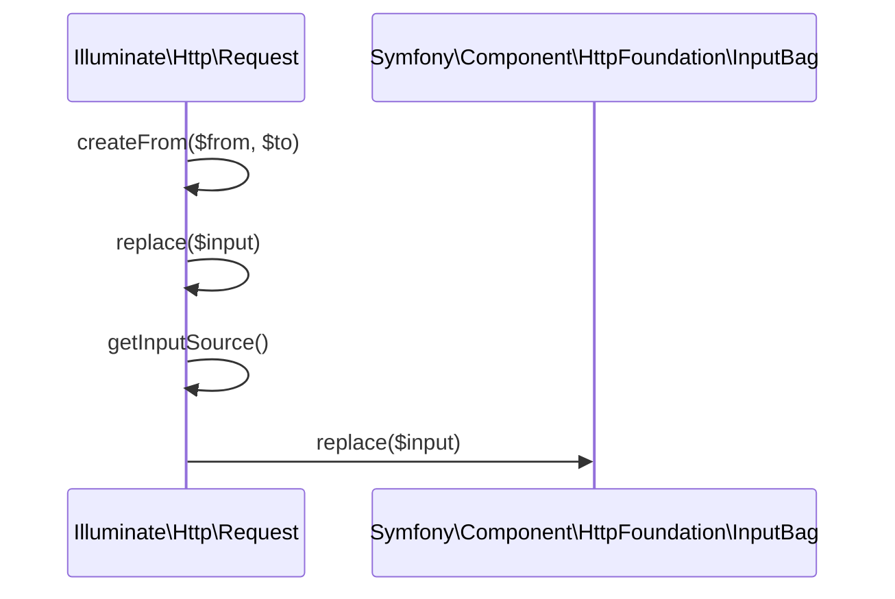
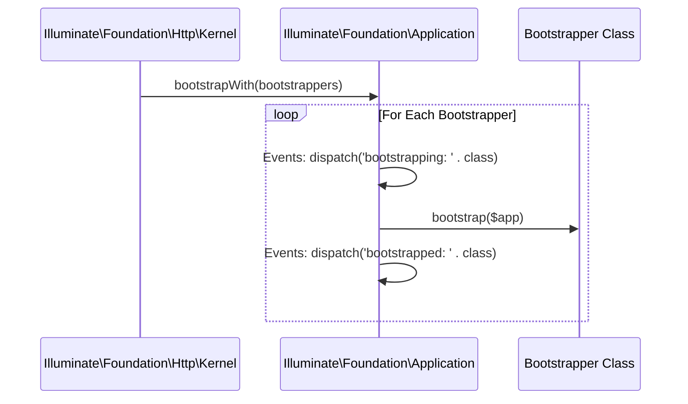

# HTTP Request & Response

<details>
<summary>Relevant source files</summary>

The following files were used as context for generating this wiki page:

- [src/Illuminate/Foundation/Http/Kernel.php](https://github.com/laravel/framework/blob/main/src/Illuminate/Foundation/Http/Kernel.php)
- [src/Illuminate/Http/Request.php](https://github.com/laravel/framework/blob/main/src/Illuminate/Http/Request.php)
- [src/Illuminate/Foundation/Exceptions/Handler.php](https://github.com/laravel/framework/blob/main/src/Illuminate/Foundation/Exceptions/Handler.php)
- [src/Illuminate/Foundation/Testing/Concerns/MakesHttpRequests.php](https://github.com/laravel/framework/blob/main/src/Illuminate/Foundation/Testing/Concerns/MakesHttpRequests.php)
- [src/Illuminate/Support/Facades/Request.php](https://github.com/laravel/framework/blob/main/src/Illuminate/Support/Facades/Request.php)
- [src/Illuminate/Foundation/Application.php](https://github.com/laravel/framework/blob/main/src/Illuminate/Foundation/Application.php)
- [src/Illuminate/Routing/Router.php](https://github.com/laravel/framework/blob/main/src/Illuminate/Routing/Router.php)
</details>

## Overview

The HTTP request and response subsystem manages the complete lifecycle of incoming web traffic within a Laravel application. Built on top of Symfony's HTTPFoundation components, Laravel provides an expressive request representation that handles input retrieval, JSON payloads, file uploads, and session integration while integrating deeply with the application container and routing engine.

Sources: [src/Illuminate/Foundation/Http/Kernel.php:20-176](https://github.com/laravel/framework/blob/main/src/Illuminate/Foundation/Http/Kernel.php#L20-L176), [src/Illuminate/Http/Request.php:29-36](https://github.com/laravel/framework/blob/main/src/Illuminate/Http/Request.php#L29-L36)

Incoming requests flow through the HTTP kernel, which orchestrates essential environment bootstrappers, manages middleware stacks, and passes execution through the router for matching and dispatching. The system resolves controllers, transforms return values into standardized HTTP or JSON responses, and catches exceptions to render appropriate error pages or API responses.

Sources: [src/Illuminate/Foundation/Http/Kernel.php:43-50](https://github.com/laravel/framework/blob/main/src/Illuminate/Foundation/Http/Kernel.php#L43-L50), [src/Illuminate/Foundation/Http/Kernel.php:137-156](https://github.com/laravel/framework/blob/main/src/Illuminate/Foundation/Http/Kernel.php#L137-L156), [src/Illuminate/Routing/Router.php:749-802](https://github.com/laravel/framework/blob/main/src/Illuminate/Routing/Router.php#L749-L802)

Testing harnesses mirror this exact HTTP pipeline synthetically, allowing developers to execute end-to-end HTTP feature tests with cookie encryption, header transformation, and custom request payloads.

Sources: [src/Illuminate/Foundation/Testing/Concerns/MakesHttpRequests.php:16-797](https://github.com/laravel/framework/blob/main/src/Illuminate/Foundation/Testing/Concerns/MakesHttpRequests.php#L16-L797)

## HTTP Request Representation and Input

### Overview

Incoming HTTP requests are represented by `Illuminate\Http\Request`, which extends Symfony's `Symfony\Component\HttpFoundation\Request` class while adding support for macroable traits, conditionable checks, precognitive requests, session integration, and JSON input parsing.

Sources: [src/Illuminate/Http/Request.php:29-36](https://github.com/laravel/framework/blob/main/src/Illuminate/Http/Request.php#L29-L36)

### Request Lifecycle and Creation Walkthrough

Creating and mutating request instances follows the call chain `createFrom()` → `replace()` → `getInputSource()`:

1. `createFrom()` — Accepts an existing `Illuminate\Http\Request` instance and initializes a target request with copied query parameters, request parameters, attributes, cookies, files, server variables, locale, session, user resolver, and route resolver.
Sources: [src/Illuminate/Http/Request.php:498-531](https://github.com/laravel/framework/blob/main/src/Illuminate/Http/Request.php#L498-L531)

2. `replace()` — Replaces input values on the current request by delegating directly to `this->getInputSource()->replace($input)`.
Sources: [src/Illuminate/Http/Request.php:419-424](https://github.com/laravel/framework/blob/main/src/Illuminate/Http/Request.php#L419-L424)

3. `getInputSource()` — Evaluates whether the request is JSON by executing `isJson()`. If `isJson()` returns true, it returns `json()`; otherwise, it checks if the real HTTP method is `'GET'` or `'HEAD'` to return `$this->query` or `$this->request`.
Sources: [src/Illuminate/Http/Request.php:481-488](https://github.com/laravel/framework/blob/main/src/Illuminate/Http/Request.php#L481-L488)



Sources: [src/Illuminate/Http/Request.php:419-424](https://github.com/laravel/framework/blob/main/src/Illuminate/Http/Request.php#L419-L424), [src/Illuminate/Http/Request.php:481-488](https://github.com/laravel/framework/blob/main/src/Illuminate/Http/Request.php#L481-L488), [src/Illuminate/Http/Request.php:498-531](https://github.com/laravel/framework/blob/main/src/Illuminate/Http/Request.php#L498-L531)

### JSON Input Parsing and Input Sources

The request class inspects raw incoming payloads when handling JSON requests. The `json()` method checks whether the `$json` property has been initialized; if not, it fetches the raw content via `getContent()`, trims it, decodes it into an associative array, and wraps it in a Symfony `InputBag`.

Sources: [src/Illuminate/Http/Request.php:462-475](https://github.com/laravel/framework/blob/main/src/Illuminate/Http/Request.php#L462-L475)

> [!NOTE]
> If the incoming request content is empty or contains only whitespace, `json()` defaults to decoding an empty array string `'[]'` to prevent decoding errors.
> Sources: [src/Illuminate/Http/Request.php:467](https://github.com/laravel/framework/blob/main/src/Illuminate/Http/Request.php#L467)

### Session and Attribute Interaction

Session data is associated with the request via `setLaravelSession()`, which wraps a Laravel session instance inside a `SymfonySessionDecorator`. Methods like `session()` and `getSession()` provide access to the underlying session store or throw exceptions if no session store has been registered.

Sources: [src/Illuminate/Http/Request.php:597-641](https://github.com/laravel/framework/blob/main/src/Illuminate/Http/Request.php#L597-L641)

> [!WARNING]
> Calling `getSession()` on a request without an initialized session throws a `Symfony\Component\HttpFoundation\Exception\SessionNotFoundException`, whereas calling `session()` throws a standard `RuntimeException`.
> Sources: [src/Illuminate/Http/Request.php:609-614](https://github.com/laravel/framework/blob/main/src/Illuminate/Http/Request.php#L609-L614), [src/Illuminate/Http/Request.php:623-630](https://github.com/laravel/framework/blob/main/src/Illuminate/Http/Request.php#L623-L630)

## Kernel Request Lifecycle and Middleware

### Overview

The HTTP Kernel orchestrates the entire request lifecycle in Laravel applications. Handled by `Illuminate\Foundation\Http\Kernel`, incoming requests flow through environment loading, configuration parsing, exception handling setup, facade registration, service provider registration, and service provider booting before crossing the global middleware pipeline and dispatching to the router.

Sources: [src/Illuminate/Foundation/Http/Kernel.php:20-50](https://github.com/laravel/framework/blob/main/src/Illuminate/Foundation/Http/Kernel.php#L20-L50)

### Bootstrapper Pipeline Walkthrough

Before any middleware executes, the kernel invokes a sequence of bootstrapper classes through the application instance. This initialization sequence prepares the container and the runtime environment in a rigid call chain:

1. `bootstrap()` — Checks if the application has already been bootstrapped via `hasBeenBootstrapped()`. If not, it invokes `bootstrapWith()` passing the core bootstrappers array.
Sources: [src/Illuminate/Foundation/Http/Kernel.php:183-188](https://github.com/laravel/framework/blob/main/src/Illuminate/Foundation/Http/Kernel.php#L183-L188)

2. `bootstrapWith()` — Iterates over each bootstrapper class, dispatching a `bootstrapping: {class}` event, invoking the bootstrapper's `bootstrap($app)` method, and firing a corresponding `bootstrapped: {class}` event.
Sources: [src/Illuminate/Foundation/Application.php:342-353](https://github.com/laravel/framework/blob/main/src/Illuminate/Foundation/Application.php#L342-L353)

3. Individual Bootstrapper Execution — The bootstrapper classes execute sequentially to populate environment variables, load configuration files, register exception handlers, set up facades, register core providers, and boot providers.
Sources: [src/Illuminate/Foundation/Http/Kernel.php:43-50](https://github.com/laravel/framework/blob/main/src/Illuminate/Foundation/Http/Kernel.php#L43-L50)



Sources: [src/Illuminate/Foundation/Http/Kernel.php:183-188](https://github.com/laravel/framework/blob/main/src/Illuminate/Foundation/Http/Kernel.php#L183-L188), [src/Illuminate/Foundation/Application.php:342-353](https://github.com/laravel/framework/blob/main/src/Illuminate/Foundation/Application.php#L342-L353)

### Core Bootstrappers Reference Table

The kernel maintains a strict, ordered list of core classes responsible for initializing framework systems during request handling.

| Bootstrapper Class | Purpose |
| :--- | :--- |
| `Illuminate\Foundation\Bootstrap\LoadEnvironmentVariables::class` | Loads environment configuration files into environment variable stores. |
| `Illuminate\Foundation\Bootstrap\LoadConfiguration::class` | Loads configuration files from the application configuration directory. |
| `Illuminate\Foundation\Bootstrap\HandleExceptions::class` | Configures PHP error reporting and exception handling handlers. |
| `Illuminate\Foundation\Bootstrap\RegisterFacades::class` | Registers application facade aliases and classes in the container. |
| `Illuminate\Foundation\Bootstrap\RegisterProviders::class` | Registers all configured service providers with the application. |
| `Illuminate\Foundation\Bootstrap\BootProviders::class` | Boots all registered service providers. |

Sources: [src/Illuminate/Foundation/Http/Kernel.php:43-50](https://github.com/laravel/framework/blob/main/src/Illuminate/Foundation/Http/Kernel.php#L43-L50)

> [!NOTE]
> The application tracks whether it has been bootstrapped via `hasBeenBootstrapped()`. Repeated calls to `bootstrap()` while handling multiple requests in long-running servers will skip re-running bootstrappers.
> Sources: [src/Illuminate/Foundation/Http/Kernel.php:183-188](https://github.com/laravel/framework/blob/main/src/Illuminate/Foundation/Http/Kernel.php#L183-L188), [src/Illuminate/Foundation/Application.php:393-400](https://github.com/laravel/framework/blob/main/src/Illuminate/Foundation/Application.php#L393-L400)

### Middleware Pipeline Execution

Once bootstrapping completes, `sendRequestThroughRouter()` binds the request instance into the container, clears resolved request instances, and passes the request through a routing pipeline.

```php
return (new Pipeline($this->app))
    ->send($request)
    ->through($this->app->shouldSkipMiddleware() ? [] : $this->middleware)
    ->then($this->dispatchToRouter());
```

Sources: [src/Illuminate/Foundation/Http/Kernel.php:164-176](https://github.com/laravel/framework/blob/main/src/Illuminate/Foundation/Http/Kernel.php#L164-L176)

The pipeline evaluates global middleware stack entries unless `shouldSkipMiddleware()` returns `true` (when the `middleware.disable` container binding is set to true). Upon clearing the middleware stack, the pipeline terminates by calling `dispatchToRouter()`, which updates the container request instance and delegates dispatching to the `Router` instance.

Sources: [src/Illuminate/Foundation/Http/Kernel.php:172-202](https://github.com/laravel/framework/blob/main/src/Illuminate/Foundation/Http/Kernel.php#L172-L202), [src/Illuminate/Foundation/Application.php:1279-1283](https://github.com/laravel/framework/blob/main/src/Illuminate/Foundation/Application.php#L1279-L1283)

> [!WARNING]
> If an exception occurs during request handling, the `handle()` method catches the `Throwable`, reports it via `reportException()`, and generates an error response via `renderException()`.
> Sources: [src/Illuminate/Foundation/Http/Kernel.php:141-149](https://github.com/laravel/framework/blob/main/src/Illuminate/Foundation/Http/Kernel.php#L141-L149)

## Router Dispatch and Response Preparation

### Overview

The `Router` class orchestrates the complete lifecycle of request dispatching, route resolution, middleware stack execution, and response conversion. When the application kernel dispatches a request, the router initiates matching against the registered route collection, resolves route parameters, runs through the assigned middleware pipeline, executes the target controller or closure, and normalizes the returned value into a valid Symfony HTTP foundation response.

Sources: [src/Illuminate/Routing/Router.php:749-824](https://github.com/laravel/framework/blob/main/src/Illuminate/Routing/Router.php#L749-L824), [src/Illuminate/Routing/Router.php:902-947](https://github.com/laravel/framework/blob/main/src/Illuminate/Routing/Router.php#L902-L947)

### Request Dispatch and Execution Call-Chain

The dispatch flow traverses through several distinct execution steps inside `Router`:

1. `dispatch($request)`: Stores the incoming request in `$currentRequest` and invokes `dispatchToRoute($request)`.
Sources: [src/Illuminate/Routing/Router.php:749-754](https://github.com/laravel/framework/blob/main/src/Illuminate/Routing/Router.php#L749-L754)

2. `dispatchToRoute($request)`: Calls `findRoute($request)` and hands the resulting route to `runRoute($request, $route)`.
Sources: [src/Illuminate/Routing/Router.php:762-765](https://github.com/laravel/framework/blob/main/src/Illuminate/Routing/Router.php#L762-L765)

3. `findRoute($request)`: Dispatches the `Illuminate\Routing\Events\Routing` event, queries `$this->routes->match($request)`, updates the container instance with the matched route, and returns the `Route` object.
Sources: [src/Illuminate/Routing/Router.php:773-784](https://github.com/laravel/framework/blob/main/src/Illuminate/Routing/Router.php#L773-L784)

4. `runRoute($request, $route)`: Sets the route resolver closure on the request, dispatches the `Illuminate\Routing\Events\RouteMatched` event, and passes control to `runRouteWithinStack($route, $request)`.
Sources: [src/Illuminate/Routing/Router.php:793-802](https://github.com/laravel/framework/blob/main/src/Illuminate/Routing/Router.php#L793-L802)

5. `runRouteWithinStack($route, $request)`: Inspects the container for `middleware.disable`, gathers route middleware via `gatherRouteMiddleware($route)`, and instantiates a `Pipeline` to send the request through the middleware stack before invoking `$route->run()`.
Sources: [src/Illuminate/Routing/Router.php:811-824](https://github.com/laravel/framework/blob/main/src/Illuminate/Routing/Router.php#L811-L824)

> [!NOTE]
> If the `middleware.disable` container binding resolves to `true`, `runRouteWithinStack()` bypasses gathering route middleware entirely, executing the route immediately inside an empty pipeline.
> Sources: [src/Illuminate/Routing/Router.php:813-817](https://github.com/laravel/framework/blob/main/src/Illuminate/Routing/Router.php#L813-L817)

### Response Preparation and Type Conversion

Once the route callback or controller executes and returns a value, `prepareResponse($request, $response)` normalizes the output into an instance of `Symfony\Component\HttpFoundation\Response`. The `toResponse()` method evaluates the return type and applies explicit transformations.

| Returned Type | Conversion Action | Resulting Response Class |
| :--- | :--- | :--- |
| `Illuminate\Contracts\Support\Responsable` | Calls `$response->toResponse($request)` | Determined by implementation |
| `Psr\Http\Message\ResponseInterface` | Converts via `HttpFoundationFactory` | Symfony Response |
| `Illuminate\Database\Eloquent\Model` (recently created) | Wraps data in JSON with status `201` | `Illuminate\Http\JsonResponse` |
| `Illuminate\Support\Stringable` | Casts to string with status `200` and `Content-Type: text/html` | `Illuminate\Http\Response` |
| `Arrayable`, `Jsonable`, `ArrayObject`, `JsonSerializable`, `stdClass`, or `array` | Encodes data as JSON | `Illuminate\Http\JsonResponse` |
| Any other unhandled value | Casts to string with status `200` and `Content-Type: text/html` | `Illuminate\Http\Response` |

Sources: [src/Illuminate/Routing/Router.php:902-947](https://github.com/laravel/framework/blob/main/src/Illuminate/Routing/Router.php#L902-L947)

> [!IMPORTANT]
> If the final response status code matches `Response::HTTP_NOT_MODIFIED` (`304`), `toResponse()` automatically calls `setNotModified()` on the response instance before preparing it against the request.
> Sources: [src/Illuminate/Routing/Router.php:942-944](https://github.com/laravel/framework/blob/main/src/Illuminate/Routing/Router.php#L942-L944)

## Exception Handling and Error Responses

### Overview

The `Handler` class implements `ExceptionHandlerContract` to manage application-wide exceptions, mapping custom exception types, logging failures, and converting throwables into HTTP responses or console outputs. When an unhandled exception or validation error occurs during request execution, the handler evaluates its type and rendering context to produce a structured JSON response or a rendered HTML view.

Sources: [src/Illuminate/Foundation/Exceptions/Handler.php:56-122](https://github.com/laravel/framework/blob/main/src/Illuminate/Foundation/Exceptions/Handler.php#L56-L122)

### Exception Rendering Call-Chain

The exception rendering pipeline flows through concrete validation and mapping steps inside `Handler`:

1. `render($request, Throwable $e)`: Maps the exception via `mapException($e)` and checks for a custom `render()` method on the exception instance or `Responsable` implementation.
Sources: [src/Illuminate/Foundation/Exceptions/Handler.php:694-708](https://github.com/laravel/framework/blob/main/src/Illuminate/Foundation/Exceptions/Handler.php#L694-L708)

2. `prepareException(Throwable $e)`: Transforms specialized framework exceptions (such as `ModelNotFoundException` or `AuthorizationException`) into standard HTTP exception counterparts.
Sources: [src/Illuminate/Foundation/Exceptions/Handler.php:710](https://github.com/laravel/framework/blob/main/src/Illuminate/Foundation/Exceptions/Handler.php#L710), [src/Illuminate/Foundation/Exceptions/Handler.php:758-774](https://github.com/laravel/framework/blob/main/src/Illuminate/Foundation/Exceptions/Handler.php#L758-L774)

3. `renderViaCallbacks($request, Throwable $e)`: Iterates over registered `renderCallbacks` to see if a custom closure handles the exception type.
Sources: [src/Illuminate/Foundation/Exceptions/Handler.php:712](https://github.com/laravel/framework/blob/main/src/Illuminate/Foundation/Exceptions/Handler.php#L712), [src/Illuminate/Foundation/Exceptions/Handler.php:807-820](https://github.com/laravel/framework/blob/main/src/Illuminate/Foundation/Exceptions/Handler.php#L807-L820)

4. `renderExceptionResponse($request, Throwable $e)`: Determines whether JSON output is required via `shouldReturnJson($request, $e)` and dispatches to either `prepareJsonResponse()` or `prepareResponse()`.
Sources: [src/Illuminate/Foundation/Exceptions/Handler.php:716-721](https://github.com/laravel/framework/blob/main/src/Illuminate/Foundation/Exceptions/Handler.php#L716-L721), [src/Illuminate/Foundation/Exceptions/Handler.php:829-834](https://github.com/laravel/framework/blob/main/src/Illuminate/Foundation/Exceptions/Handler.php#L829-L834)

5. `prepareResponse($request, Throwable $e)`: Converts non-HTTP exceptions under debug mode into an Illuminate response or wraps them in an `HttpException(500)` before generating output through `toIlluminateResponse()`.
Sources: [src/Illuminate/Foundation/Exceptions/Handler.php:939-952](https://github.com/laravel/framework/blob/main/src/Illuminate/Foundation/Exceptions/Handler.php#L939-L952)

> [!WARNING]
> If rendering an HTTP exception view fails inside `renderHttpException()`, debug mode will re-throw the exception directly; otherwise, it reports the rendering error and falls back to standard Symfony response conversion.
> Sources: [src/Illuminate/Foundation/Exceptions/Handler.php:1025-1043](https://github.com/laravel/framework/blob/main/src/Illuminate/Foundation/Exceptions/Handler.php#L1025-L1043)

### Exception Preparation Mappings

The `prepareException()` method transforms various lower-level system or domain exceptions into appropriate HTTP exceptions before rendering.

| Source Exception Class | Converted Exception Class | Target Status / Default Message |
| :--- | :--- | :--- |
| `BackedEnumCaseNotFoundException` | `NotFoundHttpException` | Preserves original message and previous exception |
| `ModelNotFoundException` | `NotFoundHttpException` | Preserves original message and previous exception |
| `AuthorizationException` (with status) | `HttpException` | Uses exception status code and custom message or status text |
| `AuthorizationException` (without status) | `AccessDeniedHttpException` | Preserves original message and previous exception |
| `OriginMismatchException` | `HttpException` | Status code `403` with original message |
| `TokenMismatchException` | `HttpException` | Status code `419` with original message |
| `RequestExceptionInterface` | `BadRequestHttpException` | Status code `400` with message `'Bad request.'` |
| `RecordNotFoundException` | `NotFoundHttpException` | Status code `404` with message `'Not found.'` |
| `RecordsNotFoundException` | `NotFoundHttpException` | Status code `404` with message `'Not found.'` |

Sources: [src/Illuminate/Foundation/Exceptions/Handler.php:758-774](https://github.com/laravel/framework/blob/main/src/Illuminate/Foundation/Exceptions/Handler.php#L758-L774)

> [!NOTE]
> The internal exception list (`internalDontReport`) automatically suppresses logging for authentication failures, authorization errors, model not found errors, token mismatches, and validation exceptions.
> Sources: [src/Illuminate/Foundation/Exceptions/Handler.php:170-183](https://github.com/laravel/framework/blob/main/src/Illuminate/Foundation/Exceptions/Handler.php#L170-L183)

### Validation Exception Conversion and Flashing

When a `ValidationException` is caught during request handling, `convertValidationExceptionToResponse()` checks for a custom response property on the exception. If absent, it checks whether the client expects JSON:

- **JSON Requests**: Invokes `invalidJson()`, returning a status with a JSON payload containing the error `message` and `errors` dictionary.
Sources: [src/Illuminate/Foundation/Exceptions/Handler.php:897-903](https://github.com/laravel/framework/blob/main/src/Illuminate/Foundation/Exceptions/Handler.php#L897-L903)

- **HTML/Redirect Requests**: Invokes `invalid()`, which redirects back to the previous URL, flashes inputs excluding sensitive fields defined in `dontFlash`, and attaches validation errors to the error bag.
Sources: [src/Illuminate/Foundation/Exceptions/Handler.php:883-888](https://github.com/laravel/framework/blob/main/src/Illuminate/Foundation/Exceptions/Handler.php#L883-L888)

> [!TIP]
> The default attributes protected from flashing during validation errors are `current_password`, `password`, and `password_confirmation`. You can add custom fields using the `dontFlash()` method.
> Sources: [src/Illuminate/Foundation/Exceptions/Handler.php:190-194](https://github.com/laravel/framework/blob/main/src/Illuminate/Foundation/Exceptions/Handler.php#L190-L194), [src/Illuminate/Foundation/Exceptions/Handler.php:394-401](https://github.com/laravel/framework/blob/main/src/Illuminate/Foundation/Exceptions/Handler.php#L394-L401)

## HTTP Request Simulation in Testing

### Overview

The `MakesHttpRequests` trait provides a testing harness for simulating HTTP requests within applications, handling everything from synthetic request construction and header transformation to cookie encryption and response assertion wrapping.

Sources: [src/Illuminate/Foundation/Testing/Concerns/MakesHttpRequests.php:16-797](https://github.com/laravel/framework/blob/main/src/Illuminate/Foundation/Testing/Concerns/MakesHttpRequests.php#L16-L797)

### Request Execution Walkthrough

When a test issues an HTTP verb method (such as `get()`, `post()`, or `json()`), it prepares the request parameters and delegates execution through a structured call sequence:

1. `get($uri, $headers)` / `post($uri, $data, $headers)` — Prepares local headers via `transformHeadersToServerVars()` and cookies via `prepareCookiesForRequest()`.
Sources: [src/Illuminate/Foundation/Testing/Concerns/MakesHttpRequests.php:363-369](https://github.com/laravel/framework/blob/main/src/Illuminate/Foundation/Testing/Concerns/MakesHttpRequests.php#L363-L369), [src/Illuminate/Foundation/Testing/Concerns/MakesHttpRequests.php:392-398](https://github.com/laravel/framework/blob/main/src/Illuminate/Foundation/Testing/Concerns/MakesHttpRequests.php#L392-L398)

2. `call($method, $uri, $parameters, $cookies, $files, $server, $content)` — Resolves the `HttpKernel::class` out of the container, extracts nested files using `extractFilesFromDataArray()`, and instantiates a Symfony request via `SymfonyRequest::create()`.
Sources: [src/Illuminate/Foundation/Testing/Concerns/MakesHttpRequests.php:627-636](https://github.com/laravel/framework/blob/main/src/Illuminate/Foundation/Testing/Concerns/MakesHttpRequests.php#L627-L636)

3. `createTestRequest($symfonyRequest)` — Wraps the Symfony request instance into an Illuminate `Request` via `Request::createFromBase()`.
Sources: [src/Illuminate/Foundation/Testing/Concerns/MakesHttpRequests.php:775-778](https://github.com/laravel/framework/blob/main/src/Illuminate/Foundation/Testing/Concerns/MakesHttpRequests.php#L775-L778)

4. $kernel->handle($request) & terminate($request, $response) — Dispatches the request through the application kernel middleware stack and terminates the lifecycle.
Sources: [src/Illuminate/Foundation/Testing/Concerns/MakesHttpRequests.php:638-642](https://github.com/laravel/framework/blob/main/src/Illuminate/Foundation/Testing/Concerns/MakesHttpRequests.php#L638-L642)

5. `createTestResponse($response, $request)` — Wraps the base Symfony response in a `TestResponse` instance, attaching any collected exceptions retrieved from the container.
Sources: [src/Illuminate/Foundation/Testing/Concerns/MakesHttpRequests.php:787-796](https://github.com/laravel/framework/blob/main/src/Illuminate/Foundation/Testing/Concerns/MakesHttpRequests.php#L787-L796)

### Header Transformation and Cookie Management

The trait manages default headers, authorization tokens, basic auth credentials, and cookies. Header keys are normalized to uppercase and prefixed with `HTTP_` unless they match `CONTENT_TYPE`, `REMOTE_ADDR`, or already start with `HTTP_`.

```php
protected function transformHeadersToServerVars(array $headers)
{
    return (new Collection(array_merge($this->defaultHeaders, $headers)))->mapWithKeys(function ($value, $name) {
        $name = strtr(strtoupper($name), '-', '_');

        return [$this->formatServerHeaderKey($name) => $value];
    })->all();
}
```
Sources: [src/Illuminate/Foundation/Testing/Concerns/MakesHttpRequests.php:674-681](https://github.com/laravel/framework/blob/main/src/Illuminate/Foundation/Testing/Concerns/MakesHttpRequests.php#L674-L681)

> [!NOTE]
> When cookie encryption is enabled (`$encryptCookies = true`), default cookies are automatically processed with `CookieValuePrefix` and encrypted before being sent with the synthetic request, while unencrypted cookies bypass this step.
> Sources: [src/Illuminate/Foundation/Testing/Concerns/MakesHttpRequests.php:54-59](https://github.com/laravel/framework/blob/main/src/Illuminate/Foundation/Testing/Concerns/MakesHttpRequests.php#L54-L59), [src/Illuminate/Foundation/Testing/Concerns/MakesHttpRequests.php:730-740](https://github.com/laravel/framework/blob/main/src/Illuminate/Foundation/Testing/Concerns/MakesHttpRequests.php#L730-L740)

### Testing Helper Methods Reference

| Method Signature | Return Type | Purpose |
| :--- | :--- | :--- |
| `withHeaders(array $headers)` | `$this` | Define additional headers to be sent with requests |
| `withHeader(string $name, string $value)` | `$this` | Add a single header to requests |
| `withToken(string $token, string $type = 'Bearer')` | `$this` | Add an authorization token header |
| `withBasicAuth(string $username, string $password)` | `$this` | Add a base64 encoded basic authentication header |
| `withoutMiddleware($middleware = null)` | `$this` | Disable global middleware or specific middleware abstractions |
| `from(string $url)` | `$this` | Set the request referer header and previous URL session value |
| `followingRedirects()` | `$this` | Automatically follow redirect responses in test assertions |
| `json($method, $uri, array $data, array $headers, $options)` | `TestResponse` | Execute a synthetic JSON request with content-length and content-type headers |

Sources: [src/Illuminate/Foundation/Testing/Concerns/MakesHttpRequests.php:75-80](https://github.com/laravel/framework/blob/main/src/Illuminate/Foundation/Testing/Concerns/MakesHttpRequests.php#L75-L80), [src/Illuminate/Foundation/Testing/Concerns/MakesHttpRequests.php:89-94](https://github.com/laravel/framework/blob/main/src/Illuminate/Foundation/Testing/Concerns/MakesHttpRequests.php#L89-L94), [src/Illuminate/Foundation/Testing/Concerns/MakesHttpRequests.php:131-134](https://github.com/laravel/framework/blob/main/src/Illuminate/Foundation/Testing/Concerns/MakesHttpRequests.php#L131-L134), [src/Illuminate/Foundation/Testing/Concerns/MakesHttpRequests.php:143-146](https://github.com/laravel/framework/blob/main/src/Illuminate/Foundation/Testing/Concerns/MakesHttpRequests.php#L143-L146), [src/Illuminate/Foundation/Testing/Concerns/MakesHttpRequests.php:189-208](https://github.com/laravel/framework/blob/main/src/Illuminate/Foundation/Testing/Concerns/MakesHttpRequests.php#L189-L208), [src/Illuminate/Foundation/Testing/Concerns/MakesHttpRequests.php:327-332](https://github.com/laravel/framework/blob/main/src/Illuminate/Foundation/Testing/Concerns/MakesHttpRequests.php#L327-L332), [src/Illuminate/Foundation/Testing/Concerns/MakesHttpRequests.php:290-295](https://github.com/laravel/framework/blob/main/src/Illuminate/Foundation/Testing/Concerns/MakesHttpRequests.php#L290-L295), [src/Illuminate/Foundation/Testing/Concerns/MakesHttpRequests.php:592-613](https://github.com/laravel/framework/blob/main/src/Illuminate/Foundation/Testing/Concerns/MakesHttpRequests.php#L592-L613)

## Related

- [[Routing System]]
- [[Middleware Pipeline]]

