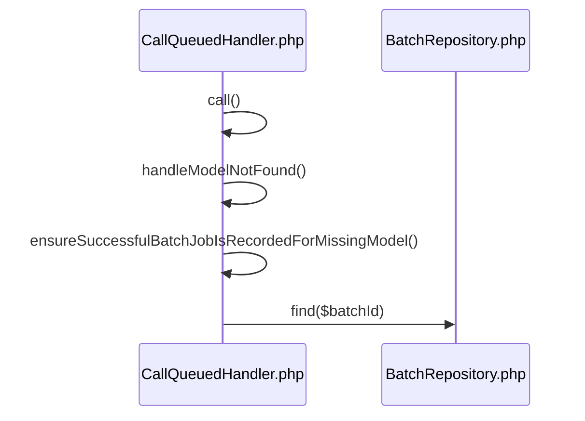
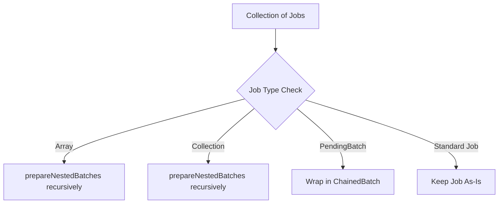

# Job Batching & Chaining

<details>
<summary>Relevant source files</summary>

The following files were used as context for generating this wiki page:

- [src/Illuminate/Bus/Batch.php](https://github.com/laravel/framework/blob/main/src/Illuminate/Bus/Batch.php)
- [src/Illuminate/Support/Testing/Fakes/BusFake.php](https://github.com/laravel/framework/blob/main/src/Illuminate/Support/Testing/Fakes/BusFake.php)
- [src/Illuminate/Support/Facades/Bus.php](https://github.com/laravel/framework/blob/main/src/Illuminate/Support/Facades/Bus.php)
- [src/Illuminate/Queue/CallQueuedHandler.php](https://github.com/laravel/framework/blob/main/src/Illuminate/Queue/CallQueuedHandler.php)
- [src/Illuminate/Foundation/Bus/PendingChain.php](https://github.com/laravel/framework/blob/main/src/Illuminate/Foundation/Bus/PendingChain.php)
- [src/Illuminate/Bus/Dispatcher.php](https://github.com/laravel/framework/blob/main/src/Illuminate/Bus/Dispatcher.php)
- [src/Illuminate/Bus/BusServiceProvider.php](https://github.com/laravel/framework/blob/main/src/Illuminate/Bus/BusServiceProvider.php)
- [src/Illuminate/Bus/Queueable.php](https://github.com/laravel/framework/blob/main/src/Illuminate/Bus/Queueable.php)
- [src/Illuminate/Bus/ChainedBatch.php](https://github.com/laravel/framework/blob/main/src/Illuminate/Bus/ChainedBatch.php)
- [src/Illuminate/Bus/DynamoBatchRepository.php](https://github.com/laravel/framework/blob/main/src/Illuminate/Bus/DynamoBatchRepository.php)
- [src/Illuminate/Bus/DatabaseBatchRepository.php](https://github.com/laravel/framework/blob/main/src/Illuminate/Bus/DatabaseBatchRepository.php)
- [src/Illuminate/Bus/PendingBatch.php](https://github.com/laravel/framework/blob/main/src/Illuminate/Bus/PendingBatch.php)
- [src/Illuminate/Bus/BatchRepository.php](https://github.com/laravel/framework/blob/main/src/Illuminate/Bus/BatchRepository.php)
- [types/Bus/BatchRepository.php](https://github.com/laravel/framework/blob/main/types/Bus/BatchRepository.php)
- [types/Bus/DatabaseBatchRepository.php](https://github.com/laravel/framework/blob/main/types/Bus/DatabaseBatchRepository.php)
</details>

## Overview

Job batching and chaining in Laravel coordinate complex execution flows across queue workers, allowing large sets of queueable jobs to be dispatched, tracked, and managed as cohesive units. The component solves the challenge of orchestrating dependent multi-job pipelines by recording progress, handling failures, executing lifecycle callbacks, and integrating cleanly with backend persistence storage repositories and testing fakes. 

Sources: [src/Illuminate/Bus/Batch.php](https://github.com/laravel/framework/blob/main/src/Illuminate/Bus/Batch.php#L20-L537), [src/Illuminate/Support/Testing/Fakes/BusFake.php](https://github.com/laravel/framework/blob/main/src/Illuminate/Support/Testing/Fakes/BusFake.php#L17-L944), [src/Illuminate/Bus/DatabaseBatchRepository.php](https://github.com/laravel/framework/blob/main/src/Illuminate/Bus/DatabaseBatchRepository.php#L14-L405), [src/Illuminate/Bus/DynamoBatchRepository.php](https://github.com/laravel/framework/blob/main/src/Illuminate/Bus/DynamoBatchRepository.php#L11-L538)

## Command Dispatching and Chain Construction

### Overview

Command dispatching and chain construction form the entry points for executing individual jobs, bulk operations, and sequential job pipelines in Laravel. The core components include the `Dispatcher` class, the `Bus` facade, the `PendingChain` helper, and the `Queueable` trait. Together, they provide a unified public API surface to route commands synchronously, push them to queues, configure connections, apply middleware, and build multi-job chains.

Sources: [src/Illuminate/Bus/Dispatcher.php](https://github.com/laravel/framework/blob/main/src/Illuminate/Bus/Dispatcher.php#L22-L368), [src/Illuminate/Support/Facades/Bus.php](https://github.com/laravel/framework/blob/main/src/Illuminate/Support/Facades/Bus.php#L63-L106), [src/Illuminate/Foundation/Bus/PendingChain.php](https://github.com/laravel/framework/blob/main/src/Illuminate/Foundation/Bus/PendingChain.php#L15-L237), [src/Illuminate/Bus/Queueable.php](https://github.com/laravel/framework/blob/main/src/Illuminate/Bus/Queueable.php#L15-L394)

### Dispatching Strategies and Pipeline Execution

The `Dispatcher` determines whether a command should run synchronously or enter a queue based on its implementation of the `ShouldQueue` interface. When `dispatch($command)` is called, the dispatcher evaluates `commandShouldBeQueued($command)`: if true and a queue resolver is registered, it routes the command to `dispatchToQueue($command)`; otherwise, it processes the command immediately via `dispatchNow($command)`.

Sources: [src/Illuminate/Bus/Dispatcher.php](https://github.com/laravel/framework/blob/main/src/Illuminate/Bus/Dispatcher.php#L78-L142)

> [!NOTE]
> The `dispatchSync()` method explicitly checks if a command implements `ShouldQueue` and defines an `onConnection` method. If both conditions are met, it overrides the target connection to `'sync'` before pushing it to the queue queue resolver.

Sources: [src/Illuminate/Bus/Dispatcher.php](https://github.com/laravel/framework/blob/main/src/Illuminate/Bus/Dispatcher.php#L100-L109)

When executing synchronously through `dispatchNow()`, the dispatcher wraps the execution in an Illuminate `Pipeline`. It inspects whether an explicit handler or a mapped handler exists via `getCommandHandler($command)`. If a handler is present, it invokes `handle()` or `__invoke()` on the resolved handler instance; otherwise, it utilizes the container to call the handler method directly on the command object itself.

Sources: [src/Illuminate/Bus/Dispatcher.php](https://github.com/laravel/framework/blob/main/src/Illuminate/Bus/Dispatcher.php#L118-L141)

### Chain Construction and Fluent Configuration

Chains of dependent jobs are managed using `PendingChain` instances created via `Bus::chain()` or `Dispatcher::chain()`. The chain execution flow relies on serializing subsequent jobs and passing connection, queue, delay, and catch callback parameters down the chain.

Sources: [src/Illuminate/Foundation/Bus/PendingChain.php](https://github.com/laravel/framework/blob/main/src/Illuminate/Foundation/Bus/PendingChain.php#L15-L237), [src/Illuminate/Bus/Dispatcher.php](https://github.com/laravel/framework/blob/main/src/Illuminate/Bus/Dispatcher.php#L207-L213)

The call-chain execution walkthrough for dispatching a pending chain proceeds as follows: 
`PendingChain::dispatch()` determines the first job instance → applies connection, queue, and delay settings to the first job instance → calls `$firstJob->chain($this->chain)` via the `Queueable` trait to serialize remaining jobs → assigns `chainCatchCallbacks` → delegates to `app(Dispatcher::class)->dispatch($firstJob)`.

Sources: [src/Illuminate/Foundation/Bus/PendingChain.php](https://github.com/laravel/framework/blob/main/src/Illuminate/Foundation/Bus/PendingChain.php#L186-L214), [src/Illuminate/Bus/Queueable.php](https://github.com/laravel/framework/blob/main/src/Illuminate/Bus/Queueable.php#L259-L266)

> [!WARNING]
> Unserialized closure jobs within chains require the `illuminate/queue` package and `CallQueuedClosure` support to be present; attempting to serialize a closure without it throws a `RuntimeException`.

Sources: [src/Illuminate/Bus/Queueable.php](https://github.com/laravel/framework/blob/main/src/Illuminate/Bus/Queueable.php#L312-L320)

### Public Dispatcher and Bus API Reference

| Method Signature | Return Type | Purpose | Sources |
| :--- | :--- | :--- | :--- |
| `dispatch(mixed $command)` | `mixed` | Dispatches a command to its appropriate handler or queue based on `ShouldQueue`. | [src/Illuminate/Bus/Dispatcher.php](https://github.com/laravel/framework/blob/main/src/Illuminate/Bus/Dispatcher.php#L78-L89) |
| `dispatchSync(mixed $command, mixed $handler = null)` | `mixed` | Dispatches a command synchronously in the current process or forces the sync queue. | [src/Illuminate/Bus/Dispatcher.php](https://github.com/laravel/framework/blob/main/src/Illuminate/Bus/Dispatcher.php#L100-L109) |
| `dispatchNow(mixed $command, mixed $handler = null)` | `mixed` | Dispatches a command immediately through the pipeline without queue integration. | [src/Illuminate/Bus/Dispatcher.php](https://github.com/laravel/framework/blob/main/src/Illuminate/Bus/Dispatcher.php#L118-L141) |
| `bulk(iterable $jobs)` | `void` | Dispatches multiple queueable jobs in bulk grouped by connection and queue. | [src/Illuminate/Bus/Dispatcher.php](https://github.com/laravel/framework/blob/main/src/Illuminate/Bus/Dispatcher.php#L149-L178) |
| `chain($jobs = null)` | `PendingChain` | Creates a new pending chain of queueable jobs. | [src/Illuminate/Bus/Dispatcher.php](https://github.com/laravel/framework/blob/main/src/Illuminate/Bus/Dispatcher.php#L207-L213) |
| `batch($jobs)` | `PendingBatch` | Creates a new batch of queueable jobs. | [src/Illuminate/Bus/Dispatcher.php](https://github.com/laravel/framework/blob/main/src/Illuminate/Bus/Dispatcher.php#L196-L199) |
| `pipeThrough(array $pipes)` | `$this` | Sets global middleware pipes for commands passing through the bus. | [src/Illuminate/Bus/Dispatcher.php](https://github.com/laravel/framework/blob/main/src/Illuminate/Bus/Dispatcher.php#L326-L331) |
| `map(array $map)` | `$this` | Maps commands to explicit non-self-handling handler classes. | [src/Illuminate/Bus/Dispatcher.php](https://github.com/laravel/framework/blob/main/src/Illuminate/Bus/Dispatcher.php#L338-L343) |

Sources: [src/Illuminate/Bus/Dispatcher.php](https://github.com/laravel/framework/blob/main/src/Illuminate/Bus/Dispatcher.php#L78-L343)

### Design Trade-Offs in Command Routing

| Design Choice | Benefit | Cost | Sources |
| :--- | :--- | :--- | :--- |
| Automatic queue detection via `ShouldQueue` | Eliminates boilerplate conditional checks when switching execution contexts. | Implicit behavior requires developers to inspect interface implementations to verify execution mode. | [src/Illuminate/Bus/Dispatcher.php](https://github.com/laravel/framework/blob/main/src/Illuminate/Bus/Dispatcher.php#L84-L89), [src/Illuminate/Bus/Dispatcher.php](https://github.com/laravel/framework/blob/main/src/Illuminate/Bus/Dispatcher.php#L247-L250) |
| Pipeline-based middleware handling | Allows uniform interception, validation, and enrichment of commands prior to handling. | Adds instantiation and invocation overhead during synchronous execution paths. | [src/Illuminate/Bus/Dispatcher.php](https://github.com/laravel/framework/blob/main/src/Illuminate/Bus/Dispatcher.php#L140-L140) |
| Bulk grouping by connection and queue route | Minimizes round-trips to backend queue systems by batching push calls. | Requires extra memory overhead to aggregate jobs into associative arrays before dispatching. | [src/Illuminate/Bus/Dispatcher.php](https://github.com/laravel/framework/blob/main/src/Illuminate/Bus/Dispatcher.php#L151-L177) |

Sources: [src/Illuminate/Bus/Dispatcher.php](https://github.com/laravel/framework/blob/main/src/Illuminate/Bus/Dispatcher.php#L84-L250)

## Job Batch Lifecycle and Dispatching

### Overview

The `PendingBatch` class orchestrates the creation, configuration, callback registration, and dispatch workflow for a collection of batchable jobs. Before any batch is placed onto a queue, `PendingBatch` inspects every submitted job to verify compliance with batching requirements.

Sources: [src/Illuminate/Bus/PendingBatch.php](https://github.com/laravel/framework/blob/main/src/Illuminate/Bus/PendingBatch.php#L64-L71)

### Job Verification and Batchable Enforcement

When a `PendingBatch` instance is constructed or when jobs are subsequently appended via `add()`, the input is filtered and evaluated by `ensureJobIsBatchable()`.

Sources: [src/Illuminate/Bus/PendingBatch.php](https://github.com/laravel/framework/blob/main/src/Illuminate/Bus/PendingBatch.php#L64-L88)

The verification workflow operates as follows:
`ensureJobIsBatchable()` → checks if job is a `PendingBatch` or `Closure` (allowing early return) → checks internal `static::$batchableClasses` cache → checks class usage of `Batchable::class` via `class_uses_recursive()` → throws `RuntimeException` if missing or caches success as `true`.

Sources: [src/Illuminate/Bus/PendingBatch.php](https://github.com/laravel/framework/blob/main/src/Illuminate/Bus/PendingBatch.php#L100-L114)

> [!WARNING]
> Attempting to include a job that does not incorporate the `Batchable` trait will immediately trigger a `RuntimeException` during construction or job addition, preventing invalid jobs from entering the batch repository.

Sources: [src/Illuminate/Bus/PendingBatch.php](https://github.com/laravel/framework/blob/main/src/Illuminate/Bus/PendingBatch.php#L107-L111)

### Callback Registration and Configuration Methods

`PendingBatch` supports registering multiple lifecycle hooks. Closures passed as callbacks are automatically wrapped using `SerializableClosure` to ensure safe persistence and transport across queue workers.

Sources: [src/Illuminate/Bus/PendingBatch.php](https://github.com/laravel/framework/blob/main/src/Illuminate/Bus/PendingBatch.php#L282-L287)

| Method Signature | Return Type | Purpose | Sources |
| :--- | :--- | :--- | :--- |
| `before(callable $callback)` | `$this` | Registers a callback executed immediately after the batch is stored. | [src/Illuminate/Bus/PendingBatch.php](https://github.com/laravel/framework/blob/main/src/Illuminate/Bus/PendingBatch.php#L123-L128) |
| `progress(callable $callback)` | `$this` | Registers a callback executed after any individual job finishes successfully. | [src/Illuminate/Bus/PendingBatch.php](https://github.com/laravel/framework/blob/main/src/Illuminate/Bus/PendingBatch.php#L146-L151) |
| `then(callable $callback)` | `$this` | Registers a callback executed after all jobs in the batch complete successfully. | [src/Illuminate/Bus/PendingBatch.php](https://github.com/laravel/framework/blob/main/src/Illuminate/Bus/PendingBatch.php#L169-L174) |
| `catch(callable $callback)` | `$this` | Registers a callback executed upon the first failing job within the batch. | [src/Illuminate/Bus/PendingBatch.php](https://github.com/laravel/framework/blob/main/src/Illuminate/Bus/PendingBatch.php#L192-L197) |
| `finally(callable $callback)` | `$this` | Registers a callback executed after all batch jobs have run (success or failure). | [src/Illuminate/Bus/PendingBatch.php](https://github.com/laravel/framework/blob/main/src/Illuminate/Bus/PendingBatch.php#L215-L220) |
| `allowFailures($param = true)` | `$this` | Prevents batch cancellation on job failure and optionally registers failure handlers. | [src/Illuminate/Bus/PendingBatch.php](https://github.com/laravel/framework/blob/main/src/Illuminate/Bus/PendingBatch.php#L242-L257) |
| `name(string $name)` | `$this` | Assigns a descriptive string identifier to the batch. | [src/Illuminate/Bus/PendingBatch.php](https://github.com/laravel/framework/blob/main/src/Illuminate/Bus/PendingBatch.php#L295-L300) |
| `onConnection($connection)` | `$this` | Specifies the queue connection for all batched jobs. | [src/Illuminate/Bus/PendingBatch.php](https://github.com/laravel/framework/blob/main/src/Illuminate/Bus/PendingBatch.php#L308-L313) |
| `onQueue($queue)` | `$this` | Specifies the queue target for all batched jobs. | [src/Illuminate/Bus/PendingBatch.php](https://github.com/laravel/framework/blob/main/src/Illuminate/Bus/PendingBatch.php#L331-L336) |

Sources: [src/Illuminate/Bus/PendingBatch.php](https://github.com/laravel/framework/blob/main/src/Illuminate/Bus/PendingBatch.php#L123-L336)

### Dispatch Workflow

Dispatches can occur immediately via `dispatch()`, deferred until the HTTP response is sent using `dispatchAfterResponse()`, or conditioned with `dispatchIf()` and `dispatchUnless()`. 

Sources: [src/Illuminate/Bus/PendingBatch.php](https://github.com/laravel/framework/blob/main/src/Illuminate/Bus/PendingBatch.php#L369-L455)

The immediate dispatch lifecycle proceeds as follows:
`dispatch()` resolves `BatchRepository` from the container → calls `$this->store($repository)` which persists the batch record and invokes any registered `before` callbacks → invokes `$batch->add($this->jobs)` to attach and push jobs to the underlying queue → dispatches a `BatchDispatched` application event. If storage or job addition throws a `Throwable`, any newly created batch is automatically deleted.

Sources: [src/Illuminate/Bus/PendingBatch.php](https://github.com/laravel/framework/blob/main/src/Illuminate/Bus/PendingBatch.php#L370-L389), [src/Illuminate/Bus/PendingBatch.php](https://github.com/laravel/framework/blob/main/src/Illuminate/Bus/PendingBatch.php#L463-L478)

### Full Worked Example

```php
use Illuminate\Support\Facades\Bus;
use App\Jobs\ProcessPodcast;

$batch = Bus::batch([
    new ProcessPodcast(1),
    new ProcessPodcast(2),
    new ProcessPodcast(3),
])
->name('Podcast Import Batch')
->onConnection('redis')
->onQueue('imports')
->allowFailures()
->before(function ($batch) {
    // Executed right after the batch record is stored in the repository
})
->progress(function ($batch) {
    // Executed incrementally as each job finishes successfully
})
->then(function ($batch) {
    // Executed when all jobs finish successfully
})
->catch(function ($batch, $e) {
    // Executed upon the first job failure when failures are allowed
})
->finally(function ($batch) {
    // Executed once every job in the batch has executed exactly once
})
->dispatch();
```

Sources: [src/Illuminate/Bus/PendingBatch.php](https://github.com/laravel/framework/blob/main/src/Illuminate/Bus/PendingBatch.php#L123-L257), [src/Illuminate/Bus/PendingBatch.php](https://github.com/laravel/framework/blob/main/src/Illuminate/Bus/PendingBatch.php#L295-L390)

## Batch Storage Repositories

### Overview

Laravel manages job batch state and counters through the `BatchRepository` contract, implemented by `DatabaseBatchRepository` for relational database connections and `DynamoBatchRepository` for AWS DynamoDB. The `BusServiceProvider` automatically configures and binds the active repository singleton depending on the configured `queue.batching.driver` value.

Sources: [src/Illuminate/Bus/BusServiceProvider.php](https://github.com/laravel/framework/blob/main/src/Illuminate/Bus/BusServiceProvider.php#L47-L53), [src/Illuminate/Bus/BatchRepository.php](https://github.com/laravel/framework/blob/main/src/Illuminate/Bus/BatchRepository.php#L7-L101)

### Repository Implementations and Contracts

The batch repository layer provides methods for retrieving, storing, updating job counters, marking completion, cancelling, deleting, and pruning batches.

| Method Signature | Return Type | Purpose | Sources |
|------------------|-------------|---------|---------|
| `get($limit, $before)` | `\Illuminate\Bus\Batch[]` | Retrieves a paginated list of batches, optionally filtered by an ID threshold. | [src/Illuminate/Bus/BatchRepository.php](https://github.com/laravel/framework/blob/main/src/Illuminate/Bus/BatchRepository.php#L10-L16), [src/Illuminate/Bus/DynamoBatchRepository.php](https://github.com/laravel/framework/blob/main/src/Illuminate/Bus/DynamoBatchRepository.php#L89-L112), [src/Illuminate/Bus/DatabaseBatchRepository.php](https://github.com/laravel/framework/blob/main/src/Illuminate/Bus/DatabaseBatchRepository.php#L58-L69) |
| `find(string $batchId)` | `\Illuminate\Bus\Batch\|null` | Retrieves a single batch record by its unique string identifier. | [src/Illuminate/Bus/BatchRepository.php](https://github.com/laravel/framework/blob/main/src/Illuminate/Bus/BatchRepository.php#L18-L24), [src/Illuminate/Bus/DynamoBatchRepository.php](https://github.com/laravel/framework/blob/main/src/Illuminate/Bus/DynamoBatchRepository.php#L120-L155), [src/Illuminate/Bus/DatabaseBatchRepository.php](https://github.com/laravel/framework/blob/main/src/Illuminate/Bus/DatabaseBatchRepository.php#L77-L87) |
| `store(PendingBatch $batch)` | `\Illuminate\Bus\Batch` | Persists a new pending batch with zeroed counters and returns the hydrated instance. | [src/Illuminate/Bus/BatchRepository.php](https://github.com/laravel/framework/blob/main/src/Illuminate/Bus/BatchRepository.php#L26-L32), [src/Illuminate/Bus/DynamoBatchRepository.php](https://github.com/laravel/framework/blob/main/src/Illuminate/Bus/DynamoBatchRepository.php#L163-L192), [src/Illuminate/Bus/DatabaseBatchRepository.php](https://github.com/laravel/framework/blob/main/src/Illuminate/Bus/DatabaseBatchRepository.php#L95-L113) |
| `incrementTotalJobs(string $batchId, int $amount)` | `void` | Increases the total and pending job counts for a batch by the specified amount. | [src/Illuminate/Bus/BatchRepository.php](https://github.com/laravel/framework/blob/main/src/Illuminate/Bus/BatchRepository.php#L34-L41), [src/Illuminate/Bus/DynamoBatchRepository.php](https://github.com/laravel/framework/blob/main/src/Illuminate/Bus/DynamoBatchRepository.php#L201-L223), [src/Illuminate/Bus/DatabaseBatchRepository.php](https://github.com/laravel/framework/blob/main/src/Illuminate/Bus/DatabaseBatchRepository.php#L122-L129) |
| `decrementPendingJobs(string $batchId, string $jobId)` | `\Illuminate\Bus\UpdatedBatchJobCounts` | Decrements pending jobs and returns updated job counters. | [src/Illuminate/Bus/BatchRepository.php](https://github.com/laravel/framework/blob/main/src/Illuminate/Bus/BatchRepository.php#L43-L50), [src/Illuminate/Bus/DynamoBatchRepository.php](https://github.com/laravel/framework/blob/main/src/Illuminate/Bus/DynamoBatchRepository.php#L232-L261), [src/Illuminate/Bus/DatabaseBatchRepository.php](https://github.com/laravel/framework/blob/main/src/Illuminate/Bus/DatabaseBatchRepository.php#L138-L152) |
| `incrementFailedJobs(string $batchId, string $jobId)` | `\Illuminate\Bus\UpdatedBatchJobCounts` | Increments failed jobs, appends the failing job ID, and returns updated counters. | [src/Illuminate/Bus/BatchRepository.php](https://github.com/laravel/framework/blob/main/src/Illuminate/Bus/BatchRepository.php#L52-L59), [src/Illuminate/Bus/DynamoBatchRepository.php](https://github.com/laravel/framework/blob/main/src/Illuminate/Bus/DynamoBatchRepository.php#L270-L300), [src/Illuminate/Bus/DatabaseBatchRepository.php](https://github.com/laravel/framework/blob/main/src/Illuminate/Bus/DatabaseBatchRepository.php#L161-L175) |
| `markAsFinished(string $batchId)` | `void` | Sets the `finished_at` timestamp on the batch record. | [src/Illuminate/Bus/BatchRepository.php](https://github.com/laravel/framework/blob/main/src/Illuminate/Bus/BatchRepository.php#L61-L67), [src/Illuminate/Bus/DynamoBatchRepository.php](https://github.com/laravel/framework/blob/main/src/Illuminate/Bus/DynamoBatchRepository.php#L308-L329), [src/Illuminate/Bus/DatabaseBatchRepository.php](https://github.com/laravel/framework/blob/main/src/Illuminate/Bus/DatabaseBatchRepository.php#L203-L208) |
| `cancel(string $batchId)` | `void` | Sets both `cancelled_at` and `finished_at` timestamps on the batch. | [src/Illuminate/Bus/BatchRepository.php](https://github.com/laravel/framework/blob/main/src/Illuminate/Bus/BatchRepository.php#L69-L75), [src/Illuminate/Bus/DynamoBatchRepository.php](https://github.com/laravel/framework/blob/main/src/Illuminate/Bus/DynamoBatchRepository.php#L337-L358), [src/Illuminate/Bus/DatabaseBatchRepository.php](https://github.com/laravel/framework/blob/main/src/Illuminate/Bus/DatabaseBatchRepository.php#L216-L222) |
| `delete(string $batchId)` | `void` | Permanently deletes the batch record from the repository store. | [src/Illuminate/Bus/BatchRepository.php](https://github.com/laravel/framework/blob/main/src/Illuminate/Bus/BatchRepository.php#L77-L83), [src/Illuminate/Bus/DynamoBatchRepository.php](https://github.com/laravel/framework/blob/main/src/Illuminate/Bus/DynamoBatchRepository.php#L366-L375), [src/Illuminate/Bus/DatabaseBatchRepository.php](https://github.com/laravel/framework/blob/main/src/Illuminate/Bus/DatabaseBatchRepository.php#L230-L233) |

Sources: [src/Illuminate/Bus/BatchRepository.php](https://github.com/laravel/framework/blob/main/src/Illuminate/Bus/BatchRepository.php#L7-L83), [src/Illuminate/Bus/DynamoBatchRepository.php](https://github.com/laravel/framework/blob/main/src/Illuminate/Bus/DynamoBatchRepository.php#L89-L375), [src/Illuminate/Bus/DatabaseBatchRepository.php](https://github.com/laravel/framework/blob/main/src/Illuminate/Bus/DatabaseBatchRepository.php#L58-L233)

### Atomic Value Updates and Concurrency

When concurrent workers decrement pending jobs or record failures, `DatabaseBatchRepository` protects counter integrity using a transaction lock-for-update workflow.

> [!NOTE]
> `DatabaseBatchRepository::decrementPendingJobs()` and `incrementFailedJobs()` delegate to `updateAtomicValues()`, which opens a database transaction, invokes `lockForUpdate()` on the targeted batch row, evaluates the state closure, and updates the database record atomically.

Sources: [src/Illuminate/Bus/DatabaseBatchRepository.php](https://github.com/laravel/framework/blob/main/src/Illuminate/Bus/DatabaseBatchRepository.php#L138-L195)

The atomic update call chain executes as follows:
`decrementPendingJobs()` → `updateAtomicValues()` → `connection->transaction()` → `table->where('id', $batchId)->lockForUpdate()->first()` → executes the passed callback to recalculate `pending_jobs`, `failed_jobs`, and `failed_job_ids` → `table->where('id', $batchId)->update($values)` — ensuring concurrent queue workers do not overwrite each other's counter adjustments.

Sources: [src/Illuminate/Bus/DatabaseBatchRepository.php](https://github.com/laravel/framework/blob/main/src/Illuminate/Bus/DatabaseBatchRepository.php#L138-L195)

### Database-Specific Serialization and Pruning

`DatabaseBatchRepository` implements `PrunableBatchRepository`, allowing clean-up of old records through `prune()`, `pruneUnfinished()`, and `pruneCancelled()` in chunks of 1000 entries. Furthermore, when serializing batch options for PostgreSQL connections, `DatabaseBatchRepository` automatically base64-encodes serialized payloads to prevent binary null-byte issues.

> [!WARNING]
> On PostgreSQL connections, `serialize()` encodes data via `base64_encode()`, and `unserialize()` automatically decodes payloads if they lack standard PHP serialization delimiters (`:` or `;`).

Sources: [src/Illuminate/Bus/DatabaseBatchRepository.php](https://github.com/laravel/framework/blob/main/src/Illuminate/Bus/DatabaseBatchRepository.php#L241-L302), [src/Illuminate/Bus/DatabaseBatchRepository.php](https://github.com/laravel/framework/blob/main/src/Illuminate/Bus/DatabaseBatchRepository.php#L333-L360)

## Queued Job Handling and Execution

### Overview

The `CallQueuedHandler` class acts as the central execution engine for processing queued commands and jobs. When a worker pulls a job from the queue, it invokes the `call()` method, which orchestrates command payload extraction, model hydration, middleware pipeline execution, unique lock management, chain progression, and batch counter adjustments.

Sources: [src/Illuminate/Queue/CallQueuedHandler.php](https://github.com/laravel/framework/blob/main/src/Illuminate/Queue/CallQueuedHandler.php#L60-L101)

### Execution Walkthrough and Missing Model Handling

When a queued job requires Eloquent models that have been deleted or cannot be found during payload unserialization, `CallQueuedHandler` intercepts the resulting `ModelNotFoundException` to execute fallback routines.

The missing model resolution and tracking sequence executes through the following call chain:
1. `call` — Invokes `getCommand()` inside a `try` block, which catches `ModelNotFoundException` and delegates to `handleModelNotFound()`.
2. `handleModelNotFound` — Calls `ensureUniqueJobLockIsReleasedViaContext()` and inspects whether the job payload specifies `deleteWhenMissingModels`.
3. `ensureSuccessfulBatchJobIsRecordedForMissingModel` — Verifies whether the command uses the `Batchable` trait, resolves the `BatchRepository` container binding, extracts the `batchId` from the payload, and calls `find()` on the repository.
4. `find` — Retrieves the active batch record from storage so that missing model deletions can correctly decrement pending batch job counters.

Sources: [src/Illuminate/Queue/CallQueuedHandler.php](https://github.com/laravel/framework/blob/main/src/Illuminate/Queue/CallQueuedHandler.php#L67-L75), [src/Illuminate/Queue/CallQueuedHandler.php](https://github.com/laravel/framework/blob/main/src/Illuminate/Queue/CallQueuedHandler.php#L307-L318), [src/Illuminate/Queue/CallQueuedHandler.php](https://github.com/laravel/framework/blob/main/src/Illuminate/Queue/CallQueuedHandler.php#L356-L376), [src/Illuminate/Bus/BatchRepository.php](https://github.com/laravel/framework/blob/main/src/Illuminate/Bus/BatchRepository.php#L19-L24)



Sources: [src/Illuminate/Queue/CallQueuedHandler.php](https://github.com/laravel/framework/blob/main/src/Illuminate/Queue/CallQueuedHandler.php#L67-L75), [src/Illuminate/Queue/CallQueuedHandler.php](https://github.com/laravel/framework/blob/main/src/Illuminate/Queue/CallQueuedHandler.php#L307-L318), [src/Illuminate/Queue/CallQueuedHandler.php](https://github.com/laravel/framework/blob/main/src/Illuminate/Queue/CallQueuedHandler.php#L356-L376), [src/Illuminate/Bus/BatchRepository.php](https://github.com/laravel/framework/blob/main/src/Illuminate/Bus/BatchRepository.php#L19-L24)

### Batch Lifecycle Callbacks and Events

During successful and failed job executions, `Batch` instance methods coordinate lifecycle transitions. When the first job in a batch is processed, `BatchStarted` is dispatched via the container event dispatcher. As jobs finish or fail, progress, success (`then`), failure (`failure`, `catch`), and completion (`finally`) callbacks are invoked.

> [!NOTE]
> `Batch::recordSuccessfulJob()` evaluates whether pending jobs have reached zero, marking the batch as finished in the repository and dispatching `BatchFinished`.

Sources: [src/Illuminate/Bus/Batch.php](https://github.com/laravel/framework/blob/main/src/Illuminate/Bus/Batch.php#L237-L270), [src/Illuminate/Bus/Batch.php](https://github.com/laravel/framework/blob/main/src/Illuminate/Bus/Batch.php#L345-L383)

> [!WARNING]
> If a batch does not allow failures (`allowsFailures()` returns `false`), the first failing job immediately cancels the entire batch and dispatches the `BatchCanceled` event.

Sources: [src/Illuminate/Bus/Batch.php](https://github.com/laravel/framework/blob/main/src/Illuminate/Bus/Batch.php#L329-L333), [src/Illuminate/Bus/Batch.php](https://github.com/laravel/framework/blob/main/src/Illuminate/Bus/Batch.php#L362-L364), [src/Illuminate/Bus/Batch.php](https://github.com/laravel/framework/blob/main/src/Illuminate/Bus/Batch.php#L439-L448)

| Method Name | Return Type | Purpose / Action | Sources |
| :--- | :--- | :--- | :--- |
| `call(Job $job, array $data)` | `void` | Primary entry point for handling queued jobs, executing command pipelines, and updating chains and batches. | [src/Illuminate/Queue/CallQueuedHandler.php](https://github.com/laravel/framework/blob/main/src/Illuminate/Queue/CallQueuedHandler.php#L67-L101) |
| `handleModelNotFound(Job $job, $e)` | `void` | Releases unique job locks and either deletes the job or marks it failed when models cannot be found. | [src/Illuminate/Queue/CallQueuedHandler.php](https://github.com/laravel/framework/blob/main/src/Illuminate/Queue/CallQueuedHandler.php#L307-L318) |
| `recordSuccessfulJob(string $jobId)` | `void` | Decrements pending job counts, evaluates progress/success callbacks, and dispatches batch completion events. | [src/Illuminate/Bus/Batch.php](https://github.com/laravel/framework/blob/main/src/Illuminate/Bus/Batch.php#L237-L270) |
| `recordFailedJob(string $jobId, $e)` | `void` | Increments failed job counts, triggers batch cancellation if failures are disallowed, and runs catch/finally handlers. | [src/Illuminate/Bus/Batch.php](https://github.com/laravel/framework/blob/main/src/Illuminate/Bus/Batch.php#L345-L383) |

Sources: [src/Illuminate/Queue/CallQueuedHandler.php](https://github.com/laravel/framework/blob/main/src/Illuminate/Queue/CallQueuedHandler.php#L67-L101), [src/Illuminate/Queue/CallQueuedHandler.php](https://github.com/laravel/framework/blob/main/src/Illuminate/Queue/CallQueuedHandler.php#L307-L318), [src/Illuminate/Bus/Batch.php](https://github.com/laravel/framework/blob/main/src/Illuminate/Bus/Batch.php#L237-L270), [src/Illuminate/Bus/Batch.php](https://github.com/laravel/framework/blob/main/src/Illuminate/Bus/Batch.php#L345-L383)

## Chained Batches and Nested Execution

### Overview

Combining job batching with job chaining allows complex orchestration workflows where entire batches are executed sequentially inside a job chain, or where nested batches reside within jobs and other batches. The `ChainedBatch` wrapper class implements `ShouldQueue` and utilizes `Batchable`, `Dispatchable`, `InteractsWithQueue`, and `Queueable` traits to bridge standard job chains and batch definitions.

Sources: [src/Illuminate/Bus/ChainedBatch.php](https://github.com/laravel/framework/blob/main/src/Illuminate/Bus/ChainedBatch.php#L13-L16)

### Nested Batch Preparation and Execution

When a `ChainedBatch` or `PendingChain` is constructed or modified, `ChainedBatch::prepareNestedBatches()` recursively traverses job collections. 



Sources: [src/Illuminate/Bus/ChainedBatch.php](https://github.com/laravel/framework/blob/main/src/Illuminate/Bus/ChainedBatch.php#L60-L68), [src/Illuminate/Foundation/Bus/PendingChain.php](https://github.com/laravel/framework/blob/main/src/Illuminate/Foundation/Bus/PendingChain.php#L107-L110)

The transformation execution walkthrough for nested structural preparation proceeds through specific matching branches:
1. `prepareNestedBatches()` filters and maps over the input collection.
2. `is_array($job)` matches nested arrays, recursively invoking `prepareNestedBatches(new Collection($job))`.
3. `$job instanceof Collection` matches sub-collections, recursively calling `prepareNestedBatches($job)`.
4. `$job instanceof PendingBatch` wraps the pending batch inside a new `ChainedBatch` instance.
5. `default` retains standard job instances without modification.

Sources: [src/Illuminate/Bus/ChainedBatch.php](https://github.com/laravel/framework/blob/main/src/Illuminate/Bus/ChainedBatch.php#L60-L68)

> [!WARNING]
> When a `ChainedBatch` handles execution via `handle()`, it converts itself into a pending batch and attaches any remaining items in the job chain to the end of the batch using a `finally` callback, ensuring subsequent chained jobs run only after the batch successfully completes and is not cancelled.

Sources: [src/Illuminate/Bus/ChainedBatch.php](https://github.com/laravel/framework/blob/main/src/Illuminate/Bus/ChainedBatch.php#L75-L80), [src/Illuminate/Bus/ChainedBatch.php#L119-L143]

### Chained Batch Structural Reference

| Class / Method | Parameter Types | Return Type | Purpose / Action | Sources |
| :--- | :--- | :--- | :--- | :--- |
| `ChainedBatch::__construct` | `PendingBatch $batch` | `void` | Initializes a chained batch instance, preparing nested batches and setting queue properties and names. | [src/Illuminate/Bus/ChainedBatch.php](https://github.com/laravel/framework/blob/main/src/Illuminate/Bus/ChainedBatch.php#L43-L52) |
| `ChainedBatch::prepareNestedBatches` | `Collection $jobs` | `Collection` | Recursively transforms arrays, collections, and pending batches into `ChainedBatch` wrappers. | [src/Illuminate/Bus/ChainedBatch.php](https://github.com/laravel/framework/blob/main/src/Illuminate/Bus/ChainedBatch.php#L60-L68) |
| `ChainedBatch::handle` | None | `void` | Executes the chained batch by converting it to a pending batch and attaching remainder chain links. | [src/Illuminate/Bus/ChainedBatch.php](https://github.com/laravel/framework/blob/main/src/Illuminate/Bus/ChainedBatch.php#L75-L80) |
| `ChainedBatch::toPendingBatch` | None | `PendingBatch` | Dispatches and configures the underlying pending batch container instance with callback handlers. | [src/Illuminate/Bus/ChainedBatch.php](https://github.com/laravel/framework/blob/main/src/Illuminate/Bus/ChainedBatch.php#L87-L111) |
| `PendingChain::prepend` | `mixed $job` | `$this` | Prepares nested batches and prepends the job to the current execution chain. | [src/Illuminate/Foundation/Bus/PendingChain.php](https://github.com/laravel/framework/blob/main/src/Illuminate/Foundation/Bus/PendingChain.php#L105-L120) |

Sources: [src/Illuminate/Bus/ChainedBatch.php](https://github.com/laravel/framework/blob/main/src/Illuminate/Bus/ChainedBatch.php#L43-L111), [src/Illuminate/Foundation/Bus/PendingChain.php](https://github.com/laravel/framework/blob/main/src/Illuminate/Foundation/Bus/PendingChain.php#L105-L120)

## Testing and Bus Fakes

### Overview

`BusFake` replaces the standard bus dispatcher during testing to intercept dispatched jobs, chains, and batches without executing them on live queues. When `Bus::fake()` is called via the facade, it wraps the underlying dispatcher or current fake instance, swapping it into the container and instantiating a `BusFake` alongside a `BatchRepositoryFake` to track batched jobs.

Sources: [src/Illuminate/Support/Testing/Fakes/BusFake.php](https://github.com/laravel/framework/blob/main/src/Illuminate/Support/Testing/Fakes/BusFake.php#L91-L96), [src/Illuminate/Support/Facades/Bus.php](https://github.com/laravel/framework/blob/main/src/Illuminate/Support/Facades/Bus.php#L72-L81)

### Job Interception Execution Walkthrough

When any dispatch method (`dispatch()`, `dispatchSync()`, `dispatchNow()`, `dispatchToQueue()`, or `dispatchAfterResponse()`) is invoked on `BusFake`, the command goes through a decision branch to determine whether it should be faked or passed through to the original dispatcher:
1. `shouldFakeJob($command)` checks `shouldDispatchCommand($command)` against excluded jobs configured via `except()`.
2. If `jobsToFake` array is empty, all jobs are intercepted. Otherwise, it checks if `jobsToFake` contains either a matching closure or an exact class-name string match.
3. If faking evaluates to `true`, `getCommandRepresentation($command)` checks the `serializeAndRestore` flag; if enabled, it calls `serializeAndRestoreCommand($command)` using `unserialize(serialize($command))` to simulate queue serialization.
4. Finally, the command representation is stored inside the corresponding tracking array (`$this->commands`, `$this->commandsSync`, or `$this->commandsAfterResponse`).

Sources: [src/Illuminate/Support/Testing/Fakes/BusFake.php](https://github.com/laravel/framework/blob/main/src/Illuminate/Support/Testing/Fakes/BusFake.php#L665-L737), [src/Illuminate/Support/Testing/Fakes/BusFake.php](https://github.com/laravel/framework/blob/main/src/Illuminate/Support/Testing/Fakes/BusFake.php#L818-L885)

> [!WARNING]
> When `assertChained()` evaluates an expected chain, `assertDispatchedWithChainOfObjects()` verifies that serialized chained jobs match exact types, closures, or `ChainedBatchTruthTest` instances, throwing a `RuntimeException` if a chained job fails type verification.

Sources: [src/Illuminate/Support/Testing/Fakes/BusFake.php](https://github.com/laravel/framework/blob/main/src/Illuminate/Support/Testing/Fakes/BusFake.php#L446-L489)

### Bus Fake Assertion and Tracking Methods

| Method | Parameters | Purpose / Action | Sources |
| :--- | :--- | :--- | :--- |
| `BusFake::__construct` | `QueueingDispatcher $dispatcher, $jobsToFake = [], ?BatchRepository $batchRepository = null` | Instantiates the fake dispatcher, wrapping jobs to fake and initializing a batch repository fake. | [src/Illuminate/Support/Testing/Fakes/BusFake.php](https://github.com/laravel/framework/blob/main/src/Illuminate/Support/Testing/Fakes/BusFake.php#L91-L96) |
| `BusFake::except` | `$jobsToDispatch` | Specifies job types that should bypass faking and dispatch normally. | [src/Illuminate/Support/Testing/Fakes/BusFake.php](https://github.com/laravel/framework/blob/main/src/Illuminate/Support/Testing/Fakes/BusFake.php#L104-L109) |
| `BusFake::assertDispatched` | `$command, $callback = null` | Asserts that a specific job or closure-matched command was dispatched. | [src/Illuminate/Support/Testing/Fakes/BusFake.php](https://github.com/laravel/framework/blob/main/src/Illuminate/Support/Testing/Fakes/BusFake.php#L118-L134) |
| `BusFake::assertChained` | `array $expectedChain` | Asserts that a job was dispatched with an exact sequence of chained child jobs. | [src/Illuminate/Support/Testing/Fakes/BusFake.php](https://github.com/laravel/framework/blob/main/src/Illuminate/Support/Testing/Fakes/BusFake.php#L355-L387) |
| `BusFake::assertBatched` | `callable\|array $callback` | Asserts that a job batch matching the provided truth test or job array was dispatched. | [src/Illuminate/Support/Testing/Fakes/BusFake.php](https://github.com/laravel/framework/blob/main/src/Illuminate/Support/Testing/Fakes/BusFake.php#L508-L516) |
| `Bus::fake` | `$jobsToFake = [], ?BatchRepository $batchRepository = null` | Facade static method to swap the container dispatcher binding with a `BusFake` instance. | [src/Illuminate/Support/Facades/Bus.php](https://github.com/laravel/framework/blob/main/src/Illuminate/Support/Facades/Bus.php#L72-L81) |

Sources: [src/Illuminate/Support/Testing/Fakes/BusFake.php](https://github.com/laravel/framework/blob/main/src/Illuminate/Support/Testing/Fakes/BusFake.php#L91-L516), [src/Illuminate/Support/Facades/Bus.php](https://github.com/laravel/framework/blob/main/src/Illuminate/Support/Facades/Bus.php#L72-L81)

## Related

- [[Queue Workers & Processing]]

