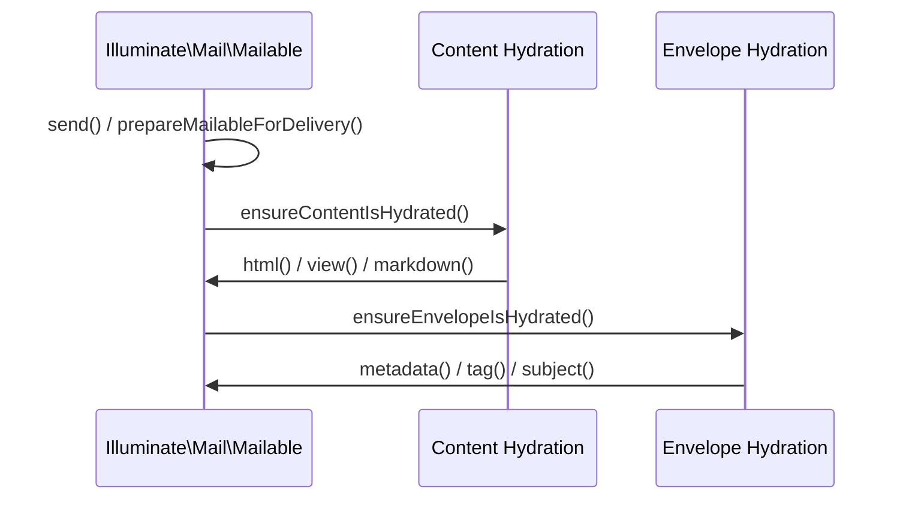
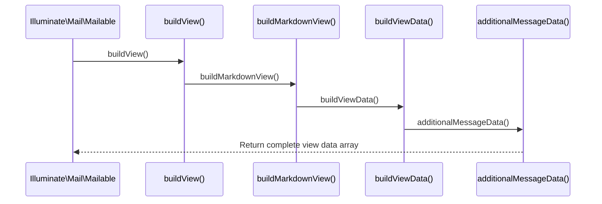

# Mail & Mailable Classes

<details>
<summary>Relevant source files</summary>

The following files were used as context for generating this wiki page:

- [src/Illuminate/Mail/Mailable.php](https://github.com/laravel/framework/blob/main/src/Illuminate/Mail/Mailable.php)
- [src/Illuminate/Mail/Mailer.php](https://github.com/laravel/framework/blob/main/src/Illuminate/Mail/Mailer.php)
- [src/Illuminate/Notifications/Channels/MailChannel.php](https://github.com/laravel/framework/blob/main/src/Illuminate/Notifications/Channels/MailChannel.php)
- [src/Illuminate/Support/Facades/Mail.php](https://github.com/laravel/framework/blob/main/src/Illuminate/Support/Facades/Mail.php)
- [src/Illuminate/Mail/Message.php](https://github.com/laravel/framework/blob/main/src/Illuminate/Mail/Message.php)
- [src/Illuminate/Mail/PendingMail.php](https://github.com/laravel/framework/blob/main/src/Illuminate/Mail/PendingMail.php)
- [src/Illuminate/Notifications/Messages/MailMessage.php](https://github.com/laravel/framework/blob/main/src/Illuminate/Notifications/Messages/MailMessage.php)
- [src/Illuminate/Mail/Mailables/Content.php](https://github.com/laravel/framework/blob/main/src/Illuminate/Mail/Mailables/Content.php)
- [src/Illuminate/Contracts/Mail/Mailable.php](https://github.com/laravel/framework/blob/main/src/Illuminate/Contracts/Mail/Mailable.php)
</details>

## Overview

Laravel's mail and mailable architecture provides a robust, object-oriented system for composing and delivering email messages across multiple transports. At its core, the package decouples business logic from email presentation by encapsulating recipients, subjects, attachments, and configuration inside dedicated mailable classes and fluent dispatchers. This solves the complexity of managing raw MIME messages, view data binding, and asynchronous queue dispatching by coordinating seamlessly with Symfony Mailer, the view rendering engine, and the notification system.

Sources: [src/Illuminate/Mail/Mailable.php#L36-L252](https://github.com/laravel/framework/blob/main/src/Illuminate/Mail/Mailable.php#L36-L252), [src/Illuminate/Mail/Mailer.php#L24-L354](https://github.com/laravel/framework/blob/main/src/Illuminate/Mail/Mailer.php#L24-L354)

## Fluent Mail Dispatching and PendingMail

### Overview

The `Mail` facade and `PendingMail` fluent interface provide public API entry points for dispatching mailables and custom messages across the application. Developers initiate dispatch chains using methods like `to()`, `cc()`, and `bcc()`, which instantiate a `PendingMail` instance that configures recipients and locales before handing off the mailable to the underlying `Mailer` transport or queue manager.

Sources: [src/Illuminate/Mail/Mailer.php#L161-L200](https://github.com/laravel/framework/blob/main/src/Illuminate/Mail/Mailer.php#L161-L200), [src/Illuminate/Mail/PendingMail.php#L54-L113](https://github.com/laravel/framework/blob/main/src/Illuminate/Mail/PendingMail.php#L54-L113)

### Dispatch Methods and Fluent Interface

The `Mailer` class provides several entry-point methods that initiate message construction or pass mailables to queue and delivery backends. When a recipient method such as `to()`, `cc()`, or `bcc()` is called on the `Mailer` class, it wraps recipient inputs—optionally converting string addresses and names into `Address` objects—and returns a `PendingMail` instance.

```php
namespace Illuminate\Mail;

use Illuminate\Contracts\Mail\Mailable as MailableContract;

class PendingMail
{
    public function send(MailableContract $mailable)
    {
        return $this->mailer->send($this->fill($mailable));
    }
}
```

Sources: [src/Illuminate/Mail/Mailer.php#L161-L200](https://github.com/laravel/framework/blob/main/src/Illuminate/Mail/Mailer.php#L161-L200), [src/Illuminate/Mail/PendingMail.php#L121-L124](https://github.com/laravel/framework/blob/main/src/Illuminate/Mail/PendingMail.php#L121-L124)

`PendingMail` exposes dispatch and scheduling methods that invoke corresponding functions on the underlying `Mailer` instance after populating the mailable with recipient addresses and locale preferences.

| Method | Parameters | Return Type | Purpose |
| :--- | :--- | :--- | :--- |
| `to()` | `mixed $users`, `string|null $name = null` | `\Illuminate\Mail\PendingMail` | Set primary recipient(s) for the message |
| `cc()` | `mixed $users`, `string|null $name = null` | `\Illuminate\Mail\PendingMail` | Set carbon copy recipient(s) for the message |
| `bcc()` | `mixed $users`, `string|null $name = null` | `\Illuminate\Mail\PendingMail` | Set blind carbon copy recipient(s) for the message |
| `locale()` | `string $locale` | `$this` | Set the preferred translation locale for the message |
| `send()` | `MailableContract $mailable` | `\Illuminate\Mail\SentMessage\|null` | Deliver the mailable message synchronously |
| `sendNow()` | `MailableContract $mailable` | `\Illuminate\Mail\SentMessage\|null` | Bypass queue and send mailable immediately |
| `queue()` | `MailableContract $mailable` | `mixed` | Push the mailable message onto the queue |
| `later()` | `mixed $delay`, `MailableContract $mailable` | `mixed` | Queue the mailable message for delivery after a delay |

Sources: [src/Illuminate/Mail/Mailer.php#L161-L200](https://github.com/laravel/framework/blob/main/src/Illuminate/Mail/Mailer.php#L161-L200), [src/Illuminate/Mail/PendingMail.php#L65-L158](https://github.com/laravel/framework/blob/main/src/Illuminate/Mail/PendingMail.php#L65-L158)

> [!NOTE]
> When setting recipients via `to()`, if the user object implements `Illuminate\Contracts\Translation\HasLocalePreference` and no explicit locale has been set on the `PendingMail` instance, the preferred locale is automatically retrieved and applied to the message.

Sources: [src/Illuminate/Mail/PendingMail.php#L78-L87](https://github.com/laravel/framework/blob/main/src/Illuminate/Mail/PendingMail.php#L78-L87)

## Mailable Preparation and Delivery Lifecycle

### Overview

The `Mailable` preparation and delivery lifecycle governs how mailables transition from raw class definitions into fully hydrated, rendered, and dispatched messages or queued jobs. When `send()` or `queue()` is invoked on a mailable, Laravel executes a multi-step preparation pipeline that resolves user-defined `build()`, `headers()`, `envelope()`, `content()`, and `attachments()` methods before passing the result to Symfony Mailer or the queue manager.

Sources: [src/Illuminate/Mail/Mailable.php#L202-L252](https://github.com/laravel/framework/blob/main/src/Illuminate/Mail/Mailable.php#L202-L252), [src/Illuminate/Mail/Mailable.php#L1733-L1743](https://github.com/laravel/framework/blob/main/src/Illuminate/Mail/Mailable.php#L1733-L1743)

### Delivery Preparation Call Chains

Before a mailable is dispatched or rendered, `prepareMailableForDelivery()` triggers `build()` via the container and hydrates headers, envelope metadata, content views, and file attachments. 

#### Content Hydration Trace

1. `send` (`Illuminate\Mail\Mailable::send`) — Initiates delivery within locale context and invokes `prepareMailableForDelivery()`. Sources: [src/Illuminate/Mail/Mailable.php#L201-L221](https://github.com/laravel/framework/blob/main/src/Illuminate/Mail/Mailable.php#L201-L221)
2. `prepareMailableForDelivery` (`Illuminate\Mail\Mailable::prepareMailableForDelivery`) — Executes user build hooks and calls sequential hydration helpers. Sources: [src/Illuminate/Mail/Mailable.php#L1732-L1743](https://github.com/laravel/framework/blob/main/src/Illuminate/Mail/Mailable.php#L1732-L1743)
3. `ensureContentIsHydrated` (`Illuminate\Mail\Mailable::ensureContentIsHydrated`) — Invokes `content()` and hands configuration properties to content setters. Sources: [src/Illuminate/Mail/Mailable.php#L1817-L1849](https://github.com/laravel/framework/blob/main/src/Illuminate/Mail/Mailable.php#L1817-L1849)
4. `html` (`Illuminate\Mail\Mailable::html`) — Sets the pre-rendered HTML or view template string on the mailable instance. Sources: [src/Illuminate/Mail/Mailable.php#L943-L949](https://github.com/laravel/framework/blob/main/src/Illuminate/Mail/Mailable.php#L943-L949)

#### Envelope Metadata Hydration Trace

1. `send` (`Illuminate\Mail\Mailable::send`) — Starts mailable dispatch processing. Sources: [src/Illuminate/Mail/Mailable.php#L201-L221](https://github.com/laravel/framework/blob/main/src/Illuminate/Mail/Mailable.php#L201-L221)
2. `prepareMailableForDelivery` (`Illuminate\Mail\Mailable::prepareMailableForDelivery`) — Prepares mailable properties for transport. Sources: [src/Illuminate/Mail/Mailable.php#L1732-L1743](https://github.com/laravel/framework/blob/main/src/Illuminate/Mail/Mailable.php#L1732-L1743)
3. `ensureEnvelopeIsHydrated` (`Illuminate\Mail\Mailable::ensureEnvelopeIsHydrated`) — Calls `envelope()` and extracts senders, recipients, subject, tags, and metadata. Sources: [src/Illuminate/Mail/Mailable.php#L1777-L1811](https://github.com/laravel/framework/blob/main/src/Illuminate/Mail/Mailable.php#L1777-L1811)
4. `metadata` (`Illuminate\Mail\Mailable::metadata`) — Registers custom metadata keys and values into the mailable state. Sources: [src/Illuminate/Mail/Mailable.php#L1222-L1232](https://github.com/laravel/framework/blob/main/src/Illuminate/Mail/Mailable.php#L1222-L1232)



Sources: [src/Illuminate/Mail/Mailable.php#L201-L221](https://github.com/laravel/framework/blob/main/src/Illuminate/Mail/Mailable.php#L201-L221), [src/Illuminate/Mail/Mailable.php#L1732-L1849](https://github.com/laravel/framework/blob/main/src/Illuminate/Mail/Mailable.php#L1732-L1849)

### Queueing Flow and Job Construction

When `queue()` is called on a mailable instance, Laravel inspects class attributes for explicit connection, queue, and delay settings. If attributes are absent on the mailable class, fallback resolution methods on the queue factory are consulted.

| Attribute / Method | Source File | Purpose |
| :--- | :--- | :--- |
| `Delay` | [src/Illuminate/Queue/Attributes/Delay.php](https://github.com/laravel/framework/blob/main/src/Illuminate/Queue/Attributes/Delay.php) | Extracts queue delay configuration via PHP attributes |
| `Connection` | [src/Illuminate/Queue/Attributes/Connection.php](https://github.com/laravel/framework/blob/main/src/Illuminate/Queue/Attributes/Connection.php) | Extracts target queue connection name from attributes |
| `Queue as QueueAttribute` | [src/Illuminate/Queue/Attributes/Queue.php](https://github.com/laravel/framework/blob/main/src/Illuminate/Queue/Attributes/Queue.php) | Extracts destination queue name from attributes |
| `SendQueuedMailable` | [src/Illuminate/Mail/SendQueuedMailable.php](https://github.com/laravel/framework/blob/main/src/Illuminate/Mail/SendQueuedMailable.php) | Serialized job container dispatched to the underlying queue manager |

Sources: [src/Illuminate/Mail/Mailable.php#L229-L252](https://github.com/laravel/framework/blob/main/src/Illuminate/Mail/Mailable.php#L229-L252), [src/Illuminate/Mail/Mailable.php#L289-L302](https://github.com/laravel/framework/blob/main/src/Illuminate/Mail/Mailable.php#L289-L302)

> [!NOTE]
> If a `Delay` attribute or delay parameter is present, `queue()` immediately proxies execution to `later()`, which schedules the underlying `SendQueuedMailable` job for deferred execution.

Sources: [src/Illuminate/Mail/Mailable.php#L233-L235](https://github.com/laravel/framework/blob/main/src/Illuminate/Mail/Mailable.php#L233-L235), [src/Illuminate/Mail/Mailable.php#L261-L282](https://github.com/laravel/framework/blob/main/src/Illuminate/Mail/Mailable.php#L261-L282)

### Lifecycle Design Choices

The mailable execution path relies on several structural trade-offs to balance declarative configuration against runtime flexibility.

| Design choice | Benefit | Cost |
| :--- | :--- | :--- |
| Late hydration via `prepareMailableForDelivery()` | Allows dynamic property mutation before render or dispatch | Overhead of reflection and multiple method checks on every send |
| Separate `envelope()` and `content()` return objects | Clean separation of transport headers and view rendering parameters | Requires managing multiple object definitions per mailable class |
| Explicit attribute scanning via `getAttributeValue` | Seamless integration of PHP attributes for queue configuration | Reflection overhead when inspecting class properties |

Sources: [src/Illuminate/Mail/Mailable.php#L231-L247](https://github.com/laravel/framework/blob/main/src/Illuminate/Mail/Mailable.php#L231-L247), [src/Illuminate/Mail/Mailable.php#L1732-L1849](https://github.com/laravel/framework/blob/main/src/Illuminate/Mail/Mailable.php#L1732-L1849)

## View Rendering and Message Data

### Overview

The rendering phase compiles raw HTML templates, Markdown views, or plain-text files into distributable message parts while binding view data from both explicit property declarations and global callbacks.

Sources: [src/Illuminate/Mail/Mailable.php#L329-L390](https://github.com/laravel/framework/blob/main/src/Illuminate/Mail/Mailable.php#L329-L390), [src/Illuminate/Mail/Mailer.php#L246-L259](https://github.com/laravel/framework/blob/main/src/Illuminate/Mail/Mailer.php#L246-L259)

### Call-Chain Execution Walkthrough

When dispatching or rendering a mailable, view construction follows a strict execution path through core methods:

1. `send` (`Illuminate\Mail\Mailable::send`) — Prepares the mailable and invokes the underlying mailer with the built view and view data. Sources: [src/Illuminate/Mail/Mailable.php#L201-L221](https://github.com/laravel/framework/blob/main/src/Illuminate/Mail/Mailable.php#L201-L221)
2. `buildView` (`Illuminate\Mail\Mailable::buildView`) — Evaluates set properties (`html`, `markdown`, `view`, `textView`) to determine whether an HTML structure, markdown structure, or array of views should be compiled and hands the resulting structure forward. Sources: [src/Illuminate/Mail/Mailable.php#L328-L349](https://github.com/laravel/framework/blob/main/src/Illuminate/Mail/Mailable.php#L328-L349)
3. `buildMarkdownView` (`Illuminate\Mail\Mailable::buildMarkdownView`) — Invokes `buildViewData()` and packages closures for compiling both Markdown HTML and text variants using the markdown renderer. Sources: [src/Illuminate/Mail/Mailable.php#L357-L366](https://github.com/laravel/framework/blob/main/src/Illuminate/Mail/Mailable.php#L357-L366)
4. `buildViewData` (`Illuminate\Mail\Mailable::buildViewData`) — Merges custom view data arrays, static view data callbacks, public class properties (excluding base Mailable properties), and metadata. Sources: [src/Illuminate/Mail/Mailable.php#L374-L390](https://github.com/laravel/framework/blob/main/src/Illuminate/Mail/Mailable.php#L374-L390)
5. `additionalMessageData` (`Illuminate\Mail\Mailable::additionalMessageData`) — Appends core tracking keys such as `__laravel_mailable` containing the mailable's fully qualified class name. Sources: [src/Illuminate/Mail/Mailable.php#L396-L402](https://github.com/laravel/framework/blob/main/src/Illuminate/Mail/Mailable.php#L396-L402)



Sources: [src/Illuminate/Mail/Mailable.php#L201-L221](https://github.com/laravel/framework/blob/main/src/Illuminate/Mail/Mailable.php#L201-L221), [src/Illuminate/Mail/Mailable.php#L328-L402](https://github.com/laravel/framework/blob/main/src/Illuminate/Mail/Mailable.php#L328-L402)

> [!NOTE]
> Public properties defined on a mailable subclass are automatically exposed to the underlying Blade view via reflection. However, any public properties declared directly on the base `Mailable` class are explicitly filtered out using `$property->getDeclaringClass()->getName() !== self::class`.

Sources: [src/Illuminate/Mail/Mailable.php#L383-L387](https://github.com/laravel/framework/blob/main/src/Illuminate/Mail/Mailable.php#L383-L387)

### View Parsing and Rendering Options

The `Mailer` and `Content` classes support several view configurations, allowing developers to supply raw strings, pre-rendered HTML, or paired templates.

| View Configuration Type | Method / Property | Behavior during Rendering |
| :--- | :--- | :--- |
| HTML View | `Content::$view` / `Mailable::$view` | Renders standard Blade view via `ViewFactory` |
| Plain Text View | `Content::$text` / `Mailable::$textView` | Appends a secondary plain-text part to the message |
| Markdown Template | `Content::$markdown` / `Mailable::$markdown` | Compiles using `Markdown` renderer with theme support |
| Raw HTML String | `Content::$htmlString` / `Mailable::$html` | Wraps content in an `HtmlString` object without file resolution |

Sources: [src/Illuminate/Mail/Mailable.php#L99-L118](https://github.com/laravel/framework/blob/main/src/Illuminate/Mail/Mailable.php#L99-L118), [src/Illuminate/Mail/Mailer.php#L379-L404](https://github.com/laravel/framework/blob/main/src/Illuminate/Mail/Mailer.php#L379-L404), [src/Illuminate/Mail/Mailables/Content.php#L16-L47](https://github.com/laravel/framework/blob/main/src/Illuminate/Mail/Mailables/Content.php#L16-L47)

## Message Wrapping and Headers Construction

### Overview

The `Illuminate\Mail\Message` class acts as a low-level wrapper interface over Symfony's underlying `Symfony\Component\Mime\Email` instance. It provides fluent methods to configure recipients (`to`, `cc`, `bcc`, `replyTo`, `from`), manage envelope settings, assign attachments, embed inline resources, and construct custom message headers while guarding against header injection vulnerabilities.

Sources: [src/Illuminate/Mail/Message.php#L17-L454](https://github.com/laravel/framework/blob/main/src/Illuminate/Mail/Message.php#L17-L454)

### Address Safety and Header Construction

When recipients are added via `to()`, `cc()`, `bcc()`, `replyTo()`, or `from()`, the message wrapper normalizes each address into a safe `Symfony\Component\Mime\Address` instance. The internal `ensureAddressIsSafe()` method checks string addresses for line break characters (`\r` or `\n`) and throws an `InvalidArgumentException` if potential header injection vectors are detected.

Sources: [src/Illuminate/Mail/Message.php#L48-L294](https://github.com/laravel/framework/blob/main/src/Illuminate/Mail/Message.php#L48-L294)

> [!CAUTION]
> Email addresses containing newline characters (`\r` or `\n`) will trigger an `InvalidArgumentException` during address normalization to prevent SMTP command and header injection attacks.

Sources: [src/Illuminate/Mail/Message.php#L274-L281](https://github.com/laravel/framework/blob/main/src/Illuminate/Mail/Message.php#L274-L281)

### Attachment and Inline Embedding Operations

Files and raw in-memory data can be attached or embedded directly into the underlying Symfony message. The `attach()` method resolves `Attachable` contracts and `Attachment` objects before falling back to Symfony's `attachFromPath()`. Similarly, the `embed()` and `embedData()` methods create inline `DataPart` objects marked with `asInline()`, returning content-id strings (`cid:...`) suitable for referencing within HTML email bodies.

Sources: [src/Illuminate/Mail/Message.php#L340-L432](https://github.com/laravel/framework/blob/main/src/Illuminate/Mail/Message.php#L340-L432)

| Method Signature | Parameter Types | Action Performed on Symfony Message |
| :--- | :--- | :--- |
| `from($address, $name)` | `string|array`, `string|null` | Sets the primary sender address on the Symfony message. |
| `to($address, $name, $override)` | `string|array`, `string|null`, `bool` | Adds or overrides recipient addresses in the `To` header. |
| `cc($address, $name, $override)` | `string|array`, `string|null`, `bool` | Adds or overrides carbon copy addresses in the `Cc` header. |
| `bcc($address, $name, $override)` | `string|array`, `string|null`, `bool` | Adds or overrides blind carbon copy addresses in the `Bcc` header. |
| `replyTo($address, $name)` | `string|array`, `string|null` | Appends a `Reply-To` address to the message headers. |
| `subject($subject)` | `string` | Sets the email subject header. |
| `priority($level)` | `int` | Sets the email priority level header. |
| `attach($file, $options)` | `string|Attachable|Attachment`, `array` | Attaches a file from disk or object instance with optional parameters. |
| `attachData($data, $name, $options)` | `string|resource`, `string`, `array` | Attaches raw in-memory data or resource streams as a file. |
| `embed($file)` | `string|Attachable|Attachment` | Embeds a file inline and returns a `cid:...` content identifier string. |
| `embedData($data, $name, $contentType)` | `string|resource`, `string`, `string|null` | Embeds raw in-memory data inline and returns a `cid:...` string. |

Sources: [src/Illuminate/Mail/Message.php#L48-L432](https://github.com/laravel/framework/blob/main/src/Illuminate/Mail/Message.php#L48-L432)

### Design Trade-Offs in Message Wrapping

| Design Choice | Benefit | Cost |
| :--- | :--- | :--- |
| Decorator pattern via `ForwardsCalls` and `__call` | Exposes the complete native Symfony API without duplicating method definitions | Errors from underlying Symfony calls trace through dynamic proxy magic |
| Explicit address safety validation on every assignment | Guarantees protection against SMTP header injection across all entry points | Minor runtime overhead performing regex checks (`preg_match('/[\r\n]/')`) per address |
| Separation of `Message` wrapper from raw `Symfony\Component\Mime\Email` | Provides an expressive, Laravel-idiomatic fluent API tailored for developers | Requires an extra object layer when direct low-level Symfony manipulation is needed |

Sources: [src/Illuminate/Mail/Message.php#L17-L20](https://github.com/laravel/framework/blob/main/src/Illuminate/Mail/Message.php#L17-L20), [src/Illuminate/Mail/Message.php#L274-L281](https://github.com/laravel/framework/blob/main/src/Illuminate/Mail/Message.php#L274-L281), [src/Illuminate/Mail/Message.php#L443-L454](https://github.com/laravel/framework/blob/main/src/Illuminate/Mail/Message.php#L443-L454)

## Notification MailChannel and MailMessage Bridge

### Overview

The `MailChannel` class integrates the Laravel notification system with mail delivery by converting `MailMessage` instances into dispatched emails and routing recipients. When a notification is sent, `MailChannel::send()` calls `$notification->toMail($notifiable)` to retrieve the message. If no mail route exists and the message is not an instance of `Illuminate\Contracts\Mail\Mailable`, execution aborts. Otherwise, if the message is a `Mailable`, it is sent directly via `$message->send($this->mailer)`. Otherwise, the channel builds the view, merges notification metadata, and dispatches the message through the mailer factory.

Sources: [src/Illuminate/Notifications/Channels/MailChannel.php#L46-L71](https://github.com/laravel/framework/blob/main/src/Illuminate/Notifications/Channels/MailChannel.php#L46-L71)

### Call-Chain Execution Walkthrough

The notification delivery process proceeds through a precise sequence of internal methods within `MailChannel`:

1. `MailChannel::send()` — Invokes `$notification->toMail($notifiable)`, validates recipients, and initiates dispatch either via a `Mailable` or through `mailer()->send()`.
Sources: [src/Illuminate/Notifications/Channels/MailChannel.php#L53-L71](https://github.com/laravel/framework/blob/main/src/Illuminate/Notifications/Channels/MailChannel.php#L53-L71)

2. `MailChannel::buildView()` — Evaluates whether a custom view is set on the message; if absent, delegates to markdown renderers.
Sources: [src/Illuminate/Notifications/Channels/MailChannel.php#L94-L104](https://github.com/laravel/framework/blob/main/src/Illuminate/Notifications/Channels/MailChannel.php#L94-L104)

3. `MailChannel::messageBuilder()` — Returns a Closure wrapping `buildMessage()` to configure the underlying mail message instance.
Sources: [src/Illuminate/Notifications/Channels/MailChannel.php#L81-L86](https://github.com/laravel/framework/blob/main/src/Illuminate/Notifications/Channels/MailChannel.php#L81-L86)

4. `MailChannel::buildMessage()` — Orchestrates address assignment, subject line generation, attachments, priority, tags, metadata headers, and custom callbacks.
Sources: [src/Illuminate/Notifications/Channels/MailChannel.php#L174-L201](https://github.com/laravel/framework/blob/main/src/Illuminate/Notifications/Channels/MailChannel.php#L174-L201)

5. `MailChannel::addressMessage()` — Resolves sender addresses, recipients via `getRecipients()`, CC, and BCC lists onto the mail message.
Sources: [src/Illuminate/Notifications/Channels/MailChannel.php#L212-L229](https://github.com/laravel/framework/blob/main/src/Illuminate/Notifications/Channels/MailChannel.php#L212-L229)

> [!WARNING]
> If a notifiable model does not return a valid routing address for the `'mail'` channel and the returned notification message is not a `Mailable` instance, `MailChannel::send()` silences delivery and returns `null` immediately without throwing an exception.
> 
> Sources: [src/Illuminate/Notifications/Channels/MailChannel.php#L57-L60](https://github.com/laravel/framework/blob/main/src/Illuminate/Notifications/Channels/MailChannel.php#L57-L60)

### MailMessage Fluent Configuration API

The `MailMessage` class extends `SimpleMessage` and implements `Renderable`, providing fluent methods to configure templates, headers, attachments, and metadata before delivery.

| Method Signature | Parameter Types | Purpose |
| :--- | :--- | :--- |
| `view($view, array $data)` | `array|string`, `array` | Sets a custom HTML/text view and unsets the Markdown template. |
| `text($textView, array $data)` | `string`, `array` | Sets a plain text alternative view alongside the HTML view. |
| `markdown($view, array $data)` | `string`, `array` | Sets the Markdown notification template and clears custom views. |
| `template($template)` | `string` | Sets the default Markdown template identifier. |
| `theme($theme)` | `string` | Sets the CSS theme to use with the Markdown template. |
| `from($address, $name)` | `string`, `string|null` | Sets the sender address and optional name. |
| `replyTo($address, $name)` | `array|string`, `string|null` | Appends a `Reply-To` address or list of addresses. |
| `cc($address, $name)` | `array|string`, `string|null` | Appends a carbon copy address or list of addresses. |
| `bcc($address, $name)` | `array|string`, `string|null` | Appends a blind carbon copy address or list of addresses. |
| `attach($file, array $options)` | `string|Attachable|Attachment`, `array` | Attaches a file from disk or object instance with options. |
| `attachMany($files)` | `array` | Attaches multiple files or array configurations in batch. |
| `attachData($data, $name, array $options)` | `string`, `string`, `array` | Attaches raw in-memory binary or string data as a file. |
| `attachFromStorage($path, $name, array $options)` | `string`, `string|null`, `array` | Attaches a file residing on the default storage disk. |
| `attachFromStorageDisk($disk, $path, $name, array $options)` | `string|null`, `string`, `string|null`, `array` | Attaches a file residing on a specific storage disk. |
| `tag($value)` | `string` | Appends a tag header supported by the underlying mail transport. |
| `metadata($key, $value)` | `string`, `string` | Adds custom metadata key-value pairs for transport headers. |
| `priority($level)` | `int` | Sets the email priority level integer where 1 is highest, 5 lowest. |
| `withSymfonyMessage($callback)` | `callable` | Registers a callback receiving the underlying Symfony message instance. |

Sources: [src/Illuminate/Notifications/Messages/MailMessage.php#L117-L459](https://github.com/laravel/framework/blob/main/src/Illuminate/Notifications/Messages/MailMessage.php#L117-L459)

## Related

- [[Notifications Engine]]

