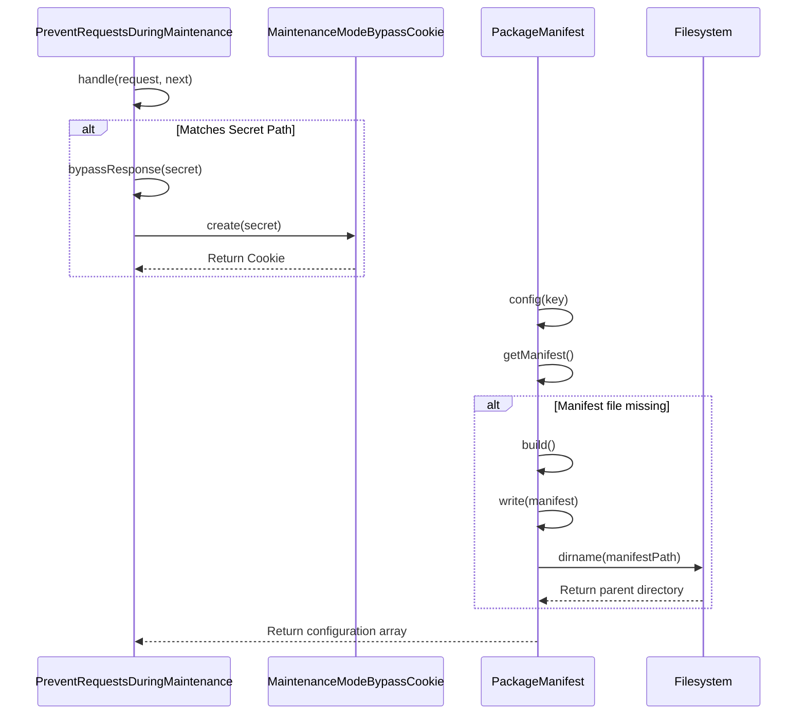
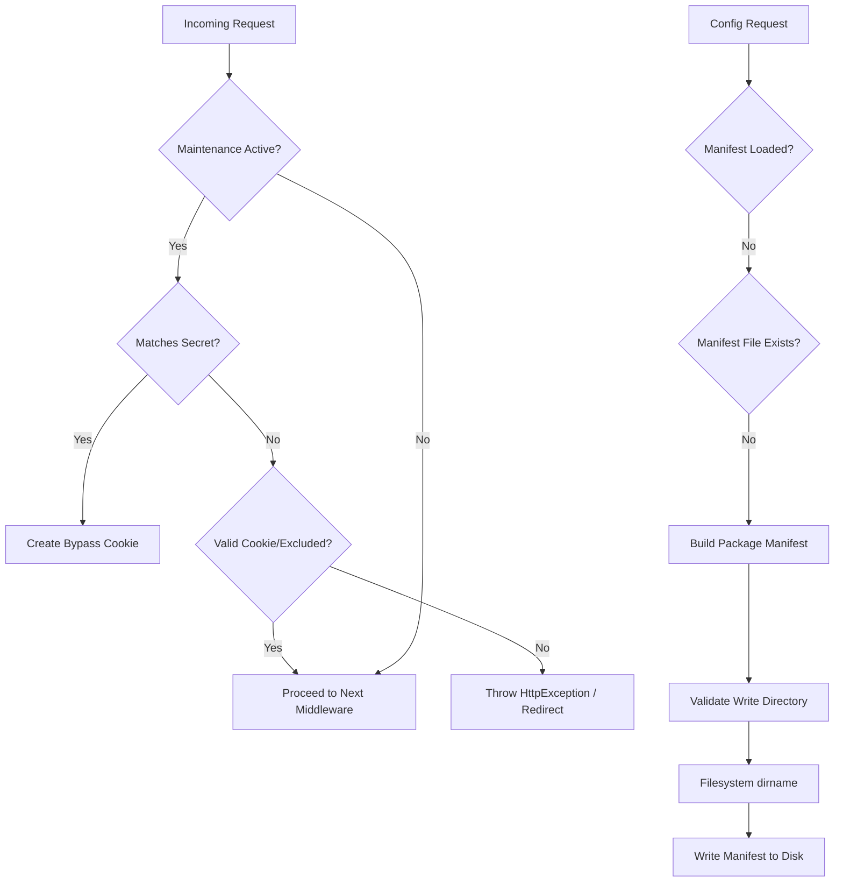

# Maintenance Mode File Check

Relevant source files

The following files were used as context for generating this wiki page:

- [src/Illuminate/Foundation/Http/Middleware/PreventRequestsDuringMaintenance.php](https://github.com/laravel/framework/blob/main/src/Illuminate/Foundation/Http/Middleware/PreventRequestsDuringMaintenance.php)
- [src/Illuminate/Foundation/Http/MaintenanceModeBypassCookie.php](https://github.com/laravel/framework/blob/main/src/Illuminate/Foundation/Http/MaintenanceModeBypassCookie.php)
- [src/Illuminate/Foundation/PackageManifest.php](https://github.com/laravel/framework/blob/main/src/Illuminate/Foundation/PackageManifest.php)
- [src/Illuminate/Filesystem/Filesystem.php](https://github.com/laravel/framework/blob/main/src/Illuminate/Filesystem/Filesystem.php)

## Overview

### Overview

The execution flow from `handle` through `dirname` covers key infrastructural components in Laravel, specifically bridging HTTP middleware request filtering, maintenance mode bypass validation, and package manifest discovery and disk-writing operations. When an application receives incoming traffic, maintenance mode middleware evaluates whether requests should be intercepted or allowed. Simultaneously, package discovery utilizes file management utilities to locate and persist package configurations. The interaction between these subsystems ensures that configuration caches and directory paths are safely verified and written using underlying filesystem abstractions.

Sources: [src/Illuminate/Foundation/Http/Middleware/PreventRequestsDuringMaintenance.php:58-110](https://github.com/laravel/framework/blob/main/src/Illuminate/Foundation/Http/Middleware/PreventRequestsDuringMaintenance.php#L58-L110), [src/Illuminate/Filesystem/Filesystem.php:417-420](https://github.com/laravel/framework/blob/main/src/Illuminate/Filesystem/Filesystem.php#L417-L420)

## Step-by-Step Execution Trace

### Step 1: `handle` in `PreventRequestsDuringMaintenance.php`

The execution begins when `PreventRequestsDuringMaintenance::handle` intercepts an incoming HTTP request. It checks if the current request path matches any explicitly excluded URIs. If active maintenance mode is detected, the middleware evaluates whether a secret bypass parameter has been provided or if a valid bypass cookie exists before returning a service unavailable response or redirecting the user.

Sources: [src/Illuminate/Foundation/Http/Middleware/PreventRequestsDuringMaintenance.php:58-110](https://github.com/laravel/framework/blob/main/src/Illuminate/Foundation/Http/Middleware/PreventRequestsDuringMaintenance.php#L58-L110)

### Step 2: `bypassResponse` in `PreventRequestsDuringMaintenance.php`

When a request matches the maintenance mode secret path, `bypassResponse` is invoked. This method generates a redirect response intended to send the user back to the application root while attaching a cryptographic bypass cookie.

Sources: [src/Illuminate/Foundation/Http/Middleware/PreventRequestsDuringMaintenance.php:135-140](https://github.com/laravel/framework/blob/main/src/Illuminate/Foundation/Http/Middleware/PreventRequestsDuringMaintenance.php#L135-L140)

### Step 3: `create` in `MaintenanceModeBypassCookie.php`

To construct the bypass cookie, `MaintenanceModeBypassCookie::create` calculates an expiration timestamp (12 hours in the future) and builds a JSON payload containing the expiration time and an HMAC-SHA256 MAC signature keyed against the maintenance secret. It returns a Symfony Cookie instance configured with path and domain settings.

Sources: [src/Illuminate/Foundation/Http/MaintenanceModeBypassCookie.php:16-24](https://github.com/laravel/framework/blob/main/src/Illuminate/Foundation/Http/MaintenanceModeBypassCookie.php#L16-L24)

### Step 4: `config` in `PackageManifest.php`

As part of application bootstrapping or configuration loading, the `PackageManifest::config` method is called to fetch specific configuration arrays (such as service providers or aliases) discovered across installed composer packages.

Sources: [src/Illuminate/Foundation/PackageManifest.php:88-94](https://github.com/laravel/framework/blob/main/src/Illuminate/Foundation/PackageManifest.php#L88-L94)

### Step 5: `getManifest` in `PackageManifest.php`

The `getManifest` method checks if the package manifest array is already loaded in memory. If the manifest file does not exist on disk at the designated path, it triggers the build routine to regenerate package discovery data.

Sources: [src/Illuminate/Foundation/PackageManifest.php:101-113](https://github.com/laravel/framework/blob/main/src/Illuminate/Foundation/PackageManifest.php#L101-L113)

### Step 6: `build` in `PackageManifest.php`

The `build` method inspects the Composer `installed.json` file to locate installed packages and their extra Laravel configuration parameters. It processes exclusions, filters out ignored packages, and prepares the final manifest array to be written to disk.

Sources: [src/Illuminate/Foundation/PackageManifest.php:120-139](https://github.com/laravel/framework/blob/main/src/Illuminate/Foundation/PackageManifest.php#L120-L139)

### Step 7: `write` in `PackageManifest.php`

The `write` method takes the compiled manifest array and attempts to persist it. Before replacing the file contents, it validates whether the target directory containing the manifest file exists and is writable, extracting the directory path using native PHP path helpers.

Sources: [src/Illuminate/Foundation/PackageManifest.php:176-185](https://github.com/laravel/framework/blob/main/src/Illuminate/Foundation/PackageManifest.php#L176-L185)

### Step 8: `dirname` in `Filesystem.php`

Finally, `Filesystem::dirname` acts as a thin wrapper around PHP's `pathinfo` function to extract the parent directory component from the given file path. This is invoked during validation checks to confirm directory accessibility.

Sources: [src/Illuminate/Filesystem/Filesystem.php:417-420](https://github.com/laravel/framework/blob/main/src/Illuminate/Filesystem/Filesystem.php#L417-L420)

## Sequence Diagram

Sources: [src/Illuminate/Foundation/Http/Middleware/PreventRequestsDuringMaintenance.php:58-140](https://github.com/laravel/framework/blob/main/src/Illuminate/Foundation/Http/Middleware/PreventRequestsDuringMaintenance.php#L58-L140), [src/Illuminate/Foundation/Http/MaintenanceModeBypassCookie.php:16-24](https://github.com/laravel/framework/blob/main/src/Illuminate/Foundation/Http/MaintenanceModeBypassCookie.php#L16-L24), [src/Illuminate/Foundation/PackageManifest.php:88-185](https://github.com/laravel/framework/blob/main/src/Illuminate/Foundation/PackageManifest.php#L88-L185), [src/Illuminate/Filesystem/Filesystem.php:417-420](https://github.com/laravel/framework/blob/main/src/Illuminate/Filesystem/Filesystem.php#L417-L420)

## Flowchart

Sources: [src/Illuminate/Foundation/Http/Middleware/PreventRequestsDuringMaintenance.php:58-110](https://github.com/laravel/framework/blob/main/src/Illuminate/Foundation/Http/Middleware/PreventRequestsDuringMaintenance.php#L58-L110), [src/Illuminate/Foundation/PackageManifest.php:88-185](https://github.com/laravel/framework/blob/main/src/Illuminate/Foundation/PackageManifest.php#L88-L185), [src/Illuminate/Filesystem/Filesystem.php:417-420](https://github.com/laravel/framework/blob/main/src/Illuminate/Filesystem/Filesystem.php#L417-L420)

## Key Observations

- **Cross-Module Boundaries:** The execution flow seamlessly connects HTTP request handling layers (`PreventRequestsDuringMaintenance`), cryptographic utilities (`MaintenanceModeBypassCookie`), package metadata discovery (`PackageManifest`), and low-level disk I/O (`Filesystem`).
- **Failure Handling & Exceptions:** 
  - Maintenance mode operations gracefully catch `ErrorException` instances in case underlying status files change mid-request.
  - Package manifest writing throws an explicit `Exception` if the target parent directory is missing or non-writable.
- **Performance Considerations:** Package manifest caching avoids recurring disk reads and JSON parsing overhead on subsequent requests once the manifest is loaded into memory or verified on disk.
