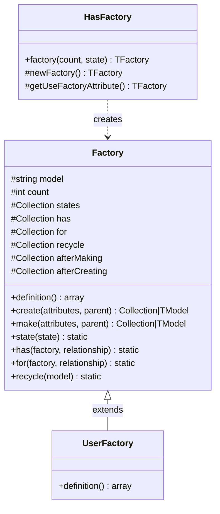
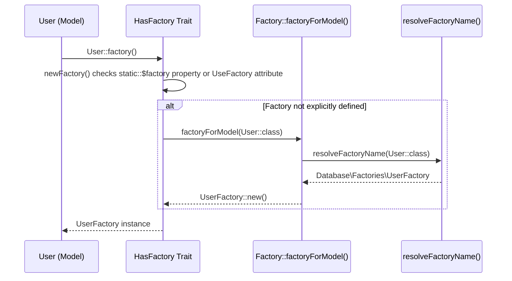
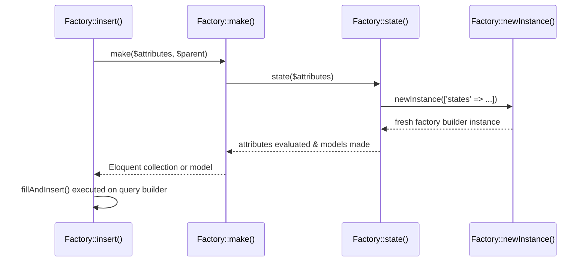
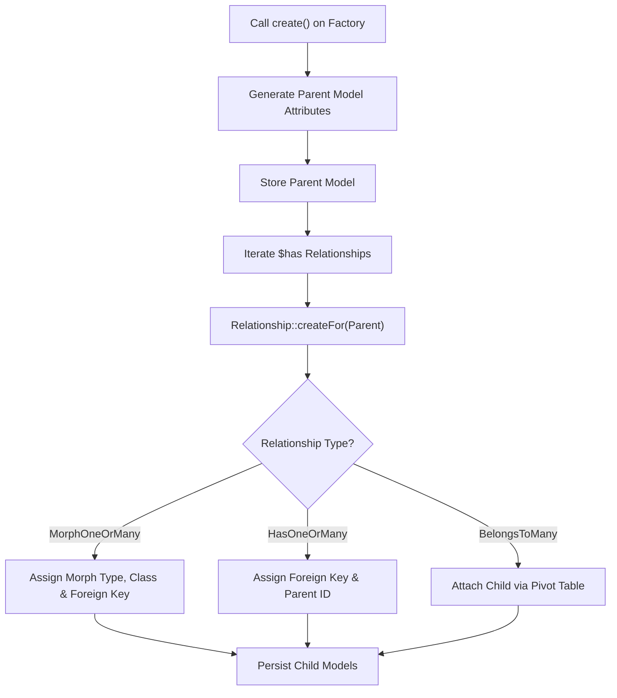

# Model Factories & Seeders

<details>
<summary>Relevant source files</summary>

The following files were used as context for generating this wiki page:

- [src/Illuminate/Database/Eloquent/Factories/Factory.php](https://github.com/laravel/framework/blob/main/src/Illuminate/Database/Eloquent/Factories/Factory.php)
- [types/Database/Eloquent/Factories/Factory.php](https://github.com/laravel/framework/blob/main/types/Database/Eloquent/Factories/Factory.php)
- [src/Illuminate/Foundation/Console/ModelMakeCommand.php](https://github.com/laravel/framework/blob/main/src/Illuminate/Foundation/Console/ModelMakeCommand.php)
- [src/Illuminate/Database/Console/Seeds/SeedCommand.php](https://github.com/laravel/framework/blob/main/src/Illuminate/Database/Console/Seeds/SeedCommand.php)
- [types/Database/Eloquent/Model.php](https://github.com/laravel/framework/blob/main/types/Database/Eloquent/Model.php)
- [src/Illuminate/Database/Eloquent/Factories/Relationship.php](https://github.com/laravel/framework/blob/main/src/Illuminate/Database/Eloquent/Factories/Relationship.php)
- [src/Illuminate/Database/DatabaseServiceProvider.php](https://github.com/laravel/framework/blob/main/src/Illuminate/Database/DatabaseServiceProvider.php)
- [src/Illuminate/Database/Console/Factories/FactoryMakeCommand.php](https://github.com/laravel/framework/blob/main/src/Illuminate/Database/Console/Factories/FactoryMakeCommand.php)
- [src/Illuminate/Foundation/Testing/DatabaseTruncation.php](https://github.com/laravel/framework/blob/main/src/Illuminate/Foundation/Testing/DatabaseTruncation.php)
- [src/Illuminate/Database/Eloquent/Factories/HasFactory.php](https://github.com/laravel/framework/blob/main/src/Illuminate/Database/Eloquent/Factories/HasFactory.php)
- [src/Illuminate/Database/Seeder.php](https://github.com/laravel/framework/blob/main/src/Illuminate/Database/Seeder.php)
- [src/Illuminate/Foundation/Testing/Concerns/InteractsWithDatabase.php](https://github.com/laravel/framework/blob/main/src/Illuminate/Foundation/Testing/Concerns/InteractsWithDatabase.php)
- [src/Illuminate/Database/Eloquent/Factories/BelongsToManyRelationship.php](https://github.com/laravel/framework/blob/main/src/Illuminate/Database/Eloquent/Factories/BelongsToManyRelationship.php)
- [src/Illuminate/Foundation/Testing/WithFaker.php](https://github.com/laravel/framework/blob/main/src/Illuminate/Foundation/Testing/WithFaker.php)
- [types/Autoload.php](https://github.com/laravel/framework/blob/main/types/Autoload.php)
- [src/Illuminate/Database/Eloquent/Attributes/UseFactory.php](https://github.com/laravel/framework/blob/main/src/Illuminate/Database/Eloquent/Attributes/UseFactory.php)
- [src/Illuminate/Foundation/Testing/Traits/CanConfigureMigrationCommands.php](https://github.com/laravel/framework/blob/main/src/Illuminate/Foundation/Testing/Traits/CanConfigureMigrationCommands.php)
- [src/Illuminate/Database/Eloquent/Factories/Sequence.php](https://github.com/laravel/framework/blob/main/src/Illuminate/Database/Eloquent/Factories/Sequence.php)
- [src/Illuminate/Foundation/Testing/Attributes/Seed.php](https://github.com/laravel/framework/blob/main/src/Illuminate/Foundation/Testing/Attributes/Seed.php)
- [src/Illuminate/Foundation/Testing/Attributes/Seeder.php](https://github.com/laravel/framework/blob/main/src/Illuminate/Foundation/Testing/Attributes/Seeder.php)
- [src/Illuminate/Database/Eloquent/Model.php](https://github.com/laravel/framework/blob/main/src/Illuminate/Database/Eloquent/Model.php)
</details>

## Overview

Model Factories and Database Seeders provide a robust programmatic architecture for generating, populating, and persisting mock or initial application data. In modern enterprise applications and testing suites, manual data setup is unmaintainable; the factory pattern abstracts Eloquent model generation, definition defaults, state transformations, and complex nested relationships, while seeders coordinate execution ordering and transaction safety across database populations.

By leveraging PHP attributes, container resolution, and fluent builder interfaces, factories bridge the gap between static model definitions and dynamic test assertions. Seeders integrate deeply with console commands and testing traits like `DatabaseTruncation`, ensuring reliable database states during feature testing and production deployment bootstrap routines.

Sources: [src/Illuminate/Database/Eloquent/Factories/Factory.php:30-1171](https://github.com/laravel/framework/blob/main/src/Illuminate/Database/Eloquent/Factories/Factory.php#L30-L1171), [src/Illuminate/Database/Seeder.php:12-193](https://github.com/laravel/framework/blob/main/src/Illuminate/Database/Seeder.php#L12-L193)

## Factory Architecture & Core API Surface

The abstract `Illuminate\Database\Eloquent\Factories\Factory` class serves as the foundation for all entity factories. It implements `Conditionable`, `ForwardsCalls`, and `Macroable`, allowing developers to chain conditional modifications, macro custom methods, and forward calls to underlying query builders.

Sources: [src/Illuminate/Database/Eloquent/Factories/Factory.php:30-35](https://github.com/laravel/framework/blob/main/src/Illuminate/Database/Eloquent/Factories/Factory.php#L30-L35)

Each concrete factory defines a `definition()` method returning an associative array of default attributes. Factories can be instantiated via static helpers such as `new()`, `times()`, or dynamically via the `HasFactory` trait integrated into Eloquent models.

Sources: [src/Illuminate/Database/Eloquent/Factories/Factory.php:202-228](https://github.com/laravel/framework/blob/main/src/Illuminate/Database/Eloquent/Factories/Factory.php#L202-L228), [src/Illuminate/Database/Eloquent/Factories/HasFactory.php:10-26](https://github.com/laravel/framework/blob/main/src/Illuminate/Database/Eloquent/Factories/HasFactory.php#L10-L26)



Sources: [src/Illuminate/Database/Eloquent/Factories/Factory.php:30-207](https://github.com/laravel/framework/blob/main/src/Illuminate/Database/Eloquent/Factories/Factory.php#L30-L207), [src/Illuminate/Database/Eloquent/Factories/HasFactory.php:10-62](https://github.com/laravel/framework/blob/main/src/Illuminate/Database/Eloquent/Factories/HasFactory.php#L10-L62)

## Model and Factory Name Resolution Mechanics

Factories and models discover each other automatically through naming conventions, attribute annotations, or manual resolver registrations. When a model uses the `HasFactory` trait, calling `User::factory()` executes `newFactory()` to locate the corresponding factory class.

Sources: [src/Illuminate/Database/Eloquent/Factories/HasFactory.php:19-26](https://github.com/laravel/framework/blob/main/src/Illuminate/Database/Eloquent/Factories/HasFactory.php#L19-L26)

Model name resolution within `Factory::modelName()` follows a precise fallback hierarchy:
1. Cached attribute reflection checking for `#[UseModel]` on the factory class.
2. The explicit `protected $model` property on the factory instance.
3. Custom model name resolvers registered via `Factory::guessModelNamesUsing()`.
4. The default namespace convention (`App\Models\{Basename}` or `App\{Basename}`).

Sources: [src/Illuminate/Database/Eloquent/Factories/Factory.php:949-986](https://github.com/laravel/framework/blob/main/src/Illuminate/Database/Eloquent/Factories/Factory.php#L949-L986)

Factory name resolution inside `Factory::resolveFactoryName()` transforms model class strings by stripping the application namespace and appending `Factory` within `Database\Factories\`.

Sources: [src/Illuminate/Database/Eloquent/Factories/Factory.php:1078-1091](https://github.com/laravel/framework/blob/main/src/Illuminate/Database/Eloquent/Factories/Factory.php#L1078-L1091), [src/Illuminate/Database/Eloquent/Attributes/UseFactory.php:7-18](https://github.com/laravel/framework/blob/main/src/Illuminate/Database/Eloquent/Attributes/UseFactory.php#L7-L18)



Sources: [src/Illuminate/Database/Eloquent/Factories/Factory.php:1018-1023](https://github.com/laravel/framework/blob/main/src/Illuminate/Database/Eloquent/Factories/Factory.php#L1018-L1023), [src/Illuminate/Database/Eloquent/Factories/HasFactory.php:19-40](https://github.com/laravel/framework/blob/main/src/Illuminate/Database/Eloquent/Factories/HasFactory.php#L19-L40)

## State Transformations and Sequences

Factories support modifying default attributes through named states, closure modifications, and sequences. The `state()` method appends transformations to the internal `$states` collection, while `prependState()` inserts high-priority modifications (such as foreign key bindings) to the front of the queue.

Sources: [src/Illuminate/Database/Eloquent/Factories/Factory.php:618-641](https://github.com/laravel/framework/blob/main/src/Illuminate/Database/Eloquent/Factories/Factory.php#L618-L641)

Sequences allow iterating through distinct sets of attribute arrays across generated model instances using the `Sequence` class.

Sources: [src/Illuminate/Database/Eloquent/Factories/Factory.php:656-687](https://github.com/laravel/framework/blob/main/src/Illuminate/Database/Eloquent/Factories/Factory.php#L656-L687), [src/Illuminate/Database/Eloquent/Factories/Sequence.php:7-39](https://github.com/laravel/framework/blob/main/src/Illuminate/Database/Eloquent/Factories/Sequence.php#L7-L39)

```php
use App\Models\User;

// Using sequences with factory generation
$users = User::factory()
    ->count(3)
    ->sequence(
        ['role' => 'admin'],
        ['role' => 'editor'],
        ['role' => 'subscriber']
    )
    ->create();
```

Sources: [src/Illuminate/Database/Eloquent/Factories/Factory.php:661-664](https://github.com/laravel/framework/blob/main/src/Illuminate/Database/Eloquent/Factories/Factory.php#L661-L64), [src/Illuminate/Database/Eloquent/Factories/Sequence.php:35-63](https://github.com/laravel/framework/blob/main/src/Illuminate/Database/Eloquent/Factories/Sequence.php#L35-L63)

> [!NOTE]
> The `Sequence` class implements `Countable` and uses modulo arithmetic (`$this->index % $this->count`) inside its `__invoke` method to cycle through sequence items indefinitely when generating batches larger than the sequence definition.

Sources: [src/Illuminate/Database/Eloquent/Factories/Sequence.php:7-63](https://github.com/laravel/framework/blob/main/src/Illuminate/Database/Eloquent/Factories/Sequence.php#L7-L63)

## Call-Chain Execution Walkthrough: Insert & Instance Creation

When performing bulk inserts or generating single model instances via factories, execution follows a well-defined sequence of calls. Tracing the `insert()` execution path illustrates how model creation transitions from state composition to raw database persistence:

1. `insert()` is invoked on a factory instance with optional attributes or a parent model.
2. It delegates to `make()` to generate hydrated model instances.
3. `make()` invokes `state()` to merge registered state transformations and default attributes.
4. Finally, `newInstance()` initializes the concrete model instance using `new static(...)` with merged arguments.

Sources: [src/Illuminate/Database/Eloquent/Factories/Factory.php:488-510](https://github.com/laravel/framework/blob/main/src/Illuminate/Database/Eloquent/Factories/Factory.php#L488-L510), [src/Illuminate/Database/Eloquent/Factories/Factory.php:918-933](https://github.com/laravel/framework/blob/main/src/Illuminate/Database/Eloquent/Factories/Factory.php#L918-L933)



Sources: [src/Illuminate/Database/Eloquent/Factories/Factory.php:488-510](https://github.com/laravel/framework/blob/main/src/Illuminate/Database/Eloquent/Factories/Factory.php#L488-L510), [src/Illuminate/Database/Eloquent/Factories/Factory.php:918-933](https://github.com/laravel/framework/blob/main/src/Illuminate/Database/Eloquent/Factories/Factory.php#L918-L933)

## Relationship Definition: Child, Parent, and Attached Models

Factories manage entity graphs by defining parent (`for`), child (`has`), and many-to-many (`hasAttached`) relationships.

Sources: [src/Illuminate/Database/Eloquent/Factories/Factory.php:689-763](https://github.com/laravel/framework/blob/main/src/Illuminate/Database/Eloquent/Factories/Factory.php#L689-L763)

When a child relationship is persisted via `Relationship::createFor()`, the parent's primary key and foreign key constraints are injected into the child factory state. For polymorphic relations, `getMorphType()` and `getMorphClass()` are automatically resolved and assigned.

Sources: [src/Illuminate/Database/Eloquent/Factories/Relationship.php:44-62](https://github.com/laravel/framework/blob/main/src/Illuminate/Database/Eloquent/Factories/Relationship.php#L44-L62)



Sources: [src/Illuminate/Database/Eloquent/Factories/Factory.php:387-404](https://github.com/laravel/framework/blob/main/src/Illuminate/Database/Eloquent/Factories/Factory.php#L387-L404), [src/Illuminate/Database/Eloquent/Factories/Relationship.php:44-62](https://github.com/laravel/framework/blob/main/src/Illuminate/Database/Eloquent/Factories/Relationship.php#L44-L62)

## Database Seeders and Execution Coordination

Database seeders orchestrate initial data populations through the `Illuminate\Database\Seeder` base class. Seeders are executed via the `db:seed` console command (`SeedCommand`) or within testing traits.

Sources: [src/Illuminate/Database/Seeder.php:12-27](https://github.com/laravel/framework/blob/main/src/Illuminate/Database/Seeder.php#L12-L27), [src/Illuminate/Database/Console/Seeds/SeedCommand.php:14-16](https://github.com/laravel/framework/blob/main/src/Illuminate/Database/Console/Seeds/SeedCommand.php#L14-L16)

The `Seeder` class provides methods for calling other seeders with runtime arguments or tracking single executions:
- `call($class, $silent, $parameters)`: Executes one or more seeder classes sequentially, rendering execution timing via console UI components.
- `callOnce($class, $silent)`: Executes a seeder only if it has not already been invoked during the current execution lifecycle (tracked via static `::$called`).
- `callSilent($class)`: Executes a seeder without printing console output details.

Sources: [src/Illuminate/Database/Seeder.php:43-118](https://github.com/laravel/framework/blob/main/src/Illuminate/Database/Seeder.php#L43-L118)

> [!WARNING]
> When `SeedCommand::handle()` executes, it wraps seeder invocation inside `Model::unguarded()`, temporarily disabling mass-assignment protection across all Eloquent models during the seeding process.

Sources: [src/Illuminate/Database/Console/Seeds/SeedCommand.php:57-73](https://github.com/laravel/framework/blob/main/src/Illuminate/Database/Console/Seeds/SeedCommand.php#L57-L73)

## Database Testing Integration and Truncation

Testing traits like `DatabaseTruncation` and `RefreshDatabase` interact directly with seeders and migration commands to ensure clean testing environments.

Sources: [src/Illuminate/Foundation/Testing/DatabaseTruncation.php:11-14](https://github.com/laravel/framework/blob/main/src/Illuminate/Foundation/Testing/DatabaseTruncation.php#L11-L14)

The `DatabaseTruncation` trait checks `RefreshDatabaseState::$migrated` on initial test execution to run `migrate:fresh`. On subsequent tests, it truncates all configured tables while bypassing foreign key constraints via schema builders.

Sources: [src/Illuminate/Foundation/Testing/DatabaseTruncation.php:27-54](https://github.com/laravel/framework/blob/main/src/Illuminate/Foundation/Testing/DatabaseTruncation.php#L27-L54)

```php
namespace Tests\Feature;

use Illuminate\Foundation\Testing\DatabaseTruncation;
use Illuminate\Foundation\Testing\Attributes\Seeder;
use Tests\TestCase;
use Database\Seeders\UserSeeder;

#[Seeder(UserSeeder::class)]
class UserTest extends TestCase
{
    use DatabaseTruncation;

    public function test_users_can_be_listed()
    {
        $this->assertDatabaseCount('users', 5);
    }
}
```

Sources: [src/Illuminate/Foundation/Testing/DatabaseTruncation.php:27-54](https://github.com/laravel/framework/blob/main/src/Illuminate/Foundation/Testing/DatabaseTruncation.php#L27-L54), [src/Illuminate/Foundation/Testing/Traits/CanConfigureMigrationCommands.php:72-85](https://github.com/laravel/framework/blob/main/src/Illuminate/Foundation/Testing/Traits/CanConfigureMigrationCommands.php#L72-L85)

## Console Generators: Models, Factories, and Seeders

The framework provides console commands to scaffold models along with their corresponding testing and seeding infrastructure. `ModelMakeCommand` inspects input options to conditionally generate matching factories, seeders, migrations, controllers, form requests, and policies.

Sources: [src/Illuminate/Foundation/Console/ModelMakeCommand.php:18-93](https://github.com/laravel/framework/blob/main/src/Illuminate/Foundation/Console/ModelMakeCommand.php#L18-L93)

| Console Command | Description | Key Options |
| :--- | :--- | :--- |
| `make:model` | Create a new Eloquent model class | `--factory` (`-f`), `--seed` (`-s`), `--migration` (`-m`), `--all` (`-a`), `--pivot` |
| `make:factory` | Create a new model factory class | `--model` (`-m`) |
| `make:seeder` | Create a new database seeder class | None |
| `db:seed` | Seed the database with records | `--class`, `--database`, `--force` |

Sources: [src/Illuminate/Foundation/Console/ModelMakeCommand.php:28-35](https://github.com/laravel/framework/blob/main/src/Illuminate/Foundation/Console/ModelMakeCommand.php#L28-L35), [src/Illuminate/Database/Console/Factories/FactoryMakeCommand.php:19-26](https://github.com/laravel/framework/blob/main/src/Illuminate/Database/Console/Factories/FactoryMakeCommand.php#L19-L26), [src/Illuminate/Database/Console/Seeds/SeedCommand.php:24-32](https://github.com/laravel/framework/blob/main/src/Illuminate/Database/Console/Seeds/SeedCommand.php#L24-L32)

## Design Trade-offs & Architecture Decisions

| Design Choice | Benefit | Cost |
| :--- | :--- | :--- |
| **Static & Attribute Name Resolution** | Eliminates manual string mapping between models and factories; enables zero-configuration convention over configuration. | Reflection overhead when resolving class attributes for the first time before caching. |
| **Model Unguarding in Factories & Seeders** | Streamlines mock data generation without requiring explicit `$fillable` declarations on every test model. | Bypasses mass-assignment safeguards if factory definitions inadvertently pass unintended user input. |
| **Deferred Relationship Closures (`parentResolvers`)** | Prevents premature database queries during attribute definition evaluation until persistence is invoked. | Adds complexity to stack traces when debugging evaluation errors within nested attribute closures. |

Sources: [src/Illuminate/Database/Eloquent/Factories/Factory.php:547-573](https://github.com/laravel/framework/blob/main/src/Illuminate/Database/Eloquent/Factories/Factory.php#L547-L573), [src/Illuminate/Database/Eloquent/Factories/Factory.php:949-986](https://github.com/laravel/framework/blob/main/src/Illuminate/Database/Eloquent/Factories/Factory.php#L949-L986), [src/Illuminate/Database/Console/Seeds/SeedCommand.php:70-72](https://github.com/laravel/framework/blob/main/src/Illuminate/Database/Console/Seeds/SeedCommand.php#L70-L72)

## Related

- [[Eloquent Models]]
- [[Database Testing & Fakes]]

