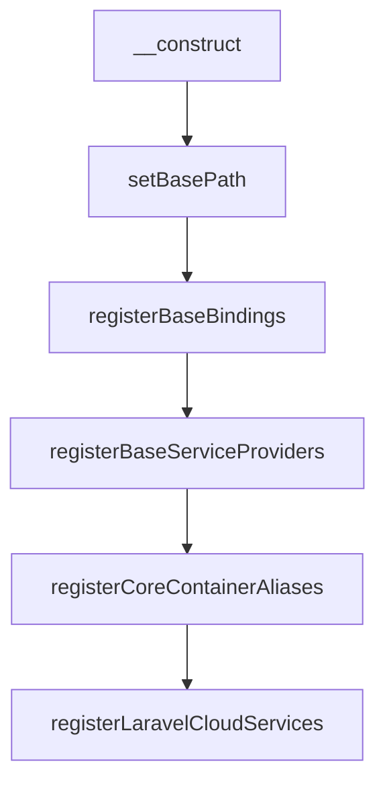
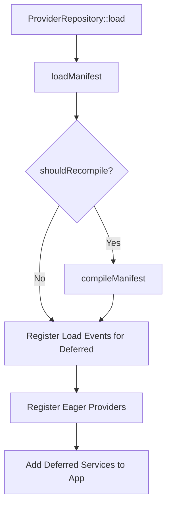

# Overview

<details>
<summary>Relevant source files</summary>

The following files were used as context for generating this wiki page:

- [src/Illuminate/Foundation/Application.php](https://github.com/laravel/framework/blob/main/src/Illuminate/Foundation/Application.php)
- [src/Illuminate/Foundation/Http/Kernel.php](https://github.com/laravel/framework/blob/main/src/Illuminate/Foundation/Http/Kernel.php)
- [src/Illuminate/Foundation/Providers/FoundationServiceProvider.php](https://github.com/laravel/framework/blob/main/src/Illuminate/Foundation/Providers/FoundationServiceProvider.php)
- [composer.json](https://github.com/laravel/framework/blob/main/composer.json)
- [src/Illuminate/Routing/RoutingServiceProvider.php](https://github.com/laravel/framework/blob/main/src/Illuminate/Routing/RoutingServiceProvider.php)
- [src/Illuminate/Foundation/Configuration/ApplicationBuilder.php](https://github.com/laravel/framework/blob/main/src/Illuminate/Foundation/Configuration/ApplicationBuilder.php)
- [src/Illuminate/Foundation/helpers.php](https://github.com/laravel/framework/blob/main/src/Illuminate/Foundation/helpers.php)
- [src/Illuminate/Support/Facades/Facade.php](https://github.com/laravel/framework/blob/main/src/Illuminate/Support/Facades/Facade.php)
- [README.md](https://github.com/laravel/framework/blob/main/README.md)
- [src/Illuminate/Foundation/ProviderRepository.php](https://github.com/laravel/framework/blob/main/src/Illuminate/Foundation/ProviderRepository.php)
- [src/Illuminate/Foundation/Providers/ArtisanServiceProvider.php](https://github.com/laravel/framework/blob/main/src/Illuminate/Foundation/Providers/ArtisanServiceProvider.php)
- [src/Illuminate/Database/README.md](https://github.com/laravel/framework/blob/main/src/Illuminate/Database/README.md)
- [src/Illuminate/Queue/README.md](https://github.com/laravel/framework/blob/main/src/Illuminate/Queue/README.md)
- [src/Illuminate/Contracts/Http/Kernel.php](https://github.com/laravel/framework/blob/main/src/Illuminate/Contracts/Http/Kernel.php)
- [src/Illuminate/Container/composer.json](https://github.com/laravel/framework/blob/main/src/Illuminate/Container/composer.json)
- [src/Illuminate/Support/Facades/App.php](https://github.com/laravel/framework/blob/main/src/Illuminate/Support/Facades/App.php)
</details>

## Overview

The Laravel application foundation acts as the core orchestration layer of the framework, providing the central container instance, lifecycle management, service provider bootstrapping, and HTTP request pipeline coordination required to run robust web applications and console commands.

Sources: [src/Illuminate/Foundation/Application.php:39-40](https://github.com/laravel/framework/blob/main/src/Illuminate/Foundation/Application.php#L39-L40), [src/Illuminate/Foundation/Http/Kernel.php:20-21](https://github.com/laravel/framework/blob/main/src/Illuminate/Foundation/Http/Kernel.php#L20-L21)

## Application Container and Core Bindings

### Application Instantiation and Container Inheritance

The Laravel application instance (`Illuminate\Foundation\Application`) extends the core service container (`Illuminate\Container\Container`), inheriting its dependency injection, binding resolution, and singleton management capabilities while adding framework-specific paths, environment detection, and core service bindings. When instantiated through `new Application($basePath)` or configured via `Application::configure($basePath)`, the constructor executes an explicit sequence of setup routines: `setBasePath()`, `registerBaseBindings()`, `registerBaseServiceProviders()`, `registerCoreContainerAliases()`, and `registerLaravelCloudServices()`.

Sources: [src/Illuminate/Foundation/Application.php:39-40](https://github.com/laravel/framework/blob/main/src/Illuminate/Foundation/Application.php#L39-L40), [src/Illuminate/Foundation/Application.php:223-233](https://github.com/laravel/framework/blob/main/src/Illuminate/Foundation/Application.php#L223-L233)



Sources: [src/Illuminate/Foundation/Application.php:223-233](https://github.com/laravel/framework/blob/main/src/Illuminate/Foundation/Application.php#L223-L233)

> [!NOTE]
> If `$basePath` is omitted during static configuration, Laravel automatically infers it by inspecting `ClassLoader::getRegisteredLoaders()` or checking `$_ENV['APP_BASE_PATH']` and `$_SERVER['APP_BASE_PATH']`.

Sources: [src/Illuminate/Foundation/Application.php:241-270](https://github.com/laravel/framework/blob/main/src/Illuminate/Foundation/Application.php#L241-L270)

### Path Bindings and Container Registration

Setting the base path triggers `bindPathsInContainer()`, which registers core directory paths as singleton instances within the container. Developers can override these directory paths dynamically using dedicated configuration methods.

Sources: [src/Illuminate/Foundation/Application.php:408-443](https://github.com/laravel/framework/blob/main/src/Illuminate/Foundation/Application.php#L408-L443)

| Container Key | Default Location | Setter Method |
| :--- | :--- | :--- |
| `path` | `{basePath}/app` | `useAppPath($path)` |
| `path.base` | `{basePath}` | `setBasePath($path)` |
| `path.bootstrap` | `{basePath}/bootstrap` or `{basePath}/.laravel` | `useBootstrapPath($path)` |
| `path.config` | `{basePath}/config` | `useConfigPath($path)` |
| `path.database` | `{basePath}/database` | `useDatabasePath($path)` |
| `path.lang` | `{basePath}/lang` or `{basePath}/resources/lang` | `useLangPath($path)` |
| `path.public` | `{basePath}/public` | `usePublicPath($path)` |
| `path.storage` | `{basePath}/storage` (or `LARAVEL_STORAGE_PATH` env) | `useStoragePath($path)` |
| `path.resources` | `{basePath}/resources` | — |

Sources: [src/Illuminate/Foundation/Application.php:423-443](https://github.com/laravel/framework/blob/main/src/Illuminate/Foundation/Application.php#L423-L443), [src/Illuminate/Foundation/Application.php:462-654](https://github.com/laravel/framework/blob/main/src/Illuminate/Foundation/Application.php#L462-L654)

> [!TIP]
> Storage path resolution checks `$_ENV['LARAVEL_STORAGE_PATH']` and `$_SERVER['LARAVEL_STORAGE_PATH']` before falling back to `{basePath}/storage`, allowing seamless environment-level overrides for containerized deployments.

Sources: [src/Illuminate/Foundation/Application.php:630-639](https://github.com/laravel/framework/blob/main/src/Illuminate/Foundation/Application.php#L630-L639)

### Core Service Provider Inheritance and Base Bindings

During `registerBaseServiceProviders()`, the application registers four fundamental service providers in an explicit sequence: `EventServiceProvider`, `LogServiceProvider`, `ContextServiceProvider`, and `RoutingServiceProvider`. Simultaneously, `registerBaseBindings()` binds `app`, `Illuminate\Container\Container`, `Mix`, and `PackageManifest` into the container.

Sources: [src/Illuminate/Foundation/Application.php:287-312](https://github.com/laravel/framework/blob/main/src/Illuminate/Foundation/Application.php#L287-L312)

Core container aliases map shorthand strings to their fully-qualified concrete implementations and contracts. For instance, `'files'` maps to `Illuminate\Filesystem\Filesystem::class`, while `'log'` maps to `Illuminate\Log\LogManager::class` and `Psr\Log\LoggerInterface::class`.

Sources: [src/Illuminate/Foundation/Application.php:1643-1691](https://github.com/laravel/framework/blob/main/src/Illuminate/Foundation/Application.php#L1643-L1691)

## Service Provider Registration and Bootstrapping

### Overview

Service providers constitute the primary mechanism for bootstrapping all Laravel application components, core services, and third-party packages. The `ProviderRepository` manages service provider discovery, manifest compilation, and deferred provider registration by persisting provider states to a manifest JSON or PHP return file. When service configurations change or providers are added, the repository re-evaluates the manifest to determine whether recompilation is required.

Sources: [src/Illuminate/Foundation/ProviderRepository.php:33-78](https://github.com/laravel/framework/blob/main/src/Illuminate/Foundation/ProviderRepository.php#L33-L78)



Sources: [src/Illuminate/Foundation/ProviderRepository.php:52-78](https://github.com/laravel/framework/blob/main/src/Illuminate/Foundation/ProviderRepository.php#L52-L78)

### Manifest Compilation and Deferred Resolution

When the application boots, `ProviderRepository::load()` inspects the existing service manifest via `loadManifest()`. If the file does not exist or the registered provider array differs from the compiled manifest, `compileManifest()` iterates through each provider, instantiating them to inspect whether they implement deferred loading via `isDeferred()`.

Sources: [src/Illuminate/Foundation/ProviderRepository.php:52-163](https://github.com/laravel/framework/blob/main/src/Illuminate/Foundation/ProviderRepository.php#L52-L163)

For deferred service providers such as `ArtisanServiceProvider`, the repository extracts provided services via `provides()` and loading trigger events via `when()`, recording them in the manifest's `deferred` and `when` mapping arrays. Eager providers are grouped under the `eager` array and registered immediately.

Sources: [src/Illuminate/Foundation/ProviderRepository.php:140-160](https://github.com/laravel/framework/blob/main/src/Illuminate/Foundation/ProviderRepository.php#L140-L160), [src/Illuminate/Foundation/Providers/ArtisanServiceProvider.php:120-121](https://github.com/laravel/framework/blob/main/src/Illuminate/Foundation/Providers/ArtisanServiceProvider.php#L120-L121)

> [!NOTE]
> Writing the compiled manifest verifies that the parent directory of the manifest path is writable before replacing the file contents using `Filesystem::replace()`.

Sources: [src/Illuminate/Foundation/ProviderRepository.php:184-195](https://github.com/laravel/framework/blob/main/src/Illuminate/Foundation/ProviderRepository.php#L184-L195)

### Built-in Framework Service Providers

Laravel utilizes specialized aggregate and concrete service providers to register underlying routing mechanisms, container singletons, and console commands. For instance, `FoundationServiceProvider` aggregates the `FormRequestServiceProvider` and `ParallelTestingServiceProvider`, while registering vital singletons and request macros.

Sources: [src/Illuminate/Foundation/Providers/FoundationServiceProvider.php:39-59](https://github.com/laravel/framework/blob/main/src/Illuminate/Foundation/Providers/FoundationServiceProvider.php#L39-L59)

| Service Provider | Base Class / Interface | Key Responsibilities |
| :--- | :--- | :--- |
| `FoundationServiceProvider` | `AggregateServiceProvider` | Registers console schedules, var dumpers, request validation macros, exception renderers, and maintenance mode managers. |
| `RoutingServiceProvider` | `ServiceProvider` | Binds the router, URL generator, redirector, PSR-7 HTTP factory requests/responses, and controller dispatchers. |
| `ArtisanServiceProvider` | `ServiceProvider` (implements `DeferrableProvider`) | Registers core framework Artisan commands and development generators into the container. |

Sources: [src/Illuminate/Foundation/Providers/FoundationServiceProvider.php:39-99](https://github.com/laravel/framework/blob/main/src/Illuminate/Foundation/Providers/FoundationServiceProvider.php#L39-L99), [src/Illuminate/Routing/RoutingServiceProvider.php:17-34](https://github.com/laravel/framework/blob/main/src/Illuminate/Routing/RoutingServiceProvider.php#L17-L34), [src/Illuminate/Foundation/Providers/ArtisanServiceProvider.php:120-259](https://github.com/laravel/framework/blob/main/src/Illuminate/Foundation/Providers/ArtisanServiceProvider.php#L120-L259)

> [!WARNING]
> Resolving PSR-7 request or response bindings via `RoutingServiceProvider` will throw a `BindingResolutionException` if the `symfony/psr-http-message-bridge` package is missing from the environment.

Sources: [src/Illuminate/Routing/RoutingServiceProvider.php:133-171](https://github.com/laravel/framework/blob/main/src/Illuminate/Routing/RoutingServiceProvider.php#L133-L171)

## HTTP Request Handling and Pipeline

### Overview

The `Illuminate\Foundation\Http\Kernel` class implements the `Illuminate\Contracts\Http\Kernel` interface to process incoming HTTP requests, managing the request lifecycle from initialization and middleware pipeline routing to exception reporting, rendering, and final event dispatching.

Sources: [src/Illuminate/Foundation/Http/Kernel.php:7-21](https://github.com/laravel/framework/blob/main/src/Illuminate/Foundation/Http/Kernel.php#L7-L21), [src/Illuminate/Contracts/Http/Kernel.php:5-37](https://github.com/laravel/framework/blob/main/src/Illuminate/Contracts/Http/Kernel.php#L5-L37)

### Request Execution Walkthrough

When an incoming request arrives, `Kernel::handle($request)` initiates tracking and delegates execution through a sequence of internal steps:

```
Kernel::handle($request) -> Kernel::sendRequestThroughRouter($request) -> Kernel::bootstrap() -> Pipeline::send() -> Router::dispatch()
```

Sources: [src/Illuminate/Foundation/Http/Kernel.php:137-176](https://github.com/laravel/framework/blob/main/src/Illuminate/Foundation/Http/Kernel.php#L137-L176)

1. **Initialization:** `handle()` records the start time via `Carbon::now()` and enables HTTP method parameter overrides on the request.

Sources: [src/Illuminate/Foundation/Http/Kernel.php:137-144](https://github.com/laravel/framework/blob/main/src/Illuminate/Foundation/Http/Kernel.php#L137-L144)

2. **Router Transport:** `sendRequestThroughRouter()` binds the request instance into the container, clears resolved facade instances, and triggers `bootstrap()`.

Sources: [src/Illuminate/Foundation/Http/Kernel.php:164-171](https://github.com/laravel/framework/blob/main/src/Illuminate/Foundation/Http/Kernel.php#L164-L171)

3. **Pipeline Dispatch:** A new `Illuminate\Routing\Pipeline` instance sends the request through global middleware (unless `shouldSkipMiddleware()` evaluates to true) before resolving via `dispatchToRouter()`.

Sources: [src/Illuminate/Foundation/Http/Kernel.php:172-176](https://github.com/laravel/framework/blob/main/src/Illuminate/Foundation/Http/Kernel.php#L172-L176)

4. **Exception Handling & Events:** Uncaught `Throwable` instances are caught, reported to the exception handler, and rendered into a response. Once completed, a `RequestHandled` event is dispatched.

Sources: [src/Illuminate/Foundation/Http/Kernel.php:141-155](https://github.com/laravel/framework/blob/main/src/Illuminate/Foundation/Http/Kernel.php#L141-L155)

> [!NOTE]
> The kernel bootstraps its environment lazily via `bootstrap()`, checking `Application::hasBeenBootstrapped()` before executing the core bootstrapper classes.

Sources: [src/Illuminate/Foundation/Http/Kernel.php:183-188](https://github.com/laravel/framework/blob/main/src/Illuminate/Foundation/Http/Kernel.php#L183-L188)

### Core Bootstrappers and Middleware Priority

The kernel defines an immutable array of bootstrapper classes executed during application startup, alongside default middleware priority ordering.

Sources: [src/Illuminate/Foundation/Http/Kernel.php:39-50](https://github.com/laravel/framework/blob/main/src/Illuminate/Foundation/Http/Kernel.php#L39-L50), [src/Illuminate/Foundation/Http/Kernel.php:103-115](https://github.com/laravel/framework/blob/main/src/Illuminate/Foundation/Http/Kernel.php#L103-L115)

| Bootstrapper Class | Action Performed During Request Startup | Sources |
| :--- | :--- | :--- |
| `LoadEnvironmentVariables` | Loads `.env` configuration variables into the environment. | [src/Illuminate/Foundation/Http/Kernel.php:44](https://github.com/laravel/framework/blob/main/src/Illuminate/Foundation/Http/Kernel.php#L44) |
| `LoadConfiguration` | Loads application configuration files into the container repository. | [src/Illuminate/Foundation/Http/Kernel.php:45](https://github.com/laravel/framework/blob/main/src/Illuminate/Foundation/Http/Kernel.php#L45) |
| `HandleExceptions` | Sets up PHP error handlers, exception handlers, and deprecation logs. | [src/Illuminate/Foundation/Http/Kernel.php:46](https://github.com/laravel/framework/blob/main/src/Illuminate/Foundation/Http/Kernel.php#L46) |
| `RegisterFacades` | Registers framework facades and class aliases. | [src/Illuminate/Foundation/Http/Kernel.php:47](https://github.com/laravel/framework/blob/main/src/Illuminate/Foundation/Http/Kernel.php#L47) |
| `RegisterProviders` | Registers all service providers configured in the application. | [src/Illuminate/Foundation/Http/Kernel.php:48](https://github.com/laravel/framework/blob/main/src/Illuminate/Foundation/Http/Kernel.php#L48) |
| `BootProviders` | Calls the `boot` method on all registered service providers. | [src/Illuminate/Foundation/Http/Kernel.php:49](https://github.com/laravel/framework/blob/main/src/Illuminate/Foundation/Http/Kernel.php#L49) |

Sources: [src/Illuminate/Foundation/Http/Kernel.php:43-50](https://github.com/laravel/framework/blob/main/src/Illuminate/Foundation/Http/Kernel.php#L43-L50)

> [!WARNING]
> Middleware added or modified dynamically via `prependMiddlewareToGroup()`, `appendMiddlewareToGroup()`, or priority adjustment methods immediately triggers `syncMiddlewareToRouter()` to synchronize state changes with the underlying router instance.

Sources: [src/Illuminate/Foundation/Http/Kernel.php:380-417](https://github.com/laravel/framework/blob/main/src/Illuminate/Foundation/Http/Kernel.php#L380-L417), [src/Illuminate/Foundation/Http/Kernel.php:521-532](https://github.com/laravel/framework/blob/main/src/Illuminate/Foundation/Http/Kernel.php#L521-L532)

## Application Building and Runtime Configuration

### Overview
The `ApplicationBuilder` class coordinates application runtime configuration by providing fluent methods for registering kernels, service providers, routing, middleware, and Artisan commands. Execution flows through specific container resolution phases when the application builds and boots.

Sources: [src/Illuminate/Foundation/Configuration/ApplicationBuilder.php:25-531](https://github.com/laravel/framework/blob/main/src/Illuminate/Foundation/Configuration/ApplicationBuilder.php#L25-L531)

### Routing and Middleware Configuration
The `withRouting()` method registers web, API, health check, command, channel, and Folio page routes by evaluating input arguments and invoking `buildRoutingCallback()`. If string parameters are passed for web or API routes, `ApplicationBuilder` instantiates a closure that registers route groups with respective middleware (`web` or `api`) and API prefixes.

Sources: [src/Illuminate/Foundation/Configuration/ApplicationBuilder.php:142-279](https://github.com/laravel/framework/blob/main/src/Illuminate/Foundation/Configuration/ApplicationBuilder.php#L142-L279)

> [!WARNING]
> When a health check endpoint string is provided to `withRouting()`, `PreventRequestsDuringMaintenance::except($health)` is automatically invoked so the health route remains accessible while the application is in maintenance mode.

Sources: [src/Illuminate/Foundation/Configuration/ApplicationBuilder.php:168-170](https://github.com/laravel/framework/blob/main/src/Illuminate/Foundation/Configuration/ApplicationBuilder.php#L168-L170)

Middleware configuration is handled via `withMiddleware()`, which registers an `afterResolving` callback on the `HttpKernel` interface. This callback instantiates a `Middleware` configuration instance, applies user-defined modifications, and syncs global middleware, middleware groups, aliases, and priority arrays to the kernel.

Sources: [src/Illuminate/Foundation/Configuration/ApplicationBuilder.php:287-326](https://github.com/laravel/framework/blob/main/src/Illuminate/Foundation/Configuration/ApplicationBuilder.php#L287-L326)

### Application Builder Methods Reference

| Method Signature | Action Performed | Sources |
| :--- | :--- | :--- |
| `withKernels()` | Binds HTTP and Console kernel contracts to concrete implementations as singletons. | [src/Illuminate/Foundation/Configuration/ApplicationBuilder.php:60-73](https://github.com/laravel/framework/blob/main/src/Illuminate/Foundation/Configuration/ApplicationBuilder.php#L60-L73) |
| `withProviders(array $providers, bool $withBootstrapProviders)` | Merges custom service providers and optional bootstrap provider paths. | [src/Illuminate/Foundation/Configuration/ApplicationBuilder.php:82-92](https://github.com/laravel/framework/blob/main/src/Illuminate/Foundation/Configuration/ApplicationBuilder.php#L82-L92) |
| `withEvents(iterable\|bool $discover)` | Configures event discovery paths and registers the core event service provider. | [src/Illuminate/Foundation/Configuration/ApplicationBuilder.php:100-119](https://github.com/laravel/framework/blob/main/src/Illuminate/Foundation/Configuration/ApplicationBuilder.php#L100-L119) |
| `withBroadcasting(string $channels, array $attributes)` | Registers broadcast routes and requires the specified channel authorization file upon booting. | [src/Illuminate/Foundation/Configuration/ApplicationBuilder.php:128-139](https://github.com/laravel/framework/blob/main/src/Illuminate/Foundation/Configuration/ApplicationBuilder.php#L128-L139) |
| `withRouting(...)` | Registers web, API, pages, health, and command paths using an underlying route service provider. | [src/Illuminate/Foundation/Configuration/ApplicationBuilder.php:155-188](https://github.com/laravel/framework/blob/main/src/Illuminate/Foundation/Configuration/ApplicationBuilder.php#L155-L188) |
| `withMiddleware(?callable $callback)` | Configures global middleware, groups, priorities, and aliases after resolving the HTTP kernel. | [src/Illuminate/Foundation/Configuration/ApplicationBuilder.php:287-326](https://github.com/laravel/framework/blob/main/src/Illuminate/Foundation/Configuration/ApplicationBuilder.php#L287-L326) |
| `withCommands(array $commands)` | Partitions and registers Artisan command classes, files, and route paths on the console kernel. | [src/Illuminate/Foundation/Configuration/ApplicationBuilder.php:334-352](https://github.com/laravel/framework/blob/main/src/Illuminate/Foundation/Configuration/ApplicationBuilder.php#L334-L352) |
| `withSchedule(callable $callback)` | Registers application scheduled tasks against the container schedule instance. | [src/Illuminate/Foundation/Configuration/ApplicationBuilder.php:375-386](https://github.com/laravel/framework/blob/main/src/Illuminate/Foundation/Configuration/ApplicationBuilder.php#L375-L386) |
| `prefersJsonResponses(bool $prefer)` | Prepends the `PrefersJsonResponses` middleware to the HTTP kernel during booting. | [src/Illuminate/Foundation/Configuration/ApplicationBuilder.php:470-481](https://github.com/laravel/framework/blob/main/src/Illuminate/Foundation/Configuration/ApplicationBuilder.php#L470-L481) |

Sources: [src/Illuminate/Foundation/Configuration/ApplicationBuilder.php:60-481](https://github.com/laravel/framework/blob/main/src/Illuminate/Foundation/Configuration/ApplicationBuilder.php#L60-L481)

## Global Helpers and Facade Resolution

### Overview

Global runtime helper functions provide procedural access to core framework components, routing utilities, path resolvers, and encryption drivers via the underlying service container. Concurrently, the abstract `Facade` class enables static method calls to underlying container-bound service instances through dynamic method forwarding and runtime root resolution.

Sources: [src/Illuminate/Foundation/helpers.php:1-1104](https://github.com/laravel/framework/blob/main/src/Illuminate/Foundation/helpers.php#L1-L1104), [src/Illuminate/Support/Facades/Facade.php:19-366](https://github.com/laravel/framework/blob/main/src/Illuminate/Support/Facades/Facade.php#L19-L366)

### Global Helper Resolution

The `app()` helper function inspects its `$abstract` parameter. When called without arguments, it retrieves the global singleton instance of the `Container`. When an abstract identifier or class string is provided, it invokes `Container::getInstance()->make($abstract, $parameters)` to resolve the bound service.

Sources: [src/Illuminate/Foundation/helpers.php:123-140](https://github.com/laravel/framework/blob/main/src/Illuminate/Foundation/helpers.php#L123-L140)

```php
function app($abstract = null, array $parameters = [])
{
    if (is_null($abstract)) {
        return Container::getInstance();
    }

    return Container::getInstance()->make($abstract, $parameters);
}
```

Sources: [src/Illuminate/Foundation/helpers.php:132-140](https://github.com/laravel/framework/blob/main/src/Illuminate/Foundation/helpers.php#L132-L140)

Other contextual helpers delegate to specific container bindings or service managers:
- `config($key, $default)` accesses or mutates the `config` repository binding.
- `request($key, $default)` retrieves input or the active `request` instance from the container.
- `encrypt($value, $serialize)` and `decrypt($value, $unserialize)` utilize the `encrypter` service binding.
- `session($key, $default)` interacts with the `session` manager binding.

Sources: [src/Illuminate/Foundation/helpers.php:311-323](https://github.com/laravel/framework/blob/main/src/Illuminate/Foundation/helpers.php#L311-L323), [src/Illuminate/Foundation/helpers.php:424-436](https://github.com/laravel/framework/blob/main/src/Illuminate/Foundation/helpers.php#L424-L436), [src/Illuminate/Foundation/helpers.php:481-492](https://github.com/laravel/framework/blob/main/src/Illuminate/Foundation/helpers.php#L481-L492), [src/Illuminate/Foundation/helpers.php:763-785](https://github.com/laravel/framework/blob/main/src/Illuminate/Foundation/helpers.php#L763-L785), [src/Illuminate/Foundation/helpers.php:900-922](https://github.com/laravel/framework/blob/main/src/Illuminate/Foundation/helpers.php#L900-L922)

### Dynamic Facade Resolution

Facades inherit from the abstract `Facade` base class, which implements `__callStatic()` to delegate static method invocations to an underlying root instance obtained via `getFacadeRoot()`.

Sources: [src/Illuminate/Support/Facades/Facade.php:19-212](https://github.com/laravel/framework/blob/main/src/Illuminate/Support/Facades/Facade.php#L19-L212), [src/Illuminate/Support/Facades/Facade.php:356-365](https://github.com/laravel/framework/blob/main/src/Illuminate/Support/Facades/Facade.php#L356-L365)

```php
public static function __callStatic($method, $args)
{
    $instance = static::getFacadeRoot();

    if (! $instance) {
        throw new RuntimeException('A facade root has not been set.');
    }

    return $instance->$method(...$args);
}
```

Sources: [src/Illuminate/Support/Facades/Facade.php:356-365](https://github.com/laravel/framework/blob/main/src/Illuminate/Support/Facades/Facade.php#L356-L365)

The `getFacadeRoot()` method calls `resolveFacadeInstance(static::getFacadeAccessor())`. The resolution mechanism checks `static::$resolvedInstance` for a cached instance or mock. If absent, it queries `static::$app[$name]` from the container instance when `static::$cached` is enabled.

Sources: [src/Illuminate/Support/Facades/Facade.php:209-245](https://github.com/laravel/framework/blob/main/src/Illuminate/Support/Facades/Facade.php#L209-L245)

```php
protected static function resolveFacadeInstance($name)
{
    if (isset(static::$resolvedInstance[$name])) {
        return static::$resolvedInstance[$name];
    }

    if (static::$app) {
        if (static::$cached) {
            return static::$resolvedInstance[$name] = static::$app[$name];
        }

        return static::$app[$name];
    }
}
```

Sources: [src/Illuminate/Support/Facades/Facade.php:232-245](https://github.com/laravel/framework/blob/main/src/Illuminate/Support/Facades/Facade.php#L232-L245)

> [!NOTE]
> Facades support test mocking and faking through `shouldReceive()`, `spy()`, and `swap()`, which populate `static::$resolvedInstance` with Mockery test doubles and sync them directly into the container instance.

Sources: [src/Illuminate/Support/Facades/Facade.php:66-123](https://github.com/laravel/framework/blob/main/src/Illuminate/Support/Facades/Facade.php#L66-L123), [src/Illuminate/Support/Facades/Facade.php:182-189](https://github.com/laravel/framework/blob/main/src/Illuminate/Support/Facades/Facade.php#L182-L189)

## Related

- [[Quick Start]]
- [[Project Structure]]
- [[Application Lifecycle]]

