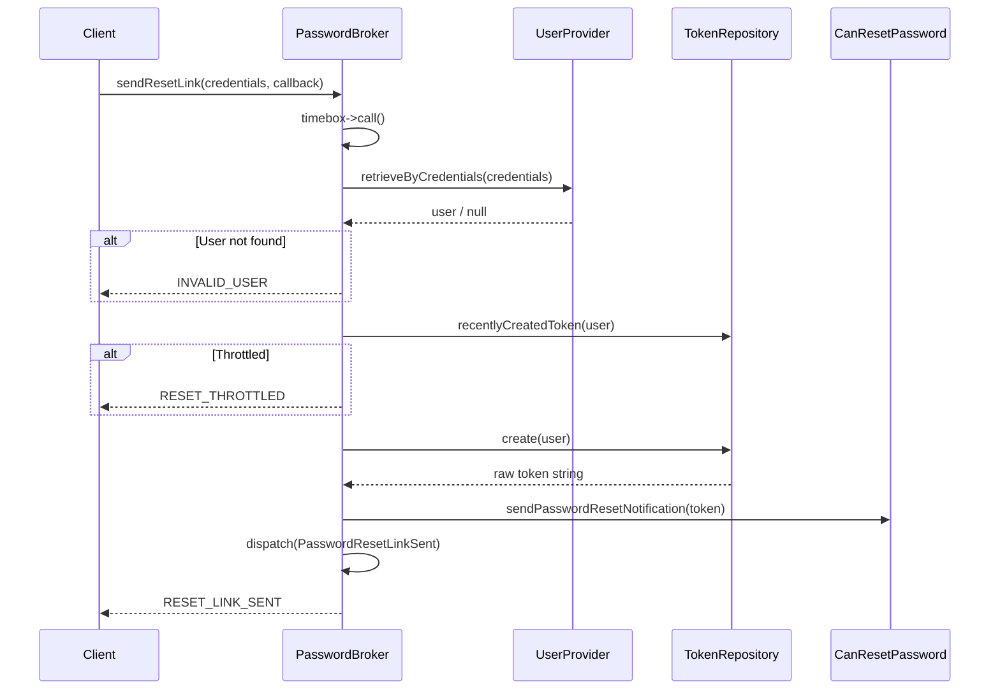
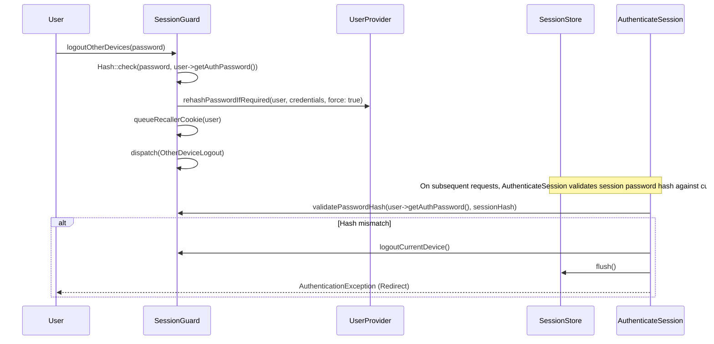

# Password Resets

<details>
<summary>Relevant source files</summary>

The following files were used as context for generating this wiki page:

- [src/Illuminate/Auth/Passwords/PasswordBroker.php](https://github.com/laravel/framework/blob/main/src/Illuminate/Auth/Passwords/PasswordBroker.php)
- [src/Illuminate/Auth/Passwords/DatabaseTokenRepository.php](https://github.com/laravel/framework/blob/main/src/Illuminate/Auth/Passwords/DatabaseTokenRepository.php)
- [src/Illuminate/Auth/SessionGuard.php](https://github.com/laravel/framework/blob/main/src/Illuminate/Auth/SessionGuard.php)
- [src/Illuminate/Auth/Passwords/PasswordBrokerManager.php](https://github.com/laravel/framework/blob/main/src/Illuminate/Auth/Passwords/PasswordBrokerManager.php)
- [src/Illuminate/Auth/EloquentUserProvider.php](https://github.com/laravel/framework/blob/main/src/Illuminate/Auth/EloquentUserProvider.php)
- [src/Illuminate/Auth/Passwords/CacheTokenRepository.php](https://github.com/laravel/framework/blob/main/src/Illuminate/Auth/Passwords/CacheTokenRepository.php)
- [src/Illuminate/Auth/DatabaseUserProvider.php](https://github.com/laravel/framework/blob/main/src/Illuminate/Auth/DatabaseUserProvider.php)
- [src/Illuminate/Session/Middleware/AuthenticateSession.php](https://github.com/laravel/framework/blob/main/src/Illuminate/Session/Middleware/AuthenticateSession.php)
- [src/Illuminate/Auth/Notifications/ResetPassword.php](https://github.com/laravel/framework/blob/main/src/Illuminate/Auth/Notifications/ResetPassword.php)
- [src/Illuminate/Validation/NotPwnedVerifier.php](https://github.com/laravel/framework/blob/main/src/Illuminate/Validation/NotPwnedVerifier.php)
- [src/Illuminate/Auth/Passwords/PasswordResetServiceProvider.php](https://github.com/laravel/framework/blob/main/src/Illuminate/Auth/Passwords/PasswordResetServiceProvider.php)
- [src/Illuminate/Contracts/Auth/PasswordBroker.php](https://github.com/laravel/framework/blob/main/src/Illuminate/Contracts/Auth/PasswordBroker.php)
- [src/Illuminate/Auth/Passwords/CanResetPassword.php](https://github.com/laravel/framework/blob/main/src/Illuminate/Auth/Passwords/CanResetPassword.php)
- [src/Illuminate/Support/Facades/Password.php](https://github.com/laravel/framework/blob/main/src/Illuminate/Support/Facades/Password.php)
- [src/Illuminate/Auth/Console/ClearResetsCommand.php](https://github.com/laravel/framework/blob/main/src/Illuminate/Auth/Console/ClearResetsCommand.php)
- [src/Illuminate/Contracts/Auth/CanResetPassword.php](https://github.com/laravel/framework/blob/main/src/Illuminate/Contracts/Auth/CanResetPassword.php)
- [src/Illuminate/Contracts/Auth/PasswordBrokerFactory.php](https://github.com/laravel/framework/blob/main/src/Illuminate/Contracts/Auth/PasswordBrokerFactory.php)
- [src/Illuminate/Translation/lang/en/passwords.php](https://github.com/laravel/framework/blob/main/src/Illuminate/Translation/lang/en/passwords.php)
- [src/Illuminate/Auth/Passwords/TokenRepositoryInterface.php](https://github.com/laravel/framework/blob/main/src/Illuminate/Auth/Passwords/TokenRepositoryInterface.php)
- [src/Illuminate/Auth/Events/PasswordReset.php](https://github.com/laravel/framework/blob/main/src/Illuminate/Auth/Events/PasswordReset.php)
- [src/Illuminate/Hashing/HashManager.php](https://github.com/laravel/framework/blob/main/src/Illuminate/Hashing/HashManager.php)
- [src/Illuminate/Auth/Events/PasswordResetLinkSent.php](https://github.com/laravel/framework/blob/main/src/Illuminate/Auth/Events/PasswordResetLinkSent.php)
- [config/auth.php](https://github.com/laravel/framework/blob/main/config/auth.php)
- [src/Illuminate/Auth/GenericUser.php](https://github.com/laravel/framework/blob/main/src/Illuminate/Auth/GenericUser.php)
- [config/hashing.php](https://github.com/laravel/framework/blob/main/config/hashing.php)
</details>

## Overview

### Introduction and System Objectives

The Laravel Password Resets subsystem provides an end-to-end framework for securely managing user credential recovery, token generation, cryptographic validation, and notification delivery. It solves the critical security challenges of user verification and brute-force protection by orchestrating discrete storage engines (database and cache drivers), user providers (Eloquent and database), and notification channels. By enforcing timeboxed execution windows and hashing reset tokens before persistence, the component prevents timing attacks and database-compromise vulnerabilities.

Sources: [src/Illuminate/Auth/Passwords/PasswordBroker.php:61-113](https://github.com/laravel/framework/blob/main/src/Illuminate/Auth/Passwords/PasswordBroker.php#L61-L113), [src/Illuminate/Auth/Passwords/DatabaseTokenRepository.php:19-73](https://github.com/laravel/framework/blob/main/src/Illuminate/Auth/Passwords/DatabaseTokenRepository.php#L19-L73)

At its core, the subsystem bridges user authentication models and persistence layers through the `PasswordBrokerManager` factory and `PasswordBroker` implementation. When a user requests a reset link or submits a new password, the broker coordinates token validation, throttling checks, event dispatching, and credential updates. It integrates directly with authentication guards and session management middleware (`AuthenticateSession`) to invalidate stale sessions or secondary device logins when credentials change.

Sources: [src/Illuminate/Auth/Passwords/PasswordBrokerManager.php:45-77](https://github.com/laravel/framework/blob/main/src/Illuminate/Auth/Passwords/PasswordBrokerManager.php#L45-L77), [src/Illuminate/Session/Middleware/AuthenticateSession.php:46-75](https://github.com/laravel/framework/blob/main/src/Illuminate/Session/Middleware/AuthenticateSession.php#L46-L75)

```mermaid
flowchart TD
    A["Client Request<br>(Send Reset Link / Reset)"] --> B["PasswordBrokerManager<br>resolve(name)"]
    B --> C["PasswordBroker"]
    C --> D{"Action Type"}
    D -->|Send Link| E["TokenRepository<br>create() & Throttle Check"]
    D -->|Reset Password| F["TokenRepository<br>exists() & validateReset()"]
    E --> G["ResetPassword Notification<br>& Dispatch Event"]
    F --> H["User Callback & Token Deletion"]

    Sources: [src/Illuminate/Auth/Passwords/PasswordBroker.php:82-147](https://github.com/laravel/framework/blob/main/src/Illuminate/Auth/Passwords/PasswordBroker.php#L82-L147), [src/Illuminate/Auth/Passwords/PasswordBrokerManager.php:45-77](https://github.com/laravel/framework/blob/main/src/Illuminate/Auth/Passwords/PasswordBrokerManager.php#L45-L77)
```

Sources: [src/Illuminate/Auth/Passwords/PasswordBroker.php:82-147](https://github.com/laravel/framework/blob/main/src/Illuminate/Auth/Passwords/PasswordBroker.php#L82-L147), [src/Illuminate/Auth/Passwords/PasswordBrokerManager.php:45-77](https://github.com/laravel/framework/blob/main/src/Illuminate/Auth/Passwords/PasswordBrokerManager.php#L45-L77)

---

## Architecture and Component Hierarchy

### Component Roles and Interfaces

The Password Resets subsystem is structured around modular contracts and managers. The entry point is the `PasswordBrokerManager` class, which implements `PasswordBrokerFactory` and resolves named password broker configurations from application settings. Each broker instance receives a `TokenRepositoryInterface` implementation and a `UserProvider` instance.

Sources: [src/Illuminate/Auth/Passwords/PasswordBrokerManager.php:13-77](https://github.com/laravel/framework/blob/main/src/Illuminate/Auth/Passwords/PasswordBrokerManager.php#L13-L77)

Users wishing to participate in password resets must implement the `CanResetPassword` contract (typically via the `CanResetPassword` trait), which exposes `getEmailForPasswordReset()` and `sendPasswordResetNotification($token)`.

Sources: [src/Illuminate/Auth/Passwords/CanResetPassword.php:7-29](https://github.com/laravel/framework/blob/main/src/Illuminate/Auth/Passwords/CanResetPassword.php#L7-L29), [src/Illuminate/Contracts/Auth/CanResetPassword.php:5-21](https://github.com/laravel/framework/blob/main/src/Illuminate/Contracts/Auth/CanResetPassword.php#L5-L21)

```mermaid
classDiagram
    class PasswordBrokerFactory {
        <<interface>>
        +broker(name)
    }
    class PasswordBrokerManager {
        #app
        #brokers
        +broker(name)
        #resolve(name)
        #createTokenRepository(config)
    }
    class PasswordBrokerContract {
        <<interface>>
        +sendResetLink(credentials, callback)
        +reset(credentials, callback)
    }
    class PasswordBroker {
        #tokens
        #users
        #events
        #timebox
        +sendResetLink(credentials, callback)
        +reset(credentials, callback)
        +getUser(credentials)
    }
    class TokenRepositoryInterface {
        <<interface>>
        +create(user)
        +exists(user, token)
        +recentlyCreatedToken(user)
        +delete(user)
        +deleteExpired()
    }
    PasswordBrokerFactory <|-- PasswordBrokerManager
    PasswordBrokerContract <|-- PasswordBroker
    PasswordBrokerManager --> PasswordBroker : creates
    PasswordBroker --> TokenRepositoryInterface : uses
    PasswordBroker --> UserProvider : uses

    Sources: [src/Illuminate/Auth/Passwords/PasswordBrokerManager.php:13-77](https://github.com/laravel/framework/blob/main/src/Illuminate/Auth/Passwords/PasswordBrokerManager.php#L13-L77), [src/Illuminate/Auth/Passwords/PasswordBroker.php:15-242](https://github.com/laravel/framework/blob/main/src/Illuminate/Auth/Passwords/PasswordBroker.php#L15-L242), [src/Illuminate/Auth/Passwords/TokenRepositoryInterface.php:7-48](https://github.com/laravel/framework/blob/main/src/Illuminate/Auth/Passwords/TokenRepositoryInterface.php#L7-L48)
```

Sources: [src/Illuminate/Auth/Passwords/PasswordBrokerManager.php:13-77](https://github.com/laravel/framework/blob/main/src/Illuminate/Auth/Passwords/PasswordBrokerManager.php#L13-L77), [src/Illuminate/Auth/Passwords/PasswordBroker.php:15-242](https://github.com/laravel/framework/blob/main/src/Illuminate/Auth/Passwords/PasswordBroker.php#L15-L242), [src/Illuminate/Auth/Passwords/TokenRepositoryInterface.php:7-48](https://github.com/laravel/framework/blob/main/src/Illuminate/Auth/Passwords/TokenRepositoryInterface.php#L7-L48)

| Component | Class / Interface | Role |
| :--- | :--- | :--- |
| Broker Factory | `Illuminate\Contracts\Auth\PasswordBrokerFactory` | Interface for retrieving named password brokers. |
| Broker Manager | `Illuminate\Auth\Passwords\PasswordBrokerManager` | Manages and resolves named broker instances and token repositories. |
| Broker Contract | `Illuminate\Contracts\Auth\PasswordBroker` | Defines standard reset constants and core methods (`sendResetLink`, `reset`). |
| Password Broker | `Illuminate\Auth\Passwords\PasswordBroker` | Core business logic coordinator for token generation, validation, and timeboxing. |
| Token Repository | `Illuminate\Auth\Passwords\TokenRepositoryInterface` | Contract for token persistence (Database or Cache drivers). |
| User Contract | `Illuminate\Contracts\Auth\CanResetPassword` | Interface ensuring models can receive reset notifications and emails. |

Sources: [src/Illuminate/Auth/Passwords/PasswordBrokerManager.php:13-77](https://github.com/laravel/framework/blob/main/src/Illuminate/Auth/Passwords/PasswordBrokerManager.php#L13-L77), [src/Illuminate/Auth/Passwords/PasswordBroker.php:15-242](https://github.com/laravel/framework/blob/main/src/Illuminate/Auth/Passwords/PasswordBroker.php#L15-L242), [src/Illuminate/Contracts/Auth/PasswordBroker.php:7-61](https://github.com/laravel/framework/blob/main/src/Illuminate/Contracts/Auth/PasswordBroker.php#L7-L61), [src/Illuminate/Auth/Passwords/TokenRepositoryInterface.php:7-48](https://github.com/laravel/framework/blob/main/src/Illuminate/Auth/Passwords/TokenRepositoryInterface.php#L7-L48)

---

## Token Repositories and Persistence

### Storage Drivers and Hashing Mechanics

Token persistence is abstracted through `TokenRepositoryInterface`, with two built-in drivers: `DatabaseTokenRepository` and `CacheTokenRepository`. Both drivers hash generated tokens using HMAC-SHA256 (`hash_hmac`) with the application's master key (`app.key`) before saving them, ensuring that a database breach does not expose raw reset tokens.

Sources: [src/Illuminate/Auth/Passwords/DatabaseTokenRepository.php:11-168](https://github.com/laravel/framework/blob/main/src/Illuminate/Auth/Passwords/DatabaseTokenRepository.php#L11-L168), [src/Illuminate/Auth/Passwords/CacheTokenRepository.php:11-51](https://github.com/laravel/framework/blob/main/src/Illuminate/Auth/Passwords/CacheTokenRepository.php#L11-L51)

```mermaid
flowchart TD
    A["Token Creation Request<br>create(user)"] --> B["Delete Existing User Tokens"]
    B --> C["Generate Random Token<br>Str::random(40)"]
    C --> D["HMAC Hash Token<br>hash_hmac('sha256', ..., hashKey)"]
    D --> E{"Driver Type"}
    E -->|Database| F["Insert into Database Table<br>email, token, created_at"]
    E -->|Cache| G["Put in Cache Store<br>key: hash('sha256', email)<br>value: [hashedToken, timestamp]"]

    Sources: [src/Illuminate/Auth/Passwords/DatabaseTokenRepository.php:36-50](https://github.com/laravel/framework/blob/main/src/Illuminate/Auth/Passwords/DatabaseTokenRepository.php#L36-L50), [src/Illuminate/Auth/Passwords/CacheTokenRepository.php:37-50](https://github.com/laravel/framework/blob/main/src/Illuminate/Auth/Passwords/CacheTokenRepository.php#L37-L50)
```

Sources: [src/Illuminate/Auth/Passwords/DatabaseTokenRepository.php:36-50](https://github.com/laravel/framework/blob/main/src/Illuminate/Auth/Passwords/DatabaseTokenRepository.php#L36-L50), [src/Illuminate/Auth/Passwords/CacheTokenRepository.php:37-50](https://github.com/laravel/framework/blob/main/src/Illuminate/Auth/Passwords/CacheTokenRepository.php#L37-L50)

The database repository stores tokens in a configurable database table, while the cache repository keys cache items by hashing the user's email address (`hash('sha256', $user->getEmailForPasswordReset())`).

Sources: [src/Illuminate/Auth/Passwords/DatabaseTokenRepository.php:180-187](https://github.com/laravel/framework/blob/main/src/Illuminate/Auth/Passwords/DatabaseTokenRepository.php#L180-L187), [src/Illuminate/Auth/Passwords/CacheTokenRepository.php:130-138](https://github.com/laravel/framework/blob/main/src/Illuminate/Auth/Passwords/CacheTokenRepository.php#L130-L138)

> [!IMPORTANT]
> When validating tokens, repositories compare the incoming raw token against the stored hash using `HasherContract::check($token, $record['token'])` or cache equivalent, preventing timing attacks and unauthorized token forgery.

Sources: [src/Illuminate/Auth/Passwords/DatabaseTokenRepository.php:82-91](https://github.com/laravel/framework/blob/main/src/Illuminate/Auth/Passwords/DatabaseTokenRepository.php#L82-L91), [src/Illuminate/Auth/Passwords/CacheTokenRepository.php:59-66](https://github.com/laravel/framework/blob/main/src/Illuminate/Auth/Passwords/CacheTokenRepository.php#L59-L66)

---

## Execution Flow: Sending Reset Links and Resetting Passwords

### Call-Chain Walkthrough and Timeboxing

The `PasswordBroker` orchestrates two primary workflows: sending a reset link and executing the password update. Both methods are wrapped in a `Timebox` instance to guarantee constant-execution duration, preventing user enumeration attacks via response timing.

Sources: [src/Illuminate/Auth/Passwords/PasswordBroker.php:82-147](https://github.com/laravel/framework/blob/main/src/Illuminate/Auth/Passwords/PasswordBroker.php#L82-L147)

1. **`PasswordBroker::sendResetLink()`**: Initiates a `Timebox` call configured with `timeboxDuration` (default 200,000 microseconds).
2. **`PasswordBroker::getUser()`**: Strips the `token` from credentials and invokes `UserProvider::retrieveByCredentials()`. If no user is found, returns `static::INVALID_USER`.
3. **`TokenRepositoryInterface::recentlyCreatedToken()`**: Checks if the user generated a token within the throttle window (configured via `throttle` seconds). If true, returns `static::RESET_THROTTLED`.
4. **`TokenRepositoryInterface::create()`**: Deletes existing tokens for the user, generates a secure random token, hashes it with HMAC, and persists the payload.
5. **Notification & Events**: Invokes `$user->sendPasswordResetNotification($token)` and dispatches the `PasswordResetLinkSent` event. Returns `static::RESET_LINK_SENT`.

Sources: [src/Illuminate/Auth/Passwords/PasswordBroker.php:82-113](https://github.com/laravel/framework/blob/main/src/Illuminate/Auth/Passwords/PasswordBroker.php#L82-L113)



Sources: [src/Illuminate/Auth/Passwords/PasswordBroker.php:82-113](https://github.com/laravel/framework/blob/main/src/Illuminate/Auth/Passwords/PasswordBroker.php#L82-L113)

---

## Configuration Options

### Framework Parameters and Settings

Password reset behavior is configured primarily within `config/auth.php` under the `passwords` array and global hashing parameters.

Sources: [config/auth.php:76-100](https://github.com/laravel/framework/blob/main/config/auth.php#L76-100)

| Configuration Key | Type | Default | Purpose |
| :--- | :--- | :--- | :--- |
| `auth.defaults.passwords` | string | `'users'` | Default password broker driver name. |
| `auth.passwords.users.provider` | string | `'users'` | User provider associated with the broker. |
| `auth.passwords.users.table` | string | `'password_reset_tokens'` | Database table name for token storage. |
| `auth.passwords.users.expire` | int | `60` | Token expiration time in minutes. |
| `auth.passwords.users.throttle` | int | `60` | Seconds a user must wait before requesting another token. |
| `auth.timebox_duration` | int | `200000` | Microseconds for timebox execution guarding against timing attacks. |

Sources: [config/auth.php:16-115](https://github.com/laravel/framework/blob/main/config/auth.php#L16-L115), [src/Illuminate/Auth/Passwords/PasswordBrokerManager.php:71-76](https://github.com/laravel/framework/blob/main/src/Illuminate/Auth/Passwords/PasswordBrokerManager.php#L71-76)

---

## Events, Notifications, and Localization

### Dispatched Events and Language Lines

The subsystem communicates state changes via events, notifications, and localization language lines.

Sources: [src/Illuminate/Auth/Events/PasswordResetLinkSent.php:7-20](https://github.com/laravel/framework/blob/main/src/Illuminate/Auth/Events/PasswordResetLinkSent.php#L7-20), [src/Illuminate/Auth/Events/PasswordReset.php:7-20](https://github.com/laravel/framework/blob/main/src/Illuminate/Auth/Events/PasswordReset.php#L7-20)

### Events Dispatched
- `Illuminate\Auth\Events\PasswordResetLinkSent`: Dispatched immediately after a password reset link notification is successfully sent to a user.
- `Illuminate\Auth\Events\PasswordReset`: Dispatched when a user successfully resets their password.

Sources: [src/Illuminate/Auth/Passwords/PasswordBroker.php:109-109](https://github.com/laravel/framework/blob/main/src/Illuminate/Auth/Passwords/PasswordBroker.php#L109-L109), [src/Illuminate/Auth/Events/PasswordReset.php:7-20](https://github.com/laravel/framework/blob/main/src/Illuminate/Auth/Events/PasswordReset.php#L7-20)

### Default Language Lines (`lang/en/passwords.php`)
- `'reset'`: `'Your password has been reset.'`
- `'sent'`: `'We have emailed your password reset link.'`
- `'throttled'`: `'Please wait before retrying.'`
- `'token'`: `'This password reset token is invalid.'`
- `'user'`: `"We can't find a user with that email address."`

Sources: [src/Illuminate/Translation/lang/en/passwords.php:16-21](https://github.com/laravel/framework/blob/main/src/Illuminate/Translation/lang/en/passwords.php#L16-21)

> [!NOTE]
> The `ResetPassword` notification (`Illuminate\Auth\Notifications\ResetPassword`) defaults to the `'mail'` channel and builds its message utilizing the expiration minutes configured in `auth.passwords.{broker}.expire`.

Sources: [src/Illuminate/Auth/Notifications/ResetPassword.php:48-82](https://github.com/laravel/framework/blob/main/src/Illuminate/Auth/Notifications/ResetPassword.php#L48-L82)

---

## Session Security and Device Invalidation

### Middleware and Guard Integration

When a user resets their password or invokes `logoutOtherDevices($password)`, Laravel invalidates existing sessions across other devices using `AuthenticateSession` middleware and `SessionGuard`.

Sources: [src/Illuminate/Auth/SessionGuard.php:740-777](https://github.com/laravel/framework/blob/main/src/Illuminate/Auth/SessionGuard.php#L740-L777), [src/Illuminate/Session/Middleware/AuthenticateSession.php:46-75](https://github.com/laravel/framework/blob/main/src/Illuminate/Session/Middleware/AuthenticateSession.php#L46-L75)



Sources: [src/Illuminate/Auth/SessionGuard.php:740-777](https://github.com/laravel/framework/blob/main/src/Illuminate/Auth/SessionGuard.php#L740-L777), [src/Illuminate/Session/Middleware/AuthenticateSession.php:46-75](https://github.com/laravel/framework/blob/main/src/Illuminate/Session/Middleware/AuthenticateSession.php#L46-L75)

---

## Console Commands and Maintenance

### Artisan Commands for Expired Tokens

Laravel provides an artisan command to maintain token storage tables by flushing expired records.

Sources: [src/Illuminate/Auth/Console/ClearResetsCommand.php:8-36](https://github.com/laravel/framework/blob/main/src/Illuminate/Auth/Console/ClearResetsCommand.php#L8-36)

### `auth:clear-resets`
- **Signature**: `auth:clear-resets {name? : The name of the password broker}`
- **Description**: Flush expired password reset tokens from the underlying repository.
- **Implementation**: Resolves the specified password broker via `auth.password`, retrieves its token repository, and calls `deleteExpired()`.

Sources: [src/Illuminate/Auth/Console/ClearResetsCommand.php:16-35](https://github.com/laravel/framework/blob/main/src/Illuminate/Auth/Console/ClearResetsCommand.php#L16-L35)

```php
use Illuminate\Support\Facades\Artisan;

// Manually trigger clearing expired reset tokens for the default broker
Artisan::call('auth:clear-resets');
```

Sources: [src/Illuminate/Auth/Console/ClearResetsCommand.php:30-36](https://github.com/laravel/framework/blob/main/src/Illuminate/Auth/Console/ClearResetsCommand.php#L30-L36)

## Related

- [[Authentication & Guards]]

