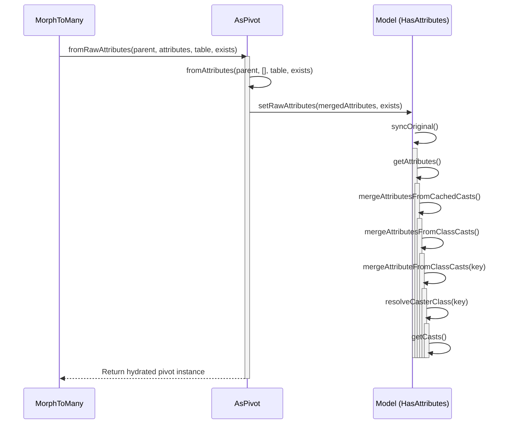
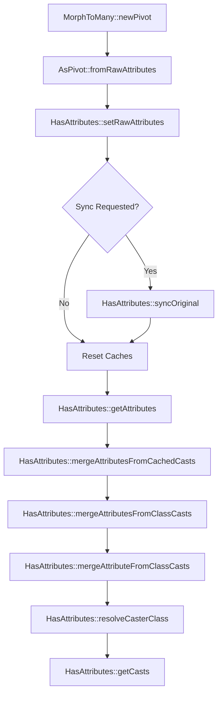

# Pivot Attribute Casting Resolution

Relevant source files

The following files were used as context for generating this wiki page:

- [src/Illuminate/Database/Eloquent/Relations/MorphToMany.php](https://github.com/laravel/framework/blob/main/src/Illuminate/Database/Eloquent/Relations/MorphToMany.php)
- [src/Illuminate/Database/Eloquent/Relations/Concerns/AsPivot.php](https://github.com/laravel/framework/blob/main/src/Illuminate/Database/Eloquent/Relations/Concerns/AsPivot.php)
- [src/Illuminate/Database/Eloquent/Concerns/HasAttributes.php](https://github.com/Illuminate/Database/Eloquent/Concerns/HasAttributes.php)

## Overview

The `NewPivot -> GetCasts` execution flow governs how Laravel initializes a polymorphic pivot model (`MorphPivot`) via a `MorphToMany` relationship and resolves its attribute casting definitions. When attaching or retrieving records through a polymorphic many-to-many relationship, Eloquent instantiates a pivot model, hydrates it with raw database attributes, synchronizes its original state, and inspects its configured casts—supporting both primitive and custom class casters.

Sources: [src/Illuminate/Database/Eloquent/Relations/MorphToMany.php:156-172](https://github.com/laravel/framework/blob/main/src/Illuminate/Database/Eloquent/Relations/MorphToMany.php#L156-L172), [src/Illuminate/Database/Eloquent/Relations/Concerns/AsPivot.php:81-92](https://github.com/laravel/framework/blob/main/src/Illuminate/Database/Eloquent/Relations/Concerns/AsPivot.php#L81-L92)

## Execution Flow

### Step 1: newPivot

The `MorphToMany::newPivot` method is responsible for constructing a new pivot model instance for the relationship. It injects the morph type and morph class into the attributes array and instantiates either a custom pivot class (if defined via `$using`) or a standard `MorphPivot` object. It then assigns the foreign keys, related model, and polymorphic constraints before returning the populated pivot model.

Sources: [src/Illuminate/Database/Eloquent/Relations/MorphToMany.php:156-172](https://github.com/laravel/framework/blob/main/src/Illuminate/Database/Eloquent/Relations/MorphToMany.php#L156-L172)

### Step 2: fromRawAttributes

When hydrating a pivot model from raw database query results, `AsPivot::fromRawAttributes` is invoked. It delegates initial blank model setup to `fromAttributes`, determines timestamp properties based on the incoming raw attribute keys, and calls `setRawAttributes` to load the dataset while marking the model as existing.

Sources: [src/Illuminate/Database/Eloquent/Relations/Concerns/AsPivot.php:81-92](https://github.com/laravel/framework/blob/main/src/Illuminate/Database/Eloquent/Relations/Concerns/AsPivot.php#L81-L92)

### Step 3: setRawAttributes

The `HasAttributes::setRawAttributes` method sets the internal `$attributes` array directly. If the synchronization flag is enabled, it immediately triggers `syncOriginal()`. It also resets the class and attribute cast caches to ensure stale data does not persist across hydration cycles.

Sources: [src/Illuminate/Database/Eloquent/Concerns/HasAttributes.php:2063-2075](https://github.com/laravel/framework/blob/main/src/Illuminate/Database/Eloquent/Concerns/HasAttributes.php#L2063-L2075)

### Step 4: syncOriginal

To keep track of dirty attributes and modifications, `HasAttributes::syncOriginal` captures a snapshot of the current model state by fetching all attributes and assigning them to the `$original` array property.

Sources: [src/Illuminate/Database/Eloquent/Concerns/HasAttributes.php:2166-2171](https://github.com/laravel/framework/blob/main/src/Illuminate/Database/Eloquent/Concerns/HasAttributes.php#L2166-L2171)

### Step 5: getAttributes

The `HasAttributes::getAttributes` method retrieves the complete set of model attributes. Before returning the underlying array, it invokes `mergeAttributesFromCachedCasts()` to ensure any pending or cached custom cast attributes are correctly reconciled back into the model's attribute store.

Sources: [src/Illuminate/Database/Eloquent/Concerns/HasAttributes.php:2039-2044](https://github.com/laravel/framework/blob/main/src/Illuminate/Database/Eloquent/Concerns/HasAttributes.php#L2039-L2044)

### Step 6: mergeAttributesFromCachedCasts

`HasAttributes::mergeAttributesFromCachedCasts` acts as an orchestrator that iterates over cached attribute transformations, calling `mergeAttributesFromClassCasts()` to merge custom class-cast values back into the attribute bag.

Sources: [src/Illuminate/Database/Eloquent/Concerns/HasAttributes.php:1927-1931](https://github.com/laravel/framework/blob/main/src/Illuminate/Database/Eloquent/Concerns/HasAttributes.php#L1927-L1931)

### Step 7: mergeAttributesFromClassCasts

Looping through the entries present in `classCastCache`, `HasAttributes::mergeAttributesFromClassCasts` passes each cached attribute key to `mergeAttributeFromClassCasts` for individual reconciliation.

Sources: [src/Illuminate/Database/Eloquent/Concerns/HasAttributes.php:1949-1954](https://github.com/laravel/framework/blob/main/src/Illuminate/Database/Eloquent/Concerns/HasAttributes.php#L1949-L1954)

### Step 8: mergeAttributeFromClassCasts

For a given attribute key, `HasAttributes::mergeAttributeFromClassCasts` checks whether a cached cast object exists. If present, it resolves the custom caster class and invokes its `set` method (or preserves inbound-only attributes) to compute the storable representation, merging the result back into `$attributes`.

Sources: [src/Illuminate/Database/Eloquent/Concerns/HasAttributes.php:1961-1977](https://github.com/laravel/framework/blob/main/src/Illuminate/Database/Eloquent/Concerns/HasAttributes.php#L1961-L1977)

### Step 9: resolveCasterClass

`HasAttributes::resolveCasterClass` inspects the definition associated with an attribute in the model's casts list. It parses any inline parameters separated by colons, handles `Castable` contract implementations by requesting the caster instance, and instantiates the custom caster class with any provided arguments.

Sources: [src/Illuminate/Database/Eloquent/Concerns/HasAttributes.php:1885-1907](https://github.com/laravel/framework/blob/main/src/Illuminate/Database/Eloquent/Concerns/HasAttributes.php#L1885-L1907)

### Step 10: getCasts

The `HasAttributes::getCasts` method aggregates and returns all attribute casting rules defined on the model. If the model is configured with auto-incrementing primary keys, it merges the primary key name and its corresponding key type into the casting array alongside user-defined casts.

Sources: [src/Illuminate/Database/Eloquent/Concerns/HasAttributes.php:1713-1720](https://github.com/laravel/framework/blob/main/src/Illuminate/Database/Eloquent/Concerns/HasAttributes.php#L1713-L1720)

## Sequence Diagram

Sources: [src/Illuminate/Database/Eloquent/Relations/MorphToMany.php:156-172](https://github.com/laravel/framework/blob/main/src/Illuminate/Database/Eloquent/Relations/MorphToMany.php#L156-L172), [src/Illuminate/Database/Eloquent/Relations/Concerns/AsPivot.php:81-92](https://github.com/laravel/framework/blob/main/src/Illuminate/Database/Eloquent/Relations/Concerns/AsPivot.php#L81-L92), [src/Illuminate/Database/Eloquent/Concerns/HasAttributes.php:1713-2075](https://github.com/laravel/framework/blob/main/src/Illuminate/Database/Eloquent/Concerns/HasAttributes.php#L1713-L2075)

## Flowchart

Sources: [src/Illuminate/Database/Eloquent/Relations/MorphToMany.php:156-172](https://github.com/laravel/framework/blob/main/src/Illuminate/Database/Eloquent/Relations/MorphToMany.php#L156-L172), [src/Illuminate/Database/Eloquent/Relations/Concerns/AsPivot.php:81-92](https://github.com/laravel/framework/blob/main/src/Illuminate/Database/Eloquent/Relations/Concerns/AsPivot.php#L81-L92), [src/Illuminate/Database/Eloquent/Concerns/HasAttributes.php:1713-2075](https://github.com/laravel/framework/blob/main/src/Illuminate/Database/Eloquent/Concerns/HasAttributes.php#L1713-L2075)

## Key Observations

- **Cross-Module Boundaries:** The execution flow bridges Eloquent relationship management (`MorphToMany`), pivot model behavior traits (`AsPivot`), and attribute handling/casting mechanisms (`HasAttributes`).
- **State Synchronization:** During raw hydration, `setRawAttributes` ensures that intermediate states are cleanly synchronized against the underlying database attributes via `syncOriginal()`, while clearing active cast caches (`classCastCache`, `attributeCastCache`).
- **Dynamic Caster Resolution:** Custom casting logic leverages `resolveCasterClass` to dynamically instantiate and configure object casters or classes adhering to the `Castable` interface on demand.
