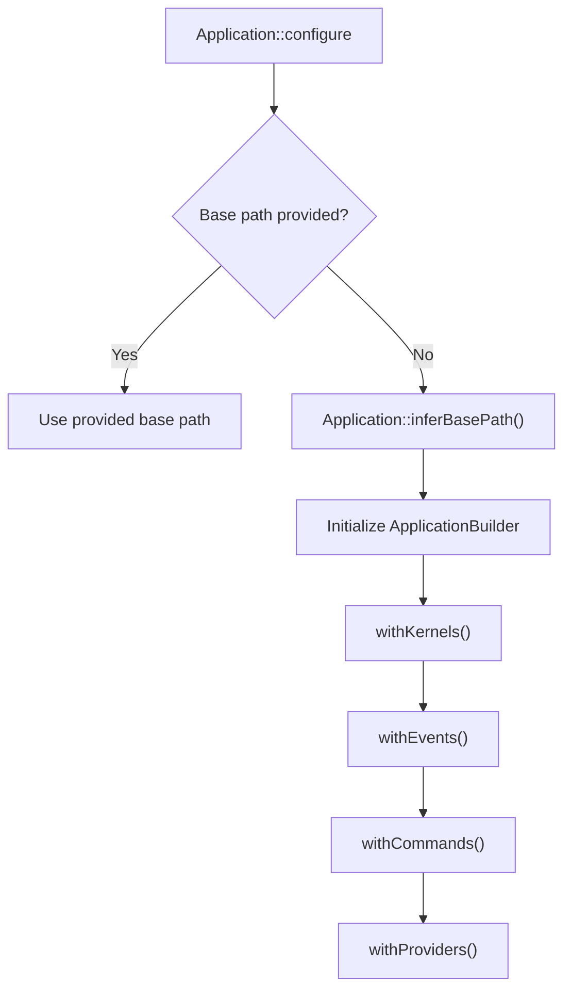
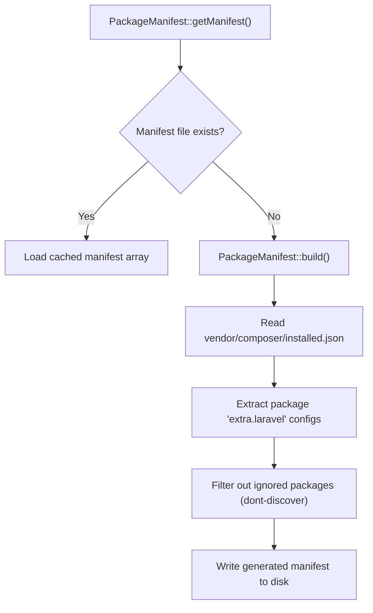
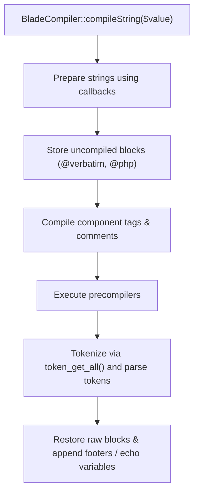

# Project Structure

<details>
<summary>Relevant source files</summary>

The following files were used as context for generating this wiki page:

- [src/Illuminate/Foundation/Application.php](https://github.com/laravel/framework/blob/main/src/Illuminate/Foundation/Application.php)
- [composer.json](https://github.com/laravel/framework/blob/main/composer.json)
- [src/Illuminate/Foundation/Configuration/ApplicationBuilder.php](https://github.com/laravel/framework/blob/main/src/Illuminate/Foundation/Configuration/ApplicationBuilder.php)
- [src/Illuminate/Foundation/Console/AboutCommand.php](https://github.com/laravel/framework/blob/main/src/Illuminate/Foundation/Console/AboutCommand.php)
- [src/Illuminate/Foundation/Console/VendorPublishCommand.php](https://github.com/laravel/framework/blob/main/src/Illuminate/Foundation/Console/VendorPublishCommand.php)
- [src/Illuminate/View/Compilers/BladeCompiler.php](https://github.com/laravel/framework/blob/main/src/Illuminate/View/Compilers/BladeCompiler.php)
- [src/Illuminate/Foundation/ProviderRepository.php](https://github.com/laravel/framework/blob/main/src/Illuminate/Foundation/ProviderRepository.php)
- [README.md](https://github.com/laravel/framework/blob/main/README.md)
- [src/Illuminate/Foundation/helpers.php](https://github.com/laravel/framework/blob/main/src/Illuminate/Foundation/helpers.php)
- [src/Illuminate/Foundation/Console/StubPublishCommand.php](https://github.com/laravel/framework/blob/main/src/Illuminate/Foundation/Console/StubPublishCommand.php)
- [src/Illuminate/Foundation/PackageManifest.php](https://github.com/laravel/framework/blob/main/src/Illuminate/Foundation/PackageManifest.php)
- [bin/split.sh](https://github.com/laravel/framework/blob/main/bin/split.sh)
- [src/Illuminate/Database/README.md](https://github.com/laravel/framework/blob/main/src/Illuminate/Database/README.md)
- [src/Illuminate/Routing/composer.json](https://github.com/laravel/framework/blob/main/src/Illuminate/Routing/composer.json)
- [types/Autoload.php](https://github.com/laravel/framework/blob/main/types/Autoload.php)
- [src/Illuminate/Container/composer.json](https://github.com/laravel/framework/blob/main/src/Illuminate/Container/composer.json)
- [src/Illuminate/View/composer.json](https://github.com/laravel/framework/blob/main/src/Illuminate/View/composer.json)
- [src/Illuminate/Http/composer.json](https://github.com/laravel/framework/blob/main/src/Illuminate/Http/composer.json)
- [src/Illuminate/Support/composer.json](https://github.com/laravel/framework/blob/main/src/Illuminate/Support/composer.json)
</details>

## Overview

### Overview
The project structure of the Laravel framework embodies a modular monorepo design composed of discrete service packages located under `src/Illuminate/` and managed via a centralized root `composer.json`. At the architectural center of this ecosystem lies `Illuminate\Foundation\Application`, extending the dependency injection container (`Illuminate\Container\Container`) to coordinate path bindings, bootstrap sequences, service providers, and core request/command lifecycles.

Sources: [src/Illuminate/Foundation/Application.php:39-41](https://github.com/laravel/framework/blob/main/src/Illuminate/Foundation/Application.php#L39-L41)

This modular architecture solves the challenge of maintaining decoupled, independently versionable packages while presenting a cohesive application runtime. Through automated sub-tree splitting scripts (`bin/split.sh`), individual packages such as `illuminate/routing`, `illuminate/database`, and `illuminate/view` can be synchronized to dedicated GitHub repositories.

Sources: [bin/split.sh:8-12](https://github.com/laravel/framework/blob/main/bin/split.sh#L8-L12)

Meanwhile, application bootstrapping is streamlined via fluent builders (`Illuminate\Foundation\Configuration\ApplicationBuilder`) and package discovery manifests (`Illuminate\Foundation\PackageManifest`), ensuring that routing, container bindings, middleware priorities, and cached assets are resolved deterministically across both HTTP and CLI request cycles.

Sources: [composer.json:97-136](https://github.com/laravel/framework/blob/main/composer.json#L97-L136)

---

## Application Initialization and Path Binding

The `Application` class serves as the central IoC container and path registry for the framework instance. Upon instantiation or configuration via `Application::configure(?string $basePath)`, it automatically resolves the project base path—inferring it from `APP_BASE_PATH` environment variables or Composer's registered class loaders—and registers critical base bindings and service providers.

Sources: [src/Illuminate/Foundation/Application.php:241-253](https://github.com/laravel/framework/blob/main/src/Illuminate/Foundation/Application.php#L241-L253)



Sources: [src/Illuminate/Foundation/Application.php:241-253](https://github.com/laravel/framework/blob/main/src/Illuminate/Foundation/Application.php#L241-L253)

The constructor triggers `registerBaseBindings()`, which binds `'app'`, `Container::class`, `Mix::class`, and the `PackageManifest::class` singleton to the container.

Sources: [src/Illuminate/Foundation/Application.php:223-299](https://github.com/laravel/framework/blob/main/src/Illuminate/Foundation/Application.php#L223-L299)

Immediately following, `setBasePath()` invokes `bindPathsInContainer()`, registering the core directory paths and binding them into the container so helper functions like `app_path()`, `storage_path()`, and `config_path()` resolve accurately.

Sources: [src/Illuminate/Foundation/Application.php:408-443](https://github.com/laravel/framework/blob/main/src/Illuminate/Foundation/Application.php#L408-L443)

| Container Abstract | Concrete Target / Path Resolver | Purpose |
| :--- | :--- | :--- |
| `path` / `'path'` | `$this->basePath('app')` (or custom app path) | Application source code directory |
| `path.base` / `'path.base'` | `$this->basePath` | Root installation directory |
| `path.config` / `'path.config'` | `$this->basePath('config')` | Configuration files directory |
| `path.database` / `'path.database'` | `$this->basePath('database')` | Database migrations, seeds, factories |
| `path.public` / `'path.public'` | `$this->basePath('public')` | Public web root directory |
| `path.resources` / `'path.resources'` | `$this->basePath('resources')` | Views, assets, and language files |
| `path.storage` / `'path.storage'` | `LARAVEL_STORAGE_PATH` or `basePath('storage')` | Compiled views, logs, file storage |

Sources: [src/Illuminate/Foundation/Application.php:424-431](https://github.com/laravel/framework/blob/main/src/Illuminate/Foundation/Application.php#L424-L431)

---

## Fluent Application Building (`ApplicationBuilder`)

The `ApplicationBuilder` class provides a fluent API for configuring kernel instances, routing tables, event discovery, middleware stacks, console commands, scheduling, and exception handlers prior to application boot.

Sources: [src/Illuminate/Foundation/Configuration/ApplicationBuilder.php:25-53](https://github.com/laravel/framework/blob/main/src/Illuminate/Foundation/Configuration/ApplicationBuilder.php#L25-L53)

```php
use Illuminate\Foundation\Application;

$app = Application::configure(basePath: dirname(__DIR__))
    ->withRouting(
        web: __DIR__.'/../routes/web.php',
        commands: __DIR__.'/../routes/console.php',
    )
    ->withMiddleware(function ($middleware) {
        // Configure global middleware or groups
    })
    ->withExceptions(function ($exceptions) {
        // Configure exception handling
    })
    ->create();
```

Sources: [src/Illuminate/Foundation/Configuration/ApplicationBuilder.php:527-530](https://github.com/laravel/framework/blob/main/src/Illuminate/Foundation/Configuration/ApplicationBuilder.php#L527-L530)

When `withRouting()` is invoked without a custom closure, it generates a routing callback via `buildRoutingCallback()`.

Sources: [src/Illuminate/Foundation/Configuration/ApplicationBuilder.php:165-171](https://github.com/laravel/framework/blob/main/src/Illuminate/Foundation/Configuration/ApplicationBuilder.php#L165-L171)

This callback registers API routes (applying the `api` middleware and `$apiPrefix`), health check endpoints (`DiagnosingHealth` event dispatching with JSON or HTML view fallback), web routes (`web` middleware group), Folio page routing, and user-defined `then` callbacks.

Sources: [src/Illuminate/Foundation/Configuration/ApplicationBuilder.php:211-278](https://github.com/laravel/framework/blob/main/src/Illuminate/Foundation/Configuration/ApplicationBuilder.php#L211-L278)

> [!NOTE]
> When health check routes are registered via `withRouting(health: '/up')`, the health endpoint path is automatically excluded from maintenance mode checks by invoking `PreventRequestsDuringMaintenance::except($health)`.

Sources: [src/Illuminate/Foundation/Configuration/ApplicationBuilder.php:168-170](https://github.com/laravel/framework/blob/main/src/Illuminate/Foundation/Configuration/ApplicationBuilder.php#L168-L170)

---

## Package Discovery and Manifest Generation

The `PackageManifest` class inspects installed Composer packages to automatically discover framework integrations, such as extra service providers and aliases defined under the `extra.laravel` key in package `composer.json` files.

Sources: [src/Illuminate/Foundation/PackageManifest.php:10-60](https://github.com/laravel/framework/blob/main/src/Illuminate/Foundation/PackageManifest.php#L10-L60)



Sources: [src/Illuminate/Foundation/PackageManifest.php:101-139](https://github.com/laravel/framework/blob/main/src/Illuminate/Foundation/PackageManifest.php#L101-L139)

During build execution, `PackageManifest::build()` reads `vendor/composer/installed.json`, extracts package configurations, merges any packages listed in the root `composer.json`'s `extra.laravel.dont-discover` array (or `*` to ignore all), and writes the compiled manifest array to disk as a PHP-returning file.

Sources: [src/Illuminate/Foundation/PackageManifest.php:120-139](https://github.com/laravel/framework/blob/main/src/Illuminate/Foundation/PackageManifest.php#L120-L139)

| Configuration Key | Source / Behavior |
| :--- | :--- |
| `providers` | Collected from all discovered package `extra.laravel.providers` arrays. |
| `aliases` | Collected from all discovered package `extra.laravel.aliases` arrays. |
| `dont-discover` | Array of package names excluded from auto-discovery (supports wildcard `*`). |

Sources: [src/Illuminate/Foundation/PackageManifest.php:67-94](https://github.com/laravel/framework/blob/main/src/Illuminate/Foundation/PackageManifest.php#L67-L94)

---

## Service Provider Repository and Loading

Service providers are managed and loaded via `ProviderRepository`. The repository determines whether the compiled service manifest requires recompilation, registers deferred load events, and eagerly registers non-deferred providers with the application container.

Sources: [src/Illuminate/Foundation/ProviderRepository.php:52-78](https://github.com/laravel/framework/blob/main/src/Illuminate/Foundation/ProviderRepository.php#L52-L78)

```php
(new ProviderRepository($this, new Filesystem, $this->getCachedServicesPath()))
    ->load($providers->collapse()->toArray());
```

Sources: [src/Illuminate/Foundation/Application.php:877-878](https://github.com/laravel/framework/blob/main/src/Illuminate/Foundation/Application.php#L877-L878)

When providers declare deferred loading (`isDeferred() === true`), their provided services are indexed into `$manifest['deferred']` mapping service names to provider classes, and their `when()` events are registered with the event dispatcher via `registerLoadEvents()`.

Sources: [src/Illuminate/Foundation/ProviderRepository.php:146-152](https://github.com/laravel/framework/blob/main/src/Illuminate/Foundation/ProviderRepository.php#L146-L152)

When an event in `when()` fires, the provider is lazily registered on demand.

Sources: [src/Illuminate/Foundation/ProviderRepository.php:63-68](https://github.com/laravel/framework/blob/main/src/Illuminate/Foundation/ProviderRepository.php#L63-L68)

---

## Blade Template Compilation

The `BladeCompiler` engine processes template strings and view files by parsing tokens through registered compilers, extensions, custom directives, and component tag processors.

Sources: [src/Illuminate/View/Compilers/BladeCompiler.php:18-42](https://github.com/laravel/framework/blob/main/src/Illuminate/View/Compilers/BladeCompiler.php#L18-L42)



Sources: [src/Illuminate/View/Compilers/BladeCompiler.php:283-330](https://github.com/laravel/framework/blob/main/src/Illuminate/View/Compilers/BladeCompiler.php#L283-L330)

> [!WARNING]
> When parsing Blade statements via `compileStatements()`, the compiler checks statement parentheses balance using `hasEvenNumberOfParentheses()`. If an expression contains unbalanced parentheses, parsing continues scanning subsequent string segments until an even count is verified or parsing terminates.

Sources: [src/Illuminate/View/Compilers/BladeCompiler.php:547-590](https://github.com/laravel/framework/blob/main/src/Illuminate/View/Compilers/BladeCompiler.php#L547-L590)

---

## Console Introspection and Asset Publishing

The framework provides built-in console commands for ecosystem introspection (`AboutCommand`) and asset/stub distribution (`VendorPublishCommand`, `StubPublishCommand`).

Sources: [src/Illuminate/Foundation/Console/AboutCommand.php:13-14](https://github.com/laravel/framework/blob/main/src/Illuminate/Foundation/Console/AboutCommand.php#L13-L14)

`AboutCommand` gathers comprehensive application metadata—including environment status, cache states, storage link statuses, and driver configurations—and supports filtering by section via the `--only` option or JSON serialization via `--json`.

Sources: [src/Illuminate/Foundation/Console/AboutCommand.php:21-23](https://github.com/laravel/framework/blob/main/src/Illuminate/Foundation/Console/AboutCommand.php#L21-L23)

`VendorPublishCommand` scans service provider publishable providers and groups, updating migration timestamps if necessary via `ensureMigrationNameIsUpToDate()`.

Sources: [src/Illuminate/Foundation/Console/VendorPublishCommand.php:164-171](https://github.com/laravel/framework/blob/main/src/Illuminate/Foundation/Console/VendorPublishCommand.php#L164-L171)

| Command Signature | Description |
| :--- | :--- |
| `about {--only=} {--json}` | Display basic information about application environment, cache, drivers, and storage. |
| `vendor:publish {--existing} {--force} {--all} {--provider=} {--tag=*}` | Publish publishable assets and config files from vendor packages. |
| `stub:publish {--existing} {--force}` | Publish stub templates available for framework scaffolding customization. |

Sources: [src/Illuminate/Foundation/Console/VendorPublishCommand.php:58-63](https://github.com/laravel/framework/blob/main/src/Illuminate/Foundation/Console/VendorPublishCommand.php#L58-L63)

---

## Framework Subtree Splitting Pipeline

To support modular distribution where individual packages reside as standalone Git repositories under `illuminate/*`, the framework maintains an automated subtree splitting script (`bin/split.sh`).

Sources: [bin/split.sh:1-7](https://github.com/laravel/framework/blob/main/bin/split.sh#L1-L7)

```bash
#!/usr/bin/env bash
set -e
set -x

CURRENT_BRANCH="13.x"

function split()
{
    SHA1=`./bin/splitsh-lite --prefix=$1`
    git push $2 "$SHA1:refs/heads/$CURRENT_BRANCH" -f
}
```

Sources: [bin/split.sh:1-12](https://github.com/laravel/framework/blob/main/bin/split.sh#L1-L12)

The script utilizes `splitsh-lite` to calculate subtree commit hashes for each isolated directory in `src/Illuminate/` (such as `src/Illuminate/Routing` or `src/Illuminate/Database`) and force-pushes them to their respective remote repositories on the target branch (`13.x`).

Sources: [bin/split.sh:59-95](https://github.com/laravel/framework/blob/main/bin/split.sh#L59-95)

## Related

- [[Overview]]
- [[Service Providers]]

