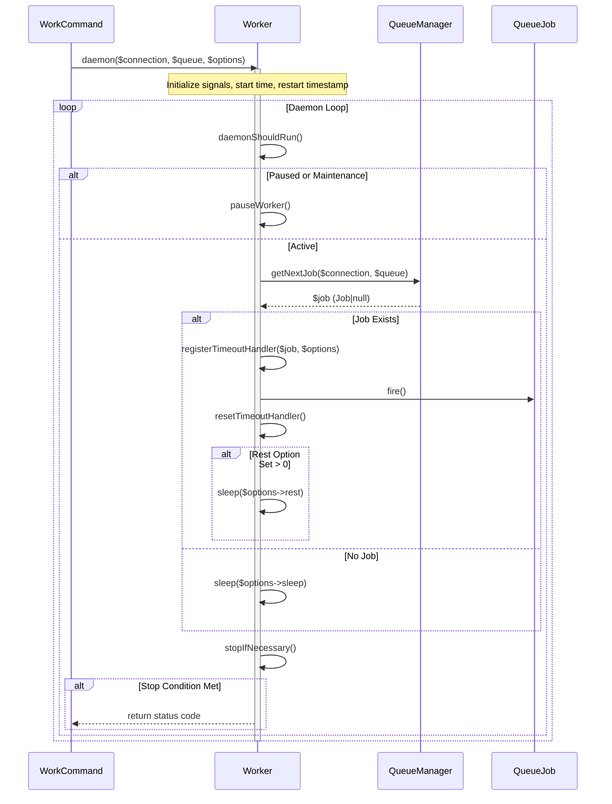
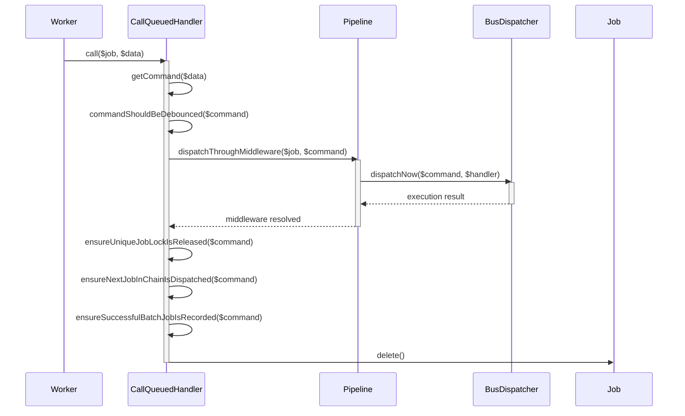
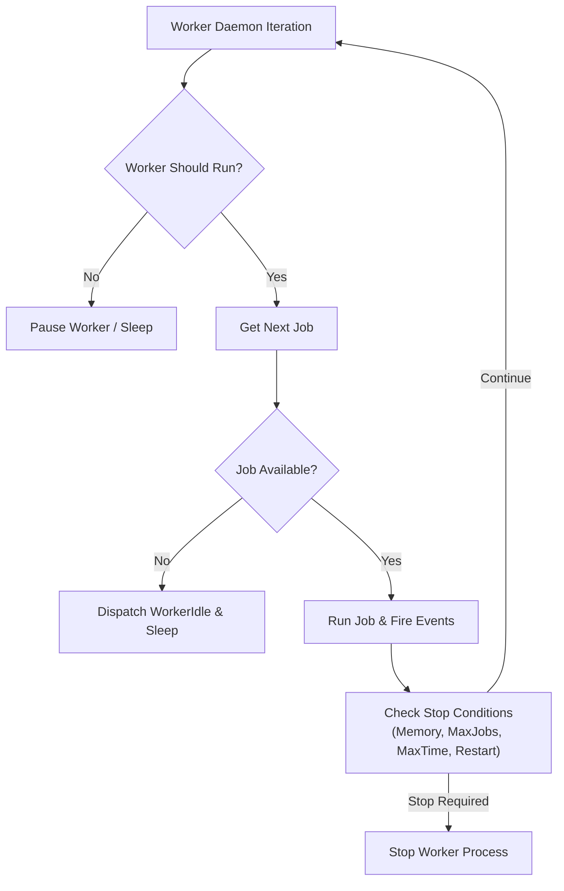

# Queue Workers & Processing

<details>
<summary>Relevant source files</summary>

The following files were used as context for generating this wiki page:

- [src/Illuminate/Queue/Worker.php](https://github.com/laravel/framework/blob/main/src/Illuminate/Queue/Worker.php)
- [src/Illuminate/Queue/Console/WorkCommand.php](https://github.com/laravel/framework/blob/main/src/Illuminate/Queue/Console/WorkCommand.php)
- [src/Illuminate/Queue/CallQueuedHandler.php](https://github.com/laravel/framework/blob/main/src/Illuminate/Queue/CallQueuedHandler.php)
- [src/Illuminate/Queue/QueueServiceProvider.php](https://github.com/laravel/framework/blob/main/src/Illuminate/Queue/QueueServiceProvider.php)
- [src/Illuminate/Console/Scheduling/ScheduleRunCommand.php](https://github.com/laravel/framework/blob/main/src/Illuminate/Console/Scheduling/ScheduleRunCommand.php)
- [src/Illuminate/Foundation/Cloud/Queue.php](https://github.com/laravel/framework/blob/main/src/Illuminate/Foundation/Cloud/Queue.php)
- [src/Illuminate/Queue/Console/MonitorCommand.php](https://github.com/laravel/framework/blob/main/src/Illuminate/Queue/Console/MonitorCommand.php)
- [src/Illuminate/Console/Scheduling/ScheduleWorkCommand.php](https://github.com/laravel/framework/blob/main/src/Illuminate/Console/Scheduling/ScheduleWorkCommand.php)
- [src/Illuminate/Support/Facades/Queue.php](https://github.com/laravel/framework/blob/main/src/Illuminate/Support/Facades/Queue.php)
- [config/queue.php](https://github.com/laravel/framework/blob/main/config/queue.php)
- [src/Illuminate/Queue/Queue.php](https://github.com/laravel/framework/blob/main/src/Illuminate/Queue/Queue.php)
- [src/Illuminate/Bus/Dispatcher.php](https://github.com/laravel/framework/blob/main/src/Illuminate/Bus/Dispatcher.php)
- [src/Illuminate/Queue/RedisQueue.php](https://github.com/laravel/framework/blob/main/src/Illuminate/Queue/RedisQueue.php)
- [src/Illuminate/Queue/Console/PruneBatchesCommand.php](https://github.com/laravel/framework/blob/main/src/Illuminate/Queue/Console/PruneBatchesCommand.php)
- [src/Illuminate/Queue/Listener.php](https://github.com/laravel/framework/blob/main/src/Illuminate/Queue/Listener.php)
- [src/Illuminate/Queue/BackgroundQueue.php](https://github.com/laravel/framework/blob/main/src/Illuminate/Queue/BackgroundQueue.php)
- [src/Illuminate/Queue/Connectors/BackgroundConnector.php](https://github.com/laravel/framework/blob/main/src/Illuminate/Queue/Connectors/BackgroundConnector.php)
- [src/Illuminate/Queue/README.md](https://github.com/laravel/framework/blob/main/src/Illuminate/Queue/README.md)
- [src/Illuminate/Foundation/Console/QueuedCommand.php](https://github.com/laravel/framework/blob/main/src/Illuminate/Foundation/Console/QueuedCommand.php)
- [src/Illuminate/Queue/QueueManager.php](https://github.com/laravel/framework/blob/main/src/Illuminate/Queue/QueueManager.php)
- [src/Illuminate/Bus/BatchRepository.php](https://github.com/laravel/framework/blob/main/src/Illuminate/Bus/BatchRepository.php)
- [src/Illuminate/Contracts/Container/Container.php](https://github.com/laravel/framework/blob/main/src/Illuminate/Contracts/Container/Container.php)
</details>

## Overview

The Queue Workers & Processing subsystem in Laravel is responsible for daemonizing background job execution, managing worker lifecycles, pulling jobs from diverse backends (such as Redis, Database, and SQS), and safely executing jobs through middleware, retries, timeouts, and failure pipelines. At its core, the subsystem decouples time-consuming operations from synchronous web request threads, enabling high-throughput asynchronous application processing. The architecture centres around the `Illuminate\Queue\Worker` daemon loop, the `Illuminate\Queue\Console\WorkCommand` console interface, and the `Illuminate\Queue\CallQueuedHandler` execution engine.

By abstracting queue connections behind `QueueManager` and connector contracts, Laravel allows developers to swap backing stores without modifying application job classes. The worker process continuously polls queues, manages asynchronous operating system signals (`PCNTL`) for graceful termination or pausing, enforces maximum memory and execution time limits, and interfaces with the application container to resolve dependencies, scopes, and database transaction boundaries.

Sources: [src/Illuminate/Queue/Worker.php:1-36](https://github.com/laravel/framework/blob/main/src/Illuminate/Queue/Worker.php#L1-L36)

Sources: [src/Illuminate/Queue/Console/WorkCommand.php:23-66](https://github.com/laravel/framework/blob/main/src/Illuminate/Queue/Console/WorkCommand.php#L23-L66)

Sources: [src/Illuminate/Queue/CallQueuedHandler.php:25-58](https://github.com/laravel/framework/blob/main/src/Illuminate/Queue/CallQueuedHandler.php#L25-L58)

## Worker Daemon Control Flow & Loop Architecture

The `Worker::daemon()` method drives the core continuous execution loop of a queue worker. When started via the `queue:work` Artisan command, the worker initializes asynchronous signal handling if `pcntl` is available, captures the initial queue restart timestamp (`illuminate:queue:restart`), and enters an infinite `while (true)` loop.

Sources: [src/Illuminate/Queue/Worker.php:208-283](https://github.com/laravel/framework/blob/main/src/Illuminate/Queue/Worker.php#L208-L283)

On each iteration, the worker verifies whether it should run by evaluating maintenance mode status, cache-backed pause signals, and `Looping` event responses. If the worker is paused or maintenance mode is active (and force is not enabled), it sleeps for a configured duration before re-evaluating. When active, it invokes scope-reset callbacks to flush container scoped instances, reset query duration counters, and reset logging shared context.

Sources: [src/Illuminate/Queue/Worker.php:222-238](https://github.com/laravel/framework/blob/main/src/Illuminate/Queue/Worker.php#L222-L238)

The worker then requests the next job from the queue connection via `getNextJob()`, registers timeout signal handlers (`SIGALRM`), and passes the job to `runJob()`. After processing, it checks whether termination criteria (such as max jobs, max time, memory limit, or queue restart signals) have been met, terminating gracefully if required.

Sources: [src/Illuminate/Queue/Worker.php:240-282](https://github.com/laravel/framework/blob/main/src/Illuminate/Queue/Worker.php#L240-L282)



Sources: [src/Illuminate/Queue/Worker.php:208-283](https://github.com/laravel/framework/blob/main/src/Illuminate/Queue/Worker.php#L208-L283)

## Call-Chain Execution Walkthrough

When a job is popped from the queue and executed by the worker, it triggers a precise sequence of calls spanning the worker, handler resolution, middleware dispatch, and job completion.

Sources: [src/Illuminate/Queue/Worker.php:500-571](https://github.com/laravel/framework/blob/main/src/Illuminate/Queue/Worker.php#L500-L571)

1. `Worker::runJob()` assigns `$this->currentJob = $job` and invokes `Worker::process()`.
2. `Worker::process()` fires the `JobProcessing` event, verifies whether max attempts have already been exceeded, and calls `$job->fire()`.
3. `$job->fire()` resolves to `CallQueuedHandler::call()`, which unserializes the command payload and checks if the command should be debounced via `DebounceLock`.

Sources: [src/Illuminate/Queue/CallQueuedHandler.php:67-79](https://github.com/laravel/framework/blob/main/src/Illuminate/Queue/CallQueuedHandler.php#L67-L79)

4. `CallQueuedHandler::dispatchThroughMiddleware()` passes the command through its defined middleware pipeline using `Illuminate\Pipeline\Pipeline`.
5. Once the pipeline resolves, `Dispatcher::dispatchNow()` executes the command's `handle()` method or `__invoke()` invokable method.

Sources: [src/Illuminate/Queue/CallQueuedHandler.php:131-157](https://github.com/laravel/framework/blob/main/src/Illuminate/Queue/CallQueuedHandler.php#L131-L157), [src/Illuminate/Bus/Dispatcher.php:118-141](https://github.com/laravel/framework/blob/main/src/Illuminate/Bus/Dispatcher.php#L118-L141)

6. `CallQueuedHandler` releases unique job locks, records successful batch completions or dispatches the next job in a chain, and deletes the job from the queue.

Sources: [src/Illuminate/Queue/CallQueuedHandler.php:89-101](https://github.com/laravel/framework/blob/main/src/Illuminate/Queue/CallQueuedHandler.php#L89-L101)

Furthermore, during asynchronous signal processing, the worker's execution trace follows the exact verified path: `Worker::daemon()` invokes `Worker::listenForSignals()` which binds operating system signal handlers (`SIGQUIT`, `SIGTERM`, `SIGINT`); when an interrupt signal is caught, it triggers `Worker::notifyJobOfSignal()` which resolves the running command handler instance via `CallQueuedHandler::getRunningCommand()` and invokes `interrupted($signal)` if the command implements `Interruptible`.

Sources: [src/Illuminate/Queue/Worker.php:208-212](https://github.com/laravel/framework/blob/main/src/Illuminate/Queue/Worker.php#L208-L212), [src/Illuminate/Queue/Worker.php:885-935](https://github.com/laravel/framework/blob/main/src/Illuminate/Queue/Worker.php#L885-L935), [src/Illuminate/Queue/CallQueuedHandler.php:451-454](https://github.com/laravel/framework/blob/main/src/Illuminate/Queue/CallQueuedHandler.php#L451-L454)



Sources: [src/Illuminate/Queue/CallQueuedHandler.php:67-101](https://github.com/laravel/framework/blob/main/src/Illuminate/Queue/CallQueuedHandler.php#L67-L101)

## Command Execution & Middleware Pipeline

The `CallQueuedHandler` class acts as the intermediary proxy that receives raw queue payloads and invokes the underlying job instance or dispatched command. Before invoking the handler, it verifies un-serialization, checks debounce state, and constructs a execution pipeline.

Sources: [src/Illuminate/Queue/CallQueuedHandler.php:67-87](https://github.com/laravel/framework/blob/main/src/Illuminate/Queue/CallQueuedHandler.php#L67-L87)

Command middleware (defined via a `middleware()` method or public property on the command) are executed sequentially through `Illuminate\Pipeline\Pipeline`. The pipeline's `finally` block ensures that unique job locks bound by `ShouldBeUniqueUntilProcessing` are safely released even if middleware or job handling throws an exception.

Sources: [src/Illuminate/Queue/CallQueuedHandler.php:131-157](https://github.com/laravel/framework/blob/main/src/Illuminate/Queue/CallQueuedHandler.php#L131-L157)

| Middleware / Guard Property | Interface / Class | Purpose |
| :--- | :--- | :--- |
| Unique Jobs | `Illuminate\Contracts\Queue\ShouldBeUnique` | Ensures only one instance of a job exists on the queue across workers. |
| Unique Until Processing | `Illuminate\Contracts\Queue\ShouldBeUniqueUntilProcessing` | Releases the unique lock as soon as the worker picks up the job. |
| Chain Catch Callbacks | `invokeChainCatchCallbacks($e)` | Invoked when a chained job fails, propagating failure down the chain. |
| Delete When Missing Models | `DeleteWhenMissingModels` attribute | Silently deletes the job and records batch success if Eloquent models cannot be found. |

Sources: [src/Illuminate/Queue/CallQueuedHandler.php:231-318](https://github.com/laravel/framework/blob/main/src/Illuminate/Queue/CallQueuedHandler.php#L231-L318)

> [!IMPORTANT]
> When a `ModelNotFoundException` is encountered during job unserialization, `CallQueuedHandler::handleModelNotFound()` checks if `deleteWhenMissingModels` is enabled. If set, the job is deleted and any associated batch progress is updated rather than failing the entire batch.

Sources: [src/Illuminate/Queue/CallQueuedHandler.php:307-318](https://github.com/laravel/framework/blob/main/src/Illuminate/Queue/CallQueuedHandler.php#L307-L318)

## Worker Options & Lifecycle Configuration

Queue workers are configured via `WorkerOptions`, which aggregates execution constraints passed as command-line arguments to `queue:work`. These options control resource bounds, retry counts, sleeping intervals, and graceful shutdown conditions.

Sources: [src/Illuminate/Queue/Console/WorkCommand.php:159-175](https://github.com/laravel/framework/blob/main/src/Illuminate/Queue/Console/WorkCommand.php#L159-L175)

| Option Property | Default | CLI Flag | Description |
| :--- | :--- | :--- | :--- |
| `$name` | `default` | `--name` | The name identifier of the worker instance. |
| `$backoff` | `0` | `--backoff` | Seconds to wait before retrying a failed job. |
| `$memory` | `128` | `--memory` | Memory limit in megabytes before worker exit. |
| `$timeout` | `60` | `--timeout` | Maximum execution time in seconds for a child job. |
| `$sleep` | `3` | `--sleep` | Seconds to sleep when no jobs are available on the queue. |
| `$maxTries` | `1` | `--tries` | Maximum attempt count before logging the job as failed. |
| `$force` | `false` | `--force` | Force the worker to process jobs even in maintenance mode. |
| `$stopWhenEmpty` | `false` | `--stop-when-empty` | Stop the worker process when the queue runs out of jobs. |
| `$maxJobs` | `0` | `--max-jobs` | Maximum number of jobs to process before stopping. |
| `$maxTime` | `0` | `--max-time` | Maximum number of seconds the worker should run. |

Sources: [src/Illuminate/Queue/Console/WorkCommand.php:33-51](https://github.com/laravel/framework/blob/main/src/Illuminate/Queue/Console/WorkCommand.php#L33-L51), [src/Illuminate/Queue/WorkerOptions.php](https://github.com/laravel/framework/blob/main/src/Illuminate/Queue/WorkerOptions.php#L1-L100)



Sources: [src/Illuminate/Queue/Worker.php:222-282](https://github.com/laravel/framework/blob/main/src/Illuminate/Queue/Worker.php#L222-L282)

## Error Handling, Retries & Backoff Strategies

When an exception occurs during job execution, `Worker::handleJobException()` intercepts the failure. It evaluates whether max attempts or maximum exceptions have been exceeded, or whether the exception handler dictates that retries should halt.

Sources: [src/Illuminate/Queue/Worker.php:584-603](https://github.com/laravel/framework/blob/main/src/Illuminate/Queue/Worker.php#L584-L603)

Backoff intervals are resolved dynamically via `Worker::calculateBackoff()`. The worker checks if the job defines a custom `backoff()` method or attribute; otherwise, it falls back to the global worker option. If multiple backoff values are specified as a comma-separated list, the backoff for the current attempt is retrieved using `$job->attempts() - 1` as the array index:

```php
protected function calculateBackoff($job, WorkerOptions $options)
{
    $backoff = explode(
        ',',
        method_exists($job, 'backoff') && ! is_null($job->backoff())
            ? $job->backoff()
            : $options->backoff
    );

    return (int) ($backoff[$job->attempts() - 1] ?? last($backoff));
}
```

Sources: [src/Illuminate/Queue/Worker.php:753-763](https://github.com/laravel/framework/blob/main/src/Illuminate/Queue/Worker.php#L753-L763)

> [!CAUTION]
> If a job exceeds its maximum attempts or max exceptions threshold, `markJobAsFailedIfWillExceedMaxAttempts()` invokes `$job->fail($e)`, moving the job payload to the failed job provider table or file storage, preventing infinite retry loops.

Sources: [src/Illuminate/Queue/Worker.php:665-702](https://github.com/laravel/framework/blob/main/src/Illuminate/Queue/Worker.php#L665-L702)

## Queue Connections & Drivers Architecture

Laravel's queue manager maintains a unified API over multiple underlying drivers registered in `config/queue.php`. The `QueueServiceProvider` binds connectors to the `QueueManager` singleton during application bootstrapping.

Sources: [config/queue.php:32-95](https://github.com/laravel/framework/blob/main/config/queue.php#L32-L95), [src/Illuminate/Queue/QueueServiceProvider.php:78-88](https://github.com/laravel/framework/blob/main/src/Illuminate/Queue/QueueServiceProvider.php#L78-L88)

| Driver Name | Connector Class | Backing Store / Mechanism |
| :--- | :--- | :--- |
| `sync` | `SyncConnector` | Executes jobs synchronously in the current request process. |
| `database` | `DatabaseConnector` | Stores jobs in a relational database table with leasing locks. |
| `redis` | `RedisConnector` | Uses Redis lists, sorted sets, and Lua scripts for atomic pop/push. |
| `beanstalkd` | `BeanstalkdConnector` | Communicates with Beanstalkd work queues over sockets. |
| `sqs` | `SqsConnector` | Integrates with Amazon Simple Queue Service (SQS). |
| `background` | `BackgroundConnector` | Defers sync job execution using concurrent background processes. |
| `deferred` | `DeferredConnector` | Defers job dispatching until application response termination. |
| `failover` | `FailoverConnector` | Fallback wrapper cycling through primary and secondary connections. |
| `null` | `NullConnector` | Discards jobs without processing or storing them. |

Sources: [src/Illuminate/Queue/QueueServiceProvider.php:108-234](https://github.com/laravel/framework/blob/main/src/Illuminate/Queue/QueueServiceProvider.php#L108-L234)

## Signal Handling & Process Control

Workers running on operating systems supporting `pcntl` (Process Control) listen for asynchronous signals during the daemon lifecycle. This enables operators to control worker fleets without forcibly killing processes mid-job.

Sources: [src/Illuminate/Queue/Worker.php:885-911](https://github.com/laravel/framework/blob/main/src/Illuminate/Queue/Worker.php#L885-L911)

- `SIGQUIT`, `SIGTERM`, `SIGINT`: Sets `$this->shouldQuit = true`, dispatches `WorkerInterrupted`, and notifies the running job if it implements `Interruptible`.
- `SIGUSR2`: Pauses the worker (`$this->paused = true`), halting job reservation until resumed.
- `SIGCONT`: Resumes the paused worker (`$this->paused = false`).
- `SIGALRM`: Triggered by timeout handlers when a job exceeds its allotted execution seconds (`timeout`), resulting in job failure tagging and process termination with `EXIT_ERROR`.

Sources: [src/Illuminate/Queue/Worker.php:286-322](https://github.com/laravel/framework/blob/main/src/Illuminate/Queue/Worker.php#L286-L322)

## Design Trade-Offs

| Design Choice | Benefit | Cost |
| :--- | :--- | :--- |
| **Long-running Daemon Process** | High throughput; avoids framework bootstrapping overhead on every job execution. | Susceptible to memory leaks if application state is improperly scoped across jobs. |
| **Container Scope Resetting (`forgetScopedInstances`)** | Prevents cross-job state contamination and memory accumulation. | Slight CPU overhead between job iterations to flush container bindings and logs. |
| **Atomic Redis Lua Scripts** | Ensures thread-safe job migration between delayed, reserved, and pending lists across distributed workers. | Requires Redis server support for Lua execution; harder to debug low-level queue scripts. |
| **Sync vs Queue Drivers** | Identical developer API (`dispatch()`) for local testing (`sync`) and production (`redis`/`sqs`). | Developers must explicitly mark jobs with `ShouldQueue` to decouple execution. |

Sources: [src/Illuminate/Queue/Worker.php:236-238](https://github.com/laravel/framework/blob/main/src/Illuminate/Queue/Worker.php#L236-L238)

Sources: [src/Illuminate/Queue/QueueServiceProvider.php:247-268](https://github.com/laravel/framework/blob/main/src/Illuminate/Queue/QueueServiceProvider.php#L247-L268)

Sources: [src/Illuminate/Queue/RedisQueue.php:118-120](https://github.com/laravel/framework/blob/main/src/Illuminate/Queue/RedisQueue.php#L118-L120)

## Worked Example: Defining and Processing a Queue Job

The following complete example demonstrates how a queueable job is defined with custom retry, timeout, and backoff attributes, and how it is processed by the queue worker subsystem.

Sources: [src/Illuminate/Foundation/Console/QueuedCommand.php:10-40](https://github.com/laravel/framework/blob/main/src/Illuminate/Foundation/Console/QueuedCommand.php#L10-L40)

```php
namespace App\Jobs;

use Illuminate\Bus\Queueable;
use Illuminate\Contracts\Queue\ShouldQueue;
use Illuminate\Queue\InteractsWithQueue;
use Illuminate\Queue\SerializesModels;

class ProcessPodcast implements ShouldQueue
{
    use InteractsWithQueue, Queueable, SerializesModels;

    public $tries = 3;
    public $timeout = 120;
    public $backoff = [10, 30, 60];

    protected $podcastId;

    public function __construct($podcastId)
    {
        $this->podcastId = $podcastId;
    }

    public function handle()
    {
        // Process podcast audio processing logic...
    }

    public function failed(\Throwable $exception)
    {
        // Handle failure after all retries are exhausted...
    }
}
```

Sources: [src/Illuminate/Foundation/Console/QueuedCommand.php:10-40](https://github.com/laravel/framework/blob/main/src/Illuminate/Foundation/Console/QueuedCommand.php#L10-L40)

To dispatch this job onto the queue from an application controller or service, use the dispatch method:

Sources: [src/Illuminate/Bus/Dispatcher.php:84-89](https://github.com/laravel/framework/blob/main/src/Illuminate/Bus/Dispatcher.php#L84-L89)

```php
use App\Jobs\ProcessPodcast;

ProcessPodcast::dispatch(42);
```

Sources: [src/Illuminate/Bus/Dispatcher.php:84-89](https://github.com/laravel/framework/blob/main/src/Illuminate/Bus/Dispatcher.php#L84-L89)

When the worker daemon picks up this job via `queue:work`, `CallQueuedHandler` instantiates the job, injects the underlying queue job instance via `InteractsWithQueue`, runs any defined middleware, and invokes the `handle()` method.

Sources: [src/Illuminate/Queue/CallQueuedHandler.php:67-101](https://github.com/laravel/framework/blob/main/src/Illuminate/Queue/CallQueuedHandler.php#L67-L101)

## Related

- [[Job Batching & Chaining]]
- [[Failed Jobs Handling]]

