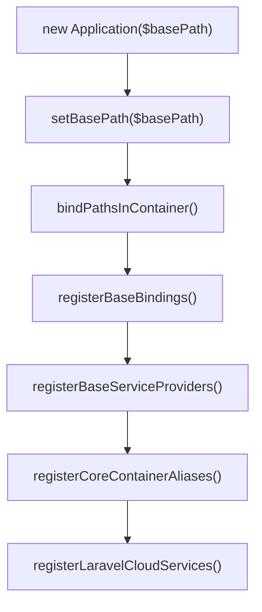
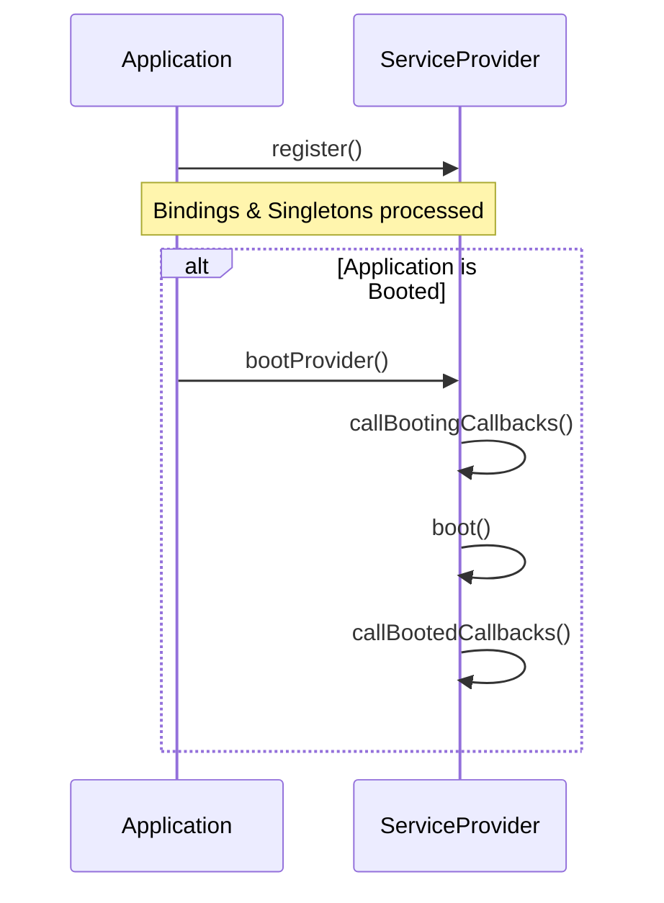
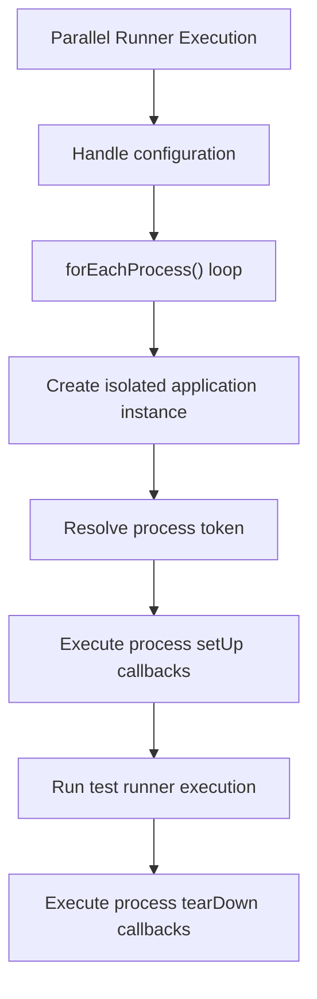

# Quick Start

<details>
<summary>Relevant source files</summary>

The following files were used as context for generating this wiki page:

- [src/Illuminate/Foundation/Providers/FoundationServiceProvider.php](https://github.com/laravel/framework/blob/main/src/Illuminate/Foundation/Providers/FoundationServiceProvider.php)
- [src/Illuminate/Foundation/Testing/Concerns/InteractsWithTestCaseLifecycle.php](https://github.com/laravel/framework/blob/main/src/Illuminate/Foundation/Testing/Concerns/InteractsWithTestCaseLifecycle.php)
- [src/Illuminate/Foundation/Testing/Concerns/InteractsWithContainer.php](https://github.com/laravel/framework/blob/main/src/Illuminate/Foundation/Testing/Concerns/InteractsWithContainer.php)
- [src/Illuminate/Foundation/Application.php](https://github.com/laravel/framework/blob/main/src/Illuminate/Foundation/Application.php)
- [src/Illuminate/Console/Scheduling/ScheduleTestCommand.php](https://github.com/laravel/framework/blob/main/src/Illuminate/Console/Scheduling/ScheduleTestCommand.php)
- [composer.json](https://github.com/laravel/framework/blob/main/composer.json)
- [src/Illuminate/Testing/Concerns/RunsInParallel.php](https://github.com/laravel/framework/blob/main/src/Illuminate/Testing/Concerns/RunsInParallel.php)
- [src/Illuminate/Foundation/Testing/TestCase.php](https://github.com/laravel/framework/blob/main/src/Illuminate/Foundation/Testing/TestCase.php)
- [README.md](https://github.com/laravel/framework/blob/main/README.md)
- [src/Illuminate/Testing/ParallelTesting.php](https://github.com/laravel/framework/blob/main/src/Illuminate/Testing/ParallelTesting.php)
- [src/Illuminate/Foundation/Providers/ArtisanServiceProvider.php](https://github.com/laravel/framework/blob/main/src/Illuminate/Foundation/Providers/ArtisanServiceProvider.php)
- [types/Foundation/Application.php](https://github.com/laravel/framework/blob/main/types/Foundation/Application.php)
- [types/Foundation/Testing/InteractsWithContainer.php](https://github.com/laravel/framework/blob/main/types/Foundation/Testing/InteractsWithContainer.php)
- [types/Container/Container.php](https://github.com/laravel/framework/blob/main/types/Container/Container.php)
- [types/Contracts/Container/Container.php](https://github.com/laravel/framework/blob/main/types/Contracts/Container/Container.php)
- [types/Contracts/Foundation/Application.php](https://github.com/laravel/framework/blob/main/types/Contracts/Foundation/Application.php)
- [src/Illuminate/Testing/composer.json](https://github.com/laravel/framework/blob/main/src/Illuminate/Testing/composer.json)
- [src/Illuminate/Testing/ParallelTestingServiceProvider.php](https://github.com/laravel/framework/blob/main/src/Illuminate/Testing/ParallelTestingServiceProvider.php)
- [src/Illuminate/Container/composer.json](https://github.com/laravel/framework/blob/main/src/Illuminate/Container/composer.json)
- [src/Illuminate/Database/README.md](https://github.com/laravel/framework/blob/main/src/Illuminate/Database/README.md)
- [bin/test.sh](https://github.com/laravel/framework/blob/main/bin/test.sh)
- [src/Illuminate/Testing/ParallelRunner.php](https://github.com/laravel/framework/blob/main/src/Illuminate/Testing/ParallelRunner.php)
- [src/Illuminate/Foundation/Testing/Attributes/UnitTest.php](https://github.com/laravel/framework/blob/main/src/Illuminate/Foundation/Testing/Attributes/UnitTest.php)
- [src/Illuminate/Contracts/Foundation/Application.php](https://github.com/laravel/framework/blob/main/src/Illuminate/Contracts/Foundation/Application.php)
- [src/Illuminate/Foundation/Testing/Concerns/InteractsWithConsole.php](https://github.com/laravel/framework/blob/main/src/Illuminate/Foundation/Testing/Concerns/InteractsWithConsole.php)
- [src/Illuminate/Queue/README.md](https://github.com/laravel/framework/blob/main/src/Illuminate/Queue/README.md)
- [docker-compose.yml](https://github.com/laravel/framework/blob/main/docker-compose.yml)
</details>

## Overview

### Overview

The Quick Start subsystem governs the fundamental initialization, booting sequence, configuration wiring, and test lifecycle orchestration of the framework. At its core, the entry point is mediated by application and container structures—extending the service container—which establish foundational bindings, register core service providers, and orchestrate bootstrapper pipelines.

Sources: [src/Illuminate/Foundation/Application.php:39-233](https://github.com/laravel/framework/blob/main/src/Illuminate/Foundation/Application.php#L39-L233)

By standardizing directory structures, path bindings, and environment detection, the framework solves the problem of rigid initialization dependencies across diverse runtime environments such as HTTP servers, CLI commands, and unit test runners.

Sources: [src/Illuminate/Foundation/Application.php:39-233](https://github.com/laravel/framework/blob/main/src/Illuminate/Foundation/Application.php#L39-L233)

Key architectural decisions include deferring provider registration until service resolution, binding absolute container paths dynamically via `setBasePath()`, and decoupling test environments through test case base classes and parallel runner hooks.

Sources: [src/Illuminate/Foundation/Application.php:39-233](https://github.com/laravel/framework/blob/main/src/Illuminate/Foundation/Application.php#L39-L233), [src/Illuminate/Foundation/Testing/TestCase.php:12-62](https://github.com/laravel/framework/blob/main/src/Illuminate/Foundation/Testing/TestCase.php#L12-L62)

---

## Application Bootstrapping and Path Resolution

The initialization mechanism begins when an application instance is constructed with a given base path. The constructor sequentially invokes `registerBaseBindings()`, `registerBaseServiceProviders()`, `registerCoreContainerAliases()`, and `registerLaravelCloudServices()`.

Sources: [src/Illuminate/Foundation/Application.php:223-233](https://github.com/laravel/framework/blob/main/src/Illuminate/Foundation/Application.php#L223-L233)

Path resolution is handled dynamically through `setBasePath()`, which calls `bindPathsInContainer()` to map paths such as `path`, `path.base`, `path.config`, `path.database`, `path.public`, `path.resources`, and `path.storage` directly into the container instance.

Sources: [src/Illuminate/Foundation/Application.php:403-443](https://github.com/laravel/framework/blob/main/src/Illuminate/Foundation/Application.php#L403-L443)



Sources: [src/Illuminate/Foundation/Application.php:223-233](https://github.com/laravel/framework/blob/main/src/Illuminate/Foundation/Application.php#L223-L233)

> [!NOTE]
> When evaluating bootstrap paths, the application checks if a `.laravel` directory exists under the base path; if present, it assigns it as the bootstrap path, falling back to the standard `bootstrap` directory otherwise.

Sources: [src/Illuminate/Foundation/Application.php:432-436](https://github.com/laravel/framework/blob/main/src/Illuminate/Foundation/Application.php#L432-L436)

---

## Service Provider Architecture and Lifecycle

Applications rely heavily on service providers to register services, event listeners, and Artisan commands. The application class manages service registration via `register()`, which prevents duplicate registrations unless forced, instantiates string-based provider class names, invokes their `register()` methods, and merges optional `bindings` and `singletons` properties.

Sources: [src/Illuminate/Foundation/Application.php:884-932](https://github.com/laravel/framework/blob/main/src/Illuminate/Foundation/Application.php#L884-L932)

If the application has already booted when a provider is registered, `bootProvider()` is invoked immediately. Otherwise, the provider's boot phase is deferred until `boot()` is called across all loaded providers.

Sources: [src/Illuminate/Foundation/Application.php:927-929](https://github.com/laravel/framework/blob/main/src/Illuminate/Foundation/Application.php#L927-L929), [src/Illuminate/Foundation/Application.php:1123-1145](https://github.com/laravel/framework/blob/main/src/Illuminate/Foundation/Application.php#L1123-L1145)



Sources: [src/Illuminate/Foundation/Application.php:884-932](https://github.com/laravel/framework/blob/main/src/Illuminate/Foundation/Application.php#L884-L932)

---

## Core Service Providers and Foundation Bindings

The framework configures core bindings and aggregate service providers during startup. Aggregate service providers handle registering form request services and parallel testing support, while binding key singletons into the container.

Sources: [src/Illuminate/Foundation/Providers/FoundationServiceProvider.php:39-60](https://github.com/laravel/framework/blob/main/src/Illuminate/Foundation/Providers/FoundationServiceProvider.php#L39-L60)

| Abstract / Class | Target / Implementation | Purpose |
| :--- | :--- | :--- |
| `Illuminate\Http\Client\Factory` | `Illuminate\Http\Client\Factory` | HTTP client factory singleton |
| `Illuminate\Foundation\Vite` | `Illuminate\Foundation\Vite` | Vite asset builder singleton |
| `Illuminate\Console\Scheduling\Schedule` | Resolved via console kernel | Console scheduling instance |
| `Illuminate\Contracts\Foundation\MaintenanceMode` | `Illuminate\Foundation\MaintenanceModeManager` | Maintenance mode driver resolution |

Sources: [src/Illuminate/Foundation/Providers/FoundationServiceProvider.php:56-60](https://github.com/laravel/framework/blob/main/src/Illuminate/Foundation/Providers/FoundationServiceProvider.php#L56-L60), [src/Illuminate/Foundation/Providers/FoundationServiceProvider.php:106-111](https://github.com/laravel/framework/blob/main/src/Illuminate/Foundation/Providers/FoundationServiceProvider.php#L106-L111)

> [!IMPORTANT]
> Foundation service providers register request macros such as `validate`, `validateWithBag`, and signature validation helpers (`hasValidSignature`, `hasValidRelativeSignature`) directly onto the request class during their registration phase.

Sources: [src/Illuminate/Foundation/Providers/FoundationServiceProvider.php:148-194](https://github.com/laravel/framework/blob/main/src/Illuminate/Foundation/Providers/FoundationServiceProvider.php#L148-L194)

---

## Console Commands and Artisan Integration

Console operations are integrated through framework service providers, which register core management commands, database migration/seeding tools, and generator commands into the container as singletons or direct commands.

Sources: [src/Illuminate/Foundation/Providers/ArtisanServiceProvider.php:120-264](https://github.com/laravel/framework/blob/main/src/Illuminate/Foundation/Providers/ArtisanServiceProvider.php#L120-L264)

Signal handling availability is resolved dynamically based on console execution, environment, and the presence of the `pcntl` PHP extension.

Sources: [src/Illuminate/Foundation/Providers/ArtisanServiceProvider.php:260-264](https://github.com/laravel/framework/blob/main/src/Illuminate/Foundation/Providers/ArtisanServiceProvider.php#L260-L264)

```php
Signals::resolveAvailabilityUsing(function () {
    return $this->app->runningInConsole()
        && ! $this->app->runningUnitTests()
        && extension_loaded('pcntl');
});
```

Sources: [src/Illuminate/Foundation/Providers/ArtisanServiceProvider.php:260-264](https://github.com/laravel/framework/blob/main/src/Illuminate/Foundation/Providers/ArtisanServiceProvider.php#L260-L264)

The scheduled command tester provides interactive prompts via `Laravel\Prompts\select` to execute scheduled event definitions.

Sources: [src/Illuminate/Console/Scheduling/ScheduleTestCommand.php:34-91](https://github.com/laravel/framework/blob/main/src/Illuminate/Console/Scheduling/ScheduleTestCommand.php#L34-L91)

---

## Testing Environment Infrastructure

Test execution relies on base test case implementations, which boot the framework application instance via `createApplication()`.

Sources: [src/Illuminate/Foundation/Testing/TestCase.php:45-62](https://github.com/laravel/framework/blob/main/src/Illuminate/Foundation/Testing/TestCase.php#L45-L62)

If a test method is decorated with the `UnitTest` attribute, framework booting is bypassed via `withoutBootingFramework()`.

Sources: [src/Illuminate/Foundation/Testing/TestCase.php:111-122](https://github.com/laravel/framework/blob/main/src/Illuminate/Foundation/Testing/TestCase.php#L111-L122)

```php
protected function withoutBootingFramework(): bool
{
    if ($this->withoutBootingFramework !== null) {
        return $this->withoutBootingFramework;
    }

    try {
        return $this->withoutBootingFramework = (new ReflectionMethod(static::class, $this->name()))->getAttributes(UnitTest::class) !== [];
    } catch (Throwable) {
        return $this->withoutBootingFramework = false;
    }
}
```

Sources: [src/Illuminate/Foundation/Testing/TestCase.php:111-122](https://github.com/laravel/framework/blob/main/src/Illuminate/Foundation/Testing/TestCase.php#L111-L122)

State flushing across test lifecycles is handled by `tearDownTheTestEnvironment()`, which flushes state flags across facades, validation, application configuration, and helper components.

Sources: [src/Illuminate/Foundation/Testing/Concerns/InteractsWithTestCaseLifecycle.php:126-215](https://github.com/laravel/framework/blob/main/src/Illuminate/Foundation/Testing/Concerns/InteractsWithTestCaseLifecycle.php#L126-L215)

---

## Parallel Test Execution and Process Isolation

Parallel testing mechanics are implemented across testing traits and runner classes.

Sources: [src/Illuminate/Testing/Concerns/RunsInParallel.php:15-156](https://github.com/laravel/framework/blob/main/src/Illuminate/Testing/Concerns/RunsInParallel.php#L15-L156)

During execution, the test suite iterates through active processes, instantiating isolated application containers per process token.

Sources: [src/Illuminate/Testing/Concerns/RunsInParallel.php:143-156](https://github.com/laravel/framework/blob/main/src/Illuminate/Testing/Concerns/RunsInParallel.php#L143-L156)



Sources: [src/Illuminate/Testing/Concerns/RunsInParallel.php:104-125](https://github.com/laravel/framework/blob/main/src/Illuminate/Testing/Concerns/RunsInParallel.php#L104-L125)

> [!WARNING]
> Parallel test processes require unique tokens (`TEST_TOKEN`) to prevent database collision and race conditions when setting up test databases and caches.

Sources: [src/Illuminate/Testing/ParallelTesting.php:297-325](https://github.com/laravel/framework/blob/main/src/Illuminate/Testing/ParallelTesting.php#L297-L325)

---

## Container Interaction and Test Doubles

The container interaction trait provides helper methods within tests to register instance overrides, mocks, partial mocks, and spies into the container.

Sources: [src/Illuminate/Foundation/Testing/Concerns/InteractsWithContainer.php:13-107](https://github.com/laravel/framework/blob/main/src/Illuminate/Foundation/Testing/Concerns/InteractsWithContainer.php#L13-L107)

Methods such as `swap()`, `mock()`, `partialMock()`, and `spy()` wrap Mockery integrations.

Sources: [src/Illuminate/Foundation/Testing/Concerns/InteractsWithContainer.php:45-107](https://github.com/laravel/framework/blob/main/src/Illuminate/Foundation/Testing/Concerns/InteractsWithContainer.php#L45-L107)

Additionally, framework integration helpers like `withoutVite()`, `withoutMix()`, and `withoutDefer()` swap out asset builders and deferred callback collections with inert test doubles.

Sources: [src/Illuminate/Foundation/Testing/Concerns/InteractsWithContainer.php:126-274](https://github.com/laravel/framework/blob/main/src/Illuminate/Foundation/Testing/Concerns/InteractsWithContainer.php#L126-L274)

```php
protected function swap($abstract, $instance)
{
    return $this->instance($abstract, $instance);
}

protected function instance($abstract, $instance)
{
    $this->app->instance($abstract, $instance);

    return $instance;
}
```

Sources: [src/Illuminate/Foundation/Testing/Concerns/InteractsWithContainer.php:45-64](https://github.com/laravel/framework/blob/main/src/Illuminate/Foundation/Testing/Concerns/InteractsWithContainer.php#L45-L64)

## Related

- [[Overview]]
- [[Dependency Injection Container]]

