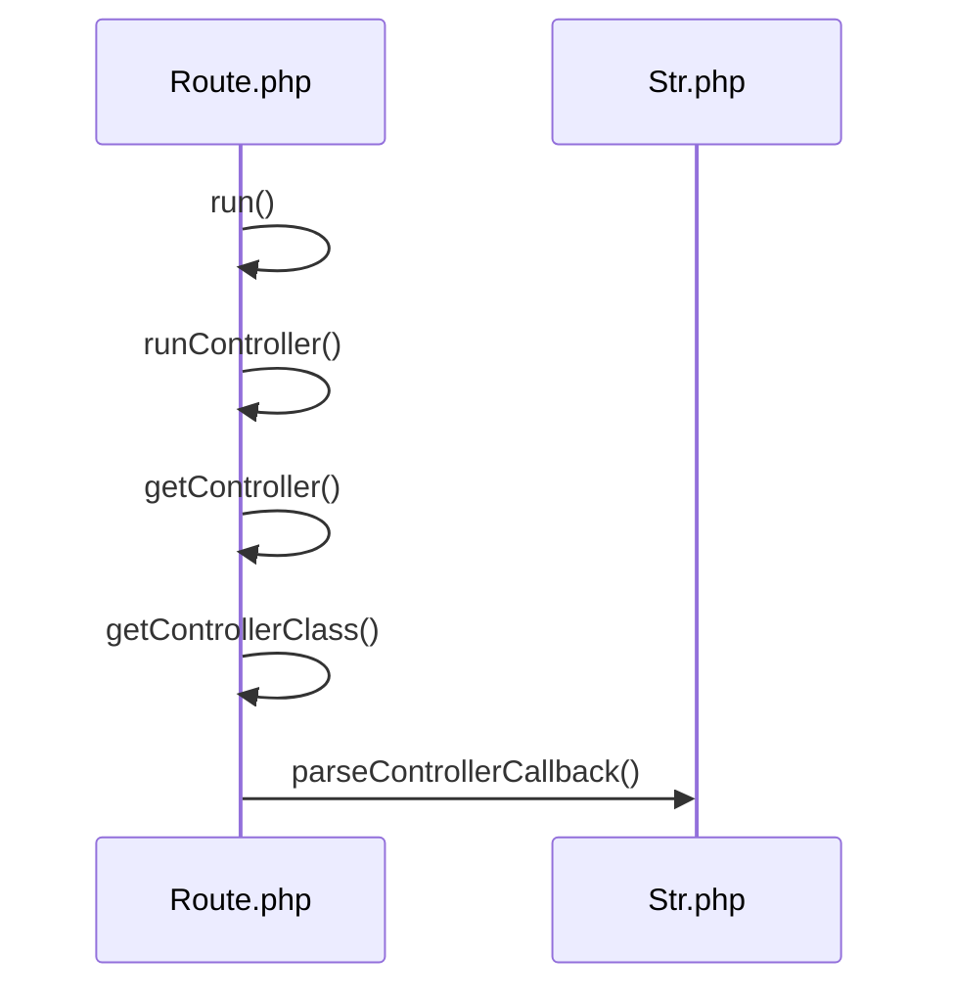
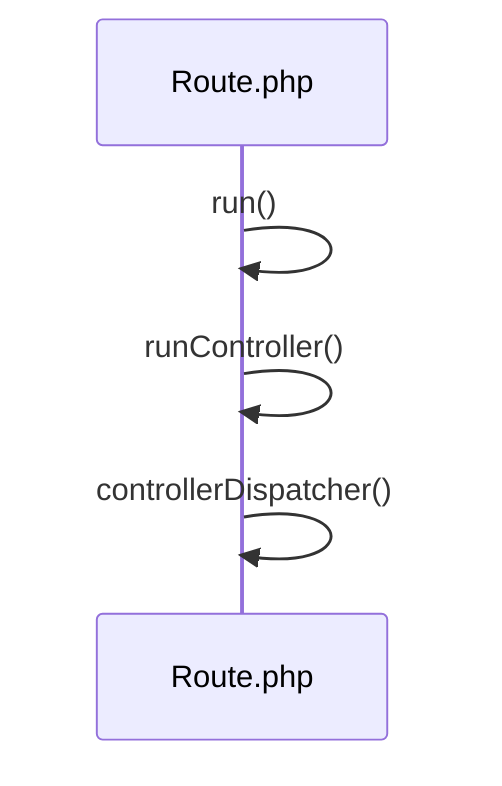
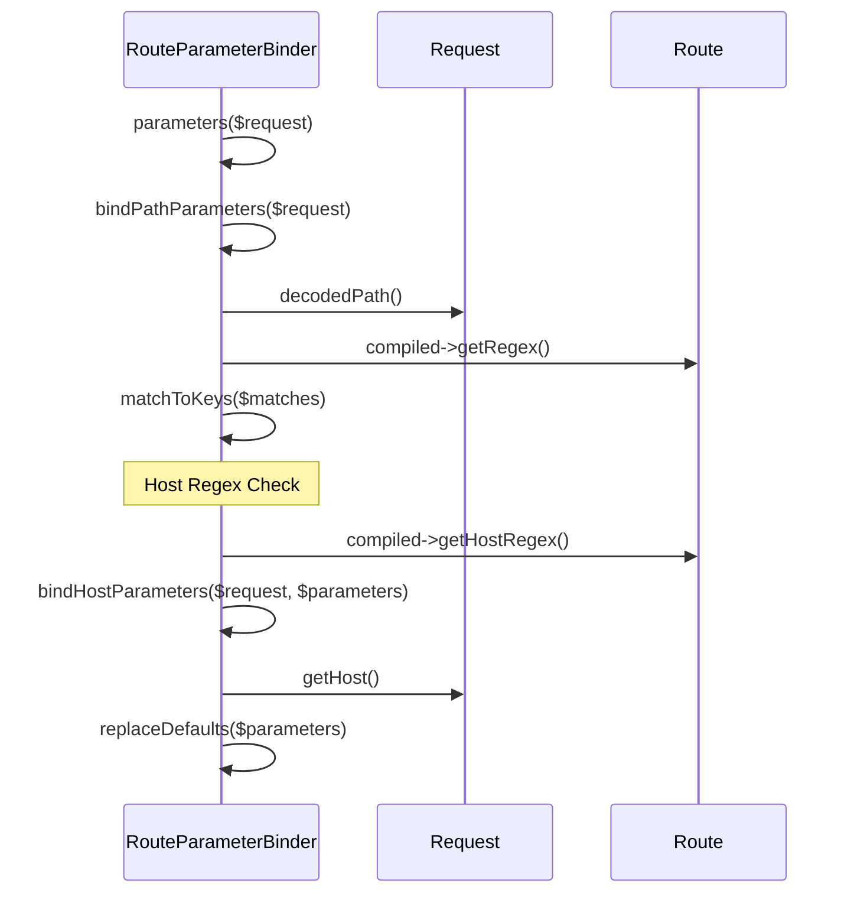

# Routing System

<details>
<summary>Relevant source files</summary>

The following files were used as context for generating this wiki page:

- [src/Illuminate/Routing/RouteUrlGenerator.php](https://github.com/laravel/framework/blob/main/src/Illuminate/Routing/RouteUrlGenerator.php)
- [src/Illuminate/Routing/UrlGenerator.php](https://github.com/laravel/framework/blob/main/src/Illuminate/Routing/UrlGenerator.php)
- [src/Illuminate/Routing/RoutingServiceProvider.php](https://github.com/laravel/framework/blob/main/src/Illuminate/Routing/RoutingServiceProvider.php)
- [src/Illuminate/Routing/Router.php](https://github.com/laravel/framework/blob/main/src/Illuminate/Routing/Router.php)
- [src/Illuminate/Routing/Route.php](https://github.com/laravel/framework/blob/main/src/Illuminate/Routing/Route.php)
- [src/Illuminate/Routing/CompiledRouteCollection.php](https://github.com/laravel/framework/blob/main/src/Illuminate/Routing/CompiledRouteCollection.php)
- [src/Illuminate/Routing/RouteParameterBinder.php](https://github.com/laravel/framework/blob/main/src/Illuminate/Routing/RouteParameterBinder.php)
- [src/Illuminate/Routing/RouteCollection.php](https://github.com/laravel/framework/blob/main/src/Illuminate/Routing/RouteCollection.php)
- [src/Illuminate/Routing/RedirectController.php](https://github.com/laravel/framework/blob/main/src/Illuminate/Routing/RedirectController.php)
- [src/Illuminate/Routing/RouteSignatureParameters.php](https://github.com/laravel/framework/blob/main/src/Illuminate/Routing/RouteSignatureParameters.php)
- [src/Illuminate/Contracts/Routing/UrlGenerator.php](https://github.com/laravel/framework/blob/main/src/Illuminate/Contracts/Routing/UrlGenerator.php)
- [src/Illuminate/Support/Facades/Route.php](https://github.com/laravel/framework/blob/main/src/Illuminate/Support/Facades/Route.php)
- [src/Illuminate/Support/Facades/URL.php](https://github.com/laravel/framework/blob/main/src/Illuminate/Support/Facades/URL.php)
- [src/Illuminate/Routing/ResourceRegistrar.php](https://github.com/laravel/framework/blob/main/src/Illuminate/Routing/ResourceRegistrar.php)
- [src/Illuminate/Container/Container.php](https://github.com/laravel/framework/blob/main/src/Illuminate/Container/Container.php)
</details>

## Overview

The routing system in Laravel provides a comprehensive mechanism for mapping incoming HTTP requests to application endpoints, supporting both fluent closure definitions and controller action dispatches. Operating as a core component of the framework, the router manages URI matching, HTTP verb handling, route grouping, and resource controllers while integrating tightly with the service container for dependency injection and parameter resolution. By compiling routes into optimized collections and offering robust URL generation capabilities—including named routes, parameters, and cryptographic signatures—the routing architecture eliminates manual path construction and ensures clean separation between URL structures and application logic.

Sources: [src/Illuminate/Routing/Router.php:38-117](https://github.com/laravel/framework/blob/main/src/Illuminate/Routing/Router.php#L38-L117), [src/Illuminate/Routing/Route.php:35-36](https://github.com/laravel/framework/blob/main/src/Illuminate/Routing/Route.php#L35-L36), [src/Illuminate/Routing/UrlGenerator.php:19-22](https://github.com/laravel/framework/blob/main/src/Illuminate/Routing/UrlGenerator.php#L19-L22)

## Service Registration and Facade Interfaces

### Service Registration and Facade Interfaces

### Overview

The routing subsystem initializes through `Illuminate\Routing\RoutingServiceProvider`, which registers core services into the service container during application startup. The provider defines singletons and bindings for routing infrastructure components—including the router, URL generator, redirector, dispatchers, and PSR-7 HTTP message factory implementations—and configures extension resolvers for session management and encryption keys.

Sources: [src/Illuminate/Routing/RoutingServiceProvider.php:17-208](https://github.com/laravel/framework/blob/main/src/Illuminate/Routing/RoutingServiceProvider.php#L17-L208)

### Service Provider Container Bindings

The `register()` method invokes individual registration routines that bind key routing contracts and concrete implementations into the container.

```php
public function register()
{
    $this->registerRouter();
    $this->registerUrlGenerator();
    $this->registerRedirector();
    $this->registerPsrRequest();
    $this->registerPsrResponse();
    $this->registerResponseFactory();
    $this->registerCallableDispatcher();
    $this->registerControllerDispatcher();
}
```

Sources: [src/Illuminate/Routing/RoutingServiceProvider.php:24-34](https://github.com/laravel/framework/blob/main/src/Illuminate/Routing/RoutingServiceProvider.php#L24-L34)

| Abstract Binding / Key | Concrete Implementation / Factory | Scope | Purpose |
| :--- | :--- | :--- | :--- |
| `'router'` | `Illuminate\Routing\Router` | Singleton | Central router instance managing routes and middleware |
| `'url'` | `Illuminate\Routing\UrlGenerator` | Singleton | Generates application and named route URLs |
| `'routes'` | `Illuminate\Routing\RouteCollection` | Instance | Route collection instance shared via router and URL generator |
| `'redirect'` | `Illuminate\Routing\Redirector` | Singleton | Creates redirect responses with optional session flashing |
| `Psr\Http\Message\ServerRequestInterface::class` | Symfony PSR-7 Factory closure | Transient (`bind`) | Converts Illuminate requests to PSR-7 server requests |
| `Psr\Http\Message\ResponseInterface::class` | Symfony PSR-7 Factory closure | Transient (`bind`) | Creates PSR-7 response instances |
| `ResponseFactoryContract::class` | `Illuminate\Routing\ResponseFactory` | Singleton | Factory for creating HTTP responses and view responses |
| `CallableDispatcherContract::class` | `Illuminate\Routing\CallableDispatcher` | Singleton | Dispatches callable route actions with dependency injection |
| `ControllerDispatcherContract::class` | `Illuminate\Routing\ControllerDispatcher` | Singleton | Dispatches controller actions with method dependency injection |

Sources: [src/Illuminate/Routing/RoutingServiceProvider.php:43-206](https://github.com/laravel/framework/blob/main/src/Illuminate/Routing/RoutingServiceProvider.php#L43-L206)

### Facade Entry Points

Static entry points to the routing system are provided via framework facades that resolve their underlying components from the service container. `Illuminate\Support\Facades\Route` proxies static method calls to the `'router'` container binding, while `Illuminate\Support\Facades\URL` proxies calls to the `'url'` binding.

```php
class Route extends Facade
{
    protected static function getFacadeAccessor()
    {
        return 'router';
    }
}

class URL extends Facade
{
    protected static function getFacadeAccessor()
    {
        return 'url';
    }
}
```

Sources: [src/Illuminate/Support/Facades/Route.php:109-120](https://github.com/laravel/framework/blob/main/src/Illuminate/Support/Facades/Route.php#L109-L120), [src/Illuminate/Support/Facades/URL.php:55-66](https://github.com/laravel/framework/blob/main/src/Illuminate/Support/Facades/URL.php#L55-L66)

> [!NOTE]
> The `RoutingServiceProvider` extends `url` bindings after initial creation to inject session resolvers, encryption key arrays from application configuration, and rebinding listeners that synchronize cached or updated route collections.

Sources: [src/Illuminate/Routing/RoutingServiceProvider.php:70-92](https://github.com/laravel/framework/blob/main/src/Illuminate/Routing/RoutingServiceProvider.php#L70-L92)

## Route Registration and Resource Mapping

### Overview

Route registration is orchestrated through the `Illuminate\Routing\Router` class, which exposes fluent methods for HTTP verb mapping, route group management, and resource controller mapping. Supported HTTP verbs registered directly on the router include `GET`, `HEAD`, `POST`, `PUT`, `PATCH`, `DELETE`, and `OPTIONS`, along with wildcard definitions via `any()` and catch-all fallbacks via `fallback()`.

Sources: [src/Illuminate/Routing/Router.php:132-248](https://github.com/laravel/framework/blob/main/src/Illuminate/Routing/Router.php#L132-L248)

### Fluent Route Definition and HTTP Verb Mapping

When a verb method such as `get()` or `post()` is invoked, it delegates to `addRoute()`, which passes the methods, URI, and action to the underlying `RouteCollection` after instantiating a `Route` object.

```php
public function get($uri, $action = null)
{
    return $this->addRoute(['GET', 'HEAD'], $uri, $action);
}
```

Sources: [src/Illuminate/Routing/Router.php:158-161](https://github.com/laravel/framework/blob/main/src/Illuminate/Routing/Router.php#L158-L161), [src/Illuminate/Routing/Router.php:547-557](https://github.com/laravel/framework/blob/main/src/Illuminate/Routing/Router.php#L547-L557)

The route creation call chain follows a precise internal sequence within `Router`:
`addRoute()` → `createRoute()` → `convertToControllerAction()` (if controller string is provided) → `newRoute()` → `mergeGroupAttributesIntoRoute()` → `addWhereClausesToRoute()`.

Sources: [src/Illuminate/Routing/Router.php:547-589](https://github.com/laravel/framework/blob/main/src/Illuminate/Routing/Router.php#L547-L589), [src/Illuminate/Routing/Router.php:613-633](https://github.com/laravel/framework/blob/main/src/Illuminate/Routing/Router.php#L613-L633)

> [!NOTE]
> During `createRoute()`, if active route groups exist on the `groupStack`, their attributes—such as middleware, prefixes, and namespaces—are automatically merged into the newly created route instance.

Sources: [src/Illuminate/Routing/Router.php:583-585](https://github.com/laravel/framework/blob/main/src/Illuminate/Routing/Router.php#L583-L585), [src/Illuminate/Routing/Router.php:722-728](https://github.com/laravel/framework/blob/main/src/Illuminate/Routing/Router.php#L722-L728)

### Route Groups and Attribute Stacking

Route groups share common attributes across multiple route definitions by pushing attribute arrays onto the router's internal group stack.

```php
public function group(array $attributes, $routes)
{
    foreach (Arr::wrap($routes) as $groupRoutes) {
        $this->updateGroupStack($attributes);
        $this->loadRoutes($groupRoutes);
        array_pop($this->groupStack);
    }

    return $this;
}
```

Sources: [src/Illuminate/Routing/Router.php:472-486](https://github.com/laravel/framework/blob/main/src/Illuminate/Routing/Router.php#L472-L486)

| Group Attribute Key | Purpose | Handling Mechanism |
| :--- | :--- | :--- |
| `prefix` | Prepends a URI segment to all nested routes | Merged via `RouteGroup::merge` and trimmed with slashes |
| `namespace` | Prepends a PHP namespace to string controller actions | Resolved via `prependGroupNamespace()` |
| `middleware` | Attaches middleware arrays or aliases to nested routes | Accumulated and resolved via `gatherRouteMiddleware()` |
| `controller` | Binds a default controller class for group actions | Prepended via `prependGroupController()` |
| `as` | Prefixes route naming identifiers | Concatenated during route name generation |

Sources: [src/Illuminate/Routing/Router.php:510-513](https://github.com/laravel/framework/blob/main/src/Illuminate/Routing/Router.php#L510-L513), [src/Illuminate/Routing/Router.php:641-673](https://github.com/laravel/framework/blob/main/src/Illuminate/Routing/Router.php#L641-L673), [src/Illuminate/Routing/RouteGroup.php:1-100](https://github.com/laravel/framework/blob/main/src/Illuminate/Routing/RouteGroup.php)

### Resource Registrar Orchestration

Resourceful routing maps conventional CRUD actions to controllers via `Illuminate\Routing\ResourceRegistrar`. When `Router::resource()` or `Router::apiResource()` is called, it checks the IoC container for a bound `ResourceRegistrar` instance or instantiates one directly.

```php
public function resource($name, $controller, array $options = [])
{
    if ($this->container && $this->container->bound(ResourceRegistrar::class)) {
        $registrar = $this->container->make(ResourceRegistrar::class);
    } else {
        $registrar = new ResourceRegistrar($this);
    }

    return new PendingResourceRegistration(
        $registrar, $name, $controller, $options
    );
}
```

Sources: [src/Illuminate/Routing/Router.php:347-358](https://github.com/laravel/framework/blob/main/src/Illuminate/Routing/Router.php#L347-L358)

The registrar iterates over applicable resource methods—defaulting to `index`, `create`, `store`, `show`, `edit`, `update`, and `destroy` for standard resources, and `show`, `edit`, and `update` for singleton resources—and registers individual HTTP verb routes with constructed parameter placeholders.

Sources: [src/Illuminate/Routing/ResourceRegistrar.php:17-29](https://github.com/laravel/framework/blob/main/src/Illuminate/Routing/ResourceRegistrar.php#L17-L29), [src/Illuminate/Routing/ResourceRegistrar.php:99-136](https://github.com/laravel/framework/blob/main/src/Illuminate/Routing/ResourceRegistrar.php#L99-L136), [src/Illuminate/Routing/ResourceRegistrar.php:161-199](https://github.com/laravel/framework/blob/main/src/Illuminate/Routing/ResourceRegistrar.php#L161-L199)

> [!WARNING]
> When defining nested resources with slashes in the resource name (e.g., `photos.comments`), `ResourceRegistrar` automatically splits the segments and applies URI prefix grouping via the router to maintain correct parameter ordering and wildcard resolution.

Sources: [src/Illuminate/Routing/ResourceRegistrar.php:88-92](https://github.com/laravel/framework/blob/main/src/Illuminate/Routing/ResourceRegistrar.php#L88-L92), [src/Illuminate/Routing/ResourceRegistrar.php:209-221](https://github.com/laravel/framework/blob/main/src/Illuminate/Routing/ResourceRegistrar.php#L209-L221)

## Route Collections and Request Matching

### Overview

Route storage and request path matching are managed through concrete implementations of the abstract route collection class. Laravel provides two primary route collection implementations: `Illuminate\Routing\RouteCollection`, which stores runtime route instances in memory and maintains name/action look-up tables, and `Illuminate\Routing\CompiledRouteCollection`, which optimizes matching by leveraging Symfony's compiled URL matcher while falling back to dynamic collections for appended routes.

Sources: [src/Illuminate/Routing/CompiledRouteCollection.php:15-36](https://github.com/laravel/framework/blob/main/src/Illuminate/Routing/CompiledRouteCollection.php#L15-L36), [src/Illuminate/Routing/RouteCollection.php:8-51](https://github.com/laravel/framework/blob/main/src/Illuminate/Routing/RouteCollection.php#L8-L51)

### Route Storage and Look-Up Tables

When a route is added to a standard `RouteCollection`, it is organized into method-specific arrays and flattened arrays, separating domain-scoped routes to preserve domain-first ordering. Simultaneously, the collection populates internal look-up dictionaries to ensure fast name and action resolution without iterating over the entire route set.

```php
public function add(Route $route)
{
    $this->addToCollections($route);

    $this->addLookups($route);

    return $route;
}
```

Sources: [src/Illuminate/Routing/RouteCollection.php:53-65](https://github.com/laravel/framework/blob/main/src/Illuminate/Routing/RouteCollection.php#L53-L65)

| Collection Property | Type | Purpose |
| :--- | :--- | :--- |
| `$routes` | `array` | Stores routes keyed by HTTP verb method and domain/URI combination |
| `$domainRoutes` | `array` | Stores domain-scoped routes keyed by method to maintain domain-first ordering |
| `$allRoutes` | `Route[]` | Flattened collection of non-domain routes |
| `$allDomainRoutes` | `Route[]` | Flattened collection of domain-scoped routes |
| `$nameList` | `Route[]` | Look-up table mapping route names to route instances |
| `$actionList` | `Route[]` | Look-up table mapping controller actions to route instances |

Sources: [src/Illuminate/Routing/RouteCollection.php:10-51](https://github.com/laravel/framework/blob/main/src/Illuminate/Routing/RouteCollection.php#L10-L51)

> [!NOTE]
> When routes are overwritten or fluently defined after initial loading, `refreshNameLookups()` and `refreshActionLookups()` clear and rebuild the internal `$nameList` and `$actionList` dictionaries from the flattened route arrays.

Sources: [src/Illuminate/Routing/RouteCollection.php:154-187](https://github.com/laravel/framework/blob/main/src/Illuminate/Routing/RouteCollection.php#L154-L187)

### Request Path Matching and Compilation

Request matching follows a multi-step execution path depending on whether the route collection has been compiled. In a `CompiledRouteCollection`, the matching process executes through the following call chain:

`CompiledRouteCollection::match()` → `requestWithoutTrailingSlash()` → `CompiledUrlMatcher::matchRequest()` → `getByName()` → `handleMatchedRoute()`

Sources: [src/Illuminate/Routing/CompiledRouteCollection.php:116-151](https://github.com/laravel/framework/blob/main/src/Illuminate/Routing/CompiledRouteCollection.php#L116-L151)

> [!TIP]
> During request path matching in `CompiledRouteCollection`, trailing slashes on URIs are automatically stripped by duplicating the request and mutating `REQUEST_URI` before instantiating the underlying Symfony `CompiledUrlMatcher`.

Sources: [src/Illuminate/Routing/CompiledRouteCollection.php:118-122](https://github.com/laravel/framework/blob/main/src/Illuminate/Routing/CompiledRouteCollection.php#L118-L122), [src/Illuminate/Routing/CompiledRouteCollection.php:159-170](https://github.com/laravel/framework/blob/main/src/Illuminate/Routing/CompiledRouteCollection.php#L159-L170)

If the compiled matcher throws a `ResourceNotFoundException` or `MethodNotAllowedException`, execution falls back to matching against the dynamic `$routes` collection. Furthermore, if the matched compiled route is flagged as a fallback route via `isFallback`, the matcher checks if a non-fallback dynamic route matches the current request instead.

Sources: [src/Illuminate/Routing/CompiledRouteCollection.php:130-148](https://github.com/laravel/framework/blob/main/src/Illuminate/Routing/CompiledRouteCollection.php#L130-L148)

| Design Choice | Benefit | Cost |
| :--- | :--- | :--- |
| In-memory array storage (`RouteCollection`) | Immediate inspection, dynamic appending, and simple debugging | Higher overhead when evaluating large numbers of routes sequentially |
| Compiled URL matcher (`CompiledRouteCollection`) | High-performance regex-based route matching via cached compiled structures | Requires re-compilation step and fallback handling for dynamically appended routes |
| Separate domain-scoped arrays | Maintains strict domain-first evaluation order during request matching | Duplicate storage logic across domain and non-domain array properties |

Sources: [src/Illuminate/Routing/CompiledRouteCollection.php:32-36](https://github.com/laravel/framework/blob/main/src/Illuminate/Routing/CompiledRouteCollection.php#L32-L36), [src/Illuminate/Routing/CompiledRouteCollection.php:118-136](https://github.com/laravel/framework/blob/main/src/Illuminate/Routing/CompiledRouteCollection.php#L118-L136), [src/Illuminate/Routing/RouteCollection.php:17-37](https://github.com/laravel/framework/blob/main/src/Illuminate/Routing/RouteCollection.php#L17-L37)

## Route Execution and Controller Dispatching

### Overview

Route execution begins once a matching route is bound to the current request. The `Route::run()` method determines whether the route action points to a controller or a closure, instantiating containers and handling exceptions accordingly.

Sources: [src/Illuminate/Routing/Route.php:210-223](https://github.com/laravel/framework/blob/main/src/Illuminate/Routing/Route.php#L210-L223)

### Controller Dispatching Call Chains

When a route action references a controller, Laravel resolves the controller class, method, and dispatcher through specific execution sequences. 

The first core sequence parses the controller callback details:
1. `run` — Initiates route action evaluation.
2. `runController` — Executes controller-based route actions.
3. `getController` — Retrieves or instantiates the controller instance via the container.
4. `getControllerClass` — Extracts the controller class name from the parsed callback.
5. `parseControllerCallback` — Splits the action string using `Str::parseCallback()`.



Sources: [src/Illuminate/Routing/Route.php:210-217](https://github.com/laravel/framework/blob/main/src/Illuminate/Routing/Route.php#L210-L217), [src/Illuminate/Routing/Route.php:274-279](https://github.com/laravel/framework/blob/main/src/Illuminate/Routing/Route.php#L274-L279), [src/Illuminate/Routing/Route.php:288-301](https://github.com/laravel/framework/blob/main/src/Illuminate/Routing/Route.php#L288-L301), [src/Illuminate/Routing/Route.php:308-311](https://github.com/laravel/framework/blob/main/src/Illuminate/Routing/Route.php#L308-L311), [src/Illuminate/Routing/Route.php:328-331](https://github.com/laravel/framework/blob/main/src/Illuminate/Routing/Route.php#L328-L331)

The second sequence handles controller dispatching:
1. `run` — Initiates route action evaluation.
2. `runController` — Executes controller-based route actions.
3. `controllerDispatcher` — Resolves or creates a `ControllerDispatcher` contract implementation from the container.



Sources: [src/Illuminate/Routing/Route.php:210-217](https://github.com/laravel/framework/blob/main/src/Illuminate/Routing/Route.php#L210-L217), [src/Illuminate/Routing/Route.php:274-279](https://github.com/laravel/framework/blob/main/src/Illuminate/Routing/Route.php#L274-L279), [src/Illuminate/Routing/Route.php:1450-1457](https://github.com/laravel/framework/blob/main/src/Illuminate/Routing/Route.php#L1450-L1457)

> [!NOTE]
> If a bound route's controller action is invoked, `Route::getController()` ensures the controller is resolved out of the service container only once, caching the resulting instance in `$this->controller`.

Sources: [src/Illuminate/Routing/Route.php:288-301](https://github.com/laravel/framework/blob/main/src/Illuminate/Routing/Route.php#L288-L301)

### Controller and Redirect Execution Details

Controller execution paths interact with specialized dispatchers and controllers, such as the `RedirectController`, which processes route parameters to build dynamic redirections.

```php
public function __invoke(Request $request, UrlGenerator $url)
{
    $parameters = new Collection($request->route()->parameters());

    $status = $parameters->get('status');

    $destination = $parameters->get('destination');

    $parameters->forget('status')->forget('destination');

    $route = (new Route('GET', $destination, [
        'as' => 'laravel_route_redirect_destination',
    ]))->bind($request);

    $parameters = $parameters->only(
        $route->getCompiled()->getPathVariables()
    )->all();

    $url = $url->toRoute($route, $parameters, false);

    if (! str_starts_with($destination, '/') && str_starts_with($url, '/')) {
        $url = Str::after($url, '/');
    }

    return new RedirectResponse($url, $status);
}
```

Sources: [src/Illuminate/Routing/RedirectController.php:19-44](https://github.com/laravel/framework/blob/main/src/Illuminate/Routing/RedirectController.php#L19-L44)

> [!WARNING]
> Any `HttpResponseException` thrown during route execution is caught inside `Route::run()`, which immediately returns its encapsulated response object rather than bubbling the exception further.

Sources: [src/Illuminate/Routing/Route.php:214-222](https://github.com/laravel/framework/blob/main/src/Illuminate/Routing/Route.php#L214-L222)

| Design Choice | Benefit | Cost |
| :--- | :--- | :--- |
| Container-bound `ControllerDispatcher` resolution | Allows swapping out default dispatch logic via container bindings | Extra container lookup overhead during controller invocation |
| Separate `runCallable()` and `runController()` methods | Simplifies handling closures versus string-based class/method strings | Requires upfront type-checking of action structure |
| Automatic HEAD method addition on GET routes | Eliminates redundant manual registration for HEAD requests | May cause unexpected method availability if HEAD is explicitly restricted |

Sources: [src/Illuminate/Routing/Route.php:185-187](https://github.com/laravel/framework/blob/main/src/Illuminate/Routing/Route.php#L185-L187), [src/Illuminate/Routing/Route.php:215-219](https://github.com/laravel/framework/blob/main/src/Illuminate/Routing/Route.php#L215-L219), [src/Illuminate/Routing/Route.php:1450-1457](https://github.com/laravel/framework/blob/main/src/Illuminate/Routing/Route.php#L1450-L1457)

## Parameter Binding and Signature Reflection

### Overview

The parameter binding and signature reflection subsystem handles the extraction of route parameters from incoming request URIs and hosts, applies configured default values, and reflects upon route actions to inspect method or closure signatures. This is managed primarily through `RouteParameterBinder` and `RouteSignatureParameters`.

Sources: [src/Illuminate/Routing/RouteParameterBinder.php:7-116](https://github.com/laravel/framework/blob/main/src/Illuminate/Routing/RouteParameterBinder.php#L7-L116), [src/Illuminate/Routing/RouteSignatureParameters.php:10-60](https://github.com/laravel/framework/blob/main/src/Illuminate/Routing/RouteSignatureParameters.php#L10-L60)

### Route Parameter Binding Walkthrough

When parameters must be extracted for a request, `RouteParameterBinder::parameters()` executes a specific call chain to extract path components, host domains, and merge fallback defaults:



1. `parameters($request)` — Initiates binding by invoking `bindPathParameters($request)`.
2. `bindPathParameters($request)` — Retrieves the decoded request path, applies the compiled route regular expression via `preg_match()`, and filters matches through `matchToKeys()`.
3. `bindHostParameters($request, $parameters)` — If a host regular expression is defined on the compiled route, runs `preg_match()` against `Request::getHost()` and merges host-level keys into the parameter array.
4. `replaceDefaults($parameters)` — Substitutes missing or null parameters with defaults defined on the route instance.

Sources: [src/Illuminate/Routing/RouteParameterBinder.php:32-46](https://github.com/laravel/framework/blob/main/src/Illuminate/Routing/RouteParameterBinder.php#L32-L46), [src/Illuminate/Routing/RouteParameterBinder.php:54-61](https://github.com/laravel/framework/blob/main/src/Illuminate/Routing/RouteParameterBinder.php#L54-L61), [src/Illuminate/Routing/RouteParameterBinder.php:70-75](https://github.com/laravel/framework/blob/main/src/Illuminate/Routing/RouteParameterBinder.php#L70-L75), [src/Illuminate/Routing/RouteParameterBinder.php:102-115](https://github.com/laravel/framework/blob/main/src/Illuminate/Routing/RouteParameterBinder.php#L102-L115)

### Action Signature Reflection

`RouteSignatureParameters::fromAction()` inspects route actions to retrieve their parameter reflections. It determines whether the action uses a serialized closure or a string-based class/method reference.

```php
public static function fromAction(array $action, $conditions = [])
{
    $callback = RouteAction::containsSerializedClosure($action)
        ? unserialize($action['uses'], ['allowed_classes' => [
            \Laravel\SerializableClosure\SerializableClosure::class,
            \Laravel\SerializableClosure\UnsignedSerializableClosure::class,
            \Laravel\SerializableClosure\Serializers\Native::class,
            \Laravel\SerializableClosure\Serializers\Signed::class,
            \Laravel\SerializableClosure\Support\SelfReference::class,
        ]])->getClosure()
        : $action['uses'];

    $parameters = is_string($callback)
        ? static::fromClassMethodString($callback)
        : (new ReflectionFunction($callback))->getParameters();

    return match (true) {
        ! empty($conditions['subClass']) => array_filter($parameters, fn ($p) => Reflector::isParameterSubclassOf($p, $conditions['subClass'])),
        ! empty($conditions['backedEnum']) => array_filter($parameters, fn ($p) => Reflector::isParameterBackedEnumWithStringBackingType($p)),
        default => $parameters,
    };
}
```

Sources: [src/Illuminate/Routing/RouteSignatureParameters.php:19-40](https://github.com/laravel/framework/blob/main/src/Illuminate/Routing/RouteSignatureParameters.php#L19-L40)

> [!WARNING]
> When unserializing closures in route actions, `RouteSignatureParameters::fromAction()` strictly restricts allowed classes to specific `SerializableClosure` implementations to protect against arbitrary object instantiation vulnerabilities.

Sources: [src/Illuminate/Routing/RouteSignatureParameters.php:21-28](https://github.com/laravel/framework/blob/main/src/Illuminate/Routing/RouteSignatureParameters.php#L21-L28)

| Method / Class | Responsibility | Return Type |
| :--- | :--- | :--- |
| `RouteParameterBinder::parameters()` | Coordinates path and host binding along with default replacement | `array` |
| `RouteParameterBinder::matchToKeys()` | Filters regex matches against declared route parameter names and strips empty strings | `array` |
| `RouteSignatureParameters::fromAction()` | Resolves closures or class-method strings and applies condition filters | `array` |
| `RouteSignatureParameters::fromClassMethodString()` | Parses string callbacks like `Controller@method` and creates a `ReflectionMethod` | `array` |

Sources: [src/Illuminate/Routing/RouteParameterBinder.php:32-46](https://github.com/laravel/framework/blob/main/src/Illuminate/Routing/RouteParameterBinder.php#L32-L46), [src/Illuminate/Routing/RouteParameterBinder.php:83-94](https://github.com/laravel/framework/blob/main/src/Illuminate/Routing/RouteParameterBinder.php#L83-L94), [src/Illuminate/Routing/RouteSignatureParameters.php:19-40](https://github.com/laravel/framework/blob/main/src/Illuminate/Routing/RouteSignatureParameters.php#L19-L40), [src/Illuminate/Routing/RouteSignatureParameters.php:50-59](https://github.com/laravel/framework/blob/main/src/Illuminate/Routing/RouteSignatureParameters.php#L50-L59)

## URL Generation and Signed Routes

### Overview

URL generation and signed route validation are coordinated by `UrlGenerator` and `RouteUrlGenerator`. Named route compilation maps parameters into URI wildcards, appends query strings, and handles optional or routable model bindings. Signed routes attach an HMAC-SHA256 signature and expiration timestamp to safeguard external links against tampering.

Sources: [src/Illuminate/Routing/UrlGenerator.php:366-387](https://github.com/laravel/framework/blob/main/src/Illuminate/Routing/UrlGenerator.php#L366-L387), [src/Illuminate/Routing/RouteUrlGenerator.php:78-113](https://github.com/laravel/framework/blob/main/src/Illuminate/Routing/RouteUrlGenerator.php#L78-L113)

### Named Route URL Generation and Parameter Resolution

The `RouteUrlGenerator::to()` method builds the complete route URL by executing a precise sequence of formatting and replacement operations.

```
RouteUrlGenerator::to() → formatParameters() → getRouteDomain() → replaceRootParameters() → replaceRouteParameters() → addQueryString()
```

1. `formatParameters()` — Wraps and normalizes parameters, matching routable models to their route keys and unwrapping backed enums.
2. `getRouteDomain()` — Formats the domain and port if a domain is defined on the route.
3. `replaceRootParameters()` — Compiles the root path with replaced scheme and domain parameters.
4. `replaceRouteParameters()` — Substitutes named and positional wildcard placeholders in the route URI path.
5. `addQueryString()` — Appends remaining parameters as query string keys and restores URL fragments.

Sources: [src/Illuminate/Routing/RouteUrlGenerator.php:78-91](https://github.com/laravel/framework/blob/main/src/Illuminate/Routing/RouteUrlGenerator.php#L78-L91), [src/Illuminate/Routing/RouteUrlGenerator.php:318-325](https://github.com/laravel/framework/blob/main/src/Illuminate/Routing/RouteUrlGenerator.php#L318-L325), [src/Illuminate/Routing/RouteUrlGenerator.php:334-348](https://github.com/laravel/framework/blob/main/src/Illuminate/Routing/RouteUrlGenerator.php#L334-L348), [src/Illuminate/Routing/RouteUrlGenerator.php:379-391](https://github.com/laravel/framework/blob/main/src/Illuminate/Routing/RouteUrlGenerator.php#L379-L391)

> [!WARNING]
> If required parameters remain unassigned after parameter formatting and wildcard replacement, `RouteUrlGenerator::to()` throws a `UrlGenerationException` via `UrlGenerationException::forMissingParameters()`.

Sources: [src/Illuminate/Routing/RouteUrlGenerator.php:93-95](https://github.com/laravel/framework/blob/main/src/Illuminate/Routing/RouteUrlGenerator.php#L93-L95)

### Signed Routes and Signature Validation

The `UrlGenerator` class provides methods to create cryptographic signatures for named routes and validate incoming HTTP requests against those signatures.

```php
$url = $url->signedRoute('unsubscribe', ['user' => 1], now()->addHours(24));

if ($request->hasValidSignature()) {
    // Request signature is valid and has not expired...
}
```

Sources: [src/Illuminate/Routing/UrlGenerator.php:366-387](https://github.com/laravel/framework/blob/main/src/Illuminate/Routing/UrlGenerator.php#L366-L387), [src/Illuminate/Routing/UrlGenerator.php:434-438](https://github.com/laravel/framework/blob/main/src/Illuminate/Routing/UrlGenerator.php#L434-L438)

> [!CAUTION]
> The parameter names `signature` and `expires` are strictly reserved when generating signed routes. Attempting to pass either key in the parameters array triggers an `InvalidArgumentException`.

Sources: [src/Illuminate/Routing/UrlGenerator.php:368-370](https://github.com/laravel/framework/blob/main/src/Illuminate/Routing/UrlGenerator.php#L368-L370), [src/Illuminate/Routing/UrlGenerator.php:397-403](https://github.com/laravel/framework/blob/main/src/Illuminate/Routing/UrlGenerator.php#L397-L403)

| Generator Method | Purpose | Return Type |
| :--- | :--- | :--- |
| `UrlGenerator::route()` | Generates a URL for a named route | `string` |
| `UrlGenerator::signedRoute()` | Creates a signed URL for a named route with an optional expiration | `string` |
| `UrlGenerator::temporarySignedRoute()` | Alias for `signedRoute()` requiring an expiration argument | `string` |
| `UrlGenerator::hasValidSignature()` | Verifies both the HMAC-SHA256 signature and expiration timestamp | `bool` |
| `UrlGenerator::hasCorrectSignature()` | Validates the request signature against registered keys | `bool` |
| `UrlGenerator::signatureHasNotExpired()` | Checks if the expiration timestamp is not in the past | `bool` |

Sources: [src/Illuminate/Routing/UrlGenerator.php:366-387](https://github.com/laravel/framework/blob/main/src/Illuminate/Routing/UrlGenerator.php#L366-L387), [src/Illuminate/Routing/UrlGenerator.php:421-513](https://github.com/laravel/framework/blob/main/src/Illuminate/Routing/UrlGenerator.php#L421-L513), [src/Illuminate/Routing/UrlGenerator.php:525-541](https://github.com/laravel/framework/blob/main/src/Illuminate/Routing/UrlGenerator.php#L525-L541)

## Related

- [[HTTP Request & Response]]
- [[Middleware Pipeline]]

