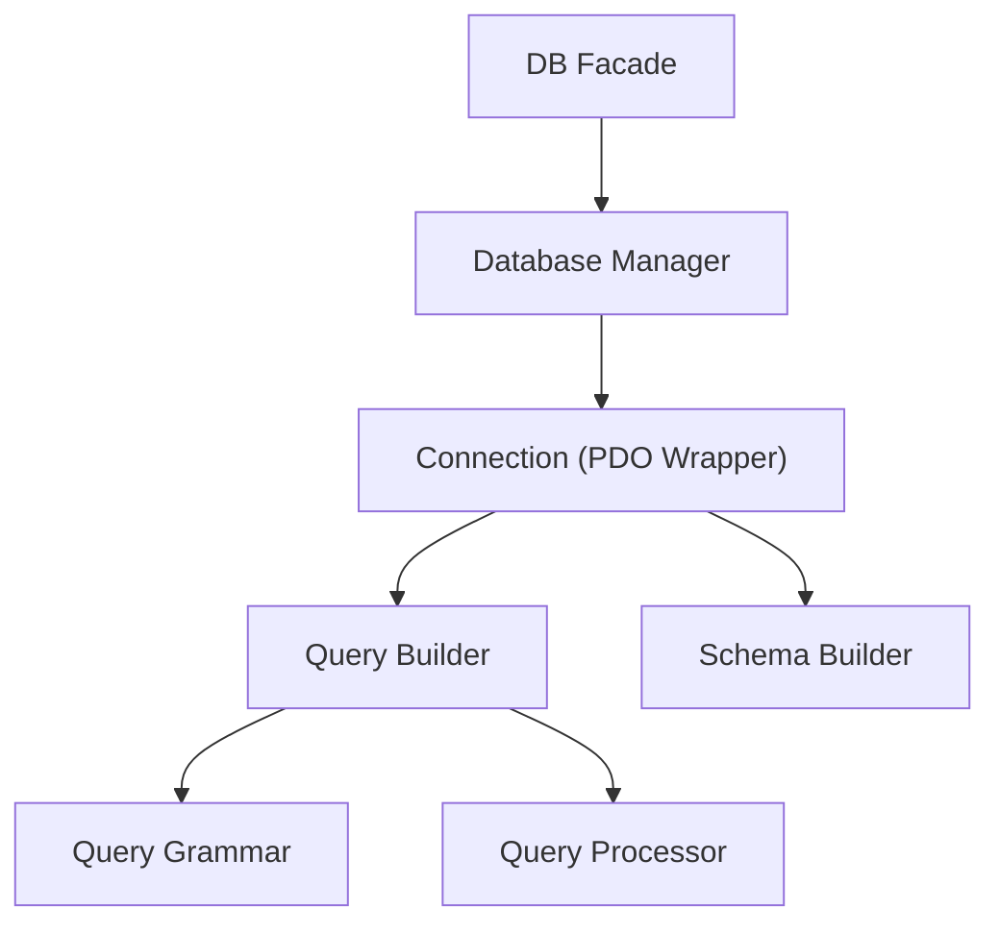
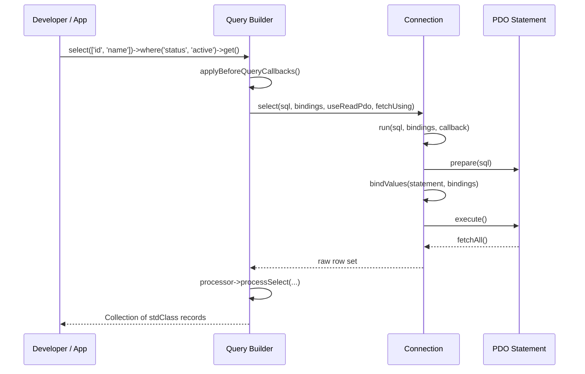
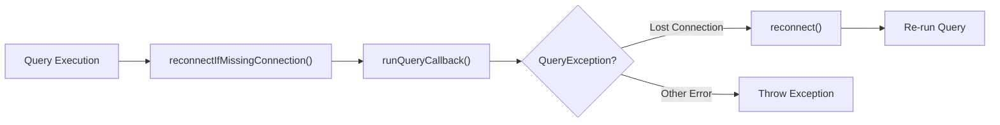

# Section 4 Database

<details>
<summary>Relevant source files</summary>

The following files were used as context for generating this wiki page:

- [types/Database/Eloquent/Builder.php](https://github.com/laravel/framework/blob/main/types/Database/Eloquent/Builder.php)
- [src/Illuminate/Database/Connection.php](https://github.com/laravel/framework/blob/main/src/Illuminate/Database/Connection.php)
- [src/Illuminate/Support/Facades/DB.php](https://github.com/laravel/framework/blob/main/src/Illuminate/Support/Facades/DB.php)
- [src/Illuminate/Database/Query/Builder.php](https://github.com/laravel/framework/blob/main/src/Illuminate/Database/Query/Builder.php)
</details>

## Overview

### Introduction

Database abstractions in Laravel provide a unified, expressive fluent interface for interacting with various database engines through PHP Data Objects (PDO). The database subsystem is architected around foundational components including the connection manager, fluent query builders, schema inspection tools, and static facades that coordinate query compilation, parameter binding, result post-processing, and transaction safety.

Sources: [src/Illuminate/Support/Facades/DB.php:128-156](https://github.com/laravel/framework/blob/main/src/Illuminate/Support/Facades/DB.php#L128-L156)

### Architecture

The primary design philosophy of this subsystem is to decouple database-agnostic query construction from underlying driver-specific SQL generation via query and schema grammars. By abstracting raw SQL construction into composable methods, developers can write portable database code while retaining direct access to raw expressions, transaction hooks, connection failover management, and read-write splitting.

Sources: [src/Illuminate/Database/Connection.php:30-1898](https://github.com/laravel/framework/blob/main/src/Illuminate/Database/Connection.php#L30-L1898)

### Component Interconnection



Sources: [src/Illuminate/Database/Query/Builder.php:38-3963](https://github.com/laravel/framework/blob/main/src/Illuminate/Database/Query/Builder.php#L38-L3963)

## Database Migrations

### Migration Overview and Protection

Database migrations operate as a version control system for database schemas, allowing teams to modify and share database structure definitions across environments. The migration infrastructure is closely tied to schema builders and connection transaction managers to ensure safe execution.

Sources: [src/Illuminate/Support/Facades/DB.php:131-135](https://github.com/laravel/framework/blob/main/src/Illuminate/Support/Facades/DB.php#L131-L135)

### Prohibiting Destructive Commands

The DB facade provides structural control primitives such as `prohibitDestructiveCommands()` to protect production environments from accidental schema destruction via commands like `db:wipe`, `migrate:fresh`, `migrate:reset`, `migrate:rollback`, and `migrate:reset`.

Sources: [src/Illuminate/Support/Facades/DB.php:136-145](https://github.com/laravel/framework/blob/main/src/Illuminate/Support/Facades/DB.php#L136-L145)

## Database Query Builder

### Query Builder Mechanics

The database query builder (`Illuminate\Database\Query\Builder`) provides a convenient, fluent interface for creating and running database queries. It supports select statements, joins, complex where clauses, aggregations, subqueries, unions, vector similarities, and pagination.

Sources: [src/Illuminate/Database/Query/Builder.php:38-51](https://github.com/laravel/framework/blob/main/src/Illuminate/Database/Query/Builder.php#L38-L51)

### State Accumulation and Compilation

Query construction proceeds by chaining methods that accumulate internal state properties (`$bindings`, `$wheres`, `$columns`, `$joins`, `$orders`, `$limit`, `$offset`) before compiling the state into SQL via a query grammar and executing it against a connection instance.

Sources: [src/Illuminate/Database/Query/Builder.php:67-91](https://github.com/laravel/framework/blob/main/src/Illuminate/Database/Query/Builder.php#L67-L91)

### Query Execution Sequence



Sources: [src/Illuminate/Database/Query/Builder.php:38-3963](https://github.com/laravel/framework/blob/main/src/Illuminate/Database/Query/Builder.php#L38-L3963), [src/Illuminate/Database/Connection.php:424-444](https://github.com/laravel/framework/blob/main/src/Illuminate/Database/Connection.php#L424-L444)

### Execution Walkthrough: Pluck Operation, CompileComponents, and GetRawBindings

1. **Call Initiation**: `pluck($column, $key)` invokes `pluck()` at line 3822 in `src/Illuminate/Database/Query/Builder.php`, capturing existing `$columns` state.
2. **Select Execution (`runSelect`)**: Calls `runSelect()` at line 3571 which delegates to the connection's `select()` method using the compiled SQL.
3. **SQL Compilation (`toSql`)**: Within `runSelect()`, `toSql()` is called at line 3447, which triggers `applyBeforeQueryCallbacks()` followed by `grammar->compileSelect($this)` to compile components into SQL strings.
4. **Raw Bindings Retrieval (`getRawBindings`)**: As part of compilation, `getRawBindings()` collects all parameter bindings for substitution and parameterization.
5. **Post-Processing and Stripping**: Raw rows are processed via post-processors, identifiers are stripped via `stripTableForPluck()`, and mapped into collection instances via `pluckFromArrayColumn()` or `pluckFromObjectColumn()`.

Sources: [src/Illuminate/Database/Query/Builder.php:3822-3853](https://github.com/laravel/framework/blob/main/src/Illuminate/Database/Query/Builder.php#L3822-L3853), [src/Illuminate/Database/Query/Builder.php:3571-3576](https://github.com/laravel/framework/blob/main/src/Illuminate/Database/Query/Builder.php#L3571-L3576), [src/Illuminate/Database/Query/Builder.php:3447-3452](https://github.com/laravel/framework/blob/main/src/Illuminate/Database/Query/Builder.php#L3447-L3452)

### Query Clause Types

| Clause Method | Parameter Types | Purpose |
| :--- | :--- | :--- |
| `where` | `Closure\|string\|array\|Expression`, `mixed`, `mixed`, `string` | Adds a basic, column, or nested where constraint |
| `whereIn` | `Expression\|string`, `mixed`, `string`, `bool` | Adds a `where in (values)` SQL clause |
| `whereJsonContains` | `string`, `mixed`, `string`, `bool` | Queries JSON columns for containment |
| `join` | `Expression\|string`, `Closure\|Expression\|string`, `string`, `mixed`, `string`, `bool` | Appends inner, left, right, or cross joins |
| `orderBy` | `Expression\|string`, `SortDirection\|string` | Orders result sets ascending or descending |

Sources: [src/Illuminate/Database/Query/Builder.php:932-1031](https://github.com/laravel/framework/blob/main/src/Illuminate/Database/Query/Builder.php#L932-L1031), [src/Illuminate/Database/Query/Builder.php:1423-1457](https://github.com/laravel/framework/blob/main/src/Illuminate/Database/Query/Builder.php#L1423-L1457), [src/Illuminate/Database/Query/Builder.php:2261-2272](https://github.com/laravel/framework/blob/main/src/Illuminate/Database/Query/Builder.php#L2261-L2272), [src/Illuminate/Database/Query/Builder.php:613-640](https://github.com/laravel/framework/blob/main/src/Illuminate/Database/Query/Builder.php#L613-L640), [src/Illuminate/Database/Query/Builder.php:2976-3002](https://github.com/laravel/framework/blob/main/src/Illuminate/Database/Query/Builder.php#L2976-3002)

> [!NOTE]
> When executing pagination count queries (`runPaginationCountQuery`), if group-by or having clauses are present, the query builder automatically wraps the original query inside a subquery sub-select table (`aggregate_table`) to guarantee accurate total counts.

Sources: [src/Illuminate/Database/Query/Builder.php:3734-3746](https://github.com/laravel/framework/blob/main/src/Illuminate/Database/Query/Builder.php#L3734-L3746)

## Database Schema Builder

### Schema Builder Purpose

The database schema builder (`Illuminate\Database\Schema\Builder`) provides a database-agnostic interface for manipulating tables, columns, indexes, and foreign keys through schema grammars.

Sources: [src/Illuminate/Database/Schema/Builder.php:1-50](https://github.com/laravel/framework/blob/main/src/Illuminate/Database/Schema/Builder.php#L1-L50)

### Schema Builder Instantiation

Connections instantiate schema builders lazily on demand when `getSchemaBuilder()` is invoked.

Sources: [src/Illuminate/Database/Connection.php:324-327](https://github.com/laravel/framework/blob/main/src/Illuminate/Database/Connection.php#L324-L327)

### Lazy Grammar Initialization

```php
public function getSchemaBuilder()
{
    if (is_null($this->schemaGrammar)) {
        $this->useDefaultSchemaGrammar();
    }

    return new SchemaBuilder($this);
}
```

Sources: [src/Illuminate/Database/Connection.php:328-335](https://github.com/laravel/framework/blob/main/src/Illuminate/Database/Connection.php#L328-L335)

## Connection Management and PDO Handling

### Connection Properties

The `Connection` class manages active PDO instances for writes (`$pdo`), reads (`$readPdo`), and direct connections (`$directPdo`). It handles transaction nesting, event dispatching, query logging, escaping, and automatic reconnection upon detecting lost connections.

Sources: [src/Illuminate/Database/Connection.php:39-65](https://github.com/laravel/framework/blob/main/src/Illuminate/Database/Connection.php#L39-L65)

### Reconnection Control Flow



Sources: [src/Illuminate/Database/Connection.php:801-828](https://github.com/laravel/framework/blob/main/src/Illuminate/Database/Connection.php#L801-L828), [src/Illuminate/Database/Connection.php:1032-1041](https://github.com/laravel/framework/blob/main/src/Illuminate/Database/Connection.php#L1032-L1041), [src/Illuminate/Database/Connection.php:1050-1057](https://github.com/laravel/framework/blob/main/src/Illuminate/Database/Connection.php#L1050-L1057)

> [!CAUTION]
> If a query exception occurs while an active database transaction (`$this->transactions >= 1`) is open, automatic reconnection and query retrying are bypassed, immediately re-throwing the exception to protect transaction atomicity.

Sources: [src/Illuminate/Database/Connection.php:1012-1014](https://github.com/laravel/framework/blob/main/src/Illuminate/Database/Connection.php#L1012-L1014)

### Design Trade-offs

| Design Choice | Benefit | Cost |
| :--- | :--- | :--- |
| **Lazy PDO Connection** | Avoids establishing database connections until a query actually requires execution. | Small overhead during connection resolution check on every run cycle. |
| **Read-Write Splitting** | Distributes read queries across replica databases to scale read-heavy applications. | Increased complexity handling sticky sessions after record modifications. |
| **Query Logging** | Enables comprehensive debugging, profiling, and query event listeners. | Consumes additional memory storing query histories when enabled. |

Sources: [src/Illuminate/Database/Connection.php:1296-1301](https://github.com/laravel/framework/blob/main/src/Illuminate/Database/Connection.php#L1296-L1301), [src/Illuminate/Database/Connection.php:1318-1336](https://github.com/laravel/framework/blob/main/src/Illuminate/Database/Connection.php#L1318-L1336), [src/Illuminate/Database/Connection.php:918-920](https://github.com/laravel/framework/blob/main/src/Illuminate/Database/Connection.php#L918-L920)

## Complete Worked Example

### Usage Example

The following example demonstrates setting up a query builder instance via connection, applying constraints, selecting columns, and retrieving results or single values:

```php
use Illuminate\Database\Connection;
use Illuminate\Database\Query\Builder;

// Assuming $connection is a configured instance of Illuminate\Database\Connection
/** @var Connection $connection */

// Begin a fluent query against the 'users' table
$builder = $connection->table('users');

// Apply where clauses, ordering, and limits
$users = $builder
    ->where('votes', '>', 100)
    ->whereIn('status', ['active', 'pending'])
    ->orderBy('created_at', 'desc')
    ->limit(10)
    ->get(['id', 'name', 'email']);

// Retrieve a single scalar value from a query
$activeCount = $connection->table('users')
    ->where('status', '=', 'active')
    ->count();

// Pretend (dry run) to inspect generated SQL without executing
$queries = $connection->pretend(function ($conn) {
    $conn->table('users')->where('id', '=', 1)->update(['status' => 'inactive']);
});
```

Sources: [src/Illuminate/Database/Connection.php:344-347](https://github.com/laravel/framework/blob/main/src/Illuminate/Database/Connection.php#L344-L347), [src/Illuminate/Database/Query/Builder.php:301-317](https://github.com/laravel/framework/blob/main/src/Illuminate/Database/Query/Builder.php#L301-L317), [src/Illuminate/Database/Connection.php:675-691](https://github.com/laravel/framework/blob/main/src/Illuminate/Database/Connection.php#L675-L691)

## Related

- [[Eloquent Models]]
- [[Artisan Console Kernel]]

