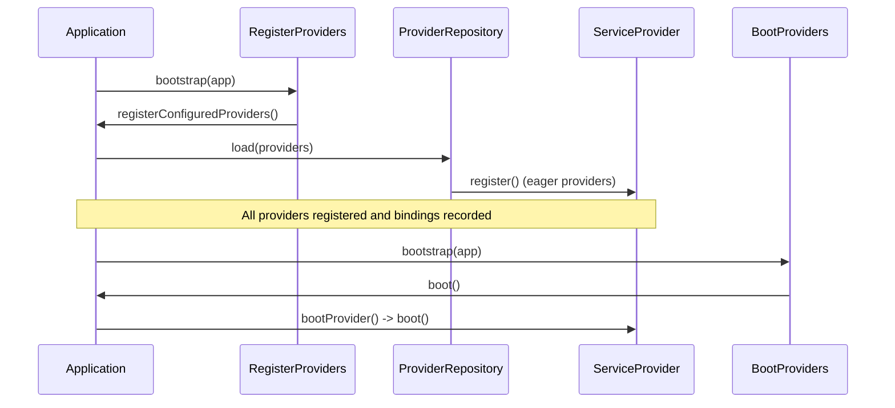

# Service Providers

<details>
<summary>Relevant source files</summary>

The following files were used as context for generating this wiki page:

- [src/Illuminate/Foundation/Application.php](https://github.com/laravel/framework/blob/main/src/Illuminate/Foundation/Application.php)
- [src/Illuminate/Foundation/Providers/FoundationServiceProvider.php](https://github.com/laravel/framework/blob/main/src/Illuminate/Foundation/Providers/FoundationServiceProvider.php)
- [src/Illuminate/Foundation/Configuration/ApplicationBuilder.php](https://github.com/laravel/framework/blob/main/src/Illuminate/Foundation/Configuration/ApplicationBuilder.php)
- [src/Illuminate/Foundation/ProviderRepository.php](https://github.com/laravel/framework/blob/main/src/Illuminate/Foundation/ProviderRepository.php)
- [src/Illuminate/Support/ServiceProvider.php](https://github.com/laravel/framework/blob/main/src/Illuminate/Support/ServiceProvider.php)
- [src/Illuminate/Foundation/Support/Providers/EventServiceProvider.php](https://github.com/laravel/framework/blob/main/src/Illuminate/Foundation/Support/Providers/EventServiceProvider.php)
- [src/Illuminate/Foundation/Bootstrap/RegisterProviders.php](https://github.com/laravel/framework/blob/main/src/Illuminate/Foundation/Bootstrap/RegisterProviders.php)
- [src/Illuminate/Support/DefaultProviders.php](https://github.com/laravel/framework/blob/main/src/Illuminate/Support/DefaultProviders.php)
- [src/Illuminate/Contracts/Foundation/Application.php](https://github.com/laravel/framework/blob/main/src/Illuminate/Contracts/Foundation/Application.php)
- [src/Illuminate/Foundation/Providers/ArtisanServiceProvider.php](https://github.com/laravel/framework/blob/main/src/Illuminate/Foundation/Providers/ArtisanServiceProvider.php)
- [src/Illuminate/Foundation/Bootstrap/BootProviders.php](https://github.com/laravel/framework/blob/main/src/Illuminate/Foundation/Bootstrap/BootProviders.php)
- [src/Illuminate/Support/Facades/App.php](https://github.com/laravel/framework/blob/main/src/Illuminate/Support/Facades/App.php)
- [src/Illuminate/Foundation/Providers/ConsoleSupportServiceProvider.php](https://github.com/laravel/framework/blob/main/src/Illuminate/Foundation/Providers/ConsoleSupportServiceProvider.php)
- [src/Illuminate/Support/AggregateServiceProvider.php](https://github.com/laravel/framework/blob/main/src/Illuminate/Support/AggregateServiceProvider.php)
- [src/Illuminate/Contracts/Container/Container.php](https://github.com/laravel/framework/blob/main/src/Illuminate/Contracts/Container/Container.php)
- [src/Illuminate/Foundation/Precognition.php](https://github.com/laravel/framework/blob/main/src/Illuminate/Foundation/Precognition.php)
</details>

## Overview

### Overview
Service providers are the central connection points for bootstrapping all Laravel applications. They serve as the mechanism by which services, event listeners, middleware, routes, and container bindings are registered into the service container and initialized during the application lifecycle. By decoupling configuration and service initialization from core framework logic, service providers allow the application container to remain extensible, modular, and testable.
Sources: [src/Illuminate/Foundation/Application.php:870-932](https://github.com/laravel/framework/blob/main/src/Illuminate/Foundation/Application.php#L870-L932)

The primary design decision behind Laravel service providers is a strict two-stage lifecycle: **Registration** followed by **Booting**. During registration, providers bind classes into the container without assuming other services are available. During booting, all providers have been registered, ensuring that any service can safely resolve dependencies or interact with other components (such as event dispatchers or routers).
Sources: [src/Illuminate/Support/ServiceProvider.php:83-100](https://github.com/laravel/framework/blob/main/src/Illuminate/Support/ServiceProvider.php#L83-L100)

Service providers interact tightly with the [[Application]] container, `ProviderRepository` manifest compiler, and `ApplicationBuilder` configuration pipeline. Whether loading core framework services, package-discovered providers, or deferred services, providers orchestrate how state flows from configuration files into runtime objects.
Sources: [src/Illuminate/Foundation/Application.php:870-932](https://github.com/laravel/framework/blob/main/src/Illuminate/Foundation/Application.php#L870-L932)

---

## Service Provider Lifecycle and Execution Flow

### Execution Sequence and Bootstrappers
The initialization of service providers operates through a deterministic order of operations managed by the application bootstrapper phases (`RegisterProviders` and `BootProviders`). When an application builds, configured and package providers are processed before container resolution and execution occur.
Sources: [src/Illuminate/Foundation/Bootstrap/RegisterProviders.php:30-38](https://github.com/laravel/framework/blob/main/src/Illuminate/Foundation/Bootstrap/RegisterProviders.php#L30-L38)


Sources: [src/Illuminate/Foundation/Bootstrap/BootProviders.php:15-18](https://github.com/laravel/framework/blob/main/src/Illuminate/Foundation/Bootstrap/BootProviders.php#L15-L18), [src/Illuminate/Foundation/Application.php:1127-1145](https://github.com/laravel/framework/blob/main/src/Illuminate/Foundation/Application.php#L1127-L1145)

### Call-Chain Execution Walkthrough

1. **`RegisterProviders::bootstrap()`**: Initiates registration by checking if the configuration is cached; if not, it merges package and additional custom providers into the `app.providers` configuration array.
Sources: [src/Illuminate/Foundation/Bootstrap/RegisterProviders.php:30-38](https://github.com/laravel/framework/blob/main/src/Illuminate/Foundation/Bootstrap/RegisterProviders.php#L30-L38)

2. **`Application::registerConfiguredProviders()`**: Partitions framework providers from package providers, incorporates manifest providers via `PackageManifest`, and delegates loading to `ProviderRepository`.
Sources: [src/Illuminate/Foundation/Application.php:870-881](https://github.com/laravel/framework/blob/main/src/Illuminate/Foundation/Application.php#L870-L881)

3. **`ProviderRepository::load()`**: Inspects or compiles the service manifest, registers eager service providers by invoking `Application::register()`, and populates deferred service mappings.
Sources: [src/Illuminate/Foundation/ProviderRepository.php:52-78](https://github.com/laravel/framework/blob/main/src/Illuminate/Foundation/ProviderRepository.php#L52-L78)

4. **`Application::register()`**: Instantiates the provider class (if given as a string), invokes its `register()` method, binds any shorthand `$bindings` or `$singletons` properties, and marks the provider as loaded.
Sources: [src/Illuminate/Foundation/Application.php:890-932](https://github.com/laravel/framework/blob/main/src/Illuminate/Foundation/Application.php#L890-L932)

5. **`FoundationServiceProvider::register()`**: Executes aggregated provider registrations and sets up macros such as request validation and exception tracking by calling methods like `registerRequestValidation()`.
Sources: [src/Illuminate/Foundation/Providers/FoundationServiceProvider.php:86-99](https://github.com/laravel/framework/blob/main/src/Illuminate/Foundation/Providers/FoundationServiceProvider.php#L86-L99)

6. **`FoundationServiceProvider::registerRequestValidation()`**: Defines request validation macros on the `Request` class that intercept requests and integrate with Precognition validation hooks.
Sources: [src/Illuminate/Foundation/Providers/FoundationServiceProvider.php:148-160](https://github.com/laravel/framework/blob/main/src/Illuminate/Foundation/Providers/FoundationServiceProvider.php#L148-L160)

7. **`Precognition::afterValidationHook()`**: Invoked during request validation checks, returning a closure that evaluates request headers and aborts with a 204 response if the request is precognitive.
Sources: [src/Illuminate/Foundation/Precognition.php:12-19](https://github.com/laravel/framework/blob/main/src/Illuminate/Foundation/Precognition.php#L12-L19)

8. **`BootProviders::bootstrap()`**: Triggers `Application::boot()` once request handling or console execution begins, iterating through all registered providers to call `bootProvider()`.
Sources: [src/Illuminate/Foundation/Bootstrap/BootProviders.php:15-18](https://github.com/laravel/framework/blob/main/src/Illuminate/Foundation/Bootstrap/BootProviders.php#L15-L18)

9. **`Application::bootProvider()`**: Executes internal booting callbacks, invokes the provider's `boot()` method via container reflection (`$this->call([$provider, 'boot'])`), and fires booted callbacks.
Sources: [src/Illuminate/Foundation/Application.php:1153-1162](https://github.com/laravel/framework/blob/main/src/Illuminate/Foundation/Application.php#L1153-L1162)

---

## Base Service Provider API and Convenience Methods

### Service Provider Utility Methods
The abstract `Illuminate\Support\ServiceProvider` class provides foundational utility methods for registering configuration files, view namespaces, translations, migrations, and asset publishing groups.
Sources: [src/Illuminate/Support/ServiceProvider.php:17-45](https://github.com/laravel/framework/blob/main/src/Illuminate/Support/ServiceProvider.php#L17-L45)

```php
namespace App\Providers;

use Illuminate\Support\ServiceProvider;

class ExampleServiceProvider extends ServiceProvider
{
    public function register(): void
    {
        $this->mergeConfigFrom(__DIR__.'/../../config/example.php', 'example');
    }

    public function boot(): void
    {
        $this->loadViewsFrom(__DIR__.'/../../resources/views', 'example');
        
        if ($this->app->runningInConsole()) {
            $this->publishes([
                __DIR__.'/../../config/example.php' => config_path('example.php'),
            ], 'example-config');
        }
    }
}
```
Sources: [src/Illuminate/Support/ServiceProvider.php:97-100](https://github.com/laravel/framework/blob/main/src/Illuminate/Support/ServiceProvider.php#L97-L100), [src/Illuminate/Support/ServiceProvider.php:163-172](https://github.com/laravel/framework/blob/main/src/Illuminate/Support/ServiceProvider.php#L163-L172)

### Core Protected Methods Table

| Method | Parameters | Purpose | Sources |
| :--- | :--- | :--- | :--- |
| `mergeConfigFrom` | `string $path, string $key` | Merges file configuration with existing container config if not cached. | [src/Illuminate/Support/ServiceProvider.php:163-172](https://github.com/laravel/framework/blob/main/src/Illuminate/Support/ServiceProvider.php#L163-L172) |
| `loadRoutesFrom` | `string $path` | Requires the given routes file unless routes are cached. | [src/Illuminate/Support/ServiceProvider.php:198-203](https://github.com/laravel/framework/blob/main/src/Illuminate/Support/ServiceProvider.php#L198-L203) |
| `loadViewsFrom` | `string|array $path, string $namespace` | Registers view paths and vendor override directories under a namespace. | [src/Illuminate/Support/ServiceProvider.php:212-226](https://github.com/laravel/framework/blob/main/src/Illuminate/Support/ServiceProvider.php#L212-L226) |
| `loadTranslationsFrom` | `string $path, string|null $namespace` | Registers translation paths or namespaces with the translator contract. | [src/Illuminate/Support/ServiceProvider.php:251-256](https://github.com/laravel/framework/blob/main/src/Illuminate/Support/ServiceProvider.php#L251-L256) |
| `loadMigrationsFrom` | `array|string $paths` | Registers database migration directory paths with the migrator. | [src/Illuminate/Support/ServiceProvider.php:277-284](https://github.com/laravel/framework/blob/main/src/Illuminate/Support/ServiceProvider.php#L277-L284) |
| `publishes` | `array $paths, mixed $groups` | Registers asset or configuration paths for publishing via Artisan. | [src/Illuminate/Support/ServiceProvider.php:342-351](https://github.com/laravel/framework/blob/main/src/Illuminate/Support/ServiceProvider.php#L342-L351) |

> [!NOTE]
> Configuration merging (`mergeConfigFrom`) and route loading (`loadRoutesFrom`) automatically check whether configuration or routes are cached (`CachesConfiguration` / `CachesRoutes`) to avoid disk IO overhead in production environments.
Sources: [src/Illuminate/Support/ServiceProvider.php:163-203](https://github.com/laravel/framework/blob/main/src/Illuminate/Support/ServiceProvider.php#L163-L203)

---

## Deferred Providers and Service Manifests

### Deferred Loading Mechanics
To optimize performance, service providers can be deferred so that they are only loaded when one of the specific services they provide is actually requested from the container.
Sources: [src/Illuminate/Support/ServiceProvider.php:542-569](https://github.com/laravel/framework/blob/main/src/Illuminate/Support/ServiceProvider.php#L542-L569)

When `ProviderRepository::compileManifest()` runs, it checks whether the provider implements `DeferrableProvider` (via `isDeferred()`). If deferred, the services returned by `provides()` are recorded in the manifest file (`bootstrap/cache/services.php`) mapping each service key to its provider class, alongside any trigger events defined in `when()`.
Sources: [src/Illuminate/Foundation/ProviderRepository.php:146-152](https://github.com/laravel/framework/blob/main/src/Illuminate/Foundation/ProviderRepository.php#L146-L152)

When `Application::make()` or `Application::resolve()` is invoked for an abstract type, `loadDeferredProviderIfNeeded()` checks `isDeferredService($abstract)`. If matched and uninstantiated, `loadDeferredProvider()` dynamically registers and boots the provider on demand.
Sources: [src/Illuminate/Foundation/Application.php:1009-1023](https://github.com/laravel/framework/blob/main/src/Illuminate/Foundation/Application.php#L1009-L1023), [src/Illuminate/Foundation/Application.php:1094-1099](https://github.com/laravel/framework/blob/main/src/Illuminate/Foundation/Application.php#L1094-L1099)

```php
namespace App\Providers;

use Illuminate\Contracts\Support\DeferrableProvider;
use Illuminate\Support\ServiceProvider;
use App\Services\PdfGenerator;

class PdfServiceProvider extends ServiceProvider implements DeferrableProvider
{
    public function register(): void
    {
        $this->app->singleton(PdfGenerator::class, fn ($app) => new PdfGenerator());
    }

    public function provides(): array
    {
        return [PdfGenerator::class];
    }
}
```
Sources: [src/Illuminate/Contracts/Support/DeferrableProvider.php:1-12](https://github.com/laravel/framework/blob/main/src/Illuminate/Contracts/Support/DeferrableProvider.php#L1-L12), [src/Illuminate/Support/ServiceProvider.php:542-569](https://github.com/laravel/framework/blob/main/src/Illuminate/Support/ServiceProvider.php#L542-L569)

---

## Aggregate Service Providers

### Grouping Providers
An aggregate service provider (`Illuminate\Support\AggregateServiceProvider`) allows grouping multiple provider classes into a single logical provider. Core framework features like console support and foundation services utilize this pattern.
Sources: [src/Illuminate/Support/AggregateServiceProvider.php:5-13](https://github.com/laravel/framework/blob/main/src/Illuminate/Support/AggregateServiceProvider.php#L5-L13)

```php
namespace Illuminate\Foundation\Providers;

use Illuminate\Contracts\Support\DeferrableProvider;
use Illuminate\Database\MigrationServiceProvider;
use Illuminate\Support\AggregateServiceProvider;

class ConsoleSupportServiceProvider extends AggregateServiceProvider implements DeferrableProvider
{
    protected $providers = [
        ArtisanServiceProvider::class,
        MigrationServiceProvider::class,
        ComposerServiceProvider::class,
    ];
}
```
Sources: [src/Illuminate/Foundation/Providers/ConsoleSupportServiceProvider.php:9-21](https://github.com/laravel/framework/blob/main/src/Illuminate/Foundation/Providers/ConsoleSupportServiceProvider.php#L9-L21)

When an aggregate provider is registered, its `register()` method iterates over the `$providers` array and registers each one sequentially through the application container. Similarly, `provides()` merges the provided services of all sub-providers.
Sources: [src/Illuminate/Support/AggregateServiceProvider.php:26-51](https://github.com/laravel/framework/blob/main/src/Illuminate/Support/AggregateServiceProvider.php#L26-L51)

---

## Default and Framework Providers

### Core Default Providers
Laravel defines a standard set of default providers through `Illuminate\Support\DefaultProviders`. These establish core services including authentication, caching, database management, encryption, logging, and routing.
Sources: [src/Illuminate/Support/DefaultProviders.php:5-47](https://github.com/laravel/framework/blob/main/src/Illuminate/Support/DefaultProviders.php#L5-L47)

### Default Provider List Table

| Provider Class | Primary Responsibility | Sources |
| :--- | :--- | :--- |
| `Illuminate\Auth\AuthServiceProvider` | Authentication manager and guard bindings | [src/Illuminate/Support/DefaultProviders.php:22](https://github.com/laravel/framework/blob/main/src/Illuminate/Support/DefaultProviders.php#L22) |
| `Illuminate\Broadcasting\BroadcastServiceProvider` | Event broadcasting and channel routing | [src/Illuminate/Support/DefaultProviders.php:23](https://github.com/laravel/framework/blob/main/src/Illuminate/Support/DefaultProviders.php#L23) |
| `Illuminate\Bus\BusServiceProvider` | Command bus and batching infrastructure | [src/Illuminate/Support/DefaultProviders.php:24](https://github.com/laravel/framework/blob/main/src/Illuminate/Support/DefaultProviders.php#L24) |
| `Illuminate\Cache\CacheServiceProvider` | Cache manager and repository stores | [src/Illuminate/Support/DefaultProviders.php:25](https://github.com/laravel/framework/blob/main/src/Illuminate/Support/DefaultProviders.php#L25) |
| `Illuminate\Foundation\Providers\ConsoleSupportServiceProvider` | Artisan commands, migrations, and composer | [src/Illuminate/Support/DefaultProviders.php:26](https://github.com/laravel/framework/blob/main/src/Illuminate/Support/DefaultProviders.php#L26) |
| `Illuminate\Cookie\CookieServiceProvider` | HTTP cookie jar and queueing factory | [src/Illuminate/Support/DefaultProviders.php:28](https://github.com/laravel/framework/blob/main/src/Illuminate/Support/DefaultProviders.php#L28) |
| `Illuminate\Database\DatabaseServiceProvider` | Database manager and connection resolvers | [src/Illuminate/Support/DefaultProviders.php:29](https://github.com/laravel/framework/blob/main/src/Illuminate/Support/DefaultProviders.php#L29) |
| `Illuminate\Encryption\EncryptionServiceProvider` | Encrypter and string encrypter bindings | [src/Illuminate/Support/DefaultProviders.php:30](https://github.com/laravel/framework/blob/main/src/Illuminate/Support/DefaultProviders.php#L30) |
| `Illuminate\Filesystem\FilesystemServiceProvider` | Filesystem manager and disk drivers | [src/Illuminate/Support/DefaultProviders.php:31](https://github.com/laravel/framework/blob/main/src/Illuminate/Support/DefaultProviders.php#L31) |
| `Illuminate\Foundation\Providers\FoundationServiceProvider` | Request validation macros, dumpers, and exception renderers | [src/Illuminate/Support/DefaultProviders.php:33](https://github.com/laravel/framework/blob/main/src/Illuminate/Support/DefaultProviders.php#L33) |
| `Illuminate\Hashing\HashServiceProvider` | Hashing manager and drivers | [src/Illuminate/Support/DefaultProviders.php:34](https://github.com/laravel/framework/blob/main/src/Illuminate/Support/DefaultProviders.php#L34) |
| `Illuminate\Mail\MailServiceProvider` | Mail manager and mailer services | [src/Illuminate/Support/DefaultProviders.php:35](https://github.com/laravel/framework/blob/main/src/Illuminate/Support/DefaultProviders.php#L35) |
| `Illuminate\Notifications\NotificationServiceProvider` | Notification channels and database tables | [src/Illuminate/Support/DefaultProviders.php:36](https://github.com/laravel/framework/blob/main/src/Illuminate/Support/DefaultProviders.php#L36) |
| `Illuminate\Pagination\PaginationServiceProvider` | Paginator view presenters | [src/Illuminate/Support/DefaultProviders.php:37](https://github.com/laravel/framework/blob/main/src/Illuminate/Support/DefaultProviders.php#L37) |
| `Illuminate\Auth\Passwords\PasswordResetServiceProvider` | Password broker manager | [src/Illuminate/Support/DefaultProviders.php:38](https://github.com/laravel/framework/blob/main/src/Illuminate/Support/DefaultProviders.php#L38) |
| `Illuminate\Queue\QueueServiceProvider` | Queue manager, workers, and failed job providers | [src/Illuminate/Support/DefaultProviders.php:40](https://github.com/laravel/framework/blob/main/src/Illuminate/Support/DefaultProviders.php#L40) |
| `Illuminate\Redis\RedisServiceProvider` | Redis manager and connections | [src/Illuminate/Support/DefaultProviders.php:41](https://github.com/laravel/framework/blob/main/src/Illuminate/Support/DefaultProviders.php#L41) |
| `Illuminate\Session\SessionServiceProvider` | Session manager and store | [src/Illuminate/Support/DefaultProviders.php:42](https://github.com/laravel/framework/blob/main/src/Illuminate/Support/DefaultProviders.php#L42) |
| `Illuminate\Translation\TranslationServiceProvider` | Translator and language localization | [src/Illuminate/Support/DefaultProviders.php:43](https://github.com/laravel/framework/blob/main/src/Illuminate/Support/DefaultProviders.php#L43) |
| `Illuminate\Validation\ValidationServiceProvider` | Validator factory | [src/Illuminate/Support/DefaultProviders.php:44](https://github.com/laravel/framework/blob/main/src/Illuminate/Support/DefaultProviders.php#L44) |
| `Illuminate\View\ViewServiceProvider` | View factory and blade compilers | [src/Illuminate/Support/DefaultProviders.php:45](https://github.com/laravel/framework/blob/main/src/Illuminate/Support/DefaultProviders.php#L45) |

Developers can customize default providers using the fluent methods provided by `DefaultProviders`:
- `merge(array $providers)`: Appends additional provider classes.
- `replace(array $replacements)`: Swaps out default providers with custom implementations.
- `except(array $providers)`: Removes specified default providers from the stack.
Sources: [src/Illuminate/Support/DefaultProviders.php:55-93](https://github.com/laravel/framework/blob/main/src/Illuminate/Support/DefaultProviders.php#L55-L93)

---

## Bootstrap Configuration and Provider File Management

### Managing Provider Registration Files
The application builder (`ApplicationBuilder`) and provider bootstrap file manager allow programmatically adding, removing, and inspecting registered service providers without modifying configuration files directly.
Sources: [src/Illuminate/Foundation/Configuration/ApplicationBuilder.php:76-92](https://github.com/laravel/framework/blob/main/src/Illuminate/Foundation/Configuration/ApplicationBuilder.php#L76-L92)

`ServiceProvider` contains static helper methods to manipulate the `bootstrap/providers.php` file:
- **`addProviderToBootstrapFile(string $provider, ?string $path = null)`**: Appends a provider class to the bootstrap array, ensuring uniqueness and alphabetical sorting, and invalidates OPcache if active.
- **`removeProviderFromBootstrapFile(string|array $providersToRemove, ?string $path = null, bool $strict = false)`**: Removes specified providers from the bootstrap file with optional strict class matching.
Sources: [src/Illuminate/Support/ServiceProvider.php:588-662](https://github.com/laravel/framework/blob/main/src/Illuminate/Support/ServiceProvider.php#L588-L662)

```php
// Programmatically register a provider into bootstrap/providers.php
ServiceProvider::addProviderToBootstrapFile(App\Providers\CustomServiceProvider::class);
```
Sources: [src/Illuminate/Support/ServiceProvider.php:588-617](https://github.com/laravel/framework/blob/main/src/Illuminate/Support/ServiceProvider.php#L588-L617)

---

## Design Trade-Offs

| Design Choice | Benefit | Cost | Sources |
| :--- | :--- | :--- | :--- |
| **Two-Stage Lifecycle (Register vs. Boot)** | Eliminates circular dependency deadlocks by ensuring all bindings exist before any service interacts with another. | Requires developers to keep registration logic strictly separate from service resolution logic. | [src/Illuminate/Foundation/Application.php:903-928](https://github.com/laravel/framework/blob/main/src/Illuminate/Foundation/Application.php#L903-L928) |
| **Deferred Service Manifests** | Speeds up HTTP and CLI requests by skipping unneeded provider instantiation until requested. | Requires disk serialization (`bootstrap/cache/services.php`) and cache invalidation management. | [src/Illuminate/Foundation/ProviderRepository.php:52-78](https://github.com/laravel/framework/blob/main/src/Illuminate/Foundation/ProviderRepository.php#L52-L78) |
| **Aggregate Service Providers** | Simplifies modular package architecture by grouping related sub-providers under a single entry point. | Obscures individual provider initialization ordering unless explicitly traced. | [src/Illuminate/Support/AggregateServiceProvider.php:26-33](https://github.com/laravel/framework/blob/main/src/Illuminate/Support/AggregateServiceProvider.php#L26-L33) |

## Related

- [[Dependency Injection Container]]
- [[Application Lifecycle]]

