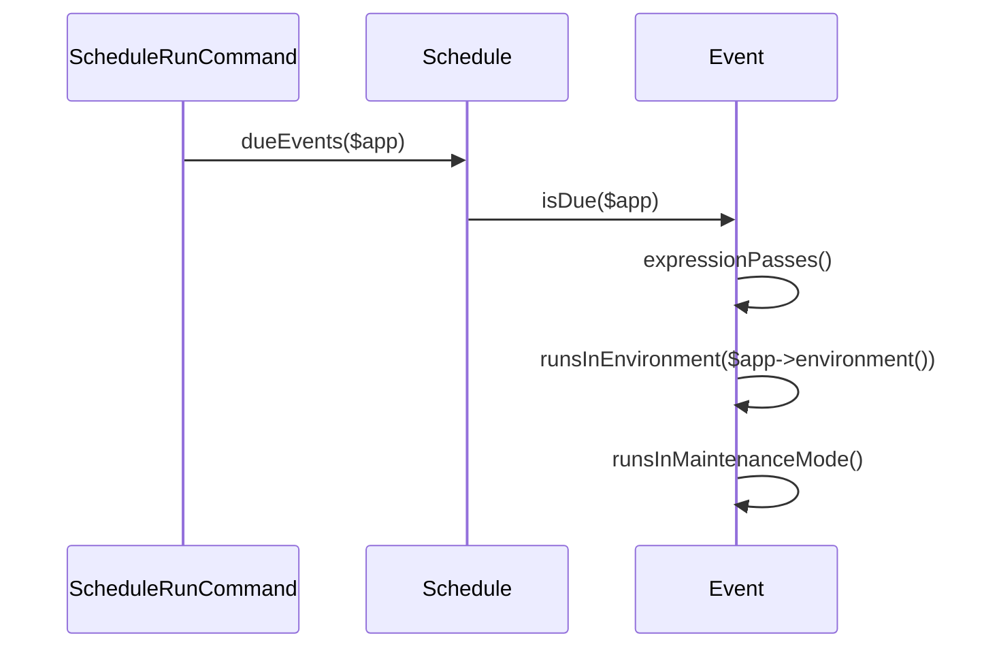

# Task Scheduling

Relevant source files

The following files were used as context for generating this wiki page:

- [src/Illuminate/Console/Scheduling/ScheduleRunCommand.php](https://github.com/laravel/framework/blob/main/src/Illuminate/Console/Scheduling/ScheduleRunCommand.php)
- [src/Illuminate/Console/Scheduling/Schedule.php](https://github.com/laravel/framework/blob/main/src/Illuminate/Console/Scheduling/Schedule.php)
- [src/Illuminate/Console/Scheduling/ScheduleListCommand.php](https://github.com/laravel/framework/blob/main/src/Illuminate/Console/Scheduling/ScheduleListCommand.php)
- [src/Illuminate/Console/Scheduling/Event.php](https://github.com/laravel/framework/blob/main/src/Illuminate/Console/Scheduling/Event.php)
- [src/Illuminate/Console/Scheduling/ScheduleWorkCommand.php](https://github.com/laravel/framework/blob/main/src/Illuminate/Console/Scheduling/ScheduleWorkCommand.php)
- [src/Illuminate/Foundation/Console/Kernel.php](https://github.com/laravel/framework/blob/main/src/Illuminate/Foundation/Console/Kernel.php)
- [src/Illuminate/Support/Facades/Schedule.php](https://github.com/laravel/framework/blob/main/src/Illuminate/Support/Facades/Schedule.php)
- [src/Illuminate/Console/Scheduling/CacheSchedulingMutex.php](https://github.com/laravel/framework/blob/main/src/Illuminate/Console/Scheduling/CacheSchedulingMutex.php)
- [src/Illuminate/Console/Scheduling/CacheEventMutex.php](https://github.com/laravel/framework/blob/main/src/Illuminate/Console/Scheduling/CacheEventMutex.php)
- [src/Illuminate/Console/CacheCommandMutex.php](https://github.com/laravel/framework/blob/main/src/Illuminate/Console/CacheCommandMutex.php)
- [src/Illuminate/Console/Scheduling/ScheduleFinishCommand.php](https://github.com/laravel/framework/blob/main/src/Illuminate/Console/Scheduling/ScheduleFinishCommand.php)
- [src/Illuminate/Console/Scheduling/ScheduleTestCommand.php](https://github.com/laravel/framework/blob/main/src/Illuminate/Console/Scheduling/ScheduleTestCommand.php)
- [src/Illuminate/Console/Scheduling/ManagesAttributes.php](https://github.com/laravel/framework/blob/main/src/Illuminate/Console/Scheduling/ManagesAttributes.php)
- [src/Illuminate/Console/Scheduling/CommandBuilder.php](https://github.com/laravel/framework/blob/main/src/Illuminate/Console/Scheduling/CommandBuilder.php)
- [src/Illuminate/Console/Scheduling/ScheduleClearCacheCommand.php](https://github.com/laravel/framework/blob/main/src/Illuminate/Console/Scheduling/ScheduleClearCacheCommand.php)
- [src/Illuminate/Console/Scheduling/SchedulingMutex.php](https://github.com/laravel/framework/blob/main/src/Illuminate/Console/Scheduling/SchedulingMutex.php)
- [src/Illuminate/Console/Scheduling/EventMutex.php](https://github.com/laravel/framework/blob/main/src/Illuminate/Console/Scheduling/EventMutex.php)

## Overview

Task scheduling provides a fluent, centralized approach for managing and automating background tasks within the application container. By defining scheduled Artisan commands, closures, and queued jobs through a unified schedule definition interface, developers eliminate the need to configure multiple Cron entries on server hosts. The scheduling engine evaluates cron expressions, time constraints, environment filters, and maintenance mode states during execution cycles, while distributed locking mechanisms prevent overlapping task execution across single-server clusters and multiple application processes. Supporting background process builders, output redirection, and specialized Artisan console commands for continuous monitoring, testing, and inspection, the task scheduling component integrates tightly with the console kernel to streamline recurring application workflows.

Sources: [src/Illuminate/Console/Scheduling/ScheduleRunCommand.php:106-146](https://github.com/laravel/framework/blob/main/src/Illuminate/Console/Scheduling/ScheduleRunCommand.php#L106-L146), [src/Illuminate/Console/Scheduling/Schedule.php:147-234](https://github.com/laravel/framework/blob/main/src/Illuminate/Console/Scheduling/Schedule.php#L147-L234), [src/Illuminate/Console/Scheduling/Event.php:135-152](https://github.com/laravel/framework/blob/main/src/Illuminate/Console/Scheduling/Event.php#L135-L152), [src/Illuminate/Foundation/Console/Kernel.php:287-292](https://github.com/laravel/framework/blob/main/src/Illuminate/Foundation/Console/Kernel.php#L287-L292)

## Schedule Manager and Task Registration

### Overview

The `Schedule` container (`Illuminate\Console\Scheduling\Schedule`) manages all scheduled tasks registered within the application. Tasks are added via the console kernel’s `schedule` method, which receives a configured `Schedule` instance resolved by `resolveConsoleSchedule()`. The schedule container supports registering raw Artisan console commands, custom closures, queued or synchronous jobs, and arbitrary system shell commands (`exec`). When tasks are registered, they instantiate either `Event` or `CallbackEvent` objects, merge any pending group attributes, and store references in an internal event array.

Sources: [src/Illuminate/Console/Scheduling/Schedule.php:28-162](https://github.com/laravel/framework/blob/main/src/Illuminate/Console/Scheduling/Schedule.php#L28-L162), [src/Illuminate/Foundation/Console/Kernel.php:273-292](https://github.com/laravel/framework/blob/main/src/Illuminate/Foundation/Console/Kernel.php#L273-L292)

### Task Registration Methods

Scheduled items enter the schedule container through specialized registration methods defined on the `Schedule` class and its facade interface. These methods accept command strings, class names, Symfony command instances, closures, or queue job objects, and return fluent event builder instances for chaining frequency and constraint methods.

| Registration Method | Parameter Signatures | Return Type | Description |
| :--- | :--- | :--- | :--- |
| `call` | `$callback, array $parameters = []` | `CallbackEvent` | Registers a PHP callback or closure to run on schedule. |
| `command` | `$command, array $parameters = []` | `Event` | Registers an Artisan command string, command class name, or Symfony command instance. |
| `job` | `$job, $queue = null, $connection = null` | `CallbackEvent` | Registers a queued or synchronous job class/object with optional queue and connection overrides. |
| `exec` | `$command, array $parameters = []` | `Event` | Registers a raw operating system shell command. |
| `group` | `Closure $events` | `void` | Groups multiple scheduled events under shared pending attributes. |

Sources: [src/Illuminate/Console/Scheduling/Schedule.php:153-343](https://github.com/laravel/framework/blob/main/src/Illuminate/Console/Scheduling/Schedule.php#L153-L343), [src/Illuminate/Support/Facades/Schedule.php:8-12](https://github.com/laravel/framework/blob/main/src/Illuminate/Support/Facades/Schedule.php#L8-L12)

### Job Dispatching and Resolution Walkthrough

When a scheduled job is registered via `job()`, the schedule wraps the execution inside a `CallbackEvent`. The execution flow processes through several internal methods depending on whether the job implements queuing interfaces:

1. `Schedule::job($job, $queue, $connection)` resolves enum values for queue and connection, determines the job name (`displayName()` or `::class`), and registers a `CallbackEvent` wrapping an execution closure.
2. Inside the closure, `Container::getInstance()->make($job)` resolves string-based job class names out of the container.
3. The instance is evaluated with `($job instanceof ShouldQueue)`:
   - If true, execution branches to `dispatchToQueue($job, $queue, $connection)`.
   - If false, execution invokes `dispatchNow($job)` which calls `$this->getDispatcher()->dispatchNow($job)`.
4. Within `dispatchToQueue()`, if the job is a `Closure`, it wraps the closure using `CallQueuedClosure::create($job)` (requiring `illuminate/queue`).
5. If the job implements `ShouldBeUnique`, control delegates to `dispatchUniqueJobToQueue($job, $queue, $connection)`.
6. `dispatchUniqueJobToQueue()` checks container availability for `Cache::class`, instantiates a `UniqueLock`, acquires a lock for the unique job, and dispatches it via the underlying bus dispatcher if successful.

Sources: [src/Illuminate/Console/Scheduling/Schedule.php:204-301](https://github.com/laravel/framework/blob/main/src/Illuminate/Console/Scheduling/Schedule.php#L204-L301)

> [!NOTE]
> Invoking unique scheduled jobs (`ShouldBeUnique`) requires a valid cache driver bound in the service container. If the cache container binding is missing when a unique job is evaluated, a `RuntimeException` is thrown stating that cache drivers are unavailable.
> 
> Sources: [src/Illuminate/Console/Scheduling/Schedule.php:278-281](https://github.com/laravel/framework/blob/main/src/Illuminate/Console/Scheduling/Schedule.php#L278-L281)

> [!WARNING]
> When using `Schedule::group()`, you must invoke an attribute method (such as `Schedule::daily()`) immediately before defining the group closure. If no pending attributes exist when `group()` is invoked, PHP throws a `RuntimeException`.
> 
> Sources: [src/Illuminate/Console/Scheduling/Schedule.php:332-335](https://github.com/laravel/framework/blob/main/src/Illuminate/Console/Scheduling/Schedule.php#L332-L335)

### Design Trade-offs in Task Registration

| Design Choice | Benefit | Cost |
| :--- | :--- | :--- |
| **Container-based Resolution** | Automatically resolves job dependencies and command constructors via DI without manual instantiation. | Relies on a global service container state and requires bindings to be present. |
| **Pending Attribute Stacking (`groupStack`)** | Enables clean grouping of frequency and constraint settings across multiple scheduled tasks. | Requires careful ordering; invoking `group()` without prior attribute calls throws exceptions. |
| **Mutex Auto-Discovery (`__construct`)** | Automatically selects between custom bound mutexes and default cache mutexes. | Adds container resolution overhead during schedule instance construction. |

Sources: [src/Illuminate/Console/Scheduling/Schedule.php:125-144](https://github.com/laravel/framework/blob/main/src/Illuminate/Console/Scheduling/Schedule.php#L125-L144), [src/Illuminate/Console/Scheduling/Schedule.php:331-343](https://github.com/laravel/framework/blob/main/src/Illuminate/Console/Scheduling/Schedule.php#L331-L343)

## Scheduled Task Execution Engine

### Overview

The scheduled task execution engine is driven primarily by the `ScheduleRunCommand` class, executing during `schedule:run` cycles. It determines which scheduled events are due, evaluates environmental constraints, handles maintenance mode and pause flags, executes tasks sequentially or in single-server clusters, and manages repeating sub-minute tasks.

Sources: [src/Illuminate/Console/Scheduling/ScheduleRunCommand.php:21-159](https://github.com/laravel/framework/blob/main/src/Illuminate/Console/Scheduling/ScheduleRunCommand.php#L21-L159)

### Execution Call-Chain Walkthroughs

#### Expression Passing Trace
1. `handle` in `ScheduleRunCommand` invokes `$this->schedule->dueEvents($this->laravel)`.
Sources: [src/Illuminate/Console/Scheduling/ScheduleRunCommand.php:114-114](https://github.com/laravel/framework/blob/main/src/Illuminate/Console/Scheduling/ScheduleRunCommand.php#L114-L114)
2. `dueEvents` in `Schedule` filters registered events using `isDue($app)`.
Sources: [src/Illuminate/Console/Scheduling/Schedule.php:433-436](https://github.com/laravel/framework/blob/main/src/Illuminate/Console/Scheduling/Schedule.php#L433-L436)
3. `isDue` in `Event` invokes `expressionPasses()` to validate timing.
Sources: [src/Illuminate/Console/Scheduling/Event.php:285-293](https://github.com/laravel/framework/blob/main/src/Illuminate/Console/Scheduling/Event.php#L285-L293)
4. `expressionPasses` in `Event` evaluates a `CronExpression` instance against the current or timezone-adjusted date.
Sources: [src/Illuminate/Console/Scheduling/Event.php:320-329](https://github.com/laravel/framework/blob/main/src/Illuminate/Console/Scheduling/Event.php#L320-L329)

#### Environment Verification Trace
1. `handle` in `ScheduleRunCommand` invokes `$this->schedule->dueEvents($this->laravel)`.
Sources: [src/Illuminate/Console/Scheduling/ScheduleRunCommand.php:114-114](https://github.com/laravel/framework/blob/main/src/Illuminate/Console/Scheduling/ScheduleRunCommand.php#L114-L114)
2. `dueEvents` in `Schedule` delegates to `Event::isDue($app)`.
Sources: [src/Illuminate/Console/Scheduling/Schedule.php:433-436](https://github.com/laravel/framework/blob/main/src/Illuminate/Console/Scheduling/Schedule.php#L433-L436)
3. `isDue` in `Event` calls `runsInEnvironment($app->environment())`.
Sources: [src/Illuminate/Console/Scheduling/Event.php:285-293](https://github.com/laravel/framework/blob/main/src/Illuminate/Console/Scheduling/Event.php#L285-L293)
4. `runsInEnvironment` in `Event` checks whether `$this->environments` is empty or contains the given environment string.
Sources: [src/Illuminate/Console/Scheduling/Event.php:337-340](https://github.com/laravel/framework/blob/main/src/Illuminate/Console/Scheduling/Event.php#L337-L340)

#### Maintenance Mode Check Trace
1. `handle` in `ScheduleRunCommand` retrieves due events via `$this->schedule->dueEvents($this->laravel)`.
Sources: [src/Illuminate/Console/Scheduling/ScheduleRunCommand.php:114-114](https://github.com/laravel/framework/blob/main/src/Illuminate/Console/Scheduling/ScheduleRunCommand.php#L114-L114)
2. `dueEvents` in `Schedule` invokes `isDue($app)` on registered events.
Sources: [src/Illuminate/Console/Scheduling/Schedule.php:433-436](https://github.com/laravel/framework/blob/main/src/Illuminate/Console/Scheduling/Schedule.php#L433-L436)
3. `isDue` in `Event` checks `!$this->runsInMaintenanceMode() && $app->isDownForMaintenance()`.
Sources: [src/Illuminate/Console/Scheduling/Event.php:285-289](https://github.com/laravel/framework/blob/main/src/Illuminate/Console/Scheduling/Event.php#L285-L289)
4. `runsInMaintenanceMode` in `Event` returns the boolean value of `$this->evenInMaintenanceMode`.
Sources: [src/Illuminate/Console/Scheduling/Event.php:300-303](https://github.com/laravel/framework/blob/main/src/Illuminate/Console/Scheduling/Event.php#L300-L303)

Sources: [src/Illuminate/Console/Scheduling/ScheduleRunCommand.php:114-114](https://github.com/laravel/framework/blob/main/src/Illuminate/Console/Scheduling/ScheduleRunCommand.php#L114-L114), [src/Illuminate/Console/Scheduling/Schedule.php:433-436](https://github.com/laravel/framework/blob/main/src/Illuminate/Console/Scheduling/Schedule.php#L433-L436), [src/Illuminate/Console/Scheduling/Event.php:285-303](https://github.com/laravel/framework/blob/main/src/Illuminate/Console/Scheduling/Event.php#L285-L303), [src/Illuminate/Console/Scheduling/Event.php:320-340](https://github.com/laravel/framework/blob/main/src/Illuminate/Console/Scheduling/Event.php#L320-L340)

> [!NOTE]
> If an application enters maintenance mode while sub-minute repeatable events are actively running, `repeatEvents()` checks `$this->laravel->isDownForMaintenance()` on each loop iteration and skips events that do not explicitly permit execution in maintenance mode via `runsInMaintenanceMode()`.
> 
> Sources: [src/Illuminate/Console/Scheduling/ScheduleRunCommand.php:261-265](https://github.com/laravel/framework/blob/main/src/Illuminate/Console/Scheduling/ScheduleRunCommand.php#L261-L265)

### Execution Engine Architecture and Controls

The command execution engine inspects pause signals, interruption requests, and single-server cluster coordination before dispatching tasks.

| Method / Property | Type | Default | Purpose |
| :--- | :--- | :--- | :--- |
| `Schedule::$pausable` | `bool` | `true` | Indicates whether the schedule should check the cache for pause signals. |
| `Schedule::$interruptible` | `bool` | `true` | Indicates whether the schedule should check the cache for interruption signals. |
| `ScheduleRunCommand::$startedAt` | `Carbon` | Current timestamp | Records the exact 24-hour timestamp when the scheduler command started running. |
| `ScheduleRunCommand::$eventsRan` | `bool` | `false` | Tracks whether any scheduled events have executed during the current run cycle. |

Sources: [src/Illuminate/Console/Scheduling/Schedule.php:109-116](https://github.com/laravel/framework/blob/main/src/Illuminate/Console/Scheduling/Schedule.php#L109-L116), [src/Illuminate/Console/Scheduling/ScheduleRunCommand.php:48-58](https://github.com/laravel/framework/blob/main/src/Illuminate/Console/Scheduling/ScheduleRunCommand.php#L48-L58)

> [!WARNING]
> When `Schedule::withoutInterruptionPolling()` is invoked, both `Schedule::$pausable` and `Schedule::$interruptible` are set to `false`, disabling cache lookups for pause and interrupt signals to optimize execution performance.
> 
> Sources: [src/Illuminate/Console/Scheduling/Schedule.php:513-517](https://github.com/laravel/framework/blob/main/src/Illuminate/Console/Scheduling/Schedule.php#L513-L517)

### Design Trade-offs in Task Execution

| Design Choice | Benefit | Cost |
| :--- | :--- | :--- |
| **Cache-backed Pause & Interrupt Polling** | Allows external control of running schedules across distributed nodes without local process signals. | Introduces cache read overhead during task evaluation and sub-minute loops. |
| **Sub-Minute `repeatEvents` Sleep Loops** | Enables sub-minute precision tasks using a `100_000` microsecond sleep interval within the minute boundary. | Keeps worker processes active and looping for the duration of the minute. |
| **Single-Server Mutex Verification** | Prevents duplicate execution across multiple application servers via `runSingleServerEvent`. | Relies on distributed cache locks which can fail or expire under high latency. |

Sources: [src/Illuminate/Console/Scheduling/ScheduleRunCommand.php:139-176](https://github.com/laravel/framework/blob/main/src/Illuminate/Console/Scheduling/ScheduleRunCommand.php#L139-L176), [src/Illuminate/Console/Scheduling/ScheduleRunCommand.php:239-290](https://github.com/laravel/framework/blob/main/src/Illuminate/Console/Scheduling/ScheduleRunCommand.php#L239-L290), [src/Illuminate/Console/Scheduling/Schedule.php:422-425](https://github.com/laravel/framework/blob/main/src/Illuminate/Console/Scheduling/Schedule.php#L422-L425)

## Mutex Locking and Overlapping Protection

### Overview

Mutex locking and overlapping protection mechanisms prevent concurrent command or event execution across distributed processes and single-server clusters. The framework coordinates access using dedicated mutex contracts implemented via cache stores: `SchedulingMutex`, `EventMutex`, and `CommandMutex`.

Sources: [src/Illuminate/Console/Scheduling/SchedulingMutex.php:7-26](https://github.com/laravel/framework/blob/main/src/Illuminate/Console/Scheduling/SchedulingMutex.php#L7-L26), [src/Illuminate/Console/Scheduling/EventMutex.php:5-30](https://github.com/laravel/framework/blob/main/src/Illuminate/Console/Scheduling/EventMutex.php#L5-L30), [src/Illuminate/Console/CacheCommandMutex.php:11-141](https://github.com/laravel/framework/blob/main/src/Illuminate/Console/CacheCommandMutex.php#L11-L141)

### Mutex Execution and Evaluation Mechanics

When evaluating scheduled tasks or isolatable Artisan commands, the framework checks and acquires locks according to store capabilities. Cache stores that implement `LockProvider` (excluding `DynamoDbStore`) use native atomic locks; otherwise, fallback methods such as `add()` are used.

> [!WARNING]
> `DynamoDbStore` is explicitly excluded from using native cache locks across `CacheSchedulingMutex`, `CacheEventMutex`, and `CacheCommandMutex`, forcing standard cache key operations even when implementing `LockProvider`.
> 
> Sources: [src/Illuminate/Console/Scheduling/CacheSchedulingMutex.php:84-87](https://github.com/laravel/framework/blob/main/src/Illuminate/Console/Scheduling/CacheSchedulingMutex.php#L84-L87), [src/Illuminate/Console/Scheduling/CacheEventMutex.php:96-99](https://github.com/laravel/framework/blob/main/src/Illuminate/Console/Scheduling/CacheEventMutex.php#L96-L99), [src/Illuminate/Console/CacheCommandMutex.php:137-140](https://github.com/laravel/framework/blob/main/src/Illuminate/Console/CacheCommandMutex.php#L137-L140)

### Mutex Interface and Implementation Reference

| Class / Interface | Key Methods | Purpose |
| :--- | :--- | :--- |
| `SchedulingMutex` (Interface) | `create(Event, DateTimeInterface)`, `exists(Event, DateTimeInterface)` | Defines single-server scheduling coordination contracts. |
| `EventMutex` (Interface) | `create(Event)`, `exists(Event)`, `forget(Event)` | Defines overlapping protection contracts for scheduled events. |
| `CommandMutex` (Interface) | `create(Command)`, `exists(Command)`, `forget(Command)` | Defines isolation mutex contracts for Artisan commands. |
| `CacheSchedulingMutex` | `create()`, `exists()`, `shouldUseLocks()`, `useStore()` | Implements scheduling mutexes using cache stores or locks. |
| `CacheEventMutex` | `create()`, `exists()`, `forget()`, `shouldUseLocks()`, `useStore()` | Implements event overlapping protection using cache stores or locks. |
| `CacheCommandMutex` | `create()`, `exists()`, `forget()`, `commandMutexName()`, `shouldUseLocks()`, `useStore()` | Implements command isolation locking with dynamic expiration intervals. |

Sources: [src/Illuminate/Console/Scheduling/CacheSchedulingMutex.php:10-100](https://github.com/laravel/framework/blob/main/src/Illuminate/Console/Scheduling/CacheSchedulingMutex.php#L10-L100), [src/Illuminate/Console/Scheduling/CacheEventMutex.php:9-112](https://github.com/laravel/framework/blob/main/src/Illuminate/Console/Scheduling/CacheEventMutex.php#L9-L112), [src/Illuminate/Console/CacheCommandMutex.php:11-141](https://github.com/laravel/framework/blob/main/src/Illuminate/Console/CacheCommandMutex.php#L11-L141)

### Command Isolation and Mutex Resolution Walkthrough

When an isolatable command attempts execution, `CacheCommandMutex::create($command)` executes the following call-chain:

1. `$this->cache->store($this->store)` resolves the target cache repository instance.
2. `method_exists($command, 'isolationLockExpiresAt')` checks if a custom expiration is defined, defaulting to `CarbonInterval::hour()`.
3. `$this->shouldUseLocks($store->getStore())` verifies if the store supports atomic locking outside of DynamoDB.
4. If locks are supported, `$store->getStore()->lock($this->commandMutexName($command), $this->secondsUntil($expiresAt))->get()` attempts atomic acquisition.
5. If locks are unsupported, `$store->add($this->commandMutexName($command), true, $expiresAt)` performs a atomic cache addition.

Sources: [src/Illuminate/Console/CacheCommandMutex.php:45-61](https://github.com/laravel/framework/blob/main/src/Illuminate/Console/CacheCommandMutex.php#L45-L61)

## Background Command Building and Completion

### Overview

When scheduled tasks execute, the framework leverages `CommandBuilder` to construct shell command strings based on whether the event runs in the foreground or background. Background execution utilizes shell-level asynchronous processes, output redirection, and the internal `schedule:finish` Artisan command to finalize execution and release overlapping mutexes upon completion.

Sources: [src/Illuminate/Console/Scheduling/CommandBuilder.php:16-62](https://github.com/laravel/framework/blob/main/src/Illuminate/Console/Scheduling/CommandBuilder.php#L16-L62), [src/Illuminate/Console/Scheduling/ScheduleFinishCommand.php:11-50](https://github.com/laravel/framework/blob/main/src/Illuminate/Console/Scheduling/ScheduleFinishCommand.php#L11-L50)

### Command Construction Call-Chain

When building process commands for a scheduled event, execution proceeds through specific methods depending on configuration:

1. `CommandBuilder::buildCommand($event)` checks `$event->runInBackground` to route execution.
2. If set to true, it invokes `CommandBuilder::buildBackgroundCommand($event)`.
3. If running on Windows, it formats a background command using `start /b cmd /v:on /c ...`.
4. On POSIX systems, it wraps the command in a subshell, appends output redirection (`> $output 2>&1`), attaches the completion handler (`schedule:finish "$?"`), and redirects the subshell output to `/dev/null` with a trailing ampersand (`&`) for asynchronous background execution.
5. If `$event->user` is specified and the OS is not Windows, `CommandBuilder::ensureCorrectUser($event, $command)` wraps the command with `sudo -u <user> -- sh -c`.

Sources: [src/Illuminate/Console/Scheduling/CommandBuilder.php:16-76](https://github.com/laravel/framework/blob/main/src/Illuminate/Console/Scheduling/CommandBuilder.php#L16-L76)

> [!NOTE]
> Background tasks on POSIX systems pipe their exit code into the `schedule:finish` command via `"$?"`, ensuring that the downstream completion handler accurately captures whether the background process succeeded or failed.
> 
> Sources: [src/Illuminate/Console/Scheduling/CommandBuilder.php:58-61](https://github.com/laravel/framework/blob/main/src/Illuminate/Console/Scheduling/CommandBuilder.php#L58-L61)

### Completion Handling and Event Finalization

When a background task finishes, the `ScheduleFinishCommand` (`schedule:finish`) is invoked with the event mutex identifier and exit code. The handling routine executes the following sequence:

1. `ScheduleFinishCommand::handle(Schedule $schedule)` receives the container instance and command arguments.
2. It retrieves all events from `$schedule->events()`.
3. It filters events where `$value->mutexName() == $this->argument('id')`.
4. For matching events, it invokes `$event->finish($this->laravel, $this->argument('code'))`.
5. Inside `$event->finish()`, `$this->exitCode` is cast to an integer, `callAfterCallbacks()` runs registered after-callbacks, and `removeMutex()` releases any overlapping protection.
6. Finally, `ScheduleFinishCommand` dispatches the `ScheduledBackgroundTaskFinished` event to the event dispatcher.

Sources: [src/Illuminate/Console/Scheduling/ScheduleFinishCommand.php:41-50](https://github.com/laravel/framework/blob/main/src/Illuminate/Console/Scheduling/ScheduleFinishCommand.php#L41-L50), [src/Illuminate/Console/Scheduling/Event.php:232-241](https://github.com/laravel/framework/blob/main/src/Illuminate/Console/Scheduling/Event.php#L232-L241)

## Artisan Scheduling Commands and Workflows

### Overview

Laravel provides dedicated Artisan commands to inspect, test, continuously run, and clear the mutex state of scheduled tasks. These commands interact directly with the schedule container, evaluating cron expressions, rendering CLI or JSON lists, running interactive workers, and clearing cached overlapping locks.

Sources: [src/Illuminate/Console/Scheduling/ScheduleListCommand.php:17-79](https://github.com/laravel/framework/blob/main/src/Illuminate/Console/Scheduling/ScheduleListCommand.php#L17-L79), [src/Illuminate/Console/Scheduling/ScheduleWorkCommand.php:13-71](https://github.com/laravel/framework/blob/main/src/Illuminate/Console/Scheduling/ScheduleWorkCommand.php#L13-L71), [src/Illuminate/Console/Scheduling/ScheduleTestCommand.php:11-91](https://github.com/laravel/framework/blob/main/src/Illuminate/Console/Scheduling/ScheduleTestCommand.php#L11-L91), [src/Illuminate/Console/Scheduling/ScheduleClearCacheCommand.php:8-48](https://github.com/laravel/framework/blob/main/src/Illuminate/Console/Scheduling/ScheduleClearCacheCommand.php#L8-L48)

### Schedule Inspection and Listing Workflow

The `ScheduleListCommand` (`schedule:list`) inspects all registered events and displays their recurrence expressions, commands, descriptions, timezones, mutex statuses, and next due dates. Execution follows a distinct path:

1. `ScheduleListCommand::handle(Schedule $schedule)` wraps environment options and retrieves events via `$schedule->events()` or `$schedule->eventsForEnvironments($environments)`.
2. If empty, it outputs an empty JSON array `[]` or a component info message stating `No scheduled tasks have been defined.`.
3. Otherwise, it instantiates a `DateTimeZone` using the `--timezone` option or falls back to `config('app.timezone')`.
4. It invokes `sortEvents($events, $timezone)`, which sorts items by next due date if the `--next` option is provided.
5. It calls `display($events, $timezone)`, routing to either `displayJson()` or `displayForCli()` based on the `--json` flag.

Sources: [src/Illuminate/Console/Scheduling/ScheduleListCommand.php:54-79](https://github.com/laravel/framework/blob/main/src/Illuminate/Console/Scheduling/ScheduleListCommand.php#L54-L79)

> [!NOTE]
> When rendering for the CLI, `ScheduleListCommand` calculates dynamic terminal column widths using `self::getTerminalWidth()` (which respects custom resolvers set via `resolveTerminalWidthUsing`) and aligns cron expression components across rows.
> 
> Sources: [src/Illuminate/Console/Scheduling/ScheduleListCommand.php:130-159](https://github.com/laravel/framework/blob/main/src/Illuminate/Console/Scheduling/ScheduleListCommand.php#L130-L159), [src/Illuminate/Console/Scheduling/ScheduleListCommand.php:368-384](https://github.com/laravel/framework/blob/main/src/Illuminate/Console/Scheduling/ScheduleListCommand.php#L368-L384)

### Continuous Execution and Testing Commands

The scheduler suite includes interactive testing and background looping mechanisms through `ScheduleTestCommand` and `ScheduleWorkCommand`.

- `ScheduleTestCommand` (`schedule:test`) retrieves scheduled events, presents an interactive prompt using Laravel Prompts (`select`) if multiple commands exist, forces `$event->runInBackground = false`, and executes the command via `$event->run($this->laravel)` inside a terminal task component.
- `ScheduleWorkCommand` (`schedule:work`) starts a persistent worker loop that evaluates `schedule:run` every minute.

Sources: [src/Illuminate/Console/Scheduling/ScheduleTestCommand.php:34-91](https://github.com/laravel/framework/blob/main/src/Illuminate/Console/Scheduling/ScheduleTestCommand.php#L34-L91), [src/Illuminate/Console/Scheduling/ScheduleWorkCommand.php:51-114](https://github.com/laravel/framework/blob/main/src/Illuminate/Console/Scheduling/ScheduleWorkCommand.php#L51-L114)

### Artisan Schedule Management Commands

| Command Signature | Description | Key Options / Arguments | Sources |
| :--- | :--- | :--- | :--- |
| `schedule:list` | List all scheduled tasks | `--timezone`, `--environment`, `--next`, `--json` | [src/Illuminate/Console/Scheduling/ScheduleListCommand.php:25-30](https://github.com/laravel/framework/blob/main/src/Illuminate/Console/Scheduling/ScheduleListCommand.php#L25-L30) |
| `schedule:work` | Start the schedule worker | `--run-output-file`, `--whisper` | [src/Illuminate/Console/Scheduling/ScheduleWorkCommand.php:21-23](https://github.com/laravel/framework/blob/main/src/Illuminate/Console/Scheduling/ScheduleWorkCommand.php#L21-L23) |
| `schedule:test` | Run a scheduled command | `--name` | [src/Illuminate/Console/Scheduling/ScheduleTestCommand.php:19](https://github.com/laravel/framework/blob/main/src/Illuminate/Console/Scheduling/ScheduleTestCommand.php#L19) |
| `schedule:clear-cache` | Delete the cached mutex files created by scheduler | None | [src/Illuminate/Console/Scheduling/ScheduleClearCacheCommand.php:16-23](https://github.com/laravel/framework/blob/main/src/Illuminate/Console/Scheduling/ScheduleClearCacheCommand.php#L16-L23) |

Sources: [src/Illuminate/Console/Scheduling/ScheduleListCommand.php:25-30](https://github.com/laravel/framework/blob/main/src/Illuminate/Console/Scheduling/ScheduleListCommand.php#L25-L30), [src/Illuminate/Console/Scheduling/ScheduleWorkCommand.php:21-23](https://github.com/laravel/framework/blob/main/src/Illuminate/Console/Scheduling/ScheduleWorkCommand.php#L21-L23), [src/Illuminate/Console/Scheduling/ScheduleTestCommand.php:19](https://github.com/laravel/framework/blob/main/src/Illuminate/Console/Scheduling/ScheduleTestCommand.php#L19), [src/Illuminate/Console/Scheduling/ScheduleClearCacheCommand.php:16-23](https://github.com/laravel/framework/blob/main/src/Illuminate/Console/Scheduling/ScheduleClearCacheCommand.php#L16-L23)

## Related

- [[Artisan Console Kernel]]

