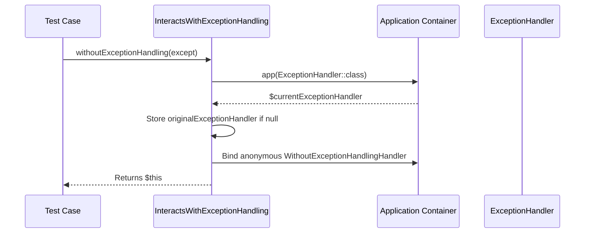

# Testing Framework & HTTP Assertions

Relevant source files

The following files were used as context for generating this wiki page:

- [src/Illuminate/Foundation/Providers/FoundationServiceProvider.php](https://github.com/laravel/framework/blob/main/src/Illuminate/Foundation/Providers/FoundationServiceProvider.php)
- [src/Illuminate/Foundation/Testing/Concerns/InteractsWithTestCaseLifecycle.php](https://github.com/laravel/framework/blob/main/src/Illuminate/Foundation/Testing/Concerns/InteractsWithTestCaseLifecycle.php)
- [src/Illuminate/Testing/TestResponse.php](https://github.com/laravel/framework/blob/main/src/Illuminate/Testing/TestResponse.php)
- [src/Illuminate/Foundation/Testing/Concerns/InteractsWithExceptionHandling.php](https://github.com/laravel/framework/blob/main/src/Illuminate/Foundation/Testing/Concerns/InteractsWithExceptionHandling.php)
- [src/Illuminate/Foundation/Http/Kernel.php](https://github.com/laravel/framework/blob/main/src/Illuminate/Foundation/Http/Kernel.php)
- [src/Illuminate/Foundation/Testing/Concerns/MakesHttpRequests.php](https://github.com/laravel/framework/blob/main/src/Illuminate/Foundation/Testing/Concerns/MakesHttpRequests.php)
- [src/Illuminate/Testing/Concerns/AssertsStatusCodes.php](https://github.com/laravel/framework/blob/main/src/Illuminate/Testing/Concerns/AssertsStatusCodes.php)
- [src/Illuminate/Foundation/Testing/TestCase.php](https://github.com/laravel/framework/blob/main/src/Illuminate/Foundation/Testing/TestCase.php)
- [src/Illuminate/Http/Client/Factory.php](https://github.com/laravel/framework/blob/main/src/Illuminate/Http/Client/Factory.php)
- [src/Illuminate/Testing/TestResponseAssert.php](https://github.com/laravel/framework/blob/main/src/Illuminate/Testing/TestResponseAssert.php)
- [src/Illuminate/Foundation/Testing/Concerns/InteractsWithAuthentication.php](https://github.com/laravel/framework/blob/main/src/Illuminate/Foundation/Testing/Concerns/InteractsWithAuthentication.php)
- [src/Illuminate/Support/Facades/Http.php](https://github.com/laravel/framework/blob/main/src/Illuminate/Support/Facades/Http.php)
- [types/Testing/TestResponse.php](https://github.com/laravel/framework/blob/main/types/Testing/TestResponse.php)
- [types/Http/Request.php](https://github.com/laravel/framework/blob/main/types/Http/Request.php)
- [src/Illuminate/Contracts/Http/Kernel.php](https://github.com/laravel/framework/blob/main/src/Illuminate/Contracts/Http/Kernel.php)
- [src/Illuminate/Testing/composer.json](https://github.com/laravel/framework/blob/main/src/Illuminate/Testing/composer.json)
- [src/Illuminate/Testing/ParallelTestingServiceProvider.php](https://github.com/laravel/framework/blob/main/src/Illuminate/Testing/ParallelTestingServiceProvider.php)
- [src/Illuminate/Testing/TestView.php](https://github.com/laravel/framework/blob/main/src/Illuminate/Testing/TestView.php)

## Overview

The testing framework and HTTP assertions component provides a comprehensive testing toolkit for Laravel applications, integrating deeply with PHPUnit to streamline application testing, request simulation, and response verification. Its primary purpose is to empower developers to test application behaviors accurately by orchestrating test environments, executing requests through the HTTP kernel, inspecting structured JSON and HTML responses, managing exceptions, handling authentication states, and stubbing external HTTP services. By bridging low-level container bootstrapping with expressive assertion APIs, this component solves the complexity of functional and integration testing in web applications.

Sources: [src/Illuminate/Foundation/Testing/TestCase.php:12-25](https://github.com/laravel/framework/blob/main/src/Illuminate/Foundation/Testing/TestCase.php#L12-L25), [src/Illuminate/Testing/TestResponse.php:32-38](https://github.com/laravel/framework/blob/main/src/Illuminate/Testing/TestResponse.php#L32-L38)

## Test Environment Bootstrapping and Lifecycle

### Overview

The test environment lifecycle revolves around the core `TestCase` class and its `InteractsWithTestCaseLifecycle` trait, which manage application container instantiation, test trait initialization, parallel testing hooks, and comprehensive state flushing during teardown.

Sources: [src/Illuminate/Foundation/Testing/TestCase.php:12-23](https://github.com/laravel/framework/blob/main/src/Illuminate/Foundation/Testing/TestCase.php#L12-L23), [src/Illuminate/Foundation/Testing/Concerns/InteractsWithTestCaseLifecycle.php:52-115](https://github.com/laravel/framework/blob/main/src/Illuminate/Foundation/Testing/Concerns/InteractsWithTestCaseLifecycle.php#L52-L115)

### Application Creation and Bootstrapping Walkthrough

When an application container is required, `TestCase` executes a structured initialization sequence within `createApplication()` and `setUpTheTestEnvironment()`. 

The call chain proceeds as follows:
1. `createApplication()` loads the base application instance via `require Application::inferBasePath().'/bootstrap/app.php'`.
2. Recursive trait inspection runs via `class_uses_recursive(static::class)` to populate `$this->traitsUsedByTest`.
3. Cached configuration and route states are conditionally marked if `WithCachedConfig` or `WithCachedRoutes` traits are active.
4. The console kernel is resolved and booted via `$app->make(Kernel::class)->bootstrap()`.
5. During `setUp()`, `setUpTheTestEnvironment()` clears resolved facade instances, calls `refreshApplication()` if the app instance is absent, triggers `ParallelTesting::callSetUpTestCaseCallbacks($this)`, and invokes `setUpTraits()` to initialize active testing traits.

Sources: [src/Illuminate/Foundation/Testing/TestCase.php:45-76](https://github.com/laravel/framework/blob/main/src/Illuminate/Foundation/Testing/TestCase.php#L45-L76), [src/Illuminate/Foundation/Testing/Concerns/InteractsWithTestCaseLifecycle.php:96-115](https://github.com/laravel/framework/blob/main/src/Illuminate/Foundation/Testing/Concerns/InteractsWithTestCaseLifecycle.php#L96-L115)

> [!NOTE]
> Test methods decorated with the `UnitTest` attribute bypass full framework booting entirely through `withoutBootingFramework()`, returning early from both `setUp()` and `tearDown()`.

Sources: [src/Illuminate/Foundation/Testing/TestCase.php:71-73](https://github.com/laravel/framework/blob/main/src/Illuminate/Foundation/Testing/TestCase.php#L71-L73), [src/Illuminate/Foundation/Testing/TestCase.php:97-99](https://github.com/laravel/framework/blob/main/src/Illuminate/Foundation/Testing/TestCase.php#L97-L99), [src/Illuminate/Foundation/Testing/TestCase.php:111-122](https://github.com/laravel/framework/blob/main/src/Illuminate/Foundation/Testing/TestCase.php#L111-L122)

### Trait Initialization and Lifecycle Hook Registration

The `setUpTraits()` method inspects all recursively used traits and executes corresponding setup handlers or registers teardown callbacks.

| Trait / Condition | Setup Action Triggered | Teardown Registration |
| :--- | :--- | :--- |
| `RefreshDatabase` | `$this->refreshDatabase()` | None (handled via database transaction/rollback) |
| `DatabaseMigrations` | `$this->runDatabaseMigrations()` | None |
| `DatabaseTruncation` | `$this->truncateDatabaseTables()` | None |
| `DatabaseTransactions` | `$this->beginDatabaseTransaction()` | None |
| `WithoutMiddleware` | `$this->disableMiddlewareForAllTests()` | None |
| `WithFaker` | `$this->setUpFaker()` | None |
| Custom Trait Method | `setUp{TraitName}()` | `tearDown{TraitName}()` registered to pre-destruction |
| `SetUp` / `TearDown` Attribute | Method invoked immediately | Method registered to pre-destruction callback |

Sources: [src/Illuminate/Foundation/Testing/Concerns/InteractsWithTestCaseLifecycle.php:222-268](https://github.com/laravel/framework/blob/main/src/Illuminate/Foundation/Testing/Concerns/InteractsWithTestCaseLifecycle.php#L222-L268)

### Teardown and State Flushing

During `tearDownTheTestEnvironment()`, the application executes registered pre-destruction callbacks, parallel testing teardown hooks, flushes the container via `$this->app->flush()`, and resets global state across numerous framework components to ensure test isolation.

Sources: [src/Illuminate/Foundation/Testing/Concerns/InteractsWithTestCaseLifecycle.php:126-215](https://github.com/laravel/framework/blob/main/src/Illuminate/Foundation/Testing/Concerns/InteractsWithTestCaseLifecycle.php#L126-L215)

## Simulating Requests via HTTP Kernel

### Overview

The `MakesHttpRequests` trait provides the underlying engine for simulating HTTP requests during testing in Laravel applications. It bridges test method invocations (`get`, `post`, `json`, etc.) to the concrete HTTP Kernel implementation by constructing Symfony request instances, converting them into framework test requests, passing them through middleware pipelines and routing, and wrapping the output in a `TestResponse`.

Sources: [src/Illuminate/Foundation/Testing/Concerns/MakesHttpRequests.php:16-797](https://github.com/laravel/framework/blob/main/src/Illuminate/Foundation/Testing/Concerns/MakesHttpRequests.php#L16-L797)

### Request Construction and Call-Chain Walkthrough

When a test issues an HTTP request via methods such as `get()`, `post()`, or `json()`, the execution flows through a standardized pipeline. 

The call chain proceeds as follows:
1. `get()` or `post()` transforms any provided headers via `transformHeadersToServerVars()` and prepares cookies via `prepareCookiesForRequest()`, then delegates execution to `call()`.
2. `call()` resolves the HTTP kernel from the container via `$this->app->make(HttpKernel::class)`.
3. `call()` merges uploaded files extracted via `extractFilesFromDataArray()`.
4. `SymfonyRequest::create()` builds a raw `Symfony\Component\HttpFoundation\Request` using the prepared URL, HTTP method, parameters, cookies, files, server variables, and content body.
5. `createTestRequest($symfonyRequest)` wraps the Symfony request into an `Illuminate\Http\Request` instance via `Request::createFromBase()`.
6. `$kernel->handle($request)` processes the incoming request inside the application kernel.
7. `$kernel->terminate($request, $response)` triggers terminal middleware and lifecycle duration handlers.
8. `createTestResponse()` wraps the returned Symfony response and request into an instance of `Illuminate\Testing\TestResponse`.

Sources: [src/Illuminate/Foundation/Testing/Concerns/MakesHttpRequests.php:363-649](https://github.com/laravel/framework/blob/main/src/Illuminate/Foundation/Testing/Concerns/MakesHttpRequests.php#L363-L649), [src/Illuminate/Foundation/Http/Kernel.php:137-234](https://github.com/laravel/framework/blob/main/src/Illuminate/Foundation/Http/Kernel.php#L137-L234)

### HTTP Kernel Handling and Middleware Pipeline Execution

The HTTP Kernel handles incoming requests by establishing the request start time, enabling HTTP method parameter override, running the request through the router and middleware pipeline, reporting and rendering exceptions, and dispatching framework events.

The call chain inside `Illuminate\Foundation\Http\Kernel::handle()` proceeds as follows:
1. `$this->requestStartedAt = Carbon::now()` captures the start time of the request lifecycle.
2. `$request->enableHttpMethodParameterOverride()` allows spoofing HTTP verbs via input parameters.
3. `sendRequestThroughRouter($request)` binds the request instance to the container container under the `'request'` abstract, clears resolved request instances, boots the application via `bootstrap()`, and executes a `Illuminate\Routing\Pipeline`.
4. The pipeline sends the request through global middleware (unless skipped via `shouldSkipMiddleware()`) and dispatches it to the router via `dispatchToRouter()`.
5. If an unhandled `Throwable` occurs, `reportException()` and `renderException()` pass the exception to the exception handler.
6. The `RequestHandled` event is dispatched to the application event dispatcher.

Sources: [src/Illuminate/Foundation/Http/Kernel.php:137-176](https://github.com/laravel/framework/blob/main/src/Illuminate/Foundation/Http/Kernel.php#L137-L176), [src/Illuminate/Foundation/Http/Kernel.php:183-202](https://github.com/laravel/framework/blob/main/src/Illuminate/Foundation/Http/Kernel.php#L183-L202)

> [!NOTE]
> Cookie encryption can be toggled using `disableCookieEncryption()`, or bypassed for individual cookies via `withUnencryptedCookie()` and `withUnencryptedCookies()`. When cookie encryption is active, `prepareCookiesForRequest()` automatically prepends the cookie value prefix before encrypting each cookie value via the application encrypter.

Sources: [src/Illuminate/Foundation/Testing/Concerns/MakesHttpRequests.php:264-283](https://github.com/laravel/framework/blob/main/src/Illuminate/Foundation/Testing/Concerns/MakesHttpRequests.php#L264-L283), [src/Illuminate/Foundation/Testing/Concerns/MakesHttpRequests.php:310-340](https://github.com/laravel/framework/blob/main/src/Illuminate/Foundation/Testing/Concerns/MakesHttpRequests.php#L310-L340), [src/Illuminate/Foundation/Testing/Concerns/MakesHttpRequests.php:725-740](https://github.com/laravel/framework/blob/main/src/Illuminate/Foundation/Testing/Concerns/MakesHttpRequests.php#L725-L740)

### HTTP Testing Request Methods

| Method | Parameters | Purpose |
| :--- | :--- | :--- |
| `get($uri, array $headers)` | `$uri`, `$headers` | Visit the given URI with a GET request. |
| `getJson($uri, array $headers, $options)` | `$uri`, `$headers`, `$options` | Visit URI with GET expecting a JSON response. |
| `post($uri, array $data, array $headers)` | `$uri`, `$data`, `$headers` | Visit the given URI with a POST request. |
| `postJson($uri, array $data, array $headers, $options)` | `$uri`, `$data`, `$headers`, `$options` | Visit URI with POST expecting a JSON response. |
| `put($uri, array $data, array $headers)` | `$uri`, `$data`, `$headers` | Visit the given URI with a PUT request. |
| `putJson($uri, array $data, array $headers, $options)` | `$uri`, `$data`, `$headers`, `$options` | Visit URI with PUT expecting a JSON response. |
| `patch($uri, array $data, array $headers)` | `$uri`, `$data`, `$headers` | Visit the given URI with a PATCH request. |
| `patchJson($uri, array $data, array $headers, $options)` | `$uri`, `$data`, `$headers`, `$options` | Visit URI with PATCH expecting a JSON response. |
| `delete($uri, array $data, array $headers)` | `$uri`, `$data`, `$headers` | Visit the given URI with a DELETE request. |
| `deleteJson($uri, array $data, array $headers, $options)` | `$uri`, `$data`, `$headers`, `$options` | Visit URI with DELETE expecting a JSON response. |
| `options($uri, array $data, array $headers)` | `$uri`, `$data`, `$headers` | Visit the given URI with an OPTIONS request. |
| `head($uri, array $headers)` | `$uri`, `$headers` | Visit the given URI with a HEAD request. |
| `query($uri, array $data, array $headers)` | `$uri`, `$data`, `$headers` | Visit the given URI with a QUERY request. |
| `json($method, $uri, array $data, array $headers, $options)` | `$method`, `$uri`, `$data`, `$headers`, `$options` | Execute a custom HTTP method request with encoded JSON body and content headers. |

Sources: [src/Illuminate/Foundation/Testing/Concerns/MakesHttpRequests.php:363-613](https://github.com/laravel/framework/blob/main/src/Illuminate/Foundation/Testing/Concerns/MakesHttpRequests.php#L363-L613)

## Response Verification and Assertion Engine

### Overview

The `TestResponse` class wraps Symfony and Laravel HTTP response objects to provide an extensive fluent assertion suite. It combines the `AssertsStatusCodes` trait for HTTP status validation with dedicated verification methods for JSON payloads, headers, cookies, streamed content, session states, and view bindings. When assertions fail, `TestResponseAssert` automatically intercepts PHPUnit's `ExpectationFailedException` via `__call()`, inspects the response context, and appends unhandled exceptions, session error bags, or JSON validation errors to the failure message.

Sources: [src/Illuminate/Testing/TestResponse.php:32-41](https://github.com/laravel/framework/blob/main/src/Illuminate/Testing/TestResponse.php#L32-L41), [src/Illuminate/Testing/TestResponseAssert.php:35-94](https://github.com/laravel/framework/blob/main/src/Illuminate/Testing/TestResponseAssert.php#L35-L94)

### Status Codes and Content Assertions

The response verification engine validates HTTP status codes using exact status assertions or status category checkers. The `AssertsStatusCodes` trait defines methods such as `assertOk()` (200), `assertCreated()` (201), `assertAccepted()` (202), `assertNoContent()` (204), `assertMovedPermanently()` (301), `assertFound()` (302), `assertNotModified()` (304), `assertTemporaryRedirect()` (307), `assertPermanentRedirect()` (308), `assertBadRequest()` (400), `assertUnauthorized()` (401), `assertPaymentRequired()` (402), `assertForbidden()` (403), `assertNotFound()` (404), `assertMethodNotAllowed()` (405), `assertNotAcceptable()` (406), `assertRequestTimeout()` (408), `assertConflict()` (409), `assertGone()` (410), `assertUnsupportedMediaType()` (415), `assertUnprocessable()` (422), `assertFailedDependency()` (424), `assertTooManyRequests()` (429), `assertInternalServerError()` (500), and `assertServiceUnavailable()` (503). 

Sources: [src/Illuminate/Testing/Concerns/AssertsStatusCodes.php:7-263](https://github.com/laravel/framework/blob/main/src/Illuminate/Testing/Concerns/AssertsStatusCodes.php#L7-L263)

| Status Assertion Method | Target Code / Condition | Purpose |
| :--- | :--- | :--- |
| `assertOk()` | `200` | Assert response has 200 OK status. |
| `assertCreated()` | `201` | Assert response has 201 Created status. |
| `assertAccepted()` | `202` | Assert response has 202 Accepted status. |
| `assertNoContent($status)` | `204` (default) | Assert response has status and empty content. |
| `assertMovedPermanently()` | `301` | Assert response has 301 Moved Permanently status. |
| `assertFound()` | `302` | Assert response has 302 Found status. |
| `assertNotModified()` | `304` | Assert response has 304 Not Modified status. |
| `assertTemporaryRedirect()` | `307` | Assert response has 307 Temporary Redirect status. |
| `assertPermanentRedirect()` | `308` | Assert response has 308 Permanent Redirect status. |
| `assertBadRequest()` | `400` | Assert response has 400 Bad Request status. |
| `assertUnauthorized()` | `401` | Assert response has 401 Unauthorized status. |
| `assertPaymentRequired()` | `402` | Assert response has 402 Payment Required status. |
| `assertForbidden()` | `403` | Assert response has 403 Forbidden status. |
| `assertNotFound()` | `404` | Assert response has 404 Not Found status. |
| `assertMethodNotAllowed()` | `405` | Assert response has 405 Method Not Allowed status. |
| `assertNotAcceptable()` | `406` | Assert response has 406 Not Acceptable status. |
| `assertRequestTimeout()` | `408` | Assert response has 408 Request Timeout status. |
| `assertConflict()` | `409` | Assert response has 409 Conflict status. |
| `assertGone()` | `410` | Assert response has 410 Gone status. |
| `assertUnsupportedMediaType()` | `415` | Assert response has 415 Unsupported Media Type status. |
| `assertUnprocessable()` | `422` | Assert response has 422 Unprocessable Content status. |
| `assertFailedDependency()` | `424` | Assert response has 424 Failed Dependency status. |
| `assertTooManyRequests()` | `429` | Assert response has 429 Too Many Requests status. |
| `assertInternalServerError()` | `500` | Assert response has 500 Internal Server Error status. |
| `assertServiceUnavailable()` | `503` | Assert response has 503 Service Unavailable status. |

Sources: [src/Illuminate/Testing/Concerns/AssertsStatusCodes.php:7-263](https://github.com/laravel/framework/blob/main/src/Illuminate/Testing/Concerns/AssertsStatusCodes.php#L7-L263)

### JSON, Session, and Header Inspection

`TestResponse` decodes response payloads via `decodeResponseJson()`, which wraps content in `AssertableJsonString`. If the decoded response is invalid or empty when a payload is expected, it throws any captured request exception or fails the PHPUnit assertion. Session assertions interact with `session.store`, automatically starting the session via `session()` if unstarted. Header validations inspect response headers for exact matches, substring containment via `assertHeaderContains()`, or missing keys via `assertHeaderMissing()`.

Sources: [src/Illuminate/Testing/TestResponse.php:369-423](https://github.com/laravel/framework/blob/main/src/Illuminate/Testing/TestResponse.php#L369-L423), [src/Illuminate/Testing/TestResponse.php:1260-1286](https://github.com/laravel/framework/blob/main/src/Illuminate/Testing/TestResponse.php#L1260-L1286), [src/Illuminate/Testing/TestResponse.php:1826-1840](https://github.com/laravel/framework/blob/main/src/Illuminate/Testing/TestResponse.php#L1826-L1840)

> [!NOTE]
> When evaluating `assertCookie()`, `TestResponse::getCookie()` iterates through response cookies, decrypts the cookie value using the application encrypter when encryption is enabled, removes the cookie value prefix via `CookieValuePrefix::remove()`, and instantiates a new decrypted `Cookie` instance for comparison.

Sources: [src/Illuminate/Testing/TestResponse.php:511-530](https://github.com/laravel/framework/blob/main/src/Illuminate/Testing/TestResponse.php#L511-L530), [src/Illuminate/Testing/TestResponse.php:602-628](https://github.com/laravel/framework/blob/main/src/Illuminate/Testing/TestResponse.php#L602-L628)

### Assertion Flow and Error Context Injection

When a PHPUnit assertion fails inside `TestResponseAssert::__call()`, the engine invokes `injectResponseContext($exception)` to enrich failure traces with application-level debugging context. The execution walks through the following checks:
1. `TestResponse::$exceptions->last()` — Appends any logged exception that occurred during request handling.
2. `RedirectResponse` session error bags — Appends validation error messages extracted from redirect session error bags.
3. JSON response error payload — Appends structured `errors` from JSON response bodies when the `Content-Type` header is `application/json`.

Sources: [src/Illuminate/Testing/TestResponseAssert.php:42-94](https://github.com/laravel/framework/blob/main/src/Illuminate/Testing/TestResponseAssert.php#L42-L94)

| Design Choice | Benefit | Cost |
| :--- | :--- | :--- |
| **Exception proxying via `__call`** | Automatically decorates all PHPUnit assertion failures with HTTP request context without modifying test code. | Intercepting `ExpectationFailedException` adds dynamic method-dispatch overhead per assertion. |
| **Lazy session starting** | Ensures session store is active on demand via `session()` when asserting session state. | Requires an application container binding for `'session.store'`. |
| **Output buffering for streamed responses** | Captures `StreamedResponse` and `BinaryFileResponse` output buffers into string content for assertions. | Executes callback output buffering handlers during test evaluation. |

Sources: [src/Illuminate/Testing/TestResponse.php:1826-1840](https://github.com/laravel/framework/blob/main/src/Illuminate/Testing/TestResponse.php#L1826-L1840), [src/Illuminate/Testing/TestResponse.php:1951-1977](https://github.com/laravel/framework/blob/main/src/Illuminate/Testing/TestResponse.php#L1951-L1977), [src/Illuminate/Testing/TestResponseAssert.php:42-49](https://github.com/laravel/framework/blob/main/src/Illuminate/Testing/TestResponseAssert.php#L42-L49)

## Exception Interception and Handling Fakes

### Overview

The `InteractsWithExceptionHandling` trait manages exception interception, toggling between application exception rendering and direct exception throwing during test execution. By default, Laravel tests catch exceptions through the application's exception handler to simulate HTTP error responses. The trait allows tests to bypass this handling via `withoutExceptionHandling()`, restoring original behavior through `withExceptionHandling()`, or restricting bypassed exceptions using specific handlers.

Sources: [src/Illuminate/Foundation/Testing/Concerns/InteractsWithExceptionHandling.php:15-42](https://github.com/laravel/framework/blob/main/src/Illuminate/Foundation/Testing/Concerns/InteractsWithExceptionHandling.php#L15-L42), [src/Illuminate/Foundation/Testing/Concerns/InteractsWithExceptionHandling.php:71-80](https://github.com/laravel/framework/blob/main/src/Illuminate/Foundation/Testing/Concerns/InteractsWithExceptionHandling.php#L71-L80)

### Exception Handler State Transitions

When `withoutExceptionHandling(array $except = [])` is invoked, it preserves the active exception handler into `originalExceptionHandler` if not already set, checking whether the current handler instance is an `ExceptionHandlerFake`. It then binds an anonymous class implementing `ExceptionHandler` and `WithoutExceptionHandlingHandler` into the container or exception fake.

Sources: [src/Illuminate/Foundation/Testing/Concerns/InteractsWithExceptionHandling.php:71-81](https://github.com/laravel/framework/blob/main/src/Illuminate/Foundation/Testing/Concerns/InteractsWithExceptionHandling.php#L71-L81), [src/Illuminate/Foundation/Testing/Concerns/InteractsWithExceptionHandling.php:162-167](https://github.com/laravel/framework/blob/main/src/Illuminate/Foundation/Testing/Concerns/InteractsWithExceptionHandling.php#L162-L167)

Sources: [src/Illuminate/Foundation/Testing/Concerns/InteractsWithExceptionHandling.php:71-81](https://github.com/laravel/framework/blob/main/src/Illuminate/Foundation/Testing/Concerns/InteractsWithExceptionHandling.php#L71-L81), [src/Illuminate/Foundation/Testing/Concerns/InteractsWithExceptionHandling.php:162-167](https://github.com/laravel/framework/blob/main/src/Illuminate/Foundation/Testing/Concerns/InteractsWithExceptionHandling.php#L162-L167)

### Exception Assertion API

The trait provides assertion methods for verifying exception throwing behavior during code execution under test.

| Method | Parameters | Return Type | Purpose |
| :--- | :--- | :--- | :--- |
| `assertThrows` | `Closure $test`, `string\|Closure $expectedClass`, `?string $expectedMessage` | `$this` | Assert that the given callback throws an exception matching the specified type and message. |
| `assertDoesntThrow` | `Closure $test` | `$this` | Assert that the given callback executes without throwing any exception. |
| `handleExceptions` | `list<class-string<\Throwable>> $exceptions` | `$this` | Delegate only the listed exception types to the exception handler. |
| `handleValidationExceptions` | None | `$this` | Delegate only `ValidationException` instances to the exception handler. |

Sources: [src/Illuminate/Foundation/Testing/Concerns/InteractsWithExceptionHandling.php:45-63](https://github.com/laravel/framework/blob/main/src/Illuminate/Foundation/Testing/Concerns/InteractsWithExceptionHandling.php#L45-L63), [src/Illuminate/Foundation/Testing/Concerns/InteractsWithExceptionHandling.php:172-242](https://github.com/laravel/framework/blob/main/src/Illuminate/Foundation/Testing/Concerns/InteractsWithExceptionHandling.php#L172-L242)

> [!WARNING]
> Within the anonymous exception handler created by `withoutExceptionHandling()`, throwing a `NotFoundHttpException` constructs a new exception instance embedding the current request method and URL, discarding any previous exception code unless integer-castable.

Sources: [src/Illuminate/Foundation/Testing/Concerns/InteractsWithExceptionHandling.php:140-144](https://github.com/laravel/framework/blob/main/src/Illuminate/Foundation/Testing/Concerns/InteractsWithExceptionHandling.php#L140-L144)

## Authentication Context and View Testing

### Overview

Testing authenticated request flows and rendered views requires dedicated assertion helpers to verify user context and view payloads. The `InteractsWithAuthentication` trait manages user impersonation and guard state during tests, while `TestView` wraps view instances to inspect rendered HTML output, text content, and bound variables.

Sources: [src/Illuminate/Foundation/Testing/Concerns/InteractsWithAuthentication.php:7-166](https://github.com/laravel/framework/blob/main/src/Illuminate/Foundation/Testing/Concerns/InteractsWithAuthentication.php#L7-L166), [src/Illuminate/Testing/TestView.php:16-272](https://github.com/laravel/framework/blob/main/src/Illuminate/Testing/TestView.php#L16-L272)

### Authentication Context Management

The `InteractsWithAuthentication` trait provides methods to set, clear, and assert user authentication state against specific authentication guards.

| Method | Parameters | Return Type | Purpose |
| :--- | :--- | :--- | :--- |
| `actingAs` | `UserContract $user, $guard = null` | `$this` | Alias for `be()`, setting the currently logged-in user. |
| `be` | `UserContract $user, $guard = null` | `$this` | Set the authenticated user on the given guard and update active guard. |
| `actingAsGuest` | `$guard = null` | `$this` | Clear the currently logged-in user on the given guard. |
| `assertAuthenticated` | `$guard = null` | `$this` | Assert that a user is currently authenticated on the guard. |
| `assertGuest` | `$guard = null` | `$this` | Assert that no user is authenticated on the guard. |
| `assertAuthenticatedAs` | `$user, $guard = null` | `$this` | Assert user is authenticated and matches instance class and identifier. |
| `assertCredentials` | `array $credentials, $guard = null` | `$this` | Assert that the provided credentials successfully validate against the user provider. |
| `assertInvalidCredentials` | `array $credentials, $guard = null` | `$this` | Assert that the provided credentials fail validation against the user provider. |

Sources: [src/Illuminate/Foundation/Testing/Concerns/InteractsWithAuthentication.php:16-165](https://github.com/laravel/framework/blob/main/src/Illuminate/Foundation/Testing/Concerns/InteractsWithAuthentication.php#L16-L165)

> [!NOTE]
> When `be()` sets an authenticated user that was recently created (`wasRecentlyCreated` is true), the property is automatically reset to false to avoid persistent transient state across requests.

Sources: [src/Illuminate/Foundation/Testing/Concerns/InteractsWithAuthentication.php:43-47](https://github.com/laravel/framework/blob/main/src/Illuminate/Foundation/Testing/Concerns/InteractsWithAuthentication.php#L43-L47)

### View Testing and Assertion API

The `TestView` class constructor immediately renders the provided `View` instance into string content. It implements `Stringable` and uses the `Macroable` trait for custom test macros.

Sources: [src/Illuminate/Testing/TestView.php:16-43](https://github.com/laravel/framework/blob/main/src/Illuminate/Testing/TestView.php#L16-L43)

| Method | Parameters | Return Type | Purpose |
| :--- | :--- | :--- | :--- |
| `assertViewHas` | `string|array $key, mixed $value = null` | `$this` | Assert view has bound data matching the expected value, model, collection, or closure. |
| `assertViewHasAll` | `array $bindings` | `$this` | Assert view has multiple bound data items. |
| `assertViewMissing` | `string $key` | `$this` | Assert view does not contain a specific bound data key. |
| `assertViewEmpty` | None | `$this` | Assert that the rendered view content string is empty. |
| `assertSee` | `string|list<string> $value, bool $escape = true` | `$this` | Assert view rendered output contains given string(s). |
| `assertSeeHtml` | `string|list<string> $value` | `$this` | Assert view rendered output contains unescaped HTML string(s). |
| `assertSeeInOrder` | `array $values, bool $escape = true` | `$this` | Assert strings appear in specific sequence within rendered view. |
| `assertSeeText` | `string|list<string> $value, bool $escape = true` | `$this` | Assert view text content contains string(s). |
| `assertDontSee` | `string|list<string> $value, bool $escape = true` | `$this` | Assert view rendered output does not contain string(s). |

Sources: [src/Illuminate/Testing/TestView.php:52-261](https://github.com/laravel/framework/blob/main/src/Illuminate/Testing/TestView.php#L52-L261)

> [!TIP]
> When asserting view data with `assertViewHas()` using an `EloquentCollection`, `TestView` validates that the actual bound data is an instance of `EloquentCollection`, matches the exact size, and verifies that every item in the collection satisfies an Eloquent `.is()` comparison against expected models.

Sources: [src/Illuminate/Testing/TestView.php:64-70](https://github.com/laravel/framework/blob/main/src/Illuminate/Testing/TestView.php#L64-L70)

## External HTTP Client Faking

### Overview

The `Illuminate\Http\Client\Factory` class, exposed globally via the `Http` facade, provides a robust system for stubbing outgoing HTTP client requests, registering response sequences, preventing stray unfaked requests, and inspecting recorded request-response pairs during testing.

Sources: [src/Illuminate/Http/Client/Factory.php:22-72](https://github.com/laravel/framework/blob/main/src/Illuminate/Http/Client/Factory.php#L22-L72), [src/Illuminate/Support/Facades/Http.php:109-119](https://github.com/laravel/framework/blob/main/src/Illuminate/Support/Facades/Http.php#L109-L119)

### Stubbing and Request Faking Execution

When `Http::fake()` is called, it turns on request recording via `record()`, flushes any previously recorded requests, and registers stub callbacks. If an array of URL patterns and callbacks is supplied, `fake()` iterates over them and calls `stubUrl()`. If a single callback is provided, it is wrapped in a closure that unwraps nested closures, evaluates promises, and invokes any optional `on_stats` transfer statistics handlers.

Sources: [src/Illuminate/Http/Client/Factory.php:310-350](https://github.com/laravel/framework/blob/main/src/Illuminate/Http/Client/Factory.php#L310-L350)

> [!NOTE]
> When stubbing URLs using integer status codes between 100 and 599, `stubUrl()` automatically constructs an empty response with that specific HTTP status code.

Sources: [src/Illuminate/Http/Client/Factory.php:381-387](https://github.com/laravel/framework/blob/main/src/Illuminate/Http/Client/Factory.php#L381-L387)

### Request Inspection and Assertion Methods

The client factory records every request and response pair when recording is active. Test assertions evaluate these recorded pairs against custom truth test callbacks or direct property checks.

| Method | Parameters | Return Type | Purpose |
| :--- | :--- | :--- | :--- |
| `assertSent` | `callable $callback` | `void` | Assert that a request/response pair was recorded matching the given truth test. |
| `assertSentInOrder` | `list<string|callable> $callbacks` | `void` | Assert that expected requests were sent in the exact specified chronological order. |
| `assertNotSent` | `callable $callback` | `void` | Assert that no recorded request matches the given truth test. |
| `assertNothingSent` | None | `void` | Assert that zero requests were recorded by the factory. |
| `assertSentCount` | `int $count` | `void` | Assert that an exact total number of requests were recorded. |
| `assertSequencesAreEmpty` | None | `void` | Assert that all created response sequences have had all their responses consumed. |

Sources: [src/Illuminate/Http/Client/Factory.php:475-556](https://github.com/laravel/framework/blob/main/src/Illuminate/Http/Client/Factory.php#L475-L556)

> [!WARNING]
> Calling `Http::fake()` resets the `$recorded` request array on every invocation, meaning subsequent calls to `fake()` in the same test clear out history prior to that point.

Sources: [src/Illuminate/Http/Client/Factory.php:312-314](https://github.com/laravel/framework/blob/main/src/Illuminate/Http/Client/Factory.php#L312-L314)

## Related

- [[Database Testing & Fakes]]
- [[Error Handling & Exception Renderer]]

