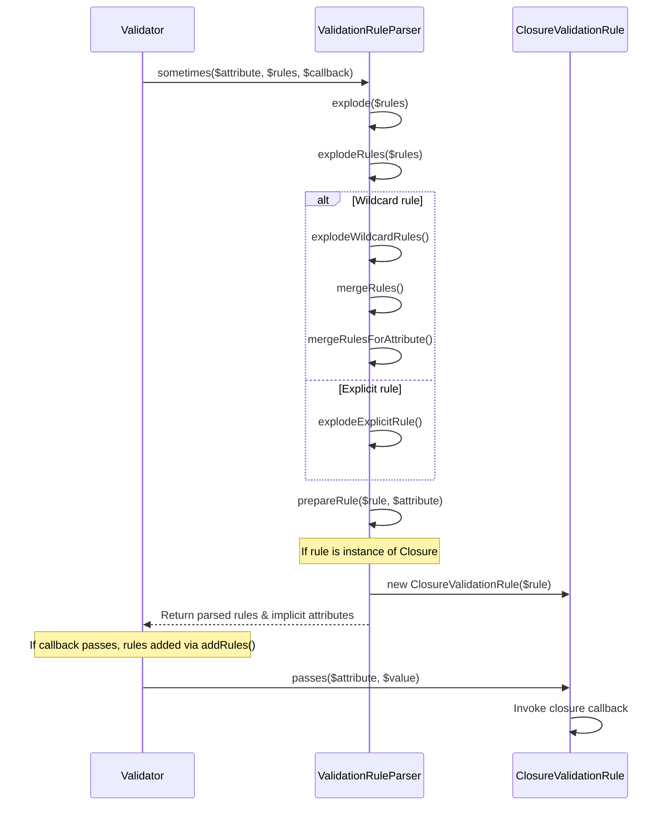
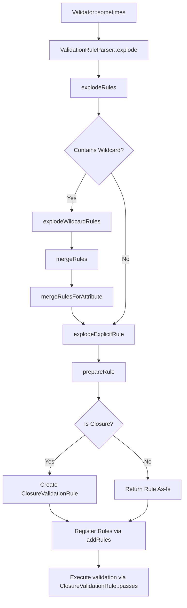

# Validation Rule Parsing Flow

<details>
<summary>Relevant source files</summary>

The following files were used as context for generating this wiki page:

- [src/Illuminate/Validation/Validator.php](https://github.com/laravel/framework/blob/main/src/Illuminate/Validation/Validator.php)
- [src/Illuminate/Validation/ValidationRuleParser.php](https://github.com/laravel/framework/blob/main/src/Illuminate/Validation/ValidationRuleParser.php)
- [src/Illuminate/Validation/ClosureValidationRule.php](https://github.com/laravel/framework/blob/main/src/Illuminate/Validation/ClosureValidationRule.php)
</details>

## Overview

### Overview

The execution flow from conditional `sometimes` rule definitions to wrapped closure rules bridges Laravel's `Validator` engine and its `ValidationRuleParser`. When developers define conditional attributes using `Validator::sometimes()`, the validation system dynamically evaluates whether the rules should be applied against the current request payload. If the condition evaluates to true, the specified rules—including inline closures—are parsed, normalized, and registered into the active rule set. Ultimately, any closures provided as validation rules are wrapped inside a `ClosureValidationRule` instance to conform to Laravel's validation rule contracts.

Sources: [src/Illuminate/Validation/Validator.php:1330-1347](https://github.com/laravel/framework/blob/main/src/Illuminate/Validation/Validator.php#L1330-L1347)

---

### Step 1: Evaluate Conditional Rules via `sometimes`

The process begins when `Validator::sometimes()` is invoked with an attribute, rules, and a callback. The validator initializes a payload wrapper around its data and iterates over each target attribute. For each attribute, it invokes the `ValidationRuleParser` to explode the rules array.

```php
public function sometimes($attribute, $rules, callable $callback)
{
    $payload = new Fluent($this->data);

    foreach ((array) $attribute as $key) {
        $response = (new ValidationRuleParser($this->data))->explode([$key => $rules]);
        // ...
```

Sources: [src/Illuminate/Validation/Validator.php:1330-1336](https://github.com/laravel/framework/blob/main/src/Illuminate/Validation/Validator.php#L1330-L1336)

---

### Step 2: Initialize Parsing with `explode`

Inside `ValidationRuleParser::explode()`, the parser resets any existing implicit attributes and delegates the rule set to `explodeRules()`, returning an object containing the fully expanded rules and any implicit attributes discovered during traversal.

```php
public function explode($rules)
{
    $this->implicitAttributes = [];

    $rules = $this->explodeRules($rules);

    return (object) [
        'rules' => $rules,
        'implicitAttributes' => $this->implicitAttributes,
    ];
}
```

Sources: [src/Illuminate/Validation/ValidationRuleParser.php:51-61](https://github.com/laravel/framework/blob/main/src/Illuminate/Validation/ValidationRuleParser.php#L51-L61)

---

### Step 3: Iterate and Inspect Rules in `explodeRules`

The `explodeRules()` method iterates through the provided rule collection. If a rule key contains a wildcard (`*`), it delegates to `explodeWildcardRules()`. Otherwise, it passes the individual rule and attribute to `explodeExplicitRule()`.

```php
protected function explodeRules($rules)
{
    foreach ($rules as $key => $rule) {
        if (str_contains($key, '*')) {
            $rules = $this->explodeWildcardRules($rules, $key, [$rule]);

            unset($rules[$key]);
        } else {
            $rules[$key] = $this->explodeExplicitRule($rule, $key);
        }
    }

    return $rules;
}
```

Sources: [src/Illuminate/Validation/ValidationRuleParser.php:69-82](https://github.com/laravel/framework/blob/main/src/Illuminate/Validation/ValidationRuleParser.php#L69-L82)

---

### Step 4: Expand Wildcards via `explodeWildcardRules`

When wildcard keys are present, `explodeWildcardRules()` gathers matching data fields using `ValidationData`. For each matched data key, it prepares and merges the rules back into the results array while tracking implicit attributes.

```php
protected function explodeWildcardRules($results, $attribute, $rules)
{
    $pattern = str_replace('\*', '[^\.]*', preg_quote($attribute, '/'));

    $data = ValidationData::initializeAndGatherData($attribute, $this->data);

    foreach ($data as $key => $value) {
        if (Str::startsWith($key, $attribute) || (bool) preg_match('/^'.$pattern.'\z/', $key)) {
            foreach ((array) $rules as $rule) {
                // ...
                $results = $this->mergeRules($results, $key, $rule);
            }
        }
    }

    return $results;
}
```

Sources: [src/Illuminate/Validation/ValidationRuleParser.php:159-190](https://github.com/laravel/framework/blob/main/src/Illuminate/Validation/ValidationRuleParser.php#L159-L190)

---

### Step 5: Route Rule Merging through `mergeRules`

`mergeRules()` acts as a dispatcher for merging additional rules into attributes. It checks whether the target attribute argument is an array and routes accordingly to `mergeRulesForAttribute()`.

```php
public function mergeRules($results, $attribute, $rules = [])
{
    if (is_array($attribute)) {
        foreach ((array) $attribute as $innerAttribute => $innerRules) {
            $results = $this->mergeRulesForAttribute($results, $innerAttribute, $innerRules);
        }

        return $results;
    }

    return $this->mergeRulesForAttribute(
        $results, $attribute, $rules
    );
}
```

Sources: [src/Illuminate/Validation/ValidationRuleParser.php:200-213](https://github.com/laravel/framework/blob/main/src/Illuminate/Validation/ValidationRuleParser.php#L200-L213)

---

### Step 6: Process Attribute-Level Merging in `mergeRulesForAttribute`

`mergeRulesForAttribute()` explodes the incoming rules payload and merges them with any existing rules already defined for that specific attribute index.

```php
protected function mergeRulesForAttribute($results, $attribute, $rules)
{
    $merge = head($this->explodeRules([$rules]));

    $results[$attribute] = array_merge(
        isset($results[$attribute]) ? $this->explodeExplicitRule($results[$attribute], $attribute) : [], $merge
    );

    return $results;
}
```

Sources: [src/Illuminate/Validation/ValidationRuleParser.php:223-232](https://github.com/laravel/framework/blob/main/src/Illuminate/Validation/ValidationRuleParser.php#L223-L232)

---

### Step 7: Handle Explicit Rules in `explodeExplicitRule`

`explodeExplicitRule()` normalizes explicit rules. String representations separated by pipes are split into arrays, while objects and callbacks are routed through `prepareRule()`.

```php
protected function explodeExplicitRule($rule, $attribute)
{
    if (is_string($rule)) {
        return explode('|', $rule);
    }

    if (is_object($rule)) {
        // ...
        return Arr::wrap($this->prepareRule($rule, $attribute));
    }

    $rules = [];

    foreach ($rule as $value) {
        // ...
        $rules[] = $this->prepareRule($value, $attribute);
    }

    return $rules;
}
```

Sources: [src/Illuminate/Validation/ValidationRuleParser.php:91-116](https://github.com/laravel/framework/blob/main/src/Illuminate/Validation/ValidationRuleParser.php#L91-L116)

---

### Step 8: Wrap Closures in `prepareRule`

When `prepareRule()` encounters an instance of `Closure`, it wraps the raw closure inside a `ClosureValidationRule` instance. Other rule contract objects pass through unmodified.

```php
protected function prepareRule($rule, $attribute)
{
    if ($rule instanceof Closure) {
        $rule = new ClosureValidationRule($rule);
    }

    if ($rule instanceof InvokableRule || $rule instanceof ValidationRule) {
        $rule = InvokableValidationRule::make($rule);
    }

    // ...
    return $rule;
}
```

Sources: [src/Illuminate/Validation/ValidationRuleParser.php:125-140](https://github.com/laravel/framework/blob/main/src/Illuminate/Validation/ValidationRuleParser.php#L125-L140)

---

### Step 9: Execute via `ClosureValidationRule`

The resulting `ClosureValidationRule` implements `RuleContract` and `ValidatorAwareRule`. When validation executes on the attribute, its `passes()` method invokes the underlying closure, passing the attribute, value, failure callback, and validator instance.

```php
class ClosureValidationRule implements RuleContract, ValidatorAwareRule
{
    public function passes($attribute, $value)
    {
        $this->failed = false;

        $this->callback->__invoke($attribute, $value, function ($attribute, $message = null) {
            $this->failed = true;

            return $this->pendingPotentiallyTranslatedString($attribute, $message);
        }, $this->validator);

        return ! $this->failed;
    }
}
```

Sources: [src/Illuminate/Validation/ClosureValidationRule.php:9-69](https://github.com/laravel/framework/blob/main/src/Illuminate/Validation/ClosureValidationRule.php#L9-L69)

---

## Execution Flow Diagram



Sources: [src/Illuminate/Validation/Validator.php:1330-1347](https://github.com/laravel/framework/blob/main/src/Illuminate/Validation/Validator.php#L1330-L1347), [src/Illuminate/Validation/ValidationRuleParser.php:51-149](https://github.com/laravel/framework/blob/main/src/Illuminate/Validation/ValidationRuleParser.php#L51-L149), [src/Illuminate/Validation/ClosureValidationRule.php:58-69](https://github.com/laravel/framework/blob/main/src/Illuminate/Validation/ClosureValidationRule.php#L58-L69)

---

## Decision Flowchart



Sources: [src/Illuminate/Validation/Validator.php:1330-1347](https://github.com/laravel/framework/blob/main/src/Illuminate/Validation/Validator.php#L1330-L1347), [src/Illuminate/Validation/ValidationRuleParser.php:51-149](https://github.com/laravel/framework/blob/main/src/Illuminate/Validation/ValidationRuleParser.php#L51-L149), [src/Illuminate/Validation/ClosureValidationRule.php:58-69](https://github.com/laravel/framework/blob/main/src/Illuminate/Validation/ClosureValidationRule.php#L58-L69)

---

## Key Observations

- **Cross-Module Interaction:** The flow transitions seamlessly from state management and conditional evaluation in `Validator` to structural parsing and expansion in `ValidationRuleParser`, culminating in encapsulation within `ClosureValidationRule`.
- **Dynamic Rule Injection:** Conditional rules evaluated through `sometimes` are dynamically injected into the validator's rule repository at runtime rather than initialization time.
- **Closure Adaptation:** Raw PHP closures cannot natively implement validation interfaces; wrapping them in `ClosureValidationRule` standardizes their execution interface, error collection, and validator/data awareness.

Sources: [src/Illuminate/Validation/Validator.php:1330-1347](https://github.com/laravel/framework/blob/main/src/Illuminate/Validation/Validator.php#L1330-L1347), [src/Illuminate/Validation/ValidationRuleParser.php:125-130](https://github.com/laravel/framework/blob/main/src/Illuminate/Validation/ValidationRuleParser.php#L125-L130), [src/Illuminate/Validation/ClosureValidationRule.php:9-69](https://github.com/laravel/framework/blob/main/src/Illuminate/Validation/ClosureValidationRule.php#L9-L69)
