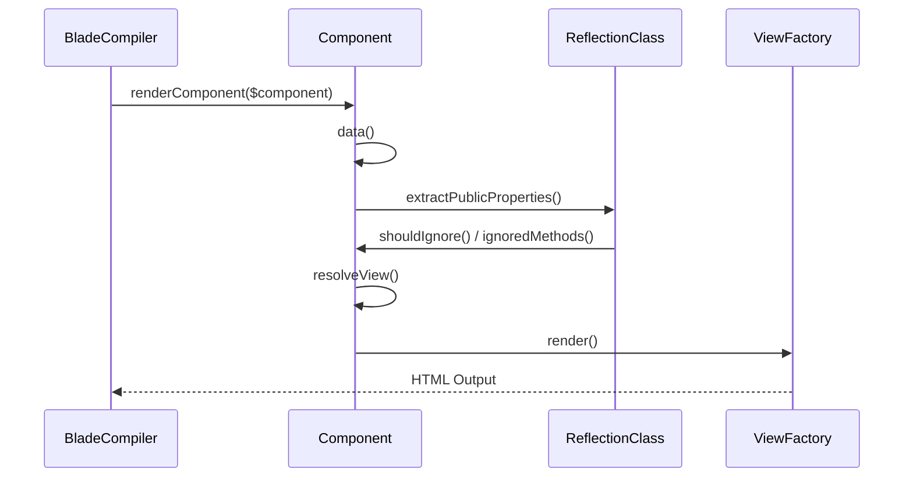
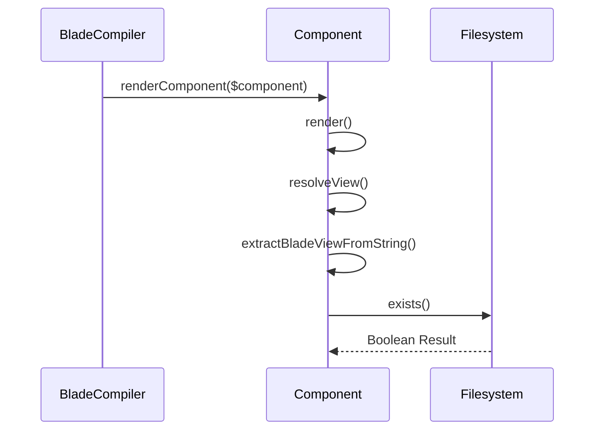

# View Components & Layouts

Relevant source files

The following files were used as context for generating this wiki page:

- [src/Illuminate/View/Compilers/BladeCompiler.php](https://github.com/laravel/framework/blob/main/src/Illuminate/View/Compilers/BladeCompiler.php)
- [src/Illuminate/View/Compilers/ComponentTagCompiler.php](https://github.com/laravel/framework/blob/main/src/Illuminate/View/Compilers/ComponentTagCompiler.php)
- [src/Illuminate/View/Compilers/Concerns/CompilesComponents.php](https://github.com/laravel/framework/blob/main/src/Illuminate/View/Compilers/Concerns/CompilesComponents.php)
- [src/Illuminate/View/Component.php](https://github.com/laravel/framework/blob/main/src/Illuminate/View/Component.php)
- [src/Illuminate/View/Concerns/ManagesComponents.php](https://github.com/laravel/framework/blob/main/src/Illuminate/View/Concerns/ManagesComponents.php)
- [src/Illuminate/View/DynamicComponent.php](https://github.com/laravel/framework/blob/main/src/Illuminate/View/DynamicComponent.php)
- [src/Illuminate/View/Compilers/Concerns/CompilesLayouts.php](https://github.com/laravel/framework/blob/main/src/Illuminate/View/Compilers/Concerns/CompilesLayouts.php)
- [src/Illuminate/Support/Facades/Blade.php](https://github.com/laravel/framework/blob/main/src/Illuminate/Support/Facades/Blade.php)
- [src/Illuminate/View/InvokableComponentVariable.php](https://github.com/laravel/framework/blob/main/src/Illuminate/View/InvokableComponentVariable.php)
- [src/Illuminate/View/AnonymousComponent.php](https://github.com/laravel/framework/blob/main/src/Illuminate/View/AnonymousComponent.php)
- [src/Illuminate/View/ComponentSlot.php](https://github.com/laravel/framework/blob/main/src/Illuminate/View/ComponentSlot.php)
- [src/Illuminate/View/Concerns/ManagesLayouts.php](https://github.com/laravel/framework/blob/main/src/Illuminate/View/Concerns/ManagesLayouts.php)
- [src/Illuminate/Foundation/resources/exceptions/renderer/components/layout.blade.php](https://github.com/laravel/framework/blob/main/src/Illuminate/Foundation/resources/exceptions/renderer/components/layout.blade.php)
- [src/Illuminate/Foundation/resources/exceptions/renderer/components/badge.blade.php](https://github.com/laravel/framework/blob/main/src/Illuminate/Foundation/resources/exceptions/renderer/components/badge.blade.php)
- [src/Illuminate/Foundation/Testing/Concerns/InteractsWithViews.php](https://github.com/laravel/framework/blob/main/src/Illuminate/Foundation/Testing/Concerns/InteractsWithViews.php)
- [src/Illuminate/Support/Facades/View.php](https://github.com/laravel/framework/blob/main/src/Illuminate/Support/Facades/View.php)
- [src/Illuminate/Testing/TestComponent.php](https://github.com/laravel/framework/blob/main/src/Illuminate/Testing/TestComponent.php)
- [src/Illuminate/Console/View/Components/Component.php](https://github.com/laravel/framework/blob/main/src/Illuminate/Console/View/Components/Component.php)
- [src/Illuminate/Filesystem/Filesystem.php](https://github.com/laravel/framework/blob/main/src/Illuminate/Filesystem/Filesystem.php)

## Overview

### Overview

Laravel's view components and layout systems provide a robust architecture for building reusable, modular UI components and managing hierarchical templates within Blade. By combining custom tag compilation, class component evaluation, slot handling, and state management, the framework transforms expressive template syntax into efficient PHP compilation statements and component strings. This architecture addresses the complexity of nested UI composition, attribute passing, and context sharing across view hierarchies while offering comprehensive testing tools to ensure rendered component output meets expectations.

Sources: [src/Illuminate/View/Compilers/BladeCompiler.php:451-465](https://github.com/laravel/framework/blob/main/src/Illuminate/View/Compilers/BladeCompiler.php#L451-L465), [src/Illuminate/View/Compilers/ComponentTagCompiler.php:66-77](https://github.com/laravel/framework/blob/main/src/Illuminate/View/Compilers/ComponentTagCompiler.php#L66-L77), [src/Illuminate/View/Component.php:95-115](https://github.com/laravel/framework/blob/main/src/Illuminate/View/Component.php#L95-L115), [src/Illuminate/View/Concerns/ManagesComponents.php:48-63](https://github.com/laravel/framework/blob/main/src/Illuminate/View/Concerns/ManagesComponents.php#L48-L63), [src/Illuminate/Testing/TestComponent.php:45-63](https://github.com/laravel/framework/blob/main/src/Illuminate/Testing/TestComponent.php#L45-L63)

## Component Tag Parsing and Compilation

### Overview

The translation of custom component tags into valid Blade compilation statements is driven by `BladeCompiler` and `ComponentTagCompiler`. During the initial template compilation pass, `BladeCompiler::compileString()` invokes `compileComponentTags()` to process custom `x-` tags before core tokenization occurs. This precompilation step transforms HTML-style custom tags, slot declarations, and attribute sets into corresponding PHP directives such as `@component`, `@slot`, and `@endComponentClass`.

Sources: [src/Illuminate/View/Compilers/BladeCompiler.php:293-298](https://github.com/laravel/framework/blob/main/src/Illuminate/View/Compilers/BladeCompiler.php#L293-L298), [src/Illuminate/View/Compilers/ComponentTagCompiler.php:66-77](https://github.com/laravel/framework/blob/main/src/Illuminate/View/Compilers/ComponentTagCompiler.php#L66-L77)

### Tag Parsing and Compilation Workflow

The compilation pipeline follows an explicit sequence of transformations applied to the template string. The processing order executed by `ComponentTagCompiler::compile()` proceeds as follows: `compileSlots()` → `compileTags()` (which executes `compileSelfClosingTags()`, `compileOpeningTags()`, and `compileClosingTags()`). Each matching tag pattern is intercepted by regular expression callbacks that parse attributes, partition data parameters, and generate the target PHP output string.

Sources: [src/Illuminate/View/Compilers/ComponentTagCompiler.php:72-94](https://github.com/laravel/framework/blob/main/src/Illuminate/View/Compilers/ComponentTagCompiler.php#L72-L94), [src/Illuminate/View/Compilers/ComponentTagCompiler.php:516-589](https://github.com/laravel/framework/blob/main/src/Illuminate/View/Compilers/ComponentTagCompiler.php#L516-L589)

### Attribute Extraction and Binding Syntax

Attributes defined on component and slot tags undergo extensive parsing to convert shorthand expressions, attribute bags, and directive shorthands into standard PHP array parameters. The attribute string processing pipeline implemented in `getAttributesFromAttributeString()` executes in a strict sequence: `parseShortAttributeSyntax()` → `parseAttributeBag()` → `parseComponentTagClassStatements()` → `parseComponentTagStyleStatements()` → `parseBindAttributes()`. 

Shorthand syntax such as `:$foo` is expanded to `:foo="$foo"`. Directives such as `@class(...)` and `@style(...)` are translated into calls to `\Illuminate\Support\Arr::toCssClasses` and `\Illuminate\Support\Arr::toCssStyles` respectively. Attributes prefixed with a single colon `:` or explicit `bind:` prefix are marked as bound attributes and sanitized via `BladeCompiler::sanitizeComponentAttribute()`.

Sources: [src/Illuminate/View/Compilers/ComponentTagCompiler.php:597-651](https://github.com/laravel/framework/blob/main/src/Illuminate/View/Compilers/ComponentTagCompiler.php#L597-L651), [src/Illuminate/View/Compilers/ComponentTagCompiler.php:659-742](https://github.com/laravel/framework/blob/main/src/Illuminate/View/Compilers/ComponentTagCompiler.php#L659-L742), [src/Illuminate/View/Compilers/ComponentTagCompiler.php:784-799](https://github.com/laravel/framework/blob/main/src/Illuminate/View/Compilers/ComponentTagCompiler.php#L784-L799)

> [!NOTE]
> When an attribute is prefixed with a double colon `::`, the leading colon character is stripped during final key normalization, leaving the remaining text as the target attribute name.

Sources: [src/Illuminate/View/Compilers/ComponentTagCompiler.php:645-648](https://github.com/laravel/framework/blob/main/src/Illuminate/View/Compilers/ComponentTagCompiler.php#L645-L648)

> [!WARNING]
> Unbound static attributes undergo echo compilation where single quotes outside of PHP blocks are escaped to prevent syntax corruption during string interpolation.

Sources: [src/Illuminate/View/Compilers/ComponentTagCompiler.php:752-781](https://github.com/laravel/framework/blob/main/src/Illuminate/View/Compilers/ComponentTagCompiler.php#L752-L781)

### Component Class Resolution Reference

When compiling a component tag, `ComponentTagCompiler::componentClass()` resolves the target class name or view alias by evaluating registered aliases, component namespaces, default application namespaces, and anonymous component paths.

| Resolution Method | Trigger Condition | Target Behavior |
|-------------------|-------------------|-----------------|
| Explicit Aliases | `isset($this->aliases[$component])` | Resolves to registered class or view alias |
| Namespace Lookup | `findClassByComponent($component)` | Locates class using registered component namespace prefix |
| Guess Class Name | `guessClassName($component)` | Resolves to `App\View\Components\{ClassName}` |
| Anonymous Paths | `guessAnonymousComponentUsingPaths()` | Matches view templates in registered anonymous component directories |
| Anonymous Namespaces | `guessAnonymousComponentUsingNamespaces()` | Matches view templates in registered anonymous component namespaces |

Sources: [src/Illuminate/View/Compilers/ComponentTagCompiler.php:276-318](https://github.com/laravel/framework/blob/main/src/Illuminate/View/Compilers/ComponentTagCompiler.php#L276-L318)

## Class Component Lifecycle and Evaluation

### Overview

Class components execute through a structured evaluation lifecycle that transforms raw component instances and data arrays into fully rendered HTML views. This pipeline bridges class instantiation, constructor dependency injection, public property extraction, method exposure, and view compilation.

Sources: [src/Illuminate/View/Component.php:15-115](https://github.com/laravel/framework/blob/main/src/Illuminate/View/Component.php#L15-L115), [src/Illuminate/View/Compilers/BladeCompiler.php:374-390](https://github.com/laravel/framework/blob/main/src/Illuminate/View/Compilers/BladeCompiler.php#L374-L390)

### Resolving Class Components and Constructor Parameters

When a class component is instantiated from template data, `Component::resolve()` first checks if a custom component resolver callback is registered via `resolveComponentsUsing()`. If no custom resolver exists, it inspects the class constructor parameters using `extractConstructorParameters()`. 

If the provided data keys strictly match or cover all constructor parameters, the component is instantiated directly via `new static(...)`. Otherwise, the container resolves the class via dependency injection: `Container::getInstance()->make(static::class, $data)`.

Sources: [src/Illuminate/View/Component.php:100-115](https://github.com/laravel/framework/blob/main/src/Illuminate/View/Component.php#L100-L115), [src/Illuminate/View/Component.php:122-135](https://github.com/laravel/framework/blob/main/src/Illuminate/View/Component.php#L122-L135), [src/Illuminate/View/Component.php:483-494](https://github.com/laravel/framework/blob/main/src/Illuminate/View/Component.php#L483-L494)

> [!WARNING]
> Component reflection data—including constructor parameters, public properties, and public methods—is heavily cached in static array properties (`$constructorParametersCache`, `$propertyCache`, `$methodCache`, `$bladeViewCache`) to eliminate reflection overhead during high-frequency view rendering. Call `Component::flushCache()` to clear these entries during testing or runtime schema updates.

Sources: [src/Illuminate/View/Component.php:54-78](https://github.com/laravel/framework/blob/main/src/Illuminate/View/Component.php#L54-L78), [src/Illuminate/View/Component.php:452-458](https://github.com/laravel/framework/blob/main/src/Illuminate/View/Component.php#L452-L458)

### Extracting Public Properties and Methods

The `data()` method aggregates all data exposed to the underlying component view by combining public properties and public methods.

1. `data()` initializes the component attribute bag if absent and invokes `extractPublicProperties()` and `extractPublicMethods()`.
2. `extractPublicProperties()` uses reflection to scan non-static public properties, filtering out any names flagged by `shouldIgnore()`.
3. `extractPublicMethods()` reflects public methods, passing them through `shouldIgnore()` before wrapping parameterless methods into `InvokableComponentVariable` instances or converting parameterized methods into bound Closures.

Sources: [src/Illuminate/View/Component.php:224-283](https://github.com/laravel/framework/blob/main/src/Illuminate/View/Component.php#L224-L283)

> [!TIP]
> Parameterless public methods exposed to component views are wrapped in `InvokableComponentVariable`, which implements `DeferringDisplayableValue`, `IteratorAggregate`, `Stringable`, and dynamic property/method proxying, allowing methods like `$component->user()` to be iterated, cast to string, or accessed as properties directly inside the view template.

Sources: [src/Illuminate/View/Component.php:291-309](https://github.com/laravel/framework/blob/main/src/Illuminate/View/Component.php#L291-L309), [src/Illuminate/View/InvokableComponentVariable.php:13-96](https://github.com/laravel/framework/blob/main/src/Illuminate/View/InvokableComponentVariable.php#L13-L96)

### Component Rendering Call Chains

#### Property Extraction Execution Trace
1. `BladeCompiler::renderComponent()` initiates component rendering and requests data.
2. `Component::data()` evaluates public properties and methods.
3. `Component::extractPublicProperties()` reflects public properties.
4. `Component::shouldIgnore()` checks property names against exclusions.
5. `Component::ignoredMethods()` supplies the default list of restricted names (`data`, `render`, `resolve`, `resolveView`, `shouldRender`, `view`, `withName`, `withAttributes`, `flushCache`, `forgetFactory`, `forgetComponentsResolver`, `resolveComponentsUsing`) merged with any custom `$except` array items.

Sources: [src/Illuminate/View/Compilers/BladeCompiler.php:374-376](https://github.com/laravel/framework/blob/main/src/Illuminate/View/Compilers/BladeCompiler.php#L374-L376), [src/Illuminate/View/Component.php:224-229](https://github.com/laravel/framework/blob/main/src/Illuminate/View/Component.php#L224-L229), [src/Illuminate/View/Component.php:236-248](https://github.com/laravel/framework/blob/main/src/Illuminate/View/Component.php#L236-L248), [src/Illuminate/View/Component.php:317-321](https://github.com/laravel/framework/blob/main/src/Illuminate/View/Component.php#L317-L321), [src/Illuminate/View/Component.php:324-344](https://github.com/laravel/framework/blob/main/src/Illuminate/View/Component.php#L324-L344)

#### View Resolution Execution Trace
1. `BladeCompiler::renderComponent()` invokes component rendering.
2. `Component::render()` executes user-defined component template logic.
3. `Component::resolveView()` evaluates the return value of `render()`.
4. `View::render()` compiles and outputs the final HTML string.

Sources: [src/Illuminate/View/Compilers/BladeCompiler.php:374-390](https://github.com/laravel/framework/blob/main/src/Illuminate/View/Compilers/BladeCompiler.php#L374-L390), [src/Illuminate/View/Component.php:92](https://github.com/laravel/framework/blob/main/src/Illuminate/View/Component.php#L92), [src/Illuminate/View/Component.php:142-166](https://github.com/laravel/framework/blob/main/src/Illuminate/View/Component.php#L142-L166)

Sources: [src/Illuminate/View/Compilers/BladeCompiler.php:374-390](https://github.com/laravel/framework/blob/main/src/Illuminate/View/Compilers/BladeCompiler.php#L374-L390), [src/Illuminate/View/Component.php:142-166](https://github.com/laravel/framework/blob/main/src/Illuminate/View/Component.php#L142-L166), [src/Illuminate/View/Component.php:224-248](https://github.com/laravel/framework/blob/main/src/Illuminate/View/Component.php#L224-L248), [src/Illuminate/View/Component.php:317-344](https://github.com/laravel/framework/blob/main/src/Illuminate/View/Component.php#L317-L344)

### Component Lifecycle Design Choices

| Design Choice | Benefit | Cost |
|---|---|---|
| Static reflection property & method caching | Bypasses costly `ReflectionClass` overhead on subsequent component renders | Holds references in static memory until `flushCache()` is invoked |
| Automatic parameterless method wrapping (`InvokableComponentVariable`) | Allows component methods to act as displayable values, iterators, and stringables | Adds dynamic call proxying overhead during template evaluation |
| Dual return resolution in `resolveView()` | Supports View objects, HTMLable instances, raw strings, closures, and factory paths interchangeably | Increases conditional branching complexity within view resolution routines |

Sources: [src/Illuminate/View/Component.php:54-78](https://github.com/laravel/framework/blob/main/src/Illuminate/View/Component.php#L54-L78), [src/Illuminate/View/Component.php:142-166](https://github.com/laravel/framework/blob/main/src/Illuminate/View/Component.php#L142-L166), [src/Illuminate/View/Component.php:268-309](https://github.com/laravel/framework/blob/main/src/Illuminate/View/Component.php#L268-L309), [src/Illuminate/View/InvokableComponentVariable.php:13-96](https://github.com/laravel/framework/blob/main/src/Illuminate/View/InvokableComponentVariable.php#L13-L96)

## Anonymous Components and Inline Views

### Overview

Anonymous components and inline views provide lightweight mechanisms for constructing component-driven templates without requiring explicit PHP class definitions. The `AnonymousComponent` class accepts a raw view identifier and data array via its constructor, merging attributes, default data, and view parameters during its `data()` execution phase. Inline string view extraction leverages `Component::resolveView()`, `Component::extractBladeViewFromString()`, and `Component::createBladeViewFromString()` to compile raw string content into persistent on-disk view files stored within the compiled view directory, keyed using `xxh128` hashing.

Sources: [src/Illuminate/View/Component.php:142-214](https://github.com/laravel/framework/blob/main/src/Illuminate/View/Component.php#L142-L214), [src/Illuminate/View/AnonymousComponent.php:5-59](https://github.com/laravel/framework/blob/main/src/Illuminate/View/AnonymousComponent.php#L5-L59)

### Dynamic Component Routing

The `DynamicComponent` class facilitates dynamic component rendering at runtime by accepting a `BackedEnum` or string component identifier. During its `render()` execution, `DynamicComponent` dynamically constructs a template string containing extracted camelcased attributes, compiled `@props` directives, component bindings, slots, and default slot handling by querying the `ComponentTagCompiler` class for partition data and attributes.

Sources: [src/Illuminate/View/DynamicComponent.php:13-172](https://github.com/laravel/framework/blob/main/src/Illuminate/View/DynamicComponent.php#L13-L172)

### View Resolution Execution Trace

1. `renderComponent` initiates component rendering by fetching component data and resolving the view output.
2. `render` executes user-defined component template logic and returns the raw view string or instance.
3. `resolveView` evaluates the returned view value, handling View contracts, HTMLable instances, closures, and raw view strings.
4. `extractBladeViewFromString` computes an `xxh128` cache key for the string content and verifies if an existing view file exists.
5. `exists` checks the filesystem factory to determine whether the template string is already registered or requires compilation.

Sources: [src/Illuminate/View/Compilers/BladeCompiler.php:374-390](https://github.com/laravel/framework/blob/main/src/Illuminate/View/Compilers/BladeCompiler.php#L374-L390), [src/Illuminate/View/Component.php:142-187](https://github.com/laravel/framework/blob/main/src/Illuminate/View/Component.php#L142-L187), [src/Illuminate/Filesystem/Filesystem.php:27-30](https://github.com/laravel/framework/blob/main/src/Illuminate/Filesystem/Filesystem.php#L27-L30)

Sources: [src/Illuminate/View/Compilers/BladeCompiler.php:374-390](https://github.com/laravel/framework/blob/main/src/Illuminate/View/Compilers/BladeCompiler.php#L374-L390), [src/Illuminate/View/Component.php:142-187](https://github.com/laravel/framework/blob/main/src/Illuminate/View/Component.php#L142-L187), [src/Illuminate/Filesystem/Filesystem.php:27-30](https://github.com/laravel/framework/blob/main/src/Illuminate/Filesystem/Filesystem.php#L27-L30)

> [!NOTE]
> When creating inline blade views via `createBladeViewFromString()`, the framework registers the `__components` namespace pointing to the configured `view.compiled` directory and writes the raw template contents into a `.blade.php` file named after the `xxh128` hash of the string contents.

Sources: [src/Illuminate/View/Component.php:196-214](https://github.com/laravel/framework/blob/main/src/Illuminate/View/Component.php#L196-L214)

### Component Resolution & Compilation Reference

| Method / Class | Parameters | Return Type | Purpose |
|---|---|---|---|
| `AnonymousComponent::__construct` | `$view` (string), `$data` (array) | `void` | Initializes an anonymous component with its view template path and supplied data. |
| `AnonymousComponent::data` | None | `array` | Merges attribute bags, explicit data, and component attributes into a unified array. |
| `DynamicComponent::__construct` | `$component` (`BackedEnum|string`) | `void` | Instantiates a dynamic component routing container using an enum or string identifier. |
| `Component::extractBladeViewFromString` | `$contents` (string) | `string` | Caches and resolves inline view string contents into a valid namespace view reference. |
| `Component::createBladeViewFromString` | `$factory`, `$contents` (string) | `string` | Writes raw string view contents to disk using an `xxh128` hash filename. |

Sources: [src/Illuminate/View/Component.php:174-214](https://github.com/laravel/framework/blob/main/src/Illuminate/View/Component.php#L174-L214), [src/Illuminate/View/DynamicComponent.php:41-44](https://github.com/laravel/framework/blob/main/src/Illuminate/View/DynamicComponent.php#L41-L44), [src/Illuminate/View/AnonymousComponent.php:27-58](https://github.com/laravel/framework/blob/main/src/Illuminate/View/AnonymousComponent.php#L27-L58)

### Anonymous Component & Inline View Design Choices

| Design Choice | Benefit | Cost |
|---|---|---|
| Hashing inline views via `xxh128` (`createBladeViewFromString`) | Generates unique, collision-resistant filenames for arbitrary inline strings | Leaves compiled template files on disk that require cache management |
| Namespace registration under `__components` | Isolates dynamically created string views from application component namespaces | Requires write permissions on the configured `view.compiled` directory path |
| Partitioning data and attributes via `DynamicComponent` | Cleanly separates explicitly bound component properties from HTML attribute bags | Adds runtime reflection and compilation overhead during dynamic rendering |

Sources: [src/Illuminate/View/Component.php:196-214](https://github.com/laravel/framework/blob/main/src/Illuminate/View/Component.php#L196-L214), [src/Illuminate/View/DynamicComponent.php:136-153](https://github.com/laravel/framework/blob/main/src/Illuminate/View/DynamicComponent.php#L136-L153)

## Layout and Slot State Management

### Overview

Management of nested layout sections and component slots relies on state stacks maintained within traits like `ManagesComponents` and `ManagesLayouts`. These traits coordinate output buffering, slot attributes, template inheritance, and parent section placeholders during view execution.

Sources: [src/Illuminate/View/Concerns/ManagesComponents.php:12-223](https://github.com/laravel/framework/blob/main/src/Illuminate/View/Concerns/ManagesComponents.php#L12-L223), [src/Illuminate/View/Concerns/ManagesLayouts.php:9-255](https://github.com/laravel/framework/blob/main/src/Illuminate/View/Concerns/ManagesLayouts.php#L9-L255)

### Component Slot Processing and Execution Call Chain

When managing slots during component rendering, the template execution engine records and captures output buffers through a distinct sequence of methods located in `ManagesComponents` and `ComponentSlot`. 

The execution lifecycle follows this precise call chain:
`startComponent()` → `slot()` → `endSlot()` → `componentData()` → `renderComponent()`

1. **`startComponent($view, array $data = [])`**: Initializes output buffering via `ob_start()`, appends the view to `componentStack`, initializes data for `currentComponent()`, and creates an empty slots array for the component index.
Sources: [src/Illuminate/View/Concerns/ManagesComponents.php:54-63](https://github.com/laravel/framework/blob/main/src/Illuminate/View/Concerns/ManagesComponents.php#L54-L63)

2. **`slot($name, $content = null, $attributes = [])`**: Evaluates arguments; if inline content is provided, stores it directly. Otherwise, starts a new output buffer and records the slot name and attributes in `slotStack`.
Sources: [src/Illuminate/View/Concerns/ManagesComponents.php:169-178](https://github.com/laravel/framework/blob/main/src/Illuminate/View/Concerns/ManagesComponents.php#L169-L178)

3. **`endSlot()`**: Pops the active slot from `slotStack`, fetches the buffered output via `ob_get_clean()`, trims the result, and wraps it inside a new `ComponentSlot` instance containing the captured attributes.
Sources: [src/Illuminate/View/Concerns/ManagesComponents.php:185-198](https://github.com/laravel/framework/blob/main/src/Illuminate/View/Concerns/ManagesComponents.php#L185-L198)

4. **`componentData()`**: Gathers the default slot from the remaining output buffer (`__default`), merges it with explicitly declared slots from `slots` and `__laravel_slots`, and returns the combined payload to the rendering pipeline.
Sources: [src/Illuminate/View/Concerns/ManagesComponents.php:115-129](https://github.com/laravel/framework/blob/main/src/Illuminate/View/Concerns/ManagesComponents.php#L115-L129)

5. **`renderComponent()`**: Pops the view from `componentStack`, merges `currentComponentData`, renders the resolved `View`, `Htmlable`, or string view inside a `try...finally` block, and restores previous component data.
Sources: [src/Illuminate/View/Concerns/ManagesComponents.php:86-108](https://github.com/laravel/framework/blob/main/src/Illuminate/View/Concerns/ManagesComponents.php#L86-L108)

> [!NOTE]
> `ComponentSlot` instances implement both `Htmlable` and `Stringable`. They support inspecting content emptiness via `isEmpty()` and `isNotEmpty()`, as well as filtering out HTML comment blocks via `hasActualContent()` using a regular expression callback `fn ($input) => trim(preg_replace("/<!--([\s\S]*?)-->/", '', $input))`.
Sources: [src/Illuminate/View/ComponentSlot.php:9-108](https://github.com/laravel/framework/blob/main/src/Illuminate/View/ComponentSlot.php#L9-L108)

### Layout Inheritance and Section Stacking

Template inheritance relies on the `ManagesLayouts` trait and `CompilesLayouts` compiler trait to orchestrate sections, yields, and parent placeholders. When a layout file extends a template or injects content, sections are stacked and resolved using deterministic salts and placeholder hashes.

| Directive / Method | Target Trait | Generated PHP / Action | Purpose |
|---|---|---|---|
| `@extends` / `compileExtends` | `CompilesLayouts` | `echo $__env->make(...)->render();` | Appends a layout render call to the compiler footer. |
| `@section` / `compileSection` | `CompilesLayouts` | `echo $__env->startSection(...);` | Starts an output-buffered or inline section. |
| `@parent` / `compileParent` | `CompilesLayouts` | `echo Factory::parentPlaceholder(...);` | Emits a unique placeholder string for parent section content injection. |
| `@yield` / `compileYield` | `CompilesLayouts` | `echo $__env->yieldContent(...);` | Outputs the evaluated content of a given section name. |
| `@overwrite` / `compileOverwrite` | `CompilesLayouts` | `$__env->stopSection(true);` | Stops the current section and overwrites any existing section content. |
| `@stop` / `compileStop` | `CompilesLayouts` | `$__env->stopSection();` | Stops the current section and merges or extends content. |

Sources: [src/Illuminate/View/Compilers/Concerns/CompilesLayouts.php:20-122](https://github.com/laravel/framework/blob/main/src/Illuminate/View/Compilers/Concerns/CompilesLayouts.php#L20-L122), [src/Illuminate/View/Concerns/ManagesLayouts.php:46-168](https://github.com/laravel/framework/blob/main/src/Illuminate/View/Concerns/ManagesLayouts.php#L46-L168)

> [!WARNING]
> Calling `stopSection()` or `appendSection()` when `sectionStack` is empty throws an `InvalidArgumentException` with the message `'Cannot end a section without first starting one.'`.
Sources: [src/Illuminate/View/Concerns/ManagesLayouts.php:93-95](https://github.com/laravel/framework/blob/main/src/Illuminate/View/Concerns/ManagesLayouts.php#L93-L95), [src/Illuminate/View/Concerns/ManagesLayouts.php:117-119](https://github.com/laravel/framework/blob/main/src/Illuminate/View/Concerns/ManagesLayouts.php#L117-L119)

### State Management Design Choices

| Design Choice | Benefit | Cost |
|---|---|---|
| Stack-based component and slot tracking (`componentStack`, `slotStack`) | Supports nested and recursive component rendering without state collisions | Requires strict push and pop balance during output buffering |
| Dynamic parent placeholder hashing via `xxh128` and randomized salt | Prevents accidental collision with user-supplied section content strings | Generates runtime cryptographic hashes for every unique layout section |
| Consumable component data lookup (`getConsumableComponentData`) | Allows child components to traverse parent stacks and inherit shared context variables | Iterates through parent component data arrays linearly from current index downward |

Sources: [src/Illuminate/View/Concerns/ManagesComponents.php:17-45](https://github.com/laravel/framework/blob/main/src/Illuminate/View/Concerns/ManagesComponents.php#L17-L45), [src/Illuminate/View/Concerns/ManagesComponents.php:138-159](https://github.com/laravel/framework/blob/main/src/Illuminate/View/Concerns/ManagesComponents.php#L138-L159), [src/Illuminate/View/Concerns/ManagesLayouts.php:26-37](https://github.com/laravel/framework/blob/main/src/Illuminate/View/Concerns/ManagesLayouts.php#L26-L37), [src/Illuminate/View/Concerns/ManagesLayouts.php:176-199](https://github.com/laravel/framework/blob/main/src/Illuminate/View/Concerns/ManagesLayouts.php#L176-L199)

## Testing Components and View Assertions

### Overview

Testing rendered component output, template strings, and view factory states relies on the `InteractsWithViews` test trait alongside the `TestComponent` and `TestView` assertion harness. 
Sources: [src/Illuminate/Foundation/Testing/Concerns/InteractsWithViews.php:12-83](https://github.com/laravel/framework/blob/main/src/Illuminate/Foundation/Testing/Concerns/InteractsWithViews.php#L12-L83), [src/Illuminate/Testing/TestComponent.php:12-226](https://github.com/laravel/framework/blob/main/src/Illuminate/Testing/TestComponent.php#L12-L226)

### InteractsWithViews Test Methods

The `InteractsWithViews` trait exposes convenience helpers for instantiating components, compiling raw Blade strings, and sharing validation error bags into the view environment.

| Method Signature | Return Type | Underlying Action |
|---|---|---|
| `view(string $view, $data = [])` | `\Illuminate\Testing\TestView` | Wraps a standard view factory make call. |
| `blade(string $template, $data = [])` | `\Illuminate\Testing\TestView` | Writes template strings to a temporary `.blade.php` file and wraps it. |
| `component(string $componentClass, $data = [])` | `\Illuminate\Testing\TestComponent` | Resolves the component via the container, executes its view and data resolution, and renders it. |
| `withViewErrors(array $errors, $key = 'default')` | `$this` | Shares a populated `ViewErrorBag` into the view factory under the `'errors'` key. |

Sources: [src/Illuminate/Foundation/Testing/Concerns/InteractsWithViews.php:21-82](https://github.com/laravel/framework/blob/main/src/Illuminate/Foundation/Testing/Concerns/InteractsWithViews.php#L21-L82)

> [!NOTE]
> When `blade()` compiles an inline template string, it automatically checks whether PHP's system temporary directory is present in the view finder paths, adding it via `ViewFacade::addLocation()` if missing before creating a unique `laravel-blade` temp file.
Sources: [src/Illuminate/Foundation/Testing/Concerns/InteractsWithViews.php:33-48](https://github.com/laravel/framework/blob/main/src/Illuminate/Foundation/Testing/Concerns/InteractsWithViews.php#L33-L48)

### TestComponent Assertion API

Once a component is instantiated via `component()`, assertions inspect the rendered HTML or plain text through PHPUnit constraint wrappers.

| Assertion Method | Parameters | Constraint / Action |
|---|---|---|
| `assertSee` | `$value, $escape = true` | Wraps string input in `Arr::wrap`, optionally escapes via `e()`, and asserts string containment against `$this->rendered`. |
| `assertSeeHtml` | `$value` | Delegates to `assertSee($value, false)` without HTML entity encoding. |
| `assertSeeInOrder` | `array $values, $escape = true` | Asserts sequential containment using `SeeInOrder` constraint. |
| `assertSeeHtmlInOrder` | `list<string> $values` | Delegates to `assertSeeInOrder($values, false)`. |
| `assertSeeText` | `$value, $escape = true` | Asserts text containment using `SeeInHtml` constraint. |
| `assertSeeTextInOrder` | `array $values, $escape = true` | Asserts sequential text containment using `SeeInHtml` with text-mode enabled. |
| `assertDontSee` | `$value, $escape = true` | Asserts string absence via `PHPUnit::assertStringNotContainsString`. |
| `assertDontSeeHtml` | `$value` | Delegates to `assertDontSee($value, false)`. |
| `assertDontSeeText` | `$value, $escape = true` | Strips tags via `strip_tags()` and asserts string absence. |

Sources: [src/Illuminate/Testing/TestComponent.php:52-188](https://github.com/laravel/framework/blob/main/src/Illuminate/Testing/TestComponent.php#L52-L188)

> [!WARNING]
> Dynamic property and method calls on a `TestComponent` instance (such as `$component->someProperty` or `$component->someMethod()`) automatically proxy directly to the underlying `\Illuminate\View\Component` instance, falling back to macro calls if defined.
Sources: [src/Illuminate/Testing/TestComponent.php:201-225](https://github.com/laravel/framework/blob/main/src/Illuminate/Testing/TestComponent.php#L201-L225)

## Related

- [[Blade Compiler & Rendering]]

