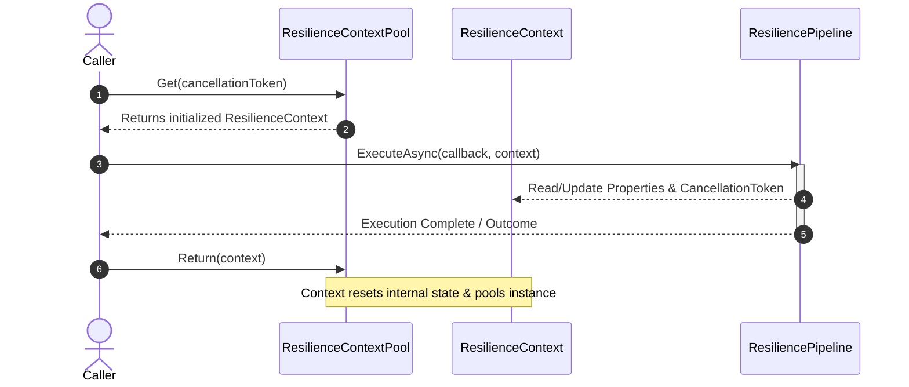
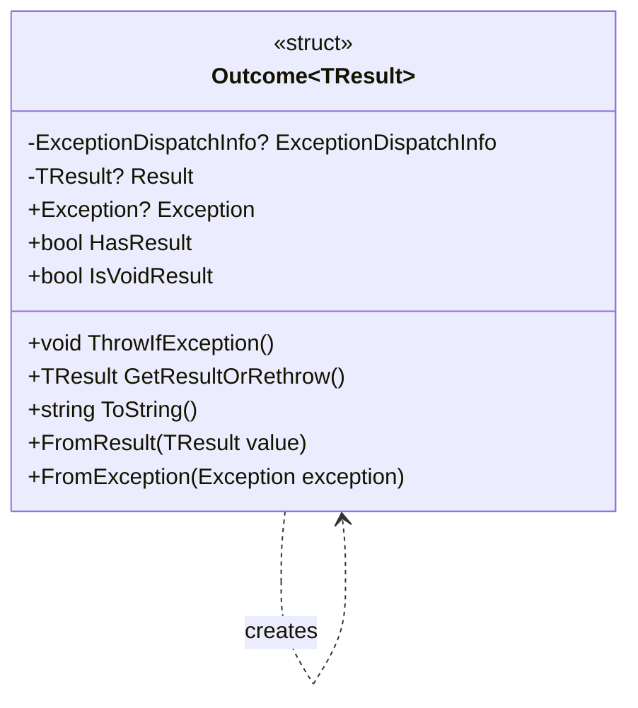

# Context and Outcomes

<details>
<summary>Relevant source files</summary>

The following files were used as context for generating this wiki page:

- [src/Polly.Core/CircuitBreaker/Controller/CircuitStateController.cs](https://github.com/App-vNext/Polly/blob/main/src/Polly.Core/CircuitBreaker/Controller/CircuitStateController.cs)
- [src/Polly/Policy.ExecuteOverloads.cs](https://github.com/App-vNext/Polly/blob/main/src/Polly/Policy.ExecuteOverloads.cs)
- [src/Polly.Core/Hedging/Controller/TaskExecution.cs](https://github.com/App-vNext/Polly/blob/main/src/Polly.Core/Hedging/Controller/TaskExecution.cs)
- [src/Polly/Policy.TResult.ExecuteOverloads.cs](https://github.com/App-vNext/Polly/blob/main/src/Polly/Policy.TResult.ExecuteOverloads.cs)
- [src/Snippets/Docs/Performance.cs](https://github.com/App-vNext/Snippets/Docs/Performance.cs)
- [src/Polly.Core/ResiliencePipeline.AsyncT.cs](https://github.com/App-vNext/Polly/blob/main/src/Polly.Core/ResiliencePipeline.AsyncT.cs)
- [src/Polly/AsyncPolicy.ExecuteOverloads.cs](https://github.com/App-vNext/Polly/blob/main/src/Polly/AsyncPolicy.ExecuteOverloads.cs)
- [src/Polly/AsyncPolicy.TResult.ExecuteOverloads.cs](https://github.com/App-vNext/Polly/blob/main/src/Polly/AsyncPolicy.TResult.ExecuteOverloads.cs)
- [docs/pipelines/index.md](https://github.com/App-vNext/Polly/blob/main/docs/pipelines/index.md)
- [src/Polly/CircuitBreaker/AsyncCircuitBreakerEngine.cs](https://github.com/App-vNext/Polly/blob/main/src/Polly/CircuitBreaker/AsyncCircuitBreakerEngine.cs)
- [src/Polly/Fallback/AsyncFallbackEngine.cs](https://github.com/App-vNext/Polly/blob/main/src/Polly/Fallback/AsyncFallbackEngine.cs)
- [src/Polly.Core/CircuitBreaker/CircuitBreakerResilienceStrategy.cs](https://github.com/App-vNext/Polly/blob/main/src/Polly.Core/CircuitBreaker/CircuitBreakerResilienceStrategy.cs)
- [src/Polly/CircuitBreaker/CircuitBreakerEngine.cs](https://github.com/App-vNext/Polly/blob/main/src/Polly/CircuitBreaker/CircuitBreakerEngine.cs)
- [src/Polly/Fallback/FallbackEngine.cs](https://github.com/App-vNext/Polly/blob/main/src/Polly/Fallback/FallbackEngine.cs)
- [src/Polly.Core/Utils/Pipeline/DelegatingComponent.cs](https://github.com/App-vNext/Polly/blob/main/src/Polly.Core/Utils/Pipeline/DelegatingComponent.cs)
- [src/Polly.Core/ResiliencePipelineT.Async.cs](https://github.com/App-vNext/Polly/blob/main/src/Polly.Core/ResiliencePipelineT.Async.cs)
- [src/Polly.Core/Utils/DefaultPredicates.cs](https://github.com/App-vNext/Polly/blob/main/src/Polly.Core/Utils/DefaultPredicates.cs)
- [src/Polly.Core/Utils/IOutcomeArguments.cs](https://github.com/App-vNext/Polly/blob/main/src/Polly.Core/Utils/IOutcomeArguments.cs)
- [src/Polly.Core/Outcome.TResult.cs](https://github.com/App-vNext/Polly/blob/main/src/Polly.Core/Outcome.TResult.cs)
- [src/Polly.Core/Fallback/FallbackPredicateArguments.cs](https://github.com/App-vNext/Polly/blob/main/src/Polly.Core/Fallback/FallbackPredicateArguments.cs)
- [src/Polly.Core/ResilienceStrategy.TResult.cs](https://github.com/App-vNext/Polly/blob/main/src/Polly.Core/ResiliencePipeline.AsyncT.cs)
- [src/Polly.Core/Hedging/HedgingPredicateArguments.cs](https://github.com/App-vNext/Polly/blob/main/src/Polly.Core/Hedging/HedgingPredicateArguments.cs)
- [src/Polly.Core/CircuitBreaker/CircuitBreakerPredicateArguments.cs](https://github.com/App-vNext/Polly/blob/main/src/Polly.Core/CircuitBreaker/CircuitBreakerPredicateArguments.cs)
- [src/Polly.Core/ResilienceStrategy.cs](https://github.com/App-vNext/Polly/blob/main/src/Polly.Core/ResiliencePipeline.AsyncT.cs)
- [src/Polly.Core/Fallback/FallbackHandler.cs](https://github.com/App-vNext/Polly/blob/main/src/Polly.Core/Fallback/FallbackHandler.cs)
- [docs/extensibility/reactive-strategy.md](https://github.com/App-vNext/Polly/blob/main/docs/extensibility/reactive-strategy.md)
- [src/Polly/Wrap/AsyncPolicyWrapEngine.cs](https://github.com/App-vNext/Polly/blob/main/src/Polly/Wrap/AsyncPolicyWrapEngine.cs)
- [src/Polly.Core/Outcome.cs](https://github.com/App-vNext/Polly/blob/main/src/Polly.Core/Outcome.cs)
- [src/Polly.Core/PredicateBuilder.cs](https://github.com/App-vNext/Polly/blob/main/src/Polly.Core/PredicateBuilder.cs)
- [src/Polly.Core/ResilienceContext.cs](https://github.com/App-vNext/Polly/blob/main/src/Polly.Core/ResilienceContext.cs)
</details>

## Overview

### Overview Introduction

Context and Outcomes form the foundational telemetry, coordination, and execution state primitives of Polly v8. In prior versions, exception handling and state transmission relied heavily on direct exception throwing, dynamic closures, and untyped dictionary properties. The modern Polly architecture introduces `ResilienceContext` to manage execution-scoped metadata, cancellation tokens, low-allocation state passing, and pooling semantics across resilience pipelines, while `Outcome<TResult>` encapsulates operation results or exceptions into unified value types without triggering exception-handling overhead.

Sources: [src/Polly.Core/ResilienceContext.cs:1-108](https://github.com/App-vNext/Polly/blob/main/src/Polly.Core/ResilienceContext.cs#L1-L108)

Together, these mechanisms solve the dual problems of high memory allocation during high-throughput pipeline executions and the opaque boundary between user-defined callbacks and reactive resilience strategies (such as retries, circuit breakers, fallbacks, and hedging). By passing explicit `ResilienceContext` instances and evaluating `Outcome<TResult>` structs, resilience strategies can inspect operation performance, coordinate state across retry attempts, and determine whether an outcome should trigger corrective actions.

Sources: [src/Polly.Core/Outcome.TResult.cs:1-93](https://github.com/App-vNext/Polly/blob/main/src/Polly.Core/Outcome.TResult.cs#L1-L93)

This document details the architectural design, control flow, public interfaces, memory pooling mechanics, and optimization patterns associated with Context and Outcomes in Polly.

Sources: [src/Polly.Core/ResilienceContext.cs:1-108](https://github.com/App-vNext/Polly/blob/main/src/Polly.Core/ResilienceContext.cs#L1-L108), [src/Polly.Core/Outcome.TResult.cs:1-93](https://github.com/App-vNext/Polly/blob/main/src/Polly.Core/Outcome.TResult.cs#L1-L93)

---

## ResilienceContext Architecture and Lifecycle

### Context Scope and Properties

`ResilienceContext` is a sealed state container assigned to a single execution of a `ResiliencePipeline`. It carries metadata across strategies and delegates within a pipeline. Unlike legacy `Context` dictionaries, `ResilienceContext` is optimized for high-performance pooling and zero-allocation state passing.

Sources: [src/Polly.Core/ResilienceContext.cs:14-18](https://github.com/App-vNext/Polly/blob/main/src/Polly.Core/ResilienceContext.cs#L14-L18)

Each `ResilienceContext` instance tracks execution properties including cancellation tokens, synchronization context continuation preferences, result type markers, and custom key-value property bags.

| Property | Type | Description |
| :--- | :--- | :--- |
| `OperationKey` | `string?` | Low-cardinality key identifying the call site for telemetry and logging. |
| `CancellationToken` | `CancellationToken` | Token associated with the execution and propagated to strategies. |
| `ContinueOnCapturedContext` | `bool` | Controls whether awaited tasks continue on the captured synchronization context. |
| `Properties` | `ResilienceProperties` | Custom key-value property bag for inter-strategy data exchange. |
| `IsSynchronous` | `bool` | Indicates whether the pipeline execution was invoked synchronously. |

Sources: [src/Polly.Core/ResilienceContext.cs:14-65](https://github.com/App-vNext/Polly/blob/main/src/Polly.Core/ResilienceContext.cs#L14-L65)

### Context Pooling and Reset Mechanics

To avoid garbage collection pressure in high-throughput applications, contexts are managed via `ResilienceContextPool`. Callers acquire a context before execution and return it to the shared pool immediately after completion.

Sources: [docs/pipelines/index.md:35-38](https://github.com/App-vNext/Polly/blob/main/docs/pipelines/index.md#L35-L38)



Sources: [docs/pipelines/index.md:35-59](https://github.com/App-vNext/Polly/blob/main/docs/pipelines/index.md#L35-L59), [src/Polly.Core/ResilienceContext.cs:91-100](https://github.com/App-vNext/Polly/blob/main/src/Polly.Core/ResilienceContext.cs#L91-L100)

> [!WARNING]
> Never re-use an instance of `ResilienceContext` across more than one concurrent execution. Always return contexts to `ResilienceContextPool.Shared` in a `finally` block or via structured usage patterns to prevent state leakage and pool exhaustion.

Sources: [src/Polly.Core/ResilienceContext.cs:9-13](https://github.com/App-vNext/Polly/blob/main/src/Polly.Core/ResilienceContext.cs#L9-L13)

---

## Outcome and Outcome<TResult> Structures

### Outcome Definition and Storage

`Outcome<TResult>` is a readonly struct representing the result of an operation, which can either be a successful result of type `TResult` or a captured exception. By wrapping outcomes rather than throwing exceptions, reactive strategies can inspect failures without incurring stack-trace capture or exception-dispatch overhead.

Sources: [src/Polly.Core/Outcome.TResult.cs:7-15](https://github.com/App-vNext/Polly/blob/main/src/Polly.Core/Outcome.TResult.cs#L7-L15)

The struct holds either a result value or an `ExceptionDispatchInfo` instance, ensuring that if an exception is later re-thrown via `GetResultOrRethrow()`, its original stack trace is fully preserved.

Sources: [src/Polly.Core/Outcome.TResult.cs:16-34](https://github.com/App-vNext/Polly/blob/main/src/Polly.Core/Outcome.TResult.cs#L16-L34)



Sources: [src/Polly.Core/Outcome.TResult.cs:14-93](https://github.com/App-vNext/Polly/blob/main/src/Polly.Core/Outcome.TResult.cs#L14-L93), [src/Polly.Core/Outcome.cs:6-55](https://github.com/App-vNext/Polly/blob/main/src/Polly.Core/Outcome.cs#L6-L55)

### Outcome Utility API

| Method / Property | Return Type | Description |
| :--- | :--- | :--- |
| `Outcome.FromResult<T>(val)` | `Outcome<T>` | Wraps a successful result value. |
| `Outcome.FromException<T>(ex)` | `Outcome<T>` | Wraps an exception with capture. |
| `ThrowIfException()` | `void` | Throws the stored exception preserving stack trace if present. |
| `GetResultOrRethrow()` | `TResult` | Throws if exception exists; otherwise returns `Result`. |
| `TryGetResult(out result)` | `bool` | Safely retrieves the result if execution succeeded without exception. |

Sources: [src/Polly.Core/Outcome.TResult.cs:54-76](https://github.com/App-vNext/Polly/blob/main/src/Polly.Core/Outcome.TResult.cs#L54-L76), [src/Polly.Core/Outcome.cs:14-36](https://github.com/App-vNext/Polly/blob/main/src/Polly.Core/Outcome.cs#L14-L36)

Sources: [src/Polly.Core/Outcome.TResult.cs:54-92](https://github.com/App-vNext/Polly/blob/main/src/Polly.Core/Outcome.TResult.cs#L54-L92)

---

## Reactive Strategy Integration and Predicates

### Predicate Arguments and Contracts

Reactive strategies use `Outcome<TResult>` inside predicate evaluation arguments to decide whether an execution attempt should be handled (e.g., retried, broken by a circuit breaker, or caught by a fallback).

Sources: [docs/extensibility/reactive-strategy.md:60-62](https://github.com/App-vNext/Polly/blob/main/docs/extensibility/reactive-strategy.md#L60-L62)

All strategy predicate arguments implement the `IOutcomeArguments<TResult>` interface, guaranteeing uniform access to the active `ResilienceContext` and the `Outcome<TResult>`.

Sources: [src/Polly.Core/Utils/IOutcomeArguments.cs:7-18](https://github.com/App-vNext/Polly/blob/main/src/Polly.Core/Utils/IOutcomeArguments.cs#L7-L18)

```csharp
internal interface IOutcomeArguments<TResult>
{
    ResilienceContext Context { get; }
    Outcome<TResult> Outcome { get; }
}
```

Sources: [src/Polly.Core/Utils/IOutcomeArguments.cs:7-18](https://github.com/App-vNext/Polly/blob/main/src/Polly.Core/Utils/IOutcomeArguments.cs#L7-L18)

Concrete strategy implementations define custom predicate arguments adhering to this contract, such as `FallbackPredicateArguments<TResult>`, `HedgingPredicateArguments<TResult>`, and `CircuitBreakerPredicateArguments<TResult>`.

Sources: [src/Polly.Core/Fallback/FallbackPredicateArguments.cs:12-34](https://github.com/App-vNext/Polly/blob/main/src/Polly.Core/Fallback/FallbackPredicateArguments.cs#L12-34), [src/Polly.Core/Hedging/HedgingPredicateArguments.cs:12-48](https://github.com/App-vNext/Polly/blob/main/src/Polly.Core/Hedging/HedgingPredicateArguments.cs#L12-48)

> [!NOTE]
> Default exception predicates (`DefaultPredicates<TArgs, TResult>.HandleOutcome`) automatically evaluate whether an outcome contains an exception that is not an `OperationCanceledException`.

Sources: [src/Polly.Core/Utils/DefaultPredicates.cs:3-7](https://github.com/App-vNext/Polly/blob/main/src/Polly.Core/Utils/DefaultPredicates.cs#L3-L7)

---

## Low-Allocation Execution with ExecuteOutcomeAsync

### High-Performance Outcome Execution

For high-throughput performance scenarios, `ResiliencePipeline` provides `ExecuteOutcomeAsync`, allowing callers to execute callbacks that return `ValueTask<Outcome<TResult>>` directly, bypassing exception throwing and try-catch overhead in intermediate strategy layers.

Sources: [src/Polly.Core/ResiliencePipeline.AsyncT.cs:25-36](https://github.com/App-vNext/Polly/blob/main/src/Polly.Core/ResiliencePipeline.AsyncT.cs#L25-L36), [docs/pipelines/index.md:135-136](https://github.com/App-vNext/Polly/blob/main/docs/pipelines/index.md#L135-L136)

### Performance Comparison Code Pattern

```csharp
// Standard execution: Exceptions are thrown and caught by strategies
await pipeline.ExecuteAsync(async cancellationToken => {
    return await GetMemberAsync(id, cancellationToken);
}, cancellationToken);

// High-performance outcome execution: Zero-allocation state & exception encapsulation
ResilienceContext context = ResilienceContextPool.Shared.Get(cancellationToken);

Outcome<Member> outcome = await pipeline.ExecuteOutcomeAsync(
    static async (context, state) => {
        try {
            return Outcome.FromResult(await GetMemberAsync(state, context.CancellationToken));
        } catch (Exception e) {
            return Outcome.FromException<Member>(e);
        }
    },
    context,
    id);

ResilienceContextPool.Shared.Return(context);
```

Sources: [src/Snippets/Docs/Performance.cs:74-118](https://github.com/App-vNext/Snippets/Docs/Performance.cs#L74-L118), [docs/pipelines/index.md:94-123](https://github.com/App-vNext/Polly/blob/main/docs/pipelines/index.md#L94-L123)

---

## State Passing vs Context Metadata

### Comparative Mechanics

When invoking `ResiliencePipeline.ExecuteAsync` or `ExecuteOutcomeAsync`, developers can supply a separate `state` object alongside `ResilienceContext`.

Sources: [docs/pipelines/index.md:138-142](https://github.com/App-vNext/Polly/blob/main/docs/pipelines/index.md#L138-L142)

| Feature | `state` Parameter | `ResilienceContext` |
| :--- | :--- | :--- |
| **Lifetime** | Scoped strictly to the immediate callback invocation. | Scoped to the entire pipeline execution across all strategies and attempts. |
| **Allocation** | Zero-allocation when using static lambdas with state structs. | Retrieved from `ResilienceContextPool`, returned after execution. |
| **Usage Intent** | Pass caller-scope parameters (e.g., `(httpClient, endpoint)`) without closures. | Exchange telemetry keys, custom data properties, and cancellation across strategies. |

Sources: [docs/pipelines/index.md:138-161](https://github.com/App-vNext/Polly/blob/main/docs/pipelines/index.md#L138-L161)

---

## Design Trade-offs

### Trade-off Evaluation Table

| Design Choice | Benefit | Cost |
| :--- | :--- | :--- |
| **Readonly Outcome Structs** | Eliminates heap allocations for successful results and captured exceptions. | Requires explicit wrapping/unwrapping via `Outcome.FromResult` or `ExecuteOutcomeAsync`. |
| **Context Pooling (`ResilienceContextPool`)** | Prevents frequent garbage collection cycles under high concurrency. | Requires disciplined manual borrowing and returning (`Get`/`Return`) in advanced low-allocation APIs. |
| **Separate State Parameter** | Enables C# static lambdas, completely eliminating closure allocations. | Introduces an extra parameter on execution overloads. |

Sources: [docs/pipelines/index.md:138-147](https://github.com/App-vNext/Polly/blob/main/docs/pipelines/index.md#L138-L147), [src/Polly.Core/Outcome.TResult.cs:14-24](https://github.com/App-vNext/Polly/blob/main/src/Polly.Core/Outcome.TResult.cs#L14-L24), [src/Polly.Core/ResilienceContext.cs:9-13](https://github.com/App-vNext/Polly/blob/main/src/Polly.Core/ResilienceContext.cs#L9-L13)

## Related

- [[Resilience Pipelines]]
- [[Pooling and Utilities]]

