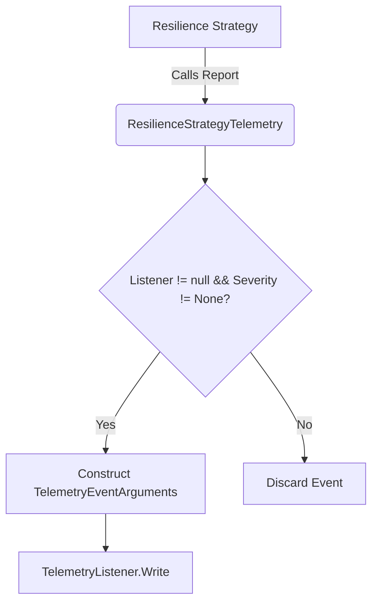
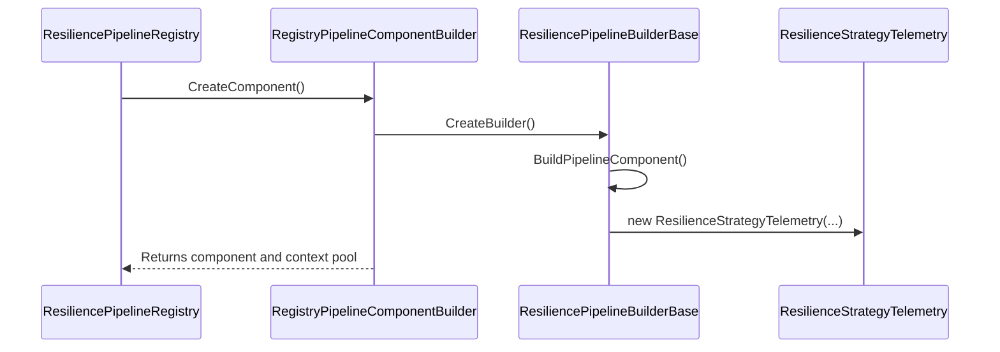
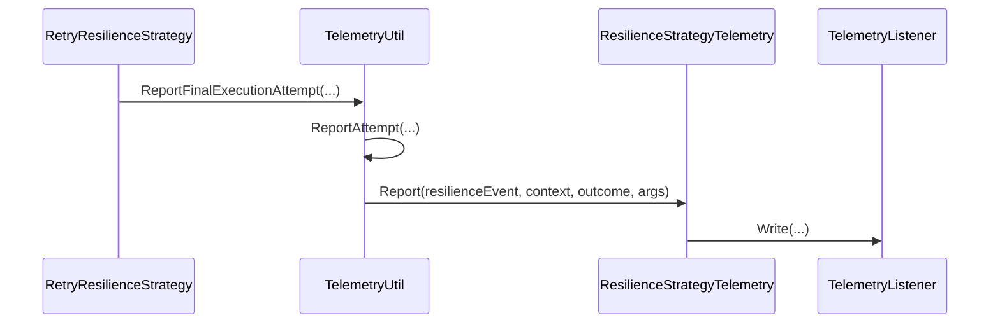
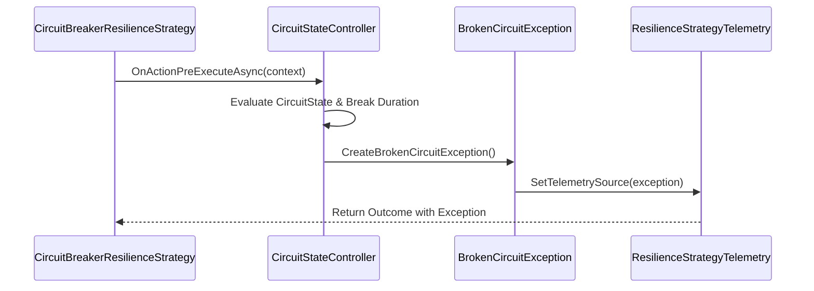

# Core Telemetry Infrastructure

Relevant source files

The following files were used as context for generating this wiki page:

- [src/Polly.Extensions/Telemetry/TelemetryListenerImpl.cs](https://github.com/App-vNext/Polly/blob/main/src/Polly.Extensions/Telemetry/TelemetryListenerImpl.cs)
- [src/Snippets/Docs/Telemetry.cs](https://github.com/App-vNext/Polly/blob/main/src/Snippets/Docs/Telemetry.cs)
- [docs/advanced/telemetry.md](https://github.com/App-vNext/Polly/blob/main/docs/advanced/telemetry.md)
- [src/Polly.Core/Hedging/Controller/TaskExecution.cs](https://github.com/App-vNext/Polly/blob/main/src/Polly.Core/Hedging/Controller/TaskExecution.cs)
- [src/Polly.Extensions/Telemetry/TelemetryResiliencePipelineBuilderExtensions.cs](https://github.com/App-vNext/Polly/blob/main/src/Polly.Extensions/Telemetry/TelemetryResiliencePipelineBuilderExtensions.cs)
- [src/Polly.Core/ResiliencePipelineBuilderBase.cs](https://github.com/App-vNext/Polly/blob/main/src/Polly.Core/ResiliencePipelineBuilderBase.cs)
- [src/Polly.Core/Telemetry/ResilienceStrategyTelemetry.cs](https://github.com/App-vNext/Polly/blob/main/src/Polly.Core/Telemetry/ResilienceStrategyTelemetry.cs)
- [src/Polly.Extensions/Telemetry/TelemetryOptions.cs](https://github.com/App-vNext/Polly/blob/main/src/Polly.Extensions/Telemetry/TelemetryOptions.cs)
- [src/Polly.Core/Telemetry/TelemetryUtil.cs](https://github.com/App-vNext/Polly/blob/main/src/Polly.Core/Telemetry/TelemetryUtil.cs)
- [src/Polly.Core/Telemetry/TelemetryListener.cs](https://github.com/App-vNext/Polly/blob/main/src/Polly.Core/Telemetry/TelemetryListener.cs)
- [src/Polly.Extensions/Telemetry/Log.cs](https://github.com/App-vNext/Polly/blob/main/src/Polly.Extensions/Telemetry/Log.cs)
- [src/Polly.Extensions/README.md](https://github.com/App-vNext/Polly/blob/main/src/Polly.Extensions/README.md)
- [src/Polly.Core/Telemetry/ResilienceTelemetrySource.cs](https://github.com/App-vNext/Polly/blob/main/src/Polly.Core/Telemetry/ResilienceTelemetrySource.cs)
- [src/Polly.Core/ExecutionRejectedException.cs](https://github.com/App-vNext/Polly/blob/main/src/Polly.Core/ExecutionRejectedException.cs)
- [src/Polly.Core/Telemetry/ResilienceEventSeverity.cs](https://github.com/App-vNext/Polly/blob/main/src/Polly.Core/Telemetry/ResilienceEventSeverity.cs)
- [docs/strategies/retry.md](https://github.com/App-vNext/Polly/blob/main/docs/strategies/retry.md)
- [src/Polly.Core/Telemetry/TelemetryEventArguments.cs](https://github.com/App-vNext/Polly/blob/main/src/Polly.Core/Telemetry/TelemetryEventArguments.cs)
- [AGENTS.md](https://github.com/App-vNext/Polly/blob/main/AGENTS.md)
- [src/Polly.Core/README.md](https://github.com/App-vNext/Polly/blob/main/src/Polly.Core/README.md)
- [src/Polly.Core/Telemetry/ExecutionAttemptArguments.cs](https://github.com/App-vNext/Polly/blob/main/src/Polly.Core/Telemetry/ExecutionAttemptArguments.cs)
- [src/Polly.Core/Telemetry/ResilienceEvent.cs](https://github.com/App-vNext/Polly/blob/main/src/Polly.Core/Telemetry/ResilienceEvent.cs)
- [src/Polly.Core/CircuitBreaker/CircuitBreakerResilienceStrategy.cs](https://github.com/App-vNext/Polly/blob/main/src/Polly.Core/CircuitBreaker/CircuitBreakerResilienceStrategy.cs)
- [src/Polly.Core/CircuitBreaker/Controller/CircuitStateController.cs](https://github.com/App-vNext/Polly/blob/main/src/Polly.Core/CircuitBreaker/Controller/CircuitStateController.cs)
- [src/Polly.Core/Registry/RegistryPipelineComponentBuilder.cs](https://github.com/App-vNext/Polly/blob/main/src/Polly.Core/Registry/RegistryPipelineComponentBuilder.cs)
- [src/Polly.Core/Registry/ResiliencePipelineRegistry.TResult.cs](https://github.com/App-vNext/Polly/blob/main/src/Polly.Core/Registry/ResiliencePipelineRegistry.TResult.cs)
- [src/Polly.Core/Retry/RetryResilienceStrategy.cs](https://github.com/App-vNext/Polly/blob/main/src/Polly.Core/Retry/RetryResilienceStrategy.cs)

## Overview

Polly provides a comprehensive telemetry infrastructure that captures execution metrics, resilience events, and diagnostic logs across all built-in resilience strategies. Designed for extensibility and integration with modern diagnostic tooling, the telemetry system bridges internal strategy execution with external monitoring sinks through modular abstractions, pipeline builder extensions, and customizable listeners.

Sources: [src/Polly.Extensions/README.md:1-7](https://github.com/App-vNext/Polly/blob/main/src/Polly.Extensions/README.md#L1-L7), [docs/advanced/telemetry.md:1-4](https://github.com/App-vNext/Polly/blob/main/docs/advanced/telemetry.md#L1-L4), [src/Polly.Core/Telemetry/ResilienceStrategyTelemetry.cs:5-11](https://github.com/App-vNext/Polly/blob/main/src/Polly.Core/Telemetry/ResilienceStrategyTelemetry.cs#L5-L11)

## Telemetry Data Models and Contracts

### Telemetry Data Models and Contracts

The telemetry architecture relies on a core set of abstractions and value types to package, filter, and transmit diagnostics data from individual resilience strategies. At the center of this mechanism is `ResilienceStrategyTelemetry`, a sealed class invoked by strategies to report significant execution milestones, such as a retry attempt or timeout expiration.

Sources: [src/Polly.Core/Telemetry/ResilienceStrategyTelemetry.cs:5-12](https://github.com/App-vNext/Polly/blob/main/src/Polly.Core/Telemetry/ResilienceStrategyTelemetry.cs#L5-L12)

When a strategy reports an event, `ResilienceStrategyTelemetry` checks two gatekeeping conditions before writing to the diagnostic listener: it verifies that the `Listener` is not null and that the severity of the incoming `ResilienceEvent` is not set to `ResilienceEventSeverity.None`. If these checks pass, it instantiates and dispatches a generic `TelemetryEventArguments<TResult, TArgs>` struct containing the source, event definition, execution context, custom arguments, and optional outcome data.

Sources: [src/Polly.Core/Telemetry/ResilienceStrategyTelemetry.cs:46-86](https://github.com/App-vNext/Polly/blob/main/src/Polly.Core/Telemetry/ResilienceStrategyTelemetry.cs#L46-L86)

Sources: [src/Polly.Core/Telemetry/ResilienceStrategyTelemetry.cs:46-86](https://github.com/App-vNext/Polly/blob/main/src/Polly.Core/Telemetry/ResilienceStrategyTelemetry.cs#L46-L86)

### Core Telemetry Contracts

The core telemetry namespace defines several fundamental types that represent the metadata, severity levels, and event arguments circulating through the pipeline.

| Type Name | Kind | Purpose | Sources |
| --- | --- | --- | --- |
| `ResilienceStrategyTelemetry` | Class | Primary facade used by strategies to report events and attach telemetry sources. | [src/Polly.Core/Telemetry/ResilienceStrategyTelemetry.cs:11-87](https://github.com/App-vNext/Polly/blob/main/src/Polly.Core/Telemetry/ResilienceStrategyTelemetry.cs#L11-L87) |
| `ResilienceTelemetrySource` | Class | Holds identifiers for pipeline name, pipeline instance name, and strategy name. | [src/Polly.Core/Telemetry/ResilienceTelemetrySource.cs:9-41](https://github.com/App-vNext/Polly/blob/main/src/Polly.Core/Telemetry/ResilienceTelemetrySource.cs#L9-L41) |
| `ResilienceEvent` | Struct | Encapsulates an event name and its associated severity. | [src/Polly.Core/Telemetry/ResilienceEvent.cs:11-39](https://github.com/App-vNext/Polly/blob/main/src/Polly.Core/Telemetry/ResilienceEvent.cs#L11-L39) |
| `ResilienceEventSeverity` | Enum | Defines logging and reporting severity levels (`None`, `Debug`, `Information`, `Warning`, `Error`, `Critical`). | [src/Polly.Core/Telemetry/ResilienceEventSeverity.cs:6-37](https://github.com/App-vNext/Polly/blob/main/src/Polly.Core/Telemetry/ResilienceEventSeverity.cs#L6-L37) |
| `TelemetryEventArguments<TResult, TArgs>` | Struct | Generic payload container wrapping source, event, context, custom arguments, and outcome. | [src/Polly.Core/Telemetry/TelemetryEventArguments.cs:13-56](https://github.com/App-vNext/Polly/blob/main/src/Polly.Core/Telemetry/TelemetryEventArguments.cs#L13-L56) |
| `ExecutionAttemptArguments` | Struct | Encapsulates attempt metrics including attempt number, duration, and whether the outcome was handled. | [src/Polly.Core/Telemetry/ExecutionAttemptArguments.cs:11-40](https://github.com/App-vNext/Polly/blob/main/src/Polly.Core/Telemetry/ExecutionAttemptArguments.cs#L11-L40) |

Sources: [src/Polly.Core/Telemetry/ResilienceStrategyTelemetry.cs:11-87](https://github.com/App-vNext/Polly/blob/main/src/Polly.Core/Telemetry/ResilienceStrategyTelemetry.cs#L11-L87), [src/Polly.Core/Telemetry/ResilienceTelemetrySource.cs:9-41](https://github.com/App-vNext/Polly/blob/main/src/Polly.Core/Telemetry/ResilienceTelemetrySource.cs#L9-L41), [src/Polly.Core/Telemetry/ResilienceEvent.cs:11-39](https://github.com/App-vNext/Polly/blob/main/src/Polly.Core/Telemetry/ResilienceEvent.cs#L11-L39), [src/Polly.Core/Telemetry/ResilienceEventSeverity.cs:6-37](https://github.com/App-vNext/Polly/blob/main/src/Polly.Core/Telemetry/ResilienceEventSeverity.cs#L6-L37), [src/Polly.Core/Telemetry/TelemetryEventArguments.cs:13-56](https://github.com/App-vNext/Polly/blob/main/src/Polly.Core/Telemetry/TelemetryEventArguments.cs#L13-L56), [src/Polly.Core/Telemetry/ExecutionAttemptArguments.cs:11-40](https://github.com/App-vNext/Polly/blob/main/src/Polly.Core/Telemetry/ExecutionAttemptArguments.cs#L11-L40)

> [!WARNING]
> Value types such as `TelemetryEventArguments<TResult, TArgs>`, `ExecutionAttemptArguments`, and `ResilienceEvent` suppress warning CA1815 and require explicit constructor invocation to guarantee binary compatibility across future releases.

Sources: [src/Polly.Core/Telemetry/TelemetryEventArguments.cs:3-12](https://github.com/App-vNext/Polly/blob/main/src/Polly.Core/Telemetry/TelemetryEventArguments.cs#L3-L12), [src/Polly.Core/Telemetry/ExecutionAttemptArguments.cs:3-10](https://github.com/App-vNext/Polly/blob/main/src/Polly.Core/Telemetry/ExecutionAttemptArguments.cs#L3-L10), [src/Polly.Core/Telemetry/ResilienceEvent.cs:3-10](https://github.com/App-vNext/Polly/blob/main/src/Polly.Core/Telemetry/ResilienceEvent.cs#L3-L10)

## Telemetry Pipeline Builder Integration

### Overview

Telemetry sources and strategy telemetry wrappers are instantiated and bound during pipeline construction and registry lookup phases. The `ResiliencePipelineBuilderBase` and `RegistryPipelineComponentBuilder` coordinate with `ResilienceTelemetrySource` and `ResilienceStrategyTelemetry` to ensure that every strategy within a composite pipeline or registry-managed pipeline receives accurate telemetry context encompassing the builder name, instance name, and strategy-specific options.

Sources: [src/Polly.Core/ResiliencePipelineBuilderBase.cs:104-146](https://github.com/App-vNext/Polly/blob/main/src/Polly.Core/ResiliencePipelineBuilderBase.cs#L104-L146), [src/Polly.Core/Registry/RegistryPipelineComponentBuilder.cs:24-61](https://github.com/App-vNext/Polly/blob/main/src/Polly.Core/Registry/RegistryPipelineComponentBuilder.cs#L24-L61)

### Execution Walkthrough and Sequence

When looking up a resilience pipeline from a registry or building a component hierarchy, execution flows through a precise sequence of factory and builder methods.

1. `TryGet` checks if a cached pipeline exists in `GenericRegistry`, falling back to `GetOrAdd` when a builder registration is present.
Sources: [src/Polly.Core/Registry/ResiliencePipelineRegistry.TResult.cs:31-46](https://github.com/App-vNext/Polly/blob/main/src/Polly.Core/Registry/ResiliencePipelineRegistry.TResult.cs#L31-L46)

2. `GetOrAdd` instantiates a `RegistryPipelineComponentBuilder` and invokes `CreateComponent`.
Sources: [src/Polly.Core/Registry/ResiliencePipelineRegistry.TResult.cs:48-65](https://github.com/App-vNext/Polly/blob/main/src/Polly.Core/Registry/ResiliencePipelineRegistry.TResult.cs#L48-L65)

3. `CreateComponent` calls `CreateBuilder` to construct and configure the pipeline builder instance.
Sources: [src/Polly.Core/Registry/RegistryPipelineComponentBuilder.cs:24-31](https://github.com/App-vNext/Polly/blob/main/src/Polly.Core/Registry/RegistryPipelineComponentBuilder.cs#L24-L31)

4. `CreateBuilder` invokes the activator, applies names, configures the builder context, and calls `BuildPipelineComponent`.
Sources: [src/Polly.Core/Registry/RegistryPipelineComponentBuilder.cs:44-61](https://github.com/App-vNext/Polly/blob/main/src/Polly.Core/Registry/RegistryPipelineComponentBuilder.cs#L44-L61)

5. `BuildPipelineComponent` validates configuration, marks the builder as used, converts registered strategy entries, and instantiates a composite component backed by `ResilienceStrategyTelemetry`.
Sources: [src/Polly.Core/ResiliencePipelineBuilderBase.cs:118-135](https://github.com/App-vNext/Polly/blob/main/src/Polly.Core/ResiliencePipelineBuilderBase.cs#L118-L135)

6. `ResilienceStrategyTelemetry` encapsulates the generated `ResilienceTelemetrySource` and optional `TelemetryListener` for strategy event reporting.
Sources: [src/Polly.Core/Telemetry/ResilienceStrategyTelemetry.cs:11-18](https://github.com/App-vNext/Polly/blob/main/src/Polly.Core/Telemetry/ResilienceStrategyTelemetry.cs#L11-L18)

Sources: [src/Polly.Core/ResiliencePipelineBuilderBase.cs:118-135](https://github.com/App-vNext/Polly/blob/main/src/Polly.Core/ResiliencePipelineBuilderBase.cs#L118-L135), [src/Polly.Core/Registry/RegistryPipelineComponentBuilder.cs:24-61](https://github.com/App-vNext/Polly/blob/main/src/Polly.Core/Registry/RegistryPipelineComponentBuilder.cs#L24-L61), [src/Polly.Core/Registry/ResiliencePipelineRegistry.TResult.cs:31-65](https://github.com/App-vNext/Polly/blob/main/src/Polly.Core/Registry/ResiliencePipelineRegistry.TResult.cs#L31-L65), [src/Polly.Core/Telemetry/ResilienceStrategyTelemetry.cs:11-18](https://github.com/App-vNext/Polly/blob/main/src/Polly.Core/Telemetry/ResilienceStrategyTelemetry.cs#L11-L18)

> [!CAUTION]
> Once `BuildPipelineComponent()` has been invoked on a `ResiliencePipelineBuilderBase` instance, the `_used` flag is set to `true`, and any subsequent calls to `AddPipelineComponent` will immediately throw an `InvalidOperationException`.

Sources: [src/Polly.Core/ResiliencePipelineBuilderBase.cs:110-116](https://github.com/App-vNext/Polly/blob/main/src/Polly.Core/ResiliencePipelineBuilderBase.cs#L110-L116)

### Component Builder and Registry Design Trade-Offs

| Design Choice | Benefit | Cost | Sources |
| --- | --- | --- | --- |
| Single-use builder enforcement (`_used` flag) | Prevents race conditions and unintended mutation of compiled execution trees. | Requires creating new builder instances or using registry factories for dynamic reconfiguration. | [src/Polly.Core/ResiliencePipelineBuilderBase.cs:110-116](https://github.com/App-vNext/Polly/blob/main/src/Polly.Core/ResiliencePipelineBuilderBase.cs#L110-L116) |
| Reloadable component wrapping via tokens | Enables live updates of pipeline definitions when configuration tokens fire. | Introduces minor allocation overhead during reload evaluation and state swapping. | [src/Polly.Core/Registry/RegistryPipelineComponentBuilder.cs:33-41](https://github.com/App-vNext/Polly/blob/main/src/Polly.Core/Registry/RegistryPipelineComponentBuilder.cs#L33-L41) |
| Separate strategy telemetry scopes | Isolates telemetry signals per strategy entry with specific strategy option names. | Allocates distinct `ResilienceTelemetrySource` and `ResilienceStrategyTelemetry` instances per strategy. | [src/Polly.Core/ResiliencePipelineBuilderBase.cs:137-146](https://github.com/App-vNext/Polly/blob/main/src/Polly.Core/ResiliencePipelineBuilderBase.cs#L137-L146) |

Sources: [src/Polly.Core/ResiliencePipelineBuilderBase.cs:110-116](https://github.com/App-vNext/Polly/blob/main/src/Polly.Core/ResiliencePipelineBuilderBase.cs#L110-L116), [src/Polly.Core/Registry/RegistryPipelineComponentBuilder.cs:33-41](https://github.com/App-vNext/Polly/blob/main/src/Polly.Core/Registry/RegistryPipelineComponentBuilder.cs#L33-L41), [src/Polly.Core/ResiliencePipelineBuilderBase.cs:137-146](https://github.com/App-vNext/Polly/blob/main/src/Polly.Core/ResiliencePipelineBuilderBase.cs#L137-L146)

## Telemetry Reporting and Execution Flow

### Telemetry Reporting and Execution Flow

### Overview
Resilience strategies emit telemetry signals during execution through centralized utility methods and direct strategy callbacks. As strategies such as `RetryResilienceStrategy` and `TaskExecution` process callbacks, they measure execution duration, evaluate predicates, and invoke telemetry reporting helpers.
Sources: [src/Polly.Core/Retry/RetryResilienceStrategy.cs:46-80](https://github.com/App-vNext/Polly/blob/main/src/Polly.Core/Retry/RetryResilienceStrategy.cs#L46-L80), [src/Polly.Core/Hedging/Controller/TaskExecution.cs:235-242](https://github.com/App-vNext/Polly/blob/main/src/Polly.Core/Hedging/Controller/TaskExecution.cs#L235-L242)

### Execution Walkthrough
The execution flow from strategy entry down to the telemetry listener proceeds through a precise sequence of utility invocations. The call chain follows: `ExecuteCore` → `ReportFinalExecutionAttempt` → `ReportAttempt` → `Report`.

1. `ExecuteCore` initiates or completes an execution attempt within `RetryResilienceStrategy` or task controllers, calculating elapsed time and checking whether the current attempt is the final one.
Sources: [src/Polly.Core/Retry/RetryResilienceStrategy.cs:46-80](https://github.com/App-vNext/Polly/blob/main/src/Polly.Core/Retry/RetryResilienceStrategy.cs#L46-L80)
2. `ReportFinalExecutionAttempt` (or `ReportExecutionAttempt`) wraps the outcome and determines whether the event severity is `Error`, `Warning`, or `Information` based on predicate evaluation (`handle`).
Sources: [src/Polly.Core/Telemetry/TelemetryUtil.cs:29-43](https://github.com/App-vNext/Polly/blob/main/src/Polly.Core/Telemetry/TelemetryUtil.cs#L29-L43)
3. `ReportAttempt` checks whether the underlying `ResilienceStrategyTelemetry` instance is enabled before forwarding the event and arguments.
Sources: [src/Polly.Core/Telemetry/TelemetryUtil.cs:45-56](https://github.com/App-vNext/Polly/blob/main/src/Polly.Core/Telemetry/TelemetryUtil.cs#L45-L56)
4. `Report` on `ResilienceStrategyTelemetry` validates the context and writes the telemetry event data into the active `TelemetryListener`.
Sources: [src/Polly.Core/Telemetry/ResilienceStrategyTelemetry.cs:46-56](https://github.com/App-vNext/Polly/blob/main/src/Polly.Core/Telemetry/ResilienceStrategyTelemetry.cs#L46-L56)

Sources: [src/Polly.Core/Retry/RetryResilienceStrategy.cs:46-80](https://github.com/App-vNext/Polly/blob/main/src/Polly.Core/Retry/RetryResilienceStrategy.cs#L46-L80), [src/Polly.Core/Telemetry/TelemetryUtil.cs:29-56](https://github.com/App-vNext/Polly/blob/main/src/Polly.Core/Telemetry/TelemetryUtil.cs#L29-L56), [src/Polly.Core/Telemetry/ResilienceStrategyTelemetry.cs:46-56](https://github.com/App-vNext/Polly/blob/main/src/Polly.Core/Telemetry/ResilienceStrategyTelemetry.cs#L46-L56)

> [!NOTE]
> `TelemetryUtil` methods verify `telemetry.Enabled` before dispatching events. If no telemetry listener is attached during builder configuration, reporting calls return immediately without allocations.
Sources: [src/Polly.Core/Telemetry/TelemetryUtil.cs:52-56](https://github.com/App-vNext/Polly/blob/main/src/Polly.Core/Telemetry/TelemetryUtil.cs#L52-L56), [src/Polly.Core/Telemetry/ResilienceStrategyTelemetry.cs:50-53](https://github.com/App-vNext/Polly/blob/main/src/Polly.Core/Telemetry/ResilienceStrategyTelemetry.cs#L50-L53)

### Telemetry Reporting API Reference

| Method Name | Parameters | Severity Assigned | Purpose | Sources |
| --- | --- | --- | --- | --- |
| `ReportExecutionAttempt` | `telemetry`, `context`, `outcome`, `attempt`, `executionTime`, `handled` | `Warning` if handled, else `Information` | Reports an intermediate execution attempt that will be retried or hedged. | [src/Polly.Core/Telemetry/TelemetryUtil.cs:13-27](https://github.com/App-vNext/Polly/blob/main/src/Polly.Core/Telemetry/TelemetryUtil.cs#L13-L27) |
| `ReportFinalExecutionAttempt` | `telemetry`, `context`, `outcome`, `attempt`, `executionTime`, `handled` | `Error` if handled, else `Information` | Reports the terminal execution attempt when retry limits or hedging bounds are exhausted. | [src/Polly.Core/Telemetry/TelemetryUtil.cs:29-43](https://github.com/App-vNext/Polly/blob/main/src/Polly.Core/Telemetry/TelemetryUtil.cs#L29-L43) |
| `Report<TArgs>` | `resilienceEvent`, `context`, `args` | Defined by `resilienceEvent.Severity` | Emits strategy-specific lifecycle events such as `OnRetry` or `OnHedging`. | [src/Polly.Core/Telemetry/ResilienceStrategyTelemetry.cs:46-56](https://github.com/App-vNext/Polly/blob/main/src/Polly.Core/Telemetry/ResilienceStrategyTelemetry.cs#L46-L56) |
| `Report<TArgs, TResult>` | `resilienceEvent`, `context`, `outcome`, `args` | Defined by `resilienceEvent.Severity` | Emits strategy events accompanied by specific outcome results. | [src/Polly.Core/Telemetry/ResilienceStrategyTelemetry.cs:67-75](https://github.com/App-vNext/Polly/blob/main/src/Polly.Core/Telemetry/ResilienceStrategyTelemetry.cs#L67-L75) |

Sources: [src/Polly.Core/Telemetry/TelemetryUtil.cs:13-43](https://github.com/App-vNext/Polly/blob/main/src/Polly.Core/Telemetry/TelemetryUtil.cs#L13-L43), [src/Polly.Core/Telemetry/ResilienceStrategyTelemetry.cs:46-75](https://github.com/App-vNext/Polly/blob/main/src/Polly.Core/Telemetry/ResilienceStrategyTelemetry.cs#L46-L75)

### Execution Flow Design Trade-Offs

| Design Choice | Benefit | Cost | Sources |
| --- | --- | --- | --- |
| Centralized `TelemetryUtil` dispatch | Eliminates duplicate severity-mapping and event-construction boilerplate across strategies. | Tightly couples strategy helper calls to static utility routing logic. | [src/Polly.Core/Telemetry/TelemetryUtil.cs:13-56](https://github.com/App-vNext/Polly/blob/main/src/Polly.Core/Telemetry/TelemetryUtil.cs#L13-L56) |
| Conditional listener checks (`telemetry.Enabled`) | Bypasses argument allocation and listener overhead when telemetry is inactive. | Requires manual guard checks in utility methods before event creation. | [src/Polly.Core/Telemetry/ResilienceStrategyTelemetry.cs:50-53](https://github.com/App-vNext/Polly/blob/main/src/Polly.Core/Telemetry/ResilienceStrategyTelemetry.cs#L50-L53) |
| Distinct attempt reporting severities | Distinguishes intermediate warnings from terminal execution errors for metrics aggregation. | Increases branching complexity when evaluating whether an attempt is final. | [src/Polly.Core/Telemetry/TelemetryUtil.cs:21-43](https://github.com/App-vNext/Polly/blob/main/src/Polly.Core/Telemetry/TelemetryUtil.cs#L21-L43) |

Sources: [src/Polly.Core/Telemetry/TelemetryUtil.cs:13-56](https://github.com/App-vNext/Polly/blob/main/src/Polly.Core/Telemetry/TelemetryUtil.cs#L13-L56), [src/Polly.Core/Telemetry/ResilienceStrategyTelemetry.cs:50-53](https://github.com/App-vNext/Polly/blob/main/src/Polly.Core/Telemetry/ResilienceStrategyTelemetry.cs#L50-L53)

## Circuit Breaker Telemetry Handling

### Overview

Circuit breaker strategies integrate directly with `ResilienceStrategyTelemetry` to report state transitions, half-open circuit tests, and telemetry source enrichment on thrown exceptions. The execution strategy coordinates with a `CircuitStateController<T>` instance to evaluate whether execution can proceed or if a `BrokenCircuitException` or `IsolatedCircuitException` must be raised. When exceptions occur, the strategy injects telemetry source metadata so that monitoring tools can trace failures back to the originating strategy instance.

Sources: [src/Polly.Core/CircuitBreaker/CircuitBreakerResilienceStrategy.cs:3-60](https://github.com/App-vNext/Polly/blob/main/src/Polly.Core/CircuitBreaker/CircuitBreakerResilienceStrategy.cs#L3-L60), [src/Polly.Core/CircuitBreaker/Controller/CircuitStateController.cs:8-16](https://github.com/App-vNext/Polly/blob/main/src/Polly.Core/CircuitBreaker/Controller/CircuitStateController.cs#L8-L16)

### Call-Chain Execution Walkthrough

When an action is evaluated against a circuit breaker, execution flows through a precise sequence of controller methods to check state, construct exceptions, and assign telemetry metadata.

1. `ExecuteCore` — The resilience strategy intercepts the incoming execution callback by invoking `_controller.OnActionPreExecuteAsync(context)`.
Sources: [src/Polly.Core/CircuitBreaker/CircuitBreakerResilienceStrategy.cs:30-32](https://github.com/App-vNext/Polly/blob/main/src/Polly.Core/CircuitBreaker/CircuitBreakerResilienceStrategy.cs#L30-L32)

2. `OnActionPreExecuteAsync` — The `CircuitStateController<T>` inspects the current circuit state under a lock, transitioning to `HalfOpen` if the break duration has elapsed, or determining that the circuit is broken or isolated.
Sources: [src/Polly.Core/CircuitBreaker/Controller/CircuitStateController.cs:133-156](https://github.com/App-vNext/Polly/blob/main/src/Polly.Core/CircuitBreaker/Controller/CircuitStateController.cs#L133-L156)

3. `CreateBrokenCircuitException` — If the circuit is open or half-open without a permitted test, the controller instantiates a `BrokenCircuitException` calculating the remaining retry-after duration.
Sources: [src/Polly.Core/CircuitBreaker/Controller/CircuitStateController.cs:323-333](https://github.com/App-vNext/Polly/blob/main/src/Polly.Core/CircuitBreaker/Controller/CircuitStateController.cs#L323-L333)

4. `SetTelemetrySource` — The controller invokes `_telemetry.SetTelemetrySource(exception)` on the generated exception, binding the strategy's `ResilienceTelemetrySource` to the exception object before returning it wrapped in an outcome.
Sources: [src/Polly.Core/CircuitBreaker/Controller/CircuitStateController.cs:158-162](https://github.com/App-vNext/Polly/blob/main/src/Polly.Core/CircuitBreaker/Controller/CircuitStateController.cs#L158-L162), [src/Polly.Core/Telemetry/ResilienceStrategyTelemetry.cs:31-36](https://github.com/App-vNext/Polly/blob/main/src/Polly.Core/Telemetry/ResilienceStrategyTelemetry.cs#L31-L36)

Sources: [src/Polly.Core/CircuitBreaker/CircuitBreakerResilienceStrategy.cs:30-32](https://github.com/App-vNext/Polly/blob/main/src/Polly.Core/CircuitBreaker/CircuitBreakerResilienceStrategy.cs#L30-L32), [src/Polly.Core/CircuitBreaker/Controller/CircuitStateController.cs:124-162](https://github.com/App-vNext/Polly/blob/main/src/Polly.Core/CircuitBreaker/Controller/CircuitStateController.cs#L124-L162), [src/Polly.Core/CircuitBreaker/Controller/CircuitStateController.cs:323-333](https://github.com/App-vNext/Polly/blob/main/src/Polly.Core/CircuitBreaker/Controller/CircuitStateController.cs#L323-L333), [src/Polly.Core/Telemetry/ResilienceStrategyTelemetry.cs:31-36](https://github.com/App-vNext/Polly/blob/main/src/Polly.Core/Telemetry/ResilienceStrategyTelemetry.cs#L31-L36)

### Circuit Breaker Telemetry Events and State Transitions

| State / Event | Severity | Trigger Condition | Associated Arguments / Details | Sources |
| --- | --- | --- | --- | --- |
| `CircuitBreakerConstants.OnHalfOpenEvent` | `ResilienceEventSeverity.Warning` | Circuit transitions from `Open` to `HalfOpen` when the block duration expires. | `OnHalfOpenArguments(context)` | [src/Polly.Core/CircuitBreaker/Controller/CircuitStateController.cs:136-142](https://github.com/App-vNext/Polly/blob/main/src/Polly.Core/CircuitBreaker/Controller/CircuitStateController.cs#L136-L142) |
| `CircuitBreakerConstants.OnCircuitOpened` | `ResilienceEventSeverity.Error` | Circuit opens due to handled failures exceeding thresholds, or manual isolation. | `OnCircuitOpenedArguments<T>(context, outcome, breakDuration, manual)` | [src/Polly.Core/CircuitBreaker/Controller/CircuitStateController.cs:231-234](https://github.com/App-vNext/Polly/blob/main/src/Polly.Core/CircuitBreaker/Controller/CircuitStateController.cs#L231-L234), [src/Polly.Core/CircuitBreaker/Controller/CircuitStateController.cs:351-353](https://github.com/App-vNext/Polly/blob/main/src/Polly.Core/CircuitBreaker/Controller/CircuitStateController.cs#L351-L353) |
| `CircuitBreakerConstants.OnCircuitClosed` | `ResilienceEventSeverity.Information` | Circuit closes from a `HalfOpen` state following a success or via manual control. | `OnCircuitClosedArguments<T>(context, outcome, manual)` | [src/Polly.Core/CircuitBreaker/Controller/CircuitStateController.cs:201-204](https://github.com/App-vNext/Polly/blob/main/src/Polly.Core/CircuitBreaker/Controller/CircuitStateController.cs#L201-L204), [src/Polly.Core/CircuitBreaker/Controller/CircuitStateController.cs:293-295](https://github.com/App-vNext/Polly/blob/main/src/Polly.Core/CircuitBreaker/Controller/CircuitStateController.cs#L293-L295) |

Sources: [src/Polly.Core/CircuitBreaker/Controller/CircuitStateController.cs:136-142](https://github.com/App-vNext/Polly/blob/main/src/Polly.Core/CircuitBreaker/Controller/CircuitStateController.cs#L136-L142), [src/Polly.Core/CircuitBreaker/Controller/CircuitStateController.cs:201-204](https://github.com/App-vNext/Polly/blob/main/src/Polly.Core/CircuitBreaker/Controller/CircuitStateController.cs#L201-L204), [src/Polly.Core/CircuitBreaker/Controller/CircuitStateController.cs:231-234](https://github.com/App-vNext/Polly/blob/main/src/Polly.Core/CircuitBreaker/Controller/CircuitStateController.cs#L231-L234), [src/Polly.Core/CircuitBreaker/Controller/CircuitStateController.cs:293-295](https://github.com/App-vNext/Polly/blob/main/src/Polly.Core/CircuitBreaker/Controller/CircuitStateController.cs#L293-L295), [src/Polly.Core/CircuitBreaker/Controller/CircuitStateController.cs:351-353](https://github.com/App-vNext/Polly/blob/main/src/Polly.Core/CircuitBreaker/Controller/CircuitStateController.cs#L351-L353)

> [!WARNING]
> When a call result arrives while the circuit is already `Open` or `Isolated` (due to requests in flight before the break), `OnUnhandledOutcomeAsync` and `OnHandledOutcomeAsync` take no state-transition action. This prevents duplicate `onBreak` signaling, avoids artificially extending break durations, and preserves the original execution outcome without masking it with a `BrokenCircuitException`.
Sources: [src/Polly.Core/CircuitBreaker/Controller/CircuitStateController.cs:198-200](https://github.com/App-vNext/Polly/blob/main/src/Polly.Core/CircuitBreaker/Controller/CircuitStateController.cs#L198-L200), [src/Polly.Core/CircuitBreaker/Controller/CircuitStateController.cs:226-229](https://github.com/App-vNext/Polly/blob/main/src/Polly.Core/CircuitBreaker/Controller/CircuitStateController.cs#L226-L229)

### Controller Design Trade-Offs

| Design Choice | Benefit | Cost | Sources |
| --- | --- | --- | --- |
| Lock-protected state evaluations (`lock (_lock)`) | Guarantees thread-safe atomic transitions across concurrent strategy executions. | Introduces contention points during high-throughput execution pre-checks. | [src/Polly.Core/CircuitBreaker/Controller/CircuitStateController.cs:10-10](https://github.com/App-vNext/Polly/blob/main/src/Polly.Core/CircuitBreaker/Controller/CircuitStateController.cs#L10-L10), [src/Polly.Core/CircuitBreaker/Controller/CircuitStateController.cs:133-134](https://github.com/App-vNext/Polly/blob/main/src/Polly.Core/CircuitBreaker/Controller/CircuitStateController.cs#L133-L134) |
| Dedicated scheduled task executor (`ScheduledTaskExecutor`) | Offloads user-defined callback execution (`_onOpened`, `_onClosed`, `_onHalfOpen`) outside critical synchronization locks. | Requires task scheduling overhead and execution context management. | [src/Polly.Core/CircuitBreaker/Controller/CircuitStateController.cs:11-11](https://github.com/App-vNext/Polly/blob/main/src/Polly.Core/CircuitBreaker/Controller/CircuitStateController.cs#L11-L11), [src/Polly.Core/CircuitBreaker/Controller/CircuitStateController.cs:298-299](https://github.com/App-vNext/Polly/blob/main/src/Polly.Core/CircuitBreaker/Controller/CircuitStateController.cs#L298-L299) |
| Immediate telemetry source binding on exceptions | Associates strategy identity directly to generated `BrokenCircuitException` and `IsolatedCircuitException` instances. | Couples exception instantiation logic directly to the telemetry subsystem reference. | [src/Polly.Core/CircuitBreaker/Controller/CircuitStateController.cs:98-100](https://github.com/App-vNext/Polly/blob/main/src/Polly.Core/CircuitBreaker/Controller/CircuitStateController.cs#L98-L100), [src/Polly.Core/CircuitBreaker/Controller/CircuitStateController.cs:331-332](https://github.com/App-vNext/Polly/blob/main/src/Polly.Core/CircuitBreaker/Controller/CircuitStateController.cs#L331-L332) |

Sources: [src/Polly.Core/CircuitBreaker/Controller/CircuitStateController.cs:10-11](https://github.com/App-vNext/Polly/blob/main/src/Polly.Core/CircuitBreaker/Controller/CircuitStateController.cs#L10-L11), [src/Polly.Core/CircuitBreaker/Controller/CircuitStateController.cs:98-100](https://github.com/App-vNext/Polly/blob/main/src/Polly.Core/CircuitBreaker/Controller/CircuitStateController.cs#L98-L100), [src/Polly.Core/CircuitBreaker/Controller/CircuitStateController.cs:133-134](https://github.com/App-vNext/Polly/blob/main/src/Polly.Core/CircuitBreaker/Controller/CircuitStateController.cs#L133-L134), [src/Polly.Core/CircuitBreaker/Controller/CircuitStateController.cs:298-299](https://github.com/App-vNext/Polly/blob/main/src/Polly.Core/CircuitBreaker/Controller/CircuitStateController.cs#L298-L299), [src/Polly.Core/CircuitBreaker/Controller/CircuitStateController.cs:331-332](https://github.com/App-vNext/Polly/blob/main/src/Polly.Core/CircuitBreaker/Controller/CircuitStateController.cs#L331-L332)

## Diagnostic Logging and Meter Listeners

### Overview

The `Polly.Extensions` package implements concrete logging and metering infrastructure through `TelemetryListenerImpl`, bridging native resilience events to Microsoft Extensions Logging and System.Diagnostics Metrics. During initialization via `TelemetryListenerImpl(TelemetryOptions options)`, the constructor reads configuration properties such as `options.LoggerFactory`, `options.MeteringEnrichers`, `options.TelemetryListeners`, `options.ResultFormatter`, and `options.SeverityProvider`. It then initializes a meter instance via `TelemetrySource.Instance.Meter` to create three core instruments: the `resilience.polly.strategy.events` integer counter, the `resilience.polly.strategy.attempt.duration` double histogram, and the `resilience.polly.pipeline.duration` double histogram.
Sources: [src/Polly.Extensions/Telemetry/TelemetryListenerImpl.cs:7-38](https://github.com/App-vNext/Polly/blob/main/src/Polly.Extensions/Telemetry/TelemetryListenerImpl.cs#L7-L38)

When resilience events occur, `Write<TResult, TArgs>(in TelemetryEventArguments<TResult, TArgs> args)` drives the execution walkthrough by iterating through registered delegates: first passing `in args` to each custom listener in `_listeners`, then resolving event severity via `_severityProvider` (falling back to `args.Event.Severity`), and finally invoking `LogEvent(in args, severity)` and `MeterEvent(in args, severity)`.
Sources: [src/Polly.Extensions/Telemetry/TelemetryListenerImpl.cs:46-63](https://github.com/App-vNext/Polly/blob/main/src/Polly.Extensions/Telemetry/TelemetryListenerImpl.cs#L46-L63)

### Diagnostic Logging Extensions

Logging operations are handled via source-generated logging methods defined on the static `Log` class, which maps event arguments to specific structured logging messages tagged with event IDs, pipeline names, instance names, strategy names, operation keys, results, and execution durations.
Sources: [src/Polly.Extensions/Telemetry/Log.cs:8-90](https://github.com/App-vNext/Polly/blob/main/src/Polly.Extensions/Telemetry/Log.cs#L8-L90)

| Event Name / Method | Event ID | Message Template | Sources |
| --- | --- | --- | --- |
| `ResilienceEvent` | `0` | `"Resilience event occurred. EventName: '{EventName}', Source: '{PipelineName}/{PipelineInstance}/{StrategyName}', Operation Key: '{OperationKey}', Result: '{Result}'"` | [src/Polly.Extensions/Telemetry/Log.cs:18-35](https://github.com/App-vNext/Polly/blob/main/src/Polly.Extensions/Telemetry/Log.cs#L18-L35) |
| `PipelineExecuting` | `1` | `"Resilience pipeline executing. Source: '{PipelineName}/{PipelineInstance}', Operation Key: '{OperationKey}'"` | [src/Polly.Extensions/Telemetry/Log.cs:37-48](https://github.com/App-vNext/Polly/blob/main/src/Polly.Extensions/Telemetry/Log.cs#L37-L48) |
| `PipelineExecuted` | `2` | `"Resilience pipeline executed. Source: '{PipelineName}/{PipelineInstance}', Operation Key: '{OperationKey}', Result: '{Result}', Execution Time: {ExecutionTimeMs}ms"` | [src/Polly.Extensions/Telemetry/Log.cs:50-66](https://github.com/App-vNext/Polly/blob/main/src/Polly.Extensions/Telemetry/Log.cs#L50-L66) |
| `ExecutionAttempt` | `3` | `"Execution attempt. Source: '{PipelineName}/{PipelineInstance}/{StrategyName}', Operation Key: '{OperationKey}', Result: '{Result}', Handled: '{Handled}', Attempt: '{Attempt}', Execution Time: {ExecutionTimeMs}ms"` | [src/Polly.Extensions/Telemetry/Log.cs:68-89](https://github.com/App-vNext/Polly/blob/main/src/Polly.Extensions/Telemetry/Log.cs#L68-L89) |

Sources: [src/Polly.Extensions/Telemetry/Log.cs:18-89](https://github.com/App-vNext/Polly/blob/main/src/Polly.Extensions/Telemetry/Log.cs#L18-L89)

### Meter Listeners and Enrichment Callbacks

The `MeterEvent` method uses type checks via `GetArgs<T, TArgs>` to branch between pipeline completion measurements, attempt measurements, and generic strategy events. For execution completions, it verifies `ExecutionDuration.Enabled`, acquires a pooled tag list via `TagsList.Get()`, populates common tags and custom enricher metadata via `UpdateEnrichmentContext`, and records the duration in milliseconds via `ExecutionDuration.Record`.
Sources: [src/Polly.Extensions/Telemetry/TelemetryListenerImpl.cs:65-75](https://github.com/App-vNext/Polly/blob/main/src/Polly.Extensions/Telemetry/TelemetryListenerImpl.cs#L65-L75), [src/Polly.Extensions/Telemetry/TelemetryListenerImpl.cs:111-147](https://github.com/App-vNext/Polly/blob/main/src/Polly.Extensions/Telemetry/TelemetryListenerImpl.cs#L111-L147)

> [!TIP]
> `UpdateEnrichmentContext` executes common tag population via `AddCommonTags`—adding `event.name`, `event.severity`, `pipeline.name`, `pipeline.instance`, `strategy.name`, `operation.key`, and `exception.type`—before iterating over every registered `MeteringEnricher` instance in `_enrichers` to invoke `enricher.Enrich(in context)`.
Sources: [src/Polly.Extensions/Telemetry/TelemetryListenerImpl.cs:77-109](https://github.com/App-vNext/Polly/blob/main/src/Polly.Extensions/Telemetry/TelemetryListenerImpl.cs#L77-L109), [src/Polly.Extensions/Telemetry/TelemetryListenerImpl.cs:149-160](https://github.com/App-vNext/Polly/blob/main/src/Polly.Extensions/Telemetry/TelemetryListenerImpl.cs#L149-L160)

### Telemetry Options Configuration

Pipeline builders configure telemetry using `ConfigureTelemetry` extensions on `ResiliencePipelineBuilderBase`, which validate the provided `TelemetryOptions` object using `ValidationHelper.ValidateObject` and assign `builder.TelemetryListener = new TelemetryListenerImpl(options)`.
Sources: [src/Polly.Extensions/Telemetry/TelemetryResiliencePipelineBuilderExtensions.cs:25-57](https://github.com/App-vNext/Polly/blob/main/src/Polly.Extensions/Telemetry/TelemetryResiliencePipelineBuilderExtensions.cs#L25-L57)

| Property Name | Data Type | Default Value | Purpose | Sources |
| --- | --- | --- | --- | --- |
| `TelemetryListeners` | `ICollection<TelemetryListener>` | Empty collection (`[]`) | User-defined custom telemetry listeners receiving raw event arguments. | [src/Polly.Extensions/Telemetry/TelemetryOptions.cs:41-43](https://github.com/App-vNext/Polly/blob/main/src/Polly.Extensions/Telemetry/TelemetryOptions.cs#L41-L43) |
| `LoggerFactory` | `ILoggerFactory` | `NullLoggerFactory.Instance` | Factory used to create the named logger under `TelemetrySource.Name`. | [src/Polly.Extensions/Telemetry/TelemetryOptions.cs:45-51](https://github.com/App-vNext/Polly/blob/main/src/Polly.Extensions/Telemetry/TelemetryOptions.cs#L45-L51) |
| `MeteringEnrichers` | `ICollection<MeteringEnricher>` | Empty collection (`[]`) | Collection of custom enrichers appending attributes to metric tags spans. | [src/Polly.Extensions/Telemetry/TelemetryOptions.cs:53-59](https://github.com/App-vNext/Polly/blob/main/src/Polly.Extensions/Telemetry/TelemetryOptions.cs#L53-L59) |
| `ResultFormatter` | `Func<ResilienceContext, object?, object?>` | Converts `HttpResponseMessage` to status code `int`; returns result as-is otherwise. | Formats execution outcomes for logging and metric enrichment. | [src/Polly.Extensions/Telemetry/TelemetryOptions.cs:61-73](https://github.com/App-vNext/Polly/blob/main/src/Polly.Extensions/Telemetry/TelemetryOptions.cs#L61-L73) |
| `SeverityProvider` | `Func<SeverityProviderArguments, ResilienceEventSeverity>?` | `null` | Optional delegate to override or customize event severity thresholds dynamically. | [src/Polly.Extensions/Telemetry/TelemetryOptions.cs:75-81](https://github.com/App-vNext/Polly/blob/main/src/Polly.Extensions/Telemetry/TelemetryOptions.cs#L75-L81) |

Sources: [src/Polly.Extensions/Telemetry/TelemetryOptions.cs:41-82](https://github.com/App-vNext/Polly/blob/main/src/Polly.Extensions/Telemetry/TelemetryOptions.cs#L41-L82)

## Related

- [[Extended Telemetry Metrics]]

