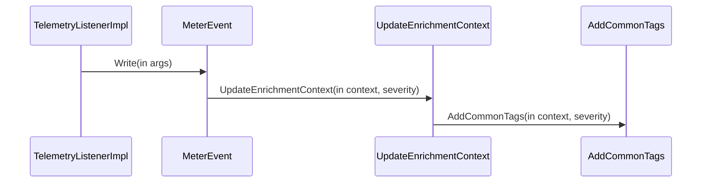

# Extended Telemetry Metrics

<details>
<summary>Relevant source files</summary>

The following files were used as context for generating this wiki page:

- [src/Polly.Extensions/Telemetry/TelemetryListenerImpl.cs](https://github.com/App-vNext/Polly/blob/main/src/Polly.Extensions/Telemetry/TelemetryListenerImpl.cs)
- [src/Snippets/Docs/Telemetry.cs](https://github.com/App-vNext/Polly/blob/main/src/Snippets/Docs/Telemetry.cs)
- [docs/advanced/telemetry.md](https://github.com/App-vNext/Polly/blob/main/docs/advanced/telemetry.md)
- [src/Polly.Extensions/Telemetry/TelemetryResiliencePipelineBuilderExtensions.cs](https://github.com/App-vNext/Polly/blob/main/src/Polly.Extensions/Telemetry/TelemetryResiliencePipelineBuilderExtensions.cs)
- [README.md](https://github.com/App-vNext/Polly/blob/main/README.md)
- [src/Polly.Extensions/Telemetry/TelemetryOptions.cs](https://github.com/App-vNext/Polly/blob/main/src/Polly.Extensions/Telemetry/TelemetryOptions.cs)
- [src/Polly.Extensions/Telemetry/Log.cs](https://github.com/App-vNext/Polly/blob/main/src/Polly.Extensions/Telemetry/Log.cs)
- [src/Polly.Core/Telemetry/TelemetryUtil.cs](https://github.com/App-vNext/Polly/blob/main/src/Polly.Core/Telemetry/TelemetryUtil.cs)
- [src/Polly.Extensions/Telemetry/MeteringEnricher.cs](https://github.com/App-vNext/Polly/blob/main/src/Polly.Extensions/Telemetry/MeteringEnricher.cs)
- [src/Polly.Extensions/README.md](https://github.com/App-vNext/Polly/blob/main/src/Polly.Extensions/README.md)
- [src/Polly.Extensions/Telemetry/TelemetrySource.cs](https://github.com/App-vNext/Polly/blob/main/src/Polly.Extensions/Telemetry/TelemetrySource.cs)
- [src/Polly.Core/Telemetry/ResilienceStrategyTelemetry.cs](https://github.com/App-vNext/Polly/blob/main/src/Polly.Core/Telemetry/ResilienceStrategyTelemetry.cs)
- [src/Polly.Extensions/Telemetry/EnrichmentContext.cs](https://github.com/App-vNext/Polly/blob/main/src/Polly.Extensions/Telemetry/EnrichmentContext.cs)
- [src/Polly.Extensions/Telemetry/TelemetryUtil.cs](https://github.com/App-vNext/Polly/blob/main/src/Polly.Extensions/Telemetry/TelemetryUtil.cs)
- [docs/strategies/retry.md](https://github.com/App-vNext/Polly/blob/main/docs/strategies/retry.md)
- [docs/extensibility/proactive-strategy.md](https://github.com/App-vNext/Polly/blob/main/docs/extensibility/proactive-strategy.md)
- [src/Polly.Core/Telemetry/ResilienceEventSeverity.cs](https://github.com/App-vNext/Polly/blob/main/src/Polly.Core/Telemetry/ResilienceEventSeverity.cs)
- [src/Polly.Core/Telemetry/TelemetryEventArguments.cs](https://github.com/App-vNext/Polly/blob/main/src/Polly.Core/Telemetry/TelemetryEventArguments.cs)
- [src/Polly.Extensions/Telemetry/ResilienceTelemetryTags.cs](https://github.com/App-vNext/Polly/blob/main/src/Polly.Extensions/Telemetry/ResilienceTelemetryTags.cs)
- [docs/strategies/fallback.md](https://github.com/App-vNext/Polly/blob/main/docs/strategies/fallback.md)
</details>

## Overview

Polly provides comprehensive telemetry support for all built-in standard and chaos resilience strategies, bridging core execution events into structured metrics and logging targets. Extended telemetry metrics allow developers to monitor strategy performance, track execution attempts, and capture pipeline durations through standardized instruments under the `Polly` meter. By combining flexible builder registration extensions, customizable options, severity overrides, and metric enrichment mechanisms, the telemetry system ensures deep observability into runtime behavior while adhering to OpenTelemetry standards.

Sources: [docs/advanced/telemetry.md](https://github.com/App-vNext/Polly/blob/main/docs/advanced/telemetry.md#L3-L4), [docs/advanced/telemetry.md](https://github.com/App-vNext/Polly/blob/main/docs/advanced/telemetry.md#L77-L78), [docs/advanced/telemetry.md](https://github.com/App-vNext/Polly/blob/main/docs/advanced/telemetry.md#L119-L120), [src/Polly.Extensions/README.md](https://github.com/App-vNext/Polly/blob/main/src/Polly.Extensions/README.md#L6-L6)

## Builder Telemetry Registration Extensions

### Builder Telemetry Registration Extensions

Resilience pipelines constructed with `ResiliencePipelineBuilder` or `ResiliencePipelineBuilderBase` can enable telemetry capture by invoking the `ConfigureTelemetry` extension methods provided by the `Polly` namespace. These methods inject a configured `TelemetryListenerImpl` into the builder instance, establishing the necessary wiring to log and meter resilience events across strategy executions.

Sources: [src/Polly.Extensions/Telemetry/TelemetryResiliencePipelineBuilderExtensions.cs](https://github.com/App-vNext/Polly/blob/main/src/Polly.Extensions/Telemetry/TelemetryResiliencePipelineBuilderExtensions.cs#L8-L12), [src/Polly.Extensions/Telemetry/TelemetryResiliencePipelineBuilderExtensions.cs](https://github.com/App-vNext/Polly/blob/main/src/Polly.Extensions/Telemetry/TelemetryResiliencePipelineBuilderExtensions.cs#L54-L54)

### Overload Methods and Parameters

The telemetry extension class provides two public overloads for configuring telemetry on any builder extending `ResiliencePipelineBuilderBase`. 

| Method Signature | Parameters | Validation / Actions Performed | Sources |
| --- | --- | --- | --- |
| `ConfigureTelemetry<TBuilder>(this TBuilder builder, ILoggerFactory loggerFactory)` | `builder` (`TBuilder`), `loggerFactory` (`ILoggerFactory`) | Guards against `null` references for both arguments; internally instantiates a `TelemetryOptions` instance assigning the provided `loggerFactory`. | [src/Polly.Extensions/Telemetry/TelemetryResiliencePipelineBuilderExtensions.cs](https://github.com/App-vNext/Polly/blob/main/src/Polly.Extensions/Telemetry/TelemetryResiliencePipelineBuilderExtensions.cs#L25-L32) |
| `ConfigureTelemetry<TBuilder>(this TBuilder builder, TelemetryOptions options)` | `builder` (`TBuilder`), `options` (`TelemetryOptions`) | Guards against `null` references; validates options via `ValidationHelper.ValidateObject`; sets `builder.TelemetryListener` to a new `TelemetryListenerImpl(options)`. | [src/Polly.Extensions/Telemetry/TelemetryResiliencePipelineBuilderExtensions.cs](https://github.com/App-vNext/Polly/blob/main/src/Polly.Extensions/Telemetry/TelemetryResiliencePipelineBuilderExtensions.cs#L46-L57) |

Sources: [src/Polly.Extensions/Telemetry/TelemetryResiliencePipelineBuilderExtensions.cs](https://github.com/App-vNext/Polly/blob/main/src/Polly.Extensions/Telemetry/TelemetryResiliencePipelineBuilderExtensions.cs#L25-L57)

### Execution Walkthrough and Registration Flow

When a developer configures telemetry via the options overload, the execution path follows a strict validation and assignment sequence:

1. `Guard.NotNull(builder)` and `Guard.NotNull(options)` check that neither parameter is null. If either reference is null, an `ArgumentNullException` is thrown.
2. `ValidationHelper.ValidateValidator(new(options, ...))` validates the properties configured on the incoming `TelemetryOptions` instance.
3. `builder.TelemetryListener = new TelemetryListenerImpl(options)` instantiates the core telemetry listener implementation using the validated options and assigns it directly to the builder's listener property.
4. The modified builder instance (`TBuilder`) is returned to the caller, allowing fluent method chaining during pipeline construction.

Sources: [src/Polly.Extensions/Telemetry/TelemetryResiliencePipelineBuilderExtensions.cs](https://github.com/App-vNext/Polly/blob/main/src/Polly.Extensions/Telemetry/TelemetryResiliencePipelineBuilderExtensions.cs#L46-L57)

> [!WARNING]
> Both `ConfigureTelemetry` overloads enforce strict null checks on the builder and the configuration parameters. Omitting an `ILoggerFactory` or passing an uninitialized `TelemetryOptions` object without proper validation annotations will immediately trigger an `ArgumentNullException` or validation failure during pipeline setup.

Sources: [src/Polly.Extensions/Telemetry/TelemetryResiliencePipelineBuilderExtensions.cs](https://github.com/App-vNext/Polly/blob/main/src/Polly.Extensions/Telemetry/TelemetryResiliencePipelineBuilderExtensions.cs#L28-L29), [src/Polly.Extensions/Telemetry/TelemetryResiliencePipelineBuilderExtensions.cs#L50-L53]

### Practical Configuration Example

The following snippet demonstrates how to instantiate `TelemetryOptions`, register custom metric enrichers and telemetry listeners, and attach them to a resilience pipeline builder using the extension method alongside timeout and retry strategies.

```csharp
var telemetryOptions = new TelemetryOptions
{
    // Configure logging
    LoggerFactory = LoggerFactory.Create(builder => builder.AddConsole())
};

// Configure enrichers
telemetryOptions.MeteringEnrichers.Add(new MyMeteringEnricher());

// Configure telemetry listeners
telemetryOptions.TelemetryListeners.Add(new MyTelemetryListener());

var pipeline = new ResiliencePipelineBuilder()
    .AddTimeout(TimeSpan.FromSeconds(1))
    .ConfigureTelemetry(telemetryOptions) // This method enables telemetry in the builder
    .Build();
```

Sources: [src/Snippets/Docs/Telemetry.cs](https://github.com/App-vNext/Polly/blob/main/src/Snippets/Docs/Telemetry.cs#L40-L62)

## Telemetry Options and Severity Overrides

### Overview

Telemetry generation in Polly is governed by the `TelemetryOptions` class, which exposes collections and delegates for listeners, enrichers, formatters, and severity providers. The options instance can be initialized directly or copied from an existing instance via its copy constructor, which guards against null references before cloning telemetry listeners, metering enrichers, the logger factory, the result formatter, and the severity provider.

Sources: [src/Polly.Extensions/Telemetry/TelemetryOptions.cs](https://github.com/App-vNext/Polly/blob/main/src/Polly.Extensions/Telemetry/TelemetryOptions.cs#L12-L34)

### Configuration Options Reference

The `TelemetryOptions` class defines several properties that control how resilience strategy events are captured, formatted, and dispatched.

| Property | Type | Default Value | Purpose |
| :--- | :--- | :--- | :--- |
| `TelemetryListeners` | `ICollection<TelemetryListener>` | `[]` (Empty collection) | Collection of telemetry listeners receiving event callbacks. |
| `LoggerFactory` | `ILoggerFactory` | `NullLoggerFactory.Instance` | Factory used to create loggers for resilience strategy telemetry. Annotated with `[Required]`. |
| `MeteringEnrichers` | `ICollection<MeteringEnricher>` | `[]` (Empty collection) | Collection of enrichers that add custom tags to emitted metrics. |
| `ResultFormatter` | `Func<ResilienceContext, object?, object?>` | Converts `HttpResponseMessage` to `(int)response.StatusCode`; returns other results as-is. | Formats execution results before they are recorded in telemetry. Annotated with `[Required]`. |
| `SeverityProvider` | `Func<SeverityProviderArguments, ResilienceEventSeverity>?` | `null` | Optional delegate allowing custom severity assignment for resilience events. |

Sources: [src/Polly.Extensions/Telemetry/TelemetryOptions.cs](https://github.com/App-vNext/Polly/blob/main/src/Polly.Extensions/Telemetry/TelemetryOptions.cs#L36-L82)

### Resilience Event Severity Levels

When resilience events occur during strategy execution, their logging and telemetry severity are classified using the `ResilienceEventSeverity` enumeration. This enumeration defines six distinct severity levels ranging from ignored events to critical errors.

| Severity Name | Underlying Value | Description |
| :--- | :--- | :--- |
| `None` | `0` | The resilience event is not recorded. |
| `Debug` | `1` | The resilience event is used for debugging purposes only. |
| `Information` | `2` | The resilience event is informational. |
| `Warning` | `3` | The resilience event should be treated as a warning. |
| `Error` | `4` | The resilience event should be treated as an error. |
| `Critical` | `5` | The resilience event should be treated as a critical error. |

Sources: [src/Polly.Core/Telemetry/ResilienceEventSeverity.cs](https://github.com/App-vNext/Polly/blob/main/src/Polly.Core/Telemetry/ResilienceEventSeverity.cs#L6-L37)

> [!NOTE]
> The `ResultFormatter` property is marked with the `[Required]` validation attribute and provides built-in handling for `HttpResponseMessage` instances by extracting their integer status code. For any other result type, the formatter returns the result object as-is.

Sources: [src/Polly.Extensions/Telemetry/TelemetryOptions.cs](https://github.com/App-vNext/Polly/blob/main/src/Polly.Extensions/Telemetry/TelemetryOptions.cs#L68-L73)

### Telemetry Event Arguments

The immutable `TelemetryEventArguments<TResult, TArgs>` struct packages contextual details and metadata when a resilience event is dispatched. It exposes read-only properties for the emitting source, the specific resilience event, the execution context, strategy arguments, and an optional outcome wrapper.

```csharp
public readonly struct TelemetryEventArguments<TResult, TArgs>
{
    public TelemetryEventArguments(
        ResilienceTelemetrySource source, 
        ResilienceEvent resilienceEvent, 
        ResilienceContext context, 
        TArgs args, 
        Outcome<TResult>? outcome)
    {
        Source = source;
        Event = resilienceEvent;
        Context = context;
        Arguments = args;
        Outcome = outcome;
    }

    public ResilienceTelemetrySource Source { get; }
    public ResilienceEvent Event { get; }
    public ResilienceContext Context { get; }
    public TArgs Arguments { get; }
    public Outcome<TResult>? Outcome { get; }
}
```

Sources: [src/Polly.Core/Telemetry/TelemetryEventArguments.cs](https://github.com/App-vNext/Polly/blob/main/src/Polly.Core/Telemetry/TelemetryEventArguments.cs#L13-L56)

> [!WARNING]
> Always use the explicit constructor when instantiating `TelemetryEventArguments<TResult, TArgs>` structs. Relying on default struct initialization or field assignments does not guarantee binary compatibility across future library versions.

Sources: [src/Polly.Core/Telemetry/TelemetryEventArguments.cs](https://github.com/App-vNext/Polly/blob/main/src/Polly.Core/Telemetry/TelemetryEventArguments.cs#L10-L12)

## Telemetry Listener and Event Processing

### Overview

The `TelemetryListenerImpl` class acts as the core dispatcher for incoming telemetry events within Polly extensions. Initialized with `TelemetryOptions`, it sets up a performance meter named `"Polly"` with a version derived from assembly attributes, instantiating counters and histograms including `Counter`, `AttemptDuration`, and `ExecutionDuration`. When diagnostic write operations occur, incoming events are evaluated, forwarded to registered downstream listeners, assessed for severity, and routed to logging and metrics targets.

Sources: [src/Polly.Extensions/Telemetry/TelemetryListenerImpl.cs](https://github.com/App-vNext/Polly/blob/main/src/Polly.Extensions/Telemetry/TelemetryListenerImpl.cs#L7-L45), [src/Polly.Extensions/Telemetry/TelemetrySource.cs](https://github.com/App-vNext/Polly/blob/main/src/Polly.Extensions/Telemetry/TelemetrySource.cs#L9-L15)

### Event Processing and Call-Chain Walkthrough

When an event arrives via diagnostic write operations, `TelemetryListenerImpl` executes a precise routing sequence. If custom telemetry listeners are registered in options, the event is initially forwarded to each listener. Next, the event's severity is determined either by a custom `_severityProvider` delegate or by falling back to the default severity defined on the event itself. Finally, the event is routed to structured logging via `LogEvent` and recorded in metrics via `MeterEvent`.



Sources: [src/Polly.Extensions/Telemetry/TelemetryListenerImpl.cs](https://github.com/App-vNext/Polly/blob/main/src/Polly.Extensions/Telemetry/TelemetryListenerImpl.cs#L46-L63)

To trace metric data population, the call chain executes through specific internal methods:
1. `Write` — Receives incoming `TelemetryEventArguments<TResult, TArgs>` and invokes `MeterEvent`.
2. `MeterEvent` — Inspects generic arguments to target `ExecutionDuration`, `AttemptDuration`, or `Counter`, allocating a pooled tags list.
3. `UpdateEnrichmentContext` — Appends common tags and iterates over registered `MeteringEnricher` instances.
4. `AddCommonTags` — Populates standard telemetry attributes such as event name, severity, pipeline name, instance name, strategy name, operation key, and exception type onto the enrichment context.

Sources: [src/Polly.Extensions/Telemetry/TelemetryListenerImpl.cs](https://github.com/App-vNext/Polly/blob/main/src/Polly.Extensions/Telemetry/TelemetryListenerImpl.cs#L46-L160)

> [!NOTE]
> `TelemetryListenerImpl` uses a pooled `TagsList` mechanism (`TagsList.Get()` and `TagsList.Return(tags)`) around metric recording blocks to minimize garbage collection allocations during high-throughput pipeline executions.

Sources: [src/Polly.Extensions/Telemetry/TelemetryListenerImpl.cs](https://github.com/App-vNext/Polly/blob/main/src/Polly.Extensions/Telemetry/TelemetryListenerImpl.cs#L117-L146)

### Telemetry Tags and Metrics Reference

The telemetry subsystem maps resilience metadata to standardized telemetry tag constants defined in `ResilienceTelemetryTags`.

| Constant Name | Tag Key String | Description | Sources |
| :--- | :--- | :--- | :--- |
| `EventName` | `event.name` | The name of the resilience event that occurred. | [src/Polly.Extensions/Telemetry/ResilienceTelemetryTags.cs](https://github.com/App-vNext/Polly/blob/main/src/Polly.Extensions/Telemetry/ResilienceTelemetryTags.cs#L5-L5) |
| `EventSeverity` | `event.severity` | The severity level of the resilience event. | [src/Polly.Extensions/Telemetry/ResilienceTelemetryTags.cs](https://github.com/App-vNext/Polly/blob/main/src/Polly.Extensions/Telemetry/ResilienceTelemetryTags.cs#L7-L7) |
| `PipelineName` | `pipeline.name` | The name of the resilience pipeline. | [src/Polly.Extensions/Telemetry/ResilienceTelemetryTags.cs](https://github.com/App-vNext/Polly/blob/main/src/Polly.Extensions/Telemetry/ResilienceTelemetryTags.cs#L9-L9) |
| `PipelineInstance` | `pipeline.instance` | The specific instance name of the resilience pipeline. | [src/Polly.Extensions/Telemetry/ResilienceTelemetryTags.cs](https://github.com/App-vNext/Polly/blob/main/src/Polly.Extensions/Telemetry/ResilienceTelemetryTags.cs#L11-L11) |
| `StrategyName` | `strategy.name` | The name of the resilience strategy emitting the event. | [src/Polly.Extensions/Telemetry/ResilienceTelemetryTags.cs](https://github.com/App-vNext/Polly/blob/main/src/Polly.Extensions/Telemetry/ResilienceTelemetryTags.cs#L13-L13) |
| `OperationKey` | `operation.key` | The operation key associated with the resilience context. | [src/Polly.Extensions/Telemetry/ResilienceTelemetryTags.cs](https://github.com/App-vNext/Polly/blob/main/src/Polly.Extensions/Telemetry/ResilienceTelemetryTags.cs#L15-L15) |
| `ExceptionType` | `exception.type` | The full name of the exception type, if an exception occurred. | [src/Polly.Extensions/Telemetry/ResilienceTelemetryTags.cs](https://github.com/App-vNext/Polly/blob/main/src/Polly.Extensions/Telemetry/ResilienceTelemetryTags.cs#L17-L17) |
| `AttemptNumber` | `attempt.number` | The current execution attempt number. | [src/Polly.Extensions/Telemetry/ResilienceTelemetryTags.cs](https://github.com/App-vNext/Polly/blob/main/src/Polly.Extensions/Telemetry/ResilienceTelemetryTags.cs#L19-L19) |
| `AttemptHandled` | `attempt.handled` | A boolean indicating whether the attempt outcome was handled by a strategy. | [src/Polly.Extensions/Telemetry/ResilienceTelemetryTags.cs](https://github.com/App-vNext/Polly/blob/main/src/Polly.Extensions/Telemetry/ResilienceTelemetryTags.cs#L21-L21) |

Sources: [src/Polly.Extensions/Telemetry/ResilienceTelemetryTags.cs](https://github.com/App-vNext/Polly/blob/main/src/Polly.Extensions/Telemetry/ResilienceTelemetryTags.cs#L3-L22)

The metrics created by the listener meter track distinct operational dimensions:

| Meter Property | Instrument Type | Unit | Description | Sources |
| :--- | :--- | :--- | :--- | :--- |
| `Counter` | `Counter<int>` | N/A | Tracks the number of resilience events that occurred in resilience strategies. | [src/Polly.Extensions/Telemetry/TelemetryListenerImpl.cs](https://github.com/App-vNext/Polly/blob/main/src/Polly.Extensions/Telemetry/TelemetryListenerImpl.cs#L25-L28) |
| `AttemptDuration` | `Histogram<double>` | `ms` | Tracks the duration of execution attempts. | [src/Polly.Extensions/Telemetry/TelemetryListenerImpl.cs](https://github.com/App-vNext/Polly/blob/main/src/Polly.Extensions/Telemetry/TelemetryListenerImpl.cs#L29-L33) |
| `ExecutionDuration` | `Histogram<double>` | `ms` | The execution duration of resilience pipelines. | [src/Polly.Extensions/Telemetry/TelemetryListenerImpl.cs](https://github.com/App-vNext/Polly/blob/main/src/Polly.Extensions/Telemetry/TelemetryListenerImpl.cs#L34-L37) |

Sources: [src/Polly.Extensions/Telemetry/TelemetryListenerImpl.cs](https://github.com/App-vNext/Polly/blob/main/src/Polly.Extensions/Telemetry/TelemetryListenerImpl.cs#L25-L38)

> [!WARNING]
> When checking whether to record metrics, `TelemetryListenerImpl` inspects the `Enabled` property on `Counter`, `AttemptDuration`, and `ExecutionDuration` before allocating tag lists. Custom meters or listeners must respect these flags to prevent unnecessary memory overhead.

Sources: [src/Polly.Extensions/Telemetry/TelemetryListenerImpl.cs](https://github.com/App-vNext/Polly/blob/main/src/Polly.Extensions/Telemetry/TelemetryListenerImpl.cs#L117-L146)

### Logging Integration and Design Choices

Structured logging messages are defined in the static partial `Log` class using source-generated `[LoggerMessage]` attributes. These messages capture events such as strategy execution start, strategy completion, execution attempts, and general resilience events with configurable log levels, operation keys, and result formatters.

| Design Choice | Benefit | Cost | Sources |
| :--- | :--- | :--- | :--- |
| Source-generated `[LoggerMessage]` logging | Eliminates runtime reflection and box allocations for logging parameters. | Requires compile-time method definitions in static partial classes. | [src/Polly.Extensions/Telemetry/Log.cs](https://github.com/App-vNext/Polly/blob/main/src/Polly.Extensions/Telemetry/Log.cs#L18-L89) |
| Pooled `TagsList` for metrics | Reduces heap allocation pressure during high-frequency telemetry emissions. | Requires explicit cleanup via `TagsList.Return(tags)` after recording. | [src/Polly.Extensions/Telemetry/TelemetryListenerImpl.cs](https://github.com/App-vNext/Polly/blob/main/src/Polly.Extensions/Telemetry/TelemetryListenerImpl.cs#L117-L146) |
| Generic argument matching via `Unsafe.As` | Fast, zero-allocation type checking for specific argument payloads (`PipelineExecutedArguments`, `ExecutionAttemptArguments`, etc.). | Relies on exact type matching and unsafe casting invariants. | [src/Polly.Extensions/Telemetry/TelemetryListenerImpl.cs](https://github.com/App-vNext/Polly/blob/main/src/Polly.Extensions/Telemetry/TelemetryListenerImpl.cs#L65-L75) |

Sources: [src/Polly.Extensions/Telemetry/Log.cs](https://github.com/App-vNext/Polly/blob/main/src/Polly.Extensions/Telemetry/Log.cs#L8-L90], [src/Polly.Extensions/Telemetry/TelemetryListenerImpl.cs](https://github.com/App-vNext/Polly/blob/main/src/Polly.Extensions/Telemetry/TelemetryListenerImpl.cs#L65-L75], [src/Polly.Extensions/Telemetry/TelemetryListenerImpl.cs](https://github.com/App-vNext/Polly/blob/main/src/Polly.Extensions/Telemetry/TelemetryListenerImpl.cs#L117-L146)

## Metric Enrichment and Context Extensions

### Overview

Polly provides a flexible extension mechanism for enriching resilience metrics using abstract base classes and context structures. The `MeteringEnricher` abstract class defines an interception point where developers can inject custom dimensions and tags into metrics emitted by resilience strategies. During telemetry event dispatch, an `EnrichmentContext<TResult, TArgs>` struct is populated with telemetry event details and an extensible tag collection, which is then passed to all registered enrichers in `TelemetryOptions.MeteringEnrichers`.

Sources: [src/Polly.Extensions/Telemetry/MeteringEnricher.cs](https://github.com/App-vNext/Polly/blob/main/src/Polly.Extensions/Telemetry/MeteringEnricher.cs#L3-L15], [src/Polly.Extensions/Telemetry/EnrichmentContext.cs](https://github.com/App-vNext/Polly/blob/main/src/Polly.Extensions/Telemetry/EnrichmentContext.cs#L5-L39)

### Custom Metering Enricher Implementation

To customize metric tags, inherit from `MeteringEnricher` and override the `Enrich<TResult, TArgs>` method. The `EnrichmentContext<TResult, TArgs>` exposes the underlying telemetry event arguments via `TelemetryEvent` and a modifiable tag list via `Tags`.

```csharp
internal sealed class CustomMeteringEnricher : MeteringEnricher
{
    public override void Enrich<TResult, TArgs>(in EnrichmentContext<TResult, TArgs> context)
    {
        if (context.TelemetryEvent.Arguments is OnRetryArguments<TResult> retryArgs)
        {
            context.Tags.Add(new("retry.attempt", retryArgs.AttemptNumber));
        }
    }
}
```

Sources: [src/Snippets/Docs/Telemetry.cs](https://github.com/App-vNext/Polly/blob/main/src/Snippets/Docs/Telemetry.cs#L120-L134)

Once implemented, the enricher is registered into the telemetry options configuration before building the resilience pipeline:

```csharp
var telemetryOptions = new TelemetryOptions();
telemetryOptions.MeteringEnrichers.Add(new CustomMeteringEnricher());

var pipeline = new ResiliencePipelineBuilder()
    .AddRetry(new RetryStrategyOptions())
    .ConfigureTelemetry(telemetryOptions)
    .Build();
```

Sources: [src/Snippets/Docs/Telemetry.cs](https://github.com/App-vNext/Polly/blob/main/src/Snippets/Docs/Telemetry.cs#L103-L117)

> [!NOTE]
> `EnrichmentContext<TResult, TArgs>` is a readonly struct designed for performance. Always use its defined constructor when initializing instances to maintain binary compatibility across minor updates.

Sources: [src/Polly.Extensions/Telemetry/EnrichmentContext.cs](https://github.com/App-vNext/Polly/blob/main/src/Polly.Extensions/Telemetry/EnrichmentContext.cs#L10-L25)

### Enrichment Context API Reference

| Member | Type | Description | Sources |
| :--- | :--- | :--- | :--- |
| `TelemetryEvent` | `TelemetryEventArguments<TResult, TArgs>` | Gets information about the current resilience event. | [src/Polly.Extensions/Telemetry/EnrichmentContext.cs](https://github.com/App-vNext/Polly/blob/main/src/Polly.Extensions/Telemetry/EnrichmentContext.cs#L28-L30) |
| `Tags` | `IList<KeyValuePair<string, object?>>` | Gets the mutable collection of key-value tags associated with the event. | [src/Polly.Extensions/Telemetry/EnrichmentContext.cs](https://github.com/App-vNext/Polly/blob/main/src/Polly.Extensions/Telemetry/EnrichmentContext.cs#L33-L38) |

Sources: [src/Polly.Extensions/Telemetry/EnrichmentContext.cs](https://github.com/App-vNext/Polly/blob/main/src/Polly.Extensions/Telemetry/EnrichmentContext.cs#L27-L39)

## Core Telemetry Dispatch and Integration

### Overview

The core telemetry dispatch system bridges individual resilience strategies in `Polly.Core` to diagnostic listeners and metric meters without requiring dependency on extension packages. At the center of this integration is the `ResilienceStrategyTelemetry` class, which receives telemetry sources and optional `TelemetryListener` instances during strategy initialization. When strategies execute attempts or encounter notable conditions, they invoke utility methods in `TelemetryUtil` or call `Report` methods directly on `ResilienceStrategyTelemetry` to dispatch events downward into the diagnostic pipeline.

Sources: [src/Polly.Core/Telemetry/ResilienceStrategyTelemetry.cs](https://github.com/App-vNext/Polly/blob/main/src/Polly.Core/Telemetry/ResilienceStrategyTelemetry.cs#L11-L25], [src/Polly.Core/Telemetry/TelemetryUtil.cs](https://github.com/App-vNext/Polly/blob/main/src/Polly.Core/Telemetry/TelemetryUtil.cs#L13-L57)

### Execution Attempt Dispatch Call-Chain

When a strategy tracks execution attempts, it routes calls through specific utility methods that evaluate outcome severity and construct argument payloads. The execution flow follows a precise call chain:

`ReportExecutionAttempt()` / `ReportFinalExecutionAttempt()` → `ReportAttempt()` → `ResilienceStrategyTelemetry.Report()` → `TelemetryListener.Write()`

1. **`ReportExecutionAttempt`** or **`ReportFinalExecutionAttempt`** is invoked with outcome data, attempt count, duration, and a handled flag. It instantiates a `ResilienceEvent` with either `ResilienceEventSeverity.Warning` (if handled) or `Information`, assigning the constant event name `ExecutionAttempt`.
2. **`ReportAttempt`** checks whether `telemetry.Enabled` is true before proceeding.
3. **`ResilienceStrategyTelemetry.Report`** verifies that the listener is non-null and that `resilienceEvent.Severity` is not `ResilienceEventSeverity.None`.
4. **`TelemetryListener.Write`** packages the `TelemetrySource`, `ResilienceEvent`, `ResilienceContext`, arguments (`ExecutionAttemptArguments`), and `Outcome<TResult>` into `TelemetryEventArguments` and dispatches them to registered listeners.

Sources: [src/Polly.Core/Telemetry/TelemetryUtil.cs](https://github.com/App-vNext/Polly/blob/main/src/Polly.Core/Telemetry/TelemetryUtil.cs#L13-L56], [src/Polly.Core/Telemetry/ResilienceStrategyTelemetry.cs](https://github.com/App-vNext/Polly/blob/main/src/Polly.Core/Telemetry/ResilienceStrategyTelemetry.cs#L46-L86)

> [!NOTE]
> If a `ResilienceEventSeverity` is explicitly set to `ResilienceEventSeverity.None`, the telemetry reporting method returns immediately without writing to the listener, effectively suppressing the event.

Sources: [src/Polly.Core/Telemetry/ResilienceStrategyTelemetry.cs](https://github.com/App-vNext/Polly/blob/main/src/Polly.Core/Telemetry/ResilienceStrategyTelemetry.cs#L50-L53], [src/Polly.Core/Telemetry/ResilienceStrategyTelemetry.cs#L69-L72]

### Telemetry Constants and Dispatch API Reference

The `TelemetryUtil` class defines core diagnostic source identifiers and event names used across core resilience strategies.

| Constant Name | Value | Purpose | Sources |
| :--- | :--- | :--- | :--- |
| `PollyDiagnosticSource` | `"Polly"` | Identifies the root diagnostic source string for Polly telemetry. | [src/Polly.Core/Telemetry/TelemetryUtil.cs](https://github.com/App-vNext/Polly/blob/main/src/Polly.Core/Telemetry/TelemetryUtil.cs#L5-L5) |
| `ExecutionAttempt` | `"ExecutionAttempt"` | Event name reported upon completion of individual execution attempts. | [src/Polly.Core/Telemetry/TelemetryUtil.cs](https://github.com/App-vNext/Polly/blob/main/src/Polly.Core/Telemetry/TelemetryUtil.cs#L7-L7) |
| `PipelineExecuting` | `"PipelineExecuting"` | Event name reported when a resilience pipeline begins execution. | [src/Polly.Core/Telemetry/TelemetryUtil.cs](https://github.com/App-vNext/Polly/blob/main/src/Polly.Core/Telemetry/TelemetryUtil.cs#L9-L9) |
| `PipelineExecuted` | `"PipelineExecuted"` | Event name reported when a resilience pipeline finishes execution. | [src/Polly.Core/Telemetry/TelemetryUtil.cs](https://github.com/App-vNext/Polly/blob/main/src/Polly.Core/Telemetry/TelemetryUtil.cs#L11-L11) |

Sources: [src/Polly.Core/Telemetry/TelemetryUtil.cs](https://github.com/App-vNext/Polly/blob/main/src/Polly.Core/Telemetry/TelemetryUtil.cs#L3-L12)

| Method Signature | Description | Sources |
| :--- | :--- | :--- |
| `Report<TArgs>(ResilienceEvent, ResilienceContext, TArgs)` | Reports a resilience event without an outcome payload. | [src/Polly.Core/Telemetry/ResilienceStrategyTelemetry.cs](https://github.com/App-vNext/Polly/blob/main/src/Polly.Core/Telemetry/ResilienceStrategyTelemetry.cs#L46-L56) |
| `Report<TArgs, TResult>(ResilienceEvent, ResilienceContext, Outcome<TResult>, TArgs)` | Reports a resilience event associated with a specific result outcome. | [src/Polly.Core/Telemetry/ResilienceStrategyTelemetry.cs](https://github.com/App-vNext/Polly/blob/main/src/Polly.Core/Telemetry/ResilienceStrategyTelemetry.cs#L67-L75) |
| `SetTelemetrySource(ExecutionRejectedException)` | Assigns the strategy's telemetry source to a rejected execution exception. | [src/Polly.Core/Telemetry/ResilienceStrategyTelemetry.cs](https://github.com/App-vNext/Polly/blob/main/src/Polly.Core/Telemetry/ResilienceStrategyTelemetry.cs#L31-L36) |

Sources: [src/Polly.Core/Telemetry/ResilienceStrategyTelemetry.cs](https://github.com/App-vNext/Polly/blob/main/src/Polly.Core/Telemetry/ResilienceStrategyTelemetry.cs#L31-L75]

## Related

- [[Core Telemetry Infrastructure]]
- [[Dependency Injection Integration]]

