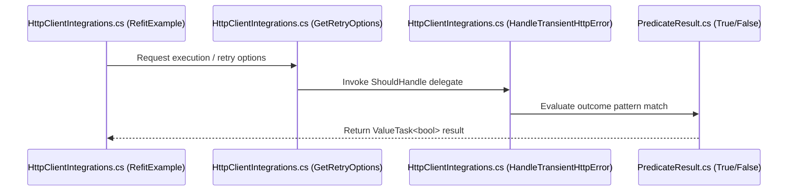

# HTTP Client Integration

<details>
<summary>Relevant source files</summary>

The following files were used as context for generating this wiki page:

- [docs/community/http-client-integrations.md](https://github.com/App-vNext/Polly/blob/main/docs/community/http-client-integrations.md)
- [README.md](https://github.com/App-vNext/Polly/blob/main/README.md)
- [docs/community/resources.md](https://github.com/App-vNext/Polly/blob/main/docs/community/resources.md)
- [src/Snippets/Docs/Migration.Policies.cs](https://github.com/App-vNext/Polly/blob/main/src/Snippets/Docs/Migration.Policies.cs)
- [src/Snippets/Docs/HttpClientIntegrations.cs](https://github.com/App-vNext/Polly/blob/main/src/Snippets/Docs/HttpClientIntegrations.cs)
- [src/Snippets/Docs/ResiliencePipelines.cs](https://github.com/App-vNext/Polly/blob/main/src/Snippets/Docs/ResiliencePipelines.cs)
- [docs/community/libraries-and-contributions.md](https://github.com/App-vNext/Polly/blob/main/docs/community/libraries-and-contributions.md)
- [src/Snippets/Docs/ResilienceStrategies.cs](https://github.com/App-vNext/Polly/blob/main/src/Snippets/Docs/ResilienceStrategies.cs)
- [docs/strategies/index.md](https://github.com/App-vNext/Polly/blob/main/docs/strategies/index.md)
- [AGENTS.md](https://github.com/App-vNext/Polly/blob/main/AGENTS.md)
- [docs/strategies/circuit-breaker.md](https://github.com/App-vNext/Polly/blob/main/docs/strategies/circuit-breaker.md)
- [src/Polly.Core/README.md](https://github.com/App-vNext/Polly/blob/main/src/Polly.Core/README.md)
- [docs/index.md](https://github.com/App-vNext/Polly/blob/main/docs/index.md)
- [docs/strategies/fallback.md](https://github.com/App-vNext/Polly/blob/main/docs/strategies/fallback.md)
- [src/Polly.Extensions/README.md](https://github.com/App-vNext/Polly/blob/main/src/Polly.Extensions/README.md)
- [src/Polly.Core/PredicateResult.cs](https://github.com/App-vNext/Polly/blob/main/src/Polly.Core/PredicateResult.cs)
</details>

## Overview

Integrating Polly resilience pipelines with HTTP client libraries ensures that transient network failures and HTTP error statuses are handled robustly across modern .NET applications. By leveraging dependency injection containers alongside Microsoft Extensions HTTP resilience handlers, developers can seamlessly decorate standard HTTP clients and popular third-party REST libraries with unified retry, circuit breaker, and timeout policies. This integration simplifies fault handling and centralizes configuration for robust network communication.

Sources: [docs/community/http-client-integrations.md:3-5](https://github.com/App-vNext/Polly/blob/main/docs/community/http-client-integrations.md#L3-L5), [docs/community/http-client-integrations.md:73-75](https://github.com/App-vNext/Polly/blob/main/docs/community/http-client-integrations.md#L73-L75)

## HttpClient Integration Overview and Setup

### Overview

Configuring standard `HttpClient` instances and Microsoft Extensions HTTP resilience handlers involves registering HTTP clients into a Dependency Injection container using `ServiceCollection` and decorating them via the `AddResilienceHandler` extension method.
Sources: [docs/community/http-client-integrations.md:7-11](https://github.com/App-vNext/Polly/blob/main/docs/community/http-client-integrations.md#L7-L11), [docs/community/http-client-integrations.md:73-75](https://github.com/App-vNext/Polly/blob/main/docs/community/http-client-integrations.md#L73-L75)

### Setup and Execution

To set up a resilient standard `HttpClient`, initialize a `ServiceCollection`, register a named HTTP client via `AddHttpClient`, configure its base address, and attach a resilience handler using `AddResilienceHandler`.
Sources: [docs/community/http-client-integrations.md:77-85](https://github.com/App-vNext/Polly/blob/main/docs/community/http-client-integrations.md#L77-L85)

```cs
var services = new ServiceCollection();

// Register a named HttpClient and decorate with a resilience pipeline
services.AddHttpClient(HttpClientName)
        .ConfigureHttpClient(client => client.BaseAddress = BaseAddress)
        .AddResilienceHandler("httpclient_based_pipeline",
            builder => builder.AddRetry(GetRetryOptions()));

using var provider = services.BuildServiceProvider();

// Resolve the named HttpClient
var httpClientFactory = provider.GetRequiredService<IHttpClientFactory>();
var httpClient = httpClientFactory.CreateClient(HttpClientName);

// Use the HttpClient by making a request
var response = await httpClient.GetAsync("/408");
```
Sources: [src/Snippets/Docs/HttpClientIntegrations.cs:38-56](https://github.com/App-vNext/Polly/blob/main/src/Snippets/Docs/HttpClientIntegrations.cs#L38-L56)

> [!NOTE]
> The `Microsoft.Extensions.DependencyInjection` and `Microsoft.Extensions.Http.Resilience` packages are strictly required for dependency injection support and the `AddResilienceHandler` extension.
> Sources: [docs/community/http-client-integrations.md:98-103](https://github.com/App-vNext/Polly/blob/main/docs/community/http-client-integrations.md#L98-L103)

## Transient Http Error Predicate Handling

### Overview

Evaluating HTTP response status codes and network exceptions relies on custom predicate functions that inspect the `Outcome<HttpResponseMessage>` object. By utilizing `PredicateResult.True()` and `PredicateResult.False()`, developers can precisely control when retry strategies, circuit breakers, or other resilience mechanisms should engage based on real-time network and HTTP outcomes.
Sources: [src/Snippets/Docs/HttpClientIntegrations.cs:17-23](https://github.com/App-vNext/Polly/blob/main/src/Snippets/Docs/HttpClientIntegrations.cs#L17-L23), [src/Polly.Core/PredicateResult.cs:6-19](https://github.com/App-vNext/Polly/blob/main/src/Polly.Core/PredicateResult.cs#L6-L19)

### Predicate Evaluation Logic

The `HandleTransientHttpError` method evaluates incoming outcomes using pattern matching against `HttpRequestException` and `HttpResponseMessage` status codes. It returns a finished `ValueTask<bool>` via `PredicateResult` helpers to determine if a given failure warrants a retry attempt.
Sources: [src/Snippets/Docs/HttpClientIntegrations.cs:17-23](https://github.com/App-vNext/Polly/blob/main/src/Snippets/Docs/HttpClientIntegrations.cs#L17-L23), [src/Polly.Core/PredicateResult.cs:6-19](https://github.com/App-vNext/Polly/blob/main/src/Polly.Core/PredicateResult.cs#L6-L19)

```csharp
private static ValueTask<bool> HandleTransientHttpError(Outcome<HttpResponseMessage> outcome) => outcome switch
{
    { Exception: HttpRequestException } => PredicateResult.True(),
    { Result.StatusCode: HttpStatusCode.RequestTimeout } => PredicateResult.True(),
    { Result.StatusCode: >= HttpStatusCode.InternalServerError } => PredicateResult.True(),
    _ => PredicateResult.False(),
};

private static RetryStrategyOptions<HttpResponseMessage> GetRetryOptions() =>
new()
{
    ShouldHandle = args => HandleTransientHttpError(args.Outcome),
    MaxRetryAttempts = 3,
    BackoffType = DelayBackoffType.Exponential,
    Delay = TimeSpan.FromSeconds(2)
};
```
Sources: [src/Snippets/Docs/HttpClientIntegrations.cs:17-32](https://github.com/App-vNext/Polly/blob/main/src/Snippets/Docs/HttpClientIntegrations.cs#L17-L32)

> [!NOTE]
> The `PredicateResult.True()` and `PredicateResult.False()` methods return pre-allocated finished `ValueTask<bool>` instances, avoiding unnecessary heap allocations during high-frequency predicate evaluations.
> Sources: [src/Polly.Core/PredicateResult.cs:6-19](https://github.com/App-vNext/Polly/blob/main/src/Polly.Core/PredicateResult.cs#L6-L19)

### Predicate Evaluation Rules

| Condition / Pattern | Target Type / Value | Result Method | Purpose |
| :--- | :--- | :--- | :--- |
| `{ Exception: HttpRequestException }` | `HttpRequestException` | `PredicateResult.True()` | Handles underlying transport and network connection failures. |
| `{ Result.StatusCode: HttpStatusCode.RequestTimeout }` | `HttpStatusCode.RequestTimeout` (408) | `PredicateResult.True()` | Handles HTTP 408 Request Timeout responses. |
| `{ Result.StatusCode: >= HttpStatusCode.InternalServerError }` | `>= HttpStatusCode.InternalServerError` (500+) | `PredicateResult.True()` | Handles server-side error status codes (5xx range). |
| `_` | Wildcard / Default | `PredicateResult.False()` | Rejects all other outcomes from triggering a retry. |

Sources: [src/Snippets/Docs/HttpClientIntegrations.cs:17-23](https://github.com/App-vNext/Polly/blob/main/src/Snippets/Docs/HttpClientIntegrations.cs#L17-L23), [src/Polly.Core/PredicateResult.cs:6-19](https://github.com/App-vNext/Polly/blob/main/src/Polly.Core/PredicateResult.cs#L6-L19)

### Design Trade-Offs

| Design Choice | Benefit | Cost |
| :--- | :--- | :--- |
| Pattern-matching switch expression for outcomes | Clean, readable syntax for evaluating multiple disjoint types and status ranges | Requires careful ordering so specific matches precede general wildcards |
| Static `PredicateResult` value task helpers | Zero-allocation completion for predicate evaluation results | Requires returning explicit `ValueTask<bool>` wrappers instead of primitive booleans |
| Centralized retry strategy options factory (`GetRetryOptions`) | Reusability across HttpClient, Refit, Flurl, and RestSharp integrations | Ties multiple client integrations to a single shared retry policy configuration |

Sources: [src/Snippets/Docs/HttpClientIntegrations.cs:17-32](https://github.com/App-vNext/Polly/blob/main/src/Snippets/Docs/HttpClientIntegrations.cs#L17-L32), [src/Polly.Core/PredicateResult.cs:6-19](https://github.com/App-vNext/Polly/blob/main/src/Polly.Core/PredicateResult.cs#L6-L19)

## Call-Chain Execution Walkthroughs

### Overview

Tracing the execution path of HTTP client calls through the registered resilience pipeline demonstrates how requests flow from client methods down to predicate evaluation and result determination. Specifically, when `RefitExample` executes an HTTP request, the call transitions through `GetRetryOptions`, evaluates via `HandleTransientHttpError`, and terminates with a `PredicateResult` of either `False` or `True`.

Sources: [src/Snippets/Docs/HttpClientIntegrations.cs:16-32](https://github.com/App-vNext/Polly/blob/main/src/Snippets/Docs/HttpClientIntegrations.cs#L16-L32), [src/Snippets/Docs/HttpClientIntegrations.cs:58-76](https://github.com/App-vNext/Polly/blob/main/src/Snippets/Docs/HttpClientIntegrations.cs#L58-L76), [src/Polly.Core/PredicateResult.cs:11-17](https://github.com/App-vNext/Polly/blob/main/src/Polly.Core/PredicateResult.cs#L11-L17)

### Handling a Non-Transient Response (`RefitExample` to `False`)

1. `RefitExample` (src/Snippets/Docs/HttpClientIntegrations.cs:58-76) invokes the Refit client request returning a non-transient outcome.
Sources: [src/Snippets/Docs/HttpClientIntegrations.cs:58-76](https://github.com/App-vNext/Polly/blob/main/src/Snippets/Docs/HttpClientIntegrations.cs#L58-L76)
2. `GetRetryOptions` (src/Snippets/Docs/HttpClientIntegrations.cs:24-31) supplies the retry strategy configuration including the `ShouldHandle` delegate.
Sources: [src/Snippets/Docs/HttpClientIntegrations.cs:24-31](https://github.com/App-vNext/Polly/blob/main/src/Snippets/Docs/HttpClientIntegrations.cs#L24-L31)
3. `HandleTransientHttpError` (src/Snippets/Docs/HttpClientIntegrations.cs:16-22) evaluates the outcome against pattern-matching rules and hits the default wildcard arm.
Sources: [src/Snippets/Docs/HttpClientIntegrations.cs:16-22](https://github.com/App-vNext/Polly/blob/main/src/Snippets/Docs/HttpClientIntegrations.cs#L16-L22)
4. `False` (src/Polly.Core/PredicateResult.cs:17) returns a finished `ValueTask<bool>` holding `false`, preventing a retry attempt.
Sources: [src/Polly.Core/PredicateResult.cs:17-17](https://github.com/App-vNext/Polly/blob/main/src/Polly.Core/PredicateResult.cs#L17-L17)

### Handling a Transient Failure (`RefitExample` to `True`)

1. `RefitExample` (src/Snippets/Docs/HttpClientIntegrations.cs:58-76) invokes the Refit client request returning a transient failure outcome.
Sources: [src/Snippets/Docs/HttpClientIntegrations.cs:58-76](https://github.com/App-vNext/Polly/blob/main/src/Snippets/Docs/HttpClientIntegrations.cs#L58-L76)
2. `GetRetryOptions` (src/Snippets/Docs/HttpClientIntegrations.cs:24-31) supplies the retry strategy configuration.
Sources: [src/Snippets/Docs/HttpClientIntegrations.cs:24-31](https://github.com/App-vNext/Polly/blob/main/src/Snippets/Docs/HttpClientIntegrations.cs#L24-L31)
3. `HandleTransientHttpError` (src/Snippets/Docs/HttpClientIntegrations.cs:16-22) matches an explicit transient condition such as `HttpStatusCode.RequestTimeout` or an `HttpRequestException`.
Sources: [src/Snippets/Docs/HttpClientIntegrations.cs:16-22](https://github.com/App-vNext/Polly/blob/main/src/Snippets/Docs/HttpClientIntegrations.cs#L16-L22)
4. `True` (src/Polly.Core/PredicateResult.cs:11) returns a finished `ValueTask<bool>` holding `true`, triggering the retry policy.
Sources: [src/Polly.Core/PredicateResult.cs:11-11](https://github.com/App-vNext/Polly/blob/main/src/Polly.Core/PredicateResult.cs#L11-L11)


Sources: [src/Snippets/Docs/HttpClientIntegrations.cs:16-32](https://github.com/App-vNext/Polly/blob/main/src/Snippets/Docs/HttpClientIntegrations.cs#L16-L32), [src/Snippets/Docs/HttpClientIntegrations.cs:58-76](https://github.com/App-vNext/Polly/blob/main/src/Snippets/Docs/HttpClientIntegrations.cs#L58-L76), [src/Polly.Core/PredicateResult.cs:11-17](https://github.com/App-vNext/Polly/blob/main/src/Polly.Core/PredicateResult.cs#L11-L17)

## Dependency Injection and Pipeline Registration

### Overview

Dependency injection integration in Polly allows you to register resilience pipelines into an `IServiceCollection` instance so they can be shared and resolved across your application. Using extension methods provided by `Polly.Extensions`, you can declare named pipelines and retrieve them using provider interfaces.

Sources: [src/Snippets/Docs/ResiliencePipelines.cs:72-84](https://github.com/App-vNext/Polly/blob/main/src/Snippets/Docs/ResiliencePipelines.cs#L72-L84), [src/Polly.Extensions/README.md:1-7](https://github.com/App-vNext/Polly/blob/main/src/Polly.Extensions/README.md#L1-L7)

### Pipeline Registration and Resolution

You can register individual resilience pipelines inside an `IServiceCollection` by calling `AddResiliencePipeline` with a unique string key and a configuration builder callback.

```csharp
public static void ConfigureMyPipelines(IServiceCollection services)
{
    services.AddResiliencePipeline("pipeline-A", builder => builder.AddConcurrencyLimiter(100));
    services.AddResiliencePipeline("pipeline-B", builder => builder.AddRetry(new()));

    var pipelineProvider = services.BuildServiceProvider().GetRequiredService<ResiliencePipelineProvider<string>>();
    pipelineProvider.GetPipeline("pipeline-A").Execute(() => { });
}
```
Sources: [src/Snippets/Docs/ResiliencePipelines.cs:74-82](https://github.com/App-vNext/Polly/blob/main/src/Snippets/Docs/ResiliencePipelines.cs#L74-L82)

> [!NOTE]
> Registered pipelines are resolved at runtime using `ResiliencePipelineProvider<string>` or `ResiliencePipelineRegistry<string>` injected into your services or retrieved from the service provider.

Sources: [src/Snippets/Docs/ResiliencePipelines.cs:79-81](https://github.com/App-vNext/Polly/blob/main/src/Snippets/Docs/ResiliencePipelines.cs#L79-L81)

## Third-Party HTTP Client Library Integration

### Overview

Third-party HTTP client libraries like Flurl, Refit, and RestSharp can be seamlessly integrated with Polly by leveraging standard ASP.NET Core `IHttpClientFactory` registrations. Because these libraries rely on `HttpClient` or its factory under the hood, you can decorate the underlying `HttpClient` instance with resilience pipelines using `AddResilienceHandler` or type-safe extensions like `AddRefitClient`.

Sources: [docs/community/http-client-integrations.md:109-115](https://github.com/App-vNext/Polly/blob/main/docs/community/http-client-integrations.md#L109-L115), [docs/community/http-client-integrations.md:149-165](https://github.com/App-vNext/Polly/blob/main/docs/community/http-client-integrations.md#L149-L165), [docs/community/http-client-integrations.md:198-204](https://github.com/App-vNext/Polly/blob/main/docs/community/http-client-integrations.md#L198-L204)

### Integrating Refit

[Refit](https://github.com/reactiveui/refit) provides an automatic type-safe REST library for .NET. You register a Refit-generated typed client using the `AddRefitClient<T>` extension method on `IServiceCollection`, configure the base address, and attach a resilience handler via `AddResilienceHandler`.

```csharp
var services = new ServiceCollection();

services.AddRefitClient<IHttpStatusApi>()
        .ConfigureHttpClient(client => client.BaseAddress = BaseAddress)
        .AddResilienceHandler("refit_based_pipeline",
            builder => builder.AddRetry(GetRetryOptions()));

using var provider = services.BuildServiceProvider();
var apiClient = provider.GetRequiredService<IHttpStatusApi>();
var response = await apiClient.GetRequestTimeoutEndpointAsync();
```
Sources: [src/Snippets/Docs/HttpClientIntegrations.cs:61-77](https://github.com/App-vNext/Polly/blob/main/src/Snippets/Docs/HttpClientIntegrations.cs#L61-L77)

> [!NOTE]
> The `Refit.HttpClientFactory` NuGet package is required alongside `Microsoft.Extensions.DependencyInjection` and `Microsoft.Extensions.Http.Resilience` to enable `AddRefitClient`.
>
> Sources: [docs/community/http-client-integrations.md:186-191](https://github.com/App-vNext/Polly/blob/main/docs/community/http-client-integrations.md#L186-L191)

### Integrating Flurl and RestSharp

For libraries like Flurl and RestSharp that instantiate their own wrapper clients around standard HTTP primitives, you register a named `HttpClient` with `AddResilienceHandler`, resolve an `IHttpClientFactory` from the container, and pass the decorated `HttpClient` instance directly into the third-party client constructor.

```csharp
var services = new ServiceCollection();

services.AddHttpClient(HttpClientName)
        .ConfigureHttpClient(client => client.BaseAddress = BaseAddress)
        .AddResilienceHandler("restsharp_based_pipeline",
            builder => builder.AddRetry(GetRetryOptions()));

using var provider = services.BuildServiceProvider();
var httpClientFactory = provider.GetRequiredService<IHttpClientFactory>();
var restClient = new RestClient(httpClientFactory.CreateClient(HttpClientName));

var request = new RestRequest("/408", Method.Get);
var response = await restClient.ExecuteAsync(request);
```
Sources: [src/Snippets/Docs/HttpClientIntegrations.cs:103-122](https://github.com/App-vNext/Polly/blob/main/src/Snippets/Docs/HttpClientIntegrations.cs#L103-L122), [src/Snippets/Docs/HttpClientIntegrations.cs:79-99](https://github.com/App-vNext/Polly/blob/main/src/Snippets/Docs/HttpClientIntegrations.cs#L79-L99)

> [!TIP]
> Always share a centralized options factory such as `GetRetryOptions()` across all client registrations to maintain uniform transient error handling behavior throughout your application services.
>
> Sources: [docs/community/http-client-integrations.md:9-12](https://github.com/App-vNext/Polly/blob/main/docs/community/http-client-integrations.md#L9-L12)

## Migration of HTTP Policy Configuration

### Overview

Migrating legacy HTTP retry policies and timeout configurations from Polly v7 to the v8 API requires transitioning from type-specific `ISyncPolicy` and `IAsyncPolicy` interfaces to unified `ResiliencePipeline` and `ResiliencePipeline<T>` instances created via `ResiliencePipelineBuilder` or `ResiliencePipelineBuilder<T>`. In v8, fluent strategy extensions and options classes—such as `RetryStrategyOptions` and `TimeoutStrategyOptions`—replace legacy static policy syntax and execution methods.

Sources: [src/Snippets/Docs/Migration.Policies.cs:14-54](https://github.com/App-vNext/Polly/blob/main/src/Snippets/Docs/Migration.Policies.cs#L14-L54), [src/Snippets/Docs/Migration.Policies.cs:67-117](https://github.com/App-vNext/Polly/blob/main/src/Snippets/Docs/Migration.Policies.cs#L67-L117), [src/Polly.Core/README.md:3-9](https://github.com/App-vNext/Polly/blob/main/src/Polly.Core/README.md#L3-L9)

### Migrating Retry and Timeout Configurations

In v7, policies were constructed statically using methods like `Policy.Handle<T>().WaitAndRetry(...)` or `Policy<HttpResponseMessage>.HandleResult(...)`. In v8, equivalent behavior is achieved by configuring `RetryStrategyOptions<HttpResponseMessage>` with a `PredicateBuilder<HttpResponseMessage>` and appending it to a pipeline builder via `.AddRetry(...)`.

```csharp
ResiliencePipeline<HttpResponseMessage> pipelineT = new ResiliencePipelineBuilder<HttpResponseMessage>()
    .AddRetry(new RetryStrategyOptions<HttpResponseMessage>
    {
        ShouldHandle = new PredicateBuilder<HttpResponseMessage>()
            .Handle<Exception>()
            .HandleResult(static result => !result.IsSuccessStatusCode),
        Delay = TimeSpan.FromSeconds(1),
        MaxRetryAttempts = 3,
        BackoffType = DelayBackoffType.Constant
    })
    .Build();

await pipelineT.ExecuteAsync(async token =>
{
    return await GetResponseAsync(token);
}, cancellationToken);
```
Sources: [src/Snippets/Docs/Migration.Policies.cs:93-117](https://github.com/App-vNext/Polly/blob/main/src/Snippets/Docs/Migration.Policies.cs#L93-L117)

Similarly, timeout configurations that were previously handled through legacy timeout policies are now expressed cleanly using `TimeoutStrategyOptions` inside an `.AddTimeout(...)` extension call.

```csharp
ResiliencePipeline pipeline = new ResiliencePipelineBuilder()
    .AddTimeout(new TimeoutStrategyOptions
    {
        Timeout = TimeSpan.FromSeconds(5)
    })
    .Build();
```
Sources: [src/Snippets/Docs/ResilienceStrategies.cs:13-18](https://github.com/App-vNext/Polly/blob/main/src/Snippets/Docs/ResilienceStrategies.cs#L13-L18)

> [!WARNING]
> Legacy v7 policy types (`ISyncPolicy`, `IAsyncPolicy`, `ISyncPolicy<T>`, `IAsyncPolicy<T>`) reside in the root `Polly` package and are deprecated in v8. All new HTTP resilience pipelines must target `Polly.Core` and use `ResiliencePipeline` or `ResiliencePipeline<T>`.
>
> Sources: [README.md:32-32](https://github.com/App-vNext/Polly/blob/main/README.md#L32-L32), [src/Polly.Core/README.md:3-9](https://github.com/App-vNext/Polly/blob/main/src/Polly.Core/README.md#L3-L9)

## Related

- [[Dependency Injection Integration]]
- [[Resilience Pipelines]]

