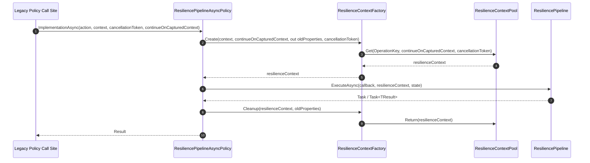
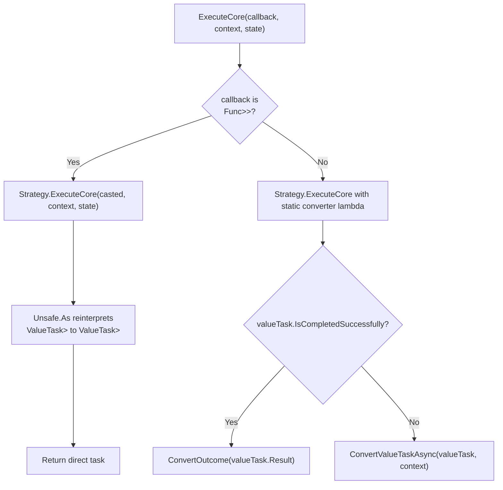

# Interop Bridge Mechanics

<details>
<summary>Relevant source files</summary>

The following files were used as context for generating this wiki page:

- [README.md](https://github.com/App-vNext/Polly/blob/main/README.md)
- [src/Snippets/Docs/Migration.CircuitBreaker.cs](https://github.com/App-vNext/Polly/blob/main/src/Snippets/Docs/Migration.CircuitBreaker.cs)
- [src/Snippets/Docs/Migration.Execute.cs](https://github.com/App-vNext/Polly/blob/main/src/Snippets/Docs/Migration.Execute.cs)
- [src/Snippets/Docs/Migration.Policies.cs](https://github.com/App-vNext/Polly/blob/main/src/Snippets/Docs/Migration.Policies.cs)
- [src/Snippets/Docs/ResiliencePipelines.cs](https://github.com/App-vNext/Polly/blob/main/src/Snippets/Docs/ResiliencePipelines.cs)
- [docs/pipelines/index.md](https://github.com/App-vNext/Polly/blob/main/docs/pipelines/index.md)
- [src/Polly.Testing/ResiliencePipelineExtensions.cs](https://github.com/App-vNext/Polly/blob/main/src/Polly.Testing/ResiliencePipelineExtensions.cs)
- [src/Polly/ResiliencePipelineConversionExtensions.cs](https://github.com/App-vNext/Polly/blob/main/src/Polly/ResiliencePipelineConversionExtensions.cs)
- [src/Snippets/Docs/Migration.Interoperability.cs](https://github.com/App-vNext/Polly/blob/main/src/Snippets/Docs/Migration.Interoperability.cs)
- [src/Polly/Utilities/Wrappers/ResiliencePipelineAsyncPolicy.cs](https://github.com/App-vNext/Polly/blob/main/src/Polly/Utilities/Wrappers/ResiliencePipelineAsyncPolicy.cs)
- [src/Polly/Utilities/Wrappers/ResiliencePipelineSyncPolicy.cs](https://github.com/App-vNext/Polly/blob/main/src/Polly/Utilities/Wrappers/ResiliencePipelineSyncPolicy.cs)
- [src/Polly/Utilities/Wrappers/ResiliencePipelineAsyncPolicy.TResult.cs](https://github.com/App-vNext/Polly/blob/main/src/Polly/Utilities/Wrappers/ResiliencePipelineAsyncPolicy.TResult.cs)
- [src/Polly.Core/Utils/Pipeline/BridgeComponent.cs](https://github.com/App-vNext/Polly/blob/main/src/Polly.Core/Utils/Pipeline/BridgeComponent.cs)
- [src/Polly.Core/Utils/Pipeline/PipelineComponentFactory.cs](https://github.com/App-vNext/Polly/blob/main/src/Polly.Core/Utils/Pipeline/PipelineComponentFactory.cs)
- [src/Snippets/Docs/Migration.Registry.cs](https://github.com/App-vNext/Polly/blob/main/src/Snippets/Docs/Migration.Registry.cs)
- [src/Polly.Core/Utils/Pipeline/BridgeComponentBase.cs](https://github.com/App-vNext/Polly/blob/main/src/Polly.Core/Utils/Pipeline/BridgeComponentBase.cs)
- [src/Polly/Utilities/Wrappers/ResiliencePipelineSyncPolicy.TResult.cs](https://github.com/App-vNext/Polly/blob/main/src/Polly/Utilities/Wrappers/ResiliencePipelineSyncPolicy.TResult.cs)
- [src/Snippets/Docs/Migration.Wrap.cs](https://github.com/App-vNext/Polly/blob/main/src/Snippets/Docs/Migration.Wrap.cs)
- [src/Polly.Core/Utils/Pipeline/BridgeComponent.TResult.cs](https://github.com/App-vNext/Polly/blob/main/src/Polly.Core/Utils/Pipeline/BridgeComponent.TResult.cs)
- [src/Polly.Core/README.md](https://github.com/App-vNext/Polly/blob/main/src/Polly.Core/README.md)
- [AGENTS.md](https://github.com/App-vNext/Polly/blob/main/AGENTS.md)
- [src/Polly.Core/ResiliencePipeline.cs](https://github.com/App-vNext/Polly/blob/main/src/Polly.Core/ResiliencePipeline.cs)
- [docs/pipelines/resilience-pipeline-registry.md](https://github.com/App-vNext/Polly/blob/main/docs/pipelines/resilience-pipeline-registry.md)
- [src/Polly/Wrap/PolicyWrapEngine.cs](https://github.com/App-vNext/Polly/blob/main/src/Polly/Wrap/PolicyWrapEngine.cs)
- [docs/advanced/use-with-fsharp-and-visual-basic.md](https://github.com/App-vNext/Polly/blob/main/docs/advanced/use-with-fsharp-and-visual-basic.md)
- [src/Polly.Core/PredicateBuilder.Operators.cs](https://github.com/App-vNext/Polly/blob/main/src/Polly.Core/PredicateBuilder.Operators.cs)
- [docs/advanced/resilience-context.md](https://github.com/App-vNext/Polly/blob/main/docs/advanced/resilience-context.md)
- [src/Polly.Core/LegacySupport.cs](https://github.com/App-vNext/Polly/blob/main/src/Polly.Core/LegacySupport.cs)
- [src/Polly/Utilities/Wrappers/ResilienceContextFactory.cs](https://github.com/App-vNext/Polly/blob/main/src/Polly/Utilities/Wrappers/ResilienceContextFactory.cs)
</details>

## Overview

The interop bridge mechanics provide a bi-directional translation layer that bridges legacy v7 policy infrastructure with modern v8 resilience pipelines. Polly v8 introduced a redesigned, zero-allocation core based on `ResiliencePipeline` and `ResilienceStrategy`, whereas legacy Polly (v7 and earlier) exposed interfaces such as `ISyncPolicy`, `IAsyncPolicy`, `ISyncPolicy<TResult>`, and `IAsyncPolicy<TResult>`. The interop bridge components permit applications migrating to v8 to mix modern pipelines and legacy policies within the same codebase without breaking backwards compatibility.

Sources: [src/Polly/ResiliencePipelineConversionExtensions.cs:8-47](https://github.com/App-vNext/Polly/blob/main/src/Polly/ResiliencePipelineConversionExtensions.cs#L8-L47), [AGENTS.md:38-46](https://github.com/App-vNext/Polly/blob/main/AGENTS.md#L38-L46)

These mechanisms solve two primary problems: adapting modern v8 `ResiliencePipeline` instances so they can be consumed by legacy v7 call sites expecting `IsyncPolicy` or `IAsyncPolicy`, and wrapping v8 strategies inside low-level `PipelineComponent` structures so the internal pipeline engine can invoke and inspect them. Rather than rewriting entire application resilience topologies, developers can wrap individual v8 pipelines into v7 policy wrappers, insert them into legacy `PolicyWrap` compositions, or register them in legacy `PolicyRegistry` instances.

Sources: [src/Polly/Utilities/Wrappers/ResiliencePipelineAsyncPolicy.cs:9-35](https://github.com/App-vNext/Polly/blob/main/src/Polly/Utilities/Wrappers/ResiliencePipelineAsyncPolicy.cs#L9-L35), [src/Snippets/Docs/Migration.Interoperability.cs:12-30](https://github.com/App-vNext/Polly/blob/main/src/Snippets/Docs/Migration.Interoperability.cs#L12-L30)

Key design decisions in the interop bridge focus on zero-allocation execution during callback invocation and seamless state conversion. Execution contexts are translated between legacy `Context` and modern `ResilienceContext` using pooled factories (`ResilienceContextFactory`), ensuring properties and cancellation tokens pass back and forth across execution boundaries. At the pipeline core, classes like `BridgeComponent<T>` handle generic outcome conversions and employ `Unsafe.As` type-reinterpretation tricks to avoid boxing value types.

Sources: [src/Polly/Utilities/Wrappers/ResilienceContextFactory.cs:3-22](https://github.com/App-vNext/Polly/blob/main/src/Polly/Utilities/Wrappers/ResilienceContextFactory.cs#L3-L22), [src/Polly.Core/Utils/Pipeline/BridgeComponent.TResult.cs:13-51](https://github.com/App-vNext/Polly/blob/main/src/Polly.Core/Utils/Pipeline/BridgeComponent.TResult.cs#L13-L51)

## Pipeline Conversion API Surface

### Core Conversion Extension Surface

The pipeline conversion API surface is exposed via the static `ResiliencePipelineConversionExtensions` class. It provides extension methods that convert modern v8 `ResiliencePipeline` and `ResiliencePipeline<TResult>` instances into legacy v7 policy interfaces (`ISyncPolicy`, `ISyncPolicy<TResult>`, `IAsyncPolicy`, and `IAsyncPolicy<TResult>`).

Sources: [src/Polly/ResiliencePipelineConversionExtensions.cs:8-47](https://github.com/App-vNext/Polly/blob/main/src/Polly/ResiliencePipelineConversionExtensions.cs#L8-L47)

### Conversion Method Matrix

The extension methods evaluate input strategy arguments for null and instantiate the corresponding internal wrapper class.

Sources: [src/Polly/ResiliencePipelineConversionExtensions.cs:16-46](https://github.com/App-vNext/Polly/blob/main/src/Polly/ResiliencePipelineConversionExtensions.cs#L16-L46)

| Extension Method | Input Type | Return Type | Guard Behavior |
| :--- | :--- | :--- | :--- |
| `AsAsyncPolicy` | `ResiliencePipeline` | `IAsyncPolicy` | Throws `ArgumentNullException` if strategy is null |
| `AsAsyncPolicy<TResult>` | `ResiliencePipeline<TResult>` | `IAsyncPolicy<TResult>` | Throws `ArgumentNullException` if strategy is null |
| `AsSyncPolicy` | `ResiliencePipeline` | `ISyncPolicy` | Throws `ArgumentNullException` if strategy is null |
| `AsSyncPolicy<TResult>` | `ResiliencePipeline<TResult>` | `ISyncPolicy<TResult>` | Throws `ArgumentNullException` if strategy is null |

Sources: [src/Polly/ResiliencePipelineConversionExtensions.cs:16-46](https://github.com/App-vNext/Polly/blob/main/src/Polly/ResiliencePipelineConversionExtensions.cs#L16-L46)

> [!NOTE]
> Conversion extension methods require non-null `ResiliencePipeline` instances; passing a null pipeline immediately triggers an `ArgumentNullException` from the null-coalescing throw expression before policy allocation occurs.

Sources: [src/Polly/ResiliencePipelineConversionExtensions.cs:17-46](https://github.com/App-vNext/Polly/blob/main/src/Polly/ResiliencePipelineConversionExtensions.cs#L17-L46)

### Interoperability Usage Pattern

Modern resilience pipelines constructed via `ResiliencePipelineBuilder` can be converted and wrapped inside legacy v7 policy compositions like `Policy.Wrap`.

Sources: [src/Snippets/Docs/Migration.Interoperability.cs:8-32](https://github.com/App-vNext/Polly/blob/main/src/Snippets/Docs/Migration.Interoperability.cs#L8-L32)

```csharp
ResiliencePipeline pipeline = new ResiliencePipelineBuilder()
    .AddRateLimiter(new FixedWindowRateLimiter(new FixedWindowRateLimiterOptions
    {
        Window = TimeSpan.FromSeconds(10),
        PermitLimit = 100
    }))
    .Build();

ISyncPolicy syncPolicy = pipeline.AsSyncPolicy();
IAsyncPolicy asyncPolicy = pipeline.AsAsyncPolicy();

ISyncPolicy wrappedPolicy = Policy.Wrap(
    syncPolicy,
    Policy.Handle<SomeExceptionType>().Retry(3));
```

Sources: [src/Snippets/Docs/Migration.Interoperability.cs:12-30](https://github.com/App-vNext/Polly/blob/main/src/Snippets/Docs/Migration.Interoperability.cs#L12-L30)

## Resilience Policy Wrapper Mechanics

### Wrapper Hierarchy

The interop bridge implements four internal sealed wrapper classes that adapt `ResiliencePipeline` or `ResiliencePipeline<TResult>` instances to legacy v7 base classes (`AsyncPolicy`, `AsyncPolicy<TResult>`, `Policy`, and `Policy<TResult>`). Each wrapper class holds a private reference to the underlying pipeline.

Sources: [src/Polly/Utilities/Wrappers/ResiliencePipelineAsyncPolicy.cs:3-64](https://github.com/App-vNext/Polly/blob/main/src/Polly/Utilities/Wrappers/ResiliencePipelineAsyncPolicy.cs#L3-L64)

| Wrapper Class | Base Class | Wrapped Member | Override Methods |
| :--- | :--- | :--- | :--- |
| `ResiliencePipelineAsyncPolicy` | `AsyncPolicy` | `_pipeline` (`ResiliencePipeline`) | `ImplementationAsync`, `ImplementationAsync<TResult>` |
| `ResiliencePipelineAsyncPolicy<TResult>` | `AsyncPolicy<TResult>` | `_pipeline` (`ResiliencePipeline<TResult>`) | `ImplementationAsync` |
| `ResiliencePipelineSyncPolicy` | `Policy` | `_pipeline` (`ResiliencePipeline`) | `Implementation`, `Implementation<TResult>` |
| `ResiliencePipelineSyncPolicy<TResult>` | `Policy<TResult>` | `_pipeline` (`ResiliencePipeline<TResult>`) | `Implementation` |

Sources: [src/Polly/Utilities/Wrappers/ResiliencePipelineAsyncPolicy.cs:3-64](https://github.com/App-vNext/Polly/blob/main/src/Polly/Utilities/Wrappers/ResiliencePipelineAsyncPolicy.cs#3-L64), [src/Polly/Utilities/Wrappers/ResiliencePipelineAsyncPolicy.TResult.cs:3-32](https://github.com/App-vNext/Polly/blob/main/src/Polly/Utilities/Wrappers/ResiliencePipelineAsyncPolicy.TResult.cs#L3-L32), [src/Polly/Utilities/Wrappers/ResiliencePipelineSyncPolicy.cs:3-56](https://github.com/App-vNext/Polly/blob/main/src/Polly/Utilities/Wrappers/ResiliencePipelineSyncPolicy.cs#L3-L56), [src/Polly/Utilities/Wrappers/ResiliencePipelineSyncPolicy.TResult.cs:3-32](https://github.com/App-vNext/Polly/blob/main/src/Polly/Utilities/Wrappers/ResiliencePipelineSyncPolicy.TResult.cs#L3-L32)

### Execution Walkthrough

When an `ImplementationAsync` method on `ResiliencePipelineAsyncPolicy` is called by legacy policy execution code, execution flows through context initialization, pipeline invocation, and context cleanup.

Sources: [src/Polly/Utilities/Wrappers/ResiliencePipelineAsyncPolicy.cs:9-35](https://github.com/App-vNext/Polly/blob/main/src/Polly/Utilities/Wrappers/ResiliencePipelineAsyncPolicy.cs#L9-L35)



Sources: [src/Polly/Utilities/Wrappers/ResiliencePipelineAsyncPolicy.cs:9-35](https://github.com/App-vNext/Polly/blob/main/src/Polly/Utilities/Wrappers/ResiliencePipelineAsyncPolicy.cs#L9-L35), [src/Polly/Utilities/Wrappers/ResilienceContextFactory.cs:5-22](https://github.com/App-vNext/Polly/blob/main/src/Polly/Utilities/Wrappers/ResilienceContextFactory.cs#L5-L22)

1. `ResiliencePipelineAsyncPolicy.ImplementationAsync` is called with the user delegate `action`, legacy `context`, `cancellationToken`, and `continueOnCapturedContext`.
2. `ResilienceContextFactory.Create` rents a modern `ResilienceContext` from `ResilienceContextPool.Shared` and maps legacy properties.
3. `_pipeline.ExecuteAsync` executes the callback, passing `resilienceContext` and state tuple `(action, context)`.
4. Inside the execution delegate, `state.action(state.context, resilienceContext.CancellationToken)` is awaited while preserving `.ConfigureAwait(resilienceContext.ContinueOnCapturedContext)`.
5. A `finally` block invokes `ResilienceContextFactory.Cleanup`, restoring the context's original properties and returning it to the pool.

Sources: [src/Polly/Utilities/Wrappers/ResiliencePipelineAsyncPolicy.cs:9-35](https://github.com/App-vNext/Polly/blob/main/src/Polly/Utilities/Wrappers/ResiliencePipelineAsyncPolicy.cs#L9-L35)

> [!WARNING]
> Synchronous wrappers (`ResiliencePipelineSyncPolicy`) explicitly pass `true` for `continueOnCapturedContext` when invoking `ResilienceContextFactory.Create()`, overriding async context capture behaviors for synchronous execution contexts.

Sources: [src/Polly/Utilities/Wrappers/ResiliencePipelineSyncPolicy.cs:11-16](https://github.com/App-vNext/Polly/blob/main/src/Polly/Utilities/Wrappers/ResiliencePipelineSyncPolicy.cs#L11-L16)

## BridgeComponent Execution Mechanics

### Component Base and Disposal

The low-level bridging mechanism between strategies and pipelines uses `BridgeComponentBase` and its derived classes `BridgeComponent` and `BridgeComponent<T>`. `BridgeComponentBase` extends `PipelineComponent` and holds an internal reference to the underlying strategy object.

Sources: [src/Polly.Core/Utils/Pipeline/BridgeComponentBase.cs:3-30](https://github.com/App-vNext/Polly/blob/main/src/Polly.Core/Utils/Pipeline/BridgeComponentBase.cs#L3-L30)

When `DisposeAsync()` is invoked on `BridgeComponentBase`, it inspects whether the underlying strategy implements `IAsyncDisposable` or `IDisposable`.

Sources: [src/Polly.Core/Utils/Pipeline/BridgeComponentBase.cs:7-19](https://github.com/App-vNext/Polly/blob/main/src/Polly.Core/Utils/Pipeline/BridgeComponentBase.cs#L7-L19)

```csharp
public override ValueTask DisposeAsync()
{
    if (_strategy is IAsyncDisposable asyncDisposable)
    {
        return asyncDisposable.DisposeAsync();
    }
    else if (_strategy is IDisposable disposable)
    {
        disposable.Dispose();
    }

    return default;
}
```

Sources: [src/Polly.Core/Utils/Pipeline/BridgeComponentBase.cs:7-19](https://github.com/App-vNext/Polly/blob/main/src/Polly.Core/Utils/Pipeline/BridgeComponentBase.cs#L7-L19)

### Generic Outcome Conversion Logic

In generic scenarios, `BridgeComponent<T>` bridges a generic `ResilienceStrategy<T>` to execute arbitrary target result types `TResult`.

Sources: [src/Polly.Core/Utils/Pipeline/BridgeComponent.TResult.cs:7-52](https://github.com/App-vNext/Polly/blob/main/src/Polly.Core/Utils/Pipeline/BridgeComponent.TResult.cs#L7-L52)



Sources: [src/Polly.Core/Utils/Pipeline/BridgeComponent.TResult.cs:13-51](https://github.com/App-vNext/Polly/blob/main/src/Polly.Core/Utils/Pipeline/BridgeComponent.TResult.cs#L13-L51)

1. `ExecuteCore` inspects whether `callback` matches `Func<ResilienceContext, TState, ValueTask<Outcome<T>>>`.
2. When the callback type matches `T` directly, `Strategy.ExecuteCore` executes without wrapper delegates, and `Unsafe.As<ValueTask<Outcome<T>>, ValueTask<Outcome<TResult>>>(ref task)` reinterprets the returned task without allocations.
3. When `TResult` differs from `T`, a delegate wraps the callback and calls `BridgeComponentBase.ConvertOutcome` to convert the `Outcome` instance between types.
4. If the returned task completes synchronously, outcome conversion occurs inline. Otherwise, `ConvertValueTaskAsync` awaits the asynchronous completion before converting the outcome.

Sources: [src/Polly.Core/Utils/Pipeline/BridgeComponent.TResult.cs:19-51](https://github.com/App-vNext/Polly/blob/main/src/Polly.Core/Utils/Pipeline/BridgeComponent.TResult.cs#L19-L51)

> [!NOTE]
> `Unsafe.As` is utilized during direct callback casting to prevent boxing allocations that would otherwise occur when casting generic type parameters through `object`.

Sources: [src/Polly.Core/Utils/Pipeline/BridgeComponent.TResult.cs:22-25](https://github.com/App-vNext/Polly/blob/main/src/Polly.Core/Utils/Pipeline/BridgeComponent.TResult.cs#L22-L25)

## Resilience Context Translation

### Context Mapping Mechanics

`ResilienceContextFactory` translates between legacy `Context` and modern `ResilienceContext`.

Sources: [src/Polly/Utilities/Wrappers/ResilienceContextFactory.cs:3-22](https://github.com/App-vNext/Polly/blob/main/src/Polly/Utilities/Wrappers/ResilienceContextFactory.cs#L3-L22)

```csharp
public static ResilienceContext Create(
    Context context,
    bool continueOnCapturedContext,
    out IDictionary<string, object> oldProperties,
    CancellationToken cancellationToken)
{
    var resilienceContext = ResilienceContextPool.Shared.Get(context.OperationKey, continueOnCapturedContext, cancellationToken);
    resilienceContext.Properties.SetProperties(context, out oldProperties);

    return resilienceContext;
}
```

Sources: [src/Polly/Utilities/Wrappers/ResilienceContextFactory.cs:5-15](https://github.com/App-vNext/Polly/blob/main/src/Polly/Utilities/Wrappers/ResilienceContextFactory.cs#L5-L15)

Context creation follows two steps:

1. `ResilienceContextPool.Shared.Get` retrieves a clean `ResilienceContext` initialized with `OperationKey`, `continueOnCapturedContext`, and `cancellationToken`.
2. `resilienceContext.Properties.SetProperties(context, out oldProperties)` copies the legacy context's dictionary into the modern context's `ResilienceProperties`, storing previous property dictionaries in `oldProperties`.

Sources: [src/Polly/Utilities/Wrappers/ResilienceContextFactory.cs:5-15](https://github.com/App-vNext/Polly/blob/main/src/Polly/Utilities/Wrappers/ResilienceContextFactory.cs#L5-L15), [src/Polly.Core/LegacySupport.cs:24-35](https://github.com/App-vNext/Polly/blob/main/src/Polly.Core/LegacySupport.cs#L24-L35)

### Context Cleanup and Lifecycle

When execution finishes, `ResilienceContextFactory.Cleanup` restores state and returns the context to the pool.

Sources: [src/Polly/Utilities/Wrappers/ResilienceContextFactory.cs:17-22](https://github.com/App-vNext/Polly/blob/main/src/Polly/Utilities/Wrappers/ResilienceContextFactory.cs#L17-L22)

```csharp
public static void Cleanup(ResilienceContext resilienceContext, IDictionary<string, object> oldProperties)
{
    resilienceContext.Properties.SetProperties(oldProperties, out _);
    ResilienceContextPool.Shared.Return(resilienceContext);
}
```

Sources: [src/Polly/Utilities/Wrappers/ResilienceContextFactory.cs:17-22](https://github.com/App-vNext/Polly/blob/main/src/Polly/Utilities/Wrappers/ResilienceContextFactory.cs#L17-L22)

1. `resilienceContext.Properties.SetProperties(oldProperties, out _)` restores the original property dictionary to avoid leaking interop data.
2. `ResilienceContextPool.Shared.Return(resilienceContext)` resets and returns the context to the shared pool.

Sources: [src/Polly/Utilities/Wrappers/ResilienceContextFactory.cs:17-22](https://github.com/App-vNext/Polly/blob/main/src/Polly/Utilities/Wrappers/ResilienceContextFactory.cs#L17-L22)

> [!WARNING]
> Failing to call `Cleanup()` after execution can leave stale properties attached to pooled resilience contexts, leaking custom data across independent thread executions.

Sources: [src/Polly/Utilities/Wrappers/ResilienceContextFactory.cs:17-22](https://github.com/App-vNext/Polly/blob/main/src/Polly/Utilities/Wrappers/ResilienceContextFactory.cs#L17-L22)

## Registry and Combination Bridge Mechanics

### Policy Registry Migration

Legacy v7 applications relied on `PolicyRegistry` to manage instances of `ISyncPolicy` and `IAsyncPolicy`. In v8, `ResiliencePipelineRegistry<TKey>` replaces `PolicyRegistry`, offering thread-safe caching and builder callbacks.

Sources: [src/Snippets/Docs/Migration.Registry.cs:8-54](https://github.com/App-vNext/Polly/blob/main/src/Snippets/Docs/Migration.Registry.cs#L8-L54), [docs/pipelines/resilience-pipeline-registry.md:3-11](https://github.com/App-vNext/Polly/blob/main/docs/pipelines/resilience-pipeline-registry.md#L3-L11)

| Capability | Legacy v7 `PolicyRegistry` | Modern v8 `ResiliencePipelineRegistry<TKey>` |
| :--- | :--- | :--- |
| Registration method | `registry.Add(key, policy)` | `registry.TryAddBuilder(key, (builder, context) => ...)` |
| Retrieval method | `registry.TryGet<IAsyncPolicy>(key, out policy)` | `registry.TryGetPipeline(key, out pipeline)` |
| Get-or-add pattern | Manual checking or `AddOrUpdate` | `registry.GetOrAddPipeline(key, builder => ...)` |
| Dynamic reloading | Not supported natively | Supported via `context.AddReloadToken(...)` |
| Key isolation | Shared single key dictionary | Generic and non-generic pipelines stored separately |

Sources: [src/Snippets/Docs/Migration.Registry.cs:8-54](https://github.com/App-vNext/Polly/blob/main/src/Snippets/Docs/Migration.Registry.cs#L8-L54), [docs/pipelines/resilience-pipeline-registry.md:3-11](https://github.com/App-vNext/Polly/blob/main/docs/pipelines/resilience-pipeline-registry.md#L3-L11)

> [!NOTE]
> Generic and non-generic pipelines are stored separately within the v8 registry, allowing the same key to be used for both typed and non-typed pipelines.

Sources: [docs/pipelines/resilience-pipeline-registry.md:35-41](https://github.com/App-vNext/Polly/blob/main/docs/pipelines/resilience-pipeline-registry.md#L35-L41)

### Composition Migration

Legacy policy composition relied on `Policy.Wrap` and `PolicyWrapEngine`. v8 replaces outer/inner policy wrapping with sequential strategy chaining inside `ResiliencePipelineBuilder`.

Sources: [src/Snippets/Docs/Migration.Wrap.cs:5-38](https://github.com/App-vNext/Polly/blob/main/src/Snippets/Docs/Migration.Wrap.cs#L5-L38), [src/Polly/Wrap/PolicyWrapEngine.cs:5-11](https://github.com/App-vNext/Polly/blob/main/src/Polly/Wrap/PolicyWrapEngine.cs#L5-L11)

1. In v7, `Policy.WrapAsync(retryPolicy, timeoutPolicy)` wrapped two policy instances, delegating execution through `PolicyWrapEngine.Implementation` by nesting execution callbacks: `outerPolicy.Execute((ctx, ct) => innerPolicy.Execute(func, ctx, ct), context, cancellationToken)`.
2. In v8, strategies are added sequentially to a `ResiliencePipelineBuilder`: calling `.AddRetry(...)` followed by `.AddTimeout(...)` creates a single `ResiliencePipeline` with outer retry and inner timeout behaviors without allocating intermediate policy wrappers.

Sources: [src/Snippets/Docs/Migration.Wrap.cs:5-38](https://github.com/App-vNext/Polly/blob/main/src/Snippets/Docs/Migration.Wrap.cs#L5-L38), [src/Polly/Wrap/PolicyWrapEngine.cs:5-11](https://github.com/App-vNext/Polly/blob/main/src/Polly/Wrap/PolicyWrapEngine.cs#L5-L11)

## Inspection and Pipeline Testing Interop

### Component Tree Expansion

The `Polly.Testing` assembly uses interop reflection techniques to inspect pipeline internals. The `GetPipelineDescriptor` extension method traverses a pipeline's internal `PipelineComponent` hierarchy to extract a `ResiliencePipelineDescriptor`.

Sources: [src/Polly.Testing/ResiliencePipelineExtensions.cs:6-36](https://github.com/App-vNext/Polly/blob/main/src/Polly.Testing/ResiliencePipelineExtensions.cs#L6-L36)

Execution flows through `GetPipelineDescriptorCore<T>` and `ExpandComponents`:

Sources: [src/Polly.Testing/ResiliencePipelineExtensions.cs:38-52](https://github.com/App-vNext/Polly/blob/main/src/Polly.Testing/ResiliencePipelineExtensions.cs#L38-L52)

1. `GetPipelineDescriptor` validates the pipeline parameter using `Guard.NotNull(pipeline)` and passes `pipeline.Component` to `GetPipelineDescriptorCore`.
2. `ExpandComponents` recursively traverses composite and decorator nodes.
3. Extracted `BridgeComponentBase` instances are queried for their `Options` and underlying `Strategy` instances to populate `ResilienceStrategyDescriptor` objects.
4. `components.Exists(static s => s is ReloadableComponent)` determines if the pipeline is reloadable.

Sources: [src/Polly.Testing/ResiliencePipelineExtensions.cs:38-52](https://github.com/App-vNext/Polly/blob/main/src/Polly.Testing/ResiliencePipelineExtensions.cs#L38-L52)

> [!WARNING]
> Passing a `null` pipeline to `GetPipelineDescriptor` throws an `ArgumentNullException` immediately via `Guard.NotNull(pipeline)` before component tree expansion begins.

Sources: [src/Polly.Testing/ResiliencePipelineExtensions.cs:18-36](https://github.com/App-vNext/Polly/blob/main/src/Polly.Testing/ResiliencePipelineExtensions.cs#L18-L36)

### Component Wrapper Unwrapping Table

`ExpandComponents` handles composite and decorator components during tree traversal.

Sources: [src/Polly.Testing/ResiliencePipelineExtensions.cs:64-94](https://github.com/App-vNext/Polly/blob/main/src/Polly.Testing/ResiliencePipelineExtensions.cs#L64-L94)

| Component Node Type | Traversal Action |
| :--- | :--- |
| `CompositeComponent` | Iterates `pipeline.Components` and recursively calls `ExpandComponents` for each child. |
| `ReloadableComponent` | Adds the reloadable node to the list and recurses into `reloadable.Component`. |
| `ExecutionTrackingComponent` | Recurses directly into `tracking.Component`. |
| `ComponentWithDisposeCallbacks` | Recurses directly into `callbacks.Component`. |
| `ExternalComponent` | Recurses directly into `nonDisposable.Component`. |
| Leaf / Strategy Component | Adds the component directly to the destination list. |

Sources: [src/Polly.Testing/ResiliencePipelineExtensions.cs:64-94](https://github.com/App-vNext/Polly/blob/main/src/Polly.Testing/ResiliencePipelineExtensions.cs#L64-L94)

## Related

- [[Section Legacy Infrastructure]]
- [[Resilience Pipelines]]
- [[Migration to Version 8]]

