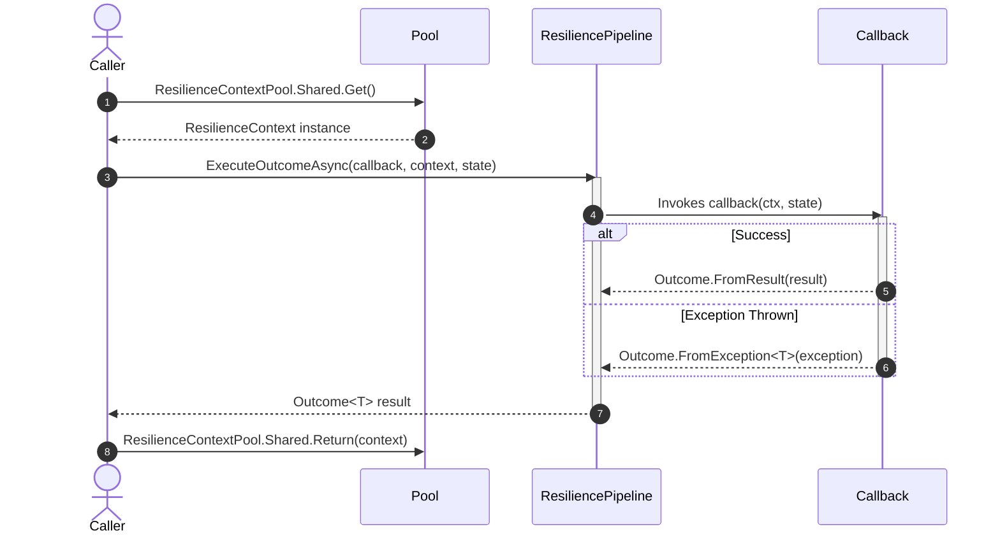

# Migration to Version 8

<details>
<summary>Relevant source files</summary>

The following files were used as context for generating this wiki page:

- [src/Snippets/Docs/Migration.Retry.cs](https://github.com/App-vNext/Polly/blob/main/src/Snippets/Docs/Migration.Retry.cs)
- [src/Snippets/Docs/Migration.CircuitBreaker.cs](https://github.com/App-vNext/Polly/blob/main/src/Snippets/Docs/Migration.CircuitBreaker.cs)
- [README.md](https://github.com/App-vNext/Polly/blob/main/README.md)
- [src/Snippets/Docs/Migration.Policies.cs](https://github.com/App-vNext/Polly/blob/main/src/Snippets/Docs/Migration.Policies.cs)
- [src/Snippets/Docs/Migration.Execute.cs](https://github.com/App-vNext/Polly/blob/main/src/Snippets/Docs/Migration.Execute.cs)
- [src/Snippets/Docs/ResiliencePipelines.cs](https://github.com/App-vNext/Polly/blob/main/src/Snippets/Docs/ResiliencePipelines.cs)
- [docs/pipelines/index.md](https://github.com/App-vNext/Polly/blob/main/docs/pipelines/index.md)
- [src/Snippets/Docs/Migration.Bulkhead.cs](https://github.com/App-vNext/Polly/blob/main/src/Snippets/Docs/Migration.Bulkhead.cs)
- [src/Polly/ResiliencePipelineConversionExtensions.cs](https://github.com/App-vNext/Polly/blob/main/src/Polly/ResiliencePipelineConversionExtensions.cs)
- [src/Snippets/Docs/Migration.Context.cs](https://github.com/App-vNext/Polly/blob/main/src/Snippets/Docs/Migration.Context.cs)
- [src/Snippets/Docs/Migration.Interoperability.cs](https://github.com/App-vNext/Polly/blob/main/src/Snippets/Docs/Migration.Interoperability.cs)
- [src/Snippets/Docs/Migration.Registry.cs](https://github.com/App-vNext/Polly/blob/main/src/Snippets/Docs/Migration.Registry.cs)
- [docs/advanced/dependency-injection.md](https://github.com/App-vNext/Polly/blob/main/docs/advanced/dependency-injection.md)
- [src/Snippets/Docs/Migration.Wrap.cs](https://github.com/App-vNext/Polly/blob/main/src/Snippets/Docs/Migration.Wrap.cs)
- [src/Snippets/Docs/Migration.Timeout.cs](https://github.com/App-vNext/Polly/blob/main/src/Snippets/Docs/Migration.Timeout.cs)
- [src/Snippets/Docs/Migration.RateLimiter.cs](https://github.com/App-vNext/Polly/blob/main/src/Snippets/Docs/Migration.RateLimiter.cs)
- [src/Polly/Utilities/Wrappers/ResiliencePipelineAsyncPolicy.cs](https://github.com/App-vNext/Polly/blob/main/src/Polly/Utilities/Wrappers/ResiliencePipelineAsyncPolicy.cs)
- [src/Polly.Core/README.md](https://github.com/App-vNext/Polly/blob/main/src/Polly.Core/README.md)
- [src/Polly/Utilities/Wrappers/ResiliencePipelineSyncPolicy.cs](https://github.com/App-vNext/Polly/blob/main/src/Polly/Utilities/Wrappers/ResiliencePipelineSyncPolicy.cs)
- [docs/getting-started.md](https://github.com/App-vNext/Polly/blob/main/docs/getting-started.md)
- [docs/advanced/performance.md](https://github.com/App-vNext/Polly/blob/main/docs/advanced/performance.md)
- [docs/migration-v8.md](https://github.com/App-vNext/Polly/blob/main/docs/migration-v8.md)
</details>

## Overview

Version 8 of Polly represents a foundational architectural redesign of the library, shifting core fault-handling abstractions from static policy objects to a unified, allocation-efficient, options-driven execution pipeline model. In Polly v7, resilience behaviors were instantiated via static builders (`Policy.Handle<T>().Retry(...)`), partitioned across four distinct policy interfaces (`ISyncPolicy`, `IAsyncPolicy`, `ISyncPolicy<T>`, `IAsyncPolicy<T>`), and composed using explicit policy wrap helpers. Version 8 unifies these models under the `ResiliencePipeline` and `ResiliencePipeline<T>` abstractions, which natively handle both synchronous and asynchronous callbacks without dual-implementation overhead.

The architectural drivers for Version 8 focus on eliminating static API bottlenecks, improving testability, embedding telemetry natively, and achieving ultra-low allocation overhead during execution. By replacing ad-hoc dictionaries with pooled contexts (`ResilienceContextPool`) and transitioning configuration to strongly-typed options classes (`RetryStrategyOptions`, `CircuitBreakerStrategyOptions`, `TimeoutStrategyOptions`), Polly v8 provides predictable runtime memory profiles. Furthermore, direct integration with modern .NET primitives—such as `System.Threading.RateLimiting` for concurrency and rate management—aligns Polly with standard platform components while offering backward-compatibility wrappers (`AsSyncPolicy()` and `AsAsyncPolicy()`) to facilitate incremental migrations.

Sources: [docs/migration-v8.md:1-18](https://github.com/App-vNext/Polly/blob/main/docs/migration-v8.md#L1-L18)

Sources: [src/Polly.Core/README.md:1-10](https://github.com/App-vNext/Polly/blob/main/src/Polly.Core/README.md#L1-L10)

## Core Architectural Differences: Policies vs. Strategies

Polly v8 replaces the terminology and execution architecture of *policies* with *resilience strategies* assembled inside *resilience pipelines*. Rather than maintaining separate synchronous and asynchronous execution paths (`WaitAndRetry` vs. `WaitAndRetryAsync`), a single `ResiliencePipeline` instance exposes unified `Execute` and `ExecuteAsync` methods capable of running sync and async callbacks alike.

The transition from v7 to v8 alters the primary configuration mechanism from fluent static factory methods to options-based builders. The following comparison outlines the fundamental structural shifts between the two versions:

| Architectural Concern | Polly v7 | Polly v8 |
| :--- | :--- | :--- |
| **Primary Abstraction** | `IAsyncPolicy`, `ISyncPolicy`, `ISyncPolicy<T>`, `IAsyncPolicy<T>` | `ResiliencePipeline`, `ResiliencePipeline<T>` |
| **Configuration Style** | Fluent static methods (`Policy.Handle<T>().Retry()`) | Options-based configuration (`new RetryStrategyOptions()`) |
| **Composition** | Explicit wrapping (`Policy.WrapAsync(...)`) | Chaining strategy extensions on a builder (`.AddRetry().AddTimeout()`) |
| **Execution Context** | `Context` (instantiated per execution) | `ResilienceContext` (pooled via `ResilienceContextPool`) |
| **Safe Execution** | `ExecuteAndCapture` / `ExecuteAndCaptureAsync` | `ExecuteOutcomeAsync` returning `Outcome<T>` |

Sources: [docs/migration-v8.md:8-18](https://github.com/App-vNext/Polly/blob/main/docs/migration-v8.md#L8-L18)

Sources: [src/Polly.Core/README.md:1-15](https://github.com/App-vNext/Polly/blob/main/src/Polly.Core/README.md#L1-L15)

Sources: [docs/migration-v8.md:8-18](https://github.com/App-vNext/Polly/blob/main/docs/migration-v8.md#L8-L18)

## Migrating Execution Pipelines and Policy Wrap

In Polly v7, combining multiple fault-handling behaviors required explicit policy wrapping via methods like `Policy.WrapAsync(retryPolicy, timeoutPolicy)`. In Polly v8, policy wrapping is natively integrated into the `ResiliencePipelineBuilder` execution chain. Strategies added earlier act as outer wrappers, while subsequently added strategies act as inner layers.

The following code illustrates how a v7 policy wrap translates into a v8 builder chain, executing the retry strategy outside of the timeout strategy:

```cs
// V8 Resilience Pipeline with integrated retry (outer) and timeout (inner)
ResiliencePipeline pipeline = new ResiliencePipelineBuilder()
    .AddRetry(new()
    {
        MaxRetryAttempts = 3,
        Delay = TimeSpan.FromSeconds(1),
        BackoffType = DelayBackoffType.Constant,
        ShouldHandle = new PredicateBuilder().Handle<Exception>()
    })
    .AddTimeout(TimeSpan.FromSeconds(3))
    .Build();
```

Sources: [src/Snippets/Docs/Migration.Wrap.cs:22-40](https://github.com/App-vNext/Polly/blob/main/src/Snippets/Docs/Migration.Wrap.cs#L22-L40)

Sources: [docs/migration-v8.md:184-204](https://github.com/App-vNext/Polly/blob/main/docs/migration-v8.md#L184-L204)

> [!NOTE]
> When building a pipeline, the order in which `.Add*()` methods are invoked determines the execution hierarchy. The first added strategy wraps all subsequent strategies.

Sources: [src/Snippets/Docs/Migration.Wrap.cs:22-40](https://github.com/App-vNext/Polly/blob/main/src/Snippets/Docs/Migration.Wrap.cs#L22-L40)

## Migrating Retry Strategies

Retry configurations in Polly v8 are defined using `RetryStrategyOptions` (or generic `RetryStrategyOptions<TResult>`) passed to the `AddRetry` builder extension. Instead of fluent modifier methods like `.OrResult(...)`, v8 uses `PredicateBuilder` or switch expressions operating on `args.Outcome`.

To disable delays between attempts, the `Delay` property must be explicitly set to `TimeSpan.Zero`. To configure infinite retries, `MaxRetryAttempts` is set to `int.MaxValue`.

The following example demonstrates migrating a reactive retry strategy handling both exceptions and specific HTTP status codes using switch expressions:

```cs
new ResiliencePipelineBuilder<HttpResponseMessage>().AddRetry(new RetryStrategyOptions<HttpResponseMessage>
{
    ShouldHandle = static args => args.Outcome switch
    {
        { Exception: SomeExceptionType } => PredicateResult.True(),
        { Result.StatusCode: HttpStatusCode.InternalServerError } => PredicateResult.True(),
        _ => PredicateResult.False(),
    },
    MaxRetryAttempts = 3,
})
.Build();
```

Sources: [src/Snippets/Docs/Migration.Retry.cs:178-192](https://github.com/App-vNext/Polly/blob/main/src/Snippets/Docs/Migration.Retry.cs#L178-L192)

Sources: [docs/migration-v8.md:400-415](https://github.com/App-vNext/Polly/blob/main/docs/migration-v8.md#L400-L415)

> [!TIP]
> Using switch expressions inside `ShouldHandle` bypasses the internal collection iteration overhead of `PredicateBuilder`, yielding optimal execution performance.

Sources: [src/Snippets/Docs/Migration.Retry.cs:178-182](https://github.com/App-vNext/Polly/blob/main/src/Snippets/Docs/Migration.Retry.cs#L178-L182)

Sources: [docs/advanced/performance.md:49-53](https://github.com/App-vNext/Polly/blob/main/docs/advanced/performance.md#L49-L53)

## Migrating Circuit Breakers and Bulkheads

Polly v8 departs from v7's standard (consecutive failure-counting) circuit breaker, supporting exclusively advanced circuit breaker semantics governed by failure ratios, sampling durations, and minimum throughput thresholds. Furthermore, `CircuitBreakerStateProvider` and `CircuitBreakerManualControl` decouple state observation and manual intervention from the strategy policy instance itself.

For bulkheads, Polly v8 eliminates the legacy standalone bulkhead implementation, replacing it with the `ConcurrencyLimiter` strategy built upon `System.Threading.RateLimiting`.

The following initialization sequence configures a circuit breaker with state providers and manual controls in v8:

```cs
CircuitBreakerStateProvider stateProvider = new();
CircuitBreakerManualControl manualControl = new();

ResiliencePipeline pipelineState = new ResiliencePipelineBuilder()
    .AddCircuitBreaker(new CircuitBreakerStrategyOptions
    {
        ShouldHandle = new PredicateBuilder().Handle<SomeExceptionType>(),
        FailureRatio = 0.5d,
        SamplingDuration = TimeSpan.FromSeconds(5),
        MinimumThroughput = 2,
        BreakDuration = TimeSpan.FromSeconds(1),
        StateProvider = stateProvider,
        ManualControl = manualControl
    })
    .Build();

// Manually control state
await manualControl.IsolateAsync(); // Transitions into the Isolated state
await manualControl.CloseAsync(); // Transitions into the Closed state
```

Sources: [src/Snippets/Docs/Migration.CircuitBreaker.cs:125-151](https://github.com/App-vNext/Polly/blob/main/src/Snippets/Docs/Migration.CircuitBreaker.cs#L125-L151)

Sources: [docs/migration-v8.md:704-763](https://github.com/App-vNext/Polly/blob/main/docs/migration-v8.md#L704-L763)

> [!WARNING]
> Guarding `.Execute` calls with pre-check evaluations of `CircuitState` (an optimization pattern common in v7) does not work reliably in v8. Instead, rely on `ExecuteOutcomeAsync` to handle exceptions gracefully without incurring exception-throwing performance penalties.

Sources: [docs/migration-v8.md:765-772](https://github.com/App-vNext/Polly/blob/main/docs/migration-v8.md#L765-L772)

## Migrating Context and Safe Execution

Execution contexts in Polly v8 are represented by `ResilienceContext`, which is rented from `ResilienceContextPool.Shared` to avoid per-invocation heap allocations. Custom property attachments require strongly-typed `ResiliencePropertyKey<T>` instances rather than untyped string indexers.

For safe execution (replacing v7's `ExecuteAndCapture` / `ExecuteAndCaptureAsync`), developers invoke `ExecuteOutcomeAsync`, which catches exceptions internally and returns an `Outcome<T>` struct containing either the result or the exception instance.

The execution flow for safe execution using `ExecuteOutcomeAsync` follows this sequence:



Sources: [src/Snippets/Docs/Migration.Execute.cs:50-132](https://github.com/App-vNext/Polly/blob/main/src/Snippets/Docs/Migration.Execute.cs#L50-L132)

Sources: [docs/migration-v8.md:928-1009](https://github.com/App-vNext/Polly/blob/main/docs/migration-v8.md#L928-L1009)

Sources: [src/Snippets/Docs/Migration.Execute.cs:60-80](https://github.com/App-vNext/Polly/blob/main/src/Snippets/Docs/Migration.Execute.cs#L60-L80)

Sources: [docs/migration-v8.md:937-956](https://github.com/App-vNext/Polly/blob/main/docs/migration-v8.md#L937-L956)

## Migrating Registries, Dependency Injection, and Interoperability

Polly v8 replaces `PolicyRegistry` with `ResiliencePipelineRegistry<TKey>` and `ResiliencePipelineProvider<TKey>`. The registry is strictly append-only to prevent race conditions during concurrent resolutions, and supports dynamic pipeline rebuilding via options reloads and resource disposal callbacks.

When full v8 migration cannot be completed immediately, Polly provides interoperability conversion extensions (`AsSyncPolicy()` and `AsAsyncPolicy()`) that wrap any `ResiliencePipeline` into legacy `ISyncPolicy` or `IAsyncPolicy` interfaces.

The following example shows how a v8 rate limiter pipeline is converted into a v7 policy for inclusion in a legacy policy wrap:

```cs
// First, create a resilience pipeline.
ResiliencePipeline pipeline = new ResiliencePipelineBuilder()
    .AddRateLimiter(new FixedWindowRateLimiter(new FixedWindowRateLimiterOptions
    {
        Window = TimeSpan.FromSeconds(10),
        PermitLimit = 100
    }))
    .Build();

// Now, convert it to a v7 policy. Note that it can be converted to both sync and async policies.
ISyncPolicy syncPolicy = pipeline.AsSyncPolicy();
IAsyncPolicy asyncPolicy = pipeline.AsAsyncPolicy();

// Finally, use it in a policy wrap.
ISyncPolicy wrappedPolicy = Policy.Wrap(
    syncPolicy,
    Policy.Handle<SomeExceptionType>().Retry(3));
```

Sources: [src/Snippets/Docs/Migration.Interoperability.cs:10-31](https://github.com/App-vNext/Polly/blob/main/src/Snippets/Docs/Migration.Interoperability.cs#L10-L31)

Sources: [src/Polly/ResiliencePipelineConversionExtensions.cs:16-37](https://github.com/App-vNext/Polly/blob/main/src/Polly/ResiliencePipelineConversionExtensions.cs#L16-L37)

> [!IMPORTANT]
> When integrating with dependency injection via `Polly.Extensions`, always use the lambda overload accepting `AddResiliencePipeline(key, (builder, context) => ...)` to access the shared `IServiceProvider` rather than calling `services.BuildServiceProvider()` inside event callbacks, which causes severe performance degradation.

Sources: [docs/advanced/dependency-injection.md:349-400](https://github.com/App-vNext/Polly/blob/main/docs/advanced/dependency-injection.md#L349-L400)

## Related

- [[Interop Bridge Mechanics]]
- [[Quick Start]]

